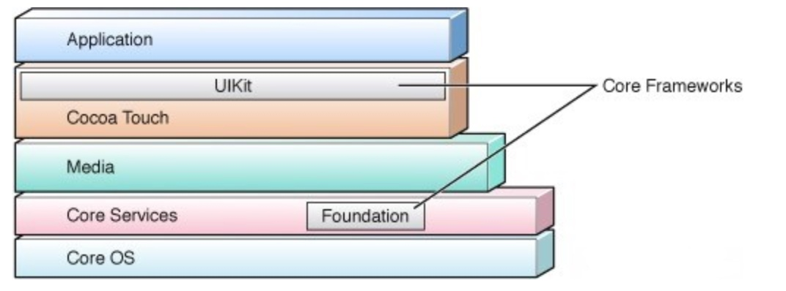
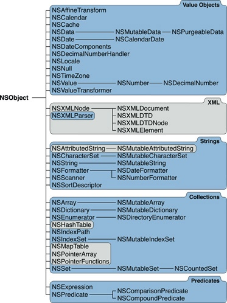
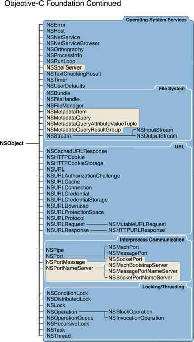
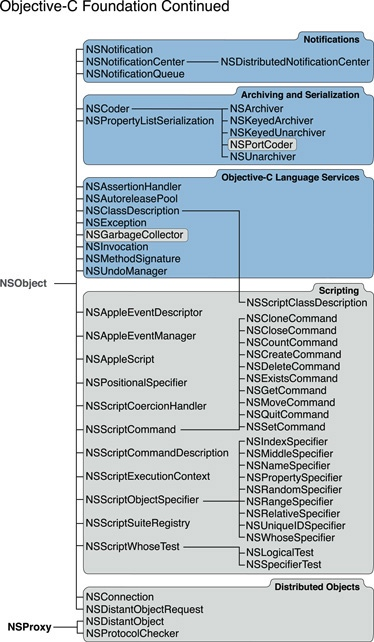
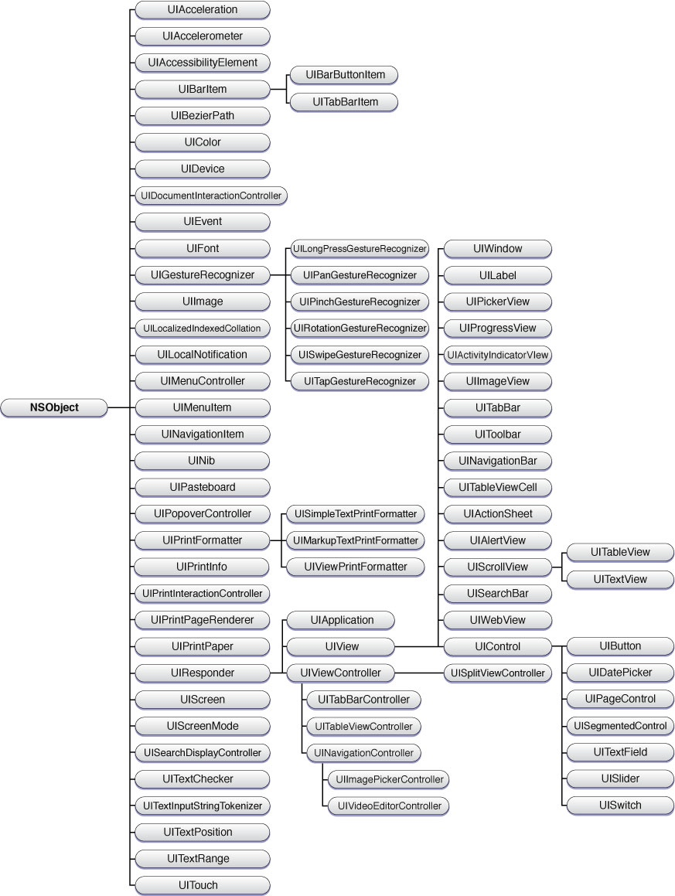

# Swift语言基础（一）
## Foundation框架
在iOS开发过程中，我们会比较频繁的听到这样一个专业名词：Foundation框架、Cocoa等。那什么是Foundation，什么是Cocoa？


***Cocoa是苹果公司为Mac OS X所创建的原生面向对象的编程环境***，是Mac OS X上五大API之一（其它四个是Carbon、POSIX、X11和Java）。

Cocoa 应用程序一般在苹果公司的开发工具Xcode（前身为Project Builder）和Interface Builder上用 Objective-C写成。不过，通过Java bridge、PasCocoa、PyObjC、CamelBones以及RubyCocoa等桥接技术，Java、Clozure CL、LispWorks、Object Pascal、Python、Perl、Ruby等其它工具或者语言也可以用来开发 Cocoa 应用。对最终用户来说，使用Cocoa编程环境开发的应用程序即为Cocoa 程序。可以这么说，Cocoa程序是由一些对象组成，而这些对象的类最后都是继承于它们的根类 ：NSObject。而且它们都是基于Objective-C运行环境的。

**Cocoa包含两个主要的Objective-C对象库，称为“框架”。框架的功能类似于动态库，即可以在运行时动态的载入应用程序的地址空间**，但框架作为一个捆绑 (计算机)而非独立文件，其中除了可执行代码外，也包含了资源，头文件和文档。
事实上Cocoa本身是一个框架的集合,它包含了众多子框架,其中最重要的要数“Foundation”和“UIKit”。前者是框架的基础,和界面无关,其中包含了大量常用的API;后者是基础的UI类库,以后我们在IOS开发中会经常用到。这两个框架在系统中的位置如下图:


**Foundation工具包，或简称为“Foundation”**，首先出现在OpenStep中。在Mac OS X中，它是基于Core Foundation的。作为通用的面向对象的函数库，Foundation提供了字符串，数值的管理，容器及其枚举，分布式计算，事件循环，以及一些其它的与图形用户界面没有直接关系的功能，其中框架中的类和常量都以**“NS”为前缀**，“NS”前缀来自于Cocoa的来源，即NeXTSTEP，它可以在Mac OS X和iOS中使用。
 
**UIKit，或称用户界面工具包（User Interface Kit）**，是用于iOS的图形用户界面工具包。与AppKit不同，它使用**“UI”为前缀**。 Cocoa 构架的一个关键部分是其多样的视图模型。

### Foundation






将上图Foundation框架中的类进行逻辑分类如下：

* 值对象
* 集合 
* 操作系统服务 包括下面三个：文件系统和URL   进程间通讯。 这个范畴中的大部分类代表不同的系统端口、套接字、和名字服务器，对实现底层的IPC很有用。NSPipe代表一个BSD管道，即一种进程间的单向通讯通道。   线程和子任务。 NSThread类使您可以创建多线程的程序，而各种锁（lock）类则为彼此竞争的线程在访问进程资源时提供各种控制机制。通过NSTask，您的程序可以分出      一个子进程来执行其它工作或进行进度监控。
* 通知
* 归档和序列化
* 表达式和条件判断
* Objective-C语言服务

### UIKit




在图中可以看出，responder 类是图中最大分支的根类，UIResponder为处理响应事件和响应链定义了界面和默认行为。当用户用手指滚动列表或者在虚拟键盘上输入时，UIKit就生成时间传送给UIResponder响应链，直到链中有对象处理这个事件。相应的核心对象，比如：UIApplication  ，UIWindow，UIView都直接或间接的从UIResponder继承。

## 基础知识（一）


### 一、语法规范
#### （一）空格
在Swift中，运算符两边需要有一致的空格，否则编译器会报错。例如下面的代码都会报错：

```swift
let a= 1 + 2
```


```swift
let b = 1+ 2
```
错误信息是：
`'=' must have consistent whitespace on both sides`

可以写成：

```swift
let a = 1 + 2
let b = 1+2
```
#### （二）分号
和其它语言不同的是，Swift不要求在每行语句的结尾使用分号(;)

```swift
let a = 1 + 2
let b = 1+2
```
但当你在同一行书写多条语句时，必须用分号隔开：

```swift
let a = 1 + 2; print(a)
```


### 二、常量和变量
常量和变量本质上是把名字（比如 Age 或者 message ）和一个指定类型的值（比如数字 10 或者字符串 "Hello" ）关联起来。两者的区别是常量的值一旦设定就不能改变，而变量的值可以随意更改。

#### 声明常量和变量
常量和变量必须在使用前声明，用 let 来声明常量，用 var 来声明变量：

```swift
let Age = 10 //let声明常量，命名上使用大驼峰命名原则
var message = "Hello" //var声明变量，命名上使用小驼峰命名原则
```
在以上代码中let是常量，在赋值为10后就不能再进行改变了，否则会报错：
`Cannot assign to value: 'Age' is a 'let' constant`

> **良好的编码习惯**：
> 如果你的代码中有不需要改变的值，请使用 let 关键字将它声明为常量。只将需要改变的值声明为变量。

### 三、类型标注

当再声明常量或者变量的时候还可以加上**类型标注（type annotation）**，说明常量或者变量中要存储的值的类型。如果要添加类型标注，需要**在常量或者变量名后面加上一个冒号和空格，然后加上类型名称。**

```swift
let Age: Int = 10  //Int就是类型标注，说明了该常量中存储了Int类型的值
var message: String = "Hello"  //String就是类型标注，说明了该变量中存储了String类型的值
```

> *Tips：*
> 你可以在一行中定义多个同样类型的变量，用逗号分割，并在最后一个变量名之后添加类型标注：

> ```swift
> var red, green, blue: String
> ```


### 四、数据类型

当我们使用任何程序语言编程时，需要使用不同的数据类型来存储不同的信息，因为变量的数据类型决定了如何将代表这些值的位存储到计算机的内存中。

#### （一）整型
通常情况下，我们不需要专门指定整数的长度。Swift 提供了一个特殊的整数类型Int，它的长度能够与当前平台的原生字长相同：

> 在32位平台上，Int和Int32长度相同。
> 在64位平台上，Int和Int64长度相同。

除了Int外，还有其他的类型：UInt(无符号整型)、Int8, Int16, Int32, Int64、UInt8, UInt16, UInt32, UInt64等，除非需要特定长度的整数，一般来说使用Int就够了，统一使用Int可以提高代码的可复用性，避免不同类型数字之间的转换，并且匹配数字的类型推断。

#### （二）浮点型
Swift 提供了两种有符号浮点数类型：

* Double 表示64位浮点数。当你需要存储很大或者很高精度的浮点数时请使用此类型。
* Float 表示32位浮点数。精度要求不高的话可以使用此类型。

#### （三）布尔型
Swift 有一个基本的布尔类型，叫做 Bool。布尔值指逻辑上的值，因为它们只能是真或者假。Swift 有两个布尔常量，true 和 false。

#### （四）可选类型
Swift使用可选类型（Optional）来处理值可能缺失的情况。可选类型表示有值或没有值。当值存在时就是具体的值内容，当值不存在时则为nil。

> 例如：
> Swift 的 Int 类型有一种构造器，作用是将一个 String 值转换成一个 Int 值。然而，并不是所有的字符串都可以转换成一个整数。字符串 "3459" 可以被转换成数字 3459 ，但是字符串 "3459X" 就不行。
> 
```swift
let IdCard = "3459"
let IdNum = Int(IdCard)
print(IdNum)
//IdNum被推测为类型 "Int?"， 或者类型 "optional Int"，所以以上的结果是：Optional(3459)
```
因为该构造器可能会失败，所以它返回一个可选类型（optional）Int，而不是一个 Int。一个可选的 Int 被写作  Int? 而不是 Int。问号暗示包含的值是可选类型，也就是说可能包含 Int 值也可能不包含值。（不能包含其他任何值比如 Bool 值或者 String 值。要么是 Int 或者什么都没有，什么都没有就会返回nil。）

```swift
let IdCard = "3459X"
let IdNum = Int(IdCard)
print(IdNum)
//因为IdCard的值时"3459X"，包含字符X所以无法转换成Int型，那么以上的结果是：nil
```

#### 声明可选类型
进行类型标注时，类型的后面加上"?"即可将改变声明成对应的可选类型：

```swift
let NickName: String? = "Nicole"
```
当确定可选类型确实包含值之后，我们可以在可选的名字后面加一个感叹号（!）来获取值。这个惊叹号表示“我知道这个可选有值，请使用它。”这被称为可选值的强制解析（forced unwrapping）：

```swift
let NickName: String? = "Nicole"
print(NickName!)
//以上代码输出结果为：Nicole
```

#### 隐式解析可选类型

在使用可选类型时我们常常会用到可选绑定来判断是否有值，进而才执行下一步操作。但是，在我们可以明确知道一个可选类型肯定有值的。那么，每次都要再判断和解析可选值的话效率时非常低效的，如何解决该问题呢？

可以通过**隐式解析**来实现。这种类型的可选状态被定义为隐式解析可选类型（implicitly unwrapped optionals）。即把想要用作可选的类型的后面的问号（String?）改成感叹号（String!）来声明一个隐式解析可选类型。

```swift
let NickName: String! = "Nicole"
let FirstName: String = NickName
print(FirstName)
```

### 类型别名
类型别名（type aliases）就是给现有类型定义另一个名字。可以使用typealias关键字来定义类型别名。
当你想要给现有类型起一个更有意义的名字时，类型别名非常有用：

```swift
typealias Sex = Bool
let male: Sex = true
print(type(of: male))
//输出的结果是：Bool。type(of: T)函数可以输出参数的数据类型
```

### 类型安全与类型推断

#### 类型安全
Swift 是一门**类型安全**（type safe）的语言。类型安全的语言可以让我们清楚地知道代码要处理的值的类型。如果代码中需要一个String值，绝对不允许传入Int型或其他类型的值。

由于 Swift 是类型安全的，所以它会在编译你的代码时进行类型检查（type checks），并***把不匹配的类型标记为错误***。这可以让你在开发的时候尽早发现并修复错误。当你要处理不同类型的值时，类型检查可以帮你避免错误。

#### 类型推断
_因为Swift会进行类型检查，那么是不是说每次声明常量和变量的时候都需要显式指定类型？_

不是的，如果没有显式指定类型，***Swift 会使用类型推断（type inference）来选择合适的类型***。有了类型推断，编译器可以在编译代码的时候自动推断出表达式的类型。原理很简单，只要检查你赋的值即可。

_如何触发类型推断呢？_

当你声明常量或者变量并赋初值的时候类型推断非常有用。当你在声明常量或者变量的时候赋给它们一个字面量（literal value 或 literal）即可触发类型推断。（字面量就是会直接出现在你代码中的值，比如 42 和 3.14159 。）

```swift
let Age = 42
// Age 会被推测为 Int 类型

let pi = 3.14159
// pi 会被推测为 Double 类型
```

> ***Tips：***
> 当推断浮点数的类型时，Swift 总是会选择 Double 而不是Float。如果表达式中同时出现了整数和浮点数，会被推断为 Double 类型：
> 
```swift
let anotherPi = 3 + 0.14159
// anotherPi 会被推测为 Double 类型
```

### 数值类型转换

上面给大家介绍了不同的数据类型以及Swift的类型检查，那么我们如果对两种不同的数据类型运算则也会报错：

```swift
var a = 10
var b = 0.7
print(a+b)
//a被推断为Int型，b被推断为Double，两种类型不同的值是无法直接运算的，所以会报错，错误信息为：
//Binary operator '+' cannot be applied to operands of type 'Int' and 'Double'
```

那么此时就需要将其中一种数据类型转换成另一种数据类型后才可以进行运算：

```swift
var a = 10
var b = 0.7
print(Double(a)+b)
```
以上通过函数Double()将Int型的a转换成了Double类型的值，Float同理。对于其他类型的值转换成Int型，可以使用Int()函数，基本上大部分常规类型都可以使用"类型名()"的构造器来进行类型转换。

### 元祖类型
元组（tuples）把多个值组合成一个复合值。元组内的值可以是任意类型，并不要求是相同类型。

元祖主要使用的两种声明方式：

```swift
let http404Error = (404, "Not Found")
//当需要访问元祖中的值时可以使用索引0,1,2...来访问
print(http404Error.0)
print(http404Error.1)
```


```Swift
let http200Status = (code: 200, message: "OK")
//当需要访问元祖中的值时可以使用code和message属性来访问
print(http200Status.code)
print(http200Status.message)
```
> ***Tips:***
> 1. 建议使用第二种方式，可读性较强。
> 2. 如果只需要一部分元组值，分解的时候可以把要忽略的部分用下划线"_"：
> 
> ```swift
> let http200Status = (code: 200, _: "OK")
> print(http200Status.code)
> ```
> 3.元组在临时组织值的时候很有用，但是并不适合创建复杂的数据结构。如果你的数据结构并不是临时使用，请使用类或者结构体而不是元组。


