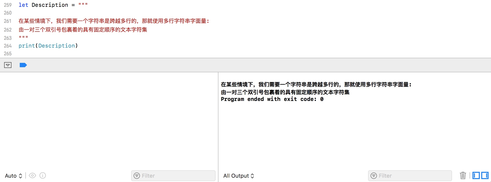
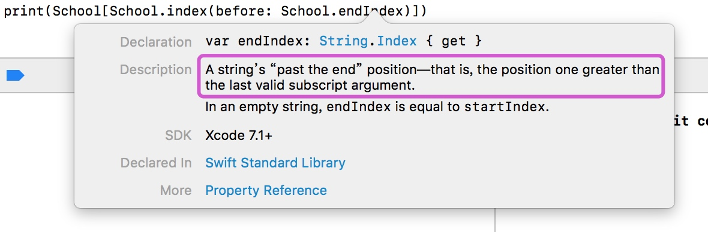

# Swift语言基础（二）

## 字符串与字符

字符串是有序的Character（字符）类型的值的集合，例如："Anhui Institute of Information Technology"，"Hello Swift"。用String类型来表示。 一个String的内容可以用许多方式读取，包括作为一个Character值的集合。

> **注意：**
> Swift的String类型是基于 Unicode 标量建立的。 Unicode 标量是对应字符或者修饰符的唯一的21位数字，例如U+0061表示小写的拉丁字母(LATIN SMALL LETTER A)("a")，U+1F425表示小鸡表情(FRONT-FACING BABY CHICK) ("🐥")。
> 
```swift
let a = "a"
let anotherA = "\u{0061}"
//U+0061表示小写拉丁字母a，在以上例子中常量a与anotherA都表示小写字母a，长度都为1
let Chicken = "\u{1F425}"
//U+1F425表示小鸡表情
```

每一个Swift的Character类型代表一个可扩展的字形群。 一个可扩展的字形群是一个或多个可生成人类可读的字符 Unicode 标量的有序排列。

```swift
let regionalIndicatorForUS: Character = "\u{1F1FA}\u{1F1F8}"
// regionalIndicatorForUS 是 🇺🇸  长度是1
```
以上代码中的常量regionalIndicatorForUS，由两个地域性指示符号的 Unicode 标量组合成了一个单一的Character值：

`REGIONAL INDICATOR SYMBOL LETTER U(U+1F1FA)`
`REGIONAL INDICATOR SYMBOL LETTER S(U+1F1F8)`

所以，在Swift中使用可拓展的字符群集作为Character值来连接或改变字符串时，并不一定会更改字符串的字符数量。

#### 字符串初始化
我们可以使用字面量的方式来初始化字符串：

```swift
let School = "Anhui Institute of Information Technology"
var emptyString = ""
```

也可以通过String的构造器来创建字符串：

```swift
let Grade = String()
var anotherString = String("another String")
```

还可以通过Character数组来初始化：

```swift
let Hello: [Character] = ["h", "e", "l", "l", "o"] 
let helloString = String(Hello) 
```

> ***Tips:***
> 默认情况下我们通过字符串构造器或字面量创建出来的都是String类型的，如果我们需要创建Character字符类型，那么在声明时是需要标准类型的，如下：

> ```swift
> let str: Character = "S"
> print(type(of: str))
> //结果为：Character
> ```

#### 多行字符串
在某些情境下，我们需要一个字符串是跨越多行的，那就使用多行字符串字面量：***由一对三个双引号包裹着的具有固定顺序的文本字符集***，如下：

```swift
let Description = """
在某些情境下，我们需要一个字符串是跨越多行的，那就使用多行字符串字面量:
由一对三个双引号包裹着的具有固定顺序的文本字符集
"""
print(Description)
```

一个多行字符串字面量包含了所有的在开启和关闭引号（"""）中的行。这个字符从开启引号(""")之后的第一行开始，到关闭引号(""")之前为止。所以如果第一行是换行符即空行的话，那么其内容也会包含空行的，如下：

```swift
let Description = """

在某些情境下，我们需要一个字符串是跨越多行的，那就使用多行字符串字面量:
由一对三个双引号包裹着的具有固定顺序的文本字符集
"""
print(Description)
```
代码运行结果如下图：



#### 字符串类型
Swift中的String类型是**值类型**。 如果创建了一个新的字符串，那么当其进行常量、变量赋值操作，或在函数/方法中传递时，会进行**值拷贝**。 任何情况下，都会对已有字符串值创建新副本，并对该新副本进行传递或赋值操作。 Swift 默认字符串拷贝的方式保证了在函数/方法中传递的是字符串的值。并且可以确信传递的字符串不会被修改，除非你自己去修改它。

在实际编译时，Swift 编译器会优化字符串的使用，使实际的复制只发生在绝对必要的情况下，这意味着将字符串作为值类型的同时可以获得极高的性能。

#### 字符串常用属性

**characters**
在 Swift 中，每一个 Character 类型实例都代表单个可扩展的字形群集——即由一个或多个 Unicode 标量的序列组成的一个可读字符。所以Swift 中 String 类型，说白了就是 Character 类型实例的集合。我们通过characters，就可以去遍历字符串中的每个字符了：

```swift
let School = "Anhui Institute of Information Technology"
for c in School.characters {
    print(c)
}
```
**first**
获取字符串中的**第一个字符**，是一个可选类型的属性，如果字符串为空，则返回nil

**last**
获取字符串中的**最后一个字符**，是一个可选类型的属性，如果字符串为空，则返回nil

 **isEmpty**
当我们需要判断某个字符串是否为空时，可以通过isEmpty属性来判断，该属性会返回Bool类型的值。

**count**
该属性用来获取字符串的长度，即该字符串中字符的个数：

```swift
let School = "Anhui Institute of Information Technology"
print(School.count)
//结果为：41
```
对于获取字符串长度我们也可以通过另外一种方式来获取：

```swift
let School = "Anhui Institute of Information Technology"
print(School.characters.count)
//结果为：41
```
或者还可以通过Objective-C中的方式来获取：

```swift
let School = "Anhui Institute of Information Technology"
print((School as NSString).length)
//结果为：41
```
**startIndex**
该属性可以获取一个 String 的第一个 Character 的索引，注意startIndex是String.Index类型

```swift
let School = "Anhui Institute of Information Technology"
print(School[School.startIndex])
//结果为：A
```
**endIndex**
该属性可以获取字符串的结尾，需要注意的是endIndex获取的是Character字符集sequence的结尾，即最后一个Character的后一个索引，是不能访问的（如果 String为空，则 startIndex 与 endIndex 相等）； 



```swift
let School = "Anhui Institute of Information Technology"
print(School[School.index(before: School.endIndex)])
//访问最后一个字符y
```
如上，如果要获取最后一个元素，则需要通过School.index(before: School.endIndex)先获取最后一个有效元素的索引，然后就可以通过该索引来获取了。

关于startIndex与endIndex的使用，如下：

```swift
let greeting = "Guten Tag!"
greeting[greeting.startIndex]
// G
greeting[greeting.index(before: greeting.endIndex)]
// !
greeting[greeting.index(after: greeting.startIndex)]
// u
let index = greeting.index(greeting.startIndex, offsetBy: 7)
greeting[index]
// a
```

#### 字符串常用操作

##### 拼接
字符串拼接需要确保字符串是个变量，因为常量无法修改。
**+**
*字符串可以通过加法运算符（+）相加在一起（或称“连接”）创建一个* **新的字符串**

```swift
let FirstName = "Bob"
let LastName = "Marly"
var fullName = FirstName + LastName
print(fullName)
//结果为：BobMarly
```
**+=**

*我们也可以通过加法赋值运算符 (+=) 将一个字符串添加到一个* **已经存在字符串上**

```swift
var message = "Hello"
let subStr = " Swift"
message += subStr
print(message)
//结果为：Hello Swift
```

**append()**

另外，我们还可以通过append()方法将一个字符附加到另一个字符串变量的尾部：

```swift
var message = "Hello"
message.append(" Swift")
print(message)
```
> ***Tips：***
> 对于字符串拼接方法append(),还提供了其他的重载函数，如：

> ```swift
> var message = "Hello"
> message.append("!")
> print(message)
> //append(c: Character)拼接上一个字符
> ```
> 
```swift
var message = "Hello"
message.append(contentsOf: "\u{1F425}")//也可以使用message.append(contentsOf: " Swift")
//append(contentsOf: Sequence)拼接上一个字形群(\u{1F425}为Unicode标量，表示小鸡表情)
```
> 

需要注意的是，如果我们声明的是字符变量，那么是无法对字符变量进行拼接操作的：

```swift
var message: Character = "H"
message += "i"
//报错：Cannot convert value of type 'Character' to expected argument type 'inout String'

var msg: Character = "H"
msg.append(contentsOf: "i")
//报错：Value of type 'Character' has no member 'append'
```

**多行字符串拼接**

```swift
let str1 = """
one
two
"""
let str2 = """
three
"""
print(str1 + str2)
// 打印两行:
// one
// twothree
```
在上例中，拼接时会直接将str2的内容拼接到str1的结尾处。如果我们想要在拼接多行字符串时都换行，则需要在上一个多行字符串的末尾添加上换行符，如下：

```swift
let str1 = """
one
two

"""
let str2 = """
three
"""
print(str1 + str2)
// 打印三行:
// one
// two
// three
```

#####字符串插值

字符串插值是一种构建新字符串的方式，可以在其中包含常量、变量、字面量和表达式。字符串字面量和多行字符串字面量都可以使用字符串插值。 插入的字符串字面量的每一项都在以反斜线为前缀的圆括号中：

```swift
let a = 20
let b = 100
var sum: String
sum = "\(a) + \(b) = \(a + b)"
print( sum )
//输出结果为：20 + 100 = 120
```

> ***注意：***
> 插值字符串中写在括号中的表达式不能包含非转义反斜杠 `\`，并且不能包含回车或换行符。不过，插值字符串可以包含其他字面量。
> 
>```swift
>let a = 20
let b = 100
var sum: String
sum = "\(\a) + \(b) = \(a + b\n)"
print( sum )
//代码报错
>```

##### 字符串索引

在Swift中，每一个String值都有一个关联的索引(index)类型：***String.Index***，它对应着字符串中的每一个Character的位置。因为不同的字符可能会占用不同数量的内存空间，所以要知道Character的确定位置，就必须从String开头遍历每一个 Unicode 标量直到结尾，因此，Swift 的字符串不能用整数(integer)做索引。
上文中讲也讲到了，使用startIndex属性可以获取一个String的第一个Character的索引。使用endIndex属性可以获取最后一个Character的后一个位置的索引。因此，endIndex属性不能作为一个字符串的有效下标。

**index(before: String.Index)** 用来获取前一个索引
**index(after: String.Index)** 用来获取后一个索引
**index(String.Index, offsetBy: Int)** 用来获取对应偏移量的索引，可以避免多次调用`index(before: String.Index)` 或 `index(after: String.Index)` 方法
**index(of: Character)** 用来获取字符串中指定字符的索引

结合String下标语法，我们就可以获取字符串中特定索引的字符：

```swift
let greeting = "Guten Tag!"
greeting[greeting.startIndex]
// G
greeting[greeting.index(before: greeting.endIndex)]
// !
greeting[greeting.index(after: greeting.startIndex)]
// u
let index = greeting.index(greeting.startIndex, offsetBy: 7)
greeting[index]
// a
```

##### 字符串操作

**1. 插入**
***insert(Character, at: String.Index)***
此方法可以在字符串的指定索引位置，插入**一个字符**

```swift
var str = "Hi"
str.insert("~", at: str.startIndex)
//～Hi
```

***insert(contentsOf: Collection, at: String.Index)***
此方法可以在字符串的制定索引位置，插入**一个字符串**

```swift
var str = "Hi"
str.insert(contentsOf: "Swift", at: str.endIndex)
//HiSwift
```

**2. 删除**

***remove(at: String.Index)***
此方法可以删除字符串制定索引位置的**一个字符**，并**返回被删除的字符**

```swift
var str = "Hi, Swift!"
print(str.remove(at: str.startIndex))
print(str)
//H
//i, Swift!
```

***removeSubrange(Range\<String.Index\>)***
此方法可以在一个字符串的指定索引**删除一个子字符串**。

```swift
var str = "Hi, Swift!"
str.removeSubrange(str.startIndex..<str.index(str.startIndex, offsetBy: 3))
print(str)
//Swift!
```

**3. 子字符串**
子字符串，SubString类型，可以通过**prefix(Int)**等方法来获取制定长度的子字符串，方法中的参数即为需要获取的子字符串长度。

```swift
var str = "Hi, Swift!"
print(str.prefix(2))
//获取前2个字符

var str = "Hi, Swift!"
print(str.suffix(2))
//获取末尾2个字符

var str = "Hi, Swift!"
var index = str.index(of: ",") ?? str.endIndex
print(str[..<index])
//Hi
```

Swift 里的 SubString 绝大部分函数都跟 String 一样，意味着我们可以使用同样的方式去操作 SubString 和 String。然而，跟 String 不同的是，你只有在短时间内需要操作字符串时，才会使用 SubString。当需要长时间保存结果时，就把 SubString 转化为 String 的实例：

```swift
var str = "Hi, Swift!"
var index = str.index(of: ",") ?? str.endIndex
var beginning = str[..<index]

// 把结果转化为 String 以便长期存储。
let newString = String(beginning)
```

**4. 字符串分割**
通过split(separator: Character)方法，按照传入的Character参数来对字符串进行分割，并返回SubString类型的数组

```swift
var str = "Hi,Swift!"
print(str.split(separator: ","))
//["Hi", "Swift!"]
```

**4. 字符串比较**
Swift 提供了三种方式来比较字符串：字符串字符相等、前缀相等和后缀相等。

***字符串/字符相等***
字符串/字符可以用等于操作符`==`和不等于操作符`!=`进行比较

```swift
var str1 = "Hi, Swift!"
var str2 = "Hi"
print(str1 == str2)
//false
```
如果两个字符串（或者两个字符）的可扩展的字形群集是标准相等的，那就认为它们是相等的。在这个情况下，即使可扩展的字形群集是有不同的 Unicode 标量构成的，只要它们有同样的语言意义和外观，就认为它们标准相等。


```swift
var str1 = "a"
var str2 = "\u{0061}"
print(str1 == str2)
//true
```

***前缀/后缀相等***
通过调用字符串的**hasPrefix(String)**或者**hasSuffix(String)**方法来检查字符串是否拥有特定前缀/后缀，两个方法均接收一个String类型的参数，并返回一个布尔值。

```swift
var str = "Hi, Swift!"
print(str.hasPrefix("Hi,"))
print(str.hasSuffix("ft!"))
//true
//true
```


