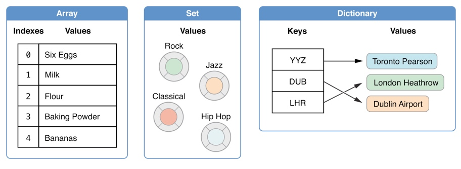
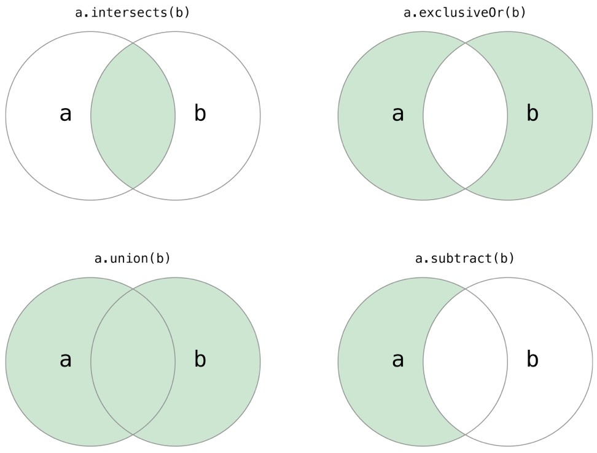

# Swift语言基础（三）

## 集合

在Swift中，有Array、Set和Dictionary三种基本的集合类型用来存储集合数据：
**数组（Array）**是有序数据的集。
**集合（Set）**是无序无重复数据的集。
**字典（Dictionary）**是无序的键值对的集。




Swift 语言中的Array、Dictionary和Dictionary中存储的数据值类型必须明确。这意味着我们不能把不正确的数据类型插入其中。同时这也说明我们完全可以对取回值的类型非常自信。

### 数组（Set）
数组使用**有序**列表存储**同一类型**的多个值。相同的值可以多次出现在一个数组的不同位置中。

#### 基本语法
Swift 数组应该遵循像**Array\<Element>**这样的形式，其中Element是这个数组中唯一允许存在的数据类型。我们也可以使用像**[Element]**这样的简单语法。尽管两种形式在功能上是一样的，但是推荐较短的语法。

***1. 构建数组***

```swift
var someInts1 = [Int]()
var someInts2 = Array<Int>()
var someInts3: [Int] = [] 
var someInts4 = [1, 2, 3, 4]
```

Swift 中的Array类型还提供一个可以创建特定大小并且所有数据都被默认的构造方法。我们可以把准备加入新数组的数据项数量（count）和适当类型的初始值（repeating）传入数组构造函数：**Array(repeating: , count: )**

```swift
var arr = Array(repeating: "V", count: 3)
print(arr)
//["V", "V", "V"]
```

#### 数组常用属性

**first**
获取数组的**第一个元素**，是一个可选类型的属性，如果数组为空，则返回nil

**last**
获取数组的**最后一个元素**，是一个可选类型的属性，如果数组为空，则返回nil

 **isEmpty**
当我们需要判断数组是否为空时，可以通过isEmpty属性来判断，该属性会返回Bool类型的值。

**count**
该属性用来获取数组元素的个数。

**startIndex**
该属性可以获取数组**第一个元素的索引**，注意与String的不同的是此属性是Int类型的，startIndex始终为0。

**endIndex**
该属性可以获取数组**最后一个元素的后一个索引**，注意与String的不同的是此属性是Int类型的，数组不为空时，endIndex的值等于count；当数组为空时，endIndex为0。


#### 数组操作

**数组拼接**

*1. 两个数组通过加号`+`相拼接成一个新数组*

```swift
var aArray = Array(repeating: "a", count: 3)
var bArray = Array(repeating: "b", count: 3)
var newArray = aArray + bArray
print(newArray)
//["a", "a", "a", "b", "b", "b"]
```

*2. 在一个数组末尾通过`+=`拼接上另一个数组*

```swift
var aArray = Array(repeating: "a", count: 3)
aArray += Array(repeating: "b", count: 3)
print(aArray)
```

**数组添加元素**

*1. 通过append()方法向数组末尾添加一个元素*

```swift
var array1: [Int] = [1, 2, 3, 4, 7, 9]
array1.append(10)
print(array1)
//[1, 2, 3, 4, 7, 9, 10]
```

*2. 通过append(contentsOf:)方法向数组末尾添加一组元素*

```swift
var array2: [String] = ["A", "B", "C"]
array2.append(contentsOf: ["S", "Y", "Z"])
print(array2)
//["A", "B", "C", "S", "Y", "Z"]
```

**数组插入元素**

*1. 通过insert(Int, at: Int)方法在数组的指定索引位置插入新元素*

```swift
var array1: [Int] = [1, 2, 3, 4, 7, 9]
array1.insert(100, at: 3)
print(array1)
//[1, 2, 3, 100, 4, 7, 9]
```

*2. 通过insert(contentsOf: Collection, at: Int)方法在数组的指定索引位置插入数组*

```swift
var array1: [Int] = [1, 2, 3, 4, 7, 9]
array1.insert(contentsOf: [7, 77], at: 3)
print(array1)
//[1, 2, 3, 7, 77, 4, 7, 9]
```

**修改数组元素**

*1. 通过replaceSubrange(Range\<Int>, with: Collection)方法来替换数组中指定索引的元素*

```swift
var array1: [Int] = [1, 2, 3, 4, 7, 9]
array1.replaceSubrange(0..<3, with: [0, 0, 0])
print(array1)
//[0, 0, 0, 4, 7, 9]

var array2: [Int] = [1, 2, 3, 4, 7, 9]
array2[0..<3] = [0, 0, 0]
print(array2)
//[0, 0, 0, 4, 7, 9]

var array3: [Int] = [1, 2, 3, 4, 7, 9]
array3[0..<3] = [0, 0]
print(array3)
//[0, 0, 4, 7, 9]
```

**删除数组元素**

删除方法与插入方法类似

*1. 通过remove(at: Int)方法来删除置顶索引位置的元素，并返回被删除的元素*

*2. 通过removeFirst()方法来删除第一个元素，并返回被删除的元素*

*3. 通过removeLast()方法来删除最后一个元素，并返回被删除的元素*

*4. 通过removeAll()方法来删除所有元素*

*5. 通过removeSubrange(Range\<Int>)方法来删除指定范围的元素*

**数组遍历**

*1. 使用for-in循环来遍历所有数组中的数据项*

*2. 如果我们同时需要每个数据项的值和索引值，可以使用enumerated()方法来进行数组遍历。enumerated()返回一个由每一个数据项索引值和数据值组成的元组。我们可以把这个元组分解成临时常量或者变量来进行遍历：*

```swift
var shoppingList: [String] = ["Eggs", "Milk", "Chocolate Spread", "Cheese", "Butter"]

for (index, value) in shoppingList.enumerated() {
    print("Item \(String(index + 1)): \(value)")
}
// Item 1: Eggs
// Item 2: Milk
// Item 3: Chocolate Spread
// Item 4: Cheese
// Item 5: Butter
```

###集合（Set）

集合(Set)用来存储**相同类型**并且**没有确定顺序**的值。当集合元素顺序不重要时或者希望确保**每个元素只出现一次**时可以使用集合而不是数组。

####基本语法

Swift 中的Set类型被写为Set<Element>，这里的Element表示Set中允许存储的类型，和数组不同的是，集合没有等价的简化形式。


```swift
var someInts1 = Set<Int>()
var someInts2: Set<Int> = []
var someInts3: Set<Int> = [1, 2, 3, 4]
```

**Tips:**
一个Set类型不能从数组字面量中被单独推断出来，因此Set类型必须显式声明。不过，由于 Swift 的类型推断功能，如果你想使用一个数组字面量构造一个Set并且该数组字面量中的所有元素类型相同，那么你无须写出Set的具体类型。someInts3的构造形式可以采用简化的方式代替：

```swift
var someInts3: Set = [1, 2, 3, 4]
```

#### 集合常用属性

**count**
与数组一样，也可以通过count来获取集合中元素的个数

**isEmpty**
当我们需要判断集合是否为空时，可以通过isEmpty属性来判断，该属性会返回Bool类型的值。

**first**
获取集合的**第一个元素**，是一个可选类型的属性，如果集合为空，则返回nil

**startIndex**
该属性可以获取集合中第一个元素的索引，注意startIndex是Set.Index类型，我们也可以配合下表访问的方式去获取集合中的元素：


```swift
var set1: Set = [1, 2, 3, 4, 5]
print(set1[set1.index(set1.startIndex, offsetBy: 2)])
//3
```

**endIndex**
该属性可以获取集合结尾，与String的属性类似，endIndex获取的集合中最后一个元素的后一个索引，是不能访问的（如果集合为空，则 startIndex 与 endIndex 相等）； 

#### 集合常用操作

**遍历集合**
与数组类似，遍历集合可以通过for-in循环来遍历，不过如果需要按照**特定顺序**来遍历一个Set中的值可以使用**sorted()**方法，它将**返回一个有序数组**。

```swift
var set1: Set<Int> = [4, 3, 2, 1, 5]
for ele in set1.sorted() {
    print(ele)
}
// 1
// 2
// 3
// 4
// 5
```

**添加元素**
通过**insert(_:)**方法可向集合中添加新元素

**删除元素**

*1.remove(_:)*

通过remove(_:)方法可删除集合元素，如果该值是该Set的一个元素则删除该元素，并返回被删除的元素值，否则如果该Set不包含该值，则返回nil。

```swift
var set1: Set<Int> = [1, 2, 3, 4, 5]
set1.remove(4)
```

*2.remove(at: Set<Int>.Index)*

通过remove(at: Set<Int>.Index)方法可删除指定索引位置的集合元素，并返回被删除的元素值。

```swift
var set1: Set = [1, 2, 3, 4, 5]
set1.remove(at: set1.index(set1.startIndex, offsetBy: 2))
```

*3.removeFirst()*
通过removeFirst()方法可以删除集合中的第一个元素，并返回被删除的元素值。

*4.removeAll()*
另外，Set中的所有元素可以通过removeAll()方法进行删除。


*5.contains(_:)*
通过contains(_:)方法可以检查Set中是否包含一个特定的元素

```swift
var someInts3: Set = [1, 2, 3, 4]
print(someInts3.contains(7))
//false
```

**基本操作**




* 使用 intersection(_:)方法，将两个集合的交集创建新集合；


```swift
var set1: Set<Int> = [15, 25, 35, 45, 55]
var set2: Set<Int> = [10, 20, 30, 40, 50]
var set3: Set<Int> = [10, 15, 30, 35, 50, 55]
print(set1.intersection(set3))
//set1与set3的交集
//[35, 15, 55]
```

* 使用 symmetricDifference(_:)方法，将两个集合除交集以外的值创建新的集合；

```swift
var set1: Set<Int> = [15, 25, 35, 45, 55]
var set2: Set<Int> = [10, 20, 30, 40, 50]
var set3: Set<Int> = [10, 15, 30, 35, 50, 55]
print(set1.symmetricDifference(set3))
//两个集合并集中去掉交集
//[25, 10, 30, 50, 45]
```

* 使用 union(_:)方法，将两个集合的并集创建新集合；

```swift
var set1: Set<Int> = [15, 25, 35, 45, 55]
var set2: Set<Int> = [10, 20, 30, 40, 50]
var set3: Set<Int> = [10, 15, 30, 35, 50, 55]
print(set1.union(set3))
//两个集合的并集
//[25, 10, 30, 55, 15, 50, 45, 35]
```
* 使用 subtracting(_:)方法，根据不在该集合中的值创建一个新的集合。 

```swift
var set1: Set<Int> = [15, 25, 35, 45, 55]
var set2: Set<Int> = [10, 20, 30, 40, 50]
var set3: Set<Int> = [10, 15, 30, 35, 50, 55]
print(set1.subtracting(set3))
//set1集合中的元素，不在set3集合中的有24，45。所以根据这两个值创建一个新的集合
//[25, 45]
```

**集合关系判断**

**\==**
使用“是否相等”运算符(==)来判断两个集合是否**包含全部相同**的值。

**isSubset(of:)**
使用isSubset(of:)方法来判断一个集合中的值是否也被包含在另外一个集合中。两个集合可能相等。

**isSuperset(of:)**
使用isSuperset(of:)方法来判断一个集合中包含另一个集合中所有的值。两个集合可能相等。

**isStrictSubset(of:)或者isStrictSuperset(of:)**
使用isStrictSubset(of:)或者isStrictSuperset(of:)方法来判断一个集合是否是另外一个集合的子集合或者父集合**并且两个集合并不相等**。


```swift
var set1: Set<Int> = [15, 25, 35, 45, 55]
var set2: Set<Int> = [15, 25, 35, 45, 55]
var set3: Set<Int> = [10, 20, 30, 40, 50]
var set4: Set<Int> = [10, 15, 30, 35, 50, 55]

print(set1.isSubset(of: set2))
print(set1.isSuperset(of: set2))
print(set1.isStrictSubset(of: set2))
// true
// true
// false
// false
```

**isDisjoint(with:)**
使用isDisjoint(with:)方法来判断两个集合是否不含有相同的值(是否没有交集)。

### 字典（Dictionary）
字典是一种存储多个相同类型的值的容器。**每个值（value）都关联唯一的键（key）**，键作为字典中的这个值数据的标识符。和数组中的数据项不同，字典中的数据项并**没有具体顺序**。我们在需要通过标识符（键）访问数据的时候使用字典，这种方法很大程度上和我们在现实世界中使用字典查字义的方法一样。

#### 基本语法

Swift 的字典使用Dictionary<Key, Value>定义，其中Key是字典中键的数据类型，Value是字典中对应于这些键所存储值的数据类型。不过也可以用[Key: Value]这样简化的形式去创建一个字典类型。虽然这两种形式功能上相同，但是后者是首选。


```swift
var dic1: Dictionary<Int, String> = [1: "Swift", 2: "C++", 3: "C#", 4: "PHP"]
var dic2: [Int: String] = [1: "Swift", 2: "C++", 3: "C#", 4: "PHP"]
var dic3 = [1: "Swift", 2: "C++", 3: "Java", 4: "PHP"]
/*和数组一样，我们在用字典字面量构造字典时，如果它的键和值都有各自一致的类型，那么就不必写出字典的类型。 
dic3字典也可以用这种简短方式定义。
*/
var dic4 = Dictionary<Int, String>()
var dic5: [Int: String] = [:]
```

#### 字典常用属性

**count**
与数组一样，也可以通过count来获取字典中元素的个数

**isEmpty**
当我们需要判断字典是否为空时，可以通过isEmpty属性来判断，该属性会返回Bool类型的值。

**keys**
我们可以通过keys属性，获取字典中的所有key，以数组形式返回。

```swift
var dic1: Dictionary<Int, String> = [1: "Swift", 2: "C++", 3: "C#", 4: "PHP"]
var dic2: [Int: String] = [1: "Swift", 2: "C++", 3: "C#", 4: "PHP"]
var dic3 = [1: "Swift", 2: "C++", 3: "Java", 4: "PHP"]
var dic4 = Dictionary<Int, String>()
var dic5: [Int: String] = [:]
print(dic1.keys.sorted())
// [1, 2, 3, 4]
```

**values**
我们可以通过values属性，获取字典中的所有value，以数组形式返回。

```swift
var dic1: Dictionary<Int, String> = [1: "Swift", 2: "C++", 3: "C#", 4: "PHP"]
var dic2: [Int: String] = [1: "Swift", 2: "C++", 3: "C#", 4: "PHP"]
var dic3 = [1: "Swift", 2: "C++", 3: "Java", 4: "PHP"]
var dic4 = Dictionary<Int, String>()
var dic5: [Int: String] = [:]
print(dic1.values.sorted())
// ["C#", "C++", "PHP", "Swift"]
```

#### 字典常用操作

**添加与修改键值对**

*1.通过下标语法来添加与修改*

```swift
var dic = Dictionary<String, String>()
dic["iOS"] = "Swift"
print(dic)
// 当key存在时修改对应的value，当key不存在时添加键值对 
// ["iOS": "Swift"]
```

*2.通过方法updateValue(String, forKey: String)来添加与修改*

```swift
var dic = Dictionary<String, String>()
dic.updateValue("Swift", forKey: "iOS")
print(dic)
// 当key存在时修改对应的value，当key不存在时添加键值对 
// ["iOS": "Swift"]
```

> **注意：**
> 下标法与updateValue方法两者都可以用来修改和添加值，不过需要注意的是，**updateValue方法会返回key所对应的原值**。即如果是添加操作，则updateValue返回的是nil，如果是修改，那么updateValue会返回key所对应的修改之前的值。

> ```swift
> var dic = ["Web": "HTML"]
> print(dic.updateValue("Swift", forKey: "iOS"))
> // 添加键值对，所以返回nil
> print(dic.updateValue("HTML5", forKey: "Web")!)
> // 修改Web所队对应的值，所以返回修改前的值，即：HTML
> ```

**删除键值对**

*1.通过下标语法来删除*
使用下标语法来通过给某个键的对应值赋值为nil来从字典里移除一个键值对

```swift
var dic = ["Web": "HTML"]
dic.updateValue("Swift", forKey: "iOS")
dic.updateValue("HTML5", forKey: "Web")
dic["iOS"] = nil
print(dic["iOS"])
// nil
```

2.通过removeValue(forKey: String)来删除键值对。

```swift
var dic = ["Web": "HTML"]
dic.updateValue("Swift", forKey: "iOS")
dic.updateValue("HTML5", forKey: "Web")
dic.removeValue(forKey: "iOS")
print(dic["iOS"])
// nil
```
> **注意：**
> 此方法在键值对存在的情况下会移除该键值对并且返回被移除的值；键值对不存在时返回nil：

> ```swift
> var dic = ["Web": "HTML"]
> print(dic.removeValue(forKey: "Web")!)
> print(dic.removeValue(forKey: ".NET"))
> // HTML
> // nil
> ```

**遍历字典**

通过for-in来遍历字典中的键值对。每一个字典中的数据项都以(key, value)元组形式返回。


```swift
var dic = ["iOS": "Swift", "Web": "HTML", ".NET": "C#"]
for (key, value) in dic {
    print("\(key)方向，语言是：\(value)")
}
// .NET方向，语言是：C#
// iOS方向，语言是：Swift
// Web方向，语言是：HTML
```

**字典转换数组**

我们可以提取字典的键值(key-value)对，并转换为独立的数组。


```swift
var dic = ["iOS": "Swift", "Web": "HTML", ".NET": "C#"]
var keys = [String](dic.keys)
var values = [String](dic.values)

print("所有key：")
for key in keys {
    print(key)
}
print("所有value：")
for value in values {
    print(value)
}
// 所有key：
// .NET
// iOS
// Web
// 所有value：
// C#
// Swift
// HTML
```


