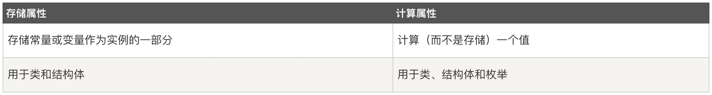

# Swift面向对象（一）

## 类
在面向对象编程当中，类是构建代码所用的一种通用且灵活的构造体。

我们可以为类定义属性（常量、变量）和方法。与其他编程语言所不同的是，Swift 并不要求我们为自定义类去创建独立的接口和实现文件。你所要做的是**在一个单一文件中定义一个类，系统会自动生成面向其它代码的外部接口**。

Swift 中类和结构体有很多共同点。共同处在于：

* 定义属性用于存储值
* 定义方法用于提供功能
* 定义附属脚本用于访问值
* 定义构造器用于生成初始化值
* 通过扩展以增加默认实现的功能
* 符合协议以对某类提供标准功能

与结构体相比，类还有如下的附加功能：

* 继承允许一个类继承另一个类的特征
* 类型转换允许在运行时检查和解释一个类实例的类型
* 解构器允许一个类实例释放任何其所被分配的资源
* 引用计数允许对一个类的多次引用

> **注意：**
> 结构体总是通过被复制的方式在代码中传递，不使用引用计数。

### 语法格式


```swift
class SomeClass {
    // 在这里定义类
}
```

如下实例：

```swift
struct IdentityCard {
    var name = "张三"
    var cardId = "1000000199903042453"
}
// 声明了一个身份证结构体，用来保存身份信息，包含两个存储属性：名字（name）和身份证号（cardId）

class Student {
    var idCard = IdentityCard()
    var stuNo = "31600101010"
    var name = "Terry"
    var isMale = true
    var age = 19
}
// 声明了一个Student类，包含五个存储属性，其中身份证idCard是个身份证对象

var stu = Student()
print("Name:\(stu.name)\nNo.:\(stu.stuNo)\nSex:\(stu.isMale)\nAge:\(stu.age)\nID:\(stu.idCard.cardId)")
// Name:Terry
// No.:31600101010
// Sex:true
// Age:19
// ID:1000000199903042453
```

在以上代码中，我们分别创建了结构体和类的对象（实例），都使用构造器语法来生成新的实例。**构造器语法**的最简单形式是**在结构体或者类的类型名称后跟随一对空括号**，如IdentityCard()或Student()。通过这种方式所创建的类或者结构体实例，其属性均会被初始化为默认值。

#### 属性

在Swift中，属性将值跟特定的类、结构或枚举关联。属性可以分为以下两类：
**存储属性**和**计算属性**:


关于属性的访问，和其他语言类似，都是**使用点语法来访问对象属性**。其语法规则是，实例名后面紧跟属性名，两者通过点号(.)连接。
在以上案例中，我们是通过点语法来访问了Student对象的name、stuNo、isMale等属性的。

##### 存储属性
简单来说，存储属性就是存储**在特定类或结构体的实例里的一个常量或变量**。存储属性可以是变量存储属性（用关键字var定义），也可以是常量存储属性（用关键字let定义）。

设置存储属性的方式：

* 可以在定义存储属性的时候指定默认值

* 也可以在构造过程中设置或修改存储属性的值，甚至修改常量存储属性的值


```swift
struct IdentityCard {
    var name = "张三"
    var cardId = "100000199903042453"
}
// 包含两个存储属性：名字（name）和身份证号（cardId），并且在定义的时候指定楼默认值

class Student {
    var idCard = IdentityCard()
    var stuNo = "31600101010"
    var name = "Terry"
    var isMale = true
    var age = 19
}
// 包含四个存储属性，并且在定义的时候指定楼默认值

var stu = Student()
var idCard = IdentityCard(name: "Ben", cardId: "344401199903042453")//在构造IdentityCard对象过程中修改存储属性的值

stu.idCard = idCard
stu.name = idCard.name
//对象构建成功后，修改存储属性的值

print("Name:\(stu.name)")
```

> **Tips:**
> 如果创建了一个结构体的实例并将其赋值给一个**常量**，则无法修改该实例的任何属性，即使有属性被声明为变量也不行。这种行为是由于结构体（struct）属于**值类型**。**当值类型的实例被声明为常量的时候，它的所有属性也就成了常量**。

> 而类不一样，类是引用类型，把一个引用类型的实例赋给一个常量后，我们仍然可以修改该实例的变量属性。

**延迟存储属性**

延迟存储属性是指当第一次被调用的时候才会计算其初始值的属性。在属性声明前使用 lazy 来标示一个延迟存储属性。

使用场景：
*当属性的值依赖于在实例的构造过程结束后才会知道影响值的外部因素时，或者当获得属性的初始值需要复杂或大量计算时，可以只在需要的时候计算它。*

比如在上面的例子当中，Student类的idCard属性是一个结构体实例，包含name和cardId属性。而Student的另一个属性name其实可以直接从idCard当中获取，但是idCard本身是一个结构体，在结构体对象构造之后才可以获取到name属性，那么就需要将Student的name属性设置成延迟存储属性：


```swift
struct IdentityCard {
    var name = "张三"
    var cardId = "100000199903042453"
}
// 包含两个存储属性：名字（name）和身份证号（cardId），并且在定义的时候指定楼默认值

class Student {
    var idCard = IdentityCard()
    var stuNo = "31600101010"
    lazy var name = idCard.name
    var isMale = true
    var age = 19
}
// 包含四个存储属性，并且在定义的时候指定楼默认值

var stu = Student()
var idCard = IdentityCard(name: "Ben", cardId: "344401199903042453")
//在构造存储属性IdentityCard对象过程中修改其中的值

stu.idCard = idCard
print("Name:\(stu.name)")
```

> **注意：**
> 必须将延迟存储属性声明成变量（使用 var 关键字），因为属性的初始值可能在实例构造完成之后才会得到。而常量属性在构造过程完成之前必须要有初始值，因此无法声明成延迟属性。


##### 计算属性
计算属性不直接存储值，而是**提供一个 getter 和一个可选的 setter，来间接获取和设置其他属性或变量的值**。除存储属性外，类、结构体和枚举可以定义计算属性。


在以上的代码中，我们为Student添加生日属性，同时将年龄属性age设置成计算属性，年龄主要通过当前年份减去生活而获取得来：

```swift
struct IdentityCard {
    var name = "张三"
    var cardId = "100000199903042453"
}

class Student {
    var idCard = IdentityCard()
    var stuNo = "31600101010"
    lazy var name = idCard.name
    var isMale = true
    var birthday = 1999
    var age: Int {
       
        get{
            let date = Date()
            let calendar = NSCalendar.current
            let year = calendar.component(.year, from: date)
            //以上三句用来获取当前年份
            return Int(year) - birthday
        }
        //添加getter方法
        
        set(newBirthday){
            self.birthday = newBirthday
        }
        //添加setter方法
    }
}

var stu = Student()
stu.birthday = 2000
print("Age:\(stu.age)")
```

> **Tips：**
> 如果计算属性的 setter 没有定义表示新值的参数名，则可以使用默认名称 **newValue**。上面的set部分可以简化成：

> ```swift
> set{
>     self.age = newValue
> }
> ```


**只读计算属性**

当计算属性**只有 getter** 没有 setter 时，它就是只读计算属性。只读计算属性总是返回一个值，**可以通过点运算符访问，但不能设置新的值。**

仍然是以上Student的案例，age既然可以通过生日获得，其实我们就没有必要去给age添加set属性了，所以可以将age设置成只读计算属性：

```swift
struct IdentityCard {
    var name = "张三"
    var cardId = "100000199903042453"
}

class Student {
    var idCard = IdentityCard()
    var stuNo = "31600101010"
    lazy var name = idCard.name
    var isMale = true
    var birthday = 1999
    var age: Int {
        get{
            let date = Date()
            let calendar = NSCalendar.current
            let year = calendar.component(.year, from: date)
            //以上三句用来获取当前年份
            return Int(year) - birthday
        }
        //添加getter方法
    }
}

var stu = Student()
stu.birthday = 2000
print("Age:\(stu.age)")
```

> **注意：**
> 必须使用 var 关键字定义计算属性，包括只读计算属性，因为它们的值不是固定的。let 关键字只用来声明常量属性，表示初始化后再也无法修改的值。

只读计算属性的声明还可以进一步简化，省略掉 get 关键字和花括号：

```swift
struct IdentityCard {
    var name = "张三"
    var cardId = "100000199903042453"
}

class Student {
    var idCard = IdentityCard()
    var stuNo = "31600101010"
    lazy var name = idCard.name
    var isMale = true
    var birthday = 1999 
    var age: Int {
        let date = Date()
        let calendar = NSCalendar.current
        let year = calendar.component(.year, from: date)
        return Int(year) - birthday
        //省略了get和花括号的getter方法
    }
}

var stu = Student()
stu.birthday = 2000
print("Age:\(stu.age)")
```

**属性观察器**

属性观察器用来监控和响应属性值的变化，**每次属性被设置值的时候都会调用属性观察器**，甚至新的值和现在的值相同的时候也不例外。

**可以为除了延迟存储属性之外的其他存储属性添加属性观察器**，也可以通过重载属性的方式为继承的属性（包括存储属性和计算属性）添加属性观察器。

属性观察器要点：

* willSet在设置新的值之前调用
* didSet在新的值被设置之后立即调用
* willSet和didSet观察器在属性初始化过程中不会被调用

> **Tips：**

> 1. willSet 观察器会将新的属性值作为常量参数传入，在 willSet 的实现代码中可以为这个参数指定一个名称，如果不指定则参数仍然可用，这时使用默认名称 **newValue** 表示。

> 2. 同样，didSet 观察器会将旧的属性值作为参数传入，可以为该参数命名或者使用默认参数名 **oldValue**。如果在  didSet 方法中再次对该属性赋值，那么新值会覆盖旧的值。

给Student案例加上属性观察器：

```swift
struct IdentityCard {
    var name = "张三"
    var cardId = "100000199903042453"
}

class Student {
    var idCard = IdentityCard()
    var stuNo = "31600101010"
    lazy var name = idCard.name
    var isMale = true
    var birthday = 1999 {
        willSet{
            print("newValue:\(newValue)")
        }
        didSet{
            print("oldValue:\(oldValue)")
        }
    }
    var age: Int {
        let date = Date()
        let calendar = NSCalendar.current
        let year = calendar.component(.year, from: date)
        //以上三句用来获取当前年份
        return Int(year) - birthday
        
    }
}
var stu = Student()
stu.birthday = 2000
print("Age:\(stu.age)")
// newValue:2000
// oldValue:1999
// Age:18
```

### 方法

方法是**与某些特定类型相关联的函数**。类、结构体、枚举都可以定义实例方法；实例方法为给定类型的实例封装了具体的任务与功能。类、结构体、枚举也可以定义类型方法；类型方法与类型本身相关联。

> 结构体和枚举能够定义方法是 Swift 与 C/Objective-C 的主要区别之一。在 Objective-C 中，类是唯一能定义方法的类型。但在 Swift 中，你不仅能选择是否要定义一个类/结构体/枚举，还能灵活地在你创建的类型（类/结构体/枚举）上定义方法

#### 实例方法

实例方法是属于某个特定类、结构体或者枚举类型实例的方法。实例方法**提供访问和修改实例属性的方法或提供与实例目的相关的功能**，并以此来支撑实例的功能。实例方法的语法与函数一致。

实例方法要写在它**所属的类型的前后大括号之间**。实例方法能够隐式访问它所属类型的所有的其他实例方法和属性。**实例方法只能被它所属的类的某个特定实例调用。实例方法不能脱离于现存的实例而被调用。**


```swift
struct IdentityCard {
    var name = "张三"
    var cardId = "100000199903042453"
}

class Student {
    var idCard = IdentityCard()
    var stuNo = "31600101010"
    lazy var name = idCard.name
    var isMale = true
    var birthday = 1999 {
        willSet{
            print("newValue:\(newValue)")
        }
        didSet{
            print("oldValue:\(oldValue)")
        }
    }
    var age: Int {
        let date = Date()
        let calendar = NSCalendar.current
        let year = calendar.component(.year, from: date)
        //以上三句用来获取当前年份
        return Int(year) - birthday
        
    }
    
    func chooseCourse() {
        print("姓名：\(name),选修课程：移动应用开发")
    }
}
var stu = Student()
stu.chooseCourse()
// 姓名：张三,选修课程：移动应用开发
```

**Self属性**

类型的每一个实例都有一个隐含属性叫做self，self完全等同于该实例本身。你可以在一个实例的实例方法中使用这个隐含的self属性来引用当前实例。

以上代码中的chooseCourse函数中的属性访问，也可以添加self来访问：

```swift
    func chooseCourse() {
        print("姓名：\(self.name),选修课程：移动应用开发")
    }
```

> **Tips：**
> 不过，我们不必在代码里面经常写self。可以在一个方法中直接使用一个已知的属性或者方法名称，**如果你没有明确地写self，Swift 会假定你是指当前实例的属性或者方法。**

_那self在什么场景下必须添加呢？_

当实例方法的某个**参数名称与实例的某个属性名称相同**的时候。在这种情况下，参数名称享有优先权，并且在引用属性时必须使用一种更严格的方式。这时就需要使用self属性来区分参数名称和属性名称。


```swift
struct IdentityCard {
    var name = "张三"
    var cardId = "100000199903042453"
}

class Student {
    var idCard = IdentityCard()
    var stuNo = "31600101010"
    lazy var name = idCard.name
    var isMale = true
    var birthday = 1999 {
        willSet{
            print("newValue:\(newValue)")
        }
        didSet{
            print("oldValue:\(oldValue)")
        }
    }
    var age: Int {
        let date = Date()
        let calendar = NSCalendar.current
        let year = calendar.component(.year, from: date)
        //以上三句用来获取当前年份
        return Int(year) - birthday
        
    }
    
    func chooseCourse(name: String) {
        print("姓名：\(self.name),选修课程：移动应用开发")
    }
}
var stu = Student()
stu.chooseCourse(name:"李四")
// 姓名：张三,选修课程：移动应用开发
```


