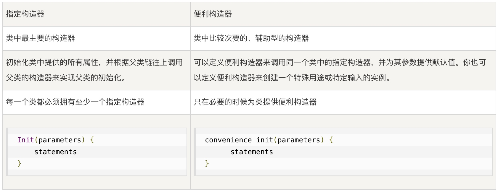

# Swift面向对象（二）


#### 方法

**在实例方法中修改值类型**

结构体和枚举是值类型。默认情况下，值类型的属性不能在它的实例方法中被修改。但是，如果你确实需要在某个特定的方法中修改结构体或者枚举的属性，我们就需要为这个方法选择可变(mutating)行为，然后就可以从其方法内部改变它的属性，通过在方法前面加上mutating关键字：


```swift
struct IdentityCard {
    var name = "张三"
    var cardId = "100000199903042453"
    
    mutating func updateIdCard(name: String, cardId: String) {
        self.name = name
        self.cardId = cardId
    }
}

class Student {
    var idCard = IdentityCard()
    var stuNo = "31600101010"
    lazy var name = idCard.name
    var isMale = true
    var birthday = 1999 {
        willSet{
            print("newValue:\(newValue)")
        }
        didSet{
            print("oldValue:\(oldValue)")
        }
    }
    var age: Int {
        let date = Date()
        let calendar = NSCalendar.current
        let year = calendar.component(.year, from: date)
        //以上三句用来获取当前年份
        return Int(year) - birthday
        
    }
    
    func chooseCourse(name: String) {
        print("姓名：\(self.name),选修课程：移动应用开发")
    }
    
}
var stu = Student()
let idCard = IdentityCard(name: "Ben", cardId: "4566543")
stu.idCard = idCard
stu.idCard.updateIdCard(name: "Terry", cardId: "2345654")
print("Name:\(stu.name)")
// Name:Terry
```

### 继承
继承，面向对象的特征之一，我们可以理解为一个类获取了另外一个类的方法和属性。当一个类继承其它类时，继承类叫子类（或派生类），被继承类叫父类（或超类）。

#### 基类
不继承于其它类的类，称之为基类。

> **注意：**
> Swift 中的类并不是从一个通用的基类继承而来。如果你我们不为定义的类指定一个超类的话，即没有父类的类，那么这个类就自动成为基类。


```swift
class Person {
    var name: String = "张三"
    var isMale: Bool = true
    var age: Int = 1
    
    func speak() {
        print("Speak chinese")
    }
}
// Person没有父类，那么它就是一个基类
```

#### 子类

子类生成指的是在一个已有类的基础上创建一个新的类。子类继承超类的特性，并且可以进一步完善。你还可以为子类添加新的特性。

**语法格式**
在定义子类时，将超类名写在子类名的后面，用冒号分隔：

```swift
class Student: Person {
    var stuNo = "00001"
}
```
在以上代码中，我们创建了一个子类Student，它继承了Person，那么它就获得了Person中的所有特性，拥有了name、isMale、age属性和speak()方法，子类可以直接访问：


```swift
var stu = Student()
stu.name = "Terry"
print(stu.name)
stu.speak()
// Terry
// Speak chinese
```

同样的，子类还可以被其他类继承：

```swift
class Monitor: Student {
    func manageClass() {
        print("Managing Class")
    }
}
var monitor = Monitor()
monitor.name = "Bob"
monitor.stuNo = "1001"
print("Name:\(monitor.name)")
print("NO.:\(monitor.stuNo)")
monitor.manageClass()
```
在以上代码中，我们又创建了一个新类Monitor，班长类，继承了Student类，可以使用Student的所有特性，通过也因为Student继承了Person，所以Monitor也拥有了Person的所有特性。

> **注意：**
> 在Swift中，**只支持单继承，不支持多继承的**，想要实现多继承的类似功能，需要通过协议来实现：

> ```swift
> class Monitor: Student, Person{
>     func manageClass() {
>         print("Managing Class")
>     }
> }
> //报错：Multiple inheritance from classes 'Student' and 'Person'
> ```

#### 重写
子类可以为继承来的实例方法，类方法，实例属性，或下标脚本来实现自己的定制功能，我们把这种行为叫重写（overriding）。在Swift中，我们可以使用 override 关键字来实现重写。

> **Tips：**
> 如果要重写某个特性，我们需要在重写定义的前面加上override关键字。那么我们一旦这么做，你就表明了你是想为该方法提供一个重写版本，而非错误地提供了一个相同的定义。意外的重写行为可能会导致不可预知的错误，任何缺少override关键字的重写都会在编译时被诊断为错误。

override关键字会提醒 Swift 编译器去检查该类的超类（或其中一个父类）是否有匹配重写版本的声明。这个检查可以确保我们的重写定义是正确的。

通过重写我们可以完善已有实现的行为，或在一个继承来的变量中存储一个修改过的值，如果我们需要调用父类版本的方法、属性或下标脚本，可以通过super来访问：

* 在方法someMethod()的重写实现中，可以通过super.someMethod()来调用超类版本的someMethod()方法。
* 在属性someProperty的 getter 或 setter 的重写实现中，可以通过super.someProperty来访问超类版本的someProperty属性。
* 在下标的重写实现中，可以通过super[someIndex]来访问超类版本中的相同下标。

**重写方法**

在子类中，我们可以重写继承来的实例方法或类方法，提供一个定制或替代的方法实现：

```swift
class Person {
    var name: String = "张三"
    var isMale: Bool = true
    var age: Int = 1
    func speak() {
        print("Speak chinese")
    }
}
class Student: Person {
    var stuNo = "00001"
    override func speak() {
        print("Speak english")
    }
    // 重写了父类Person的speak()方法
}
var stu = Student()
stu.speak()
// Speak english
```
从以上代码可以看出，当子类重写了父类的方法后，我们创建子类对象，并调用此方法，此时调用的是子类的方法。当然，我们也可以在子类方法中通过super来调用父类版本的方法：

```swift
class Person {
    var name: String = "张三"
    var isMale: Bool = true
    var age: Int = 1
    func speak() {
        print("Speak chinese")
    }
}
class Student: Person {
    var stuNo = "00001"
    override func speak() {
        print("Speak english")
        super.speak()
    }
    // 重写了父类Person的speak()方法，在重写定义过程中调用了父类的方法
}
var stu = Student()
stu.speak()
// Speak english
// Speak chinese
```

**重写属性**

Swift也允许我们**重写继承来的实例属性或类型属性**，**提供自己定制的 getter 和 setter**，或**添加属性观察器**使重写的属性可以观察属性值什么时候发生改变。

***无论继承来的属性是存储型的还是计算型的属性，我们可以提供定制的 getter（或 setter）来重写任意继承来的属性。***

子类并不知道继承来的属性是存储型的还是计算型的，它只知道继承来的属性会有一个名字和类型。所以我们在重写一个属性时，必须要将它的名字和类型都写出来。这样才能使编译器去检查你重写的属性是与超类中同名同类型的属性相匹配的。

> **注意:**
> 我们甚至还可以将一个继承来的只读属性重写为一个读写属性，只需要在重写版本的属性里提供 getter 和 setter 即可。但是，**我们是不可以将一个继承来的读写属性重写为一个只读属性。**
> 
> 如果我们在重写属性中提供了 setter，那么我们也必须要提供 getter。如果你不想在重写版本中的 getter 里修改继承来的属性值，你可以直接通过super.someProperty来返回继承来父类的值，其中someProperty是我们需要重写的父类属性的名字。

```swift
class Person {
    var name: String = "张三"
    var isMale: Bool = true
    var birthYear = 1999
    var age: Int {
        get{
            let date = Date()
            let calendar = NSCalendar.current
            let year = calendar.component(.year, from: date)
            return Int(year) - birthYear
        }
        set{
            self.birthYear = newValue
        }
    }
    func speak() {
        print("Speak chinese")
    }
}
class Student: Person {
    var stuNo = "00001"
    override func speak() {
        print("Speak english")
        super.speak()
    }
    override var age: Int {
        get{
            return super.age
        }
    }
}
// 此时，在子类Student中，重写了age属性，但是age原本是读写计算属性，我们在子类当中只添加了getter，变成了只读计算属性，这个是不允许的，这个时候编译器就会报错：Cannot override mutable property with read-only property 'age'
```

**重写属性观察器**

我们还可以通过重写属性为一个继承来的属性添加属性观察器。这样一来，当继承来的属性值发生改变时，你就会被通知到，无论那个属性原本是如何实现的。

**防止重写**
swift还提供了防止被重写的方式，通过给方法、属性或下标标记添加关键词final来防止它们被重写，只需要在声明关键字前加上final修饰符即可，例如：`final var，final func，final class func，以及final subscript`
我们还可以通过在关键字class前添加final修饰符（final class）来**将整个类标记为 final 的，这样的类是不可被继承的**，试图继承这样的类会导致编译报错。


### 构造过程

**构造过程是为了使用某个类、结构体或枚举类型的实例而进行的准备过程。**这个过程包含了**为实例中的每个属性设置初始值和为其执行必要的准备和初始化任务**。

_如何实现构造？_

通过定义构造器（也称为：初始化函数）来实现构造过程，这些构造器可以看做是用来创建特定类型新实例的特殊方法。

> **Tips：**
> 与构造相对应的，类的实例也可以通过定义析构器在实例释放之前执行特定的清除工作。

> **注意：**
> 类和结构体在创建实例时，必须**为所有存储型属性设置合适的初始值**。存储型属性的值不能处于一个未知的状态。所以，我们通常可以在构造器中为存储型属性赋初值，或者在定义属性时为其设置默认值。不过当我**在为存储型属性设置默认值或者在构造器中为其赋值时，它们的值是被直接设置的，不会触发任何属性观察者。**

**构造器（初始化函数）**

构造器在创建某个特定类型的新实例时被调用。它的最简形式类似于一个不带任何参数的实例方法，以关键字`init`命名：

```swift
init() {
    // 在此处执行构造过程
}
```
如下例子：

```swift
class Person {
    var name: String
    var isMale: Bool
    var age: Int
    init() {
        name = "张三"
        isMale = true
        age = 1
    }
}
var person = Person()
print(person.name)
// 张三
```
在以上代码中，创建了一个Person类，同时给Person类添加了构造器，在构造器当中分别为属性name、isMale、age设置了初始值。

> **Tips：**
> 我们可以在构造器中为存储型属性设置初始值；同样，也可以在属性声明时为其设置默认值。如果一个属性总是使用相同的初始值，那么建议为其设置一个默认值比每次都在构造器中赋值要好。

**自定义构造器**

既然可以在构造器中设置属性的初始值，那么Swift也允许我们为构造器传入参数来自定义构造过程：

```swift
class Person {
    var name: String
    var isMale: Bool
    var age: Int
    init() {
        name = "张三"
        isMale = true
        age = 1
    }
    init(name: String, isMale: Bool, age: Int) {
        self.name = name
        self.isMale = isMale
        self.age = age
    }
}
var person = Person(name: "Terry", isMale: false, age: 1)
print(person.name)
```

**默认构造器**

如果结构体或类的**所有属性都有默认值**，同时**没有自定义的构造器**，那么 Swift 会给这些结构体或类提供一个默认构造器（default initializers）。这个默认构造器将简单地创建一个所有属性值都设置为默认值的实例。


```swift
class Person {
    var name: String?
    var isMale: Bool = true
    var age: Int = 1
}
var person = Person()
print(person.name)
// 虽然Person类没有写构造器，但是所有属性都有默认值了，且它是没有父类的基类，这时候Swift会给Person提供一个默认构造器，即init构造器。
//尽管代码中没有显式为name属性设置默认值，但由于name是可选字符串类型，它将被默认设置为nil
```

> **注意：**
> **当我们为某个值类型只定义了一个自定义的构造器，你将无法访问到默认构造器。**这样可以防止我们为值类型增加了一个额外的且十分复杂的构造器之后,仍然有人错误的使用自动生成的构造器。如果需要在自定义构造器后，仍然允许别人可以访问默认构造器，那么可以将自定义的构造器写到扩展（extension）中，而不是写在值类型的原始定义中。


```swift
class Person {
class Person {
    var name: String
    var isMale: Bool
    var age: Int

    init(name: String, isMale: Bool, age: Int) {
        self.name = name
        self.isMale = isMale
        self.age = age
    }
}
var person = Person()
// 报错，无法访问默认构造器
print(person.name)
```
在以上代码中我们只为Person类创建了自定义构造器，这时候，我们就没办法使用默认构造器来创建实例来，必须要通过自定义构造器，如果我们想要我们可以再手动添加一个默认构造器后，就可以访问默认构造器了：

```swift
class Person {
    var name: String
    var isMale: Bool
    var age: Int
    init() {
        name = "张三"
        isMale = true
        age = 1
    }
    init(name: String, isMale: Bool, age: Int) {
        self.name = name
        self.isMale = isMale
        self.age = age
    }
}
var person1 = Person()
var person2 = Person(name: "Terry", isMale: false, age: 1)
print(person1.name)
print(person2.name)
// 张三
// Terry
```

### 类的继承和构造过程

在swift中，类的**所有存储型属性**——包括所有继承自父类的属性——**都必须在构造过程中设置初始值**。

Swift 为类类型提供了两种构造器来确保实例中所有存储型属性都能获得初始值，它们分别是**指定构造器**和**便利构造器**。

***指定构造器和便利构造器***

*1. 指定构造器*

指定构造器是类中**最主要的构造器**。一个指定构造器将**初始化类中提供的所有属性**，并根据父类链往上调用父类的构造器来实现父类的初始化。

**每一个类都必须拥有至少一个指定构造器**。在某些情况下，许多类可以通过继承了父类中的指定构造器而满足了这个条件。

*2. 便利构造器*

便利构造器是类中比较次要的、**辅助型的构造器**。我们可以定义**便利构造器来调用同一个类中的指定构造器**，并为其参数提供默认值。你也可以**定义便利构造器来创建一个特殊用途或特定输入值的实例**。

> **Tips：**
> 我们应当只在必要的时候为类提供便利构造器，比方说某种情况下通过使用便利构造器来快捷调用某个指定构造器，能够节省更多开发时间并让类的构造过程更清晰明了。

**语法格式**

类的指定构造器的写法跟值类型简单构造器一样：

```swift
init(parameters) {
    statements
}
```

便利构造器也采用相同样式的写法，但需要在init关键字之前放置**convenience**关键字，并使用空格将它们俩分开：

```swift
convenience init(parameters) {
    statements
}
```



*3.类的可失败构造器*
如果一个类，在构造自身的过程中有可能失败，则为其定义一个可失败构造器，造成变量初始化失败的原因通常有：

* 传入无效的参数值。

* 缺少某种所需的外部资源。

* 没有满足特定条件。

所以，为了妥善处理这种构造过程中可能会失败的情况。我们可以在一个类定义中，添加一个或多个可失败构造器，其语法为在init关键字后面加添问号`init?`。可失败构造器会创建一个类型为自身类型的可选类型的对象。我们可以通过return nil语句来表明可失败构造器在何种情况下应该“失败”。：

**注意**
> 严格来说，构造器都不支持返回值，因为构造器本身的作用，只是为了确保对象能被正确构造。因此我们只是用return nil表明可失败构造器构造失败，而**不要用关键字return来表明构造成功**。

如下案例：

```swift
class Person {
    var name: String
    var isMale: Bool
    var age: Int
    init() {
        name = "张三"
        isMale = true
        age = 1
    }
    init(name: String, isMale: Bool, age: Int) {
        self.name = name
        self.isMale = isMale
        self.age = age
    }
    
    convenience init?(newName: String) {
        if newName.isEmpty {
            return nil
        }
        self.init(name: newName, isMale: true, age: 2)
    }
}
if let person = Person(newName: "") {
    print(person.name)
}else {
    print("Person 创建失败")
}
// Person 创建失败
```

> **注意**
> 可失败构造器的参数名和参数类型，不能与其它非可失败构造器的参数名，及其参数类型相同。

