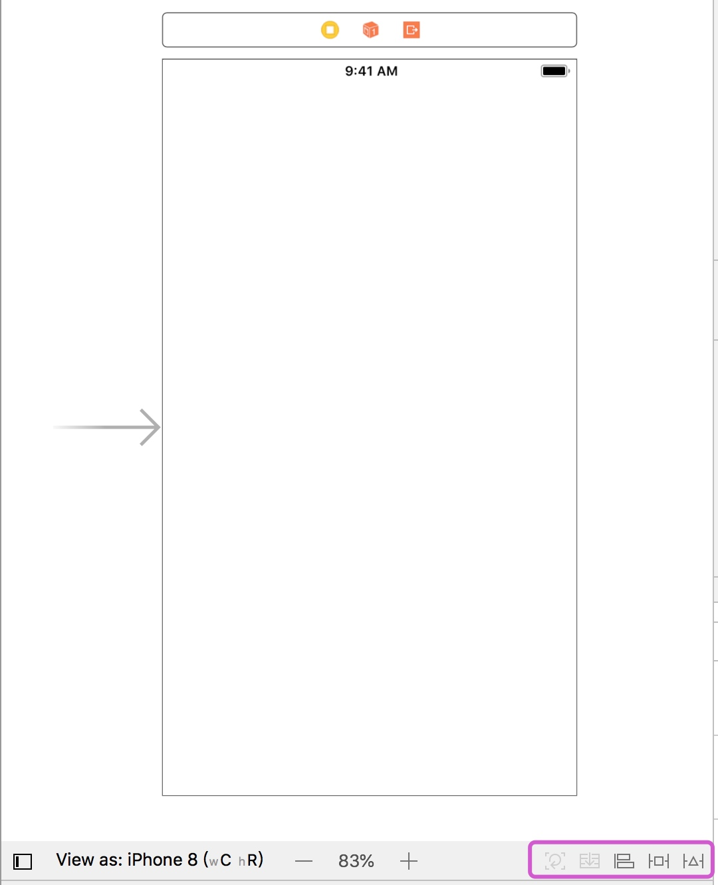

# UI基础(自动布局)

## 自动布局

自动布局是一种**基于约束的布局**（constraint-based layuot）引擎，它可以根据开发者在对象上设定的约束自动调整大小与位置。它允许开发者在界面上的任意两个视图之间建立精确的线性变化规则。

### 为什么要使用自动布局

> 当我们在进行开发时，经常会听到类似以下的需求：
> “把按钮放在底部向上10像素的位置”；
> “这些标签之间的间距要相等”；
> “图片要始终水平居中显示”；
> “按钮与图片之间的距离要始终为100像素”；
> “按钮的高度至少要44像素”；
> “要在iPhone5s、6/6s/7、6/6s/7 P、8/8 P、X上正常运行”
> ......

在自动布局技术出现之前，如果开发者需要手动将这些设计准则准确准还成掩码约束，并且当同一个控件在不同尺寸的设备上显示时，就可能会出现位置或大小上的偏差，有了自动布局技术以后，大部分约束和功能都可以自然地表现出来，并且还能够按照约束条件，自动地适应不同尺寸屏幕的机型。

**机型与屏幕尺寸**

在iOS中，有以下这些布局方式：

1. XIB StoryBoard 约束设置
2. NSLayoutConstraint 约束设置
3. VFL 约束设置
4. NSLayoutAnchor 约束设置
5. 第三方约束设置
 
布局方式总体上可以归纳为两大类：可视化布局和纯代码布局（当然也会有可视化与代码结合的布局方式）。本次课程主要给大家讲解可视化布局。

#### 可视化布局方式

可视化布局方式，即在storyboard或者xib界面文件中添加相关约束来完成布局，目前在storyboard或者xib中设置约束的方案有三种：

1. 在设计器中长按Control键拖动控件。
2. 在左侧文档结构窗口层次view选择器中长按Control键拖动控件。
3. 点击设计器底部图标，add new constraints设置距离约束、固定宽高约束、等高等宽和宽高比约束，align设置对齐约束。

**约束**
所谓约束，就是以其他控件或父控件作为**参照物**，为控件添加**描述值**，限制控件的位置和大小。

通过以下四种方式来添加约束，确定控件的位置和大小：

1、固定死位置和大小
a、参照父控件，固定控件左边和顶部的边距； 
b、固定控件的宽度和高度。

2、固定死位置，大小根据位置计算
参照父控件，固定控件上下左右四边的边距；

3、固定死位置，大小根据位置计算
a、参照父控件，固定控件左边和顶部的边距；
b、参照父控件，在父控件内水平、垂直居中。

4、固定死大小，位置根据大小计算
a、参照父控件，在父控件内水平、垂直居中；
b、固定控件的宽度和高度。

在可视化布局当中，我们经常会用到的结果设计器菜单：

#### Align:

英文解释为对齐，用来描述视图间的排列关系：

* Leading Edges 选中的views们 **左** 对齐

* Trailing Edges 选中的views们 **右** 对齐

* Top Edges 选中的views们 **上** 对齐

* Bottom Edges 选中的views们 **下** 对齐

* Horizontal Centers 选中的views们 **水平方向** 中心对齐

* Vertical Centers 选中的views们  **垂直方向** 中心对齐

* Baselines 选中的views们基于 **基线** 对齐

* Horizontally in Container 选中的视图**相对于父视图** 进行 **水平方向 对齐**

* Vertical in Container 选中的视图**相对于父视图** 进行 **垂直方向 对齐**

#### Add New Constraints

英文解释为添加约束，我们可以理解为给对象添加约束。

* 最上方的几个输入框中的值表示当前选中的views或者view距离父视图的上下左右的距离为多少，

* Width 和 Height 分别是 **宽度和高度** 的设置

* Constarain to Margins. 这个是否需要外边距 默认为 8 。一般使用默认即可。

* Equal Widths 和 Equal Heights 这两个选项需要选择两个视图。比如选中View1和View2，那么可以分别设置这个两个视图宽度和高度相等。

* Aspect Ratio 这个属性是设置选中**View的宽高比例**。当你点击设置的时候，默认他会设置当前视图的比例。比如你的View高度为40宽度为30，那么你的比例就将设置为3:4。

* Align 与上面学习的第一个Align功能一样

#### Resolve Auto Layout Issues

解决自动布局相关问题，如果你在布局的时候出现了一些问题。

比如，我们在设置约束之后，出现黄色或者红色的的颜色的时候就需要使用以下方式修改。红色说明我们设置的约束有缺失或者有冲突的问题，黄色则说明，约束正确，但是当前View的Frame和约束描述的Frame不一致。

* Selected Views 这个说的就是你要处理的约束问题是当前你选中的View，而All Views in View Controller，则是说明要解决的约束问题是这个ViewController所有的VIew。所以大家在选择功能务必慎重选择此项。

* Update Frames **修改Frame**，当你的约束设置正确但是Frame不对的时候使用者选项可以讲View的Frame展示成为约束所描述的样子

* Update Constaints 这个选项，主要用来更新约束，将当前view的frame及其约束更新成最新的约束。

* Add Missing Constraints **自动添加缺失的约束**，可以为控件自动添加缺失的约束，不过需要注意的是此功能仅针对界面元素单一，层级关系简单的情况，其他情况添加的缺失约束不一定就是正确的约束，在实际运行中可能会出现问题，所以尽量自行手动添加缺失的约束。

* Reset to Suggested Constaints **重置为默认建议的约束**。

* Clear Constraints **清除约束**，会删除选中的视图的所有的约束。在All Views in View Controller 你要是做这个选项的时候可得慎重，使用了就说明你要删除当前ViewController所有的约束。

> Tips：
> 对于我们在进行可视化布局时如果出现误操作情况，可以通过`Ctrl+Z`来撤销之前的操作。

