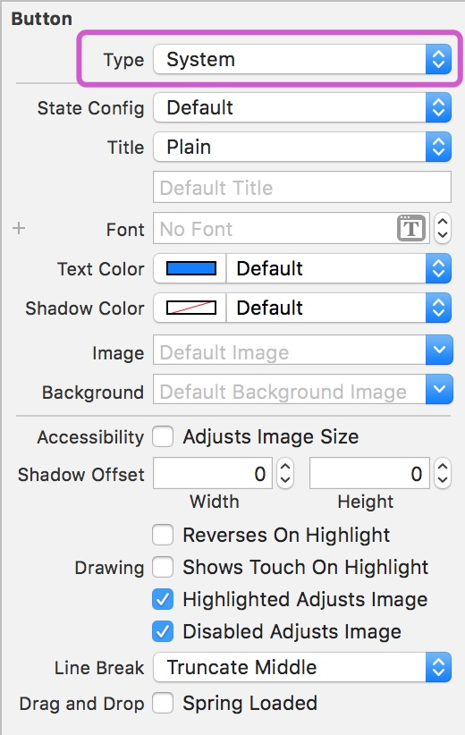
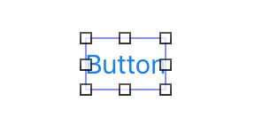
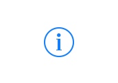
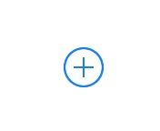
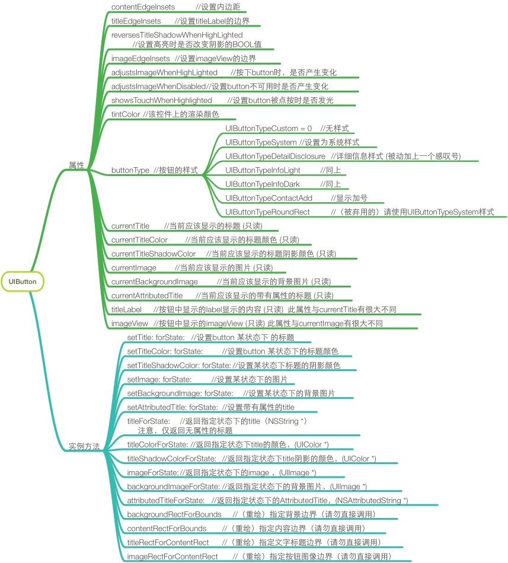
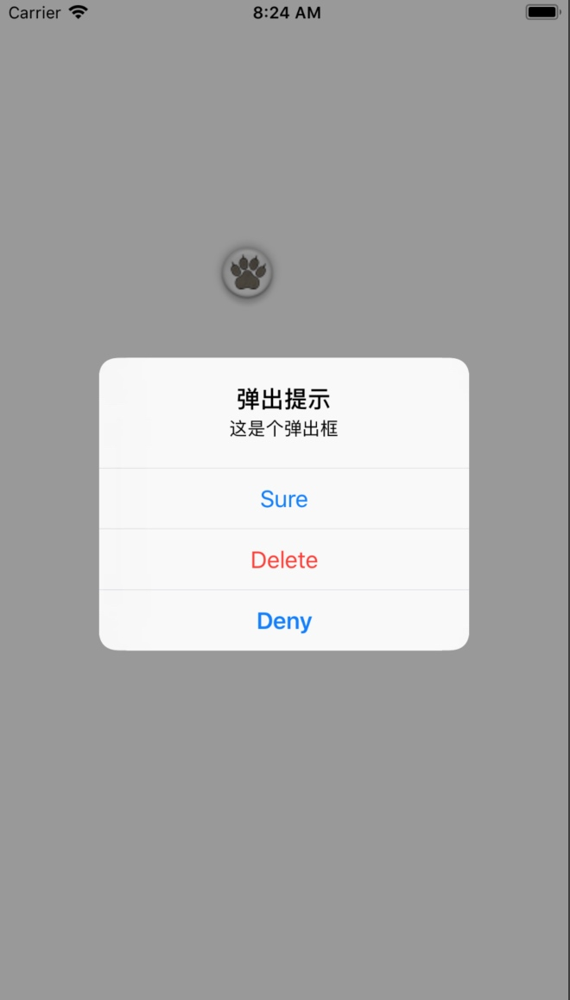
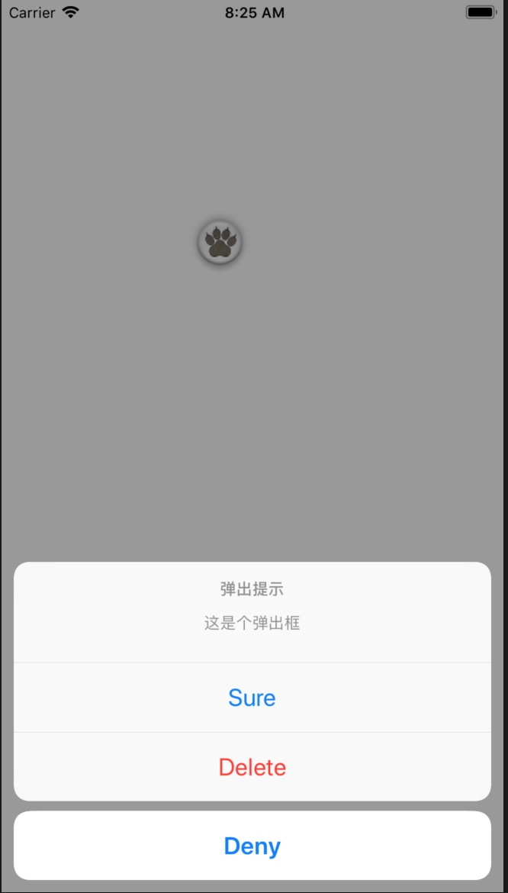

# UI基础（按钮与提示框）

## UIButton(按钮)

按钮主要用来处理用户的操作。它截取触摸事件，并将消息发送到目标对象。

### 按钮类型

iOS中为UIButton提供来多种样式，我们可以在代码中设置样式，或者在属性检查器上方的Type下拉菜单来设置样式：



***UIButtonTypeCustom*** ：自定义样式，不带默认样式的（无按钮文字，无背景色）                          
     
***UIButtonTypeSystem*** ：标准系统按钮，系统默认样式（蓝色的按钮文字，无背景色）


***UIButtonTypeDetailDisclosure***：详细信息样式



***UIButtonTypeInfoLight***：浅色的信息详情样式（与DetailDisclosure类似）

***UIButtonTypeInfoDark***：深色的信息详情样式（与DetailDisclosure类似）

***UIButtonTypeContactAdd***：添加按钮样式


***UIButtonTypePlain*** ：没有模糊背景视图的标准系统按钮，API_AVAILABLE(tvos(11.0)) API_UNAVAILABLE(ios, watchos) 

***UIButtonTypeRoundedRect*** ：等同于UIButtonTypeSystem

### 常用属性

#### 只读属性

##### titleLabel
用来获取按钮的文本框

##### imageView
用来获取按钮的image views

##### currentTitle
用来获取按钮当前状态下的按钮文本，允许返回nil。（按钮状态有：`normal/highlighted/selected/disabled`）

##### currentTitleColor
用来获取按钮当前状态下的文本颜色，默认是white。（按钮状态有：`normal/highlighted/selected/disabled`）

##### currentTitleShadowColor
用来获取按钮当前状态下的文本阴影颜色。（按钮状态有：`normal/highlighted/selected/disabled`）

##### currentImage
用来获取当前状态下的图片，允许返回nil。（按钮状态有：`normal/highlighted/selected/disabled`）

##### currentBackgroundImage
用来获取当前状态下的背景图片，允许返回nil。（按钮状态有：`normal/highlighted/selected/disabled`）

##### currentAttributedTitle
用来获取当前状态下的带有属性的标题，允许返回nil。（按钮状态有：`normal/highlighted/selected/disabled`）

### 常用方法

#### 设置方法

##### setTitle(_ title: String?, for state: UIControlState)
用来设置button 某状态下的标题

##### setTitleColor(_ color: UIColor?, for state: UIControlState)
用来设置button 某状态下的标题颜色

##### setTitleShadowColor(_ color: UIColor?, for state: UIControlState)
用来设置某状态下标题的阴影颜色，默认使用50%的black

##### setImage(_ image: UIImage?, for state: UIControlState)
用来设置某状态下的图片

##### setBackgroundImage(_ image: UIImage?, for state: UIControlState)
用来设置某状态下的背景图片

##### setAttributedTitle(_ title: NSAttributedString?, for state: UIControlState)
用来设置带有属性的title

#### 获取方法

##### func title(for state: UIControlState) -> String?
用来获取指定状态下的title，仅返回无属性的标题

##### func titleColor(for state: UIControlState) -> UIColor?
用来获取指定状态下title的颜色

##### titleShadowColor(for state: UIControlState) -> UIColor?
用来获取指定状态下title阴影的颜色

##### image(for state: UIControlState) -> UIImage?
用来获取指定状态下的image

#####backgroundImage(for state: UIControlState) -> UIImage?
用来获取指定状态下的背景图片

##### attributedTitle(for state: UIControlState) -> NSAttributedString?
用来获取指定状态下的AttributedTitle

具体可以参考如下的UIButton的属性、方法列表



## UIAlertController（提示框）
自iOS8起，苹果就建议提示框使用UIAlertController来代替UIAlertView和UIActionSheet。

### 样式

弹出框主要有两种样式：
#### Alert




Alert即为弹出框，显示在屏幕的正中间，弹出后会给整个手机屏幕加上一层灰色的遮罩层，默认情况下**无法点击弹出框外屏幕的其他地方**，除非关闭弹出框。

#### ActionSheet



ActionSheet与Alert类似，也会给屏幕加上遮罩层，不过与Alert不同的是，它是显示在屏幕底部的，并且默认情况下**点击弹出框外屏幕的其他地方也可以关闭ActionSheet**

具体实例：

```swift
let AlertVC = UIAlertController(title: "弹出提示", message: "这是个弹出框", preferredStyle: .alert)

let SureAction = UIAlertAction(title: "Sure", style: .default) { (action) in
    print(action.title!)
}

let DenyAction = UIAlertAction(title: "Deny", style: .cancel) { (action) in
    print(action.title!)
}

let DeleteAction = UIAlertAction(title: "Delete", style: .destructive) { (action) in
    print(action.title!)
}

AlertVC.addAction(SureAction)
AlertVC.addAction(DenyAction)
AlertVC.addAction(DeleteAction)
self.present(AlertVC, animated: true, completion: nil)
```

### 使用步骤

Alert与ActionSheet两者的使用步骤都一样：

1. 创建UIAlertController，设置弹出框标题，弹出框信息，及样式，可以通过便利构造器来构造：`init(title: String?, message: String?, preferredStyle: UIAlertControllerStyle)`创建出来的是整个弹出框控制器。

2. 创建UIAlertAction，创建按钮，设置按钮的标题，按钮样式还可以给按钮添加回调方法。也可以通过便利构造器构造：`init(title: String?, style: UIAlertActionStyle, handler: ((UIAlertAction) -> Swift.Void)? = nil)`对于其中的UIAlertActionStyle表示按钮的样式，有三种样式：default、cancel、destructive。有多少个按钮就需要创建几个UIAlertAction。

3. 创建好按钮后，需要通过UIAlertController的`addAction(_ action: UIAlertAction)`方法将按钮添加到弹出框上，此时弹出框创建完成。

4. 最后将弹出框显示在屏幕上。


