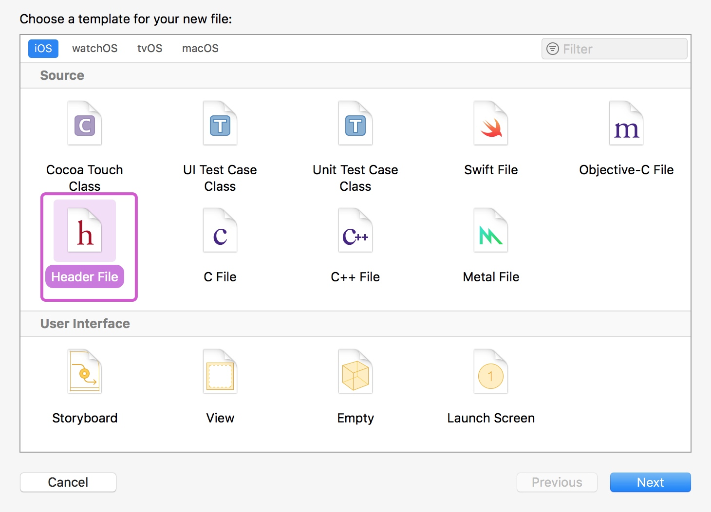
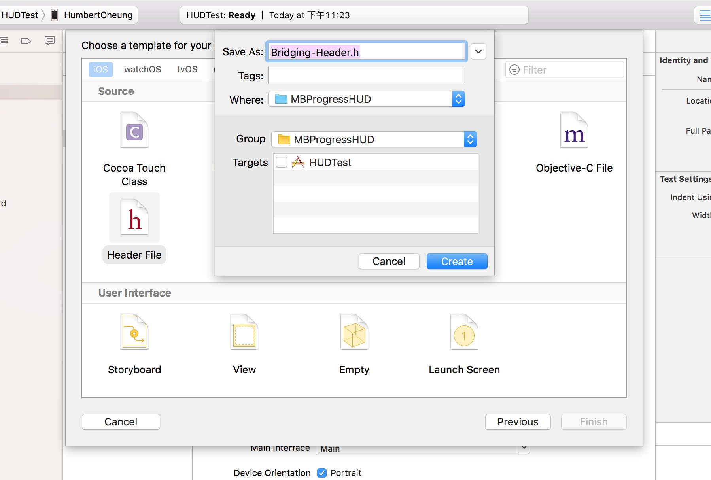
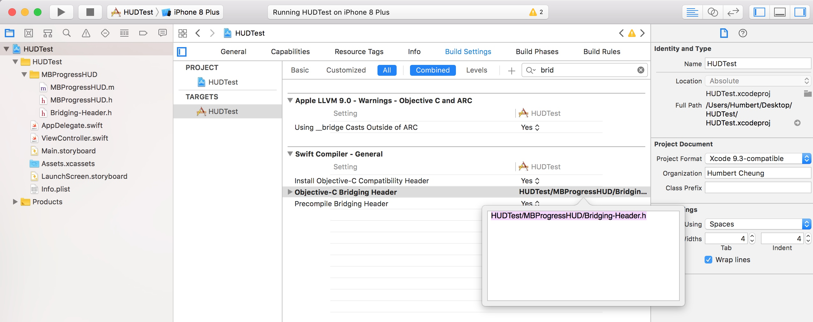
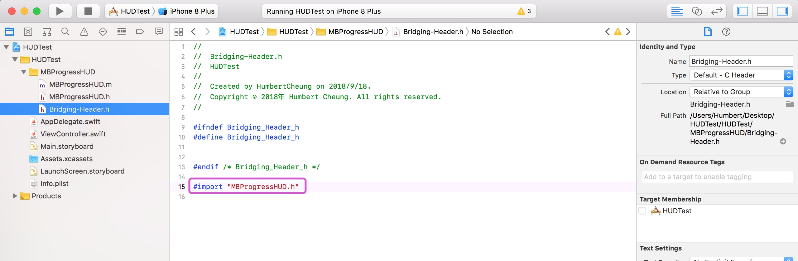
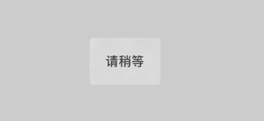
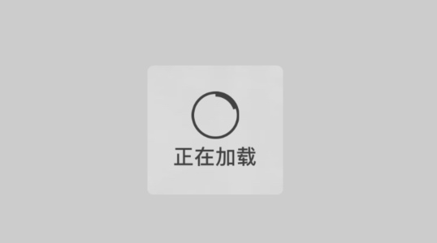
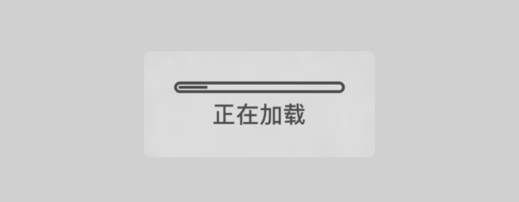
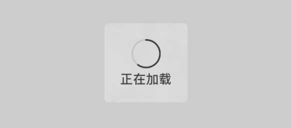
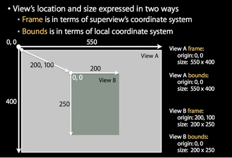

# UI基础（提示框与视图）

## 第三方提示框工具（MBProgressHUD）

> MBProgressHUD工具是一款实用的提示框工具，提供多种样式和效果，可以说是非常便捷的，不过因为此工具是通过Objective-
> C写的，所以如果需要在Swift项目中使用，就需要去创建Swift与Objective-C间的桥接文件，这样就可以在Swift中使用了。

首先需要将下载到MBProgressHUD文件拖入到我们的工程中，因为MBProgressHUD文件是Objective-C文件，所以MBProgressHUD类被分离为`.h`文件和`.m`文件，第一次将OC文件引入Swift项目时，Xcode会提示我们创建桥接文件，此时我们根据提示直接创建桥接文件即可。

当我们选择了Don't Create或者没有提示创建桥接文件时，我们需要手动创建。手动创建步骤如下：

1、选择创建Header File头文件


如下图：



2、创建好之后需要到Build Settings中Swift Compiler - General中设置Objective-C Bridging Header，输入我们刚刚创建的文件的所在目录，在本案例中为：`HUDTest/MBProgressHUD/Bridging-Header.h` 如下：


3、此时，我们就设置好了桥接文件，然后在桥接文件中，通过import引入我们的MBProgressHUD工具的头文件，接下去我们就可以正常使用此工具了：




## 常用样式

#### 纯文本提示框
样式效果为：**纯文字**
条件：**mode设置为text**

```swift
//初始化对话框，置于当前的View当中
HUD = MBProgressHUD(view: self.view)
self.view.addSubview(HUD!)
//如果设置此属性，则当前view置于后台
HUD?.dimBackground = true
//设置模式为纯文本
HUD?.mode = .text
//设置对话框文字
HUD?.label.text = "请稍等"
HUD?.show(animated: true, whileExecuting: {
    sleep(3)
}, completionBlock: {
    self.HUD?.removeFromSuperview()
    self.HUD = nil
})
```

效果如下：



> **Tips：**
> 
> 我们还可以给HUD的detailsLabel设置文本内容，来显示副标题：
> `HUD?.detailsLabel.text = "正在下载中..."`效果如下：


#### 文本等待提示框
样式效果为：**菊花+文字**
条件：**不设置mode时的默认样式，或者设置为indeterminate**

```swift
//初始化对话框，置于当前的View当中
HUD = MBProgressHUD(view: self.view)
self.view.addSubview(HUD!)
//如果设置此属性，则当前view置于后台
HUD?.dimBackground = true
//设置模式为菊花样式
HUD?.mode = .indeterminate
//设置对话框文字
HUD?.label.text = "请稍等"
HUD?.show(animated: true, whileExecuting: {
    sleep(3)
}, completionBlock: {
    self.HUD?.removeFromSuperview()
    self.HUD = nil
})
```
效果如下：


> **Tips：**
> 同样的，我们也可以给HUD的detailsLabel设置文本内容，来显示副标题。

#### 饼状进度条提示框
样式效果为：**饼状进度条**
条件：**mode设置为determinate**

```swift
//初始化对话框，置于当前的View当中
HUD = MBProgressHUD(view: self.view)
self.view.addSubview(HUD!)
//如果设置此属性，则当前view置于后台
HUD!.dimBackground = true
//设置对话框文字
HUD!.label.text = "正在加载"
//设置模式为饼状进度条
HUD!.mode = .determinate
HUD!.show(animated: true)
var progress : Float = 0.0
DispatchQueue.global().async {
    while(progress <= 1.0){
        progress += 0.2
        DispatchQueue.main.async {
            self.HUD!.progress = progress
            if progress > 1.0 {
                self.HUD!.removeFromSuperview()
                self.HUD = nil
            }
        }
        sleep(1)
    }
}
```

效果如下图：



> **Tips：**
> 通常进度条需要结合progress属性来显示进度的变化


#### 条状进度条提示框
样式效果为：**长条状进度条**
条件：**mode设置为determinateHorizontalBar**


```swift
//初始化对话框，置于当前的View当中
HUD = MBProgressHUD(view: self.view)
self.view.addSubview(HUD!)
//如果设置此属性，则当前view置于后台
HUD!.dimBackground = true
//设置对话框文字
HUD!.label.text = "正在加载"
//设置模式为长条状进度条
HUD!.mode = .determinateHorizontalBar
HUD!.show(animated: true)
var progress : Float = 0.0
DispatchQueue.global().async {
    while(progress <= 1.0){
        progress += 0.2
        DispatchQueue.main.async {
            self.HUD!.progress = progress
            if progress > 1.0 {
                self.HUD!.removeFromSuperview()
                self.HUD = nil
            }
        }
        sleep(1)
    }
}
```
效果如下图：




#### 圆环进度条提示框

样式效果为：**圆环进度条**
条件：**mode设置为annularDeterminate**


```swift
//初始化对话框，置于当前的View当中
HUD = MBProgressHUD(view: self.view)
self.view.addSubview(HUD!)
//如果设置此属性，则当前view置于后台
HUD!.dimBackground = true
//设置对话框文字
HUD!.label.text = "正在加载"
//设置模式为圆环形进度条
HUD!.mode = .annularDeterminate
HUD!.show(animated: true)
var progress : Float = 0.0
DispatchQueue.global().async {
    while(progress <= 1.0){
        progress += 0.2
        DispatchQueue.main.async {
            self.HUD!.progress = progress
            if progress > 1.0 {
                self.HUD!.removeFromSuperview()
                self.HUD = nil
            }
        }
        sleep(1)
    }
}
```
效果如下：




#### 自定义样式
样式效果为：**自定义的图像**
条件：**将mode设置为customView**

```swift
//初始化对话框，置于当前的View当中
HUD = MBProgressHUD(view: self.view)
self.view.addSubview(HUD!)
//如果设置此属性，则当前view置于后台
HUD?.dimBackground = true
//设置对话框文字
HUD?.labelText = "操作成功"
//设置模式为自定义
HUD?.mode = .customView
HUD?.customView = UIImageView(image: UIImage(named: "logo"))
HUD?.show(animated: true, whileExecuting: {
    sleep(2)
}, completionBlock: {
    self.HUD?.removeFromSuperview()
    self.HUD = nil

})
```

效果如下：


## 视图

在iOS坐标系统中，通常会涉及UIView的以下3个属性：

frame（CGRect）：描述当前视图**在其父视图中的位置和大小**。 
bounds（CGRect）：描述当前视图**在其自身坐标系统中的位置和大小**。 
center（CGPoint）：描述当前视图的**中心点在其父视图中的位置**。

### iOS坐标系统

iOS以**左上角为坐标原点(0,0)，以原点向右侧为X轴正方向**，**原点下侧为Y轴正方向**。

> **CGPoint**：iOS采用CGPoint来表示点在坐标系上X、Y位置。包含x、y属性。我们可以通过CGPoin的构造器来创建一个坐标点。`init(x: CGFloat, y: CGFloat)`
> 
> **CGSize**：同时，iOS采用CGSize来表示视图的宽度和高度，即视图的大小，包含width、height属性。可以通过构造器`init(width: CGFloat, height: CGFloat)`来构造。
> 
> **CGRect**：而CGRect则是结合了CGPoint和CGSize，用来表示矩形的位置和大小，包含origin和size属性。它的origin表示矩形右上角所在位置(CGPoint)，size表示矩形的大小(CGSize)。可直接通过构造器`init(origin: CGPoint, size: CGSize)`来构造。

### frame、bounds的区别与联系

frame、bounds这两个属性都是用来描述视图的大小(CGSize)和位置(CGPoint)的，两者都用CGRect表示。不同的是，**frame描述的是在其父视图中的CGRect**，而**bounds描述的是在其自身视图中的CGRect**，也就是说，两者所在的坐标系是不同的。如下图所示：View B是View A的子视图，那么，
View B的frame属性为origin（200,100），size（200，250）；
而View B的bounds属性为origin（0，0），size（200，250）。




#### 总结：

1. 改变frame属性会同时影响bounds属性和center属性

2. 改变center属性会影响frame属性的origin值

3. 改变bounds属性的size值会影响frame属性的size值

4. 改变bounds的origin也会影响该视图子视图的origin


