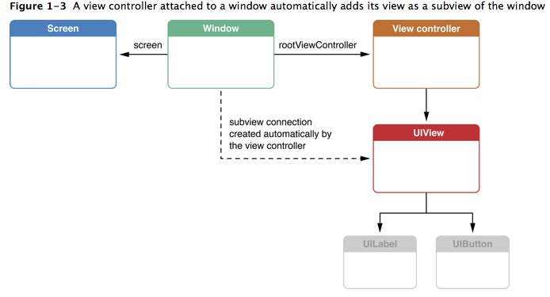
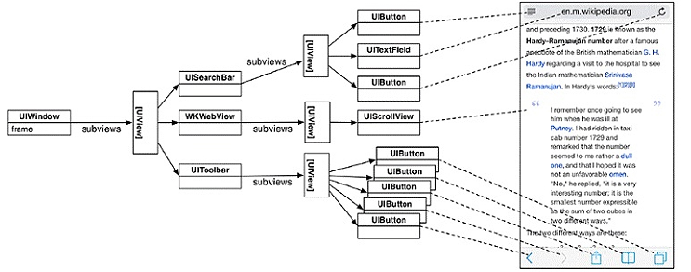
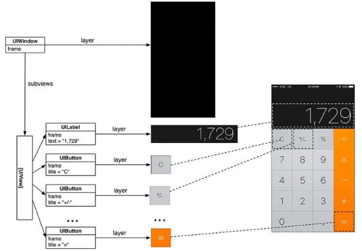
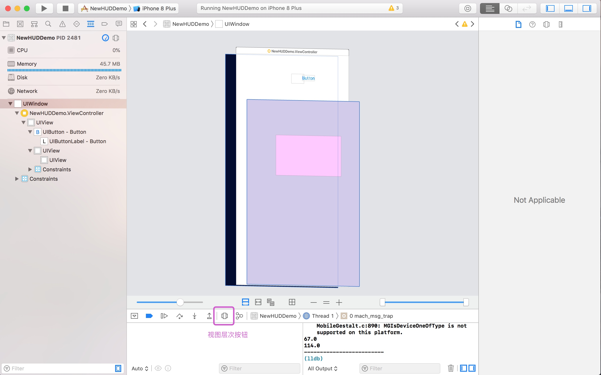

# UI基础（视图层次与动画）

## 视图层次

### 前言

> 我们所创建的每一个应用程序，都有一个单一的UIWindow窗口实例，来作为应用程序中所有视图的容器。UIWindow本身是UIView的子类，所以是一种特殊的UIView，通常在一个app中只会有一个UIWindow。

iOS程序启动完毕后，创建的第一个视图控件就是UIWindow，接着创建控制器的view，最后将控制器的view添加到UIWindow上，于是控制器的view就显示在屏幕上了。界面显示过程如下：



即：先创建UIwindow,再创建控制器，创建控制器的view，然后将控制器的view添加到UIWindow上，然后展示在屏幕上。

> **TipS：**
> 一个iOS程序之所以能显示到屏幕上，是因为它有UIWindow。也就说，如果没有UIWindow的话，那就看不见任何UI界面了。


### 视图层级

窗口对象在应用程序启动时创建，创建窗口后，就可以向其中添加其他视图。当视图被添加到窗口时，它被认为是窗口的子视图。作为窗口子视图的视图，本身也是可以添加子视图的，所以就形成了以窗口为根视图的树形层级结构。


如下案例，是一个简单的网页界面的视图层级：




一旦创建了视图层级后，它将被绘制到屏幕上，绘制过程可以分为两个步骤：

1. 层级中的每个视图（包括窗口）自身绘制。它将自身渲染到其图层(layer)，可以将其视为位图图像。（该图层是 CALayer 的一个实例。）

2. 所有视图的图层在屏幕上合成在一起，形成我们看到的界面。

比如我们比较熟的计算器，它的视图层级和视图绘制如下：




#### 查看视图层级关系

在程序运行时，我们可以通过Xcode设计器中的Debug View Hierarchy来查看APP的视图层次结构：




Debug View Hierarchy可以让开发者在程序运行时，动态的查看当前界面的显示情况，包括视图的层次，控件的大小和位置，而且会以3D效果显示当前视图的层次。

### 视图层次控制

视图间存在层级关系，我们可以去修改和调整视图的层级。

#### 常用的视图层级控制方法

1. 获取父视图
**var superview: UIView? { get }**

2. 获取所有子视图
**var subviews: [UIView] { get }**

3. 将视图添加到接收者的子视图数组的末尾通过这种方式添加的视图，越后面添加的，越在最上层。**即后添加的会覆盖之前添加的视图。**
**addSubview(_ view: UIView)**

4. 将 view移动到所有子视图的最上面，此时，在子视图数组中，索引最大。
**bringSubviewToFront(_ view: UIView)**

5.  将view移动到所有子视图的最下面，此时，在子视图数组中，索引最小。
**sendSubviewToBack(_ view: UIView)**

6. 将视图从其父视图和其窗口中移除
**removeFromSuperview()**

7. 将指定子视图添加到子视图数组中下标为index的位置
**insertSubview(_ view: UIView, at index: Int)**

8. 将视图view 置于 siblingSubview 视图的上面
**insertSubview(_ view: UIView, aboveSubview siblingSubview: UIView)**

9. 将视图view 置于 siblingSubview 视图的下面
**insertSubview(_ view: UIView, belowSubview siblingSubview: UIView)**

10. 将子视图数组中索引为 index1 的子视图与下标为 index2 的子视图交换位置
**exchangeSubview(at index1: Int, withSubviewAt index2: Int)**


> **注意：**

> * 父视图隐藏则子视图也隐藏，子视图隐藏父视图不一定隐藏

> * 父视图透明则子视图也透明，子视图透明父视图不一定透明

> * 父视图可以剪切掉子视图超出自己的部分:
>     * clipsToBounds:指父视图上的子视图，如果超出父视图，那么超出的部分就被裁剪掉
>     * masksToBounds：指父视图图层上的子图层，如果超出父图层，那么超出的部分就被裁剪掉

> * 父视图允许用户交互，则子视图允许用户交互，并且，若子视图超出父视图边界，则子视图超出部分就不响应任何事件。父视图不允许用户交互，就算子视图设置用户交互，也不能成功（默认为true,false为不可交互）


## 动画

iOS为我们提供了多种实现动画的方式，视图动画算是当中比较简单的一种，所有的视图动画基本都是基于 layer 层的动画。UIView 层面的动画只是对 layer 层部分属性的封装。所以实现视图动画，我们可以直接通过 UIView 的 alpha 、bounds 、center 、frame、transform、backgroundColor等属性来实现动画。

### 常用的视图动画方法

我们在 UIView 中，想要执行一个动画非常简单，系统已经帮我们封装好了一切，我们可以通过UIView的几个类方法来实现：

1、 **animate(withDuration duration: TimeInterval, animations: @escaping () -> Void)**
只需要将想要动画的属性放到 animations 的闭包中即可：


```swift
import UIKit

class ViewController: UIViewController {

    var myView: UIView?
    
    override func viewDidLoad() {
        super.viewDidLoad()
        
        let btn = UIButton(frame: CGRect(x: 20, y: 50, width: 100, height: 30))
        btn.setTitle("显示", for: .normal)
        btn.setTitleColor(UIColor.blue, for: .normal)
        btn.addTarget(self, action: #selector(startAnimate), for: .touchUpInside)
        self.view.addSubview(btn)
        
        myView = UIView(frame: CGRect(x: 50, y: 100, width: 100, height: 100))
        myView!.backgroundColor = UIColor.purple
        self.view.addSubview(myView!)
    }

    @objc func startAnimate(){
    
        UIView.animate(withDuration: 0.4) {
            self.myView!.backgroundColor = UIColor.red
        }
        
    }
}
```

以上代码实现了颜色变化的动画，我们还可以执行多个属性的动画，也可以是多个view的动画


```swift
import UIKit

class ViewController: UIViewController {

    var myView: UIView?
    var anotherView: UIView?
    
    override func viewDidLoad() {
        super.viewDidLoad()
        
        let btn = UIButton(frame: CGRect(x: 20, y: 50, width: 100, height: 30))
        btn.setTitle("显示", for: .normal)
        btn.setTitleColor(UIColor.blue, for: .normal)
        btn.addTarget(self, action: #selector(startAnimate), for: .touchUpInside)
        self.view.addSubview(btn)
        
        anotherView = UIView(frame: CGRect(x: 50, y: 300, width: 100, height: 100))
        anotherView!.backgroundColor = UIColor.blue
        self.view.addSubview(anotherView!)
        
        myView = UIView(frame: CGRect(x: 50, y: 100, width: 100, height: 100))
        myView!.backgroundColor = UIColor.purple
        self.view.addSubview(myView!)
    }

    @objc func startAnimate(){
        UIView.animate(withDuration: 0.4) {
            self.myView!.backgroundColor = UIColor.red
            self.myView?.center.x += 100
            self.anotherView?.center.x += 200
            self.anotherView?.center.y += 100
        }
    }
}
```

我们在一个动画中，如果想要让某其中的属性不执行动画，则可以使用`performWithoutAnimation`。比如说，在以上案例中，想要让anotherView的中心点x轴偏移不执行动画：


```swift
    @objc func startAnimate(){
    
        UIView.animate(withDuration: 0.4) {
            self.myView!.backgroundColor = UIColor.red
            self.myView?.center.x += 100
            UIView.performWithoutAnimation {
                self.anotherView?.center.x += 200
            }
            self.anotherView?.center.y += 100
        }
    }
```
那么以上代码在执行的时候，因为anotherView的中心点x轴偏移不执行动画，所以anotherView的中心点x轴会直接加200后再执行中心点y轴偏移`self.anotherView?.center.y += 100`

2、 **animate(withDuration duration: TimeInterval, delay: TimeInterval, options: UIView.AnimationOptions = [], animations: @escaping () -> Void, completion: ((Bool) -> Void)? = nil)**

对于视图动画，我们还可以使用此方法，此方法可传入其他参数来对东湖进行配置：

* *withDuration*：设置动画的持续时间，也可理解为动画的执行速度，持续时间越小速度越快。
 
* *delay*：动画在延迟多久之后再开始，默认是无延时的。
 
* *options*：一个附加选项，即UIViewAnimationOptions 可以指定**多个**。

* *animations*：执行动画的闭包，闭包中对视图的动画属性所做的改变都会生成动画。

* *completion*：动画完成后执行的闭包，可以为nil，可以在这里链接下一个动画。

如下：


```swift
import UIKit

class ViewController: UIViewController {

    var myView: UIView?
    var anotherView: UIView?
    
    override func viewDidLoad() {
        super.viewDidLoad()
        
        let btn = UIButton(frame: CGRect(x: 20, y: 50, width: 100, height: 30))
        btn.setTitle("显示", for: .normal)
        btn.setTitleColor(UIColor.blue, for: .normal)
        btn.addTarget(self, action: #selector(startAnimate), for: .touchUpInside)
        self.view.addSubview(btn)
        
        anotherView = UIView(frame: CGRect(x: 50, y: 300, width: 100, height: 100))
        anotherView!.backgroundColor = UIColor.blue
        self.view.addSubview(anotherView!)
        
        myView = UIView(frame: CGRect(x: 50, y: 100, width: 100, height: 100))
        myView!.backgroundColor = UIColor.purple
        self.view.addSubview(myView!)
    }

    @objc func startAnimate(){
    
        let opts = UIViewAnimationOptions.autoreverse
        UIView.animate(withDuration: 1, delay: 0, options: opts, animations: {
            self.myView!.backgroundColor = UIColor.red
            self.myView?.center.x += 100
            self.anotherView?.center.x += 200
            self.anotherView?.center.y += 100
        }, completion: nil)
    }
}
```

**关于UIViewAnimationOptions：**

* 动画执行对应的曲线（缓冲）: 动画执行过程速度的改变，会有一个加速度或者一个减速度。
    * .curveEaseIn
    * .curveEaseOut
    * .curveEaseInOut
    * .curveLinear
    
* .repeat：指定这个选项后，动画会无限重复。
* .autoreverse：往返动画，从开始执行到结束后，又从结束返回开始。

```swift
import UIKit

class ViewController: UIViewController {

    var myView: UIView?
    var anotherView: UIView?
    
    override func viewDidLoad() {
        super.viewDidLoad()
        
        let btn = UIButton(frame: CGRect(x: 20, y: 50, width: 100, height: 30))
        btn.setTitle("显示", for: .normal)
        btn.setTitleColor(UIColor.blue, for: .normal)
        btn.addTarget(self, action: #selector(startAnimate), for: .touchUpInside)
        self.view.addSubview(btn)
        
        anotherView = UIView(frame: CGRect(x: 50, y: 300, width: 100, height: 100))
        anotherView!.backgroundColor = UIColor.blue
        self.view.addSubview(anotherView!)
        
        myView = UIView(frame: CGRect(x: 50, y: 100, width: 100, height: 100))
        myView!.backgroundColor = UIColor.purple
        self.view.addSubview(myView!)
    }

    @objc func startAnimate(){
    
        let opts = UIViewAnimationOptions.autoreverse
        UIView.animate(withDuration: 1, delay: 0, options: opts, animations: {
            self.myView!.backgroundColor = UIColor.red
            self.myView?.center.x += 100
            self.anotherView?.center.x += 200
            self.anotherView?.center.y += 100
        }) { (isFinish) in
            if isFinish {
                self.myView?.center.x -= 100
                self.anotherView?.center.x -= 200
                self.anotherView?.center.y -= 100
            }
        }
    }
}
```

我们可以添加多个option，如下，在autoreverse的基础上添加了repeat，让动画重复执行：


```swift
    @objc func startAnimate(){
    
        let opts: UIViewAnimationOptions = [.autoreverse, .repeat]
        UIView.animate(withDuration: 1, delay: 0, options: opts, animations: {
            self.myView!.backgroundColor = UIColor.red
            self.myView?.center.y += 200
            self.anotherView?.center.y += 100
        }) { (isFinish) in
            if isFinish {
                self.myView?.center.y -= 200
                self.anotherView?.center.y -= 100
            }
        }
    }
```
我们还可以通过`setAnimationRepeatCount(_ repeatCount: Float)`方法来设置动画重复的次数，如下，让动画从五5次：

```swift
    @objc func startAnimate(){
        
        let opts: UIViewAnimationOptions = [.autoreverse, .repeat]
        UIView.animate(withDuration: 1, delay: 0, options: opts, animations: {
            UIView.setAnimationRepeatCount(5)
            self.myView!.backgroundColor = UIColor.red
            self.myView?.center.y += 200
            self.anotherView?.center.y += 100
        }) { (isFinish) in
            if isFinish {
                self.myView?.center.y -= 200
                self.anotherView?.center.y -= 100
            }
        }
    }
```

另外，还有一些options可以指定如果另一个动画已经作用在这个view上时，该怎么办。

* *.beginFromCurrentState* 从上次动画的当前状态继续这次的动画，立即执行上次动画的完成闭包。会使用 presentation layer 决定从哪里开始。如果可能的化，会混合两次的动画。
* *.overrideInheritedDuration* 不继承别的动画的持续时间（默认是继承）
* *.overrideInheritedCurve* 不继承别的动画的曲线（默认是继承）

#### 取消UIView动画

当我们的动画开始执行后，在执行的过程中我们怎么取消呢？通过调用`layer`的`removeAllAnimations()`方法即可以取消：


```swift
import UIKit

class ViewController: UIViewController {

    var myView: UIView?
    var anotherView: UIView?
    
    override func viewDidLoad() {
        super.viewDidLoad()
        
        let startBtn = UIButton(frame: CGRect(x: 20, y: 50, width: 100, height: 30))
        startBtn.setTitle("开始动画", for: .normal)
        startBtn.setTitleColor(UIColor.purple, for: .normal)
        startBtn.addTarget(self, action: #selector(startAnimate), for: .touchUpInside)
        self.view.addSubview(startBtn)
        
        let cancelBtn = UIButton(frame: CGRect(x: 150, y: 50, width: 100, height: 30))
        cancelBtn.setTitle("取消动画", for: .normal)
        cancelBtn.setTitleColor(UIColor.purple, for: .normal)
        cancelBtn.addTarget(self, action: #selector(cancelAnimate), for: .touchUpInside)
        self.view.addSubview(cancelBtn)
        
        myView = UIView(frame: CGRect(x: 50, y: 100, width: 100, height: 100))
        myView!.backgroundColor = UIColor.purple
        self.view.addSubview(myView!)
        
        anotherView = UIView(frame: CGRect(x: 50, y: 300, width: 100, height: 100))
        anotherView!.backgroundColor = UIColor.blue
        self.view.addSubview(anotherView!)
    }

    @objc func startAnimate()
        let opts: UIViewAnimationOptions = [.autoreverse, .repeat]
        UIView.animate(withDuration: 1, delay: 0, options: opts, animations: {
            UIView.setAnimationRepeatCount(5)
            self.myView!.backgroundColor = UIColor.red
            self.myView?.center.y += 200
            self.anotherView?.center.y += 100
        }) { (isFinish) in
            if isFinish {
                self.myView?.center.y -= 200
                self.anotherView?.center.y -= 100
            }
        }
    }
    @objc func cancelAnimate(){
        myView!.layer.removeAllAnimations()
        anotherView!.layer.removeAllAnimations()
    }
}
```

#### Transform

view的 transform 非常简单，通常用来旋转、平移、缩放的，可以叠加在一起使用。


```swift
import UIKit

class ViewController: UIViewController {

    var myView: UIView?
    var anotherView: UIView?
    
    override func viewDidLoad() {
        super.viewDidLoad()
        
        let startBtn = UIButton(frame: CGRect(x: 20, y: 50, width: 100, height: 30))
        startBtn.setTitle("开始动画", for: .normal)
        startBtn.setTitleColor(UIColor.purple, for: .normal)
        startBtn.addTarget(self, action: #selector(startAnimate), for: .touchUpInside)
        self.view.addSubview(startBtn)
        
        myView = UIView(frame: CGRect(x: 50, y: 100, width: 100, height: 100))
        myView!.backgroundColor = UIColor.purple
        self.view.addSubview(myView!)
        
        anotherView = UIView(frame: CGRect(x: 50, y: 300, width: 100, height: 100))
        anotherView!.backgroundColor = UIColor.blue
        self.view.addSubview(anotherView!)
    }

    @objc func startAnimate(){
        UIView.animate(withDuration: 1.5) {
            self.myView?.transform = CGAffineTransform.identity.translatedBy(x: +100, y: 0).rotated(by:CGFloat(Double.pi/2)).scaledBy(x: 0.5, y: 0.5)
        }
    }
}
```

