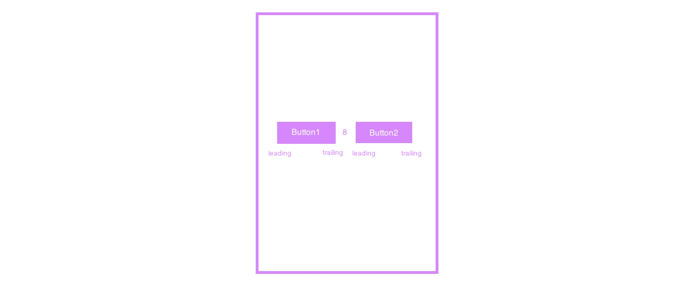
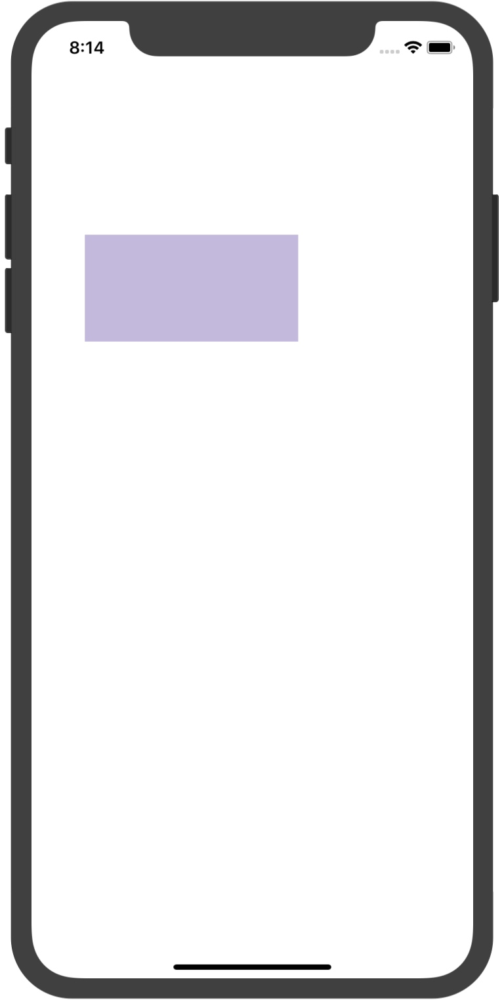
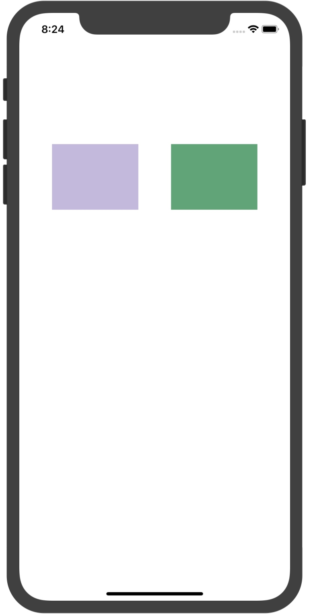
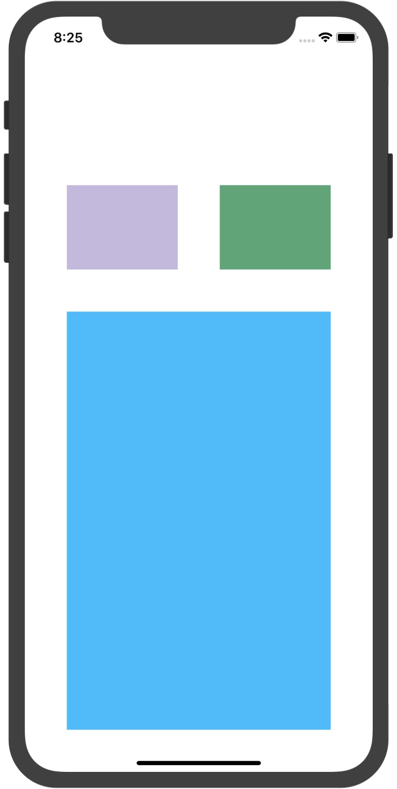

# UI基础（代码布局：NSLayoutConstraint、VFL）

## 前言
在之前的课程中给大家介绍了自动布局的几种方式，同时也让大家熟悉了可视化布局，接下去我们需要学习的是代码布局，主要学习iOS当中的约束类、VFL布局和第三方布局工具：
1. NSLayoutConstraint
2. VFL布局
3. SnapKit


## NSLayoutConstraint

> NSLayoutConstraint类约束定义了两个用户界面对象必须满足约束布局系统的关系。

每一个约束都是一个线性的方程式，如下： 

#### item1.attribute1 = multiplier x item2.attribute2 + constant

以上公式的含义是：*item1 的 property1 属性等于 item2 的 property2 属性乘以 multiplier（系数）再加 constant（常量）*
在这个方程式中，attribute1和attribute2是自动布局调整去解决约束问题的变量，其他值都是我们在创建变量的时候自己定义的。例如：

在定义两个按钮的关系位置时，我们一般会描述为：第二个按钮的前沿应该是第一个按钮后沿8点。如下：


那么，线性方程式表达这个关系就是下面这样：

**Button2.leading = 1.0 x Button1.trailing + 8.0**

自动约束然后会修改前沿和后沿的值去让方程式相等。需要注意的是：自动布局不仅仅是简单的指派值让方程式左右相等。相反的，为了满足约束，系统还可能会修改一或者两个属性。

因此方程式的实际意义是这样的：我们可以交换两个元素的位置去更清晰的表达希望达到的关系。然而，如果我们交换顺序，那么为了保证与原来的线性关系对应，也必须颠倒乘数和常量。如下：

*Button2.leading = 1.0 x Button1.trailing + 8.0*

*Button1.trailing = 1.0 x Button2.leading - 8.0*

> **注意：**
> 必须要注意的是在使用Auto Layout（即自动布局）时，首先需要将视图的 `setTranslatesAutoresizingMaskIntoConstraints` 属性设置为 false。因为这个属性默认是 true，当它为 true 时，运行时系统会自动将 Autoresizing Mask 转换为 Auto Layout 的约束，这些约束很有可能会和我们自己添加的产生冲突，所以在添加约束前关闭此功能。

#### 约束优先级

约束有优先级，从1-1000。优先级为**1000的约束是必须**的。若优先级**小于1000则是可选的**，默认情况下，所有约束优先级都为1000。在解决必须约束之后，自动布局尝试去解决所有其他可选约束的优先级（从高到低）。如果自动布局无法解决可选约束问题，它会尽可能地区接近渴望的结果，然后处理下一个约束。

### NSLayoutConstraint的应用

在Auto Layout中，一个NSLayoutConstraint实例代表着一条约束。

##### 常用方法

```swift
convenience init(
item view1: Any, 
attribute attr1: NSLayoutConstraint.Attribute, 
relatedBy relation: NSLayoutConstraint.Relation, 
toItem view2: Any?, 
attribute attr2: NSLayoutConstraint.Attribute, 
multiplier: CGFloat, 
constant c: CGFloat
)
```
参数说明：

**item**: *指定约束左边的视图view1*

**attribute**: 指定view1的属性attr1，如上、下、左、右等*

**relatedBy**: *指定左右两边的视图的关系relation，如大于、等于、小于*

**toItem**: *指定约束右边的视图view2*

**attribute**: *指定view2的属性attr2，如上、下、左、右等*

**multiplier**: *指定一个与view2属性相乘的乘数multiplier*

**constant**: *指定一个与view2属性相加的浮点数constant*


那么此方法对应的公式为：

**view1.attr1 \<relation> view2.attr2 * multiplier + constant** 

我们在进行布局的时候**按照可视化布局的原则**给每个需要布局的控件添加上对应的约束即可。

我们在界面中添加一个控件myView，给myView添加宽（width：200）、高（height：100）、上边距（top：200）、左边距（leading：50），具体如下代码

```swift
import UIKit

class ViewController: UIViewController {

    var myView: UIView?
    var anotherView: UIView?
    
    override func viewDidLoad() {
        super.viewDidLoad()
        layoutElements()
    }
    
    func layoutElements() {
        
        myView = UIView()
        myView!.backgroundColor = UIColor(red: 194/255.0, green: 183/255.0, blue: 223/255.0, alpha: 1.0)
        //关闭控件的autoresing
        myView?.translatesAutoresizingMaskIntoConstraints = false
        self.view.addSubview(myView!)
        
        anotherView = UIView()
        anotherView?.backgroundColor = UIColor(red: 91/255.0, green: 166/255.0, blue: 117/255.0, alpha: 1.0)
        //关闭控件的autoresing
        anotherView?.translatesAutoresizingMaskIntoConstraints = false
        self.view.addSubview(anotherView!)
        
        //设置myView的高度约束为100
        let view1Constraint1 = NSLayoutConstraint(item: myView!, attribute: .height, relatedBy: .equal, toItem: nil, attribute: NSLayoutConstraint.Attribute.notAnAttribute, multiplier: 1.0, constant: 100)
        view.addConstraint(view1Constraint1)
        
        //设置myView的宽度约束为200
        let view1Constraint2 = NSLayoutConstraint(item: myView!, attribute: .width, relatedBy: .equal, toItem: nil, attribute: NSLayoutConstraint.Attribute.notAnAttribute, multiplier: 1.0, constant: 200)
        view.addConstraint(view1Constraint2)
        
        //设置myView的上边距约束为距离view顶部200
        let view1Constraint3 = NSLayoutConstraint(item: myView!, attribute: .top, relatedBy: .equal, toItem: view, attribute: .top, multiplier: 1.0, constant: 200)
        view.addConstraint(view1Constraint3)
        
        //设置myView的左边距约束为距离view左边距50
        let view1Constraint4 = NSLayoutConstraint(item: myView!, attribute: .leading, relatedBy: .equal, toItem: view, attribute: .leading, multiplier: 1.0, constant: 50)
        view.addConstraint(view1Constraint4)
    }
}
```
效果如下图：


然后我们再在上面的案例中添加一个anotherView，让anotherView的与myView顶部对齐，宽高与myView相等。anotherView的右边距为50，anotherView与myView间的间距为50，如下：

```swift
import UIKit

class ViewController: UIViewController {

    var myView: UIView?
    var anotherView: UIView?
    
    override func viewDidLoad() {
        super.viewDidLoad()
        layoutElements()
    }
    
    func layoutElements() {
        
        myView = UIView()
        myView!.backgroundColor = UIColor(red: 194/255.0, green: 183/255.0, blue: 223/255.0, alpha: 1.0)
        //关闭控件的autoresing
        myView?.translatesAutoresizingMaskIntoConstraints = false
        self.view.addSubview(myView!)
        
        anotherView = UIView()
        anotherView?.backgroundColor = UIColor(red: 91/255.0, green: 166/255.0, blue: 117/255.0, alpha: 1.0)
        //关闭控件的autoresing
        anotherView?.translatesAutoresizingMaskIntoConstraints = false
        self.view.addSubview(anotherView!)
        
        //设置myView的高度约束为100
        let view1Constraint1 = NSLayoutConstraint(item: myView!, attribute: .height, relatedBy: .equal, toItem: nil, attribute: NSLayoutConstraint.Attribute.notAnAttribute, multiplier: 1.0, constant: 100)
        view.addConstraint(view1Constraint1)
        
        //设置myView的上边距约束为距离view顶部200
        let view1Constraint3 = NSLayoutConstraint(item: myView!, attribute: .top, relatedBy: .equal, toItem: view, attribute: .top, multiplier: 1.0, constant: 200)
        view.addConstraint(view1Constraint3)
        
        //设置myView的左边距约束为距离view左边距50
        let view1Constraint4 = NSLayoutConstraint(item: myView!, attribute: .leading, relatedBy: .equal, toItem: view, attribute: .leading, multiplier: 1.0, constant: 50)
        view.addConstraint(view1Constraint4)
        
        //设置anotherView的高度约束为等于myView的高度
        let view2Constraint1 = NSLayoutConstraint(item: anotherView!, attribute: .height, relatedBy: .equal, toItem: myView!, attribute: .height, multiplier: 1.0, constant: 0)
        view.addConstraint(view2Constraint1)
        
        //设置anotherView的宽度约束为等于myView的宽度
        let view2Constraint2 = NSLayoutConstraint(item: anotherView!, attribute: .width, relatedBy: .equal, toItem: myView!, attribute: .width, multiplier: 1.0, constant: 0)
        view.addConstraint(view2Constraint2)
        
        //设置anotherView的左边距约束为leading距离myView的trailing 50
        let view2Constraint3 = NSLayoutConstraint(item: anotherView!, attribute: .leading, relatedBy: .equal, toItem: myView, attribute: .trailing, multiplier: 1.0, constant: 50)
         view.addConstraint(view2Constraint3)
        
        //设置anotherView的右边距约束为距离view的trailing -50
        let view2Constraint4 = NSLayoutConstraint(item: anotherView!, attribute: .trailing, relatedBy: .equal, toItem: view, attribute: .trailing, multiplier: 1.0, constant: -50)
        view.addConstraint(view2Constraint4)
        
        //设置anotherView的上边距约束为等于myViw的上边距
        let view2Constraint5 = NSLayoutConstraint(item: anotherView!, attribute: .top, relatedBy: .equal, toItem: myView, attribute: .top, multiplier: 1.0, constant: 0)
        view.addConstraint(view2Constraint5)
    }
}
```
图下效果：


最后我们再在界面中myView和anotherView的下方添加一个thirdview，thirdView与myView的垂直距离为50，然后距离view的左右边距也为50，下边距也为50:

```swift
import UIKit

class ViewController: UIViewController {

    var myView: UIView?
    var anotherView: UIView?
    var thirdView: UIView?
    
    
    override func viewDidLoad() {
        super.viewDidLoad()
        layoutElements()
    }
    
    func layoutElements() {
        
        myView = UIView()
        myView!.backgroundColor = UIColor(red: 194/255.0, green: 183/255.0, blue: 223/255.0, alpha: 1.0)
        //关闭控件的autoresing
        myView?.translatesAutoresizingMaskIntoConstraints = false
        self.view.addSubview(myView!)
        
        anotherView = UIView()
        anotherView?.backgroundColor = UIColor(red: 91/255.0, green: 166/255.0, blue: 117/255.0, alpha: 1.0)
        //关闭控件的autoresing
        anotherView?.translatesAutoresizingMaskIntoConstraints = false
        self.view.addSubview(anotherView!)
        
        thirdView = UIView()
        thirdView?.backgroundColor = UIColor(red: 68/255.0, green: 184/255.0, blue: 168/255/0, alpha: 1.0)
        thirdView?.translatesAutoresizingMaskIntoConstraints = false
        self.view.addSubview(thirdView!)
        
        //设置myView的高度约束为100
        let view1Constraint1 = NSLayoutConstraint(item: myView!, attribute: .height, relatedBy: .equal, toItem: nil, attribute: NSLayoutConstraint.Attribute.notAnAttribute, multiplier: 1.0, constant: 100)
        view.addConstraint(view1Constraint1)
        
        //设置myView的上边距约束为距离view顶部200
        let view1Constraint3 = NSLayoutConstraint(item: myView!, attribute: .top, relatedBy: .equal, toItem: view, attribute: .top, multiplier: 1.0, constant: 200)
        view.addConstraint(view1Constraint3)
        
        //设置myView的左边距约束为距离view左边距50
        let view1Constraint4 = NSLayoutConstraint(item: myView!, attribute: .leading, relatedBy: .equal, toItem: view, attribute: .leading, multiplier: 1.0, constant: 50)
        view.addConstraint(view1Constraint4)
        
        //设置anotherView的高度约束为等于myView的高度
        let view2Constraint1 = NSLayoutConstraint(item: anotherView!, attribute: .height, relatedBy: .equal, toItem: myView!, attribute: .height, multiplier: 1.0, constant: 0)
        view.addConstraint(view2Constraint1)
        
        //设置anotherView的宽度约束为等于myView的宽度
        let view2Constraint2 = NSLayoutConstraint(item: anotherView!, attribute: .width, relatedBy: .equal, toItem: myView!, attribute: .width, multiplier: 1.0, constant: 0)
        view.addConstraint(view2Constraint2)
        
        //设置anotherView的左边距约束为leading距离myView的trailing 50
        let view2Constraint3 = NSLayoutConstraint(item: anotherView!, attribute: .leading, relatedBy: .equal, toItem: myView, attribute: .trailing, multiplier: 1.0, constant: 50)
         view.addConstraint(view2Constraint3)
        
        //设置anotherView的右边距约束为距离view的trailing -50
        let view2Constraint4 = NSLayoutConstraint(item: anotherView!, attribute: .trailing, relatedBy: .equal, toItem: view, attribute: .trailing, multiplier: 1.0, constant: -50)
        view.addConstraint(view2Constraint4)
        
        //设置anotherView的上边距约束为等于myViw的上边距
        let view2Constraint5 = NSLayoutConstraint(item: anotherView!, attribute: .top, relatedBy: .equal, toItem: myView, attribute: .top, multiplier: 1.0, constant: 0)
        view.addConstraint(view2Constraint5)
        
        //设置thirdView的上边距约束为距离myView的bottom为50
        let view3Constraint1 = NSLayoutConstraint(item: thirdView!, attribute: .top, relatedBy: .equal, toItem: myView, attribute: .bottom, multiplier: 1.0, constant: 50)
        view.addConstraint(view3Constraint1)
        
        //设置vthirdView的左边距约束为距离view的左边50
        let view3Constraint2 = NSLayoutConstraint(item: thirdView!, attribute: .leading, relatedBy: .equal, toItem: view, attribute: .leading, multiplier: 1.0, constant: 50)
        view.addConstraint(view3Constraint2)
        
        //设置vthirdView的下边距约束为距离view的下边的 -50
        let view3Constraint3 = NSLayoutConstraint(item: thirdView!, attribute: .bottom, relatedBy: .equal, toItem: view, attribute: .bottom, multiplier: 1.0, constant: -50)
        view.addConstraint(view3Constraint3)
        
        //设置vthirdView的右边距约束为距离view的右边 -50
        let view3Constraint4 = NSLayoutConstraint(item: thirdView!, attribute: .trailing, relatedBy: .equal, toItem: view, attribute: .trailing, multiplier: 1.0, constant: -50)
        view.addConstraint(view3Constraint4)
    }
}
```
如下效果：


##VFL

以上只是一个小小的案例，从这里大家也可以看出来，我们的界面并不复杂，界面元素也不多，但是通过NSLayoutConstraint这种方式进行布局的话，代码量比较大，而且也并不直观。
我们可以使用另一种比较直观的布局方式来实现布局，VFL，即Visual Format Language，是一种可视化的布局语言。在Swift中，主要通过NSLayoutConstraint类的constraints类方法来实现：

```swift
NSLayoutConstraint.constraints(withVisualFormat format: String, options opts: NSLayoutConstraint.FormatOptions = [], metrics: [String : Any]?, views: [String : Any]) -> [NSLayoutConstraint]
```
### 参数解析

***withVisualFormat***：VFL语句

***options***：可以用来指定VFL中所有对象的布局属性和方向。如：有2个视图使用VFL进行布局，可以使用NSLayoutFormatAlignAllLeft，就让两个视图左对齐；

***metrics***：我们自定义的一个字典，字典中的key可以写在format字串中。编译器在解析时，自动替换为metrics字典中该key所对应的value。比如：

```swift
    let metrics: [String: Double] = ["left": 5, "right": 5, "height": 150.0]
    let format = "|-left-[view]-right-|"
```

***views***：传入一个字典，VFL中key对应我们需要添加约束的所有view。

### VFL语法

如上案例中，我们声明了一个format为：`|-left-[view]-right-|`，表示：view距离父视图的左边5，距离父视图的右边也为5，那么此时我们便可以确定view的宽度了。我们现在来看看如何使用VFL语言，首先需要明白在VFL中各个符号的含义：

`V`：表示纵向
`H`：表示横向
`|`：表示父视图边缘
`-`：表示距离
`>=`：表示视图间距、宽度或高度必须大于或等于某个值
`<=`：表示视图间距、宽度或高度必须小宇或等于某个值
`==`：表示视图间距、宽度或高度必须等于某个值
`@`：表示`>=`、`<=`、`==`限制，最大为1000


> **示例：**

> * <font color="red">|-[view]-|</font> ：视图**处在父视图的左右边缘内**
> * <font color="red">|-[view]</font> ：视图**处在父视图的左边缘**
> * <font color="red">|[view]</font> ：视图**和父视图左边对齐**
> * <font color="red">|-30.0-[view]-30.0-|</font> ： 表示**离父视图左右间距30**
> * <font color="red">[view(200.0)]</font> ： 表示视图**宽度为200.0**
> * <font color="red">|-[view(view1)]-[view1]-|</font> ： 表示**视图宽度一样，并且在父视图左右边缘内**
> * <font color="red">V:|-[view(50.0)]</font> ：视图**高度为50**
> * <font color="red">V:|-(\==padding)-[imageView]->=0-[button]-(==padding)-|</font> ： 表示**离父视图顶部的距离为Padding,这两个视图间距必须大于或等于0并且距离底部父视图为padding。**
> * <font color="red">[wideView(>=60@700)]</font> ： 视图的**宽度为至少为60且不能超过700**
> * **如果没有声明方向默认为水平H:**


```swift
import UIKit

class ViewController: UIViewController {
    
    var myView: UIView?
    var anotherView: UIView?
    var thirdView: UIView?
    
    
    override func viewDidLoad() {
        super.viewDidLoad()
        layoutElements()
    }
    
    func layoutElements() {
        
        myView = UIView()
        myView!.backgroundColor = UIColor(red: 194/255.0, green: 183/255.0, blue: 223/255.0, alpha: 1.0)
        //关闭控件的autoresing
        myView?.translatesAutoresizingMaskIntoConstraints = false
        self.view.addSubview(myView!)
        
        anotherView = UIView()
        anotherView?.backgroundColor = UIColor(red: 91/255.0, green: 166/255.0, blue: 117/255.0, alpha: 1.0)
        //关闭控件的autoresing
        anotherView?.translatesAutoresizingMaskIntoConstraints = false
        self.view.addSubview(anotherView!)
        
        thirdView = UIView()
        thirdView?.backgroundColor = UIColor(red: 68/255.0, green: 184/255.0, blue: 168/255/0, alpha: 1.0)
        thirdView?.translatesAutoresizingMaskIntoConstraints = false
        self.view.addSubview(thirdView!)
        
        let metrics = ["height": 100.0, "margin": 50.0, "top": 200]
        let views = ["myView": myView, "anotherView": anotherView, "thirdView": thirdView]
        
        let constraints1 = NSLayoutConstraint.constraints(withVisualFormat: "|-margin-[myView(anotherView)]-margin-[anotherView(myView)]-margin-|", options: .directionMask, metrics: metrics, views: views as [String : Any])
        
        let constraints2 = NSLayoutConstraint.constraints(withVisualFormat: "V:|-top-[myView(height)]-margin-[thirdView]-margin-|", options: .directionMask, metrics: metrics, views: views as [String : Any])
        
        let constraints3 = NSLayoutConstraint.constraints(withVisualFormat: "V:|-top-[anotherView(myView)]-margin-[thirdView]-margin-|", options: .directionMask, metrics: metrics, views: views as [String : Any])
        
        let constraints4 = NSLayoutConstraint.constraints(withVisualFormat: "|-margin-[thirdView]-margin-|", options: .directionMask, metrics: metrics, views: views as [String : Any])
        
        view.addConstraints(constraints1)
        view.addConstraints(constraints2)
        view.addConstraints(constraints3)
        view.addConstraints(constraints4)
    }
}
```


