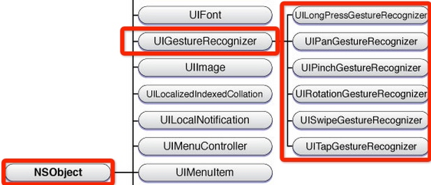

# UI基础(手势识别)

## 前言

在iOS系统中，手势与相应的事件是至关重要的，也是用户进行交互的的重要方式。关于手势的处理iOS为我们提供了一个类：UIGestureRecognizer，通过UIGestureRecognizer类，我们可以轻松的创建出各种手势应用于app中。实质上，UIGestureRecognizer类，是对iOS中的事件传递机制面向应用的封装，将手势消息的传递抽象为了对象。

那么，在了解手势之前，我们先来看看iOS中的事件：

> Events are objects sent to an app to inform it of user actions. In iOS, events can take many forms: Multi-Touch events, motion events, and events for controlling multimedia. This last type of event is known as a remote control event because it can originate from an external accessory.

从以上我们可以看出，iOS中的事件分为三大类：

1. 触摸事件（Multi-Touch events）：对屏幕的触摸所产生的事件
2. 运动事件（Accelerometer events）：对设备的直接操作，比如摇晃
3. 多媒体控制事件（RemoteControl events）：对设备的远程控制，比如耳机线控的按键控制手机歌曲播放


在本节课我们主要学习触摸事件中的手势识别：Gesture Recognizer。

## Gesture Recognizers
Gesture Recognizers是在iOS3中引入的，主要用来识别手势、简化定制视图事件处理的对象。Gesture Recognizers中，以**UIGestureRecognizer作为基类**，这一个抽象基类，定义了实现底层手势识别行为的编程接口。在UIKit框架中提供了6个具体的手势识别类，用来识别常见的手势。这6个手势识别器类如下: 



* UILongPressGestureRecognizer ： 长按手势
* UIPanGestureRecognizer ： 拖拽手势
* UIPinchGestureRecognizer ： 捏合手势，用于缩放
* UIRotationGestureRecognizer ： 旋转手势
* UISwipeGestureRecognizer ： 轻扫手势 
* UITapGestureRecognizer ：敲击，点击手势 

除了以上6个子类以外，还有一个UIPanGestureRecognizer的子类：UIScreenEdgePanGestureRecognizer表示屏幕边缘滑动手势

### 认识UIGestureRecognizer
UIGestureRecognizer作为一个抽象类，它将一些和手势操作相关的方法都抽象出来了，但是其实它本身却并没有实现任何手势，因此，在开发中，一般我们**不会直接使用UIGestureRecognizer的对象**，而是根据相应的手势通过它的子类进行实例化和操作的。

#### 常用手势方法与属性


```swift
    //构造器方法
    public init(target: Any?, action: Selector?)
    
    // 为手势添加动作 (一个手势可以拥有多个动作，当手势响应时会一同触发其所有的事件)
    open func addTarget(_ target: Any, action: Selector)  
      
    // 移除动作
    open func removeTarget(_ target: Any?, action: Selector?)
    
    //设置代理 
    weak open var delegate: UIGestureRecognizerDelegate?
    
    // 设置手势可用
    open var isEnabled: Bool
    
    // 获取手势所作用的 view 
    open var view: UIView? { get }
    
    // 获取手势在指定 view 中的坐标
    open func location(in view: UIView?) -> CGPoint
    
    // 获取触发手势的触摸数
    open var numberOfTouches: Int { get }
```

### 手势状态

**离散手势：**
在这几种手势中，**UITapGestureRecognizer**是离散型手势，离散型手势的特点就是：**一旦识别就无法取消，而且只会调用一次手势操作事件（初始化手势时指定的回调方法）**。

**连续手势：**
​剩下的几种手势是连续手势，连续手势的特点：会**多次调用手势操作事件**，而且在连续手势识别后**可以取消手势**。
​
​下图展示了两种不同状态手势调用操作事件的次数是不同的：
​


在UIGestureRecognizer类中有一个枚举类型的属性，列举了手势的当前状态：

```swift
public enum State : Int {

    case possible   // 默认的状态，尚未识别是何种手势操作（但可能已经触发了触摸事件）
    case began      // //手势已经开始，此时已经被识别，但是这个过程中可能发生变化，手势操作尚未完成
    case changed    // 手势识别发生改变的状态
    case ended      // 手势识别结束，（此时已经松开手指，将会执行触发的方法）
    case cancelled,  // 手势识别取消
    case failed     // 识别失败，方法将不会被调用
    public static var recognized: UIGestureRecognizer.State { get } 
};
```
**状态：**
对于**离散手势** UITapGestureRecgnizer 要么被识别，要么失败。假设我们将点按次数设置为1，并且没有添加长按手势时，点按下去只要没松开则此时不会出发任何事件，一旦松开手指后就会立即识别并调用操作事件，并且状态为ended（已完成）。

对于**连续手势**，会比离散手势复杂，比如：旋转手势，如果两个手指点下去不做任何操作，此时并不能识别手势（因为我们还没旋转）但是其实已经触发了触摸开始事件，此时处于possible默认状态；如果此时旋转则会被识别，那就会调用对应的操作事件，同时状态变成began（手势开始），不过began状态只有一瞬间；紧接着状态就会变为changed（因为我们的旋转需要持续一会），并且会重复调用操作事件；松开手指，此时状态变为ended，并调用1次事件。


## 手势使用步骤

手势使用主要分为三步：

1. 创建手势识别器对象。可以使用构造器去指定一个手势需要触发的事件，在当手势开始，改变、或结束时，可以执行对应的事件。

2. 设置手势识别器对象实例的相关属性（可选部分）

3. 将手势添加到需要识别的 View 中。每个手势只对应一个 View，当屏幕触摸在 View 的边界内时，如果手势和预定的一样，那就会执行指定的事件。

### UITapGestureRecognizer：点击手势（轻点）
点击手势比较简单，支持单击和多次点击，在我们手指触摸屏幕并抬起手指时会进行触发。

**属性：**


```swift
open var numberOfTapsRequired: Int // Default is 1. The number of taps required to match

open var numberOfTouchesRequired: Int // Default is 1. The number of fingers required to match
```

示例：

```swift
import UIKit

class ViewController: UIViewController {

    var myView: UIView?
    
    override func viewDidLoad() {
        super.viewDidLoad()
        
        myView = UIView(frame: CGRect(x: 50, y: 100, width: 200, height: 200))
        myView!.backgroundColor = UIColor(red: 194/255.0, green: 183/255.0, blue: 223/255.0, alpha: 1.0)
        self.view.addSubview(myView!)
        myView?.addGestureRecognizer(UITapGestureRecognizer(target: self, action: #selector(tapGestureOperation(gesture:))))
    }
    
    @objc func tapGestureOperation(gesture: UITapGestureRecognizer) {
        gesture.numberOfTapsRequired = 1
        gesture.numberOfTouchesRequired = 1
        print("It's Tap Gesture")
    }
}
```

> **Tips：**

> 1. 通过 numberOfTouchesRequired 属性设置触摸点数，**默认触摸点数是1**。如果设置为 2 则表示必须两个手指触摸时才会触发。

> 2. 通过 numberOfTapsRequired 属性设置点击次数，**默认是单击次数1**。如果需要设置为双击，则设置为 2。

> 3. 如果一个控件既监听了单击事件也监听了双击事件，默认当双击事件触发的时候也同时会触发单击事件。如果想双击时不触发单击，需要通过 require(toFail:) 进行设置，如下：
> 

```swift
import UIKit

class ViewController: UIViewController {

    var myView: UIView?
    
    override func viewDidLoad() {
        super.viewDidLoad()
        
        myView = UIView(frame: CGRect(x: 50, y: 100, width: 200, height: 200))
        myView!.backgroundColor = UIColor(red: 194/255.0, green: 183/255.0, blue: 223/255.0, alpha: 1.0)
        self.view.addSubview(myView!)

        //单击手势
        let tapSingle=UITapGestureRecognizer(target:self,action:#selector(tapSingleDid))
        tapSingle.numberOfTapsRequired = 1
        tapSingle.numberOfTouchesRequired = 1
        myView?.addGestureRecognizer(tapSingle)
        
        //双击手势
        let tapDouble=UITapGestureRecognizer(target:self,action:#selector(tapDoubleDid(gesture:)))
        tapDouble.numberOfTapsRequired = 2
        tapDouble.numberOfTouchesRequired = 1
        myView?.addGestureRecognizer(tapDouble)
        
        //声明单击事件需要在双击事件检测失败后才会执行
        tapSingle.require(toFail: tapDouble)
    }
    @objc func tapSingleDid(){
        print("单击了")
    }
    @objc func tapDoubleDid(gesture :UITapGestureRecognizer){
        print("双击了")
    }
}
```

### UIPinchGestureRecognizer：捏合手势（两个手指进行放大缩小）
捏合手势是当我们双指捏合和扩张会触发动作的手势，属性如下：


```swift
open var scale: CGFloat //设置缩放比例

open var velocity: CGFloat { get } //获取捏合速度
```

示例：

```swift
import UIKit

class ViewController: UIViewController {
    
    var myView: UIView?
    
    override func viewDidLoad() {
        super.viewDidLoad()
        
        myView = UIView(frame: CGRect(x: 50, y: 100, width: 200, height: 200))
        myView!.backgroundColor = UIColor(red: 194/255.0, green: 183/255.0, blue: 223/255.0, alpha: 1.0)
        self.view.addSubview(myView!)
        
        let tapDouble=UITapGestureRecognizer(target:self,action:#selector(tapDoubleDid(gesture:)))
        tapDouble.numberOfTapsRequired = 2
        tapDouble.numberOfTouchesRequired = 1
        myView?.addGestureRecognizer(tapDouble)
        
        let pinchGesture = UIPinchGestureRecognizer(target: self, action: #selector(pinchGestureOperation(gesture:)))
        pinchGesture.scale = 1.5
        myView?.addGestureRecognizer(pinchGesture)
    }
    @objc func tapDoubleDid(gesture :UITapGestureRecognizer){
        print("双击了")
    }
        
    @objc func pinchGestureOperation(gesture: UIPinchGestureRecognizer){
        //获取捏合的比例
        print("scale:\(gesture.scale)")
        //获取捏合速度
        print("velocity:\(gesture.velocity)")
        //获取手势两个触摸点的坐标
        print(gesture.location(ofTouch: 0, in: gesture.view))
        print(gesture.location(ofTouch: 1, in: gesture.view))
        //设置图片随着捏合放大和缩小
        myView?.transform = CGAffineTransform.init(scaleX: gesture.scale, y: gesture.scale)
    }
}
```

### UIPanGestureRecognizer：拖动手势

当我们点中视图进行慢速拖拽时会触发拖拽手势的方法。

**属性与方法：**


```swift
//设置触发拖拽的最少触摸点，默认为1
open var minimumNumberOfTouches: Int 

//设置触发拖拽的最多触摸点
open var maximumNumberOfTouches: Int 
    
//获取手势当前位置
open func translation(in view: UIView?) -> CGPoint

//设置当前位置
open func setTranslation(_ translation: CGPoint, in view: UIView?)

//设置拖拽速度 
open func velocity(in view: UIView?) -> CGPoint
```

示例：


```swift
import UIKit

class ViewController: UIViewController {

    var myView: UIView?
    
    override func viewDidLoad() {
        super.viewDidLoad()
        
        myView = UIView(frame: CGRect(x: 50, y: 100, width: 200, height: 200))
        myView!.backgroundColor = UIColor(red: 194/255.0, green: 183/255.0, blue: 223/255.0, alpha: 1.0)
        self.view.addSubview(myView!)
        
        let tapDouble=UITapGestureRecognizer(target:self,action:#selector(tapDoubleDid(gesture:)))
        tapDouble.numberOfTapsRequired = 2
        tapDouble.numberOfTouchesRequired = 1
        myView?.addGestureRecognizer(tapDouble)
        
        let pinchGesture = UIPinchGestureRecognizer(target: self, action: #selector(pinchGestureOperation(gesture:)))
        pinchGesture.scale = 1.5
        myView?.addGestureRecognizer(pinchGesture)
        
        let panGesture = UIPanGestureRecognizer(target: self, action: #selector(panGestureOperation(panGesture:)))
        myView?.addGestureRecognizer(panGesture)
    }
    
    @objc func tapDoubleDid(gesture :UITapGestureRecognizer){
        print("双击了")
    }
    
    @objc func pinchGestureOperation(gesture: UIPinchGestureRecognizer){
        //获取捏合的比例
        print("scale:\(gesture.scale)")
        //设置图片随着捏合放大和缩小
        myView?.transform = CGAffineTransform.init(scaleX: gesture.scale, y: gesture.scale)
    }
    
    @objc func panGestureOperation(panGesture: UIPanGestureRecognizer) {
        //获取拖动时手势在view中的位置
        let location = panGesture.location(in: self.view)
        //将myView的center设置为手势的位置，这样就可以跟随手势移动了
        myView?.center = location    
    }
}
```

### UISwipeGestureRecognizer：滑动（快速移动）

滑动手势和拖拽手势的不同之处在于**滑动手势更快，拖拽比较慢**。

**属性与方法：**

```swift
open var numberOfTouchesRequired: Int //设置触发滑动手势的触摸点数

open var direction: UISwipeGestureRecognizer.Direction //设置滑动方向（right、left、up、down），默认是右
```
示例：

```swift
import UIKit

class ViewController: UIViewController {

    var myView: UIView?
    
    override func viewDidLoad() {
        super.viewDidLoad()
        
        myView = UIView(frame: CGRect(x: 50, y: 100, width: 200, height: 200))
        myView!.backgroundColor = UIColor(red: 194/255.0, green: 183/255.0, blue: 223/255.0, alpha: 1.0)
        self.view.addSubview(myView!)
        
        let tapDouble=UITapGestureRecognizer(target:self,action:#selector(tapDoubleDid(gesture:)))
        tapDouble.numberOfTapsRequired = 2
        tapDouble.numberOfTouchesRequired = 1
        myView?.addGestureRecognizer(tapDouble)
        
        let pinchGesture = UIPinchGestureRecognizer(target: self, action: #selector(pinchGestureOperation(gesture:)))
        pinchGesture.scale = 1.5
        myView?.addGestureRecognizer(pinchGesture)
        
        let panGesture = UIPanGestureRecognizer(target: self, action: #selector(panGestureOperation(panGesture:)))
        myView?.addGestureRecognizer(panGesture)
        
        let swipeUpGesture = UISwipeGestureRecognizer(target: self, action: #selector(swipeGestureOperation(gesture:)))
        swipeUpGesture.direction = .up
        myView?.addGestureRecognizer(swipeUpGesture)
        
        let swipeDownGesture = UISwipeGestureRecognizer(target: self, action: #selector(swipeGestureOperation(gesture:)))
        swipeDownGesture.direction = .down
        myView?.addGestureRecognizer(swipeDownGesture)
        
    }
    
    @objc func swipeGestureOperation(gesture: UISwipeGestureRecognizer) {
        //当向上滑或向下滑时，让myView的位置和颜色发生变化
        if gesture.direction == .up || gesture.direction == .down {
            myView?.frame = CGRect(x:0, y: 0, width: 100, height: 100)
            myView?.backgroundColor = UIColor(red: 143/255.0, green: 199/255.0, blue: 199/255.0, alpha: 1.0)
        }
    }
    
    @objc func tapDoubleDid(gesture :UITapGestureRecognizer) {
        print("双击了")
    }
    
    @objc func pinchGestureOperation(gesture: UIPinchGestureRecognizer){
        //获取捏合的比例
        print("scale:\(gesture.scale)")

        //设置图片随着捏合放大和缩小
        myView?.transform = CGAffineTransform.init(scaleX: gesture.scale, y: gesture.scale)
    }
    
    @objc func panGestureOperation(panGesture: UIPanGestureRecognizer) {
        //获取拖动时手势在view中的位置
        let location = panGesture.location(in: self.view)
        //将myView的center设置为手势的位置，这样就可以跟随手势移动了
        myView?.center = location
    }
}
```

### UIRotationGestureRecognizer：旋转手势（两个手指进行旋转）

进行旋转动作时触发手势方法。

**属性：**


```swift
open var rotation: CGFloat //设置旋转角度

open var velocity: CGFloat { get } //获取旋转速度
```

示例：


```swift
import UIKit

class ViewController: UIViewController {

    var myView: UIView?
    
    override func viewDidLoad() {
        super.viewDidLoad()
        
        myView = UIView(frame: CGRect(x: 50, y: 100, width: 200, height: 200))
        myView!.backgroundColor = UIColor(red: 194/255.0, green: 183/255.0, blue: 223/255.0, alpha: 1.0)
        self.view.addSubview(myView!)
        
        let tapDouble=UITapGestureRecognizer(target:self,action:#selector(tapDoubleDid(gesture:)))
        tapDouble.numberOfTapsRequired = 2
        tapDouble.numberOfTouchesRequired = 1
        myView?.addGestureRecognizer(tapDouble)
        
        let pinchGesture = UIPinchGestureRecognizer(target: self, action: #selector(pinchGestureOperation(gesture:)))
        pinchGesture.scale = 1.5
        myView?.addGestureRecognizer(pinchGesture)
        
        let panGesture = UIPanGestureRecognizer(target: self, action: #selector(panGestureOperation(panGesture:)))
        myView?.addGestureRecognizer(panGesture)
        
        let swipeUpGesture = UISwipeGestureRecognizer(target: self, action: #selector(swipeGestureOperation(gesture:)))
        swipeUpGesture.direction = .up
        myView?.addGestureRecognizer(swipeUpGesture)
        
        let swipeDownGesture = UISwipeGestureRecognizer(target: self, action: #selector(swipeGestureOperation(gesture:)))
        swipeDownGesture.direction = .down
        myView?.addGestureRecognizer(swipeDownGesture)
        
        let rotationGesture = UIRotationGestureRecognizer(target: self, action: #selector(rotationGestureOperation(gesture:)))
        myView?.addGestureRecognizer(rotationGesture)
    }
    
    @objc func rotationGestureOperation(gesture: UIRotationGestureRecognizer) {
        myView?.transform = CGAffineTransform.init(rotationAngle: gesture.rotation)
    }
    
    @objc func swipeGestureOperation(gesture: UISwipeGestureRecognizer) {
        //当向上滑或向下滑时，让myView的位置和颜色发生变化
        if gesture.direction == .up || gesture.direction == .down {
            myView?.frame = CGRect(x:0, y: 0, width: 100, height: 100)
            myView?.backgroundColor = UIColor(red: 143/255.0, green: 199/255.0, blue: 199/255.0, alpha: 1.0)
        }
    }
    
    @objc func tapDoubleDid(gesture :UITapGestureRecognizer) {
        print("双击了")
    }
    
    @objc func pinchGestureOperation(gesture: UIPinchGestureRecognizer){
        //获取捏合的比例
        print("scale:\(gesture.scale)")

        //设置图片随着捏合放大和缩小
        myView?.transform = CGAffineTransform.init(scaleX: gesture.scale, y: gesture.scale)
    }
    
    @objc func panGestureOperation(panGesture: UIPanGestureRecognizer) {
        //获取拖动时手势在view中的位置
        let location = panGesture.location(in: self.view)
        //将myView的center设置为手势的位置，这样就可以跟随手势移动了
        myView?.center = location
        
    }
}
```

### UILongPressGestureRecognizer：长按

进行长按的时候触发的手势方法。

**属性和方法：**

```swift
open var numberOfTapsRequired: Int //设置触发前的点击次数
open var numberOfTouchesRequired: Int //设置触发的触摸点数，默认是1    
open var minimumPressDuration: TimeInterval //设置最短的长按时间，默认是0.5秒
open var allowableMovement: CGFloat //设置在按触时时允许移动的最大距离 默认为10像素
```
示例：

```swift
import UIKit

class ViewController: UIViewController {

    var myView: UIView?
    
    override func viewDidLoad() {
        super.viewDidLoad()
        
        myView = UIView(frame: CGRect(x: 50, y: 100, width: 200, height: 200))
        myView!.backgroundColor = UIColor(red: 194/255.0, green: 183/255.0, blue: 223/255.0, alpha: 1.0)
        self.view.addSubview(myView!)
        
        let tapDouble=UITapGestureRecognizer(target:self,action:#selector(tapDoubleDid(gesture:)))
        tapDouble.numberOfTapsRequired = 2
        tapDouble.numberOfTouchesRequired = 1
        myView?.addGestureRecognizer(tapDouble)
        
        let pinchGesture = UIPinchGestureRecognizer(target: self, action: #selector(pinchGestureOperation(gesture:)))
        pinchGesture.scale = 1.5
        myView?.addGestureRecognizer(pinchGesture)
        
        let panGesture = UIPanGestureRecognizer(target: self, action: #selector(panGestureOperation(panGesture:)))
        myView?.addGestureRecognizer(panGesture)
        
        let swipeUpGesture = UISwipeGestureRecognizer(target: self, action: #selector(swipeGestureOperation(gesture:)))
        swipeUpGesture.direction = .up
        myView?.addGestureRecognizer(swipeUpGesture)
        
        let swipeDownGesture = UISwipeGestureRecognizer(target: self, action: #selector(swipeGestureOperation(gesture:)))
        swipeDownGesture.direction = .down
        myView?.addGestureRecognizer(swipeDownGesture)
        
        let rotationGesture = UIRotationGestureRecognizer(target: self, action: #selector(rotationGestureOperation(gesture:)))
        myView?.addGestureRecognizer(rotationGesture)
        
        let longPressGesture = UILongPressGestureRecognizer(target: self, action: #selector(longPressGestureOperation(gestrue:)))
        myView?.addGestureRecognizer(longPressGesture)
    }
    
    @objc func longPressGestureOperation(gestrue: UILongPressGestureRecognizer) {
        if gestrue.state == .began {
            print("长按响应开始")
        } else {
            print("长按响应结束")
        }
    }
    
    @objc func rotationGestureOperation(gesture: UIRotationGestureRecognizer) {
        myView?.transform = CGAffineTransform.init(rotationAngle: gesture.rotation)
    }
    
    @objc func swipeGestureOperation(gesture: UISwipeGestureRecognizer) {
        //当向上滑或向下滑时，让myView的位置和颜色发生变化
        if gesture.direction == .up || gesture.direction == .down {
            myView?.frame = CGRect(x:0, y: 0, width: 100, height: 100)
            myView?.backgroundColor = UIColor(red: 143/255.0, green: 199/255.0, blue: 199/255.0, alpha: 1.0)
        }
    }
    
    @objc func tapDoubleDid(gesture :UITapGestureRecognizer) {
        print("双击了")
    }
    
    @objc func pinchGestureOperation(gesture: UIPinchGestureRecognizer){
        //获取捏合的比例
        print("scale:\(gesture.scale)")

        //设置图片随着捏合放大和缩小
        myView?.transform = CGAffineTransform.init(scaleX: gesture.scale, y: gesture.scale)
    }
    
    @objc func panGestureOperation(panGesture: UIPanGestureRecognizer) {
        //获取拖动时手势在view中的位置
        let location = panGesture.location(in: self.view)
        //将myView的center设置为手势的位置，这样就可以跟随手势移动了
        myView?.center = location
    }
}
```

### UIScreenEdgePanGestureRecognizer：边缘滑动 

UIPanGestureRecognizer 的子类，只触发从边缘开始的划动操作，比如从左侧边缘开始向右滑动。只有一个 edges 属性。表示要响应哪个边缘的划动操作。可以是从左边缘向右滑动，或右边缘向左、上边缘向下、下边缘向上、或响应全部边缘滑动。

**属性：**

```swift
open var edges: UIRectEdge // （top、left、bottom、right、all）
```

示例：

```swift
import UIKit

class ViewController: UIViewController {

    var myView: UIView?
    
    override func viewDidLoad() {
        super.viewDidLoad()
        
        myView = UIView(frame: CGRect(x: 50, y: 100, width: 200, height: 200))
        myView!.backgroundColor = UIColor(red: 194/255.0, green: 183/255.0, blue: 223/255.0, alpha: 1.0)
        self.view.addSubview(myView!)
        
        let screenEdgeGesture = UIScreenEdgePanGestureRecognizer(target: self, action: #selector(screenEdgeGestureOperation(gesture:)))
        screenEdgeGesture.edges = .left
        view.addGestureRecognizer(screenEdgeGesture)
    }
    
    @objc func screenEdgeGestureOperation(gesture: UIScreenEdgePanGestureRecognizer) {
        print("屏幕边缘滑动")
    }
}
```


