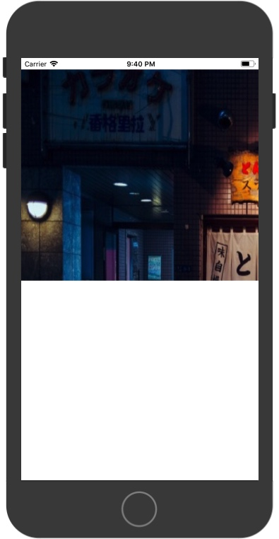
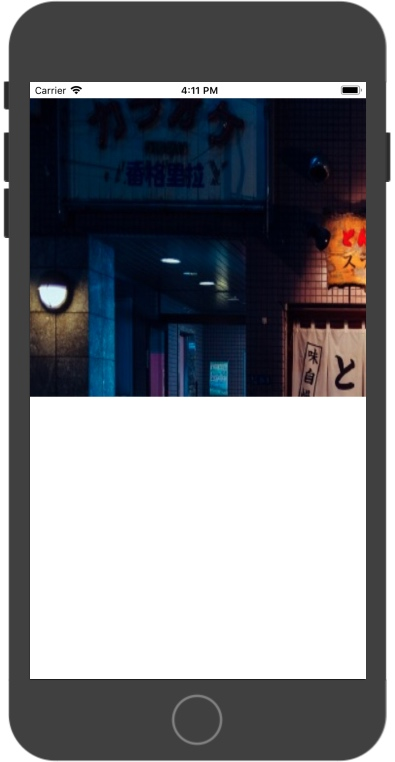
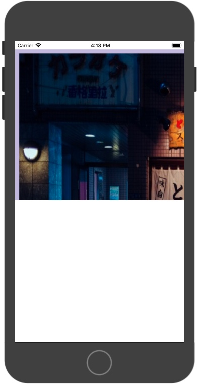
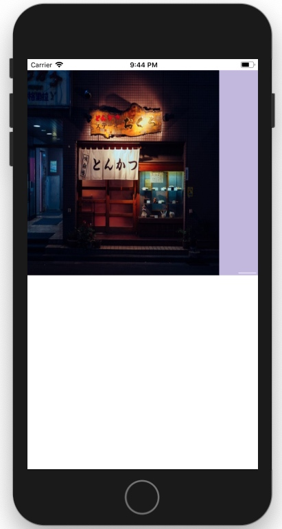

# UI拓展与实践（UIScrollView）

## 前言
在一些复杂的应用中，往往都会有许多页面，或者每个页面有都包含着复杂的内容、大量的内容。不过目前我们的手机屏幕大小却是有限的，所以用户可以直接看到的内容也仅限于屏幕视窗所展示出来的内容，因而直接展示在用户眼前的内容也极其有限，所以一旦当展示的内容比较多，超出一个屏幕的范围后我们就没办法直接看到了，此时，用户可以通过滚动来查看屏幕之外的内容了。在iOS中，主要通过UIScrollView来实现。

## UIScrollView
UIScrollView 是一个能够滚动、滑动的视图，它直接继承了UIView，实现了NSCoding协议。通常为了显示**多于一个屏幕的内容**时，在UIScrollView中我们可以通过上下滚动或左右滚动来显示更多的内容。它还有几个子类，同样可以支持滚动：UITableView（列表视图）、UICollectionView（与列表视图相似）、UITextView(用来显示大量的文字)等。

### 使用步骤

1. 创建UIScrollView，可以通过构造器方法同时设置scrollView的frame，并添加到view中
2. 设置scrollView的相关属性，其中，contentSize为必须要设置的属性，否则无法实现滚动
3. 创建内容，创建后将视图添加进scrollView中。

示例：

```swift
import UIKit

let SCREEN_HEIGHT = UIScreen.main.bounds.size.height
let SCREEN_WIDTH = UIScreen.main.bounds.size.width

class ViewController: UIViewController {
    
    var scrollView = UIScrollView()
    
    override func viewDidLoad() {
        super.viewDidLoad()
        setViews()
    }
    func setViews() {
        scrollView.frame = CGRect(x: 0, y: 20, width: SCREEN_WIDTH, height: SCREEN_HEIGHT * 0.5)
        scrollView.backgroundColor = UIColor(red: 194/255.0, green: 183/255.0, blue: 223/255.0, alpha: 1.0)
        view.addSubview(scrollView)
        
        //设置SscrollView滚动区域高度为屏幕高度的一半，宽度等于屏幕宽度
        scrollView.contentSize = CGSize(width: SCREEN_WIDTH * 2, height: SCREEN_HEIGHT)
        
        let content = UIImageView(image: UIImage(named: "pic4"))
        content.frame = CGRect(x: 0, y: 0, width: SCREEN_WIDTH * 2, height: SCREEN_HEIGHT)
        scrollView.addSubview(content)
    }
}
```



### 常用属性和方法

#### 属性

* **contentOffset** ：表示偏移量，默认是CGPointZero，通常用在UIScrollView的代理方法中，在拖拽时用于进行距离判断等操作。

```swift
open var contentOffset: CGPoint // default CGPointZero
```

示例：

```swift
//在一个scrollView中，当视图被滚动时会调用此方法
func scrollViewDidScroll(_ scrollView: UIScrollView){
    // 向下拉动偏移量大于等于20
    if scrollView.contentOffset.y  >= -20 {
        print("Offset_Y : \(scrollView.contentOffset.y)")
    }
}
```

* **contentSize** ：表示滚动区域大小，默认是CGSizeZero，width代表x轴方向滚动区域的长度，height代表Y轴方向滚动区域的长度。此属性必须要设置的，否则无法正常实现滚动。

```swift
open var contentSize: CGSize // default CGSizeZero
```

示例：


```swift
import UIKit

let SCREEN_HEIGHT = UIScreen.main.bounds.size.height
let SCREEN_WIDTH = UIScreen.main.bounds.size.width

class ViewController: UIViewController {

    var scrollView = UIScrollView()
    
    override func viewDidLoad() {
        super.viewDidLoad()
        setViews()
    }
    func setViews() {
        scrollView.frame = CGRect(x: 0, y: 20, width: SCREEN_WIDTH, height: SCREEN_HEIGHT * 0.5)
        scrollView.backgroundColor = UIColor(red: 194/255.0, green: 183/255.0, blue: 223/255.0, alpha: 1.0)
        view.addSubview(scrollView)
        
        //设置SscrollView滚动区域高度为屏幕高度的一半，宽度等于屏幕宽度
        scrollView.contentSize = CGSize(width: SCREEN_WIDTH * 2, height: SCREEN_HEIGHT)
        
        let content = UIImageView(image: UIImage(named: "pic4"))
        content.frame = CGRect(x: 0, y: 0, width: SCREEN_WIDTH * 2, height: SCREEN_HEIGHT)
        scrollView.addSubview(content)
    }
}
```
效果如下图：




* **contentInset** ：滑动区域边缘额外**添加内容以外的可滑动区域**，默认是UIEdgeInsetsZero，top、bottom、left、right分别代表顶部和底部可滑动区域，如下：

```swift
scrollView.contentInset = UIEdgeInsets(top: 10, left: 10, bottom: 10, right: 10)
```
在以上案例中，添加上contentInset后效果如下：




* **isDirectionalLockEnabled** ：默认为FALSE，如果设置为TRUE，那么在滚动UIScrollView的时候，会锁住水平或竖直方向的滑动。
> 即当我们在滚动的时候，如果一开始滚动的方向是轴方向，那么y轴方就被锁定了，这个时候时无法同时上下滚动的（此时手还没有放开）；反之，如果我们一开始滚动的方向是y轴方向，那么我们就无法同时在x轴方向上滚动（此时手还没有放开）。

* **bounces** ：弹性效果，当我们滑动时内容到scrollView的边缘后不松开仍然向窗口中拖拽后再松开，则会弹回去。默认是true，如果设置成false，则当我们滑动到边缘时将不具有弹性效果。

* **alwaysBounceVertical** ：竖直方向总是可以弹性滑动，默认是false, 当设置为true时，即使contentSize设置的width 和 height都比scrollView的width 和 height小，但是在垂直方向上都可以滑动且有弹性效果，甚至即使我们不设置contentSize都可以产生效果； 反之，如果设置alwaysBounceVertical为false， 那么当contentSize设置的width 和 height都比UIScrollView的width 和 height小的时候，即使bounces设置为true，那么不可能产生弹性效果

> **注意：**
> 不过如果想要让alwaysBounceVertical为true时能够生效，前提必须是**bounces属性要为true**，否则也是无法生效的

示例：

```swift
import UIKit

let SCREEN_HEIGHT = UIScreen.main.bounds.size.height
let SCREEN_WIDTH = UIScreen.main.bounds.size.width

class ViewController: UIViewController {

    var scrollView = UIScrollView()
    
    override func viewDidLoad() {
        super.viewDidLoad()
        setViews()
    }
    func setViews() {
        scrollView.frame = CGRect(x: 0, y: 20, width: SCREEN_WIDTH, height: SCREEN_HEIGHT * 0.5)
        scrollView.backgroundColor = UIColor(red: 194/255.0, green: 183/255.0, blue: 223/255.0, alpha: 1.0)
        view.addSubview(scrollView)
        
        //设置scrollView滚动区域高度为屏幕高度的0.25倍，宽度等于屏幕宽度0.5倍。原则上此时屏幕无法滚动
        scrollView.contentSize = CGSize(width: SCREEN_WIDTH * 0.5, height: SCREEN_HEIGHT * 0.25)
        scrollView.contentInset = UIEdgeInsets(top: 10, left: 10, bottom: 10, right: 10)
        scrollView.isDirectionalLockEnabled = true
        scrollView.bounces = true
        scrollView.alwaysBounceVertical = true//设置后，垂直方向可以滚动，且有弹性效果
           
        let content = UIImageView(image: UIImage(named: "pic4"))
        content.frame = CGRect(x: 0, y: 0, width: SCREEN_WIDTH * 2, height: SCREEN_HEIGHT)
        scrollView.addSubview(content)
    }
}
```

* **alwaysBounceHorizontal** ：水平方向总是可以弹性滑动，默认是false，使用方式与alwaysBounceVertical相同。

* **isPagingEnabled** ：是否可分页，默认是FALSE， 如果设置成TRUE，则在滚动时就会产生分页的效果。

示例：


```swift
import UIKit

let SCREEN_HEIGHT = UIScreen.main.bounds.size.height
let SCREEN_WIDTH = UIScreen.main.bounds.size.width

class ViewController: UIViewController {

    var scrollView = UIScrollView()
    
    override func viewDidLoad() {
        super.viewDidLoad()
        setViews()
    }
    func setViews() {
        scrollView.frame = CGRect(x: 0, y: 20, width: SCREEN_WIDTH, height: SCREEN_HEIGHT * 0.5)
        scrollView.backgroundColor = UIColor(red: 194/255.0, green: 183/255.0, blue: 223/255.0, alpha: 1.0)
        //设置scrollView滚动区域宽度为屏幕高度的3倍，宽度等于屏幕宽度一半。
        scrollView.contentSize = CGSize(width: SCREEN_WIDTH * 4, height: SCREEN_HEIGHT * 0.5)
        //scrollView.isPagingEnabled = true
        view.addSubview(scrollView)
        
        let content1 = UIImageView(image: UIImage(named: "pic1"))
        content1.frame = CGRect(x: 0, y: 0, width: SCREEN_WIDTH, height: SCREEN_HEIGHT * 0.5)
        content1.contentMode = .scaleToFill
        scrollView.addSubview(content1)
        
        let content2 = UIImageView(image: UIImage(named: "pic2"))
        content2.frame = CGRect(x: SCREEN_WIDTH, y: 0, width: SCREEN_WIDTH, height: SCREEN_HEIGHT * 0.5)
        content2.contentMode = .scaleToFill
        scrollView.addSubview(content2)
        
        let content3 = UIImageView(image: UIImage(named: "pic3"))
        content3.frame = CGRect(x: SCREEN_WIDTH * 2, y: 0, width: SCREEN_WIDTH, height: SCREEN_HEIGHT * 0.5)
        content3.contentMode = .scaleToFill
        scrollView.addSubview(content3)
        
        let content4 = UIImageView(image: UIImage(named: "pic4"))
        content4.frame = CGRect(x: SCREEN_WIDTH * 3, y: 0, width: SCREEN_WIDTH, height: SCREEN_HEIGHT * 0.5)
        content4.contentMode = .scaleToFill
        scrollView.addSubview(content4)
        
    }
}
```

* **isScrollEnabled** ：是否可滑动，默认是TRUE, 如果默认为FLASE, 则无法滑动。如果想禁止用户滚动，则可以直接将此属性设置成false

* **showsHorizontalScrollIndicator** ：是否显示水平方向滑动条，默认是TRUE, 如果设置为FALSE，当滑动的时候则不会显示水平滑动条

* **showsVerticalScrollIndicator** ：是否显示垂直方向上滑动条，默认是TRUE, 如果设置为FALSE，当滑动的时候则不会显示垂直方向上的滑动条

* **scrollIndicatorInsets** ：设置滚动条距离scrollView上、左、下、右边缘的距离

```swift
// 当向下滑动时，滑动条总是距离右边20
scrollView.scrollIndicatorInsets = UIEdgeInsets(top: 0, left: 0, bottom: 0, right: 20)
```

* **indicatorStyle** ：设置滑动条颜色， 默认是灰白色。是个枚举类型，如下：

```swift
typedef NS_ENUM(NSInteger, UIScrollViewIndicatorStyle) {
    UIScrollViewIndicatorStyleDefault,     //灰白色，搭配任意背景色
    UIScrollViewIndicatorStyleBlack,       //黑色，搭配白色背景最佳    
    UIScrollViewIndicatorStyleWhite        // 白色，搭配黑色背景最佳
};
```

示例：

```swift
scrollView.indicatorStyle = .white
```




* **delaysContentTouches** 延迟内容的触摸响应。默认为true，即延迟scrollView中子控件响应，优先响应UIScrollView事件。比如会延迟按钮的响应事件，优先响应scrollView。如果设置成false，则不会延迟内容的触摸响应，那么就会优先出发滚动视图上的子控件的事件（如果可以响应事件的话）。

示例：


```swift
import UIKit

let SCREEN_HEIGHT = UIScreen.main.bounds.size.height
let SCREEN_WIDTH = UIScreen.main.bounds.size.width

class ViewController: UIViewController {

    var scrollView = UIScrollView()
    
    override func viewDidLoad() {
        super.viewDidLoad()
        setViews()
    }
    func setViews() {
        scrollView.frame = CGRect(x: 0, y: 20, width: SCREEN_WIDTH, height: SCREEN_HEIGHT * 0.5)
        scrollView.backgroundColor = UIColor(red: 194/255.0, green: 183/255.0, blue: 223/255.0, alpha: 1.0)
        //设置scrollView滚动区域宽度为屏幕高度的3倍，宽度等于屏幕宽度一半。
        scrollView.contentSize = CGSize(width: SCREEN_WIDTH * 5, height: SCREEN_HEIGHT * 0.5)
        scrollView.isPagingEnabled = true
        scrollView.indicatorStyle = .white
        scrollView.delaysContentTouches = false
        scrollView.scrollsToTop = true
        view.addSubview(scrollView)
        
        let content1 = UIImageView(image: UIImage(named: "pic1"))
        content1.frame = CGRect(x: 0, y: 0, width: SCREEN_WIDTH, height: SCREEN_HEIGHT * 0.5)
        content1.contentMode = .scaleToFill
        scrollView.addSubview(content1)
        
        let content2 = UIImageView(image: UIImage(named: "pic2"))
        content2.frame = CGRect(x: SCREEN_WIDTH, y: 0, width: SCREEN_WIDTH, height: SCREEN_HEIGHT * 0.5)
        content2.contentMode = .scaleToFill
        scrollView.addSubview(content2)
        
        let content3 = UIImageView(image: UIImage(named: "pic3"))
        content3.frame = CGRect(x: SCREEN_WIDTH * 2, y: 0, width: SCREEN_WIDTH, height: SCREEN_HEIGHT * 0.5)
        content3.contentMode = .scaleToFill
        scrollView.addSubview(content3)
        
        let content4 = UIImageView(image: UIImage(named: "pic4"))
        content4.frame = CGRect(x: SCREEN_WIDTH * 3, y: 0, width: SCREEN_WIDTH, height: SCREEN_HEIGHT * 0.5)
        content4.contentMode = .scaleToFill
        scrollView.addSubview(content4)
        
        let btn = UIButton(frame: CGRect(x: SCREEN_WIDTH * 4.3, y: 100, width: 100, height: 20))
        btn.setTitle("点击", for: .normal)
        btn.setTitleColor(UIColor.purple, for: .normal)
        btn.backgroundColor = UIColor.white
        btn.addTarget(self, action: #selector(btnOnclick), for: .touchUpInside)
        scrollView.addSubview(btn)
    }
    
    @objc func btnOnclick() {
        print("按钮被点击了")
    }
}
```

> **Tips：**
> 一般情况下，建议使用该属性的默认值，如果不延迟内容触摸响应，优先响应scrollView中子控件，那么很可能会造成用户的误操作，比如上面的例子，用户的行为操作本意是左右滚动，只不过不小心触摸到了按钮上，这时如果按钮绑定了一些特殊的操作，比如页面跳转，这时就会执行用户所不期望的跳转动作，显然这样的体验是很差的。

#### 方法

* **setContentOffset(_ contentOffset: CGPoint, animated: Bool)** ：设置或者指定滚动的偏移量（动画），如果我们需要在某一处触发某个事件就滑动到指定的位置，可以使用这个方法。

示例：


```swift
import UIKit

let SCREEN_HEIGHT = UIScreen.main.bounds.size.height
let SCREEN_WIDTH = UIScreen.main.bounds.size.width

class ViewController: UIViewController, UIScrollViewDelegate{

    var scrollView = UIScrollView()
    
    override func viewDidLoad() {
        super.viewDidLoad()
        setViews()
    }
    func setViews() {
        scrollView.frame = CGRect(x: 0, y: 20, width: SCREEN_WIDTH, height: SCREEN_HEIGHT * 0.5)
        scrollView.backgroundColor = UIColor(red: 194/255.0, green: 183/255.0, blue: 223/255.0, alpha: 1.0)
        //设置scrollView滚动区域宽度为屏幕高度的3倍，宽度等于屏幕宽度一半。
        scrollView.contentSize = CGSize(width: SCREEN_WIDTH * 4, height: SCREEN_HEIGHT * 0.5)
        scrollView.isPagingEnabled = true
        scrollView.indicatorStyle = .white
        scrollView.delaysContentTouches = false
        scrollView.scrollsToTop = true
        scrollView.delegate = self
        view.addSubview(scrollView)
        
        let content1 = UIImageView(image: UIImage(named: "pic1"))
        content1.frame = CGRect(x: 0, y: 0, width: SCREEN_WIDTH, height: SCREEN_HEIGHT * 0.5)
        content1.contentMode = .scaleToFill
        scrollView.addSubview(content1)
        
        let content2 = UIImageView(image: UIImage(named: "pic2"))
        content2.frame = CGRect(x: SCREEN_WIDTH, y: 0, width: SCREEN_WIDTH, height: SCREEN_HEIGHT * 0.5)
        content2.contentMode = .scaleToFill
        scrollView.addSubview(content2)
        
        let content3 = UIImageView(image: UIImage(named: "pic3"))
        content3.frame = CGRect(x: SCREEN_WIDTH * 2, y: 0, width: SCREEN_WIDTH, height: SCREEN_HEIGHT * 0.5)
        content3.contentMode = .scaleToFill
        scrollView.addSubview(content3)
        
        let content4 = UIImageView(image: UIImage(named: "pic4"))
        content4.frame = CGRect(x: SCREEN_WIDTH * 3, y: 0, width: SCREEN_WIDTH, height: SCREEN_HEIGHT * 0.5)
        content4.contentMode = .scaleToFill
        scrollView.addSubview(content4)
    }
    
    @objc func btnOnclick() {
        print("按钮被点击了")
    }
    
    func scrollViewDidScroll(_ scrollView: UIScrollView) {
        //设置，当滚动到最后一张时，让内容回到第一张
        if scrollView.contentOffset.x > SCREEN_WIDTH * 3.2 {
            scrollView.setContentOffset(CGPoint(x: 0, y: 0), animated: true)
        }
    }
}
```

* **flashScrollIndicators()** ：滑动条闪烁。当页面加载成功出现时，滑动条会自动显示出来，停留一下又自动隐藏；如果没设置的话，页面出现时也不会显示滑动条，只有在滑动过程中才会显示滑动条。


* **touchesShouldBegin(_ touches: Set<UITouch>, with event: UIEvent?, in view: UIView) -> Bool** ：触摸事件开始响应UIScrollView的子视图（比如button）的事件。如果返回false则触摸事件一定不会传递给子视图，不过直接点击除外，因为直接点击子视图，子视图立马响应自己的方法。

* **touchesShouldCancel(in view: UIView) -> Bool** ：触摸事件取消，返回true直接取消UIScrollView的子视图的响应，直接由UIScrollView响应；返回false则会响应UIScrollView的子视图事件。


## 代理（UIScrollViewDelegate）

我们还可以通过UIScrollView的代理方法来监听scrollView，具体使用流程如下：

1. 在类声明中引入UIScrollViewDelegate， `class ViewController: UIViewController, UIScrollViewDelegate{}`
 
2. 让当前控制器成为scrollView的代理：`scrollView.delegate = self`
3. 实现代理方法，代理方法如下

```swift
    
    func scrollViewDidScroll(_ scrollView: UIScrollView) {
        print("scrollView滚动时调用，只要offset的值发生变化就调用")
    }
    
    func scrollViewWillBeginZooming(_ scrollView: UIScrollView, with view: UIView?) {
        print("当将要开始缩放时，执行该方法。一次有效缩放就只执行一次。")
    }
    
    func scrollViewDidZoom(_ scrollView: UIScrollView) {
        print("当scrollView缩放时，调用该方法。在缩放过程中，会多次调用")
    }
    
    func scrollViewDidEndZooming(_ scrollView: UIScrollView, with view: UIView?, atScale scale: CGFloat) {
        print("当缩放结束后，并且缩放大小回到minimumZoomScale与maximumZoomScale之间后（我们也许会超出缩放范围），调用该方法。")
    }
    
    func viewForZooming(in scrollView: UIScrollView) -> UIView? {
        print("返回将要缩放的UIView对象。要执行多次")
        return scrollView.subviews.first
    }
    
    func scrollViewShouldScrollToTop(_ scrollView: UIScrollView) -> Bool {
        print("指示当用户点击状态栏后，滚动视图是否能够滚动到顶部。")// 需要设置滚动视图的属性：scrollView.scrollsToTop=true
        return true
    }
    
    func scrollViewDidScrollToTop(_ scrollView: UIScrollView) {
        print("当滚动视图滚动到最顶端后，执行该方法")
    }
    
    func scrollViewWillBeginDragging(_ scrollView: UIScrollView) {
        print("当开始滚动视图时，执行该方法。一次有效滑动只执行一次。")
    }
    
    func scrollViewDidEndDragging(_ scrollView: UIScrollView, willDecelerate decelerate: Bool) {
        print("滑动视图，当手指离开屏幕那一霎那，调用该方法。一次有效滑动只执行一次。")
    }
    
    func scrollViewWillBeginDecelerating(_ scrollView: UIScrollView) {
        print("滑动减速时调用该方法。")
    }
    
    func scrollViewDidEndDecelerating(_ scrollView: UIScrollView) {
        print("滚动视图减速完成，滚动将停止时，调用该方法。一次有效滑动只执行一次。")
    }
    
    func scrollViewDidEndScrollingAnimation(_ scrollView: UIScrollView) {
        print("当滚动视图动画完成后，调用该方法，如果没有动画，那么该方法将不被调用")
    }

    func scrollViewWillEndDragging(_ scrollView: UIScrollView, withVelocity velocity: CGPoint, targetContentOffset: UnsafeMutablePointer<CGPoint>) {
        print("滑动scrollView，并且手指离开时执行。一次有效滑动只执行一次。") //当pagingEnabled属性为true时，不调用该方法
    }
```


