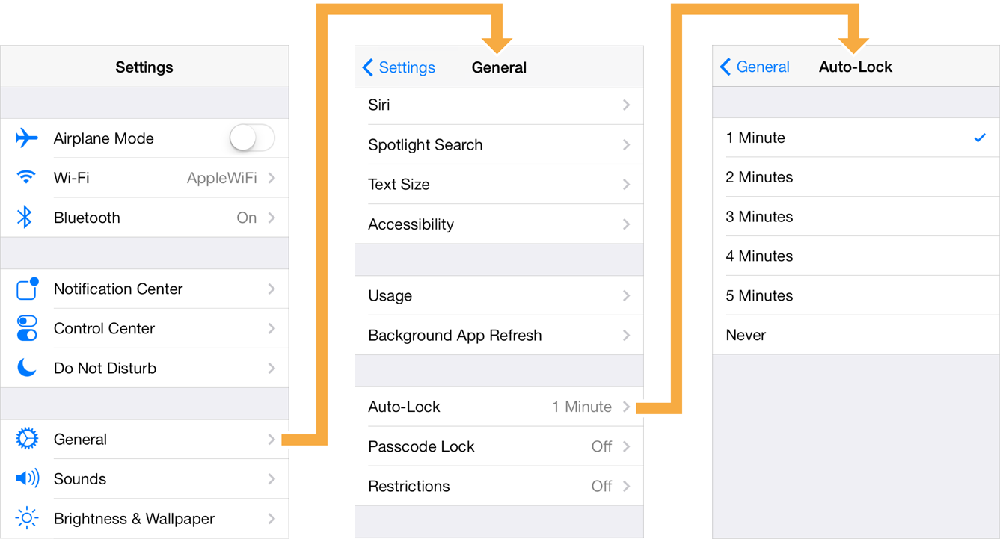

# UI拓展与实践（导航控制器）

导航控制器，即UINavigationController，是用于构建层级应用的主要工具，是iOS编程中比较常用的一种容器view controller，很多系统的控件(如UIImagePickerViewController)以及常用的APP中(如QQ，微博、微信等)都需要用到它。
它用来管理导航界面中的一个或多个子视图控制器。在这种类型的界面中，一次只能看到一个子视图控制器。在视图控制器中选择项目会使用动画在屏幕上推送新的视图控制器，从而隐藏先前的视图控制器。点击界面顶部导航栏中的后退按钮可移除顶视图控制器，从而显示下方的视图控制器。它与UITabBarController在管理以及互相切换内容视图的方式类似。不过，两者间的区别主要在与UINavigationController是通过栈来进行管理的，因此也计较适合用于处理层级结构。

示例：Settings（系统设置）




上图展示的是iOS中的Settings的导航界面示例图。第一个界面向用户显示来包含首选项的设置列表。当用户选择了其中的一个设置项后（上图中选的是General），程序会将General页面显示出来中，然后隐藏Settings页面。同理，在General页面，用户选择Auto-Lock则会显示Auto-Lock页面，然后隐藏General页面，以此类推。在对象管理上，导航控制器使用了导航栈。根视图控制器在栈最底层，接下来入栈的是General视图控制器和Auto-Lock视图控制器。可以调用`pushViewController(_ viewController: UIViewController, animated: Bool)`方法将视图控制器推入栈顶，也可以调用`popViewController(animated: Bool) -> UIViewController?`方法将视图控制器弹出堆栈。

> **注意：**
> **对于除根视图之外的所有视图，导航控制器默认会提供后退按钮，用来让用户向后移动层次结构。**

## 导航栈

栈是一种常用的数据结构，采用后进先出（LIFO，即Last in, First out）的原则。

> ***几个概念***

> * 向栈中添加对象的操作被称为**入栈（push）**，即把对象推到栈中。 
> * 第一个入栈的对象叫做**栈底（base）**。
> * 最后一个入栈的对象叫做**栈顶（top）**，下一个被拖入的对象将取代它成为新的栈顶。
> * 从栈中删除对象的操作被称为**出栈（pop）**。出栈的那个对象永远是最后被推入栈的。同理。第一个入栈的对象也永远是对后一个出栈的。

导航控制器对象使用**有序数组**（称为**导航栈**）管理其子视图控制器。数组中的**第一个视图控制器是根视图控制器，表示栈的底部**。数组中的**最后一个视图控制器是栈中最顶层的项目，表示当前正在显示的视图控制器**。我们可以使用segues或使用此类的方法从栈中添加和删除视图控制器。用户还可以使用导航栏中的后退按钮或使用左边滑动手势来移除最顶层的视图控制器。

UINavigationController和UITabBarController一样，仅仅作为导航容器，所以本身并不会显示视图，它的作用是将其他视图控制器的内容嵌入其自身内部，那么我们在设计导航控制器时就必须要指定用户看到的第一个视图，该视图对应的控制器就是该导航控制器的**根控制器**，它也是导航控制器栈中所有视图控制器的**栈底**。当用户选择查看下一个视图时，栈中将插入一个新的视图控制器，由它控制的视图内容就会显示在页面上。我们把这些新的视图控制器成为子控制器。

常用方法：

1. 将视图控制器压入栈中：
`pushViewController(_ viewController: UIViewController, animated: Bool)` 
2. 将当前视图控制器从栈中推出： 
`popViewController(animated: Bool) -> UIViewController?`
3. 回到栈底的根控制器：
`popToRootViewController(animated: Bool) -> [UIViewController]?` 
4. 回到指定控制器： 
`popToViewController(_ viewController: UIViewController, animated: Bool) -> [UIViewController]?`

## 结构

UINavigationController由Navigation bar, Navigation View, Navigation toolbar等组成。

* Navigation bar：即导航栏，位于页面顶部；
* Navigation View：即Custom view，管理着子控制器的视图，
* Navigation toolbar：即导航工具栏，位于页面底部，默认是隐藏的。


### UINavigationController

#### 常用属性与方法：

##### 属性：

* **topViewController: UIViewController? { get }** ：获取导航栈栈顶的控制器（**只读**）。
* **visibleViewController: UIViewController? { get }** ：获取当前显示的控制器（**只读**） visibleViewController和哪个导航栈没有关系，只是当前显示的控制器，也就是说任意一个导航的visibleViewController所返回的值应该是一样的。
* **viewControllers: [UIViewController]** ：导航栈中的控制器数组。如下图
viewControllers里面存放该导航栏控制器的所有子控制器，最下面（栈底）的是根控制器：


* **isNavigationBarHidden: Bool** ：是否隐藏导航栏。

* **navigationBar: UINavigationBar { get }** ：导航栏。

* **isToolbarHidden: Bool** // Defaults to YES 是否隐藏工具栏，默认隐藏

* **toolbar: UIToolbar! { get }** ： 工具栏

* **delegate: UINavigationControllerDelegate?** ：导航控制器代理

* **interactivePopGestureRecognizer: UIGestureRecognizer? { get }** ： 获取边缘侧滑手势（只读）

* **hidesBarsWhenKeyboardAppears: Bool** ：输入键盘出现时将导航栏隐藏

##### 方法：

* **init(rootViewController: UIViewController)** ：便利构造器

* **setViewControllers(_ viewControllers: [UIViewController], animated: Bool)** ：设置导航栈控制器数组（带动画效果）

* setNavigationBarHidden(_ hidden: Bool, animated: Bool) ：设置导航栏是否隐藏（带动画效果）

* **setToolbarHidden(_ hidden: Bool, animated: Bool)** ：设置工具栏是否隐藏（带动画效果）

#### 导航控制器的使用

##### 添加导航控制器（代码形式）


1、创建一个入口导航控制器，通过push方法添加子视图

```swift
func application(_ application: UIApplication, didFinishLaunchingWithOptions launchOptions: [UIApplication.LaunchOptionsKey: Any]?) -> Bool {
    //1.创建导航控制器
    let naviController = UINavigationController()
    //2.将当前窗口的根控制器设置为导航控制器
    self.window?.rootViewController = naviController
    //3.获取需要展示的第一个页面，并推入导航栈中
    let storyBoard = UIStoryboard(name: "Main", bundle: nil)
    let initialVC = storyBoard.instantiateViewController(withIdentifier: "initialVC")
    initialVC.view.backgroundColor = UIColor(red: 200/255.0, green: 189/255.0, blue: 230/255.0, alpha: 1.0)
    initialVC.title = "导航控制器"
    //通过push添加子视图控制器
    naviController.pushViewController(initialVC, animated: true)
    return true
}
```

2、 通过UIViewController的addChild(_ childController: UIViewController)方法添加子视图控制器

```swift
func application(_ application: UIApplication, didFinishLaunchingWithOptions launchOptions: [UIApplication.LaunchOptionsKey: Any]?) -> Bool {
    //1.创建导航控制器
    let naviController = UINavigationController()
    //2.将当前窗口的根控制器设置为导航控制器
    self.window?.rootViewController = naviController
    //3.获取需要展示的第一个页面，并推入导航栈中
    let storyBoard = UIStoryboard(name: "Main", bundle: nil)
    let initialVC = storyBoard.instantiateViewController(withIdentifier: "initialVC")
    initialVC.view.backgroundColor = UIColor(red: 200/255.0, green: 189/255.0, blue: 230/255.0, alpha: 1.0)
    initialVC.title = "导航控制器"
    naviController.addChild(initialVC)
    return true
}
```

3、通过viewControllers的append方法添加子视图控制器

```swift
func application(_ application: UIApplication, didFinishLaunchingWithOptions launchOptions: [UIApplication.LaunchOptionsKey: Any]?) -> Bool {
    //1.创建导航控制器
    let naviController = UINavigationController()
    //2.将当前窗口的根控制器设置为导航控制器
    self.window?.rootViewController = naviController
    //3.获取需要展示的第一个页面，并推入导航栈中
    let storyBoard = UIStoryboard(name: "Main", bundle: nil)
    let initialVC = storyBoard.instantiateViewController(withIdentifier: "initialVC")
    initialVC.view.backgroundColor = UIColor(red: 200/255.0, green: 189/255.0, blue: 230/255.0, alpha: 1.0)
    initialVC.title = "导航控制器"
    naviController.viewControllers.append(initialVC)
    return true
}
```

4、通过构造器来添加导航控制器同时并指定根控制器


```swift
func application(_ application: UIApplication, didFinishLaunchingWithOptions launchOptions: [UIApplication.LaunchOptionsKey: Any]?) -> Bool {

    //1.获取需要展示的第一个页面，并推入导航栈中
    let storyBoard = UIStoryboard(name: "Main", bundle: nil)
    let initialVC = storyBoard.instantiateViewController(withIdentifier: "initialVC")
    initialVC.view.backgroundColor = UIColor(red: 200/255.0, green: 189/255.0, blue: 230/255.0, alpha: 1.0)
    initialVC.title = "导航控制器"
    //2.创建导航控制器,画通过构造器方法将initialVC设置成跟导航的根视图控制器
    let naviController = UINavigationController(rootViewController: initialVC)
    //3.将当前窗口的根控制器设置为导航控制器
    self.window?.rootViewController = naviController
    return true
}
```

效果如下：


### UINavigationBar

导航栏通常位于控制器顶部状态栏下方，含有一个返回按钮，高度为44，一个在层级结构中起导航作用的视觉控件，我们可以将导航栏用作独立对象直接在控制器中添加，也可以与导航控制器对象结合使用其一般展示形式如下图所示：


当我们在使用导航控制器管理不同控制器间的导航时，导航控制器会自动创建导航栏，并在适当的时机推送或弹出导航项。在大多数情况下，我们可以把导航栏作为控制器的一部分来使用，不过我们也可以将导航栏作为独立对象来使用，我们可以自定义相关内容。其他类型的视图不同的是，我们不直接将子视图添加到导航栏，而是使用导航栏（对象）来指定要现实的按钮或自定义视图。
通过NavigationItem（导航项）来指定**导航栏左侧**，**右侧**和**中心的视图**以及用于指定自定义提示字符串的属性。


#### 结构

导航栏的结构和导航栏控制器结构很像，导航栏的内容由一个或多个 UINavigationItem 对象提供，它们的存储同样使用栈的数据结构。通过管理 UINavigationItem 栈来决定展示在 UINavigationBar 中的内容。 


#### 常用属性和方法

##### 属性

* **barStyle: UIBarStyle** ：导航栏样式，有：default（白色带深色文本）和black（黑色带浅色文本）两种样式

* **delegate: UINavigationBarDelegate?** ：导航栏代理

* **isTranslucent: Bool** ：半透明效果。默认为true。

* **barTintColor: UIColor?** // default is nil  设置导航栏的**背景颜色**。此属性会覆盖从导航栏style推断出的默认颜色

```swift
naviController.navigationBar.barTintColor = UIColor.green
```

* **tintColor: UIColor!** ： 设置导航栏中**交互元素的颜色**，包括按钮图像和标题。

* **titleTextAttributes: [NSAttributedString.Key : Any]?** ： 设置导航栏**标题文本属性**，可以设置字体字号，文本颜色，文本阴影颜色，和文字阴影等效果，如下：

```swift
self.navigationController?.navigationBar.titleTextAttributes = [
        NSAttributedString.Key.font : UIFont.systemFont(ofSize: 19),
        NSAttributedString.Key.foregroundColor: UIColor.white
]
```

### UINavigationItem

在构建导航界面时，推入导航栈的每个视图控制器必须要有一个UINavigationItem对象，该对象包含要在导航栏中显示的按钮和视图。管理导航控制器对象时使用最顶层的两个视图控制器的UINavigationItem来填充导航栏。当视图控制器位于导航栈的最顶层时，UINavigationItem还必须提供要显示的标题。

#### 常用属性和方法

##### 属性

* **title: String?** ： 当在栈顶层时显示的文本

* **titleView: UIView?** ： 自定义导航栏标题视图

* **backBarButtonItem: UIBarButtonItem?** ： 用来pop当前控制器，返回上一级的按钮

* **hidesBackButton: Bool** ： 隐藏返回按钮

* **leftBarButtonItem: UIBarButtonItem?** ： 显示在导航栏左侧（或前方）的自定义按钮

* **leftBarButtonItems: [UIBarButtonItem]?** ： 显示在导航栏左侧（或前方）的一组自定义按钮。

* **rightBarButtonItem: UIBarButtonItem?** ： 显示在导航栏右侧（或尾部）的自定义按钮

* **rightBarButtonItems: [UIBarButtonItem]?** ： 显示在导航栏右侧（或尾部）的一组自定义按钮。

* **searchController: UISearchController?** ： 搜索栏。可以在导航栏中嵌入搜索栏

##### 方法

* **init(title: String)** ： 构造器方法，可以指定item的文本内容

### 拓展

设置状态栏样式

1. 需要在info.plist文件当中添加View controller-based status bar appearance，并将其值设置成NO
2. 通过UIApplication的方法application.setStatusBarStyle(.lightContent, animated: true)设置即可。


## 总结

* UINavigationController默认显示一个根控制器，这个根视图必须指定（前面我们说过UINavigationController和UITabBarController类似仅仅作为导航容器，本身并不会显示视图），通过根控制器导航到其他下一级子视图。
 
* 在子视图中可以通过navigationController访问导航控制器，同时可以通过navigationController的childViewControllers获得当前栈中所有的子视图（注意每一个出栈的子视图都会被销毁）。 

* UINavigationController导航是通过上方导航栏进行的（类似的UITabBarController是通过下方UITabBar进行导航），每个放到UINavigationController栈中的子视图都会显示一个导航栏，可以通过子控制器（包括根控制器）的navigationItem修改其左右两边的按钮内容。
 
* 默认情况下除了根控制器之外的其他子控制器左侧都会在导航栏左侧显示返回按钮，点击可以返回上一级视图，同时按钮标题默认为上一级视图的标题，可以通过backBarButtonItem修改。


