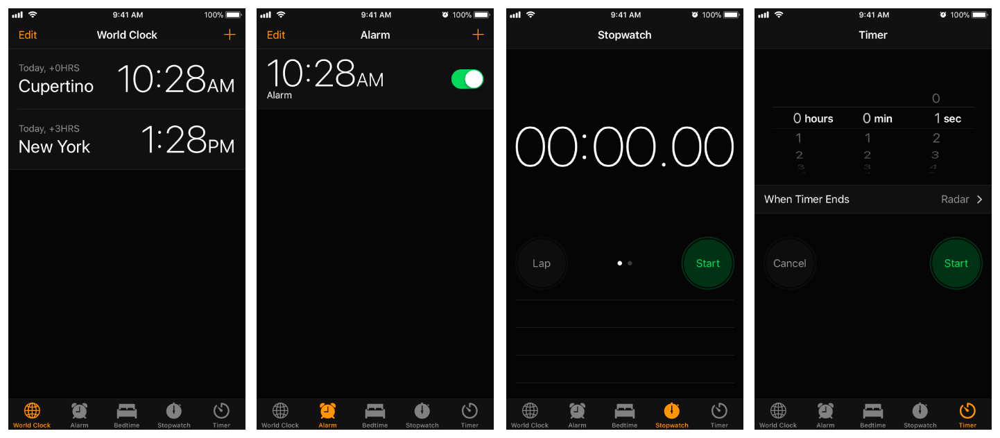
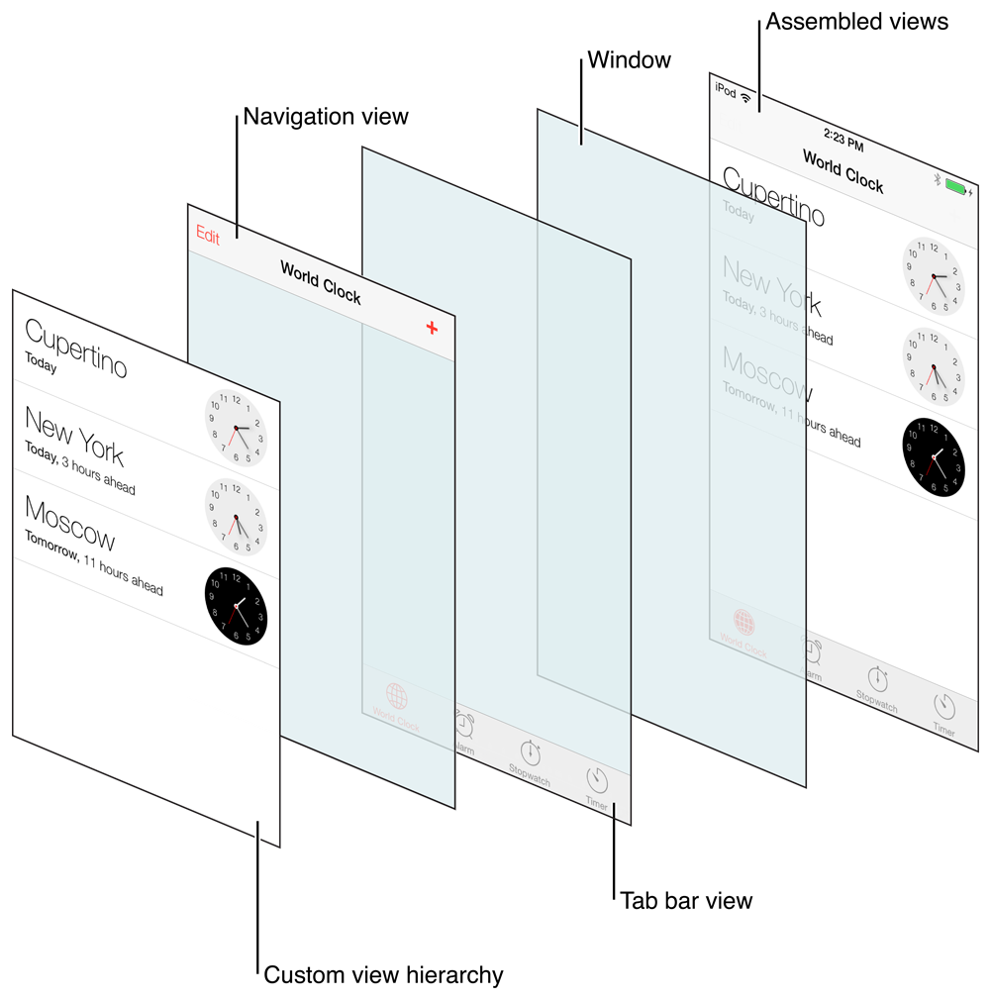
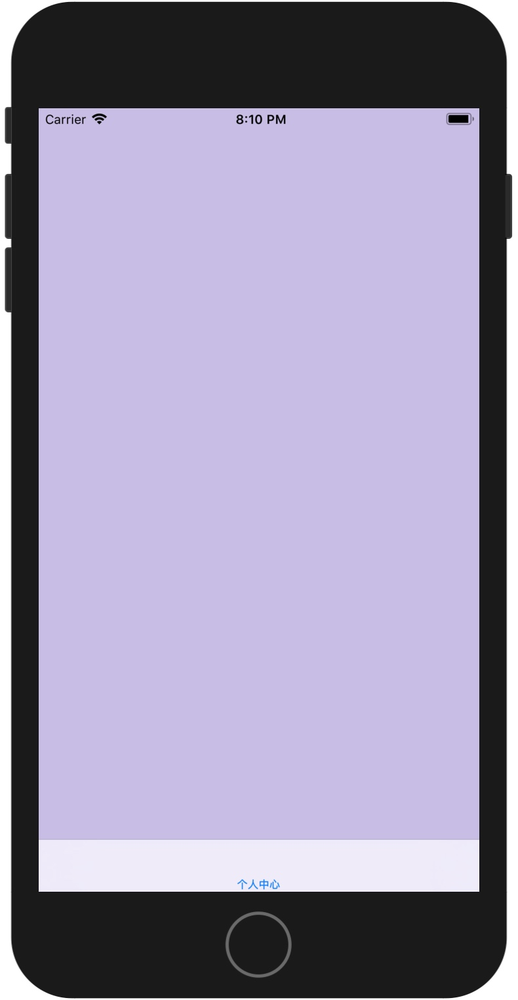
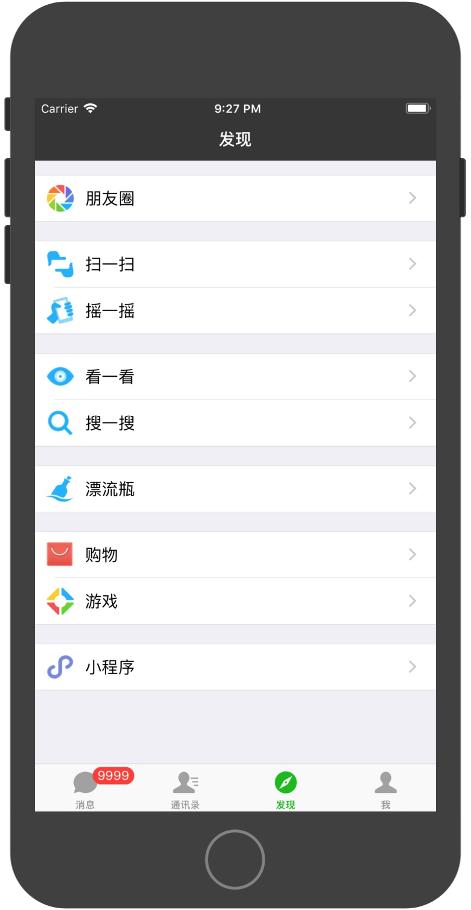
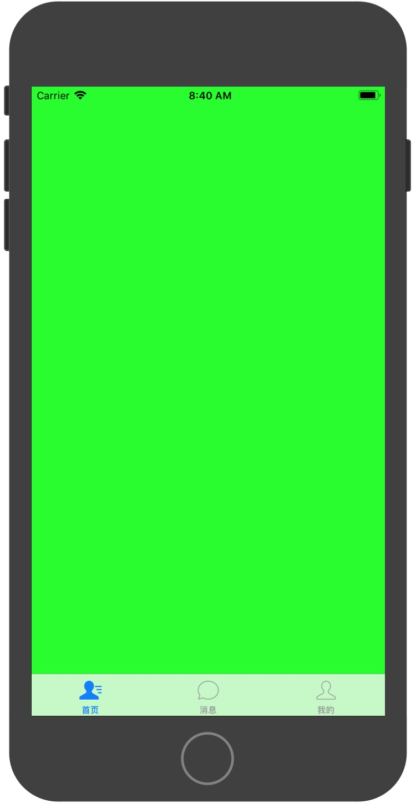

# UI拓展与实践（标签栏控制器）

## 前言

标签栏控制器或分页栏控制器，即UITabBarController，和UINavigationController类似,UITabBarController也可以管理多个控制器，轻松完成控制器之间的切换，样式上具有单选样式，当选中某个标签时会显示该标签所关联的子视图控制器，主要通过底部的标签栏来实现。UITabbarController是一种很常见的视图控制器，比较典型的有QQ、微信等都有应⽤。能够让用户在一组不同的屏幕之间切换，每个屏幕都代表程序的一种不同的操作模式。

标签栏界面在窗口底部显示选项卡（UITabBarItem），选项卡可用于在不同模式之间进行选择以及显示该模式的视图。标签栏控制器界面的**每个选项卡都与自定义视图控制器相关联**。

当用户选择特定选项卡时，标签栏控制器就会显示与该选项卡相对应的视图控制器的根视图，替换之前的任何视图。所以，标签栏界面通常用于呈现不同类型的信息或使用完全不同的界面风格呈现相同的信息。如下iOS系统中的时钟App：


当用户点击底部World Clock选项卡时，标签栏控制器就会显示与World Clock相关连的世界时钟这个控制器的根数图；当我们在点击Alarm时，这时标签栏控制器会将闹钟所对应的视图控制器的根视图，并替换掉之前的世界时钟的界面，以此类推。

UITabBarController通常是被当作为整个程序的rootViewController，而且**不能添加到别的视图控制器中**，UITabBarController主要用来管理用户提供的包含各种内容的子视图控制器，而每一个子视图控制器则负责管理自己的视图层级关系。那么我们在使用时只需要给标签栏上的每个选项卡指定对应的视图控制器即可。**指定视图控制器的顺序决定了在标签栏上显示的顺序**。

当用户的应用打算提供一些相同等级的不同界面时，就可以考虑UITabBarController，我们可以设置多个UITabBarItem，每个UITabBarItem对应一个UIViewController。当某个UITabBarItem被点击时，UITabBarController就会选中该UITabBarItem，并显示该UITabBarItem对应的视图控制器中的内容。


### 结构

UITabBarController类继承自UIViewController，所以可以通过访问view属性来访问自己的视图。不过标签栏控制器的视图，仅仅只是作为一个用来容纳标签栏视图和包含了我们自定义内容的视图的容器。所以标签栏视图主要是为用户提供选择控件，由一个或多个标签栏项组成，标签栏控制器及其相关的视图层级如下图：



### 使用步骤

##### 代码方式添加UITabBarController

1、 使用系统自带的UITabBarController类来创建，直接在AppDelegate中添加即可，通过addChild方法添加子控制器。如下：

```swift
func application(_ application: UIApplication, didFinishLaunchingWithOptions launchOptions: [UIApplication.LaunchOptionsKey: Any]?) -> Bool {
    
    //1、获取storyBoard，获取需要展示的viewController
    let storyBoard = UIStoryboard(name: "Main", bundle: nil)
    let initialVC = storyBoard.instantiateViewController(withIdentifier: "initialVC")
    initialVC.view.backgroundColor = UIColor(red: 200/255.0, green: 189/255.0, blue: 230/255.0, alpha: 1.0)
    initialVC.tabBarItem.title = "个人中心"
    
    //2、创建tabBarController，将viewController添加到tabBarController中
    let tabBarCon = UITabBarController()
    tabBarCon.addChild(initialVC)

    //3、将TabBarController设置成窗口的根视图控制器
    window?.rootViewController = tabBarCon
    return true
}
```

也可以通过另外一种方法`setViewControllers`来向标签栏控制器中添加子控制器：


```swift
    func application(_ application: UIApplication, didFinishLaunchingWithOptions launchOptions: [UIApplication.LaunchOptionsKey: Any]?) -> Bool {
        
        //1、获取storyBoard，获取需要展示的viewController
        let storyBoard = UIStoryboard(name: "Main", bundle: nil)
        let initialVC = storyBoard.instantiateViewController(withIdentifier: "initialVC")
        initialVC.view.backgroundColor = UIColor(red: 200/255.0, green: 189/255.0, blue: 230/255.0, alpha: 1.0)
        initialVC.tabBarItem.title = "个人中心"
        
        //2、创建tabBarController，将viewController添加到tabBarController中
        let tabBarCon = UITabBarController()
        tabBarCon.setViewControllers([initialVC], animated: true)

        //3、将TabBarController设置成窗口的根视图控制器
        window?.rootViewController = tabBarCon

        return true
    }
```

2、 我们也可以创建一个UITabBarController的子类来使用，如下：

在UITabBarController子类MyTabBarController.swift中，将需要显示的页面添加到标签栏控制器中

```swift
import UIKit

class MyTabBarController: UITabBarController {

    override func viewDidLoad() {
        super.viewDidLoad()
        setSubViewController()
    }
    
    func  setSubViewController() {
        
        //1、获取storyBoard，获取需要展示的viewController
        let storyBoard = UIStoryboard(name: "Main", bundle: nil)
        let initialVC = storyBoard.instantiateViewController(withIdentifier: "initialVC")
        initialVC.view.backgroundColor = UIColor(red: 200/255.0, green: 189/255.0, blue: 230/255.0, alpha: 1.0)
        initialVC.tabBarItem.title = "个人中心"
        
        //2、创建tabBarController，将viewController添加到tabBarController中
        self.addChild(initialVC)
    }
}
```

在AppDelegate.swift中


```swift
func application(_ application: UIApplication, didFinishLaunchingWithOptions launchOptions: [UIApplication.LaunchOptionsKey: Any]?) -> Bool {
    
    //1、创建tabBarController
    let tabBarController = MyTabBarController()
    
    //2、将TabBarController设置成窗口的根视图控制器
    window?.rootViewController = tabBarController
    return true
}
```

效果如下：



## UITabBarController

### 常用属性和方法

#### 属性

* **viewControllers: [UIViewController]?** ：与导航控制器一样，标签栏界面显示的所有视图控制器的数组。

* **selectedViewController: UIViewController?** ： 当前被选中的标签所关联的控制器，即当前展示的控制器

* **selectedIndex: Int** ： 当前展示的控制器的索引
 
* **tabBar: UITabBar { get }** ：获取标签栏（只读）
 
* **delegate: UITabBarControllerDelegate?** ： 标签栏控制器的代理对象
 
#### 方法
 
 * **setViewControllers(_ viewControllers: [UIViewController]?, animated: Bool)** ：设置视图控制器数组
 

## 标签栏（UITabBar）

在标签栏控制器下方的一条控件称为标签栏，即UITabBar ，如果UITabBarController有N个子控制器,那么UITabBar内部就会有N个UITabBarButton作为子控件与之对应，如下图：


在以上界面中，界面底部是标签栏，标签中有4个UITabBarItem：消息、通讯录、发现、我，分别对应了4个控制器。每个item在UITabBar中的位置是均分的，UITabBar的高度为49。

### 常用属性和方法

#### 属性

* **delegate: UITabBarDelegate?** ：UITabBar代理对象
 
* **items: [UITabBarItem]?** ： 标签栏显示的标签

* **selectedItem: UITabBarItem?** ： 标签栏上当前选定的标签

* **barStyle: UIBarStyle** ： 与导航栏的属性一样，有：default（白色带深色文本）和black（黑色带浅色文本）两种样式

* **tintColor: UIColor!** ： 与导航栏类似，标签栏上标签的色调颜色。

* **barTintColor: UIColor?** // default is nil 标签栏背景的色调颜色

* **isTranslucent: Bool** ： 与导航栏类似，半透明效果，默认为true

* **unselectedItemTintColor: UIColor?** ： 未被选定的标签的色调颜色。

* **backgroundImage: UIImage?** ：标签栏的自定义背景图像

* **shadowImage: UIImage?** ： 用于标签栏的阴影图像。


#### 方法

* **setItems(_ items: [UITabBarItem]?, animated: Bool)** ： 设置标签栏上的标签（可带动画效果）

## UITabBarItem

标签栏上的标签对象，根据单选的原则，一次只能选中一个标签，选中后标签栏控制器会将该标签所对应的视图显示出来，我们可以使用默认外观，也可以自定义标签的外观。

### 常用属性和方法

#### 属性

* **selectedImage: UIImage?** ：标签被选中时的图片
 
* **badgeValue: String?** ： 徽章文本，即显示在标签右上角的文本，四周有红色椭圆。

* **badgeColor: UIColor?** ： 徽章文本的颜色

#### 方法

* **setBadgeTextAttributes([NSAttributedString.Key : Any]?, for: UIControl.State)** ： 自定义徽章文本的属性
*
* **init(tabBarSystemItem: UITabBarItem.SystemItem, tag: Int)** ：构造器方法，创建并返回包含指定系统项的新标签

* **init(title: String?, image: UIImage?, tag: Int)** ：构造器方法，创建并返回带有指定文本、图像、tag属性的标签

* **init(title: String?, image: UIImage?, selectedImage: UIImage?)** ：创建并返回具有指定标题，未选中时图像和选中时图像的新标签。

#### 示例

通过代码方式创建一个TabBarController，然后添加3个子控制器（需要先单独创建FirstViewController、SecondViewController、ThirdViewController类），定制对应的item


```swift
func application(_ application: UIApplication, didFinishLaunchingWithOptions launchOptions: [UIApplication.LaunchOptionsKey: Any]?) -> Bool {
    
    //1、创建tabBarItem
    let tabItem1 = UITabBarItem(title: "首页", image: UIImage(named: "tabbar_contacts"), selectedImage:UIImage(named: "tabbar_contactsHL"))
    
    let tabItem2 = UITabBarItem(title: "消息", image: UIImage(named: "tabbar_mainframe"), selectedImage: UIImage(named: "tabbar_mainframeHL"))
    
    let tabItem3 = UITabBarItem(title: "我的", image: UIImage(named: "tabbar_me"), selectedImage: UIImage(named: "tabbar_meHL"))
    
    //2、创建item，获取需要展示的viewController，并将vc与item关联

    let firstVC = FirstViewController()
    firstVC.view.backgroundColor = UIColor.green
    firstVC.tabBarItem = tabItem1
    
    let secondVC = SecondViewController()
    secondVC.view.backgroundColor = UIColor.yellow
    secondVC.tabBarItem = tabItem2
    
    let thirdVC = ThirdViewController()
    thirdVC.view.backgroundColor = UIColor.purple
    thirdVC.tabBarItem = tabItem3
    
    //2、创建tabBarController，将viewController添加到tabBarController中
    let tabBarCon = UITabBarController()
    tabBarCon.viewControllers = [firstVC, secondVC, thirdVC]
    tabBarCon.selectedViewController = firstVC

    //3、将TabBarController设置成窗口的根视图控制器
    window?.rootViewController = tabBarCon

    return true
}
```

效果如下图



