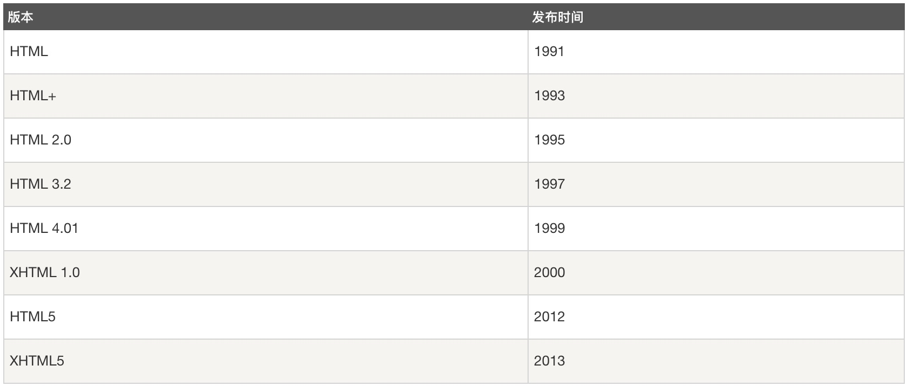
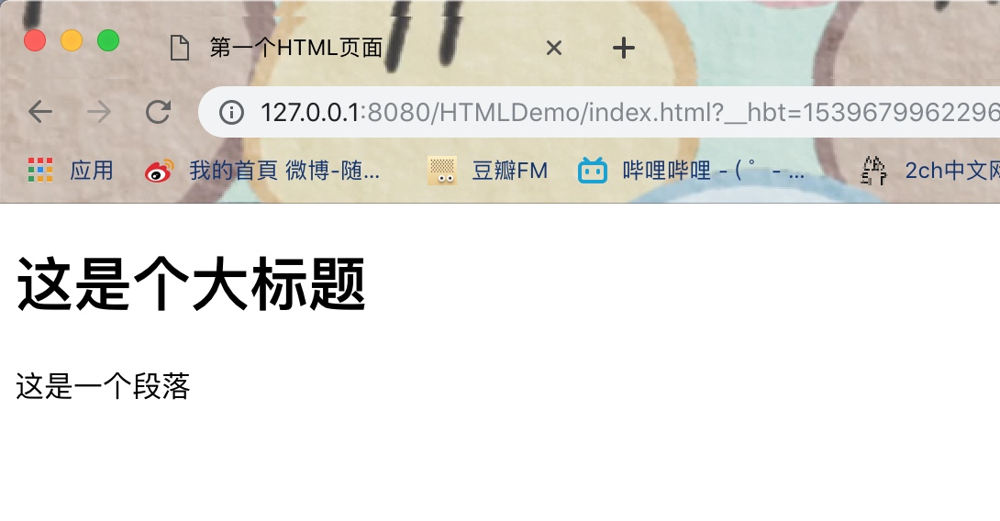
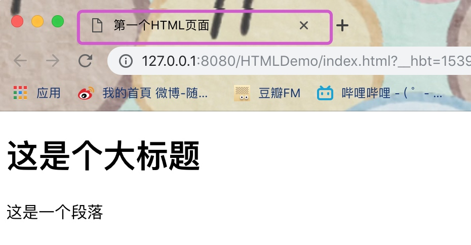
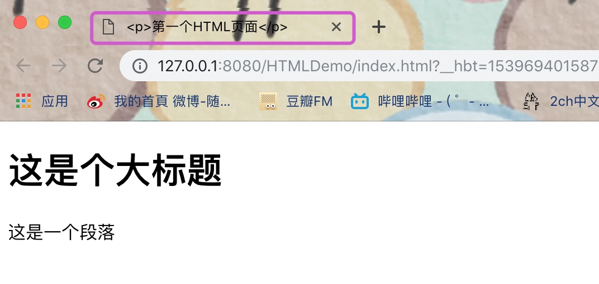
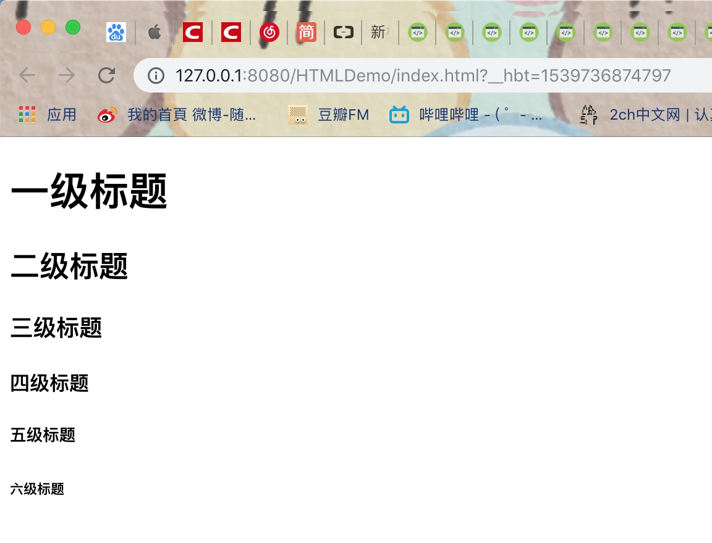
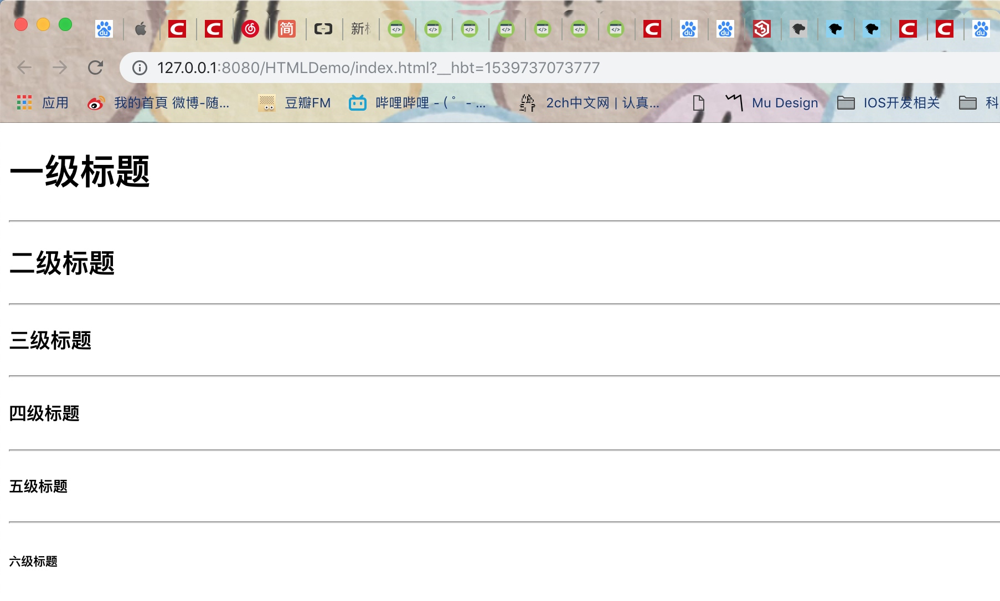
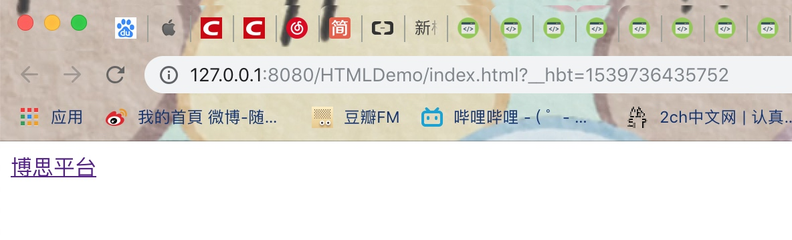
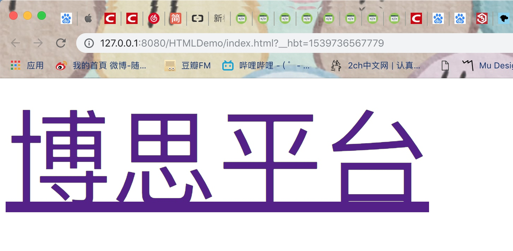

# HTML基础入门（常用标签）
## 前言
*什么是HTML？*

> HTML是构成 Web 世界的一砖一瓦。它描述并定义了一个网页的内容和基本布局。除 HTML 以外的其它技术则通常用来描述一个网页的表现与展示效果（如 CSS），或功能与行为（如 JavaScript）。


* HTML 即超文本标记语言 (**H**yper **T**ext **M**arkup **L**anguage)
* HTML 并不是一种编程语言，而是一种**标记语言** (markup language)
* HTML通常使用的是一套**标记标签** (markup tag)
* HTML 使用标记标签来描述网页
* HTML 文档包含了HTML 标签及文本内容，通常也被称为Web页面

“超文本”是指在单个网站内或网站之间将网页彼此连接的链接。链接是网络的基础。只要将内容上传到互联网，并将其与他人创建的页面相链接，就成为了万维网的积极参与者。

Web 浏览器的作用主要是读取 HTML 文档，然后以网页的形式显示出来。需要注意的是浏览器不会去显示 HTML 标签，而是使用标签去解释页面的内容。

### HTML版本

目前有各种各样的HTML文件，如果能够正确声明HTML的版本，浏览器就能正确显示网页内容。



我们可以通过声明来指定不同的HTML版本，常见的HTML声明如下：

**HTML5**

```html
<!DOCTYPE html>
```
**HTML 4.01**


```html
<!DOCTYPE HTML PUBLIC "-//W3C//DTD HTML 4.01 Transitional//EN"
"http://www.w3.org/TR/html4/loose.dtd">
```

**XHTML 1.0**


```html
<!DOCTYPE html PUBLIC "-//W3C//DTD XHTML 1.0 Transitional//EN"
"http://www.w3.org/TR/xhtml1/DTD/xhtml1-transitional.dtd">
```

### 标记标签（HTML标签）

HTML标记标签通常也被称为**HTML标签** (HTML tag)，或者**HTML元素**，每个标签都可以有相应的属性，页面中的内容就是通过 HTML 标签标记的，HTML标签有以下几个特点：

* HTML标签是由尖括号加上被包围的关键词构成，比如 `<html>`、`<body>`等
* HTML标签通常是成对出现的，比如`<html>`和`</html>`、`<body>`和`</body>`、`<title>`和`</title>`等。
* 标签对中的第一个标签是开始标签，第二个标签是结束标签；开始和结束标签也被称为开放标签和闭合标签。


```html
<!DOCTYPE html>
<html>
	<head>
		<meta charset="utf-8" />
		<title>第一个HTML页面</title>
	</head>
	<body>
		<h1>这是个大标题</h1>
		<p>这是一个段落</p>
	</body>
</html>
```

效果如下图：



在以上的例子中，

* `<html>` 与 `</html>` 之间的内容用来描述一个网页
* `<head>` 与 `</head>` 是头部元素，可包含脚本，指示浏览器在何处可以找到样式表，提供元信息等等，以下标签都可以添加到 head 部分：`<title>`、`<base>`、`<link>`、`<meta>`、`<script>` 以及 `<style>` 等
* `<meta />` 标签主要用来提供关于 HTML 文档的元数据
* `<title>` 与 `</title>` 之间的内容被显示为文档在浏览器标签页上的标题
* **`<body>` 与 `</body>` 之间的内容是可见的页面内容**
* `<h1>` 与 `</h1>` 之间的内容被显示为一级标题
* `<p>` 与 `</p>` 之间的文本被显示为段落


Tips：
> HTML中的标签不区分大小写。也就是说，它们可以用大写，小写或混合形式书写。示例`<title>`标签可以写成`<Title>`，`<TITLE>`或以任何其他方式。


## 常用标签

### 根元素

`<html>` ： 在HTML中，`<html>` 元素表示一个HTML文档的根（顶级元素），所以它也被称为**根元素**。所有的其他元素必须是此元素的后代。通常在`<html>`元素中会有一个<head>元素，后面跟着一个<body>元素。

> Tips：
> 在`<html>`元素上提供具有有效IETF标识语言标记的lang属性，将有助于屏幕阅读技术确定要描述的**正确语言**。如果没有它，那么浏览器通常会默认使用操作系统的设置语言，可能会出现一些描述错误，如乱码问题。

> ```html
> <!DOCTYPE html>
> <html lang="zh">
>   <head>...</head>
>   <body>...</body>
> </html>
> ```

### 文档元数据
 
元数据（Metadata）含有页面的相关信息，包括样式、脚本及数据，能帮助一些软件 (如搜索引擎， 浏览器等等）更好地运用和渲染页面，通常我们将这些源数据定义在`<head>`元素当中。对于样式和脚本的元数据，我们可以直接在网页里定义，也可以链接到包含相关信息的外部文件。

* `<link>`	：HTML 中`<link>`元素规定了外部资源与当前文档的关系。这个元素可用来为导航定义一个关系框架。这个元素最常于链接样式表。

```html
<link rel="stylesheet" type="text/css" href="style.css">
```

* `<script>` ： 用于定义客户端脚本，比如 JavaScript，可以包含脚本语句，也可以通过 src 属性指向外部脚本文件。


```html
<script type="text/javascript"  src="https://www.google-analytics.com/analytics.js"></script>
<script type="text/javascript">
    alert("Hello World!")
</script> 
```

* `<meta>`	 ：HTML的 `<meta>` 元素可提供有关页面的元信息（meta-information），比如针对搜索引擎和更新频度的描述和关键词.

```html
<meta charset="UTF-8">
```

* `<style>`	HTML的`<style>`元素包含文档的样式信息或者文档的部分内容。默认情况下，该标签的样式信息通常是CSS的格式。

```html
<html>

<head>
    <style type="text/css">
        h1 {color: green}
        p {color: blue}
    </style>
</head>

<body>
    <h1>这个是标题</h1>
    <p>这个是段落</p>
</body>
</html>
```

效果如下：


* `<title>`	HTML `<title>` 元素定义文档的标题，显示在浏览器的标题栏或标签页上。它只可以包含文本，若是包含有标签，则包含的任何标签都不会被解释。


```html
<!DOCTYPE html>
<html>
	<head>
		<meta charset="utf-8" />
		<title>第一个HTML页面</title>
	</head>
	<body>
		<h1>这是个大标题</h1>
		<p>这是一个段落</p>
	</body>
</html>
```

效果如下：


如果包含了标签，则不会被解释，会被原样输出，如下，title元素中包含了p标签

```html
<!DOCTYPE html>
<html>
	<head>
		<meta charset="utf-8" />
		<title><p>第一个HTML页面</p></title>
	</head>
	<body>
		<h1>这是个大标题</h1>
		<p>这是一个段落</p>
	</body>
</html>
```
效果如下：


### 块级元素与内联元素

块级元素(block element)又名块元素，和其对应的是内联元素(inline element)又名行内元素。块级元素在浏览器显示时，通常会以新行来开始（和结束），相邻的块级元素将会在不同行显示，而如果是多个内联元素在一起时，都会在同一行按从左至右的顺序显示，不单独占一行。这也是块级元素和内联元素的基本差异。

> Tips：
> 虽然二者存在这样的差异，不过我们可以通过CSS来改变这样差异。比如我们可以给内联元素加上**display:block**这样的属性，让它也有每次都从新行开始的属性，就成为了块元素。同样我们可以把块元素加上**display:inline**这样的属性，让它也在一行上排列。
 
**块级元素特点**
 
1. 总是从新行上开始；
2. 高度，行高以及外边距和内边距都可控制；
3. 当未设置宽度时，宽度它的容器的100%，除非设定一个宽度。
4. 自身可以容纳内联元素和其他块元素

> 常见的块级元素有：

> * div ： 常用块级容器，也是css layout的主要标签
> * p ： 段落
> * form ： 交互表单
> * h1~h6 ：大标题至6级标题
> * table ： 表格
> * hr ： 水平分隔线
> * ul ： 无序列表（非排序列表）
> * ol ： 有序列表（排序列表）
> * li ： 列表项目

**内联元素特点**

1. 和其他元素都处于同一行；
2. 高，行高及外边距和内边距是不可改变的；
3. 元素的宽度就是它自身内容如文字或图片的宽度，也是不可改变的
4. 内联元素只能容纳文本或者其他内联元素，通常被包括在块元素中使用。

> 常见的内联元素有：

> * a ： 链接
> * span ： 短语内容的通用行内容器
> * img ： 图片
> * input ： 输入框
> * select ： 项目选择
> * strong ： 粗体强调
> * sub ： 下标
> * sup ： 上标
> * textarea ： 多行文本输入框
> * i ： 斜体
> * u ： 下划线
> * em ： 强调

还有一种是没有内容的 HTML 元素，即**空元素**。空元素是在开始标签中关闭的，`<br />` 就是没有结束标签的空元素。
在 XHTML、XML 以及未来版本的 HTML 中，所有元素必须被关闭。
在开始标签中添加斜杠，比如 `<br />`，是关闭空元素的正确方法，HTML、XHTML 和 XML 都接受这种方式，即使 `<br>` 在所有浏览器中都是有效的，但使用 `<br />` 其实是更长远的保障。

> 常见的空元素有：
> 
> * `<br/>` ： 换行
> * `<hr />` ：分隔线
> * `<input />` ：文本框
> * `` ：图片

#### 块级元素

* `<div>` ： HTML `<div>` 元素 (或 HTML 文档分区元素) 是一个通用型的流内容容器，它在语**义上不代表任何特定类型的内容**，它可以被用来**对其它元素进行分组**，常用于组合块级元素，以便通过 CSS 来对这些元素进行格式化。

比如将某一块区域中的文本字体颜色统一设置为粉紫色：

```html
<!DOCTYPE html>
<html>
	<head>
		<meta charset="utf-8" />
		<title>第一个HTML页面</title>
	</head>
	<body>
		<h1>这是个大标题</h1>
		<div style="color: plum;">
			<p>这个是div区域</p>
			<p>这个也是div区域</p>
		</div>
		<p>这是一个段落</p>
	</body>
</html>
```
效果如下：


* `<p>` ：用来创建一个段落，会自动在其前后创建一些空白。浏览器会自动添加这些空间，我们也可以在样式表中规定。

* `<h1>` ... `<h6>` ：标题标签，被用来定义 HTML 标题。`<h1>` 定义重要等级最高的标题，`<h6>` 定义重要等级最低的标题。
如下：

```html
<!DOCTYPE html>
<html>
	<head>
		<meta charset="utf-8" />
		<title>第一个HTML页面</title>
	</head>
	<body>
		<h1>一级标题</h1> 
		<h2>二级标题</h2> 
		<h3>三级标题</h3> 
		<h4>四级标题</h4> 
		<h5>五级标题</h5> 
		<h6>六级标题</h6>
	</body>
</html>
```
效果如下：



* `<hr>` ：元素表示段落级元素之间的主题转换。在HTML的早期版本中，它是**一个水平线**。现在它仍能在可视化浏览器中表现为水平线，但目前被定义为语义上的，而不是表现层面上。

如下，给以上的h标签之间添加`<hr>`元素，如下：

```html
<!DOCTYPE html>
<html>
	<head>
		<meta charset="utf-8" />
		<title>第一个HTML页面</title>
	</head>
	<body>
		<h1>一级标题</h1> 
		<hr />
		<h2>二级标题</h2> 
		<hr />
		<h3>三级标题</h3> 
		<hr />
		<h4>四级标题</h4> 
		<hr />
		<h5>五级标题</h5> 
		<hr />
		<h6>六级标题</h6>
	</body>
</html>
```

效果如下：




#### 内联元素

* `<a>` ：用来定义超链接，从一个页面链接到另一个页面，在a标签中最重要的属性是 href 属性，它指定了链接的目标。在大部分浏览器中，`<a>`有统一的默认外观：
    * **未被访问**的链接带**有下划线**而且是**蓝色**的
    * **已被访问**的链接带**有下划线**而且是**紫色**的
    * **活动链接**带**有下划线**而且是**红色**的
    
如下，创建了一个a标签，可以跳转至学习平台：

```html
<!DOCTYPE html>
<html>
	<head>
		<meta charset="utf-8" />
		<title>第一个HTML页面</title>
	</head>
	<body>
		<a href="http://aiit.iflysse.com">博思平台</a>
	</body>
</html>
```

我们可以去设置a标签打开的页面位置，通过target属性，如果需要在当前页面打开，则将target设置成_self或者不设置target属性；如果需要在新标签页打开，则可以将target设置成_blank

> **注意：**

> * 如果没有使用 href 属性，则不能使用 hreflang、media、rel、target 以及 type 属性。
> * 通常在当前浏览器窗口中显示被链接页面，除非规定了其他 target。
> * 请使用 CSS 来改变链接的样式。


* `<span>` ：主要用来对文档中的行内元素进行组合。`<span>` 标签自身没有固定的格式表现，只有对它应用样式时，才会产生视觉上的变化。如果我们不对 `<span>` 应用样式，那么 `<span>` 元素中的文本与其他文本不会任何视觉上的差异。

仍然是以上的例子，我们将a标签中的文本用`<span>` 标签包起来，如果没有设置样式，那么和原来的效果一样的

```html
<!DOCTYPE html>
<html>
	<head>
		<meta charset="utf-8" />
		<title>第一个HTML页面</title>
	</head>
	<body>
		<a href="http://aiit.iflysse.com">博思平台</a>
	</body>
</html>
```
效果如下：



只有我们对它应用样式时，才会产生视觉上的变化，如下，将文本字号设置成150px：


```html
<!DOCTYPE html>
<html>
	<head>
		<meta charset="utf-8" />
		<title>第一个HTML页面</title>
	</head>
	<body>
		<a href="http://aiit.iflysse.com"><span style="font-size: 150px;">博思平台</span></a>
	</body>
</html>
```

效果如下：




