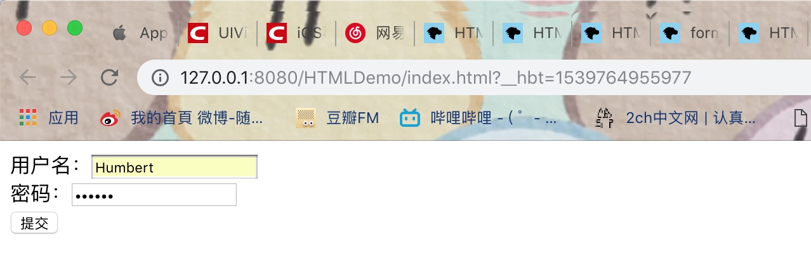
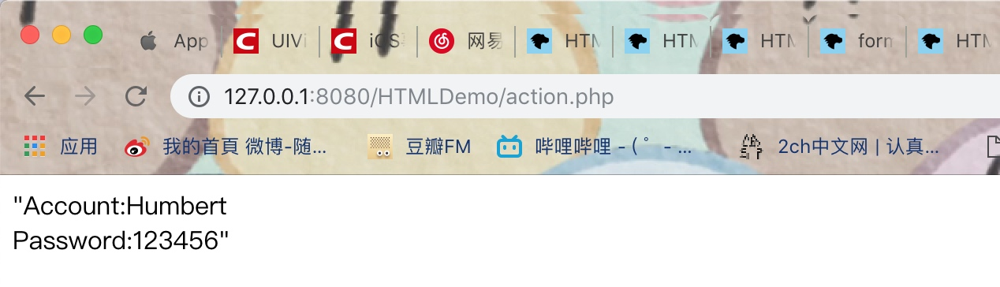
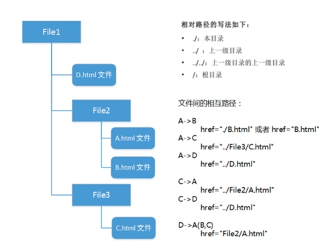
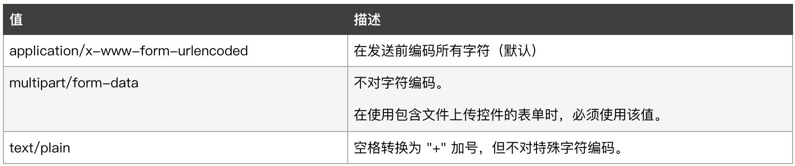
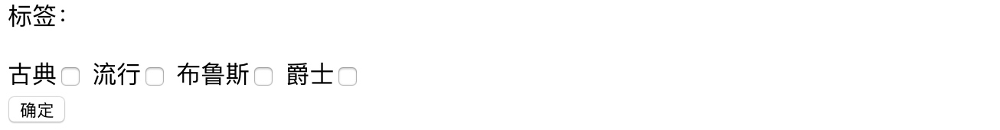
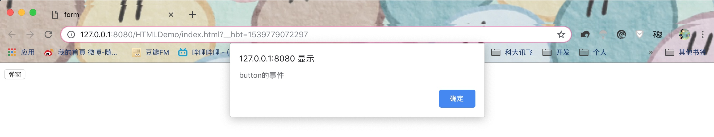
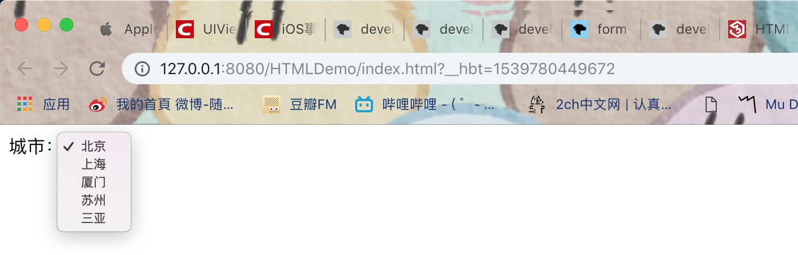
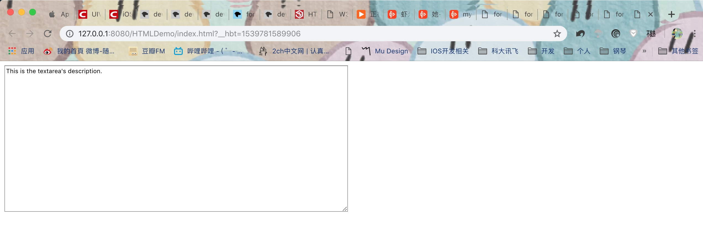
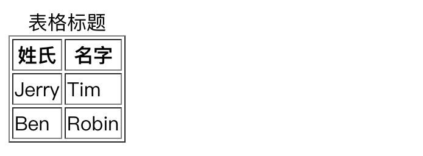
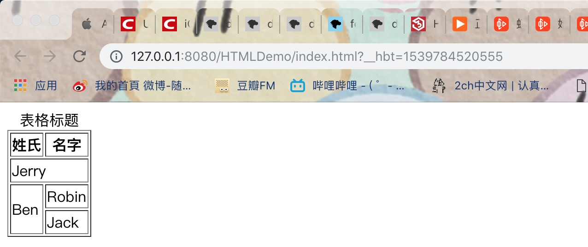

# HTML基础入门（常用标签、form、table）

## 常用标签、form标签

* `<form>` ： 常用于为用户输入创建 HTML 表单，它表示了文档中的一个区域，这个区域包含有交互控制元素，用来向web服务器提交信息。表单能够包含 input 元素，比如文本字段、复选框、单选框、提交按钮等。

如下例子，我们通过index.html页面中的表单来收集用户的username和password，然后提交的服务器中的action.php文件进行处理：

**index.html页面**

```html
<!DOCTYPE html>
<html>
<head>
	<meta charset="utf-8" />
	<title>form</title>
</head>

    <body>
         <form action="action.php" method="post">
         	用户名：<input type="text" name="username" /><br />
         	密码：<input type="password" name="password" /><br />
         	<input type="submit" value="提交" />
         </form>
    </body>
</html>
```
效果如下：




**action.php页面**

```php
<?php
	$username = $_POST["username"];
	$password = $_POST["password"];
	echo json_encode("Account:".$username."<br />Password:".$password);
?>
```

结果为：



在以上的例子中，我们创建了一个form表单，同时使用了input元素，分别是text、password、和submit类型，用来接收普通文本、密码文本和提交请求，最后在经过服务器处理后返回结果。

### 表单常用属性

**action** ：它的值是个URL，用来规定当提交表单时**向何处发送表单数据**，在以上例子中，表单收集的收据会提交到action.php页面进行处理。他的值可以是绝对URL和相对URL。

1. 绝对URL，如：`action=“www.center.com/action.php”`。是一个固定的路径，可以指向其他站点。
2. 相对URL，如：`action=“./action.php”`。它是相对于当前页面的。
	相对路径，即本站点內的路径，也可以理解为服务器本地的文件，相对路径的几种表达方式，如下图：



**method** ：该属性用来规定如何发送表单数据，规定用于发送表单数据的**HTTP请求方法**，它的值可是“get”或“post”。

1. post: 指的是HTTP请求的POST方法，表单数据会包含在表单体内然后发送给服务器。
2. get: 指的是HTTP请求GET 方法，表单数据会附加在 action 属性的URI中，并以 '?' 作为分隔符, 然后这样得到的 URI 再发送给服务器。需要注意的是这样做会将数据暴露在URI里面，用户在浏览器地址栏上是可以看得到的。

**enctype** ：用来规定在发送到服务器之前应该如何**对表单数据进行编码**，它的值如下：



1. 默认地，表单数据会编码为 `application/x-www-form-urlencoded`。也就是说，在发送到服务器之前，所有字符都会进行编码（空格转换为 "+" 加号，特殊符号转换为 ASCII HEX 值）。
2. `multipart/form-data` 这个值主要用于当 type 属性设置为 "file" 的 `<input>` 元素，通常用来发送二进制的文件，如上传图片、视频等文件。
3. `text/plain`用于发送纯文本内容，空格转换为 "+" 加号，不对特殊字符进行编码，一般用于email之类；

**target** ：target 属性规定在何处打开URL，它的值有：`_self`、`_blank`、`_parent`、`_top`、`iframename`。

1. **_self**: **在相同的框架中打开，是默认值**。如果该文档在一个frame中，self则指的是在当前frame（document）中加载的，而不是整个页面（window）。
2. **_blank**: **在新窗口中打开**。以新的HTML4或HTML5文档窗口加载返回值。
3. **_parent**: **在父框架集中打开**。在父级的frame中以HTML4或HTML5文档形式加载返回值，如果没有父级的frame，行为和_self一致。
4. **_top**: 如果是HTML 4文档: 清空当前文档，加载返回内容；HTML5: 在当前文档的最高级内加载返回值，如果没有父级，和_self的行为一致。
5. **iframename**: **在指定frame中加载**。


### 常用表单元素

* input元素为表单常用元素，在使用input元素时，可以使用根据不同的type，使用不同的表单域。 

1、 **text：文本域**。 

```html
用户名：<input type="text" name="username" value="张三"/>
```


2、**password：密码域**。 与文本域类似，不过样式上与文本域有一定的区别，在输入时文本框不会显示具体内容，而是以黑色的圆点来代替。

```html
密码：<input type="password" name="password" />
```


3、**submit：提交按钮**。 当type为submit时input元素会变成一个按钮，显示的文字为其value值。


```html
<input type="submit" value="提交" />
```


4、**radio：单选按钮**。


```html
<!DOCTYPE html>
<html>
<head>
	<meta charset="utf-8" />
	<title>radio</title>
</head>

    <body>
         <form action="action.php" method="post" >
         	男<input type="radio" name="sexual" value="male" />
         	女<input type="radio" name="sexual" value="female"/>
         	<input type="submit" value="确定" />
         </form>
    </body>
</html>
```

action.php页面如下：

```php
<?php
	$sexual = $_POST["sexual"];
	echo "性别：" . $sexual;
?>
```


> **注意：**
> 不过在使用radio时需要注意的是属于同一个功能下的单选按钮的name必须要相同，否则无法实现单选功能。
> 如果我们需要默认选中某些选项，则可以将checked设置成checked即可，如果同时将所有选项的checked都设置成了checked，那么只会选中最后一个。

5、**checkbox：复选按钮**。


```html
<!DOCTYPE html>
<html>
<head>
	<meta charset="utf-8" />
	<title>checkbox</title>
</head>

    <body>
         <form action="action.php" method="post" >
         	<!--因为我们是请求给后台的php文件处理，所以此处在给name进行赋值时，需要在tags后面加上[],表明此处会提交多个值-->
         	<p>标签：</p>
         	古典  <input type="checkbox" name="tags[]" value="Classic" />
         	流行  <input type="checkbox" name="tags[]" value="Pop" />
         	布鲁斯<input type="checkbox" name="tags[]" value="Blues" />
         	爵士  <input type="checkbox" name="tags[]" value="Jazz" />
         	<br />
         	<input type="submit" value="确定" />
         </form>
    </body>
</html>
```


action.php页面

```php
<?php
	$tags = $_POST["tags"];
	foreach ($tags as $value) {
		echo $value . "<br />";
	}
?>
```
> **Tips：**
> 在使用checkbox时，如果我们需要默认选中某些选项，则可以将checked设置成checked即可。

6、**button：按钮域**。通过给onclick属性绑定方法可以实现按钮事件。


```html
<!DOCTYPE html>
<html>
<head>
	<meta charset="utf-8" />
	<title>button</title>
</head>

    <body>
         <form action="action.php" method="post" >
         	<input type="button" value="弹窗" onclick="alert('button的事件')" />
         </form>
    </body>
</html>
```



> **Tips：**
> 在HTML中还有button元素也可以实现同样的功能，使用方式与按钮域类似，如下：

> ```html
> <button onclick="alert('button的事件')">弹窗</button>
> ```


7、**reset：重置**。当点击重置按钮时，重置按钮所在的表单将全部清空，不过其他表单并不会受到影响。


```html
<!DOCTYPE html>
<html>
<head>
	<meta charset="utf-8" />
	<title>reset</title>
</head>

    <body>
         <form action="action.php" method="post">
         	用户名：<input type="text" name="username" /><br />
         	密码：<input type="password" name="password" /><br />
         	<input type="submit" value="提交" /><input type="reset" value="清空" />
         </form>
    </body>
</html>
```

8、**hidden：隐藏域**。 隐藏域在浏览器中并不显示，仅仅为保存一些不太重要的资料而存在

```html
<!DOCTYPE html>
<html>
<head>
	<meta charset="utf-8" />
	<title>hidden</title>
</head>

    <body>
         <form action="action.php" method="post">
         	用户名：<input type="text" name="username" /><br />
         	<input type="hidden" value="这是一个隐藏域，将不会在页面中显示" />
         	密码：<input type="password" name="password" /><br />
         	<input type="submit" value="提交" /><input type="reset" value="清空" />
         </form>
    </body>
</html>
```

9、**image：图片按钮**。通过给它的src属性指定一个图片来源即可。


```html
<!DOCTYPE html>
<html>
<head>
	<meta charset="utf-8" />
	<title>image</title>
</head>

    <body>
         <form action="action.php" method="post">
         	<p><input type="image" src="img/night.jpg"/></p>
         	用户名：<input type="text" name="username" /><br />
         	密码：<input type="password" name="password" /><br />
         	<input type="submit" value="提交" /><input type="reset" value="清空" />
         </form>
    </body>
</html>
```


* select元素，用来定义下拉列表，通常配合option元素来一起使用，如下：

```html
<!DOCTYPE html>
<html>
<head>
	<meta charset="utf-8" />
	<title>select</title>
</head>

    <body>
         <form action="action.php" method="post">
         	城市：
         	<select name="city">
         		<option value="Beijing">北京</option>
         		<option value="Shanghai">上海</option>
         		<option value="Xiamen">厦门</option>
         		<option value="Suzhou">苏州</option>
         		<option value="Sanya">三亚</option>
         	</select>
         </form>
    </body>
</html>
```



> **Tips：**
> 对于select我们也可以指定默认选中的元素，通过将它的selected属性设置为selected即可。


* **textarea：元素**。用来定义多行输入字段（文本域），我们可以通过如下：

```html
<textarea name="text" cols="100" rows="20">This is the textarea's description.</textarea>
```



> **Tips：**
> 文本区中可容纳无限数量的文本，其中的文本的默认字体是等宽字体（通常是 Courier）。
> 我们可以通过 cols 和 rows 属性来规定 textarea 的尺寸，不过也可以使用 CSS 的 height 和 width 属性。

## table标签

在HTML中，表格由 `<table>` 标签来定义。每个表格都会有若干行（由 `<tr>` 标签定义），每行又会被分割为若干个单元格（由 `<td>` 标签定义），字母 `td` 指表格数据（table data），即数据单元格的内容。数据单元格可以包含文本、图片、列表、段落、表单、水平线、表格等等。表格默认情况下无边框，我们可以通过`border`来设置边框。


```html
<!DOCTYPE html>
<html>
<head>
	<meta charset="utf-8" />
	<title>table</title>
</head>

    <body>
		<table border="1">
			<caption>表格标题</caption>
			<tr>
				<th>姓氏</th>
				<th>名字</th>
			</tr>
			<tr>
				<td>Jerry</td>
				<td>Tim</td>
			</tr>
			<tr>
				<td>Ben</td>
				<td>Robin</td>
			</tr>
		</table>
    </body>
</html>
```

效果如下图：



在以上案例中，我们创建了一个三行两列的表格，其中使用了caption标签定义了表格标题，使用了th定义了表头。

### 常用表格标签和属性

* `<caption>` ：必须紧随 `<table>` 标签之后。只能对每个表格定义一个标题，通常这个标题会被居中于表格之上。

* `<th>`：用来定义 HTML 表格中的表头单元格。在HTML 表格单元格通常有两种类型：
    * 表头单元格 ： 包含头部信息（由 `<th>` 标签创建），`<th>` 元素中的文本通常呈现为**粗体并且居中**。
    * 标准单元格 ： 包含数据（由 `<td>` 标签创建），`<td>` 元素中的文本通常是普通的**左对齐文本**。

* colspan：列合并，即横向合并。
* rowspan：行合并，即纵向合并。


```html
<!DOCTYPE html>
<html>
<head>
	<meta charset="utf-8" />
	<title>table</title>
</head>

    <body>
		<table border="1">
			<caption>表格标题</caption>
			<tr>
				<th>姓氏</th>
				<th>名字</th>
			</tr>
			<tr>
				<td colspan="2">Jerry</td>
			</tr>
			<tr>
				<td rowspan="2">Ben</td>
				<td>Robin</td>
			</tr>
			<tr>
				<td>Jack</td>
			</tr>
		</table>
    </body>
</html>
```

效果如下：




