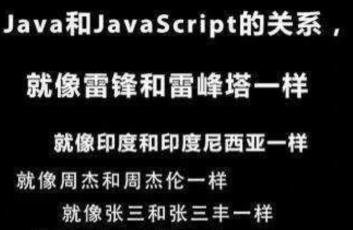
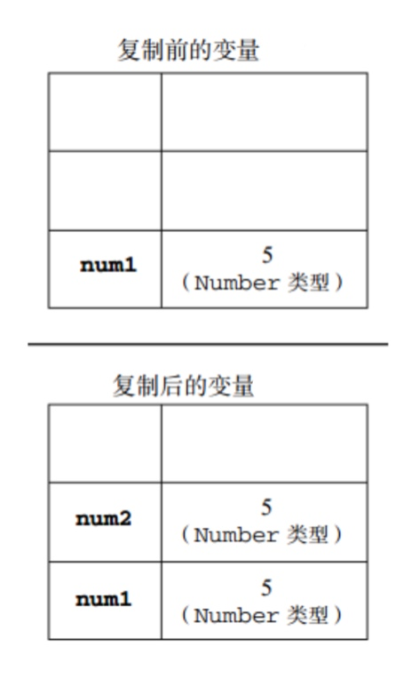
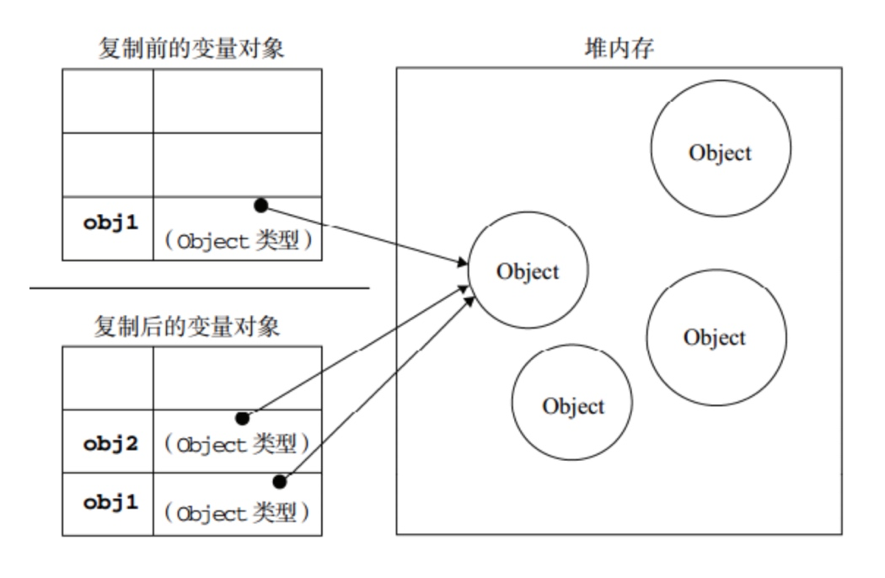
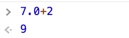
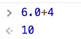
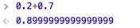
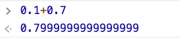
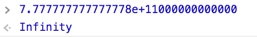
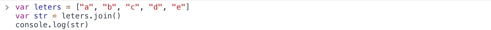
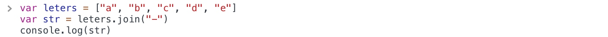

# JavaScript入门（数据类型）

## 前言

JavaScript与Java这两者间实际上并没有直接关系的，只是命名上的相似而已。JavaScript是Netscape公司开发的，最初它的名字叫LiveScript，由于当时Java在JavaScript发布时的那段期间就已经很流行了，Netscape公司为了蹭Java的热度就将LiveScript改名成JavaScript，这样有利于这门新生语言的推广和传播。



JavaScript是一种专为与页面交互而设计的一种脚本语言，主要由以下3个部分组成：

1. **ECMAScript** ，由ECMA-262定义，提供核心语言功能；
2. **文档对象模型**（**DOM**，即Document Object Model），提供访问和操作网页内容的方法和接口；
3. **浏览器对象模型**（**BOM**，即Browser Object Model），提供与浏览器进行交互的方法和接口。

## 使用步骤

HTML 中的脚本必须位于 `<script>` 与 `</script>` 标签之间，脚本可被放置在 HTML 页面的 `<body>` 和 `<head>` 部分中。在 HTML 页面中插入 JavaScript也需要使用 `<script>` 标签。`<script>` 和 `</script>` 会告诉 JavaScript 在何处开始和结束。

> **Tips：**
> 我们可能会看到一些案例中的`<script>`标签中使用了`type=“text/javascript”`，不过现在也可以不需要再添加此语句了，因为JavaScript 已经是目前所有浏览器以及 HTML5 中的默认脚本语言。

```javascript
<script>
		document.write("Hello JavaScript");
</script>
```

我们可以在 HTML 文档中放入不限数量的脚本。脚本可位于 HTML 的 `<body>` 或 `<head>` 部分中，或者同时存在于两个部分中。通常的做法是把函数放入 `<head>` 部分中，或者放在页面底部。这样就可以把脚本统一放置在统一位置，这样就不会干扰页面的其他内容。

1、 **head中：**

```html
<!DOCTYPE html>
<html>
	<head>
		<meta charset="UTF-8">
		<title>JavaScript Demo</title>
		<script>
			function btnEvents(){
				document.write("Hello JvaScript");
			}
		</script>
	</head>
	<body>
		<button id="btn" onclick="btnEvents()">按钮</button>
	</body>
</html>
```

2、 **body中：**

```html
<!DOCTYPE html>
<html>
	<head>
		<meta charset="UTF-8">
		<title>JavaScript Demo</title>
	</head>
	<body>
		<button id="btn" onclick="btnEvents()">按钮</button>
		<script>
			function btnEvents(){
				document.write("Hello JvaScript");
			}
		</script>
	</body>
</html>
```
3、**外部js文件中**

我们还可以把脚本保存到外部文件中。外部文件通常包含被多个网页使用的代码。外部 JavaScript 文件的扩展名是 .js。如需使用外部文件，那么需要在 `<script>` 标签的 "src" 属性中设置该 .js 文件：

```html
<!DOCTYPE html>
<html>
	<head>
		<meta charset="UTF-8">
		<title>JavaScript Demo</title>
		<script src=“myFirstJS.js”></script>
	</head>
	<body>
		<button id="btn" onclick="btnEvents()">按钮</button>
	</body>
</html>
```

然后在外部文件myFirstJS.js中直接添加需要使用的脚本代码即可：

```javascript
function btnEvents(){
	
	document.write("Hello JvaScript");
}
```

## 变量与数据类型

### 变量

在JavaScript中，变量属于松散类型的，即**当一个变量被声明后，在不需要声明类型的情况下就可以直接使用，可以保存任意类型的值**。不像Objective-C或C语言那样，在声明变量时必须要声明变量类型。并且在JavaScript中，变量所保存值的类型也可以改变。
JavaScript中变量可能包含两种不同的数据类型的值：基本类型和引用类型。**基本类型是指简单的值类型或数据段，即原始类型**；**而引用类型指那些可能包含多个值的对象**。

#### 变量类型

**基本类型**：number、string、boolean、null、undefined。
**引用类型**：object、array、date、function、RegExp。

***基本类型特征***

**基本类型的数据是存放在栈内存中**的，对于基本类型的复制是在栈内存中开辟出了一个新的存储区域用来存储新的变量的值，这个变量本身是独立的，只不过和所复制的变量的值一样，所以如果其中一个的值改变，并不会影响到另一个。


```javascript
var num1 = 5;
var num2 = num1;
```



***引用类型特征***

**引用类型的数据是存放在堆内存中的**，定义了一个对象其实是在栈内存中存储了一个指针，这个指针指向堆内存中该对象的存储地址。复制给另一个对象的过程其实是把该对象的地址复制给了另一个对象变量，两个指针都指向同一个对象，所以如果其中一个变量对所引用的对象进行了修改，那么所做的修改会影响到另一个变量。


```javascript
var obj1 = new Object();
var obj2 = obj1; 
```




#### 变量使用

JavaScript中使用**var**操作符来声明变量，在全局声明的变量就是会成为全局变量，如果在函数内声明的变量就是以该函数为作用域的局部变量，局部变量会在函数执行完毕后被销毁。需要一次声明多个变量时可以通过单var操作符的方式，代码会更加简洁。如：


```javascript
var name = 'susan',
    age = 27,
    sex = 'male';
```
另外，我们也可以省略操作符var直接声明变量：

```javascript
name = 'susan';
age = 27;
sex = 'male';
```

既然在JavaScript中声明的变量不需要声明类型，那么如果想要判断某个变量的类型，通过什么方式去判断呢？
可以通过**typeof操作符**来进行判断，它会**以字符串的形式返回数据类型**，如下：


```javascript
typeof undefined; //undefined
typeof 2015; //number
typeof false; //boolean
typeof null; //object
typeof 'abc'; //string
typeof {a:1}; //object
typeof Date; //function
```

### 基本类型

#### number（数字）

JavaScript中的number类型支持十进制、八进制以及十六进制的数值。
关于浮点型的数值需要注意的是：

1、在JavaScript中，由于保存浮点型所需的内存是整型的两倍，所以JavaScript会**在适当的时候将不必要的浮点型转换为整型**，比如浮点型的7.0会自动保存为整型的7。





2、另外也需要注意的一点是，浮点型运算精度远不如整型，如下：






* **特殊值**

**Infinity**

JvaScript能够保存的数值并不是无限大小的，当**大于或小于某个界限**时，该值会被自动转换为特殊值——Infinity。



那么，如果我们需要检测一个数值是否为Infinity，则可以通过isFinite()函数来检测。
函数原型：`isFinite(number)`

> 参数number是有限数字（或可转换为有限数字），那么返回 true。否则，如果 number 是 NaN（非数字），或者是正、负无穷大的数，则返回 false。

**NaN**

在Number类型中还有一特殊的值，那就是**NaN（Not a Number），即非数值**。这个特殊值主要是为了避免在某些需要返回数值时因为运算问题未返回数值报错，影响程序运行。比如一个数除以0，在其他编程语言中会抛出错误，而在JavaScript中会返回NaN。

*NaN有两个特点*：

1. **任何涉及NaN的操作均会返回NaN**；
2. **NaN不与任何值相等，包括他自己**，即做NaN == NaN的相等性验证时会返回false。

> 检测一个值是否为NaN可以用isNaN()函数，它会尝试将接收的参数转换为数值，意思就是字符串“10”可以被转换成数值10，而字符串“color”不行。转换成功返回false，反之为true。


* **数值转换**

 在JavaScript中Number类型的数值转换方式通常可以通过**parseInt()**函数和**parseFloat()**函数进行转换，这两个函数主要是接收字符串，并将字符串转换成数字的。

1、**parseInt()**。parseInt()函数在转换字符串时，会忽略前面的空格，直到找到第一个非空字符。如果第一个非空字符不是数字字符或者负号则返回NaN。如果第一个字符是数值字符会继续解析第二个，直到解析完整个字符串或者遇到了一个非数值字符，如下：

```javascript
parseInt(""); //NaN
parseInt(3.14); //3
parseInt("4.12"); //4
parseInt("xyx123"); //NaN
parseInt("123xyx"); //123
```

> **Tips：**
> parseInt()同样可以解析二进制、八进制与十六进制的数值，由于ECMAScript版本不同对非十进制数解析时会出现分歧，所以最好传入第二个参数作为基数，如下：

> ```javascript
> parseInt(100111,2); //39
> parseInt(123,8); //83
> parseInt("0xBC",16); //188
> ```

2、**parseFloat()**。与parseInt()函数类似，parseFloat()也是从第一个字符开始解析，直到字符串末尾或者遇到一个无效的浮点数字字符为止。比如，第一个小数点是有效的，第二个是无效的，因此后面的字符会被忽略。与parseInt()不同的是它始终会忽略开头的0，且不具备传入基数的能力，即**只能解析十进制数值**，如下：

```javascript
parseFloat("123xyx"); //123
parseFloat("xyx123"); //NaN
parseFloat("012.3"); //12.3
parseFloat("34.5"); //34.5
parseFloat("34.5.6"); //34.5
```
#### string（字符串）

在JavaScript中，字符串可以**使用单引号或双引号来进行表示**，两者无区别，只是需要保证起始与结束保持一致即可。另外，可以通过length属性来获取字符串长度。

```javascript
var str = 'Hello JavaScript';
alert(str.length); //16
```

* **字符串转化**

字符串转化有两个方式：

1. toString()方法
2. String()转型函数

这两个方法的区别就是**null、undefined值没有toString()方法，而任何类型值都可以使用String()函数**。    


```javascript
var num = 123;
num.toString(); //"123"
String(num); //"123"

var boo = false;
boo.toString(); //"false"
String(boo); //"false"
```

在多数情况下，调用toString()方法不必传递参数。不过当要确定输出数值的不同进制时，可以传入一个基数，如下：

```javascript
var num = 10;
num.toString(); //"10"
num.toString(2); //"1010"
num.toString(8); //"12"
num.toString(10); //"10"
num.toString(16); //"a"
```

> Tips:
> 在不知道要转换的值是不是null或undefined时，可以使用String()方法。其规则为：如果该值有toString()方法则调用该方法，如果是null或undefined则返回其字符串表示，所以，使用String()函数来转化字符串就不会出错。

> ```javascript
> String(10); //"10"
> String(true); //"true"
> String(null); //"null"
> String(undefined); //"undefined"
> ```


#### boolean(布尔)

Boolean即布尔，仅包括两个值：true和false。通过Boolean()转型函数可实现类型转化，它可以对任意类型的值使用，将其它类型值转换为布尔型。转换规则主要如下：

1. string型：对于字符串，非空字符串则转化为：true；空字符串(“”)转化为：false
2. number型：对于任何非0数转化为：true；0与NaN则转化为：false
3. object型：对于任何对象则转化为：true；对于null则转化为：false
4. undefined型：对于undefined则转化为false

#### null(空指针对象)

**null类型只包含一个值：null**，从逻辑角度来看，**null值表示一个空对象指针**，所以当使用typeof操作符检测null值会返回“object”，正是由于这个特性，如果你定义某个对象时不确定当前赋何值，但未来需要赋某个object类型值时，那就可以将该变量初始化为null。需要注意的是，当**对null与undefined进行==比较时，会返回true**。

#### undefined(未定义)

 undefined类型也只有一个值：undefiend。所有未初始化的变量均会保存该值，如下：


```javascript
var v;
alert(v); 
//undefined
```

#### array(数组)

1、定义。对于数组的定义，可以使用数组的字面量语法或数组的初始化方法，如下：

```javascript
var arr1 = new Array('a', 'b', 'c');  
var arr2 = ['a','b','c'];  
var arr3 = new Array( );   
var arr4 = [ ];   
```
2、访问。对于数组的访问，可以通过下标语法来访问数组元素。

3、数组遍历。可以通过`for-in`来遍历数组。

```javascript
var leters = ["a", "b", "c", "d", "e"]
for (index in leters) {
	document.write(leters[index] + "<br />")
}
```

4、数组拼接。通过`concat(items: Object): Array`方法来实现数组的拼接，该方法会产生一个新的拼接后的数组：

```javascript
var leters = ["a", "b", "c", "d", "e"]
var nums = ["1", "2", "3", "4", "5"]
var newArr = leters.concat(nums)
for (index in newArr) {
	document.write(newArr[index] + "<br />")
}
```

5、数组转字符串。通过`join()`可以将数组元素拼接成字符串，如下：

```javascript
var leters = ["a", "b", "c", "d", "e"]
var str = leters.join()
console.log(str)
```



可以向join()函数中传入我们用来连接数组元素字符串：

```javascript
var leters = ["a", "b", "c", "d", "e"]
var str = leters.join("-")
console.log(str)
```



6、数组排序。可以通过`sort(compareFunction: Function): Array`来实现数组的排序，此方法接受一个函数参数，如果sort()函数中未接收参数，则按照字母升序排序；如果向sort()函数中传递参数，则按照参数规定的规则进行排序，并会将排序后的数组返回：

```javascript
function sortNums (a, b) {
	return a - b
}
var nums = ["4", "2", "8", "5", "9"]
for (i in nums.sort(sortNums)) {
	document.write(nums[i] + "&nbsp")
}
// 升序： 2 4 5 8 9 
```

> Tips:
> 通过reverse()方法，可以数组进行反序排列：

> ```javascript
> var values = [0, 1, 5, 10, 15];
> values.reverse()；
> ```

7、获取元素索引。`通过indexOf(searchElement: Object, fromIndex: Number): Number`方法可以获取指定元素的索引值：

```javascript
var leters = ["a", "b", "c", "d", "e"]
document.write(leters.indexOf("c"))
```

> Tips：
> indexOf()和 lastIndexOf()。这两个方法都接收两个参数:要查找的项和(可选的)表示查找起点位置的索引。其中，indexOf()方法从数组的开头(位 置 0)开始向后查找，lastIndexOf()方法则从数组的末尾开始向前查找。

> ```javascript
> var numbers = [1,2,3,4,5,4,3,2,1];
> alert(numbers.indexOf(4));        //3

> alert(numbers.lastIndexOf(4)); //5

> alert(numbers.indexOf(4, 4));     //5
> alert(numbers.lastIndexOf(4, 4)); //3

> var person = { name: "Nicholas" };
> var people = [{ name: "Nicholas" }];

> var morePeople = [person];

> alert(people.indexOf(person));     //-1
> alert(morePeople.indexOf(person)); //0
> ```

8、删除数组最后一个元素：pop()。通过pop()函数，可以删除数组的最后一个元素。

9、往数组末尾添加新元素：push()。通过push()函数，可以在数组的末尾添加新元素。

10、删除数组的第一个元素：shift()。通过shift()函数，可以将数组的第一个元素删除，通过该函数会将删除的元素返回。

11、在数组的开头添加一个或多个元素：unshift()。通过unshift()函数，可以在数组的开头插入元素，若多个元素，之间用逗号隔开。

12、是否是数组，可以使用Array.isArray(value)来判断：

```javascript
var nums = [1, 2, 3, 4, 5];
Array.isArray(nums);
```
13、slice()。获取指定位置的元素。它能够基于当前数组中的一或多个项创建一个新数组。slice()方法可以接受一或两个参数，即要返回项的起始和结束位置。在只有一个参数的情况下，slice()方法返回从该参数指定位置开始到当前数组末尾的所有项。如果有两个参数，该方法返回起始和结束位置之间的项— —但不包括结束位置的项。注意，slice()方法不会影响原始数组。

```javascript
var colors = ["red", "green", "blue", "yellow", "purple"];
var colors2 = colors.slice(1);
var colors3 = colors.slice(1,4);
alert(colors2);   //green,blue,yellow,purple
alert(colors3);   //green,blue,yellow
```

14、splice()。这个方法恐怕要算是最强大的数组方法了，它有很多种用法。 splice()的主要用途是向数组的中部插入项，但使用这种方法的方式则有如下 3 种。

* ***删除***： 可以删除任意数量的项，只需指定 **2 个参数**：要删除的**第一项的位置**和要**删除的项数**。 
> * 例如，splice(0,2)会删除数组中的前两项。

* ***插入***：可以向指定位置插入任意数量的项，只需提供 **3 个参数** ：**起始位置**、**0(要删除的项数)** 和要**插入的项**。如果要插入多个项，可以再传入第四、第五，以至任意多个项。
> * 例如，splice(2,0,"red","green")会从当前数组的位置 2 开始插入字符串"red"和"green"。

* **替换**：可以向指定位置插入任意数量的项，且同时删除任意数量的项，只需指定 **3 个参数**:**起始位置**、**要删除的项数**和**要插入的任意数量的项**。插入的项数不必与删除的项数相等。
> * 例如， splice (2,1,"red","green")会删除当前数组位置 2 的项，然后再从位置 2 开始插入字符串 "red"和"green"。

splice()方法始终都会返回一个数组，该数组中包含从原始数组中删除的项(如果没有删除任何项，则返回一个空数组)。下面的代码展示了上述 3 种使用 splice()方法的方式。


```javascript
// 删除第一项
var colors = ["red", "green", "blue"];
var removed = colors.splice(0,1); 
alert(colors); // green,blue 
alert(removed); // red，返回的数组中只包含一项

// 从位置 1 开始插入两项
removed = colors.splice(1, 0, "yellow", "orange"); 
alert(colors); // green,yellow,orange,blue 
alert(removed); // 返回的是一个空数组

// 插入两项，删除一项
removed = colors.splice(1, 1, "red", "purple"); 
alert(colors); // green,red,purple,orange,blue 
alert(removed); // yellow，返回的数组中只包含一项
```

> **Tips：**
> 在JavaScript中，数组元素是对象，所以在一个数组中可以有不同数据类型的元素，所以我们还可以在一个数组中包含对象元素、函数、数组等。

#### object(对象)

1、对象的创建和使用：

```html
<!DOCTYPE html>
<html>
	<head>
		<meta charset="UTF-8">
		<title>JavaScript Demo</title>
		<script>
			var person = {
				name: "Humbert",
				age: 10,
				showInfo: function(){
					alert(this.name + ":" +  String(this.age));
				}
			}
			person.showInfo()
		</script>
	</head>
	<body>
	</body>
</html>
```
也可以通过以下这种方式：

```html
<!DOCTYPE html>
<html>
	<head>
		<meta charset="UTF-8">
		<title>JavaScript Demo</title>
		<script>
			var person = new Object()
			person.name = "Humbert"
			person.age = 10
			person.showInfo = function() {
				alert(this.name + ":" +  String(this.age));
			}
			person.showInfo()
		</script>
	</head>
	<body>
	</body>
</html>
```

2、对于对象属性的访问，我们可以使用.语法，也可以使用键值对的方式访问。在以上例子中，对于person对象的name和age属性，我们可以这样访问：

```javascript
person["name"]
person["age"]
```

3.通过for-in循环还可以遍历对象的属性：


```javascript
var person = new Object()
person.name = "Humbert"
person.age = 10
for (attributes in person) {
	console.log(person[attributes])
}
```

4、为对象添加属性或方法：**prototype**属性

语法格式：`object.prototype.name=value`


```html
<!DOCTYPE html>
<html>
	<head>
		<meta charset="UTF-8">
		<title>JavaScript Demo</title>
		<script>
			var arr = ["first", "second", "third", "fourth", "fifth"];
			for (i in arr) {
				document.write(arr[i] + ", ")
			}
			function btnEvents(){			
				arr.userUpperCase();
				arr.desc = "转化成大写";
				document.getElementById('msg').innerHTML =  arr.desc + "<br />" + arr;
			}
			//通过protoytpe函数为Array构造一个可以转化大写的函数
			Array.prototype.userUpperCase = function(){
				for(var i=0; i<this.length; i++){
					this[i] = this[i].toUpperCase();
				}
			}
			//通过protoytpe函数为Array构造一个属性
			Array.prototype.desc = "";
		</script>
	</head>
	<body>
		<p id="tip">点击按钮，调用toUpperCase函数将数组中的元素转化成大写</p>
		<button id="btn" name="btn" onclick="btnEvents()">按钮</button>
		<p id="msg"></p>
	</body>
</html>
```


