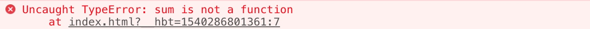
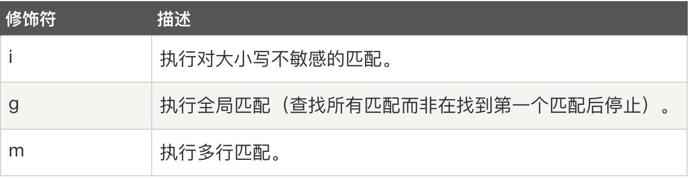
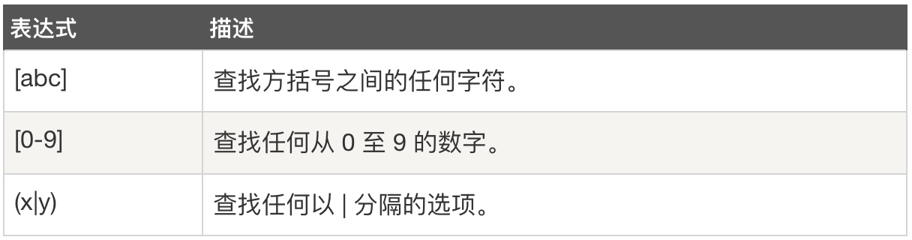
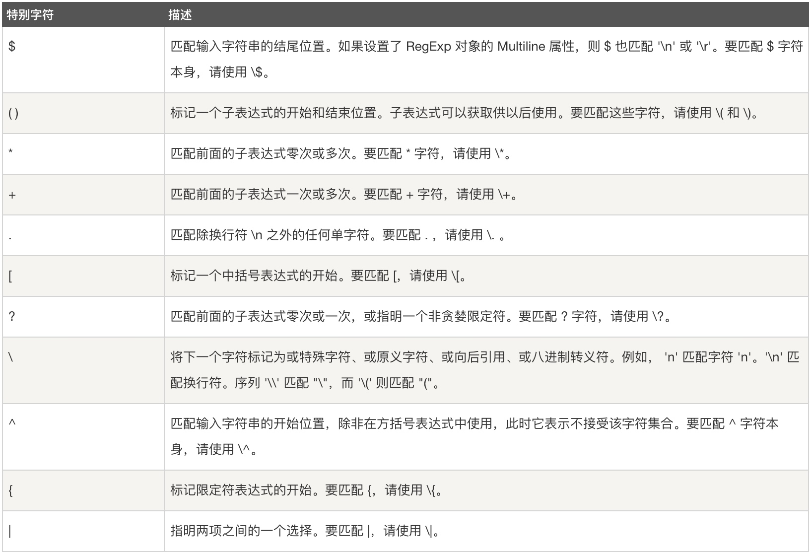
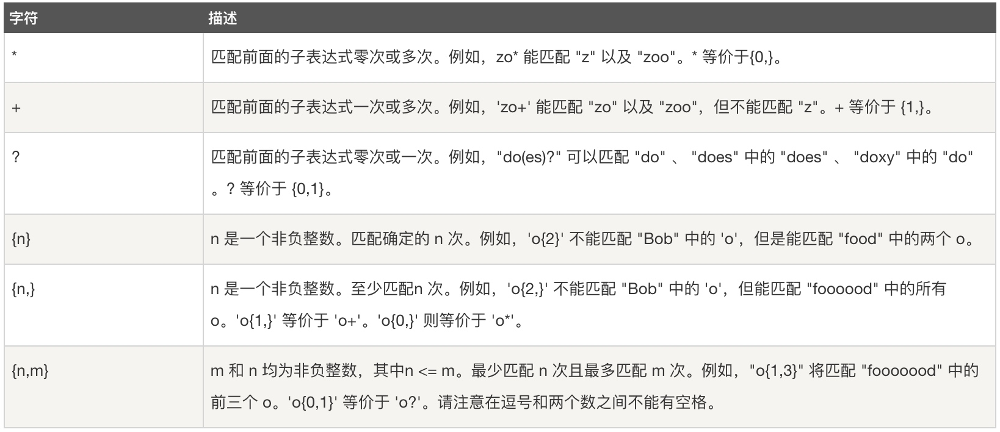
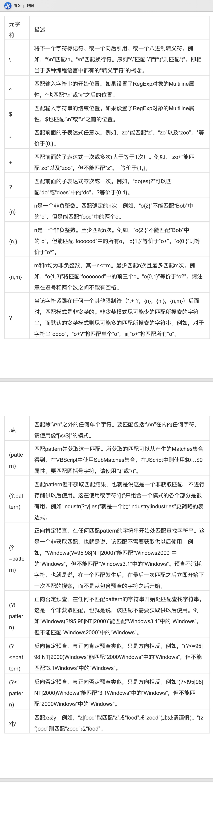

# Javascript入门（函数、正则表达式）

## 常用语法

### 输出

大家在调试代码过程中，很多时候需要输出一些信息，JavaScript 自身没有任何用来打印或者输出的函数，那么如果要输出数据，则可以通过以下几种方式：

 1、使用 window.alert() 或者alert()以弹出警告框形式输出相应信息，如下：

```javascript
window.alert('debug');
alert(‘debug');
```

2、使用 document.write() 方法将内容写到 HTML 文档中，即会显示在页面上，如下：


```javascript
document.write("Hello JvaScript”);
```

不过，在使用时 document.write() 需要注意的是此函数是仅仅向文档输出写内容。如果在该文档已经完成加载后执行了 document.write()函数，那么**整个 HTML 页面将会被document.write()函数输出的内容所覆盖掉**，如下：

```html
<!DOCTYPE html>
<html>
	<head>
		<meta charset="UTF-8">
		<title>JavaScript Demo</title>
		<script>
			function btnEvents(){
				document.write('这是执行了write后的新内容');
			}
		</script>
	</head>
	<body>
		<h1>这是网页的大标题</h1>
		<h5>这是网页的小标题</h5>
		<button id="btn" name="btn" onclick="btnEvents()">按钮</button>
	</body>
</html>
```

3、 使用 innerHTML 写入到 HTML 元素。

```javascript
document.getElementById('btn').innerHTML = "点击";
```

4、使用 console.log() 写入到浏览器的控制台。

```javascript
console.log('测试');
```

## 函数

### 函数的定义

#### 函数对象

在ECMAScript中，函数实际上是对象。**每个函数都是 Function 类型的实例，而且都与其他引用类型一样具有属性和方法**。由于函数是对象，因此函数名实际上也是一个指向函数对象的指针，不会与某个函数绑定。我们可以使用**function**关键字来定义一个函数，函数可以通过声明定义，也可以是一个表达式。

**1、函数声明**

```javascript
function functionname(parameters){
    //这里是要执行的代码
}
```
*function*：是声明的关键字，不能省略；
*functionName*：是函数名；
*parameters*：参数列表，多个参数用逗号分隔，如： a, b, c, d。

> **Tips:**
> 有时，我们会希望函数将值返回调用它的地方。通过使用 return 语句就可以实现。直接在函数体中使用return即可。

> 当调用该函数时，会执行函数内的代码。可以在某事件发生时直接调用函数（比如当用户点击按钮时），并且可由 JavaScript 在任何位置进行调用。

**2、函数表达式**

Javascript 函数可以通过一个表达式定义，函数表达式可以存储在变量中：

```javascript
var sum = function (a, b) {return a + b};
```
在函数表达式存储在变量后，变量也可作为一个函数使用，以上声明了一个加法变量，我们可以把它作为一个函数来使用：

```javascript
var sum = function (a, b) {return a + b};
var result = sum(7, 7);
```
> **Tips:**
> 大家可能会注意到，使用函数表达式时，function 关键字后面并没有函数名。这是因为在使用函数表达式定义函数时，没有必要使用函数名，通过变量sum就可以引用函数。所以实际上是一个匿名函数。函数存储在变量中，不需要函数名称，通过变量名来调用。

**3、Function 构造函数**

语法格式：`new Function ([arg1[, arg2[, ...argN]],] functionBody)`
Function 构造函数可以接收任意数量的参数，**每个参数必须使用引号包围**，但**最后一个参数始终都被看成是函数体**，而前面的参数则枚举出了新函数的参数。来看下面的例子:

```javascript
// 不推荐使用此方式
var sum = new Function("num1", "num2", "return num1 + num2"); 
alert(sum(7, 7))
```

从技术角度讲，这是一个函数表达式。但是，不推荐使用这种方法定义函数，因为这种语法会导致解析两次代码(第一次是解析常规 ECMAScript 代码，第二次是解析传入构造函数中的字符串)，从而影响到性能。不过，这种语法对于理解“函数是对象，函数名是指针”的概念倒是非常直观的。

### 函数声明与函数表达式

#### 函数声明提升

我们可以通过函数声明和函数表达式来创建函数，但是两者间存在一定的区别的。解析器在向执行环境中加载数据时会**率先读取函数声明**，并使其在执行任何代码之前可用(可以访问)；**而对于函数表达式，则必须等到解析器执行到它所在的代码行时才会真正被解释执行**。请看下面的例子。


```javascript
alert(sum(10,10));
function sum(num1, num2){
    return num1 + num2;
}
//会正常输出结果： 20
```

以上代码中，函数调用在函数声明前面，不过代码可以正常运行的。因为在代码开始执行之前，解析器就已经通过一个名为**函数声明提升 (function declaration hoisting)**的过程，会先读取并将函数声明添加到执行环境中。（其中原理：在对代码求值时，JavaScript 引擎在第一遍会声明函数并将它们放到**源代码树的顶部**，所以，即使声明函数的代码在调用它的代码后面，JavaScript 引擎也能把函数声明提升到顶部。）所以可以正常执行。
再来看看下面的，我们把上面的函数声明改为等价的函数表达式：

```javascript
alert(sum(10,10));
var sum = function(num1, num2){
    return num1 + num2;
};
```
这个时候代码运行期间就产生错误了，错误信息如下：


原因在于此时的函数是位于一个初始化语句中，而不是一个函数声明。也就是说，在执行到函数所在的语句之前，变量 sum 都不会保存对函数的引用，那么就无法获取到后面的function对象中内容了；所以实际上在执行到第一行代码`alert(sum(10,10));`时就已经导致“Uncaught TypeError”错误，并且不会执行到下一行了。

> 总结：
> 关于函数声明与函数表达式，除了以上所说的解析顺序上两者存在一定区别以外，其他方便基本都是等价的。


### 作为值的函数

在ECMAScript 中的函数名本身就是变量，所以函数也可以作为值来使用。所以不仅可以像传递参数一样把一个函数传递给另一个函数，而且可以将一个函数作为另一个函数的结果返回。来看一看下面的函数：


```html
<!DOCTYPE html>
<html>
	<head>
		<meta charset="UTF-8">
		<title>JavaScript Demo</title>
		<script>
			//求和函数
			function getSum(num1, num2) {
				return num1 + num2;
			}
			//求积函数
			function getProduct(num1, num2) {
				return num1 * num2;
			}
			//其他操作
			function massageJoin(str1, str2) {
				return "其他操作：" + str1 + "，" + str2;
			}
			//数值运算函数
			function operation(someFunction, a, b) {
				return someFunction(a, b);
			}
			var sumOperation = getSum;
			var productOperation = getProduct;
			var joinOperation = massageJoin;
			function clickToStart() {
				document.getElementById("content1").innerHTML = operation(sumOperation, 2, 4);
				document.getElementById("content2").innerHTML = operation(productOperation, 2, 4);
				document.getElementById("content3").innerHTML = operation(joinOperation, "数据A", "数据B");
			}
		</script>
	</head>

	<body>
		<h1 id="content1">内容显示1区</h1>
		<h1 id="content2">内容显示2区</h1>
		<h1 id="content3">内容显示3区</h1>
		<button onclick="clickToStart()">点击开始</button>
	</body>
</html>
```

在以上的代码中，我们声明了两个用来加法运算和乘法运算的函数，然后我们又声明了一个操作的函数，该函数可以接受一个函数参数和两个参数。根据传入的函数参数可以执行对应的操作，然后将结果返回，最后显示在界面上。


### 深入理解
#### 没有重载

在ECMAScript中没有函数重载的概念，大家可以将函数名理解为指针，看一下以下的例子：

```javascript
function addSomeNumber(num){
    return num + 100;
}
function addSomeNumber(num) {
    return num + 200;
}
var result = addSomeNumber(100); //300
```
在以上例子中声明了两个同名函数，而结果则是后面的函数覆盖了前面的函数，大家可以换个角度来理解，以上代码等价于：


```javascript
var addSomeNumber = function (num){
    return num + 100;
};
addSomeNumber = function (num) { 
    return num + 200;
};
var result = addSomeNumber(100); //300
```

其实，我们在创建函数时，实际上是创建了一个函数对象，函数名是引用了该对象的变量。在创建第二个函数时，因为名字是一样的，就相当于对该变量重新赋值，所以就覆盖了引用第一个函数的变量 addSomeNumber

## 正则表达式

正则表达式（英语：Regular Expression，在代码中常简写为regex、RegExp或RE），使用单个字符串来描述、匹配一系列符合某个句法规则的字符串搜索模式。正则表达式是由一个字符序列形成的搜索模式，正则表达式可以是一个简单的字符，或一个更复杂的模式。ECMAScript 通过 RegExp 类型来支持正则表达式：

`var expression = / pattern / flags ;`   
例如： var pat = /JavaScript/i

其中，JavaScript是一个正则表达式主体（用于检索）；i是一个修饰符（搜索不区分大小写）

在 JavaScript 中，正则表达式通常用于两个字符串方法 : search() 和 replace()：

* **search() 方法**：用于**检索字符串中指定的子字符串**，或检索与正则表达式相匹配的子字符串，并**返回子串的起始位置**。

* **replace() 方法**：用于在字符串中**用一些字符替换另一些字符**，或替换一个与正则表达式匹配的子串。

*search()如下：*

```javascript
var str = "Hello JavaScript!"; 
var n = str.search(/JavaScript/i); //n为6
```

*replace()如下：*

```html
<!DOCTYPE html>
<html>
	<head>
		<meta charset="UTF-8">
		<title>JavaScript Demo</title>
		<script>
			function btnEvents(){
				var str = document.getElementById('msg').innerHTML;
				document.getElementById('msg').innerHTML = str.replace(/JavaScript/i, 'Swift');
			}
		</script>
	</head>
	<body>
		<button id="btn" name="btn" onclick="btnEvents()">搜索</button>
		<p id="msg">Hello JavaScript！</p>
	</body>
</html>
```

### 正则表达式符号

##### 正则表达式修饰符



##### 正则表达式模式



##### 正则表达式特殊字符

所谓特殊字符，就是一些有特殊含义的字符，若要匹配这些特殊字符，必须首先使字符"转义"，即，将反斜杠字符\ 放在它们前面。下表列出了正则表达式中的特殊字符：



##### 正则表达式限定符

限定符用来指定正则表达式的一个给定组件必须要出现多少次才能满足匹配。




更多正则表达式的知识可以参考：[正则表达式语言 - 快速参考](https://docs.microsoft.com/zh-cn/dotnet/standard/base-types/regular-expression-language-quick-reference)
更多符号看附件：《正则表达式符号详解》

### RegExp 对象

  在 JavaScript 中，RegExp 对象是一个预定义了属性和方法的正则表达式对象。

#### test()方法
test() 方法是一个正则表达式方法，主要用于检测一个字符串是否匹配某个模式，如果字符串中含有匹配的文本，则返回 true，否则返回 false，如下，检测是否包含e：

示例：实现手机号码格式验证和密码格式的验证：


```html
<!DOCTYPE html>
<html>
<head>
    <meta charset="utf-8" />
    <title>form</title>
    <script>
    /*
    手机号码段：
    * 移动：134,135,136,137,138,139,150,151,157,158,159,182,187,188
    * 联通：130,131,132,152,155,156,185,186
    * 电信：133,134,153,173,177,180,189
    密码格式：6～20位的数字或字母密码
    */
    	function phoneVerified(){
    		var reg = /^1[3578][0-9]{9}$/;
    		var str = document.getElementById("phone").value
    		if (reg.test(str)) {
    			alert("格式正确:" + str + "\n" + reg)
    		}else {
    			alert("验证不通过:" + str + "\n" + reg)
    		}
    	}
    	function pwdVerified(){
    		var reg = /^[a-zA-Z0-9]{6,20}$/;
    		var str = document.getElementById("pwd").value
    		if(reg.test(str)) {
    			alert("格式正确:" + str + "\n" + reg)
    		}else {
    			alert("验证不通过:" + str + "\n" + reg)
    		}
    	}
    </script>
</head>
    <body>
         <form action="" method="post">
            用户名：<input id="phone" type="text" name="username" /><br />
            密码：<input id="pwd" type="password" name="password" /><br />
            <button onclick="phoneVerified()">验证手机号格式</button>
            <button onclick="pwdVerified()">验证密码格式</button>
         </form>
    </body>
</html>
```

其他常用的验证格式：


```javascript
//QQ正则：
var reg = /^[1-9]\d{4,11}$/;

//邮箱正则：
var reg = /^([A-Za-z0-9_\-\.])+\@([A-Za-z0-9_\-\.])+\.([A-Za-z]{2,4})$/

//微信号正则：6至20位，以字母开头，字母，数字，减号，下划线
var reg = /^[a-zA-Z]([-_a-zA-Z0-9]{5,19})+$/;
```

## 附件：

《正则表达式符号详解》



