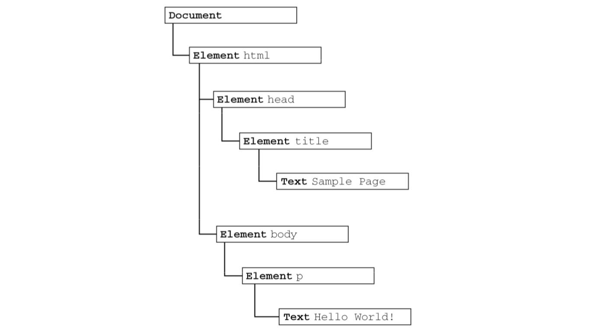
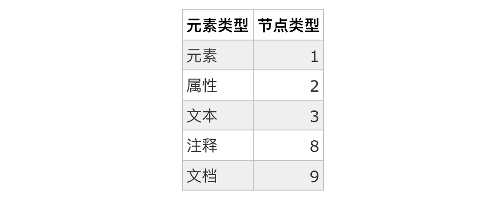
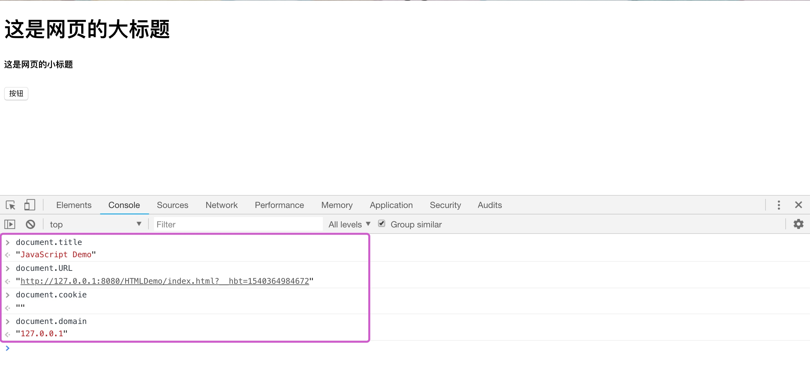
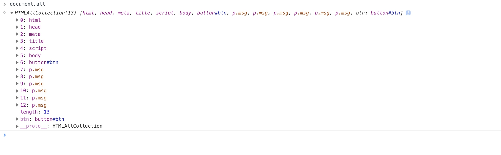
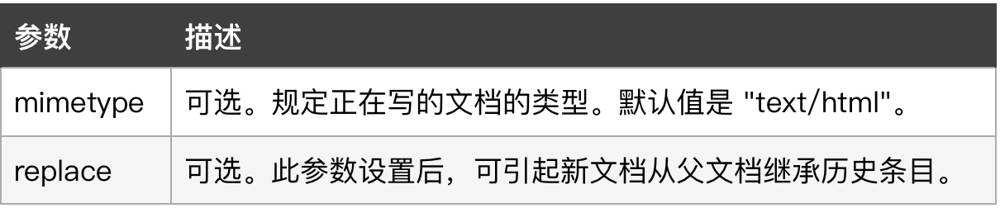
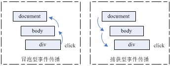
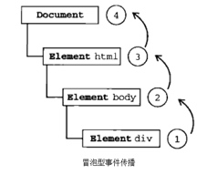
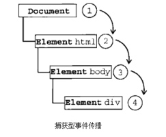

# Javascript（Dom操作、事件）

## Dom操作

### 前言

HTML D__OM 是 W3C 的推荐标准（是 HTML 文档对象模型的英文缩写，Document Object Model for HTML）， 定义了用于 HTML 的一系列标准的对象以及访问和处理 HTML 文档的标准方法。通过 DOM，我们可以访问所有的 HTML 元素，连同它们所包含的文本和属性，能够对其中的内容进行修改和删除，同时也可以创建新的元素。

在HTML DOM (Document Object Model) 中，每个HTML元素都可以当作节点，如:

* 所有的 HTML 元素都是元素节点；
* 所有 HTML 属性都是属性节点；
* 插入到 HTML 中的文本元素是文本节点；
* 注释则是注释节点。

### 节点层次

DOM 可以将任何 HTML 或 XML 文档描绘成一个由多层节点构成的结构。节点分为几种不同的类型，每种类型分别表示文档中不同的信息及(或)标记。每个节点都拥有各自的特点、数据和方法，另外也与其他节点存在某种关系。节点之间的关系构成了层次，而所有页面标记则表现为一个以特定节点为根节点的树形结构。如下例子：

```html
<html>
    <head>
        <title>Sample Page</title>
    </head>
    <body>
        <p>Hello World!</p>
    </body>
</html>
```

那么，我们可以将这个简单的HTML文档表现为一个层次结构，层次结构，如下：




文档节点（Document）是每个文档的根节点。在以上例子中，文档节点只有一个子节点，即**`<html>`元素**，我们称为**文档元素**。**文档元素是文档的最外层元素，文档中的其他所有元素都包含在文档元素中**。每个文档**只能有一个文档元素**。在 HTML 页面中，文档元素始终都是<html>元素。不过，在 XML 中，没有预定义的元素，因此任何元素都可能成为文档元素。


### Node类型

在 JavaScript 中，将DOM1级定义的 Node 接口作为了 Node 类型去实现的，除了 IE 之外，在其他所有浏览器中都可以访问到这个类型。JavaScript 中的所有节点类型都继承自 Node 类型，因此所有节点类型都共享着相同的基本属性和方法。

#### nodeType（节点类型）

每个节点都有一个 **nodeType** 只读属性，用于表明**节点的类型**。节点类型在Node中，定义了以下12个数值的常量来表示不同的节点类型：

```javascript
元素节点            　　Node.ELEMENT_NODE(1)
属性节点            　　Node.ATTRIBUTE_NODE(2)
文本节点            　　Node.TEXT_NODE(3)
CDATA节点              Node.CDATA_SECTION_NODE(4)
实体引用名称节点    　　 Node.ENTRY_REFERENCE_NODE(5)
实体名称节点        　　Node.ENTITY_NODE(6)
处理指令节点        　　Node.PROCESSING_INSTRUCTION_NODE(7)
注释节点            　 Node.COMMENT_NODE(8)
文档节点            　 Node.DOCUMENT_NODE(9)
文档类型节点        　　Node.DOCUMENT_TYPE_NODE(10)
文档片段节点        　　Node.DOCUMENT_FRAGMENT_NODE(11)
DTD声明节点            Node.NOTATION_NODE(12)
```
常用的节点类型主要有：


我们可以通过节点的nodeType去判断节点的类型，如下：

```html
<!DOCTYPE html>
<html>
    <head>
        <meta charset="UTF-8">
        <title>JavaScript Demo</title>
        <script>
            function btnEvents(){
                alert("按钮节点:" + String(document.getElementById("btn").nodeType));
            }
        </script>
    </head>
    <body>
        <h1 id="h1">这是网页的大标题</h1>
        <h5 id="h2">这是网页的小标题</h5>
        <button id="btn" name="btn" onclick="btnEvents()">按钮</button>
    </body>
</html>
```

> **注意：**
> 因不同浏览器由不同厂商开发，浏览器间会存在一定的差异性，所以并不是所有节点类型都受到 Web 浏览器的支持。

#### nodeName与nodeValue

除了nodeType外，如果我们需要了解更多节点的信息，那么还可以通过两个属性：nodeName和nodeValue。

##### nodeName

节点的名称，也是只读属性。属性的值完全取决于节点的类型。在使用该属性时，建议先检测该节点的类型：


```javascript
var btnElement = document.getElementById("btn");
if (btnElement.nodeType == 1){
	alert("按钮节点名字:" + btnElement.nodeName);
}
```

关于不同类型节点的节点名称如下：

* 元素节点的 nodeName 与标签名相同
* 属性节点的 nodeName 是属性的名称（属性节点可以通过getAttributeNode()获取）
* 文本节点的 nodeName 永远是 #text
* 文档节点的 nodeName 永远是 #document


##### nodeValue

节点的值，在使用该属性时，也是建议先检测该节点的类型：

不同类型节点的节点值如下：

* 元素节点的 nodeValue 是 undefined 或 null
* 属性节点的 nodeValue 是属性的值
* 文本节点的 nodeValue 是文本自身


```html
<html>
    <head>
        <meta charset="UTF-8">
        <title>JavaScript Demo</title>
        <script>
            function btnEvents(){
                alert("按钮节点:" + String(document.getElementById("h1").nodeType));
                alert("按钮节点:" + String(document.getElementById("h1").firstChild.nodeValue));
            }
        </script>
    </head>
    <body>
        <h1 id="h1">这是网页的大标题</h1>
        <h5 id="h2">这是网页的小标题</h5>
        <button id="btn" name="btn" onclick="btnEvents()">按钮</button>
    </body>
</html>
```

### Document对象

当我们的 HTML 文档载入浏览器后，便会成为 Document 对象。**Document 对象**是由 HTML **文档的根节点**与**所有其他节点**（元素节点，文本节点，属性节点, 注释节点）所构成。Document对象是 Window 对象的一部分，可通过 **window.document 属性对其进行访问**，我们能够通过脚本对 HTML 页面中的所有元素进行访问。


#### 常用的Document对象属性

1、title：该属性可返回当前文档的标题（ HTML title 元素中的文本）；

2、URL：该属性可返回当前文档的 URL；

3、domain：该属性可返回当前文档的服务器域名，是一个只读的字符串，包含了载入当前文档的 web 服务器的主机名；

4、cookie：该属性可设置或查看与当前文档相关的所有 cookie，是一个可读可写的字符串，可使用该属性对当前文档的 cookie 进行读取、创建、修改和删除操作；

如下示例：



5、all：该属性可以获取文档中的所有元素，如下：




#### 常用的Document对象方法

**a、getElementById()**

此方法可**返回拥有指定 ID 的 *第一个对象* 的引用**，通常我们可以通过此方法来查找文档中的一个特定的元素。 在 DOM 程序设计中，是一个非常重要的方法，大家在创建元素时，最好给该元素一个 id 属性，为它指定一个（在文档中）唯一的名称，然后就可以用该 id 查找到此元素。
**示例：**

```html
<!DOCTYPE html>
<html>
	<head>
		<meta charset="UTF-8">
		<title>JavaScript Demo</title>
		<script>
			function btnEvents(){
				var str = document.getElementById("msg");
				str.innerHTML = "Welcome"; 
			}
		</script>
	</head>
	<body>
		<button id="btn" name="btn" onclick="btnEvents()">修改</button>
		<p id="msg">Hello NO.1！</p>
		<p id="msg">Hello NO.2！</p>
		<p id="msg">Hello NO.3！</p>
		<p id="msg">Hello NO.4！</p>
		<p id="msg">Hello NO.5！</p>
		<p id="msg">Hello NO.6！</p>
		
	</body>
</html>
```

在以上代码中，我们通过查找id的方式查找其中id为msg的元素，然后对其进行修改，结果是第一个p标签的内容被修改了。

**b、getElementsByClassName()**

此方法**返回文档中所有指定类名的元素集合，作为 NodeList 对象**。NodeList 对象代表一个有顺序的节点列表，我们可通过节点列表中的节点索引号来访问列表中的节点(索引号由0开始)，使用**数组元素访问方式来访问列表中的元素**。所以我们也可以使用 NodeList 对象的 length 属性来确定指定类名的元素个数，可以通过循环各个元素来获取我们需要的元素，如下：

```html
<!DOCTYPE html>
<html>
	<head>
		<meta charset="UTF-8">
		<title>JavaScript Demo</title>
		<script>
			function btnEvents(){
				var str = document.getElementsByClassName('msg');
				str[5].innerHTML = "Welcome"; 
			}
		</script>
	</head>
	<body>
		<button id="btn" name="btn" onclick="btnEvents()">修改</button>
		<p class="msg">Hello NO.1！</p>
		<p class="msg">Hello NO.2！</p>
		<p class="msg">Hello NO.3！</p>
		<p class="msg">Hello NO.4！</p>
		<p class="msg">Hello NO.5！</p>
		<p class="msg">Hello NO.6！</p>
		
	</body>
</html>
```

也可以通过遍历的方式，批量修改元素内容：


```html
var str = document.getElementsByClassName('msg');
for(var i=0; i<str.length; i++){
	str[i].innerHTML = 'Well Done!';
}
```

**c、getElementsByName()**

此方法可**返回带有指定名称的对象的集合**。因为一个文档中的 name 属性可能不唯一（如 HTML 表单中的单选按钮通常具有相同的 name 属性），所以此方法返回的也是一个列表，与getElementsByClassName()类似。


**d、getElementsByTagName()**

此方法可**返回带有指定标签名的对象的集合**。需要注意的是：

* 返回元素的顺序是按照它们在文档中的顺序的;
* 传递给 getElementsByTagName() 方法的字符串**不区分大小写**;
* 如果我们想要获取所有元素，则把 `*` 传递给getElementsByTagName() 方法即可，它将会返回文档中元素的顺序返回所有元素的列表，与Document对象的all属性类似。

**e、write()**

此方法可向文档写入 HTML 表达式或 JavaScript 代码，如果我们添加多个参数，可列出多个参数(exp1,exp2,exp3,...) ，那么它们将按顺序被追加到文档中，如下：

```html
<!DOCTYPE html>
<html>
	<head>
		<meta charset="UTF-8">
		<title>向输出流写入文本</title>
		<script>
			function btnEvents(){	
				var content1 = "<h1 style='color: green;'>向输出流写入HTML h1标签</h1>";
				var content2 = "<h2 style='color: red;'>向输出流写入HTML h2标签</h2>";
				var content3 = "<h3 style='color: purple;'>向输出流写入HTML h3标签</h3>";
				document.write(content1, content2, content3);
			}
		</script>
	</head>
	<body>
		<p id="tip">向输出流写入文本</p>
		<button onclick="btnEvents()">写入</button>
		<p id="msg"></p>
	</body>
</html>
```

效果如下：


**f、open()** 

该方法将擦除当前 HTML 文档的内容，开始一个新的文档，新文档可使用 write() 方法或 writeln() 方法编写，语法格式如下：

```javascript
document.open(mimetype,replace);
```



如下：

```html
<!DOCTYPE html>
<html>
	<head>
		<meta charset="UTF-8">
		<title>JavaScript</title>
		<script>
			function btnEvents(){	 
				document.open("text/html", "replace");
  				var doc = "<html><head></head><body><p>开始一个新的文档</p></body></html>";
  				document.write(doc);
  				document.close();
			}
		</script>
	</head>
	<body>
		<button onclick="btnEvents()">当前窗口打开输出流在写入文本</button>
		<p id="msg"></p>
	</body>
</html>
```
以上代码可以在当前文档开始一个新文档。我们也可以在新窗口输出一个文档，通过window.open()开启一个窗口：


```html
<!DOCTYPE html>
<html>
	<head>
		<meta charset="UTF-8">
		<title>JavaScript</title>
		<script>
			function btnEvents(){	
				var win = window.open();
				win.document.open("text/html", "replace");
  				var doc = "<html><head></head><body><p>开始一个新的文档</p></body></html>";
  				win.document.write(doc);
  				win.document.close();
			}
		</script>
	</head>
	<body>
		<button onclick="btnEvents()">当前窗口打开输出流在写入文本</button>
		<p id="msg"></p>
	</body>
</html>
```

**g、close()** 

此方法将关闭 open() 方法打开的文档流，并强制地显示出所有缓存的输出内容。所以需要注意的是：

1. 如果使用 write() 方法动态地输出一个文档，那么就需要调用 close() 方法，以确保所有文档内容都能显示；
2. 一旦调用了 close()，就不应该再次调用 write()，因为这会隐式地调用 open() 来擦除当前文档并开始一个新的文档。


#### 节点操作

**1、获取节点**

子节点：
	
```javascript
Node.childNodes  //获取子节点列表NodeList; 注意换行在浏览器中被算作了text节点，如果用这种方式获取节点列表，需要进行过滤
Node.firstChild  //返回第一个子节点
Node.lastChild  //返回最后一个子节点
```
  
父节点：

```javascript
Node.parentNode   // 返回父节点
Node.ownerDocument  //返回祖先节点（整个document）
```

同胞节点：

```javascript
Node.previousSibling    // 返回前一个节点，如果没有则返回null
Node.nextSibling       // 返回后一个节点
```


**2、新增节点**

创建元素节点
	
```javascript
createElement()    // 按照指定的标签名创建一个新的元素节点
```
	
插入节点

```javascript
parentNode.appendChild(childNode);  // 将新节点追加到子节点列表的末尾
parentNode.insertBefore(newNode, targetNode);  //将newNode插入targetNode之前
```
 
**3、替换节点**

```javascript
parentNode.replace(newNode, targetNode); //使用newNode替换targetNode
```


**4、移除节点**


```javascript
parentNode.removeChild(childNode);  // 移除目标节点
node.parentNode.removeChild(node);    //在不清楚父节点的情况下使用
```

5、修改DOM属性节点的方法

```javascript
Node.getAttribute(attributename)    // 获取
Node.setAttribute(attributename,attributevalue)    // 设置
Node.removeAttribute(attributename)     // 移除
Node.attribute        // 获取DOM全部特性
```

示例：


```html
<!DOCTYPE html>
<html>
	<head>
		<meta charset="UTF-8">
		<title>JavaScript</title>
		<script>
			function addNode(){	
				var sub2 = document.createElement("p")
				sub2.setAttribute("id", "sub2");
				sub2.innerHTML = "Sub2";
				sub2.style.backgroundColor = "yellow"
				var parent = document.getElementById("parent");
				parent.appendChild(sub2);
			}
			function modifyProperty(){
				var sub2 = document.getElementById("sub2");
				sub2.style.backgroundColor = "green"
			}
			function deleteNode(){
				var parent = document.getElementById("parent");
				var sub1 = document.getElementById("sub1")
				parent.removeChild(sub1);
			}
		</script>
	</head>
	<body>
		<button onclick="addNode()">添加一个子节点</button>
		<div id="parent" style="background-color: pink; width: 500px; height: 300px;">
			<p id="sub1" style="background-color: yellowgreen;">Sub1</p>
		</div>
		<button onclick="modifyProperty()">修改节点属性</button>
		<button onclick="deleteNode()">删除一个子节点</button>
	</body>
</html>
```


## 事件

事件是文档或者浏览器窗口中发生的，特定的交互瞬间，通常是用户或浏览器自身执行的某种动作，如click、load和mouseover都是事件，是javaScript和DOM之间交互的桥梁。
DOM同时支持两种事件模型：冒泡型事件和捕获型事件 （个别浏览器不支持捕获 ）

**冒泡型事件(Event Bubbling)**

事件的传播是从**最特定的事件目标到最不特定的事件目标**，即从DOM树的**叶子到根**。这是IE浏览器对事件模型的实现，冒泡，顾名思义，事件像个水中的气泡一样一直往上冒，直到顶端。从DOM树型结构上理解，就是事件由叶子节点沿祖先结点一直向上传递直到根节点；从浏览器界面视图HTML元素排列层次上理解就是事件由具有从属关系的最确定的目标元素一直传递到最不确定的目标元素，即事件按照从特定的事件目标开始到最不确定的事件目标。

**捕获型事件(Event Capturing)**
  
捕获阶段是由上层元素到下层元素的顺序依次的传递的，它与冒泡型刚好相反，由DOM树最顶层元素一直到最精确的元素，事件的传播是**从最不特定的事件目标到最特定的事件目标**，即从DOM树的**根到叶子**。



如下示例：


```html
<!DOCTYPE html>
<html>
	<head>
		<meta charset="UTF-8">
		<title>事件流</title>
	</head>

	<body>
		<div id="myDiv">Click Here！</div>
	</body>
</html>
```

如果单击了页面中的myDiv元素，那么：

在冒泡型事件流中click事件传播顺序为:

`<div>`——>`<body>`——>`<html>`——>`document`




在捕获型事件流中click事件传播顺序为:

`document`——>`<html>`——>`<body>`——>`<div>` 




### 常用鼠标事件


* onmousedown：鼠标按钮被按下（左键或者右键）时触发。不能通过键盘触发。
* onmouseup：鼠标按钮被释放弹起时触发。不能通过键盘触发。
* onclick：单击鼠标左键或者按下回车键时触发。这点对确保易访问性很重要，意味着onclick事件处理程序既可以通过键盘也可以通过鼠标执行。
* ondblclick：双击鼠标左键时触发。
* onmouseover：鼠标移入目标元素上方。鼠标移到其后代元素上时会触发。
* onmouseout：鼠标移出目标元素上方。
* onmouseenter：鼠标移入元素范围内触发，该事件不冒泡，即鼠标移到其后代元素上时不会触发。
* onmouseleave：鼠标移出元素范围时触发，该事件不冒泡，即鼠标移到其后代元素时不会触发。
* onmousemove：鼠标在元素内部移到时不断触发。不能通过键盘触发。

