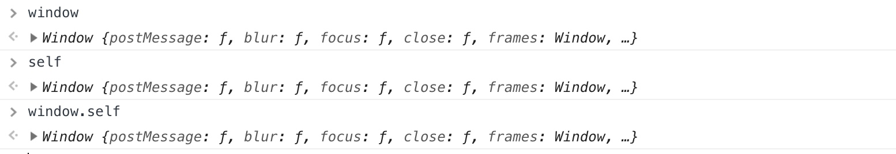
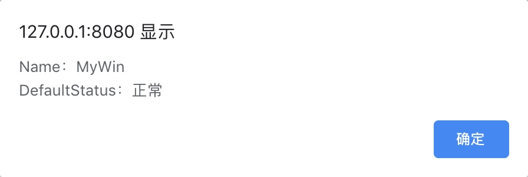
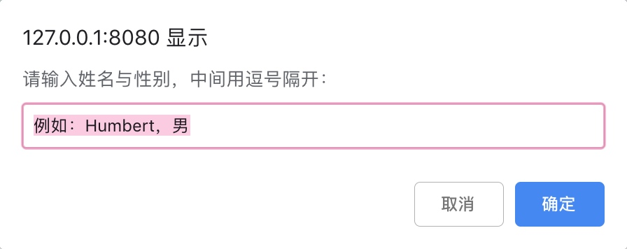

# JavaScript Window对象

## Window对象
BOM，即浏览器对象模型，它提供了很多对象，用于访问浏览器的功能，这些功能与任何网页内容无关。BOM赋予了JS操作浏览器的能力，即window操作。
 Window对象是BOM的核心，是 JavaScript 层级中的顶层对象，它表示浏览器的一个实例。在浏览器中，window对象有双重角色，它既是通过JavaScript访问浏览器窗口的一个接口，又是ECMAScript规定的Global对象。 
>  在JavaScript 中，Window 对象是全局对象，所有的表达式都在当前的环境中计算。而要引用当前窗口根本不需要特殊的语法，可以直接把窗口的属性作为全局变量来使用。例如，我们要使用document就直接写document就行了 ，而不必写 window.document。同样的，可以直接把当前窗口对象的方法当作函数来使用，如只写 alert()，而不必写window.alert()。

除了上面列出的属性和方法，Window 对象还实现了核心 JavaScript 所定义的所有全局属性和方法。

>**Tips：**
> Window 对象的 window 属性和 self 属性引用的都是它自己。当我们如果想明确地引用当前窗口，而不仅仅是隐式地引用它时，可以使用这两个属性。所以，window、self、window.self这三者是等价的。

### 常用属性

**self** ：引用本窗口，相当于`window`和`window.self`




**name** ：为窗口名字

**defaultStatus** ：窗口状态栏信息


```html
<!DOCTYPE html>
<html>
	<head>
		<meta charset="UTF-8">
		<title>窗口属性</title>
		<script>
			window.name = "MyWin"
			window.defaultStatus = "正常"
			function winProperty() {
				alert("Name：" + name + "\nDefaultStatus：" + defaultStatus);
			}
		</script>
	</head>
	<body>
		<button onclick="winProperty()">点击输出窗口信息</button>
	</body>
</html>
```
效果如下图：



**location** ：为URL地址，设置该属性可打开新的页面

如下案例，有两个页面：PageA.html和PageB.html，当点击PageA页面中的跳转按钮，可以通过location属性跳转到PageB页.面：

*PageA.html*

```html
<!DOCTYPE html>
<html>
	<head>
		<meta charset="UTF-8">
		<title>Location属性</title>
			<script>
				function jumpToB() {
					location = "PageB.html";
				}
			</script>
	</head>
	<body>
		<h1 style="color: green;">这是PageA页面</h1>
		<button onclick="jumpToB()">点击跳转到PageB页面</button>
	</body>
</html>
```

PageB.html

```html
<!DOCTYPE html>
<html>
	<head>
		<meta charset="UTF-8">
		<title>Page B</title>
	</head>
	<body>
		<h1 style="color: pink;">这是PageB页面</h1>
	</body>
</html>
```

### 常用方法

**onload** ：即`window.onload=function(){}` ，是一个事件，当文档内容完全加载完成会触发该事件。
> 网页中的某些JavaScript脚本代码往往需要在文档加载完成后才能够去执行，否则可能导致无法获取对象的情况，为了避免类似情况的发生，可以使用以下两种方式:
> 1、将脚本代码放在网页的底端，运行脚本代码的时候，可以确保要操作的对象已经加载完成。
> 2、通过window.onload来执行脚本代码。可以为此事件注册事件处理函数，并将要执行的脚本代码放在事件处理函数中，于是就可以避免获取不到对象的情况。如下：
 
```html
<!DOCTYPE html>
<html>
	<head>
		<meta charset="utf-8"/>
		<title>jQuery</title>
		<script type="text/javascript" src="js/jquery.min.js" ></script>
		<script>
			window.onload = function(){
				document.getElementById('content').innerHTML = "测试数据";
			}
		</script>
	</head>
	<body>
		<h1>输出的内容是：&nbsp;<span id="content" style="color: mediumpurple;"></span></h1>
		<h2>这是H2标题</h2>
	</body>
</html>
```


**alert( )** ：提示信息会话框

**confirm( )**： 确认会话框


```javascript
confirm("确认会话框");
```
效果如下（chrome浏览器）：


**prompt( )** ：键盘输入会话框。函数原型：`prompt(message: String, default: String): String, Number`。

*message* ：将在对话框中显示的纯文本（并不是HTML 格式的文本）。

*default* ：对话框中的默认内容，类似于placeholder的功能

*返回值* ： 如果用户点击取消，则会返回null；如果用户输入内容点击确定，则会返回用户输入的内容

```javascript
<!DOCTYPE html>
<html>
	<head>
		<meta charset="UTF-8">
		<title>prompt对话框</title>
			<script>
				function showPrompt() {
					
					console.log(prompt("请输入姓名与性别，中间用逗号隔开：", "例如：Humbert，男"))
				}
			</script>
	</head>
	<body>
		<button onclick="showPrompt()">点击弹出对话框</button>
	</body>
</html>
```

效果如下图：




**setIntervel(func, time)** ：每隔指定时间(毫秒)执行一次操作。函数原型：`setInterval(code: String, interval: Number, args: Array): Number`

*code* ：需要执行的代码，可以是一个代码串，也可以是一个函数。

*interval* ：重复执行 code的时间间隔，需要注意的是该参数单位是**毫秒**。

args：参数列表，可以将参数列表传给我们的执行函数。

*返回值* ： 会返回一个 ID（数字类型），我们可以将此ID传递给clearInterval()或clearTimeout()函数用来执行取消操作。

```html
<!DOCTYPE html>
<html>
	<head>
		<meta charset="UTF-8">
		<title>Interval</title>
			<script>
				var num = 0;
				function countting() {
					setInterval("startCount()", 1000)
				}
				function startCount() {
					num++;
					document.getElementById("count").innerHTML = String(num)
				}
			</script>
	</head>
	<body>
		<button onclick="countting()">点击开始计时</button>
		<h1>计时器：&nbsp;<span id="count" style="color: mediumpurple;">0</span></h1>
	</body>
</html>
```


**clearInterval()** ：清除时间间隔。此方法需要接受一个参数，该参数是需要清除的interval的ID，如下：


```html
<!DOCTYPE html>
<html>
	<head>
		<meta charset="UTF-8">
		<title>Interval</title>
			<script>
				var num = 0;
				var interval = 0;
				function countting() {
					interval = setInterval("startCount()", 1000)
				}
				function startCount() {
					num++;
					document.getElementById("count").innerHTML = String(num)
				}
				function endCountting() {
					clearInterval(interval);
				}
			</script>
	</head>
	<body>
		<button onclick="countting()">点击开始计时</button>
		<h1>计时器：&nbsp;<span id="count" style="color: mediumpurple;">0</span></h1>
		<button onclick="endCountting()">关闭计时器</button>
	</body>
</html>

```

**setTimeout()** ：等待指定时间(毫秒)后再执行操作。参数与操作与setInterval函数类似

**clearTimeout()** ：取消 timeout


```html
<!DOCTYPE html>
<html>
	<head>
		<meta charset="UTF-8">
		<title>Interval</title>
			<script>
				var time = 0;
				function timeOut() {
					time = setTimeout("start()", 5000);
				}
				function start() {
					document.getElementById("print").innerHTML = "这是延迟5秒后输出的内容"
				}
				function endTimeOut() {
					clearTimeout(time)
				}
			</script>
	</head>
	<body>
		<h1>输出的内容：&nbsp;<span id="print" style="color: mediumpurple;"></span></h1>
		<button onclick="timeOut()">开始延迟执行</button>
		<button onclick="endTimeOut()">关闭延迟执行</button>
	</body>
</html>
```


