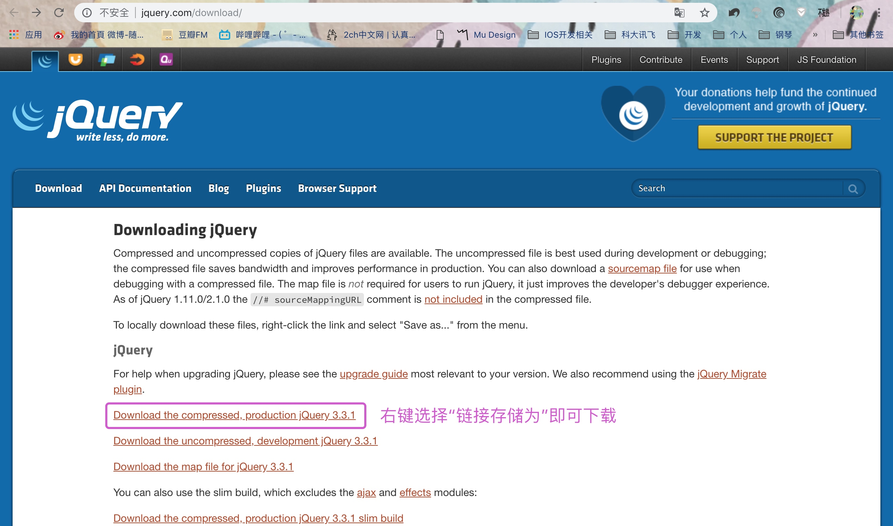
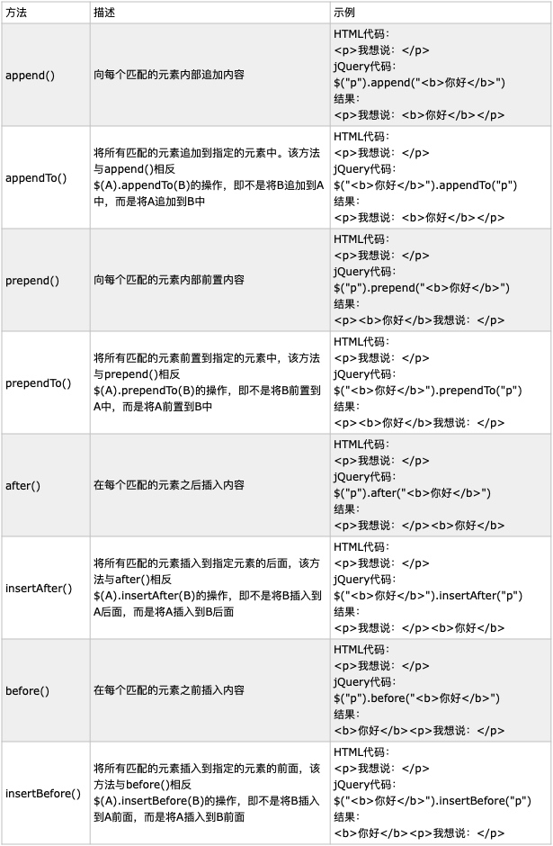

# jQuery基础

## 初识jQuery

JavaScript 是一种脚本语言，主要用在浏览器中用来实现对网页的文档对象的操作以及用户交互动作的处理，而 jQuery 则是 JavaScript 的一个函数库，它将一些在 JavaScript 开发中经常用到的功能进行了封装，**提供一种简便的JavaScript设计模式，优化HTML文档操作、事件处理、动画设计和Ajax交互，能够在不同的浏览器间实现相同的效果**，而不需要再用原生 JavaScript 语句写大量代码，**极大的简化了JavaScript编程，**目前是当前最流行的 JavaScript 库之一。

 JavaScript标识符必须以字母、下划线或美元符号`$`开头，后续字符可以是字母、数字、下划线或美元符号，所以在jQuery中`$`就是一个普通的变量。实际上，jQuery框架通过向外暴露两个变量来向外提供接口供我们使用jQuery的功能的，一个是`$`符号，另外一个就是jQuery变量了，以此作为一个接口让我们可以使用jQuery。
 
>  在实际编程中jQuery这个变量使用的频率非常高，而五个单词输入起来相对麻烦一些，所以使用一个“$”变量，让其指向jQuery，以此简化输入，并减少代码量。

所以，在使用中常用的是jQuery函数，即`$()`，该函数也支持querySelector()的功能的，也就是说**$('#top')**会去查找到DOM中id为top的那个DOM对象，然后将其包装成为一个jQuery对象。

### 如何使用jQuery

**1、本地引入**

首先在jQuery官网下载jQuery文件，官网下载地址：[jQuery Download](http://jquery.com/download/)
有两种版本的 jQuery 可供下载，我们选择其中的一个版本点击下载：




a、Production version - 用于实际的网站中，已被精简和压缩。
b、Development version - 用于测试和开发（未压缩，是可读的代码）

然后下载后会得到一个jquery-3.2.1.min.js文件，将此文将添加到工程中的目录中，然后通过script标签的src属性引入即可：

```html
<script type="text/javascript" src="jquery-3.3.1.min.js" ></script>
```

**2、CDN引入**

CDN的全称是Content Delivery Network，即内容分发网络。我们不需要下载jQuery库文件，直接引用其他站点的jQuery文件，如下：
 
```html
<script type="text/javascript" src="https://ajax.aspnetcdn.com/ajax/jQuery/jquery-3.3.1.js" ></script>
```
通过CDN引入，我们只要知道现有的具有jQuery库的地址即可，不过在引用时需要先测试，确保能够稳定访问此地址，不会出现加载延迟问题即可使用。若需要获取更多的CDN请点击：[jQuery各版本CDN](https://www.asp.net/ajax/cdn#jQuery_Releases_on_the_CDN_0)

引入jQuery后即可像使用JavaScript那样正常使用jQuery格式的语法即可。

## 使用jQuery

通过前面的介绍，大家知道了jQuery是本质上是JavaScript的代码库，那么它主要都封装了功能呢？jQuery库包含以下功能：

* HTML 元素选取
* HTML 元素操作
* CSS 操作
* HTML 事件函数
* JavaScript 特效和动画
* HTML DOM 遍历和修改
* Ajax
* Utilities

### jQuery核心

在使用jQuery时，其实就是一个**“选择某个网页元素，然后对其进行某种操作”**的过程，这是它区别于其他JavaScript库的根本特点，那么我们在使用jQuery的第一步，往往就是将一个选择表达式放进构造函数jQuery()（简写为`$()`），然后得到被选中的元素，之后对其进行某种操作。所以，可以说构造函数`$()`就是jQuery的核心。

**基础语法：**

```javascript
$(selector).action()
```
如下：

```javascript
<!DOCTYPE html>
<html>
	<head>
		<meta charset="utf-8"/>
		<title>jQuery</title>
		<script type="text/javascript" src="js/jquery-3.3.1.min.js" ></script>
	</head>
	<body>
		<h1>输出的内容是：&nbsp;<span id="content" style="color: mediumpurple;"></span></h1>
		<h2>这是H2标题</h2>
		<script>
			$('#content').html('测试数据'); 
		</script>
	</body>
</html>
```
或

```javascript
$(Dom元素).action()
```
如下：

```javascript
$(document.getElementById('content')).html('测试数据'); 
```

**1. 构造jQuery**

其实通过构造函数`$()`，我们便可以将查找到DOM对象包装成jQuery对象，然后才能使用jQuery库中的一系列方法。那么，我们使用`$()`构造函数，可以通过几种方式来构造jQuery对象：

    a、第一种是直接将一个DOM对象作为参数传递给`$()`，如：`$(window)`。这样，构造函数$()会将我们传入的对象包装成一个jQuery对象然后返回。

    b、第二种则是传递一个选择器的参数给`$()`：`$('#content')`。这样，构造函数`$()`首先会根据传入的字符串参数去DOM树中找到这些对象，然后再将其包装成jQuery对象。

**2. 转化jQuery**

既然我们可以将DOM对象包装成jQuery对象，那么当然也可以将jQuery对象再转换成DOM对象了。对于jQuery对象来说，**其实质上就是一个数组，数组中的元素即是我们原始的DOM对象，所以我们要从jQuery对象身上获取Dom对象，只要使用数组访问方式，通过索引从数组中去获取所对应的DOM对象**，如下：

```javascript
$(window)[0];
$('#content')[0];

$(document.getElementById('content'))[0].innerHTML = "测试数据"; 
```

### JavaScript与jQuery

#### 1、`window.onload` 与 `$(window).load()`、`$(document).ready()`

**onload事件**
`window.onload=function(){}`：我们知道在javascript中，window对象的onload事件可以在HTML文档所有元素（图片、flash等）完全加载后才会执行的

**load事件**
`$(window).load()`：与`window.onload=function(){}`功能类似，不过不同的是`$(window).load()`可以加载多个函数，而`window.onload`只能加载一个，如下：

> **注意：**
> 如果在使用过程中，出现**Uncaught TypeError: a.indexOf is not a function**的错误，那是因为在高版本的jQuery中`$(window).load(function(){})`已经被废弃，请使用`$(window).load(function(){})`来替代它。

*window.onload*

```html
<!DOCTYPE html>
<html>
	<head>
		<meta charset="utf-8"/>
		<title>jQuery</title>
		<script type="text/javascript" src="js/jquery-3.3.1.min.js" ></script>
		<script>
			window.onload = function(){
				document.getElementById('content1').innerHTML = "测试数据1";
			}
			window.onload = function(){
		      //只执行这个方法
				document.getElementById('content2').innerHTML = "测试数据2";
			}
		</script>
	</head>
	<body>
		<h1>输出的内容是：&nbsp;<span id="content1" style="color: mediumpurple;"></span></h1>
		<h1>输出的内容是：&nbsp;<span id="content2" style="color: mediumpurple;"></span></h1>
	</body>
</html>
```

如下效果图：


*$(window).load()*


```html
<!DOCTYPE html>
<html>
	<head>
		<meta charset="utf-8"/>
		<title>jQuery</title>
		<script type="text/javascript" src="js/jquery-3.3.1.min.js" ></script>
		<script>
			$(window).on("load", function(){
				$("#content1").html("测试数据1");
			});
			$(window).on("load", function(){
				$("#content2").html("测试数据2");
			});
		</script>
	</head>
	<body>
		<h1>输出的内容是：&nbsp;<span id="content1" style="color: mediumpurple;"></span></h1>
		<h1>输出的内容是：&nbsp;<span id="content2" style="color: mediumpurple;"></span></h1>
	</body>
</html>
```

如下效果图：


**ready事件**

$(document).ready()：页面中的DOM元素加载完成后就可执行，而无需等到图片或其他媒体下载完毕。

```html
<!DOCTYPE html>
<html>
	<head>
		<meta charset="utf-8"/>
		<title>jQuery</title>
		<script type="text/javascript" src="js/jquery-3.3.1.min.js" ></script>
		<script>
			$(document).ready(function(){
				document.getElementById('content1').innerHTML = "测试数据1";
			});
			$(document).ready(function(){
				document.getElementById('content2').innerHTML = "测试数据2";
			});
		</script>
	</head>
	<body>
		<h1>输出的内容是：&nbsp;<span id="content1" style="color: mediumpurple;"></span></h1>
		<h1>输出的内容是：&nbsp;<span id="content2" style="color: mediumpurple;"></span></h1>
	</body>
</html>
```

如下效果图：


#### DOM操作

**1、通过id获取元素**

*JavaScript：* 
			`document.getElementById('idName');`

*jQuery：* 
			`$('#idName');`


**2、通过class name 获取元素**

*JavaScript：*
			`document.getElementsByClassName('className');`

*jQuery：*
			`$('.className');`

**3、通过tagName获取元素**

*JavaScript：*
			`document.getElementsByTagName('tagName');`

*jQuery：*
			`$('tagName');`


**4、获取节点**

*JavaScript：*

    * 子节点：childNodes、firstChild、lastChild
    
    * 父节点：parentNode
    
    * 同胞节点：previousSibling、nextSibling

*jQuery：*

	父节点：   parent() 
	祖先节点： parents()        //找到所有祖先元素，不限于父元素
	子节点：   children()      //查找所有直接子节点
	同胞节点： prev()          //查找上一个兄弟节点，不是所有的兄弟节 
	          prevAll()       //查找所有之前的兄弟节点
               next()        //查找下一个兄弟节点 
               nextAll()      //查找所有之后的兄弟节点
               siblings()     //查找兄弟节点，不分前后
	后代节点： find()           //查找被选元素的后代元素，有子、孙、曾孙等


**5、创建节点**

*JavaScript：*
			`createElement('p')；`

*jQuery：*
			`$('<p></p>');`


**6、插入节点**

*JavaScript:*

	
```javascript
parentNode.appendChild(childNode);  // 将新节点追加到子节点列表的末尾
parentNode.insertBefore(newNode, targetNode);  //将newNode插入targetNode之前
```

*jQuery：*



**7、删除节点**

*JavaScript：*
		`parentNode.removeChild(childNode);`

*jQuery：*
		
```javascript
remove()      // 从DOM中删除所有匹配的元素，其后面的子节点也将同时删除 ， 也可以设置其参数进行有选择性的删除
detach()      // 跟remove()不同的是，所有绑定的事件、附加的数据都会保留下来
empty()       // 并不是删除节点，而是清空节点，也能清空所有后代的子节点。
```

**8、替换节点**

*JavaScript：*

```javascript
parentNode.replace(newNode, targetNode);     //使用newNode替换targetNode
```
		

*jQuery：*
		
		
```javascript
replacewith()        // 将所有匹配的元素都替换成指定的HTML或DOM元素
```

