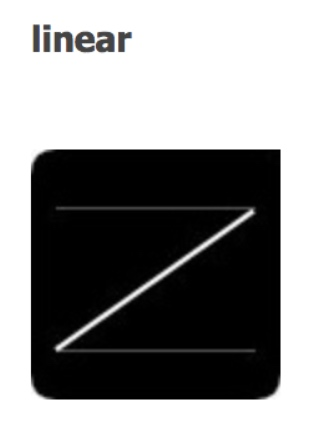
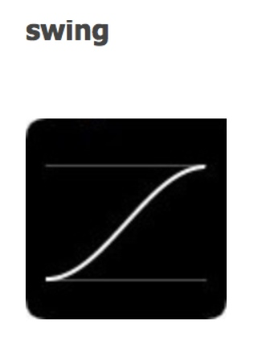

# jQuery动画

## 前言

jQuery之所以能后成为JavaScript当前最流行的库之一，动画效果也是其中的一个重要因素。通过jQuery的动画方法，能够轻松地为网页添加视觉效果，给用户一种全新的体验。

## 隐藏与显示

### show( )与hide( )

在jQuery中，**隐藏**可以通过**hide()**方法来实现；**显示**则可以通过**show()**来实现，show()方法和hide()方法是jQuery中最基本的动画方法。

* ***show*** ：使用show()方法会将隐藏的元素显示出来，它会**将元素的属性设置为hide()前的属性值**；

* ***hide*** ：使用hide()方法会**记住原来的display属性值**，并将元素的属性**设置为display:none**，即将元素隐藏。

> **注意：**
> display属性值保存在jQuery的数据缓存中，所以display可以方便以后可以恢复到其初始值。如果一个元素的display属性值为inline，那么隐藏再显示时，这个元素将再次显示inline。

#### hide( )

隐藏，函数如下：

```javascript
hide([duration][,easing][,callback])
```
参数说明

***duration***：即设置隐藏效果的速度。接受Number和String类型的值：

    1. 毫秒
    2. "slow"
    3. "fast"
    
以上"fast"和"slow"分别代表200和600毫秒的延时






***easing***：设置动画在不同点上元素的速度，接受String类型的值：

    1. "swing" (在开或者结尾移动较慢慢，在中间移动较快)
    2. "linear" （匀速运动）

***callback***：回掉函数。即用来设置hide()执行完成后需要执行的操作。


> Tips：
> duration默认值是：400毫秒
> easing默认值是：swing

**1、不传参**

隐藏元素的最简单方法是不传参直接调用hide()，如果没有设置参数，则匹配的元素将被立即隐藏，没有动画。例如：

```html
<!DOCTYPE html>
<html>
    <head>
        <meta charset="utf-8"/>
        <title>jQuery动画</title>
        <script type="text/javascript" src="https://ajax.aspnetcdn.com/ajax/jQuery/jquery-3.3.1.js" ></script>
        <style>
        		div {
        			background-color: plum;
        			width: 70px;
        			height: 100px;
        			margin: 7px;
        			float: left;
        		}
        </style>
        <script>
        		$(window).on("load",function(){
        			for (var i=0; i<2; i++) {
        				$("<div>").appendTo(document.body)
        			}
        			$("div").click(function() {
        				$(this).hide();
        			});
        		});

        </script>
    </head>
    <body>
    		<div></div>
    </body>
</html>
```

**2、hide([duration][,easing])** 
 
传参，指定隐藏速度。如下，当我们指定了speed之后，就会为easing也指定了默认值swing，如下：


```html
<!DOCTYPE html>
<html>
    <head>
        <meta charset="utf-8"/>
        <title>jQuery动画</title>
        <script type="text/javascript" src="https://ajax.aspnetcdn.com/ajax/jQuery/jquery-3.3.1.js" ></script>
        <style>
        		div {
        			background-color: plum;
        			width: 70px;
        			height: 100px;
        			margin: 7px;
        			float: left;
        		}
        </style>
        <script>
        		$(window).on("load",function(){
        			for (var i=0; i<2; i++) {
        				$("<div>").appendTo(document.body)
        			}
        			$("div").click(function() {
        				$(this).hide(1000);
        			});
        		});

        </script>
    </head>
    <body>
    		<div></div>
    </body>
</html>
```

**3、hide([duration][,easing][,callback])**

传参，指定速度，设置easing和回掉函数callback。

```html
<!DOCTYPE html>
<html>
    <head>
        <meta charset="utf-8"/>
        <title>jQuery动画</title>
        <script type="text/javascript" src="https://ajax.aspnetcdn.com/ajax/jQuery/jquery-3.3.1.js" ></script>
        <style>
        		div {
        			background-color: plum;
        			width: 70px;
        			height: 100px;
        			margin: 7px;
        			float: left;
        		}
        </style>
        <script>
        		$(window).on("load",function(){
        			for (var i=0; i<7; i++) {
        				$("<div>").appendTo(document.body)
        			}
        			$("div").click(function() {
        				$(this).hide(2000, "linear", function(){
        					$("<p>div已被删除</p>").appendTo(document.body)
        				});
        			});
        		});

        </script>
    </head>
    <body>
    		<div></div>
    </body>
</html>
```

#### show( )

show()方法主要用于显示元素，与hide()方法用途正好相反，用法相似。需要注意的是：如果选择的元素是可见的，则这个方法将不会改变任何东西；如果没有参数，匹配的元素将被立即显示，没有动画。

如下：

```html
<!DOCTYPE html>
<html>
    <head>
        <meta charset="utf-8"/>
        <title>jQuery动画</title>
        <script type="text/javascript" src="https://ajax.aspnetcdn.com/ajax/jQuery/jquery-3.3.1.js" ></script>
        <style>
        		div {
        			background-color: plum;
        			width: 70px;
        			height: 100px;
        			margin: 7px;
        			float: left;
        		}

        </style>
        <script>
        		$(window).on("load",function(){
        			for (var i=0; i<7; i++) {
        				$("<div>").appendTo(document.body)
        			}
        			$("div").click(function() {
        				$(this).hide(2000, function(){
        					$("<p>div已被删除</p>").appendTo(document.body)
        				});
        			});
        			$("#btn").click(function(){
        				$("div").show(1000, "linear", function(){
        					$("p").remove()
        				})
        			});
        		});

        </script>
    </head>
    <body>
    		<div></div>
    		<button id="btn">显示所有元素</button>
    </body>
</html>
```

## 高度变化

在使用hide()和show()大家应该也注意到了，元素的宽高也在发生变化，那么如果只想让宽高发生变化可以通过什么方式去实现呢？

#### slideUp()

 slideUp( )方法将元素**由下到上缩短隐藏**（可以简单记忆为：从下往上擦除元素），在没有参数时，持续时间默认为400毫秒。

```html
<!DOCTYPE html>
<html>
    <head>
        <meta charset="utf-8"/>
        <title>jQuery动画</title>
        <script type="text/javascript" src="https://ajax.aspnetcdn.com/ajax/jQuery/jquery-3.3.1.js" ></script>
        <style>
        		#firstdiv {
        			background-color: plum;
        			width: 100px;
        			height: 300px;
        			margin: 10px;
        		}
        </style>
        <script>
        		$(document).ready(function(){
        			$("#firstdiv").click(function(){
        				$(this).slideUp();
        			})
        		})
        </script>
    </head>
    <body>
    		<div id="firstdiv"></div>
    </body>
</html>
```

slideUp()与隐藏显示函数一样，都可以接受参数，也有对应的这几种情况：**slideUp([duration])**、**slideUp([duration][,easing])**、**slideUp([duration][,easing][,callback])**。用法也一致


#### 2、slideDown()

 slideDown()与slideUp()方法相反，slideDown()方法**使元素由上到下延伸显示**，在没有参数时，持续时间默认为400毫秒。参数和用法也与slideUp()一致。
 
>  **注意：**
>  slideDown()是**让隐藏的元素显示，对已经呈现显示状态的对象是没有作用效果的。** 如下：
 
```html
<!DOCTYPE html>
<html>
    <head>
        <meta charset="utf-8"/>
        <title>jQuery动画</title>
        <script type="text/javascript" src="https://ajax.aspnetcdn.com/ajax/jQuery/jquery-3.3.1.js" ></script>
        <style>
        		#firstdiv {
        			background-color: plum;
        			width: 100px;
        			height: 300px;
        			margin: 10px;
        			display: none;
        		}
        </style>
        <script>
        		$(document).ready(function(){
        			$("#btn").click(function(){
        				$("#firstdiv").slideDown(1000);
        			})
        		})
        </script>
    </head>
    <body>
    		<div id="firstdiv"></div>
    		<button id="btn">显示</button>
    </body>
</html>
```

 #### 3、slideToggle()

slideToggle() 方法可以**在 slideDown() 与 slideUp() 方法之间进行切换**。如果元素向下滑动，则 slideToggle() 可向上滑动它们；如果元素向上滑动，则 slideToggle() 可向下滑动它们。同时，也与其他几个函数一样，都可以接受参数，用法也一致。


```html
<!DOCTYPE html>
<html>
    <head>
        <meta charset="utf-8"/>
        <title>jQuery动画</title>
        <script type="text/javascript" src="https://ajax.aspnetcdn.com/ajax/jQuery/jquery-3.3.1.js" ></script>
        <style>
        		#firstdiv {
        			background-color: plum;
        			width: 100px;
        			height: 300px;
        			margin: 10px;
        			display: none;
        		}
        </style>
        <script>
        		$(document).ready(function(){
        			$("#btn").click(function(){
        				$("#firstdiv").slideToggle(1000);
        			})
        		})
        </script>
    </head>
    <body>
    		<div id="firstdiv"></div>
    		<button id="btn">Toggle</button>
    </body>
</html>
```

## 淡入淡出

在使用css设置样式时，如果想要让元素在页面不可见，常用的办法就是通过设置样式的display:none。除此之外还可以通过一些类似的办法可以达到这个目的，设置元素透明度opacity为0，可以让元素不可见，透明度的参数是0~1之间的值，通过改变这个值可以让元素有一个透明度的效果。常见的淡入淡出动画fadeIn()和fadeOut()方法正是这样的原理。

#### 1、fadeIn( )

fadeIn()用于淡入已隐藏的元素（也就是**用来显示元素**），元素透明度由完全透明变为完全不透明。没有参数时，持续时间默认为400毫秒。可以接受参数，也有对应的这几种情况：**fadeIn([duration])**、**fadeIn([duration][,easing])**、**fadeIn([duration][,easing][,callback])**。使用方式一致。

> 注意：
> 此方法是**让隐藏的元素显示出来的，对已经呈现显示状态的对象是没有作用效果的。** 如下：

```html
<!DOCTYPE html>
<html>
    <head>
        <meta charset="utf-8"/>
        <title>jQuery动画</title>
        <script type="text/javascript" src="https://ajax.aspnetcdn.com/ajax/jQuery/jquery-3.3.1.js" ></script>
        <style>
        		#firstdiv {
        			background-color: plum;
        			width: 100px;
        			height: 300px;
        			margin: 10px;
        			display: none;
        		}
        </style>
        <script>
        		$(document).ready(function(){
        			$("#btn").click(function(){
        				$("#firstdiv").fadeIn(2000);
        			})
        		})
        </script>
    </head>
    <body>
    		<div id="firstdiv"></div>
    		<button id="btn">淡入</button>
    </body>
</html>
```


#### 2、fadeOut( )
与fadeIn()相反，用于淡出可见的元素（**隐藏已显示的元素**），没有参数时，持续时间默认为400毫秒。可以接受参数，用法类似。

```html
<!DOCTYPE html>
<html>
    <head>
        <meta charset="utf-8"/>
        <title>jQuery动画</title>
        <script type="text/javascript" src="https://ajax.aspnetcdn.com/ajax/jQuery/jquery-3.3.1.js" ></script>
        <style>
        		#firstdiv {
        			background-color: plum;
        			width: 100px;
        			height: 300px;
        			margin: 10px;
        		}
        </style>
        <script>
        		$(document).ready(function(){
        			$("#btn").click(function(){
        				$("#firstdiv").fadeOut(2000);
        			})
        		})
        </script>
    </head>
    <body>
    		<div id="firstdiv"></div>
    		<button id="btn">淡出</button>
    </body>
</html>
```

#### 3、fadeToggle()

fadeToggle() 方法可以在 **fadeIn() 与 fadeOut() 方法之间进行切换**，如果元素已淡出，则 fadeToggle() 会向元素添加淡入效果；如果元素已淡入，则 fadeToggle() 会向元素添加淡出效果。没有参数时，持续时间默认为400毫秒。可以接受参数，用法一致。


```html
<!DOCTYPE html>
<html>
    <head>
        <meta charset="utf-8"/>
        <title>jQuery动画</title>
        <script type="text/javascript" src="https://ajax.aspnetcdn.com/ajax/jQuery/jquery-3.3.1.js" ></script>
        <style>
        		#firstdiv {
        			background-color: plum;
        			width: 100px;
        			height: 300px;
        			margin: 10px;
        		}
        </style>
        <script>
        		$(document).ready(function(){
        			$("#btn").click(function(){
        				$("#firstdiv").fadeToggle(2000);
        			})
        		})
        </script>
    </head>
    <body>
    		<div id="firstdiv"></div>
    		<button id="btn">Toggle</button>
    </body>
</html>
```

#### 4、fadeTo()

淡入淡出fadeIn与fadeOut都是修改元素样式的opacity属性，但是他们都有个共同的特点，变化的区间要么是0，要么是1。如果要让元素保持动画效果，比如执行opacity = 0.5的效果时，要如何处理？jQuery提供了fadeTo()方法，此方法允许渐变为给定的不透明度并保持。
函数原型：

```html
fadeTo( duration, opacity [, complete ] )
```

***duration***：**必需的，表示持续时间，**持续时间是以毫秒为单位的，数值越大，动画越慢。默认值为’normal’，代码400毫秒的延时；'fast'和'slow'分别代表200和600毫秒的延时。

***opacity***：**必需的，值为0和1之间的数字，表示元素的不透明度**，将淡入淡出效果设置为给定的不透明度，值越小越透明；

***callback***：**可选的，回调函数**，动画完成时执行的函数。


```html
<!DOCTYPE html>
<html>
    <head>
        <meta charset="utf-8"/>
        <title>jQuery动画</title>
        <script type="text/javascript" src="https://ajax.aspnetcdn.com/ajax/jQuery/jquery-3.3.1.js" ></script>
        <style>
        		#firstdiv {
        			background-color: plum;
        			width: 100px;
        			height: 300px;
        			margin: 10px;
        		}
        </style>
        <script>
        		$(document).ready(function(){
        			$("#btn").click(function(){
        				$("#firstdiv").fadeTo(2000, 0.5);
        			})
        		})
        </script>
    </head>
    <body>
    		<div id="firstdiv"></div>
    		<button id="btn">FadeTO</button>
    </body>
</html>
```

## 自定义动画

#### animate()

animate() 方法允许我们通过修改 CSS 样式来元素从一个状态改变为另一个状态，从而实现动画的效果。函数原型如下：

```html
animate( properties [, duration ] [, easing ] [, complete ] )
```

***properties*** ：必须的。用来设置产生动画效果的一个或多个 CSS 属性。

> **注意：** 
> 当与 animate() 方法一起使用时，该属性名称必须是驼峰命名贵发，如： paddingLeft 代替 padding-left，marginRight 代替 margin-right，依此类推。

***duration***：即设置隐藏效果的速度。接受Number和String类型的值：

    1. 毫秒
    2. "slow"
    3. "fast"

***easing***：设置动画在不同点上元素的速度，接受String类型的值：

    1. "swing" (在开或者结尾移动较慢慢，在中间移动较快)
    2. "linear" （匀速运动）

***callback***：回掉函数。即用来设置hide()执行完成后需要执行的操作。


```html
<!DOCTYPE html>
<html>
    <head>
        <meta charset="utf-8"/>
        <title>jQuery动画</title>
        <script type="text/javascript" src="https://ajax.aspnetcdn.com/ajax/jQuery/jquery-3.3.1.js" ></script>
        <style>
        		#firstdiv {
        			background-color: plum;
        			width: 300px;
        			height: 300px;
        			margin: 10px;
        		}
        </style>
        <script>
        		$(document).ready(function(){
        			$("#btn").click(function(){
        				$("#firstdiv").animate({
        					width: "500px"
        				}, 500);
        				$("#firstdiv").animate({
        					height: "500px"
        				}, 500);
        				$("#firstdiv").animate({
        					width: "300px",
        					height: "300px"
        				}, 500);
        			})
        		})
        </script>
    </head>
    <body>
    		<div id="firstdiv"></div>
    		<button id="btn">开始动画</button>
    </body>
</html>
```


> **注意：**
> 在使用animate时，要求所有 HTML 元素的位置（position）都是**静态的（static）**，并且无法移动。

 jQuery 提供了针对动画的队列功能，我们可以编写多个 animate() ，jQuery 会创建包含这些方法调用的“内部”队列，然后逐一运行这些 animate 调用。

#### 停止动画


**1、stop()**

此方法用于在动画或效果完成前对它们进行停止。

```html
<!DOCTYPE html>
<html>
    <head>
        <meta charset="utf-8"/>
        <title>jQuery动画</title>
        <script type="text/javascript" src="https://ajax.aspnetcdn.com/ajax/jQuery/jquery-3.3.1.js" ></script>
        <style>
        		#firstdiv {
        			background-color: plum;
        			width: 300px;
        			height: 300px;
        			margin: 10px;
        		}
        </style>
        <script>
        		$(document).ready(function(){
        			$("#startAnimate").click(function(){
        				$("#firstdiv").animate({
        					width: "500px"
        				}, 500);
        				$("#firstdiv").animate({
        					height: "500px"
        				}, 500);
        				$("#firstdiv").animate({
        					width: "300px",
        					height: "300px"
        				}, 500);
        			});
        			$("#endAnimate").click(function(){
        				$("#firstdiv").stop()
        			});
        		})
        </script>
    </head>
    <body>
    		<button id="startAnimate">开始动画</button>
    		<button id="endAnimate">结束动画</button>
    		<div id="firstdiv"></div>
    </body>
</html>
```
**2、stop(stopAll,goToEnd)**

***stopAll*** ：可选的，此参数规定**是否应该清除动画队列**，即把当前元素接下去尚未执行完的动画队列清空。默认是 false，即仅停止活动的动画，允许任何排入队列的动画向后执行。

***goToEnd***：可选的，参数规定是否立即完成当前动画。默认是 false，因此，默认地，stop() 会清除在被选元素上指定的当前动画。可以用于让正在执行的动画直接到达结束时刻的状态，通常用于后一个动画需要基于前一个动画的末状态的情况，可以通过stop(false,true)这种方式来让当前动画直接到达末状态。

两者结合起来**stop(true,true)**，即停止当前动画并直接到达当前动画的末状态，并清空动画队列

3、Chaining

在jQuery中，我们还可以把动作（方法）链接起来，Chaining 允许我们在一条语句中允许多个 jQuery 方法（在相同的元素上）。这样的话，浏览器就不必多次查找相同的元素，如需链接一个动作，我们可以直接把该动作追加到之前的动作上，如下：

```html
<!DOCTYPE html>
<html>
    <head>
        <meta charset="utf-8"/>
        <title>jQuery动画</title>
        <script type="text/javascript" src="https://ajax.aspnetcdn.com/ajax/jQuery/jquery-3.3.1.js" ></script>
		<script>
			$(document).ready(function(){
				$('#startBtn').click(function(){
					$('#divA')
					.css('background-color','lightcoral')
					.animate({width:'200px', height:'200px', top:'300px'}, 400)
					.animate({width:'200px', height:'100px', left:'300px'}, 400)
					.animate({width:'100px', height:'100px', top:'0px'}, 400)
					.animate({width:'0px', height:'0px', left:'0px'}, 400)
				});
			});			
		</script>
	</head>
	<body>
		<button id="startBtn">开始</button>
		<div id="divA" style="position: relative;">jQuery</div>
	</body>
</html>
```


