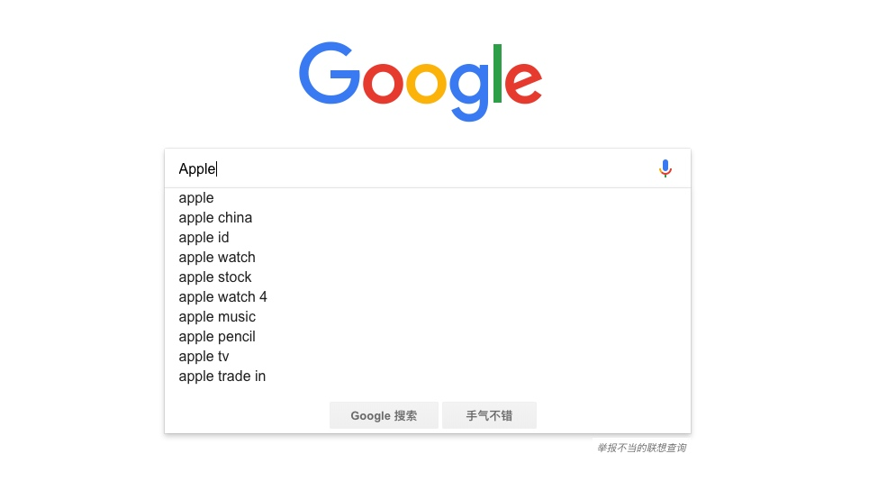
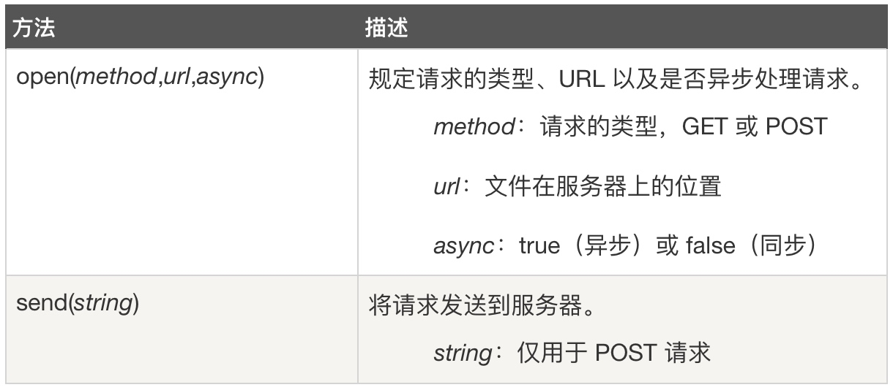
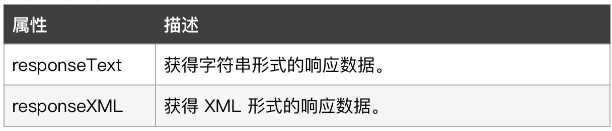
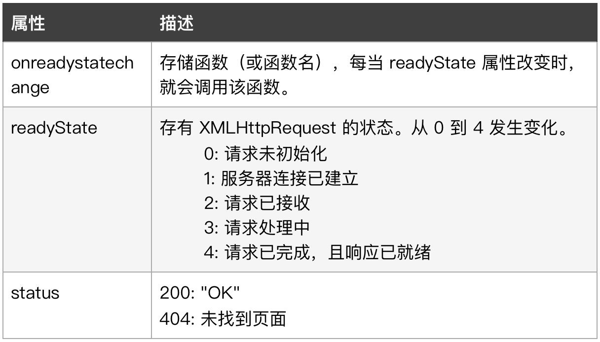
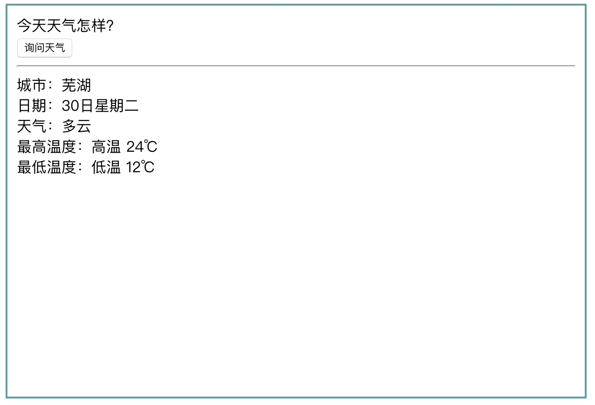
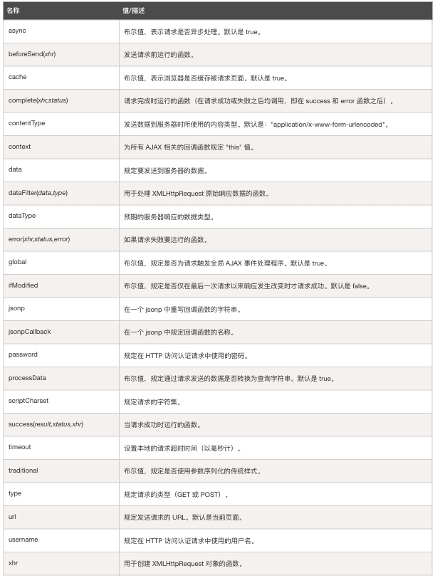

# jQuery AJAX

AJAX 即Asynchronous JavaScript and XML（异步的 JavaScript 和 XML），它并不是新的编程语言，而是**一种使用现有标准的新方法**。AJAX 最大的优点是**在不重新加载整个页面的情况下，可以与服务器交换数据并更新部分网页内容**，AJAX 不需要任何浏览器插件，但需要用户允许JavaScript在浏览器上执行。

> AJAX 基于因特网标准，并使用以下技术组合：

> * XMLHttpRequest 对象（与服务器异步交互数据）
> * JavaScript/DOM（显示/取回信息）
> * CSS（设置数据的样式）
> * XML（常用作数据传输的格式）

jQuery提供多个与 AJAX 有关的方法，通过 jQuery 的AJAX 方法，我们可以通过 HTTP 请求从远程服务器上请求文本、HTML、XML 或 JSON 数据，同时还能够把这些请求获取的数据直接载入网页的被选元素中。如Google Suggest， 使用了 AJAX 创造出动态性极强的 web 界面：当我们在谷歌的搜索框输入关键字时，JavaScript 会把这些字符发送到服务器，然后服务器会返回一个搜索建议的列表：




### XMLHttpRequest对象

XMLHttpRequest对象是AJAX的基础，通过它就可以在后台与服务器交换数据，才使得我们可以在不重新加载整个网页的情况下，对网页的某部分进行更新，且目前几乎所有的浏览器都支持（IE5 和 IE6 使用 ActiveXObject）。我们可以直接使用XMLHttpRequest对象来完成请求操作。

#### 使用步骤

**1、创建XMLHttpRequest对象**

        				var xhr = new XMLHttpRequest();

不过，为了应对所有的现代浏览器，包括 IE5 和 IE6，在创建XMLHttpRequest对象时需要检查浏览器是否支持，。如果支持，则创建 XMLHttpRequest 对象。如果不支持，则创建 ActiveXObject ：


```javascript
var xhr;
if (window.XMLHttpRequest){
	// code for IE7+, Firefox, Chrome, Opera, Safari
	xhr = new XMLHttpRequest();
}
else{
	// code for IE6, IE5
	xhr = new ActiveXObject("Microsoft.XMLHTTP");
}
```

**b、发送请求**

向服务器发送请求，我们可以使用XMLHttpRequest对象的open()以及send()方法。



**c、服务器响应**

我们可以通过 XMLHttpRequest 对象的 responseText 或 responseXML 属性来获取服务器响应信息。



d、onreadystatechange 事件

当请求被发送到服务器时，我们需要执行一些基于响应的任务，而每当 readyState 改变时，就会触发 onreadystatechange 事件。readyState 属性存有 XMLHttpRequest 的状态信息。
以下是 XMLHttpRequest 对象的三个重要的属性：




```html
<!DOCTYPE html>
<html>
    <head>
        <meta charset="utf-8"/>
        <title>jQuery AJAX</title>
        <script type="text/javascript" src="https://ajax.aspnetcdn.com/ajax/jQuery/jquery-3.3.1.js" ></script>
		<script>
			$(document).ready(function(){
				$("#startBtn").click(function() {
					var xhr;
					if (window.XMLHttpRequest) {
						xhr = new XMLHttpRequest;
					} else{
						xhr = new ActiveXObject("Microsoft.XMLHTTP");
					}
					var urlStr = "http://wthrcdn.etouch.cn/weather_mini?city=芜湖";
					//设置请求对象的准备状态
					xhr.onreadystatechange = function() {
						//判断请求正常并成功时
						if(xhr.readyState == 4 && xhr.status == 200) {
							//将请求返回的数据展示在页面中
							$("#content").html(xhr.responseText);
							console.log(xhr.responseText);
						}
					};
					xhr.open("GET", urlStr, true);
					xhr.send();
				});
			});			
		</script>
	</head>
	<body>
		<button id="startBtn">开始请求</button>
		<p>今天的天气怎样？</p>
		<div id="content" style="position: relative;"></div>
	</body>
</html>
```

### jQuery 与 AJAX

**1、load()**

此方法可以从服务器加载数据，并把返回的数据放入被选元素中。语法格式如下：


```javascript
$(selector).load(URL,data,callback);
```

*URL* ：必需的，请求的 URL；
*data* ：可选的，参数规定与请求一同发送的查询字符串键/值对集合；
*callback* ：可选的，是 load() 方法完成后所执行的函数名称。


```html
<!DOCTYPE html>
<html>
    <head>
        <meta charset="utf-8"/>
        <title>jQuery AJAX</title>
        <script type="text/javascript" src="https://ajax.aspnetcdn.com/ajax/jQuery/jquery-3.3.1.js" ></script>
		<script>
			$(document).ready(function(){
				$("#startBtn").click(function() {
					$("#content").load("http://wthrcdn.etouch.cn/weather_mini?city=芜湖", function(){
						console.log("请求成功");
					});
				});
			});			
		</script>
	</head>
	<body>
		<button id="startBtn">开始请求</button>
		<p>今天的天气怎样？</p>
		<div id="content" style="position: relative;"></div>
	</body>
</html>
```

**2、get()**
     
此方法通过 HTTP GET 请求从服务器上请求数据：


```javascript
$.get(URL,callback);
```

*URL *：必需的，请求的 URL；
*callback*：可选的，是请求成功后所执行的函数名称。在回掉函数中，提供了两个参数，请求返回的数据以及请求的状态，如下：

```html
<!DOCTYPE html>
<html>
    <head>
        <meta charset="utf-8"/>
        <title>jQuery AJAX</title>
        <script type="text/javascript" src="https://ajax.aspnetcdn.com/ajax/jQuery/jquery-3.3.1.js" ></script>
		<script>
			$(document).ready(function(){
				$("#startBtn").click(function() {
					$.get("http://wthrcdn.etouch.cn/weather_mini?city=芜湖", function(data, status){
						if(status == "success") {
							$("#content").html(data)
						}
					});
				});
			});			
		</script>
	</head>
	<body>
		<button id="startBtn">开始请求</button>
		<p>今天的天气怎样？</p>
		<div id="content" style="position: relative;"></div>
	</body>
</html>
```


**3、post()** 
    
此方法通过 HTTP POST 请求从服务器上请求数据：


```javascript
$.post(URL,data,callback);
```

*URL* ：必需的，请求的 URL；
*data*：可选的，规定与请求一同发送的查询字符串键/值对集合；
*callback*：可选的，是请求成功后所执行的函数名称。

**4、ajax()**

此方法用于执行 AJAX（异步 HTTP）请求，通过 HTTP 请求加载远程数据，该方法是 jQuery 底层 AJAX 实现，而在上文中的load()、get()、post()等函数都是该函数的简化形式(都调用该函数，只是参数设置有所不同或有所省略)，语法格式如下：

```html
$.ajax({name:value, name:value, ... })
```
该方法的参数一个用于配置 Ajax 请求的键值对集合，其中的每个属性用来指定发送请求所需的额外参数设置，常见的参数如下：

**a、url**
String类型，默认值: **发送请求的地址**。

**b、async**
Boolen类型，**默认为true**，该属性指示**是否是异步请求**。同步请求将锁定浏览器，直到获取到远程数据后才能执行其他操作。

**c、cache**
Boolean类型，默认为true，不过当dataType为'script'或'jsonp'时，默认为false。指示**是否缓存URL请求**。如果设为false将强制浏览器不缓存当前URL请求，该参数只对HEAD、GET请求有效(POST请求本身就不会缓存)。

**d、dataType**
String类型，jQuery自动根据 HTTP 包 MIME 信息来智能猜测，猜测范围(xml、 JSON、 script或html)**指定返回的数据类型**。该属性值可以为：

* 'xml' :返回XML文档，可使用jQuery进行处理。
* 'html': 返回HTML字符串，包含的 script 标签会在插入 dom 时执行。
* 'script': 返回JavaScript代码。不会自动缓存结果。除非设置了cache参数。注意：在远程请求时(不在同一个域下)，所有POST请求都将转为GET请求。(因为将使用DOM的script标签来加载)
* 'json': 返回JSON数据。JSON数据将使用严格的语法进行解析(属性名必须加双引号，所有字符串也必须用双引号)，如果解析失败将抛出一个错误。从jQuery 1.9开始，空内容的响应将返回null或{}。
* 'jsonp': JSONP格式。使用JSONP形式调用函数时，如"url?callback=?"，jQuery将自动替换第二个?为正确的函数名，以执行回调函数。
* 'text': 返回纯文本字符串。

**e、type**
String类型，**设置请求方式** "POST" 或 "GET"，默认值: "GET"。注意：其它 HTTP 请求方法，如 PUT 和 DELETE 也可以使用，但仅部分浏览器支持。

**f、contentType**
String类型，默认值: “application/x-www-form-urlencoded”，用于**设置发送信息至服务器时内容编码类型**。默认值适合大多数情况。

g、data
任意类型，**发送到服务器的数据，它将被自动转为字符串类型**。如果是GET请求，它将被附加到URL后面。

h、timeout
Number类型，设置**请求超时时间（毫秒）**，此设置将覆盖全局设置。

**i、success**
**Function类型，指定请求成功后执行的回调函数**。该函数有3个参数：**请求返回的数据、响应状态字符串、jqXHR对象**。

**j、error**
**Function类型，指定请求失败时执行的回调函数**。该函数有3个参数：jqXHR对象、 请求状态字符串(null、 'timeout'、 'error'、 'abort'和'parsererror')、 错误信息字符串(响应状态的文本描述部分，例如'Not Found'或'Internal Server Error’)。这是一个Ajax事件，跨域脚本和跨域JSONP请求不会调用该函数。


```html
<!DOCTYPE html>
<html>
	<head>
		<meta charset="utf-8" />
		<title>jQuery动画</title>
		<script type="text/javascript" src="https://ajax.aspnetcdn.com/ajax/jQuery/jquery-3.3.1.js"></script>
		<style>

		</style>
		<script>
			$(document).ready(function() {
				$("#btn").click(function() {
					var cityName = prompt("请输入想要查询的城市名", "例如：苏州");
					var urlStr = "http://wthrcdn.etouch.cn/weather_mini?city=" + cityName;
					$.ajax({
						type: "get",
						url: urlStr,
						dataType: "json",
						async: true,
						success: function(responseData) {
							console.log(responseData);
							$("#city").html(responseData.data.city);
							$("#currentDay").html(responseData.data.forecast[0].date);
							$("#weather").html(responseData.data.forecast[0].type);
							$("#highTem").html(responseData.data.forecast[0].high);
							$("#lowTem").html(responseData.data.forecast[0].low);
						},
						error: function(errorMsg) {
							alert(errorMsg);
						}
					})
				});
			})
		</script>
	</head>

	<body>
		<div class="container" style="width: 600px; height: 400px; border: 2px solid cadetblue; padding: 10px;">
			<div id="desc">今天天气怎样？</div>
			<button id="btn">询问天气</button>
			<hr />
			<div>城市：<span id="city"></span></div>
			<div>日期：<span id="currentDay"></span></div>
			<div>天气：<span id="weather"></span></div>
			<div>最高温度：<span id="highTem"></span></div>
			<div>最低温度：<span id="lowTem"></span></div>
		</div>
	</body>

</html>
```

效果如下图：




其他参数见附件：




