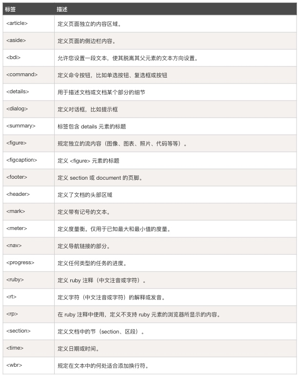
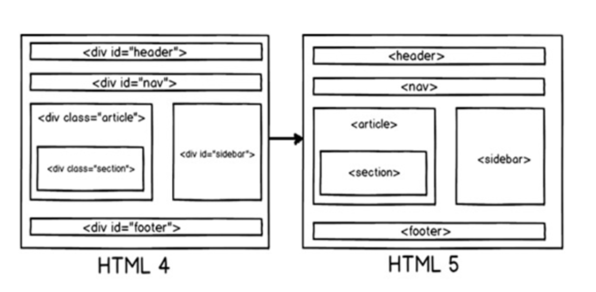
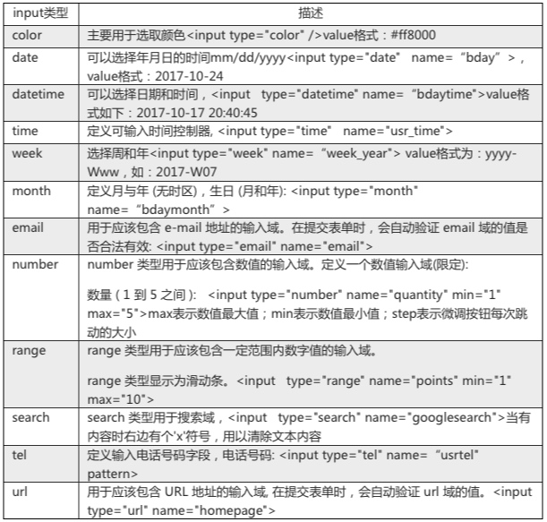
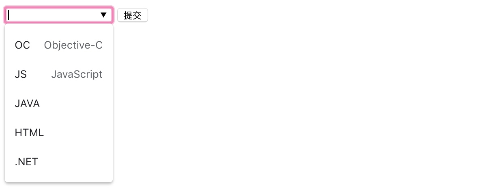
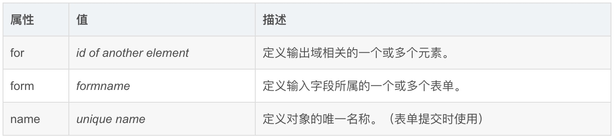
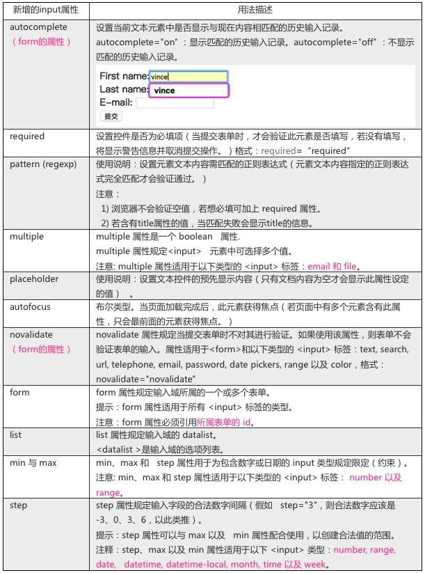

# HTML5基础

## 认识HTML5

HTML5是HTML目前最新的版本，2014年10月由万维网联盟（W3C）完成标准制定。

**HTML各版本**


**HTML5的设计目**

HTML5的设计目的是为了在移动设备上支持多媒体。为此也引进了新的语法特征如video、audio和canvas 标记，如：

* 用于绘画的 canvas 元素
* 用于媒介回放的 video 和 audio 元素
* 对本地离线存储的更好的支持
* 新的特殊内容元素，比如 article、footer、header、nav、section
* 新的表单控件，比如 calendar、date、time、email、url、search

HTML5还引进了新的功能，能够真正改变用户与文档的交互方式，如：

* 新的解析规则增强了灵活性
* 新属性
* 淘汰过时的或冗余的属性
* 一个HTML5文档到另一个文档间的拖放功能
* 离线编辑
* 信息传递的增强
* 详细的解析规则
* 多用途互联网邮件扩展（MIME）和协议处理程序注册
* 在SQL数据库中存储数据的通用标准（Web SQL）


***HTML5 中的一些的新特性***：

* **语义特性(Class：Semantic)**

HTML5*赋予网页更好的意义和结构，能够让你更恰当地描述你的内容是什么*。更加丰富的标签将随着对RDFa的，微数据与微格式等方面的支持，构建对程序、对用户都更有价值的数据驱动的Web。

语义元素如下：




* **本地存储特性(Class: OFFLINE & STORAGE)**

*能够让网页在客户端本地存储数据以及更高效地离线运行*。基于HTML5开发的网页APP拥有更短的启动时间，更快的联网速度，这些全得益于HTML5 APP Cache，以及本地存储功能。Indexed DB(html5本地存储最重要的技术之一)和API说明文档。

* **设备兼容特性 (Class: DEVICE ACCESS)**

HTML5*提供了前所未有的数据与应用接入开放接口，能够处理各种输入和输出设备*。使外部应用可以直接与浏览器内部的数据直接相连，例如视频影音可直接与microphones及摄像头相联。

* **连接特性(Class: CONNECTIVITY)**

HTML5*拥有更有效、创新的服务器推送技术，如Server-Sent Event和WebSockets*就是其中的两个特性，这两个特性能够帮助我们实现服务器将数据“推送”到客户端的功能。

* **网页多媒体特性(Class: MULTIMEDIA)**

支持网页端的*Audio、Video*等多媒体功能， 与网站自带的APPS，摄像头，影音功能相得益彰。

* **三维、图形及特效特性(Class: 3D, Graphics & Effects)**

*基于SVG、Canvas、WebGL及CSS3的3D功能*，用户会惊叹于在浏览器中，所呈现的惊人视觉效果。

* **性能与集成特性(Class: Performance & Integration)**

HTML5会通过XMLHttpRequest2等技术，*解决以前的跨域等问题*，帮助您的Web应用和网站在多样化的环境中更快速的工作。

* **CSS3特性(Class: CSS3)**

在不牺牲性能和语义结构的前提下，*CSS3中提供了更多的风格和更强的效果*。此外，较之以前的Web排版，Web的开放字体格式(WOFF)也提供了更高的灵活性和控制性。


#### HTML5的改进

* 新元素
* 新属性
* 完全支持 CSS3
* Video 和 Audio
* 2D/3D 制图
* 本地存储
* 本地 SQL 数据
* Web 应用


### 通过HTML5我们能够做什么？


##### HTML5 多媒体

通过 HTML5 可以简单的在网页中播放视频(video)与音频 (Audio) 。

* `<video>`
* `<audio>`

##### HTML5 应用

通过 HTML5 可以简单地开发应用

* 本地数据存储
* 访问本地文件
* 本地 SQL 数据
* 缓存引用
* XHTMLHttpRequest2

##### HTML5 图形

通过 HTML5 可以简单的绘制图形:

* 使用 `<canvas>` 元素。
* 使用内联 SVG。
* 使用 CSS3 2D 转换、CSS3 3D 转换。

##### HTML5 CSS3

完全支持CSS3，能够实现更多的风格和更强的效果

* 新选择器
* 新属性
* 动画
* 2D/3D 转换
* 圆角
* 阴影效果
* 可下载的字体

### 使用HTML5

#### HTML声明

需要使用HTML5，我们必须要在文档中进行<!doctype>声明，声明必须位于 HTML5 文档中的第一行，用来告诉浏览器或任何其它分析程序所查看的文件类型，声明内容如下：

```html
<!DOCTYPE html>
```
目前很多工具都在创建HTML文件时自动添加上<!doctype>声明，如我们正在使用的HBuilder。

我们可以通过声明来指定不同的HTML版本，常见的HTML声明如下：

*HTML5*

```html
<!DOCTYPE html>
```
*HTML 4.01*


```html
<!DOCTYPE HTML PUBLIC "-//W3C//DTD HTML 4.01 Transitional//EN"
"http://www.w3.org/TR/html4/loose.dtd">
```

*XHTML 1.0*

```html
<!DOCTYPE html PUBLIC "-//W3C//DTD XHTML 1.0 Transitional//EN"
"http://www.w3.org/TR/xhtml1/DTD/xhtml1-transitional.dtd">
```

#### 浏览器兼容性

目前大部分新版本的 Safari、Chrome、Firefox 以及 Opera 等浏览器都可以支持大部分 HTML5 的特性。


#### 与HTML4的区别


##### 1、语法的改变

###### 版本声明
HTML4中需要指明是HTML的哪个版本，HTML5不需要，只使用`<!DOCTYPE html>`即可。

###### 指定字符编码变化

*HTML4* ：`<meta http-equiv=‶content-type″ content=‶text/html; charset=UTF-8″>`
*HTML5* ：`<meta charset=‶UTF-8″>`

###### 具有boolean值的属性调整

*true* ： 当**不指定属性值、属性名设定为属性值、字符串为空**时均表示属性值为**true**；
*false* ：当**不写该属性**表示属性值为**false**。

```html
<input type="checkbox" checked>                   表示checked值为true
<input type="checkbox" checked="checked">         表示checked值为true
<input type="checkbox" checked="">                表示checked值为true
<input type="checkbox">                           表示checked值为false
```

###### 可省略引号
HTML5可省略指定属性值时的引号，如下：

```html
<input type="checkbox" checked=checked>         表示checked值为true
```

##### 2、新增的元素和废除的元素

###### 新增的元素、结构元素

*section* ：表示**页面中内容块**，比如章节、页眉、页脚或页面中的其他部分，可与`<h1>`到`<h6>`结合使用表示文档结构。

*article* ：表示**页面中一块与上下文不相关的独立内容**，比如博客中的一篇文章或报纸中的一篇文章。

*aside* ：表示**article内容之外**，与article内容相关的**辅助信息**。

*header* ：表示页面中的区域块，通常用它表示**标题**。

*hgroup* ：用于**对整个页面或页面中标题进行整合**。

*footer* ：表示页面中的区域块，通常表示**区域块的脚部或底部**，用于承载**作者姓名、创作日期**等与作者的元素。

*nav* ：表示页面中**导航部分**。

*figure* ：表示一段**独立的流内容**，一般表示主体流内容的一个独立单元。


###### 其他元素

*video* ：定义电影片段、视频流等视频。

*audio* ：定义音乐或音频流。

*canvas* ：画布，其本身没有行为，仅提供一块画布，但它的API展现给JavaScript及脚本，能够把想绘制的东西绘制在canvas上。

还有其他元素如：embed、mark、progress、meter、time、ruby、rt、rp、wbr、command、details、detalist、datagrid、keygen、output、source、menu等不再一一展开

###### 新增的input元素的类型

*email* ：表示必须输的email地址

*url* ：表示文本框输入的一个地址

*number* ：表示数字

*range* ：表示数字范围值

*DataPickers* ：表示日历的日期、时间

##### 废除的元素

###### 能使用css代替的元素

basefont、big、center、font、s、tt、u等，这些元素纯粹是为画面展示服务的，HTML5中提倡把画面展示性功能放在css中统一编辑。

###### 不再使用frame框架

由于frame框架对网页可用性存在负面影响，HTML5中已不支持frame框架，只支持iframe框架或者用服务器方式创建的由多个页面组成的复合页面的形式，同时也将frameset元素、frame元素、noframes元素废除。

#### 结构

相对于HTML4，HTML5中的元素更加语义化。在HTML4当中，如果我们想要去呈现内容，需要通过我们的布局元素div，并且给这些div设置对应的id或class来标记该标签及其功能模块。然而，在HTML5中，通过为这些区域创建元素名称来使他们更加清晰，也使得HTML更加具有可读性。





```html
<!DOCTYPE html>
<html>
	<head>
		<meta charset="utf-8"/>
		<title></title>
	</head>
	<body>
		<header>...</header>
		<nav>...</nav>
		<article>
			<section>
				...
			</section>
		</article>
		<aside>...</aside>
		<footer>...</footer>
	</body>
</html>
```

以上页面结构每个HTML5元素的作用如下：

`<header>` ：代表HTML的头部数据
`<footer>` ：页面的脚部区域
`<nav>` ：页面导航元素
`<article>` ：自包含的内容
`<section>` ：使用内部article去定义区域或者把分组内容放到区域里
`<aside>` ：代表页面的侧边栏内容

## 表单

### input新增的类型



### 新增的表单元素

**1、datalist**

`<datalist>` 元素规定输入域的选项列表，规定 form 或 input 域应该拥有自动完成功能。当用户在自动完成域中开始输入时，浏览器应该在该域中显示填写的选项。使用时，**将 `<input>` 的list属性与 `<datalist>` 元素的id绑定**，需要注意的是Internet Explorer 9（更早 IE 版本），Safari 不支持 datalist 标签。


```html
<!DOCTYPE html>
<html>
	<head>
		<meta charset="utf-8" />
		<title>datalist</title>
	</head>

	<body>
		<form action="action.php" method="post">
			<input type="search" list="searchList" name="search"/>
				<datalist id="searchList">
					<option value="OC">Objective-C</option>
					<option value="JS">JavaScript</option>
					<option value="JAVA"></option>
					<option value="HTML"></option>
					<option value=".NET"></option>
				</datalist>
			<input type="submit" value="提交"/>
		</form>
	</body>

</html>
```

如下效果图：




**2、keygen**
 
`<keygen>`元素的作用是提供一种验证用户的可靠方法。 keygen 元素是密钥对生成器（key-pair generator）。当提交表单时，会生成两个键，一个是私钥，一个公钥。 私钥（private key）存储于客户端，公钥（public key）则被发送到服务器。公钥可用于之后验证用户的客户端证书（client certificate）。 

**3、output**

该元素用于不同类型的输出，比如计算或脚本输出。使用时，需要给form元素的oninput进行运算赋值，其中每个元素可以通过id或者name属性获取。   

属性：



如下案例：


```html
<!DOCTYPE html>
<html>
	<head>
		<meta charset="utf-8" />
		<title>ouput</title>
	</head>

	<body>
		<form oninput="x.value=parseInt(a.value)+parseInt(b.value)">
			0<input type="range"  id="a" value="500" min="0" max="1000" />1000
			+ <input type="number" id="b" value="50"/>
			= <output name="x" for="a b"></output>
		</form>
	</body>

</html>
```


### 新增的表单属性



