# HTML5拖放、Canvas

## 拖放

拖放（drag 和 drop）是一种常见的动作，将抓取到的对象拖到另一个位置上，在 HTML5标准的组成部分，任何元素都能够拖放。

### 浏览器支持

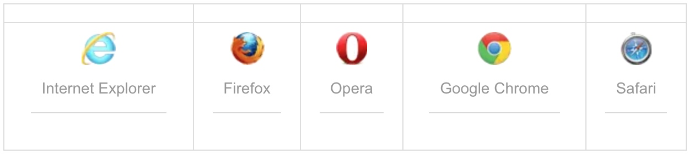

Internet Explorer 9+, Firefox, Opera, Chrome, 和 Safari 支持拖动。不过需要注意的是:Safari 5.1.2不支持拖动。

### 定义和用法

在拖放拖放过程中会触发以下事件：

* 在拖动目标上会触发事件（源元素）：

    * ondragstart - 用户开始拖动元素时触发
    * ondrag - 元素正在拖动时触发
    * ondragend - 用户完成元素拖动后触发

* 释放目标时触发的事件（目的地元素）

    * ondragenter - 当被鼠标拖动的对象进入其容器范围内时触发此事件
    * ondragover - 当被拖动的对象在另一容器范围内拖动时触发此事件
    * ondragleave - 当被拖动的对象离开其容器范围内时触发此事件
    * ondrop - 在一个拖动过程中，释放鼠标键时触发此事件


> **Tips：**
> 在实现拖放前必须要将元素的**draggable属性设置为true**；
> 不过**链接**和**图片**默认是可拖动的，**不需要** draggable 属性。


```html
<!DOCTYPE html>
<html>
	<head>
		<meta charset="UTF-8">
		<title>拖放</title>
		<!--<script src="js/jquery-3.3.1.min.js" ></script>-->
		<script>
			//ondragstart作用于被拖拽的元素，在将要开始拖拽时调用，需要准备拖拽的数据
			function startDrag(e){
				//此方法用来设置被拖拽的数据类型和值
				//通过setData方法，将被拖动元素的 id 设置成“Text”类型保存起来。
				e.dataTransfer.setData("Text", e.target.id);
			}
			
			//ondragover作用于目的地元素，当对象被拖动到容器内时触发，规定在何处放置被拖动的数据。
			function allowDrop(e){
				//默认情况下无法将数据/元素放置到其他元素中。
				//所以我们必须通过preventDefault()来阻止对元素的默认处理方式
				e.preventDefault();
			}
			//ondrop作用于目的地元素，当放置被拖动的数据时会调用ondrop
			function drop(e){
				e.preventDefault();
				//通过getData方法，将之前保存的“Text”类型的id取出来
				var targetId = e.dataTransfer.getData("Text");
				//根据id去查找到移动的元素后，将改元素添加到目标容器中
				e.target.appendChild(document.getElementById(targetId));
			}
		</script>
		<style type="text/css">
			#destinationDiv {
				position: absolute;
				width: 300px;
				height: 200px;
				border: 2px solid plum;
			}
			
			#sourceDiv {
				position: absolute;
				top: 220px;
				width: 300px;
				height: 200px;
				border: 2px solid plum;
			}
			#target {
				position: absolute;
			}
		</style>
	</head>
	<body>
		<div id="destinationDiv" ondrop="drop(event)" ondragover="allowDrop(event)"></div>
		<div id="sourceDiv" ondrop="drop(event)" ondragover="allowDrop(event)">
			
		</div>
	</body>
</html>
```
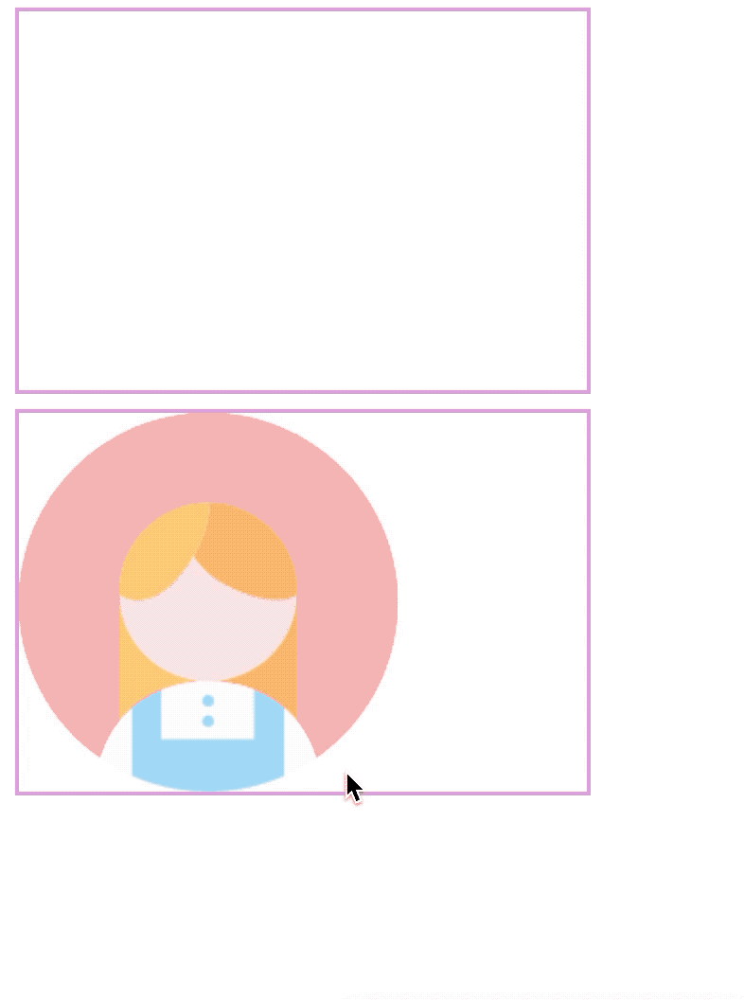


在以上代码中，涉及到了几个方法和属性：

**1、draggable 属性**

拖拽前需要将标签元素的draggable设置成true，否则不会有效果。

**2、DataTransfer对象** 

为Event对象的属性，用来传递拖拽对象的媒介，一般通过*Event.dataTransfer.setData( )设置拖拽对象的数据*；通过*Event.dataTransfer.getData( )取回设置的数据*；

该对象有以下属性：

* dropEffect ：设置或返回拖放目标上允许发生的拖放行为。如果此处设置的拖放行为不在effectAllowed属性设置的多种拖放行为之内，拖放操作将会失败。该属性值只允许为“null”、“copy”、“link”和“move”四值之一。

* effectAllowed ：设置或返回被拖动元素允许发生的拖动行为。该属性值可设为“none”、“copy”、“copyLink”、“copyMove”、“link”、“linkMove”、“move”、“all”和“uninitialized”。
 
* items ：该属性返回DataTransferItems对象，该对象代表了拖动数据。

* types ：该属性返回一个DOMStringList对象，该对象包括了存入dataTransfer中数据的所有类型。

该对象有以下方法：

* setData(format, data) ：将指定格式的数据赋值给dataTransfer对象，参数format定义数据的格式也就是数据的类型，data为待赋值的数据。

* getData(format) ：从dataTransfer对象中获取指定格式的数据，format代表数据格式，data为数据。

* clearData([format]) ：从dataTransfer对象中删除指定格式的数据，参数可选，若不给出，则为删除对象中所有的数据。

* addElement(element) ：添加自定义图标。

* setDragImage(element,x,y) ：设置拖放操作的自定义图标。其中element设置自定义图标，x设置图标与鼠标在水平方向上的距离，y设置图标与鼠标在垂直方向上的距离。

**3、Event.preventDefault() **

该方法用来避免浏览器对数据的默认处理（drop 事件的默认行为是以链接形式打开）。在ondragover中一定要执行preventDefault()，否则ondrop事件不会被触发。通过preventDefault() 来避免浏览器对数据的默认处理（drop 事件的默认行为是以链接形式打开）。


### 总结

元素拖放流程：

1、设置被拖动的元素为可拖动（draggable）

    作用目标：被拖动元素
    属性：draggable

2、在开始拖拽时，设置被拖动元素的数据类型和值

    作用目标：被拖动元素
    事件：ondragstart
    方法：Event.dataTransfer.setData()

3、当对象被拖动到目的容器内时，需要设置在何处放置被拖动的数据（阻止对元素的默认处理方式）

    作用目标：目的地容器
    事件：ondragover
    方法：preventDefault() 

4、当放置被拖动的数据时，通过传递的id找到被拖动元素，然后放进目的地容器

    作用目标：目的地容器
    事件：ondrop
    方法：preventDefault() 、Event.dataTransfer.getData()


## Canvas

### 初识Canvas

 HTML5中的 `<canvas>` 元素用于图形的绘制，通常通过JavaScript脚本来完成徒刑的绘制工作。
`<canvas> `标签本身并没有绘制能力，它只是图形容器，用来定义图形，比如图表和其他图像等，我们需要使用脚本来绘制图形。Canvas就像一个画布，我们可以在画布上画一个红色矩形，渐变矩形，彩色矩形，和一些彩色的文字，可以通过多种方法使用Canva绘制路径、盒、圆、字符以及添加图像。

### 使用

**1、创建画布**

一个画布在网页中功能是一个矩形框，通过`<canvas>`元素来绘制，需要之一的是，默认情况下`<canvas>`元素是没有内容和边框的，我们需要为它添加边框等。如下：

```html
<!DOCTYPE html>
<html>
	<head>
		<meta charset="utf-8"/>
		<title>Canvas</title>
		
	</head>
	<body>
		<canvas id="can" width="400" height="400" style="border: 2px solid plum;"></canvas>
	</body>
</html>
```

**2、绘制图像**

由于canvas本身不具备绘制功能，所以我们需要通过JavaScript脚本来绘制，通过以下3个步骤：

    a、查找canvas对象；
    b、创建context对象，它拥有多种绘制路径、矩形、圆形、字符以及添加图像的方法；
    c、绘制图形。

如下示例：


```html
<!DOCTYPE html>
<html>
	<head>
		<meta charset="utf-8"/>
		<title>Canvas</title>
		<script src="https://ajax.aspnetcdn.com/ajax/jQuery/jquery-3.3.1.js"></script>
		<script>
			$(window).on("load", function() {
				$("#btn").click(function() {
					//1、查找canvas画布
					var can = $("#can");
					//2、创建context对象(绘制环境对象），该对象拥有多种绘制功能
					//如：绘制路径、矩形、圆形、字符以及添加图像等功能
					var ctx = can[0].getContext("2d");
					//3、绘制图形
					ctx.fillStyle = "plum";
					ctx.fillRect(20,35,300,20)
				});
			});
		</script>
	</head>
	<body>
		<canvas id="can" width="400" height="400" style="border: 2px solid plum;"></canvas>
		<div><button id="btn">绘制图形</button></div>
	</body>
</html>
```

效果如下图：

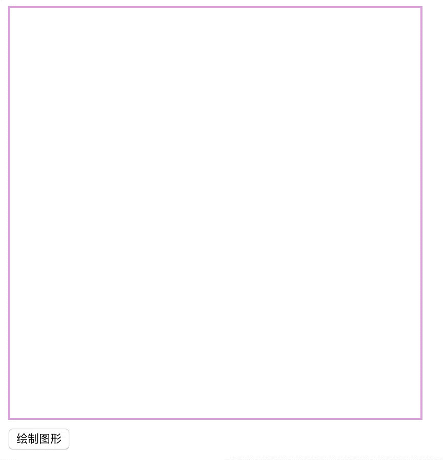


在以上示例中：

*fillStyle* ：该属性的值可以是CSS颜色，渐变，或图案。fillStyle 默认设置是 #000000（黑色）。
*fillRect(x,y,width,height)* 方法：定义了矩形当前的填充方式。

#### Canvas坐标

Canvas是一个二维网格系统，由坐标和宽高构成，画布**左上角坐标为参照原点，即（0,0）**。fillRect(20,35,300,20)意思是：从画布坐标点（20，35）开始绘制，在画布上绘制 300x20 的矩形。

#### 绘制不同形状

##### 1、线

在Canvas上画线，我们需要通过以下几个步骤：

	a、moveTo(x,y) 定义线条开始坐标；
	b、lineTo(x,y) 定义线条结束坐标；
	c、stroke()绘制。

如下：


```html
<!DOCTYPE html>
<html>
	<head>
		<meta charset="utf-8"/>
		<title>Canvas</title>
		<script src="https://ajax.aspnetcdn.com/ajax/jQuery/jquery-3.3.1.js"></script>
		<script>
			$(window).on("load", function() {
				$("#btn").click(function() {
					//1、查找canvas画布
					var can = $("#can");
					//2、创建context对象(绘制环境对象），该对象拥有多种绘制功能
					//如：绘制路径、矩形、圆形、字符以及添加图像等功能
					var ctx = can[0].getContext("2d");
					//3、绘制图形
					ctx.moveTo(100, 100);
					ctx.lineTo(200, 200);
					ctx.stroke();
				});
			});
		</script>
	</head>
	<body>
		<canvas id="can" width="400" height="400" style="border: 2px solid plum;"></canvas>
		<div><button id="btn">绘制图形</button></div>
	</body>
</html>
```

效果如下图：

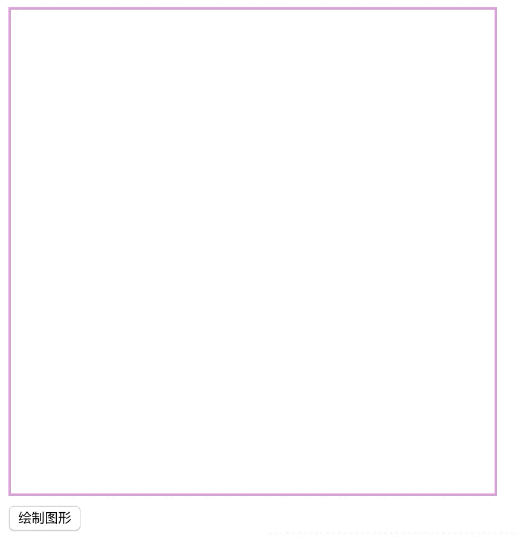


##### 2、圆弧

在canvas中绘制圆弧, 我们将通过以下几个步骤:

	a、beginPath()开始路径；
	
	b、设置绘制参数arc(x,y,radius,startAngle,stopAngle,counterclockwise)，其中
	
		x,y：为圆心坐标;
		radius：为半径;
		startAngle：为起始角度;
		stopAngle：为结束角度;
		counterclockwise：可选的，规定逆时针还是顺时针绘图。false = 顺时针，true = 逆时针。
		
	c、stroke()绘制。

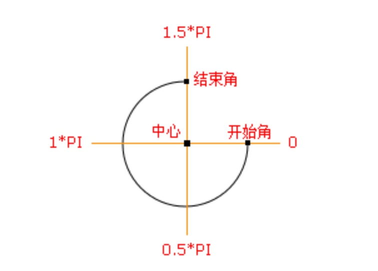

如下示例：


```html
<!DOCTYPE html>
<html>
	<head>
		<meta charset="utf-8"/>
		<title>Canvas</title>
		<script src="https://ajax.aspnetcdn.com/ajax/jQuery/jquery-3.3.1.js"></script>
		<script>
			$(window).on("load", function() {
				$("#btn").click(function() {
					//1、查找canvas画布
					var can = $("#can");
					//2、创建context对象(绘制环境对象），该对象拥有多种绘制功能
					//如：绘制路径、矩形、圆形、字符以及添加图像等功能
					var ctx = can[0].getContext("2d");
					//3、绘制图形
					ctx.beginPath();
					ctx.arc(200, 200, 100, 0, 1.5*Math.PI, false);
					ctx.stroke()
				});
			});
		</script>
	</head>
	<body>
		<canvas id="can" width="400" height="400" style="border: 2px solid plum;"></canvas>
		<div><button id="btn">绘制图形</button></div>
	</body>
</html>
```

效果如下图：

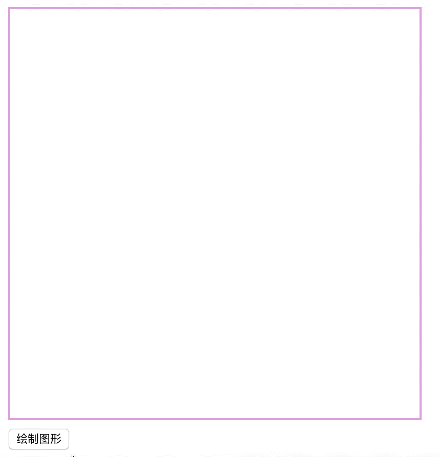


##### 3、文本

使用Canvas绘制文本，步骤如下：

		a、font - 定义字体
		b、fillText(text,x,y,maxWidth) - 在 canvas 上绘制实心的文本
		   strokeText(text,x,y,maxWidth) - 在 canvas 上绘制空心的文本
		其中参数如下：

			text：为要绘制的文本；
			x,y：文本的坐标
			maxWidth：可选的，为允许的最大文本宽度，以像素计。

如下示例：

```html
<!DOCTYPE html>
<html>
	<head>
		<meta charset="utf-8"/>
		<title>Canvas</title>
		<script src="https://ajax.aspnetcdn.com/ajax/jQuery/jquery-3.3.1.js"></script>
		<script>
			$(window).on("load", function() {
				$("#btn").click(function() {
					//1、查找canvas画布
					var can = $("#can");
					//2、创建context对象(绘制环境对象），该对象拥有多种绘制功能
					//如：绘制路径、矩形、圆形、字符以及添加图像等功能
					var ctx = can[0].getContext("2d");
					//3、绘制图形
					ctx.font = "30px Arial";
					ctx.fillText("绘制的文本", 200, 200);
					ctx.strokeText("空心的文本", 200, 250);
					ctx.stroke()
				});
			});
		</script>
	</head>
	<body>
		<canvas id="can" width="400" height="400" style="border: 2px solid plum;"></canvas>
		<div><button id="btn">绘制图形</button></div>
	</body>
</html>
```

效果如下图：

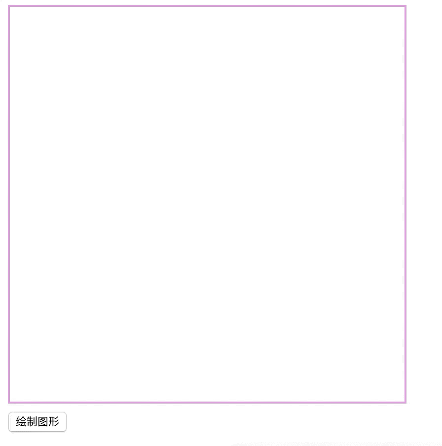


##### 4、渐变对象

Canvas中的渐变对象可以用来填充矩形, 圆形, 线条, 文本等各种形状，我们可以自己定义不同的颜色。以下有两种不同的方式来设置Canvas渐变：

* createLinearGradient(x,y,x1,y1) - 创建线条渐变对象
其中的参数：

    * x,y为渐变开始的坐标
    * x1,y1为渐变结束的坐标

> **Tips：**
> 当x、x1相等时，可以设置上下方向的渐变；当y、y1相等时，可以设置左右方向的渐变

* createRadialGradient(x,y,r,x1,y1,r1) - 创建一个放射状或圆形渐变对象
		其中的参数：

    * x,y为渐变开始的圆心点坐标
    * r为渐变开始时的圆半径
    * x1,y1为渐变结束圆心点的坐标
    * r1为渐变结束时的圆半径

放射状渐变原理如下图：

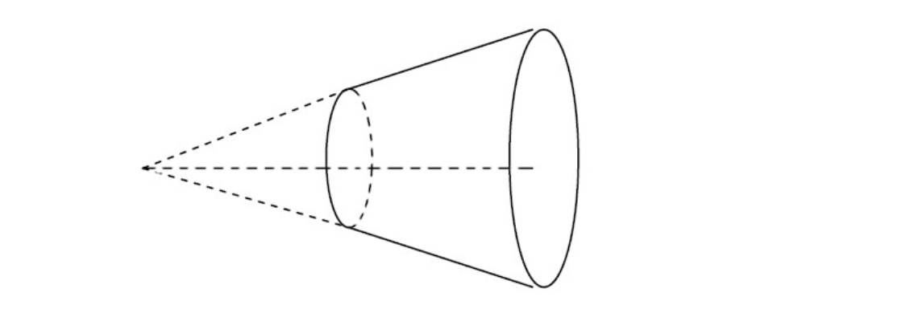


当我们在使用渐变对象，必须使用**两种或两种以上的停止颜色**。通过addColorStop()方法指定颜色停止，参数使用坐标来描述，可以是0至1。
在使用渐变填充时，还需要设置fillStyle或strokeStyle的值为渐变，然后再绘制形状，如矩形，文本，或一条线。

###### 渐变填充线：

```html
<!DOCTYPE html>
<html>
	<head>
		<meta charset="utf-8"/>
		<title>Canvas</title>
		<script src="https://ajax.aspnetcdn.com/ajax/jQuery/jquery-3.3.1.js"></script>
		<script>
			$(window).on("load", function() {
				$("#btn").click(function() {
					//1、查找canvas画布
					var can = $("#can");
					//2、创建context对象(绘制环境对象），该对象拥有多种绘制功能
					//如：绘制路径、矩形、圆形、字符以及添加图像等功能
					var ctx = can[0].getContext("2d");
					//3、创建渐变对象
					var grd = ctx.createLinearGradient(0, 0, 100, 100);
					//var grd = ctx.createRadialGradient(10, 10, 20, 300, 200, 50);
					grd.addColorStop(0, "red");
					grd.addColorStop(1, "green");
					ctx.strokeStyle = grd;
					ctx.moveTo(50, 50);
					ctx.lineTo(350, 250);
					ctx.stroke()
				});
			});
		</script>
	</head>
	<body>
		<canvas id="can" width="400" height="400" style="border: 2px solid plum;"></canvas>
		<div><button id="btn">绘制图形</button></div>
	</body>
</html>
```

效果如下图：

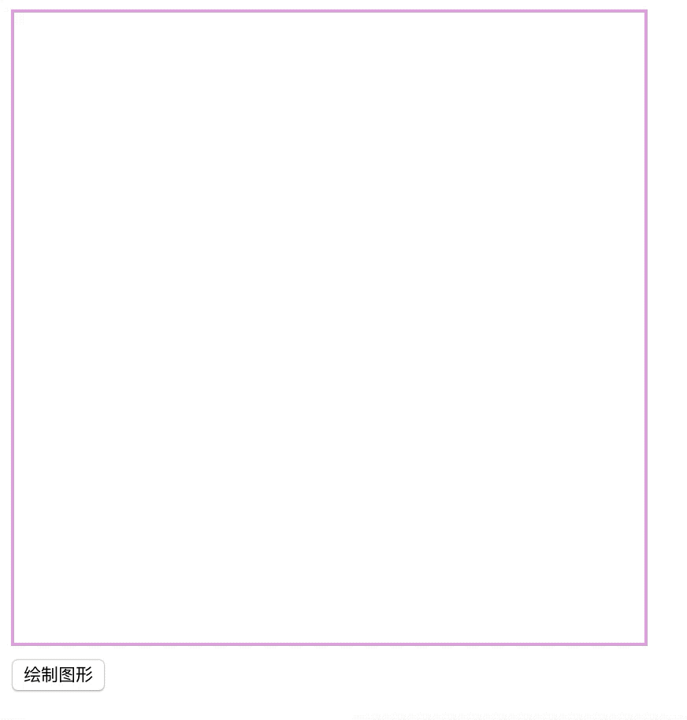


###### 渐变填充矩形：


```html
<!DOCTYPE html>
<html>
	<head>
		<meta charset="utf-8"/>
		<title>Canvas</title>
		<script src="https://ajax.aspnetcdn.com/ajax/jQuery/jquery-3.3.1.js"></script>
		<script>
			$(window).on("load", function() {
				$("#btn").click(function() {
					//1、查找canvas画布
					var can = $("#can");
					//2、创建context对象(绘制环境对象），该对象拥有多种绘制功能
					//如：绘制路径、矩形、圆形、字符以及添加图像等功能
					var ctx = can[0].getContext("2d");
					//3、创建渐变对象
					var grd = ctx.createLinearGradient(0, 0, 100, 100);
					grd.addColorStop(0, "red");
					grd.addColorStop(1, "green");
					ctx.strokeStyle = grd;
					ctx.strokeRect(50, 50, 150, 150);
				});
			});
		</script>
	</head>
	<body>
		<canvas id="can" width="400" height="400" style="border: 2px solid plum;"></canvas>
		<div><button id="btn">绘制图形</button></div>
	</body>
</html>
```

效果如下图：

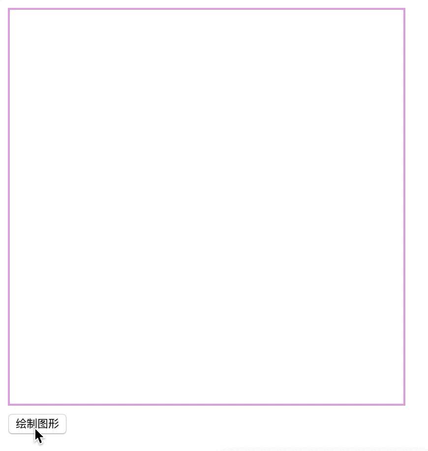


###### 渐变填充文字


```html
<!DOCTYPE html>
<html>
	<head>
		<meta charset="utf-8"/>
		<title>Canvas</title>
		<script src="https://ajax.aspnetcdn.com/ajax/jQuery/jquery-3.3.1.js"></script>
		<script>
			$(window).on("load", function() {
				$("#btn").click(function() {
					//1、查找canvas画布
					var can = $("#can");
					//2、创建context对象(绘制环境对象），该对象拥有多种绘制功能
					//如：绘制路径、矩形、圆形、字符以及添加图像等功能
					var ctx = can[0].getContext("2d");
					//3、创建渐变对象
					var grd = ctx.createLinearGradient(0, 0, 200, 0);
					grd.addColorStop(0, "green");
					grd.addColorStop(1, "plum");
					ctx.fillStyle = grd;
					ctx.strokeStyle = grd;
					ctx.font = "40px Arial";
					ctx.fillText("绘制的文字", 100, 150);
					ctx.strokeText("空心的文字", 100, 200);
					ctx.stroke();
				});
			});
		</script>
	</head>
	<body>
		<canvas id="can" width="400" height="400" style="border: 2px solid plum;"></canvas>
		<div><button id="btn">绘制图形</button></div>
	</body>
</html>
```

效果如下：

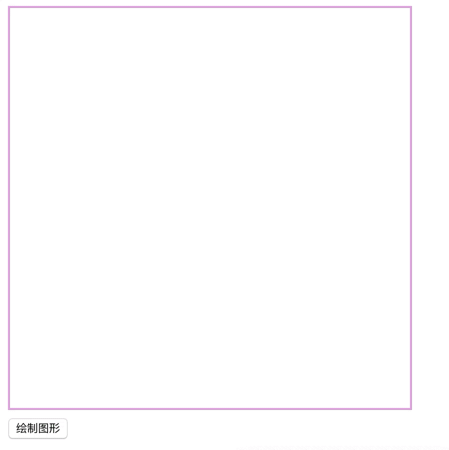


###### 渐变填充圆弧

```html
<!DOCTYPE html>
<html>
	<head>
		<meta charset="utf-8"/>
		<title>Canvas</title>
		<script src="https://ajax.aspnetcdn.com/ajax/jQuery/jquery-3.3.1.js"></script>
		<script>
			$(window).on("load", function() {
				$("#btn").click(function() {
					//1、查找canvas画布
					var can = $("#can");
					//2、创建context对象(绘制环境对象），该对象拥有多种绘制功能
					//如：绘制路径、矩形、圆形、字符以及添加图像等功能
					var ctx = can[0].getContext("2d");
					//3、创建渐变对象
					var grd = ctx.createLinearGradient(0, 0, 200, 0);
					grd.addColorStop(0, "green");
					grd.addColorStop(1, "plum");
					ctx.strokeStyle = grd;
					ctx.beginPath();
					ctx.arc(200, 200, 100, 0, 1.5*Math.PI, false);
					ctx.stroke();
				});
			});
		</script>
	</head>
	<body>
		<canvas id="can" width="400" height="400" style="border: 2px solid plum;"></canvas>
		<div><button id="btn">绘制图形</button></div>
	</body>
</html>
```

效果如下图：

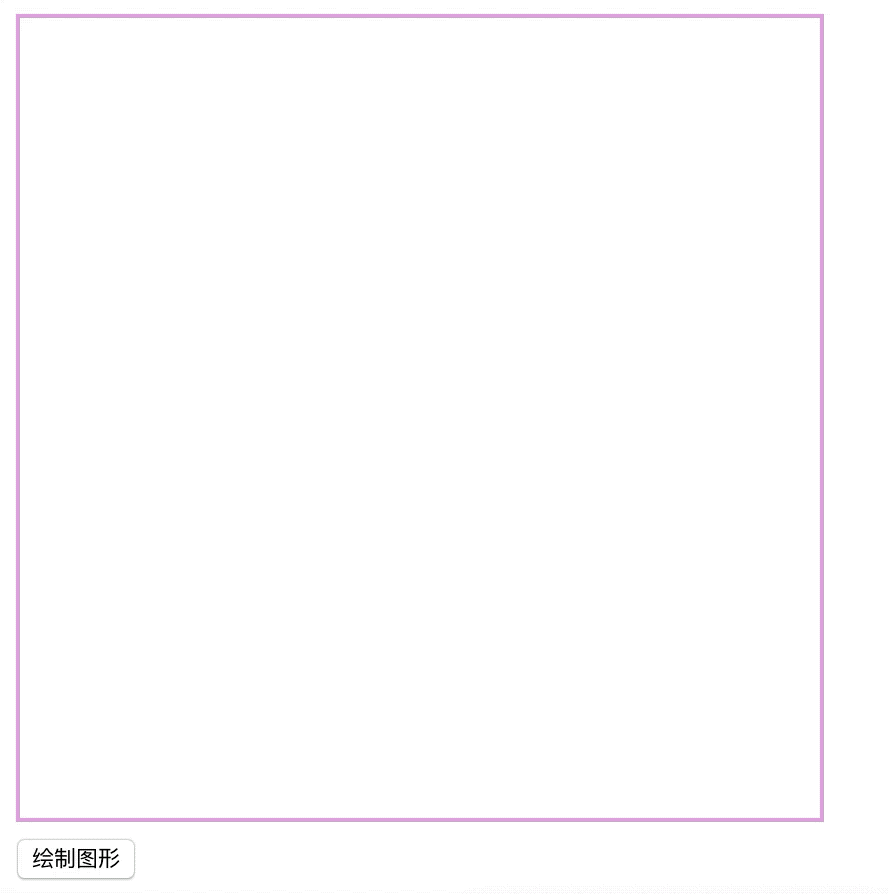


##### 5、图像

通过Canvas展示图片，可以使用以下方法：

a、drawImage(img,sx,sy,swidth,sheight,x,y,width,height)

参数如下：

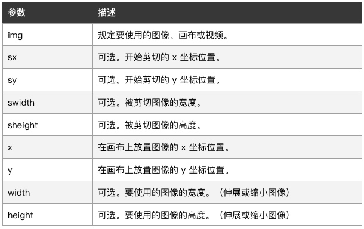

此方法还能够绘制图像的某些部分，或者增加或减少图像的尺寸，也能够绘制视频。


```html
<!DOCTYPE html>
<html>
	<head>
		<meta charset="utf-8"/>
		<title>Canvas</title>
		<script src="https://ajax.aspnetcdn.com/ajax/jQuery/jquery-3.3.1.js"></script>
		<script>
			$(window).on("load", function() {
				$("#btn").click(function() {
					//1、查找canvas画布
					var can = $("#can");
					//2、创建context对象(绘制环境对象），该对象拥有多种绘制功能
					//如：绘制路径、矩形、圆形、字符以及添加图像等功能
					var ctx = can[0].getContext("2d");
					//3、获取img元素
					var img = $("#img");
					//通过img元素绘制，在画布上图像的坐标（50，50）
					ctx.drawImage(img[0], 50, 50)
				});
			});
		</script>
	</head>
	<body>
		
		<canvas id="can" width="400" height="400" style="border: 2px solid plum;"></canvas>
		<div><button id="btn">绘制图形</button></div>
	</body>
</html>
```
效果如下图：

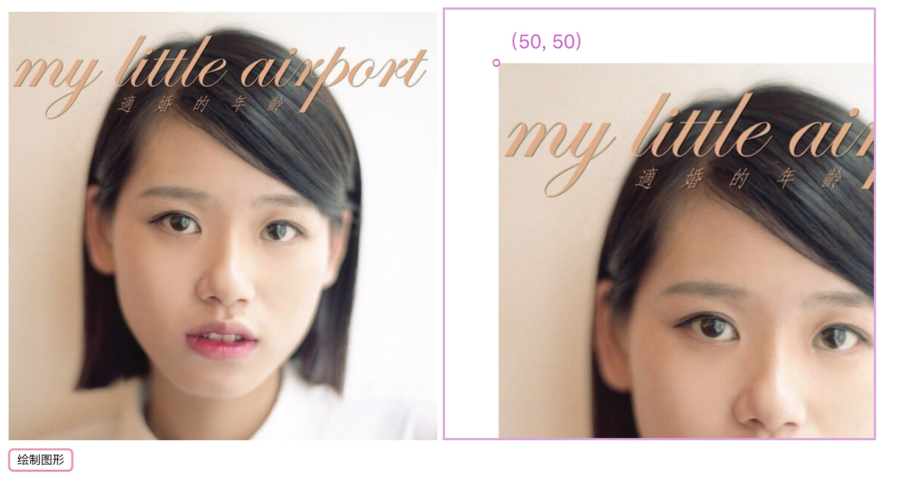


我们也可以绘制时设置绘制的图片宽高，可以给drawImage函数传入宽高值，如下：
			
```javascript
ctx.drawImage(img[0], 50, 50, 300,300);
```
效果如下图：

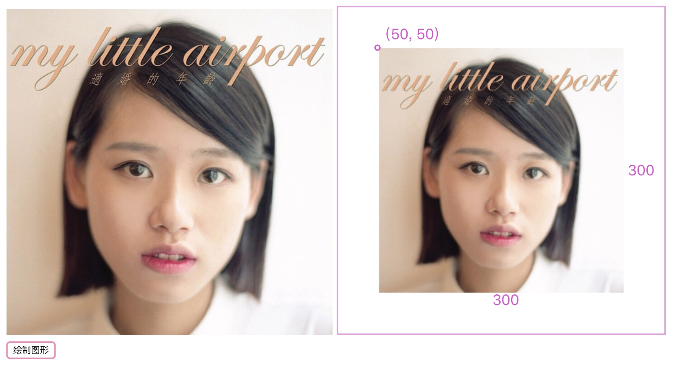

我们还可以剪切图像，并在画布上定位被剪切的部分，如下：

		
```javascript
ctx.drawImage(img[0], 70, 100, 200, 150, 100, 200, 200, 150);
//通过img元素绘制
//从（70，100）开始剪切
//被剪切图像的宽高为200，150
//在画布上图像的坐标（100，200）
//要在画布上显示的图像的宽高200，150，会对图像按照宽高进行缩放。
```
效果如下图：

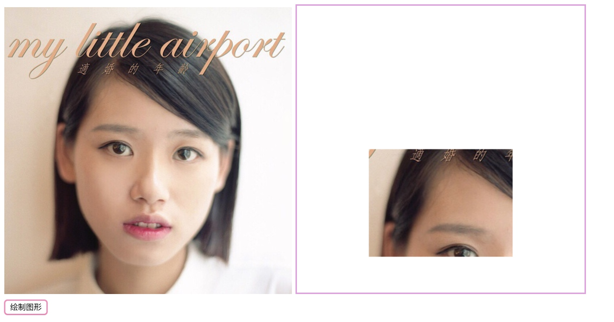


##### 6、视频

```html
<!DOCTYPE html>
<html>
	<head>
		<meta charset="UTF-8">
		<title></title>
		<script type="text/javascript" src="http://libs.baidu.com/jquery/2.1.1/jquery.min.js" ></script>
		<script>
			$(window).load(function(){
				//1、查找canvas画布
				var vid = $('#myVideo');
				var can = $('#myCanvas');
				var ctx = can[0].getContext("2d");
				var i;
//				vid[0].addEventListener('play', function(){
//					i = setInterval(function(){
//						ctx.drawImage(vid[0],0,0,600,300);
//					},20);//（每 20 毫秒，代码就会绘制视频的当前帧）
//				}, false);
				
				vid[0].addEventListener('timeupdate', function(){
					i = setInterval(function(){
						ctx.drawImage(vid[0],0,0,600,300);
					},20);//（每 20 毫秒，代码就会绘制视频的当前帧）
				}, false);
//				vid[0].addEventListener('pause', function(){
//					clearInterval(i);
//				}, false);
//				vid[0].addEventListener('ended', function(){
//					clearInterval(i);
//				}, false);
			});
		</script>
	</head>
	<body>
		<video id="myVideo"  width="600" height="300" controls autoplay style="border: 4px solid powderblue;" style="float: left;">
			<source src="video/BIGBANG - BAE BAE MV.mp4" type="audio/mp4"></source>
		</video>
		<canvas id="myCanvas" width="600" height="300" style="border: 4px solid plum;" style="float: left;"></canvas>
	</body>
</html>
```


效果如下：

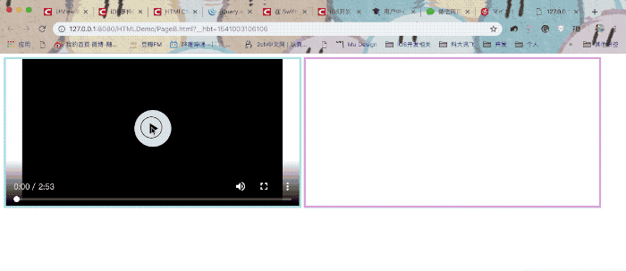


