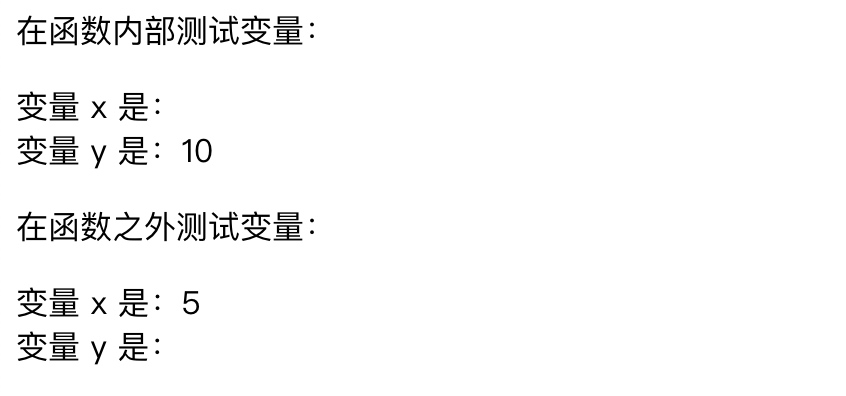
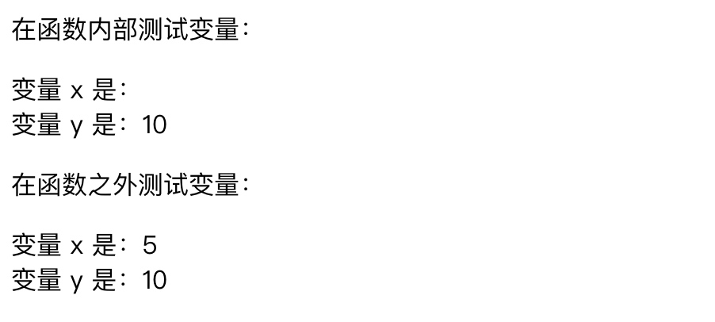

# PHP面向对象


## PHP回顾

PHP 是一种创建动态交互性站点的强有力的服务器端脚本语言，在服务器上执行的。

	•	PHP 是 "PHP Hypertext Preprocessor" 的首字母缩略词
	•	PHP 是一种被广泛使用的开源脚本语言
	•	PHP 脚本在服务器上执行
	•	PHP 没有成本，可供免费下载和使用

> 通过PHP我们可以：

> 	PHP 能够生成动态页面内容
> 	PHP 能够创建、打开、读取、写入、删除以及关闭服务器上的文件
> PHP 能够接收表单数据
> 	PHP 能够发送并取回 cookies
> 	PHP 能够添加、删除、修改数据库中的数据
> 	PHP 能够限制用户访问网站中的某些页面
> 	PHP 能够对数据进行加密
 
## 基本语法
### 常规使用

PHP 脚本可放置于文档中的任何位置，PHP 脚本以 `<?php` 开头，以 `?>` 结尾，PHP 文件的默认文件扩展名是 “.php”，PHP 文件通常包含 HTML 标签以及一些 PHP 脚本代码。如下：

```html
<!DOCTYPE html>
<html>
<head>
	<title>PHP 文件</title>
</head>
	<?php 
		echo "Hello PHP!";
	?>
</html>
```

PHP 语句以分号结尾（;）。PHP 代码块的关闭标签也会自动表明分号（因此在 PHP 代码块的最后一行不必使用分号）。
	
### 注释
	// 单行注释
	
	# 单行注释
	
	/*
	 多行注释块
	 横跨了
	 多行
	 */

### 常用语法

#### 输出
对于文本在浏览器上的输出，我们可以通过两个指令：echo 和 print。
				
```php
<?php
echo "Hello PHP!";
print "Hello PHP!";
?>
```
#### 变量
##### 变量声明
PHP是一门弱类型语言，所以在声明变量是可以不必告知变量的数据类型，PHP会根据它的值，自动把变量转换为正确的数据类型，与JavaScript类似。

*PHP 变量规则如下*：

* 变量以 `$` 符号开头，其后是变量的名称;
* 变量名称必须以字母或下划线开头;
* 变量名称不能以数字开头;
* 变量名称只能包含字母数字字符和下划线（A-z、0-9 以及 _）;
* 变量名称对大小写敏感（$y 与 $Y 是两个不同的变量）;


例如：

```php
<?php
$txt="Hello world!";
$x=5;
$y=10.5;
?>
```


#### 作用域
在 PHP 中，可以在脚本的任意位置对变量进行声明。变量的作用域指的是变量能够被引用/使用的那部分脚本。PHP 有三种不同的变量作用域：

	•	local（局部）
	•	global（全局）
	•	static（静态）

a、**函数之外**声明的变量拥有** global 作用域**，只能在**函数以外进行访问**。


```php
<?php
$num1 = 7; 
$num2 = 2;

function getSum() {
	return $num1 + $num2;
}
echo getSum();
?>
```

以上代码中，因为num1和num2是global变量，所以在函数内访问不了，结果为：0.
如果我们需要在函数内访问全局变量，则需要通过$GLOBALS来获取：

```php
<?php
$num1 = 7; 
$num2 = 2;

function getSum() {
	return $GLOBALS["num1"] + $GLOBALS["num2"];
}
echo getSum();
?>
```
所以从以上的代码可以看出，我们可以通过$GLOBALS数组来获取全局的变量。

##### global 与$GLOBALS

我们也可以通过global来获取全局变量：

```php
<?php
$num1 = 7; 
$num2 = 2;

function getSum() {
	global $num1, $num2;
	return $num1 + $num2;
}
echo getSum();
?>
```

再来看另外一个例子：

```php
<?php
$num1 = 7; 
$num2 = 2;

function getSum() {
	global $num1, $num2;
	return $num1 + $num2;
}

function getDifference() {
	return $num1 - $num2;
}
echo getSum() . "<br />";
echo getDifference();
?>
//结果为：
//        9
//        0
```
从以上代码可以看出global的作用并不是将变量的作用域为全局的，而是告诉解析器被global声明的变量并不是局部变量，该变量将会引用全局的同名变量。如果没有使用global关键字，那么仅仅只是在使用局部变量而已。

b、**函数内部**声明的变量拥有 **local 作用域**，只能在函数**内部进行访问**。

```html
<!DOCTYPE html>
<html>
<body>

<?php
$x=5; // global scope
  
function myTest() {
   $y=10; // local scope
   echo "<p>在函数内部测试变量：</p>";
   echo "变量 x 是：$x";
   echo "<br>";
   echo "变量 y 是：$y";
} 

myTest();

echo "<p>在函数之外测试变量：</p>";
echo "变量 x 是：$x";
echo "<br>";
echo "变量 y 是：$y";
?>

</body>
</html>
```

结果如下图：




以上例子当中，有两个变量 `$x` 和 `$y`，以及一个函数 myTest()。`$x`是在函数之外声明的，是全局变量；而 `$y` 是局部变量，因为它是在函数内声明的。
如果我们在 myTest() 函数内部输出两个变量的值，`$y` 会输出在本地声明的值，但是无法 `$x` 的值，因为它在函数之外创建。如果在 myTest() 函数之外输出两个变量的值，那么会输出 `$x` 的值，但是不会输出 `$y` 的值，因为它是局部变量，并且在 myTest() 内部创建。我们可以通过global关键或者`$GLOBALS`数组在函数内部访问全局变量。

相反，如果我们想要在函数外访问函数內声明的局部变量，要如何做？同样也可以使用global关键字声明，如下：


```html
<html>
<body>

<?php
$x=5; // global scope
  
function myTest() {
   global $y; // local scope
   $y = 10;
   echo "<p>在函数内部测试变量：</p>";
   echo "变量 x 是：$x";
   echo "<br>";
   echo "变量 y 是：$y";
} 

myTest();

echo "<p>在函数之外测试变量：</p>";
echo "变量 x 是：$x";
echo "<br>";
echo "变量 y 是：$y";
?>

</body>
</html>
```
结果如下：




c、一个函数**执行完成**时，它的**所有变量通常都会被删除**。如果我们想要某个局部变量**不被删除**，则可以在第一次声明变量时使用 **static** 关键字。

> **注意：**
> 此外，我们也可以通过static 关键字去定义静态方法和属性，声明的属性或方法为静态，就可以不实例化类而直接通过类名就可以访问，所以静态属性不能通过一个类已实例化的对象来访问，但静态方法可以。


### 数据类型
PHP中有几种数据类型：
String（字符串）, 
Integer（整型）, 
Float（浮点型）, 
Boolean（布尔型）, 
Array（数组）, 
Object（对象）, 
NULL（空值）。


**a、String（字符串）**

字符串可以是引号内的任何文本，我们可以使用单引号或双引号来表示都行，如下：

			"Hello PHP!" 或 'Hello PHP!'

**b、Integer（整型）**

整型是没有小数的数字，整数规则如下：

	•	整数必须有至少一个数字（0-9）
	•	整数不能包含逗号或空格
	•	整数不能有小数点
	•	整数正负均可
	•	可以用三种格式规定整数：十进制、十六进制（前缀是 0x）或八进制（前缀是 0）

如下：

```php
<?php 
	$x = 5985;
	$x = -345; // 负数
	$x = 0x8C; // 十六进制数
	$x = 047; // 八进制数
?>
```

**c、Float（浮点型）**

浮点数是有小数点或指数形式的数字，如下：


```php
<?php 
	$x = 10.365;
	$x = 2.4e3; 
	$x = 8E-5;
?>
```

**d、Boolean（布尔类型）**

        true或false


**e、Array（数组类型）**

用于存储一个以上的值，数组可分为索引数组和关联数组，**索引数组如下**：

```php
$num = array("1","2","3");

$num = ["1","2","3"];

$num = array(); 
$num[0] = "1"; 
$num[1] = "2"; 
$num[2] = "3";
```


**关联数组如下：**


```php
$num = array("1"=>"first","2"=>"second","3"=>"third");

$num = ["1"=>"first","2"=>"second","3"=>"third"];

$num = array(); 
$num["1"] = "first"; 
$num["2"] = "second"; 
$num["3"] = "third";
```


**f、Object（对象类型）**
        
对象是存储数据和有关如何处理数据的信息的数据类型。在声明对象之前我们需要先通过 class 关键词声明对象的类，然后通过new关键字初始化对象，如下，$stu即为我们创建的对象：

class Student{
		
}
$stu = new Student();

    
g、NULL类型

NULL 值表示变量无值，NULL 数据类型 的值也是NULL。通常也用于区分空字符串与空值数据库，我们可以通过把值设置为 NULL，将变量清空。

### PHP面向对象

在面向对象的程序设计（英语：Object-oriented programming，缩写：OOP）中，对象是一个由信息及对信息进行处理的描述所组成的整体，是对现实世界的抽象。在现实世界里我们所面对的事情都是对象，如计算机、电视机、自行车等。

#### 面向对象相关术语

```
类 ： 定义了一件事物的抽象特点。类的定义包含了数据的形式以及对数据的操作。
对象 ： 是类的实例。
成员变量 ： 定义在类内部的变量。该变量的值对外是不可见的，但是可以通过成员函数访问，在类被实例化为对象后，该变量即可称为对象的属性。
成员函数 ： 定义在类的内部，可用于访问对象的数据。
继承 ： 继承性是子类自动共享父类数据结构和方法的机制，这是类之间的一种关系。在定义和实现一个类的时候，可以在一个已经存在的类的基础之上来进行，把这个已经存在的类所定义的内容作为自己的内容，并加入若干新的内容。
父类 ： 一个类被其他类继承，可将该类称为父类，或基类，或超类。
子类 ： 一个类继承其他类称为子类，也可称为派生类。
多态 ： 多态性是指相同的函数或方法可作用于多种类型的对象上并获得不同的结果。不同的对象，收到同一消息可以产生不同的结果，这种现象称为多态性。
重载 ： 简单说，就是函数或者方法有同样的名称，但是参数列表不相同的情形，这样的同名不同参数的函数或者方法之间，互相称之为重载函数或者方法。
抽象性 ： 抽象性是指将具有一致的数据结构（属性）和行为（操作）的对象抽象成类。一个类就是这样一种抽象，它反映了与应用有关的重要性质，而忽略其他一些无关内容。任何类的划分都是主观的，但必须与具体的应用有关。
封装 ： 封装是指将现实世界中存在的某个客体的属性与行为绑定在一起，并放置在一个逻辑单元内。
构造函数 ： 主要用来在创建对象时初始化对象， 即为对象成员变量赋初始值，总与new运算符一起使用在创建对象的语句中。
析构函数 ：析构函数(destructor) 与构造函数相反，当对象结束其生命周期时（例如对象所在的函数已调用完毕），系统自动执行析构函数。析构函数往往用来做"清理善后" 的工作（例如在建立对象时用new开辟了一片内存空间，应在退出前在析构函数中用delete释放）。
```



#### 类的定义
    
每个类的定义都以关键字 class 开头，后面跟着类名、之后跟着一对花括号，里面包含有类的属性与方法的定义，类名可以是任何非 PHP 保留字的合法标签，一个合法类名以字母或下划线开头，后面跟着若干字母，数字或下划线，如下：


```php
<?php
class Student{
		
		var $stuNo = "1001";
		var $stuName = "Elizabeth";
		var $courses = array();
		
		function showMessage() {
			
			$this->courses[0] = "English";
			echo $this->courses[0];
		}
	}
	
	$stu = new Student();
	$stu->showMessage();
?>
```

以上代码中：

a、类使用 class 关键字后加上类名定义。

b、类名后的一对大括号{ }内可以定义变量和方法。

c、类的变量使用 var声明，或者省略var 使用访问权限修饰符 （public、protected、private）来声明, 变量也可以初始化值。

d、函数定义类似 PHP 函数的定义，但函数只能通过该类及其实例化的对象访问。

e、类创建后则可以通过 new 运算符来实例化该类的对象。

f、在类内部，非静态成员使用 "$this->成员名"的方式访问，静态成员使用 "self::成员名" 的方式进行访问。

##### 访问控制


##### 构造函数

构造函数 `__construct( )`，是一种特殊的方法。主要用来在创建对象时初始化对象， 即为对象成员变量赋初始值，总与new运算符一起使用在创建对象的语句中。我们可以为以上代码示例创建构造函数，如下：

```php
class Student{
		
	var $stuNo = "1001";
	var $stuName = "Elizabeth";
	var $courses = array();
		
	function __construct($sno,$sname,$scourse) {
			
		$this->stuNo = $sno;
		$this->stuName = $sname;
		$this->courses = $scourse;
	}
}
$courses = array("Computer");
$stu = new Student("1002","Eddy",$courses);
echo "Name:" . $stu->stuName . "<br />";
```

##### 析构函数

析构函数`__destruct( )` 与构造函数相反，当对象结束其生命周期时（例如对象所在的函数已调用完毕），系统自动执行析构函数，如下：


```php
class Student{
		
	var $stuNo = "1001";
	var $stuName = "Elizabeth";
	var $courses = array();
		
	function __construct($sno,$sname,$scourse) {
			
		$this->stuNo = $sno;
		$this->stuName = $sname;
		$this->courses = $scourse;
	}
	function __destruct(){
			
		echo "销毁...$this->stuName";
	}
}
$courses = array("Computer");
$stu = new Student("1002","Eddy",$courses);
echo "Name:" . $stu->stuName . "<br />";
```


