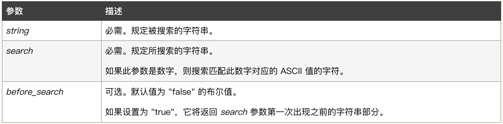
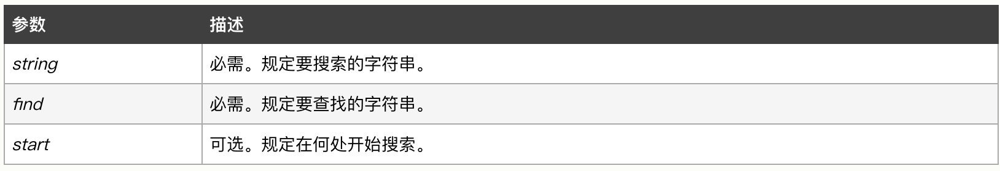
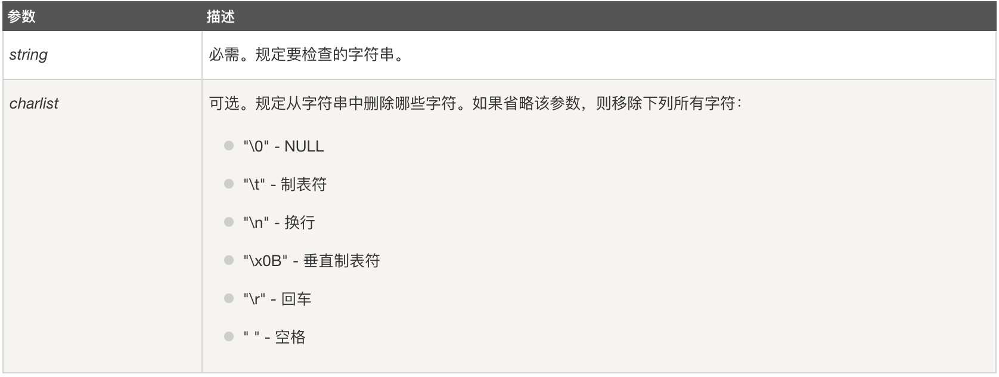
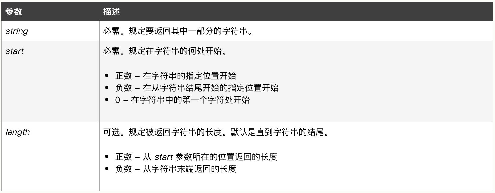
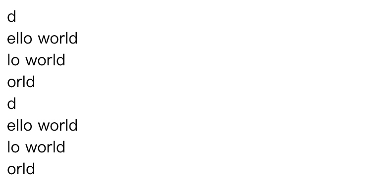
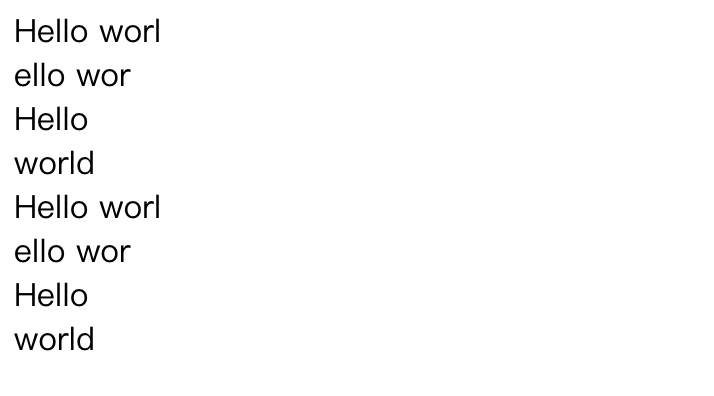
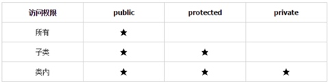

# PHP面向对象

## PHP基础

### 字符串用法

#### 字符串长度（strlen）

在使用字符串过程中，很多时候需要获取字符串的长度，在PHP中可以使用strlen方法来获取，如下：

```php
<?php
$str = "Hello";
echo strlen($str);
//输出： 5
?>
```
#### 查找子字符串

1、strstr()
strstr() 函数搜索字符串在另一字符串中的第一次出现，对大小写敏感（如需进行不区分大小写的搜索，请使用 `stristr() `函数）。
函数原型：

```php
strstr(string,search,before_search)
```
参数说明


> **Tips：**
> 返回字符串的剩余部分（从匹配点）。如果未找到所搜索的字符串，则返回 FALSE。


```php
<?php
$str = "Hello World!";
echo strstr($str, "or") . "<br />";
var_dump(strstr($str, "z"));
?>
//结果是：
//orld!
//bool(false)
```

2、strpos()
函数查找字符串在另一字符串中第一次出现的位置，对大小写敏感（如需进行不区分大小写的搜索，请使用 `stripos() `函数）。
函数原型：

```php
strpos(string,find,start)
```


> **Tips：**
> 该函数会返回字符串在另一字符串中第一次出现的位置，如果没有找到字符串则返回 FALSE。


```php
<?php
$str = "Hello World!";
echo strpos($str, "or") . "<br />";
var_dump(strpos($str, "z"));
?>
//结果是：
//7
//bool(false)
```
#### 移除字符

a、trim()
trim() 函数移除字符串两侧的空白字符或其他预定义字符，返回被修改的字符串。

函数原型

```
trim(string,charlist)
```

参数说明：


```php
<?php
$str = "    Hello World!    ";
echo "未去除前长度: " . strlen($str) . "<br />";
echo "去除后长度: " . strlen(trim($str));
?>
```

去除字符两遍的指定字符

```php
<?php
$str = "\n\n\nHello World!\n\n\n\n";
echo "未去除前长度: " . strlen($str) . "<br />";
echo "去除后长度: " . strlen(trim($str,"\n"));
?>
```


```php
<?php
$str = "Hello World!";
echo  $str . "<br />";
echo trim($str,"He!");
?>
```

> **Tips：**
> 另外还有两个函数用来单独移除左侧或右侧的指定字符：

> * ltrim() - 移除字符串左侧的空白字符或其他预定义字符
> * rtrim() - 移除字符串右侧的空白字符或其他预定义字符

#### 截取子字符串

substr() 函数返回字符串的一部分

函数原型：

```php
substr(string,start,length)
```

参数说明


**返回值：**
	返回字符串的提取部分，若失败则返回 FALSE，或者返回一个空字符串。

> **注意：**
> 如果 start 参数是负数且 length 小于或等于 start，则 length 为 0。

省略length时：

```php
<?php
echo substr("Hello world",10)."<br>";
echo substr("Hello world",1)."<br>";
echo substr("Hello world",3)."<br>";
echo substr("Hello world",7)."<br>";

echo substr("Hello world",-1)."<br>";
echo substr("Hello world",-10)."<br>";
echo substr("Hello world",-8)."<br>";
echo substr("Hello world",-4)."<br>";
?>
```
结果如下：



使用带有不同正负数的 start 和 length 参数：

```php
<?php
echo substr("Hello world",0,10)."<br>";
echo substr("Hello world",1,8)."<br>";
echo substr("Hello world",0,5)."<br>";
echo substr("Hello world",6,6)."<br>";

echo substr("Hello world",0,-1)."<br>";
echo substr("Hello world",-10,-2)."<br>";
echo substr("Hello world",0,-6)."<br>";
echo substr("Hello world",-2-3)."<br>";
?>
```

结果如下：



#### 字符串分割


## 数组

### 获取数组长度
可以通过count() 函数来获取数组的长度，即元素的个数。

```php
<?php
$num1 = ["first","second","third"];
$num2 = ["1"=>"first","2"=>"second","3"=>"third"];
echo count($num1) . "<br />";
echo count($num2);
?>
```

### 遍历数组
可以通过for循环或者foreach循环来遍历

for 循环

```php
<?php
$num = ["first","second","third"];
for($i=0; $i<count($num); $i++){
	echo $num[$i] . "<br />";
}
?>
```

foreach循环

```php
<?php
$num1 = ["first","second","third"];
$num2 = ["1"=>"first","2"=>"second","3"=>"third"];
foreach($num1 as $key){
	echo $key . "<br />";
}
?>
```


```php
<?php
$num1 = ["first","second","third"];
$num2 = ["1"=>"first","2"=>"second","3"=>"third"];
foreach($num2 as $key=>$value){
	echo "key:" . $key . "---value:". $value . "<br />";
}
?>
```


## 继承

一个类可以在声明中用 **extends** 关键字继承另一个类的方法和属性。**PHP不支持多重继承**，一个类只能继承一个基类。被继承的**方法和属性**可以通过用同样的名字重新声明**被覆盖**。但是如果父类定义方法时**使用了 final，则该方法不可被覆盖**。
我们可以通过 **parent:: **来访问父类中的方法或属性。当覆盖方法时，**参数必须保持一致**否则 PHP 将发出 E_STRICT 级别的错误信息。但构造函数例外，构造函数可在被覆盖时使用不同的参数。


```php
class Student{
		
	var $stuNo = "1001";
	var $stuName = "Elizabeth";
	var $courses = array();
		
	function __construct($sno,$sname,$scourse) {
			
		$this->stuNo = $sno;
		$this->stuName = $sname;
		$this->courses = $scourse;
	}
	function showMessage(){
        echo "I am a Student ,$this->stuName,$this->stuNo.<br>";
    }
}
$courses = array("Computer");
$stu = new Student("1002","Eddy",$courses);
echo "Name:" . $stu->stuName . "<br />";
$stu->showMessage();

class Student_man extends Student {
	var $stuSex = true;
	
	function __construct($sno, $sname, $scourse, $sSex) {
		parent::__construct($sno, $sname, $scourse);
		$this->stuSex = $sSex;
	}
	
	function showMessage(){
		echo "I am a Student_man ,$this->stuName,$this->stuNo.<br>";
	}
}
$courses2 = array("Computer");
$stu_man = new Student_man("1003","Jude", $courses2, true);
echo "Name:" . $stu_man->stuName . "<br />";
$stu_man->showMessage();
```

在以上的例子中，我们实现了Student类的子类Student_man，并且因为从父类继承的方法showMessage()不能满足子类的需求，所以子类对其进行改写，这个过程叫方法的覆盖（override），也称为方法的重写。

需要注意的是重写时访问级别**只可以等于或者宽松于父类**不可提升访问级别 ：

1）访问权限提升错误 
2）父类为public 则子类重写只能为public
3）父类为protected 则子类可为public/protected
4）父类为private 则子类public/protected/private皆可


## 访问控制

PHP 对属性或方法的访问控制，是通过在前面添加关键字 public（公有），protected（受保护）或 private（私有）来实现的，类属性必须定义为公有，受保护，私有之一，如果用 var 定义，则被视为公有。

	public（公有）：公有的类成员可以在任何地方被访问。
	protected（受保护）：受保护的类成员则可以被其自身以及其子类访问。
	private（私有）：私有的类成员则只能被其定义所在的类访问。

如下图：



### 属性的访问控制

有如下案例：


```php
<?php

	class MyClass{
		
		var $var = "Var";
		public $public = 'Public';
		protected $protected = 'Protected';
		private $private = 'Private';
	
		function printHello()
		{
			echo $this->public . "<br />";
			echo $this->protected . "<br />";
			echo $this->private . "<br />";
		}
	}
	$obj = new MyClass();
	echo $obj->var . "<br />";// 可以输出
	echo $obj->public . "<br />"; // 可以输出
	echo $obj->protected . "<br />"; //这行会产生一个致命错误
	echo $obj->private . "<br />"; //这行会产生一个致命错误
	$obj->printHello(); // 可以执行，输出三个属性		
?>
```
以上代码可以说明：我们无法通过对象直接访问protected和private修饰的属性，不过我们可以通过访问public方法去间接访问这两种属性。

如果我们声明了一个字类MyClass2继承MyClass，如下：

```php
<?php

	class MyClass{
		
		var $var = "Var";
		public $public = 'Public';
		protected $protected = 'Protected';
		private $private = 'Private';
	
		function printHello()
		{
			echo $this->public . "<br />";
			echo $this->protected . "<br />";
			echo $this->private . "<br />";
		}
	}
	
	class MyClass2 extends MyClass{
		
		function printHello(){
			echo $this->public . "<br />";
			echo $this->protected . "<br />";
			echo $this->private . "<br />";
		}
	}
	
	$obj2 = new MyClass2();
	echo $obj2->public  . "<br />"; // 这行能被正常执行
	echo $obj2->protected  . "<br />"; // 这行会产生一个致命错误
	echo $obj2->private  . "<br />"; // 未定义 private
	$obj2->printHello(); // 输出 Public、Protected	
?>
```

以上案例中，子类只能访问到父类中public和protected修饰的属性，无法访问被private修饰的属性。

### 方法的访问控制

类中的方法可以被定义为公有，私有或受保护。如果没有设置，则该方法默认为公有。
如下：


```php
<?php
class MyClass{
    // 声明一个公有的构造函数
    public function __construct() { 
    	echo "construct<br>";
    }
    // 声明一个公有的方法
    public function MyPublic() {
    	echo "MyPublic<br>";
    }
    // 声明一个受保护的方法
    protected function MyProtected() {
    	echo "MyProtected<br>";
    }
    // 声明一个私有的方法
    private function MyPrivate() {
    	echo "MyPrivate<br>";
    }
    // 此方法为公有
    function Foo(){
        $this->MyPublic();
        $this->MyProtected();
        $this->MyPrivate();
    }
}
$myclass = new MyClass();
$myclass->MyPublic(); // 这行能被正常执行
$myclass->MyProtected(); // 这行会产生一个致命错误
$myclass->MyPrivate(); // 这行会产生一个致命错误
$myclass->Foo(); // 公有，受保护，私有都可以执行
?>
```

以上代码可以说明：我们无法通过对象直接访问protected和private修饰的方法，不过我们可以通过访问public方法去间接访问这两种属性修饰的方法。

当被一个子类MyClass2继承时：

```php
<?php
class MyClass{
    // 声明一个公有的构造函数
    public function __construct() { 
    	echo "construct<br>";
    }
    // 声明一个公有的方法
    public function MyPublic() {
    	echo "MyPublic<br>";
    }
    // 声明一个受保护的方法
    protected function MyProtected() {
    	echo "MyProtected<br>";
    }
    // 声明一个私有的方法
    private function MyPrivate() {
    	echo "MyPrivate<br>";
    }
    // 此方法为公有
    function Foo(){
        $this->MyPublic();
        $this->MyProtected();
        $this->MyPrivate();
    }
}

class MyClass2 extends MyClass
{
    // 此方法为公有
    function Foo2()
    {
        $this->MyPublic();
        $this->MyProtected();
        $this->MyPrivate(); // 这行会产生一个致命错误
    }
}
$myclass2 = new MyClass2();
$myclass2->MyPublic(); // 这行能被正常执行
$myclass2->Foo2(); // 公有的和受保护的都可执行，但私有的不行
?>
```


