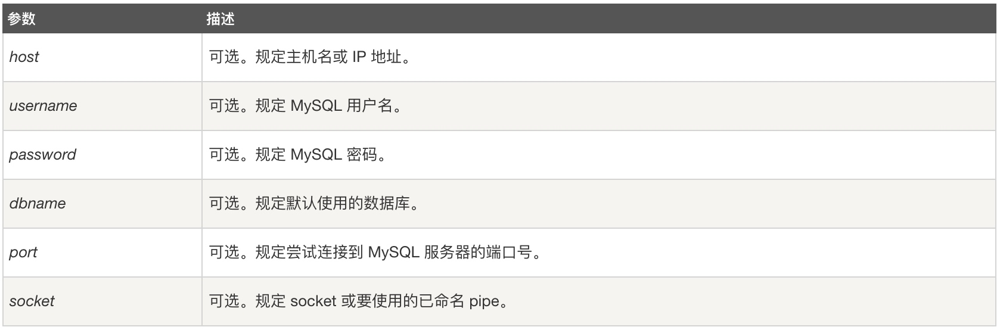
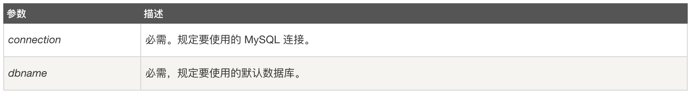
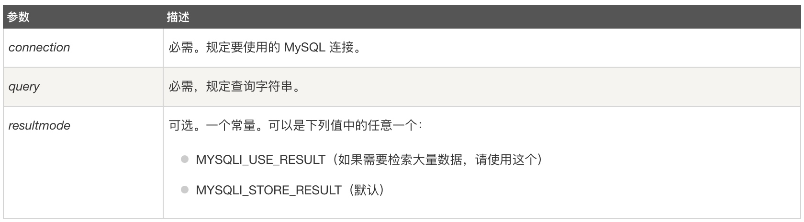

# PHP访问数据库

## PHP操作数据库

MySQL是一个关系型数据库管理系统，由瑞典MySQL AB 公司开发，目前属于 Oracle 旗下产品。MySQL 是最流行的关系型数据库管理系统之一，在 WEB 应用方面，MySQL是最好的 RDBMS (Relational Database Management System，关系数据库管理系统) 应用软件。
目前我们使用的数据库操作语法是MySQLi，可支持MySQL 4.1 或更高版本。

#### 什么是MySQLi
PHP-MySQL 函数库是 PHP 操作 MySQL 资料库最原始的扩展库，PHP-MySQLi 的 i 代表 Improvement ，相当于前者的增强版，也包含了相对进阶的功能，另外本身也增加了安全性，比如可以大幅度减少 SQL 注入等问题的发生。

**MySQLi的优点**

1. 安全性、稳定性更高；
2. 提供了面向对象和面向过程两种风格；

**MySQLi与MySQL的关联**

（1）MySQL与MySQLi都是php方面的函数集，与MySQL数据库关联不大。

（2）在php5版本之前，一般是用php的MySQL函数去驱动MySQL数据库的，比如mysql_query()的函数，属于面向过程的。

（3）在php5版本以后，增加了MySQLi的函数功能，某种意义上讲，它是MySQL系统函数的增强版，更稳定更高效更安全，与mysql_query()对应的有mysqli_query()，属于面向对象，用对象的方式操作驱动MySQL数据库。

（4）MySQLi 连接是永久连接，而MySQL是非永久连接。即： MySQL连接每当第二次使用的时候，都会重新打开一个新的进程，而MySQLi则只使用同一个进程，这样可以很大程度的减轻服务器端压力。

（5）MySQLi封装了诸如事务等一些高级操作，同时封装了DB操作过程中的很多可用的方法。应用比较多的地方是 MySQLi的事务。

## 操作

PHP操作MySQL数据库一般可分为5个步骤：

1. 连接MySQL数据库服务器；
2. 选择数据库；
3. 执行SQL语句；
4. 关闭结果集；
5. 断开与MySQL数据库服务器连接。

### 连接数据库

**1、 通过mysqli_connect()函数连接MySQL数据库服务器。**

函数原型

```php
mysqli_connect(host,username,password,dbname,port,socket);
```
参数说明



```php
<?php
$server = "localhost";
$userName = "root";
$password = "123456";
$dataBase = "GoogleSearch";
$conn = mysqli_connect($server, $userName, $password, $dataBase);
if(!$conn){
	die("Could not connect:". mysql_error());
}
?>
```

**2、 用mysqli_select_db()函数选择数据库**，如果成功，则该函数返回 true。如果失败，则返回 false。
函数原型

```php
mysqli_select_db(connection,dbname);
```

参数说明



```php
<?php

$server = "localhost";
$userName = "root";
$password = "123456";
$dataBase = "GoogleSearch";

$conn = mysqli_connect($server, $userName, $password, $dataBase);
if(!$conn){
	die("Could not connect:". mysqli_connect_error());
}

$db_select = mysqli_select_db($conn, $dataBase);
if(!$db_select){
	die ("Could not select database " . $dataBase . mysqli_errno($conn));
}
?>
```

**3、用mysqli_query()函数执行SQL语句。**

函数原型

```php
mysqli_query(connection,query,resultmode);
```
参数说明




此方法会对 SELECT，SHOW，EXPLAIN 或 DESCRIBE 语句返回一个资源标识符（ mysqli_result 对象），如果查询执行不正确则返回 FALSE。对于其它类型的 SQL 语句，在执行成功时返回 TRUE，出错时返回 FALSE。需要注意的是：非 FALSE 的返回值意味着查询是合法的并能够被服务器执行，不过这并不说明任何有关影响到的或返回的行数。很有可能一条查询执行成功了但并未影响到或并未返回任何行，所以这种情况，需要检查一下sql语句。


```php
<?php

$server = "localhost";
$userName = "root";
$password = "123456";
$dataBase = "GoogleSearch";

$conn = mysqli_connect($server, $userName, $password, $dataBase);
if(!$conn){
	die("Could not connect:". mysqli_connect_error());
}

$db_select = mysqli_select_db($conn, $dataBase);
if(!$db_select){
	die ("Could not select daabase " . $dataBase . mysqli_errno($conn));
}
$sql = "select * from Titles";
$result = mysqli_query($conn, $sql);
$response = array();
if (mysqli_num_rows($result) > 0) {
	
	while ($row = mysqli_fetch_array($result)) {
		$data = array("Id"=>$row["id"], "title"=>$row["title"], "subtitle"=>$row["subtitle"]);
		array_push($response, $data);
	}
	
	$json = array("state"=>1001, "message"=>"请求成功", "content"=>$response);
	echo json_encode($json);
	
}else {
	$json = array("state"=>-1001, "message"=>"请求失败", "content"=>[]);
	echo json_encode($json);
}
?>
```

`$result`：为mysqli_query()执行sql语句后返回的结果集；

`mysqli_num_rows($result)`：会返回结果集中行的数目。此命令仅对 SELECT 语句有效。要取得被 INSERT，UPDATE 或者 DELETE 查询所影响到的行的数目，用 `mysqli_affected_rows($link)`。

`mysqli_fetch_array($result)`： 从结果集中取得一行作为关联数组，或数字数组，返回根据从结果集取得的行生成的数组，如果没有更多行则返回 false，所以我们可以配合while循环来遍历结果集。

**4、关闭结果集**
数据库操作完成之后，需要关闭结果集，释放资源。

```php
mysqli_free_result($result);
```

**5、断开服务器连接**
     每使用一次mysqli_connect()或mysqli_query()函数，都会消耗系统资源，为避免资源浪费，用mysqli_close函数关闭与MySQL服务器的连接，以节省系统资源。


```php
mysqli_close($conn);
```   
     


