# 应用程序设置

## 前言

《数据存储》课程共分为六章内容，第一章主要讲述应用程序设置，如何配置setting bundle；第二章主要介绍数据持久化的概念及相关；第三章主要讲述数据持久化方式：属性列表；第四章主要讲述数据持久化方式：对象归档；第五章主要讲述数据持久化方式：SQLite3；第六章主要讲述数据持久化方式：CoreData。本课程偏重实践，完成本课程学习后能够完成大部分应用程序的界面。 

## 应用程序设置

### 本章内容与目标


大部分应用都会包含一个偏好设置的入口，用户可以在其中设置应用专属的选项。在iPhone和其他的iOS设备有一个专门的“设置”应用程序来进行各种设置。

本章节将介绍如何在“设置”中为应用添加设置，以及如何从应用内部访问这些设置。内容包括：

* 应用程序设置基本介绍；
* 构建应用设置。

### 应用程序设置基本介绍

如今，即便是最简单的计算机程序也会包含一个偏好设置窗口，用户可以在其中设置应用专属的选项。在Mac OS X中，Preferences…菜单项通常位于应用菜单中。选择改菜单项会弹出一个窗口，用户可以在其中输入和更改各种选项。iPhone和其他的iOS设备有一个专门的“设置”应用程序来进行各种设置，你肯定用过很多次了。

本节课将介绍如何在“设置”中为你的应用添加设置，以及如何从应用内部访问这些设置。      
先在iOS设备上找到“设置”，并点开（如下图所示）。这节课，我们将构建一个简单的应用，添加并配置一个settings bundle（设置捆绑包），这样当用户启动“设置”的时候，界面会显示一个指向该应用的入口。如果用户点击了该应用入口，系统会显示一个与该应用有关的偏好设置。 

设置：

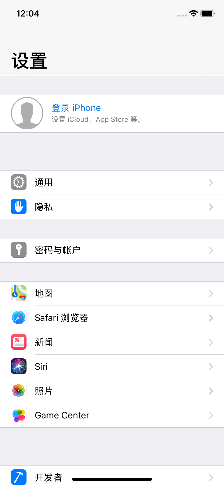


地图设置：

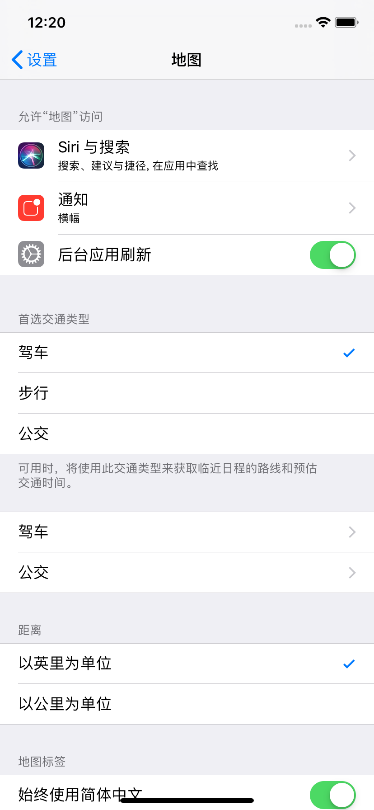

### 使用步骤

在Xcode中， 通过创建一个特殊的 plist 文件 settings.bunlde 将多个值以 NSUserDafulats 的方式添加到设置程序中。


1、 File-> New ->File ->Resource ->Settings Bundle：

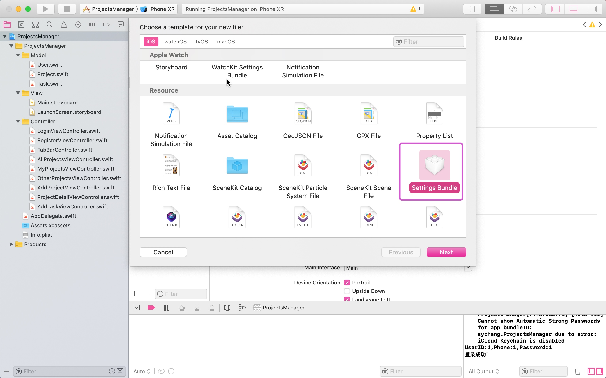

2、命名并选择保存路径（默认方式即可），点击create：

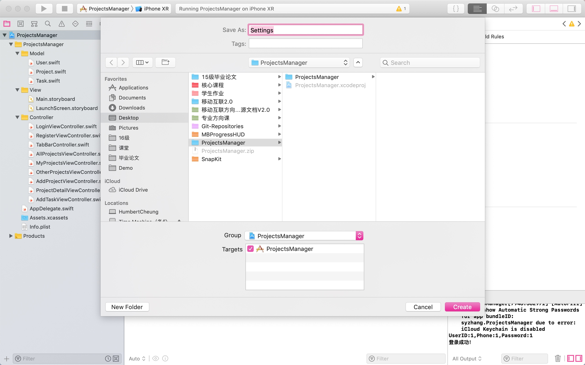


3、然后在工程中便会生成一个Settings bundle包，点击打开可以看到其中包含两个文件，一个是en.lproj，另外一个是Root.plist。

1. en.lproj：主要用来进行本地化设置，如设置语言等。
1. Root.plist：主要文件，应用程序的设置项就在改文件中添加和设置。

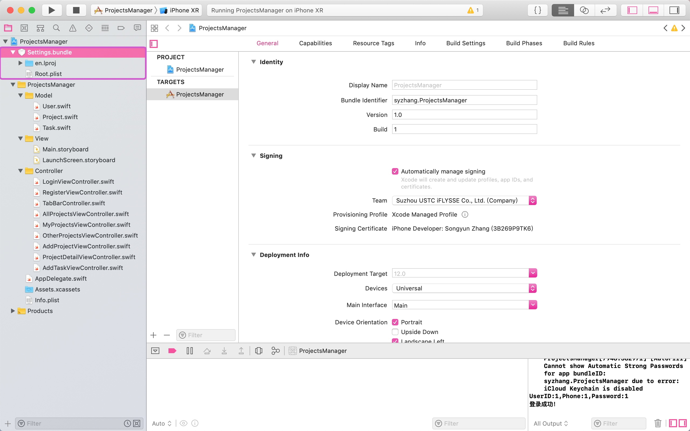


由此，我们便创建好了Settings.bundle，我们现在可以打开设置，可以查看我们创建的设置项：

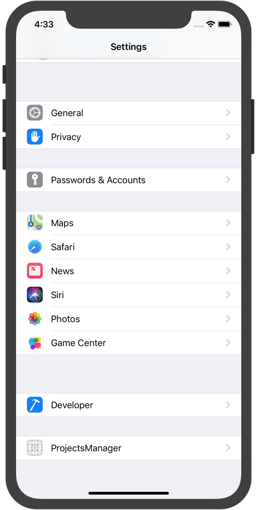


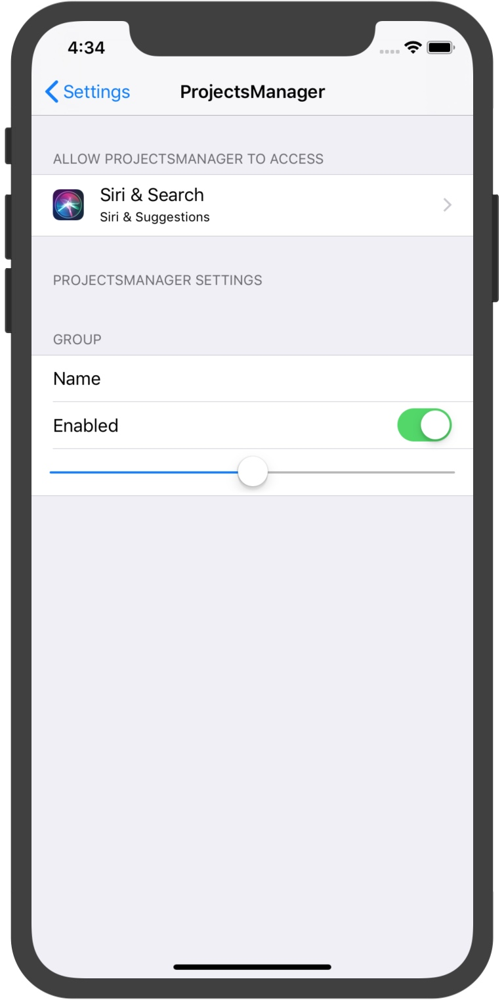


### 配置项

Settings.Bundle支持六种配置项：TextField，Title，ToggleSwitch，Slider，MultiValue，Group，以及一种特殊的配置项：Child pane，如下：

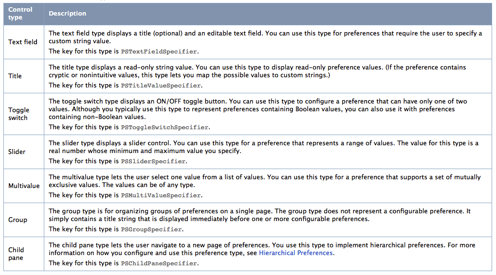


#### Group

Group类似于UITableView中的**Group分组**，用来表示一组设置项。在Group中可以设置几个内容：

* Type：配置的类型，即以上的七种类型。

* Title：分组显示的标题。

* FooterText：Group的底部显示的文字内容。

如下所示，我们分别给Group中的几项分别设置了内容：

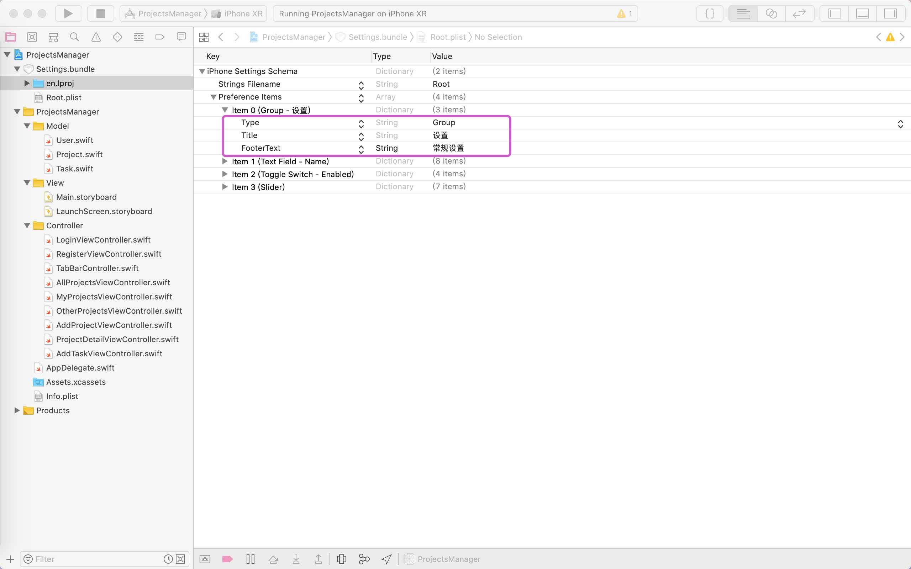

效果图如下：

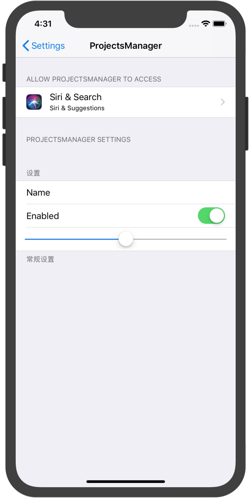

#### Multi Value

Multi Value是为了让用户在多个值中选择需要的内容，**相当于下拉列表**的形式进行选择。在Multi Value中可以设置以下几项内容：

* Type：配置的类型。

* Title：显示的标题。

* Identifier：设置项的标识符，可以在代码中通过该id来读取配置项的内容。

* Default Value：默认的值，对应的是Values中的项目。

* Titles：在设置中显示的标题的集合。

* Values：与标题Titles中的标题所对应的值的集合。

如下所示，我们向设置项添加一个自动注销的设置，用户可以选择直接注销、或者1/2/3/4/5分钟后注销，如下所示：

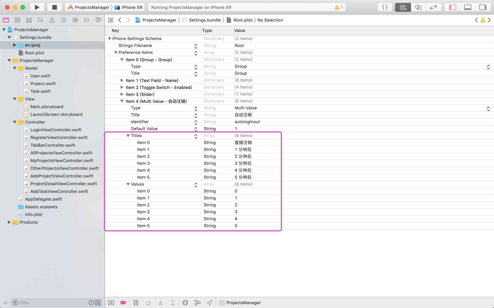

效果图下图：

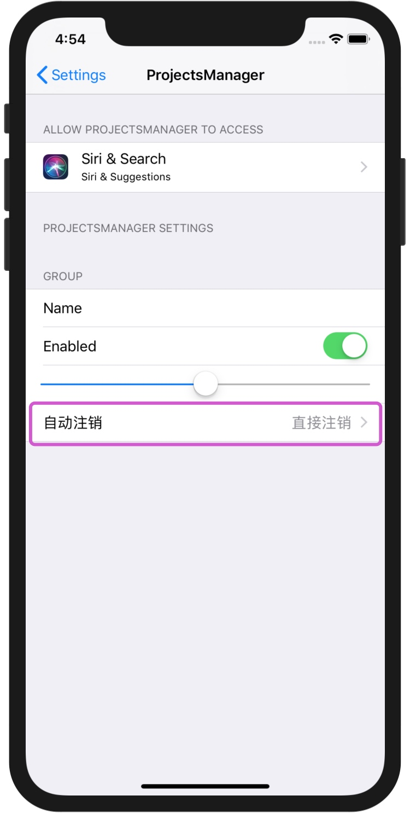


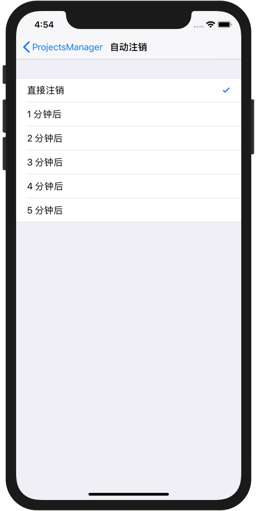

#### Slider

与空间库中的UISlider一样的，样式上是一个滑块，可以让用户滑动选择，在Slider中可以选择以下几个内容：

* Type：配置类型

* Identifier：设置项的标识符，用于读取配置项的配置内容。

* Default Value：默认值，Number类型。

* Minimum Value：最小值，Number类型。

* Maximum Value：最大值，Number类型。

* Max Value Image Filename：最大值那一端的图片。

* Min Value Image Filename：最小值那一端的图片。

> **注意：**
> 在设置图片时，需要将图片放到Settings bundle包中，否则无法识别到，并且图片大小建议32左右。

如下所示，我们向设置中添加亮度的设置，用户通过滑块来选择：

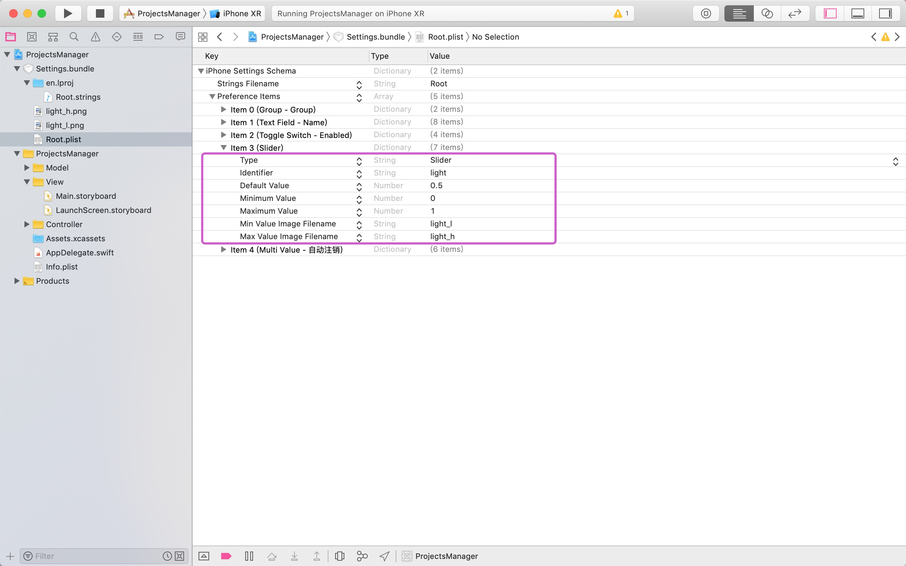


效果如下图：

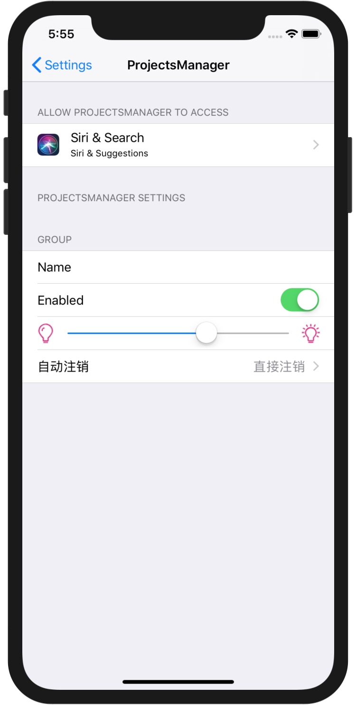


#### Text Field

在设置项中，我们还可以使用文本框，让用户进行输入设置，在Text Field中，我们可以设置以下几个内容：

* Type：配置的类型。

* Title：显示的标题。

* Identifier：设置项的标识符，可以在代码中通过该id来读取配置项的内容。

* Default Value：默认的值，对应的是Values中的项目。

* Text Field is Secure：布尔类型，表示是否为安全文本。如果设置为YES，则内容以圆点符号出现。

* Autocapitalization Style：自动大写。有四个值: None(无)、Sentences(句子首字母大写)、Words(单词首字母大写)和All Characters(所有字母大写)。

* Autocorrection Style：自动纠正拼写，如果开启，你输入一个不存在的单词，系统会划红线提示。有三个值：Default(默认)、No Autocorrection(不自动纠正)和Autocorrection(自动纠正)。

* Keyboard Type：键盘样式。有五个值：Alphabet(字母表，默认的)、Numbers and Punctuation(数字和标点符号)、Number Pad(数字面板)、URL(比Alphabet多出了.com等域名后缀)和Email Address(比Alphabet多出了@符号)。

如下所示，我们向配置项中添加一个账户设置，让用户可以配置账户信息：

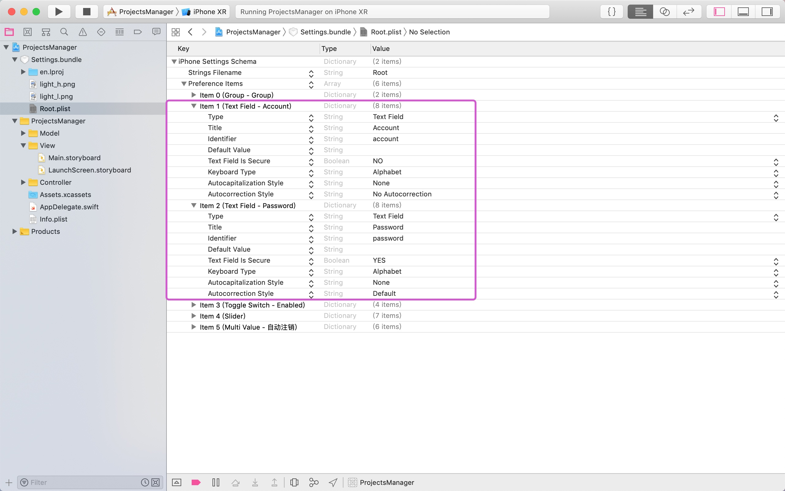


效果如下图：

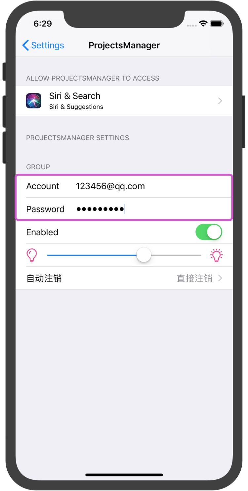

#### Title

用来显示一些预置信息。在Title中可以配置的内容如下：

* Type：默认是Title。

* Title：配置项显示的标题。

* Identifier：设置项的标识符，用于读取配置项的配置内容。

* Default Value：默认的值。

如下，在配置项中将用户的用户名展示出来：

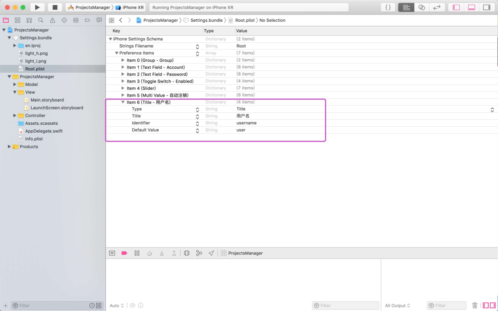

效果如下图：

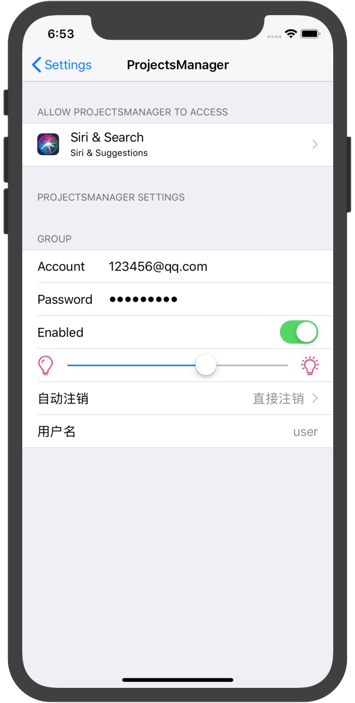


#### Toggle Switch

一个类似于UISwitch的开关，用于设置简单的开启或者关闭的选项，配置如下所示：

* Type：默认是Toggle Switch。

* Title：配置项显示的标题。

* Identifier：设置项的标识符，用于读取配置项的配置内容。

* Default Value：默认的值。

如下所示：

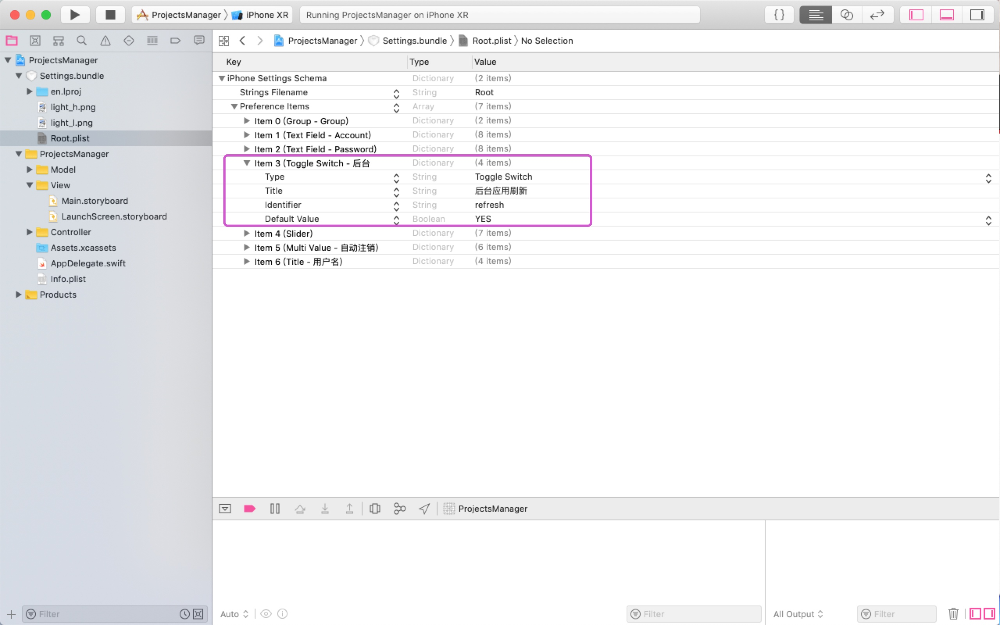


效果如下图：

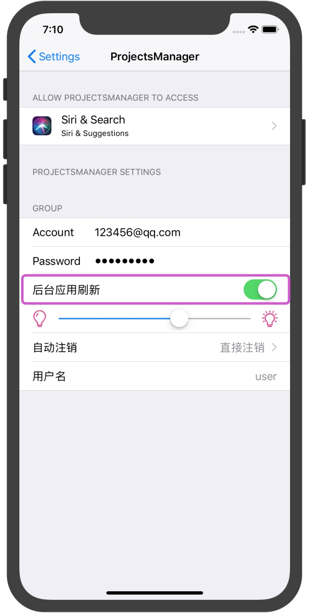


### 在文件中读取与操作

从以上的内容中，我们可以知道应用设置都是在Settings.bundle中的Root.plist中配置的，所以，如果我们想要进行操作首先需要读取到Root.plist文件，然后将其转化成字典对象即可进行任何操作了。具体步骤如下

1、获取应用程序设置包路径

在Swift中，应用程序包路径通常可通过应用程序包对象去调用`path(forResource name: String?, ofType ext: String?) -> String?`方法来获取，那么，那么如何获取应用程序包对象？通过Bundle类的main属性即可，如下：

```swift
func readingPreference(){
    //获取应用程序包路径路径
    let settingsBundle = Bundle.main.path(forResource: "Settings", ofType: "bundle")
    //判断如果未成功获取则退出函数
    if settingsBundle == nil {
        print("SettingsBundle 不存在！")
        return
    }
}
```

2、在获取到应用程序包路径后，就可以获取Root.plist的文件路径了：


```swift
func readingPreference(){
    //获取应用程序包路径路径
    let settingsBundle = Bundle.main.path(forResource: "Settings", ofType: "bundle")
    //判断如果未成功获取则退出函数
    if settingsBundle == nil {
        print("SettingsBundle 不存在！")
        return
    }
    let settingsPath = URL(fileURLWithPath: settingsBundle!).appendingPathComponent("Root.plist")
    
    print("Settings URL: \(settingsPath)")
}
```

3、在获取到Root.plist文件路径后，我们就可以通过字典的构造方法`init?(contentsOf url: URL)`，来读取该文件并构造字典：


```swift
func readingPreference(){
    
    //获取应用程序包路径路径
    let settingsBundle = Bundle.main.path(forResource: "Settings", ofType: "bundle")
    //判断如果未成功获取则退出函数
    if settingsBundle == nil {
        print("SettingsBundle 不存在！")
        return
    }
    let settingsPath = URL(fileURLWithPath: settingsBundle!).appendingPathComponent("Root.plist")
    
    print("Settings URL: \(settingsPath)")
    
    let settingsDic = NSDictionary.init(contentsOf: settingsPath)
}
```

由此我们成功获取到了应用程序的所有设置项了，我们将转化成功的字典打印出来，如下：

```swift
{
    PreferenceSpecifiers =     (
                {
            Title = Group;
            Type = PSGroupSpecifier;
        },
                {
            AutocapitalizationType = None;
            AutocorrectionType = No;
            DefaultValue = "";
            IsSecure = 0;
            Key = account;
            KeyboardType = Alphabet;
            Title = Account;
            Type = PSTextFieldSpecifier;
        },
                {
            AutocapitalizationType = None;
            AutocorrectionType = Default;
            DefaultValue = "";
            IsSecure = 1;
            Key = password;
            KeyboardType = Alphabet;
            Title = Password;
            Type = PSTextFieldSpecifier;
        },
                {
            DefaultValue = 1;
            Key = refresh;
            Title = "\U540e\U53f0\U5e94\U7528\U5237\U65b0";
            Type = PSToggleSwitchSpecifier;
        },
                {
            DefaultValue = "0.5";
            Key = light;
            MaximumValue = 1;
            MaximumValueImage = "light_h";
            MinimumValue = 0;
            MinimumValueImage = "light_l";
            Type = PSSliderSpecifier;
        },
                {
            DefaultValue = 1;
            Key = autologinout;
            Title = "\U81ea\U52a8\U6ce8\U9500";
            Titles =             (
                "\U76f4\U63a5\U6ce8\U9500",
                "1 \U5206\U949f\U540e",
                "2 \U5206\U949f\U540e",
                "3 \U5206\U949f\U540e",
                "4 \U5206\U949f\U540e",
                "5 \U5206\U949f\U540e"
            );
            Type = PSMultiValueSpecifier;
            Values =             (
                0,
                1,
                2,
                3,
                4,
                5
            );
        },
                {
            DefaultValue = user;
            Key = username;
            Title = "\U7528\U6237\U540d";
            Type = PSTitleValueSpecifier;
        }
    );
    StringsTable = Root;
}

```

为了更清楚的了解设置的字典，我们打印一下字典的相关信息：


```swift
print("SettingsDictionary.count: \(settingsDic?.count ?? 0)")
print(settingsDic!["PreferenceSpecifiers"]!);
print(settingsDic!["StringsTable"]!);
```

打印的信息如下：

```swift
SettingsDictionary.count: 2
(
        {
        Title = Group;
        Type = PSGroupSpecifier;
    },
        {
        AutocapitalizationType = None;
        AutocorrectionType = No;
        DefaultValue = "";
        IsSecure = 0;
        Key = account;
        KeyboardType = Alphabet;
        Title = Account;
        Type = PSTextFieldSpecifier;
    },
        {
        AutocapitalizationType = None;
        AutocorrectionType = Default;
        DefaultValue = "";
        IsSecure = 1;
        Key = password;
        KeyboardType = Alphabet;
        Title = Password;
        Type = PSTextFieldSpecifier;
    },
        {
        DefaultValue = 1;
        Key = refresh;
        Title = "\U540e\U53f0\U5e94\U7528\U5237\U65b0";
        Type = PSToggleSwitchSpecifier;
    },
        {
        DefaultValue = "0.5";
        Key = light;
        MaximumValue = 1;
        MaximumValueImage = "light_h";
        MinimumValue = 0;
        MinimumValueImage = "light_l";
        Type = PSSliderSpecifier;
    },
        {
        DefaultValue = 1;
        Key = autologinout;
        Title = "\U81ea\U52a8\U6ce8\U9500";
        Titles =         (
            "\U76f4\U63a5\U6ce8\U9500",
            "1 \U5206\U949f\U540e",
            "2 \U5206\U949f\U540e",
            "3 \U5206\U949f\U540e",
            "4 \U5206\U949f\U540e",
            "5 \U5206\U949f\U540e"
        );
        Type = PSMultiValueSpecifier;
        Values =         (
            0,
            1,
            2,
            3,
            4,
            5
        );
    },
        {
        DefaultValue = user;
        Key = username;
        Title = "\U7528\U6237\U540d";
        Type = PSTitleValueSpecifier;
    }
)
Root
```
从这里我们可以看出，字典一共有两个键值对，第一个是我们所有的设置项，通过**PreferenceSpecifiers** 保存在一个数组中；第二个是我们的文件的名字，通过**StringsTable**来保存的，值为**Root**

因此，我们可以通过**PreferenceSpecifiers**来操作所有设置项，如下，我们获取第一项设置打印出来：

```swift
    let settingsDic = NSDictionary.init(contentsOf: settingsPath)
    
    let settingsArray = settingsDic!["PreferenceSpecifiers"]!;
    
    print((settingsArray as! Array)[0]);
```

结果如下：
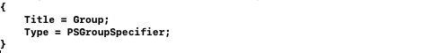

是不是觉得比较麻烦？我们来看另一种方式，通过UserDefaults类来获取。UserDefaults此类用来获取用户的默认设置，在应用程序中，UserDefaults对象是一个单例，可以通过他的属性standard来获取单例对象，然后通过`object(forKey defaultName: String) -> Any?`方法或者`value(forKey key: String) -> Any?`来获取设置项的值：


```swift
//获取UserDefaults单例
let defaults = UserDefaults.standard

//根据identifier获取到设置中的值
let  account = defaults.object(forKey: "account");
    
print(account!);
```

结果会输出：123456@qq.com。


同样的，当我们如果需要去修改对应的内容，则可以通过


```swift
//获取UserDefaults单例
let defaults = UserDefaults.standard

//根据identifier获取到设置中的值
let  account = defaults.value(forKey: "account");
    
print(account!);

//设置account的内容为654321@qq.com
defaults.set("654321@qq.com", forKey: "account");
```

效果如下图：

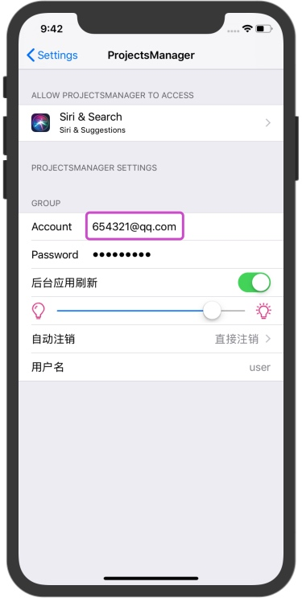


#### 案例实战

接下去我们在应用程序中把设置的信息展示在界面上，我们新创建一个页面SettingViewController，用来展示信息的：

AppDelegate.swift

```swift
//因为要在要频繁的根据key获取值，所以可以将key设置成常量，可以在AppleDelegate的头部声明
let ACCOUNT = "account"
let PASSWORD = "password"
let REFRESH = "refresh"
let LIGHT = "light"
let AUTOLOGINOUT = "autologinout"
```

SettingViewController.swift

```swift
import UIKit

class SettingsViewController: UIViewController {
    @IBOutlet weak var accountText: UITextField!
    
    @IBOutlet weak var passwordText: UITextField!
    
    @IBOutlet weak var refreshSwitch: UISwitch!
    
    @IBOutlet weak var lightSlider: UISlider!
    
    @IBOutlet weak var autoLogoutText: UILabel!
    
    override func viewDidLoad() {
        super.viewDidLoad()

        // Do any additional setup after loading the view.
    }
    
    override func viewWillAppear(_ animated: Bool) {
        readingPreference()
    }
    
    func readingPreference(){
       
        let defaults = UserDefaults.standard
        
        accountText.text = defaults.value(forKey: ACCOUNT) as? String
        passwordText.text = defaults.value(forKey: PASSWORD) as? String
        refreshSwitch.isOn = defaults.bool(forKey: REFRESH)
        
        lightSlider.value = defaults.float(forKey: LIGHT)
        
        autoLogoutText.text = defaults.value(forKey: AUTOLOGINOUT) as? String
    }
    
    @IBAction func saveBtn(_ sender: UIButton) {
        let defaults = UserDefaults.standard
        
        defaults.set(accountText.text, forKey: ACCOUNT)
        
        defaults.set(passwordText.text, forKey: PASSWORD)
        
        defaults.set(refreshSwitch.isOn, forKey: REFRESH)
        
        defaults.set(lightSlider.value, forKey: LIGHT)
        
        defaults.set(autoLogoutText.text, forKey: AUTOLOGINOUT)
        
        defaults.synchronize()
    }
}
```

main.storyboard
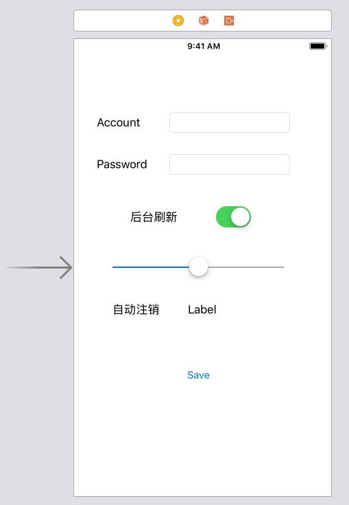


在以上页面中，我们实现了将信息设置捆绑包中的信息展示在页面上，然后我们可以在页面中对某些信息进行或更改，修改后点击Save，可以将信息更新到设置项中。

不过在实现中，我们发现了一个问题，第一次打开程序时，并不会将信息显示在界面上，那是因为当我们进入程序后，应用程序并不知道我们有哪些设置项，所以需要现在UserDefaults注册，可以在应用程序启动后注册，可以在代理的`didFinishLaunchingWithOptions`方法中注册：


```swift
func application(_ application: UIApplication, didFinishLaunchingWithOptions launchOptions: [UIApplication.LaunchOptionsKey: Any]?) -> Bool {
    
    //准备第一次需要显示的默认值
    let defaultsDic = [ACCOUNT: "xxx", PASSWORD: "000", REFRESH: false, LIGHT: 0.7, AUTOLOGINOUT: "1"] as [String : Any]
    
    //UserDefaults注册
    UserDefaults.standard.register(defaults: defaultsDic)
    
    return true
}
```


同时，还存在另外一个问题：当我们在设置项中修改了某些设置，然后重新回到应用程序中也不会更新到应用程序中，这个是因为，当我们回到主屏幕，进入设置时，应用程序只是在后台保持挂起状态，并没有关闭，所以当我们返回时是重新回到了应用程序页面，应用程序并没有重新启动一遍，所以信息不会再次刷新，那么我们要怎么做？需要运用通知来实现，当应用程序从后台回到前台时，同时所在的页面去刷新数据就可以了，需要通过通知中心单例对象来实现：

1、创建通知，添加通知的监听对象：

SettingViewController.swift

```swift
import UIKit

class SettingsViewController: UIViewController {
    @IBOutlet weak var accountText: UITextField!
    
    @IBOutlet weak var passwordText: UITextField!
    
    @IBOutlet weak var refreshSwitch: UISwitch!
    
    @IBOutlet weak var lightSlider: UISlider!
    
    @IBOutlet weak var autoLogoutText: UILabel!
    
    override func viewDidLoad() {
        super.viewDidLoad()

        // Do any additional setup after loading the view.
    }
    
    override func viewWillAppear(_ animated: Bool) {
        readingPreference()
        //获取通知中心，添加通知的监听对象
        let center = NotificationCenter.default
        center.addObserver(self, selector: #selector(applicationWillEnterForeground(notification:)), name: NSNotification.Name(rawValue: "RefreshNotification"), object: nil)
    }
    
    //通知的回掉方法
    @objc func applicationWillEnterForeground(notification: NSNotification) {
        //在此处进行数据的刷新
        let defaults = UserDefaults.standard
        defaults.synchronize()
        readingPreference()
    }
    
    func readingPreference(){
       
        let defaults = UserDefaults.standard
        
        accountText.text = defaults.value(forKey: ACCOUNT) as? String
        passwordText.text = defaults.value(forKey: PASSWORD) as? String
        refreshSwitch.isOn = defaults.bool(forKey: REFRESH)
        
        lightSlider.value = defaults.float(forKey: LIGHT)
        
        autoLogoutText.text = defaults.value(forKey: AUTOLOGINOUT) as? String
    }
    
    @IBAction func saveBtn(_ sender: UIButton) {
        let defaults = UserDefaults.standard
        
        defaults.set(accountText.text, forKey: ACCOUNT)
        
        defaults.set(passwordText.text, forKey: PASSWORD)
        
        defaults.set(refreshSwitch.isOn, forKey: REFRESH)
        
        defaults.set(lightSlider.value, forKey: LIGHT)
        
        defaults.set(autoLogoutText.text, forKey: AUTOLOGINOUT)
        
        defaults.synchronize()
    }
}
```

2、发送通知。在本例子中，需要在应用程序回到前台时发送通知，所以可以在AppDelegate的`applicationWillEnterForeground`方法中发送通知：
 
 AppDelegate.swift

```swift
    func applicationWillEnterForeground(_ application: UIApplication) {

        let center = NotificationCenter.default
        
        //通过post方法来发送通知，其中通知的name必须与创建的通知名要一致
        center.post(name: NSNotification.Name(rawValue: "RefreshNotification"), object: self, userInfo: nil)
    }
```


