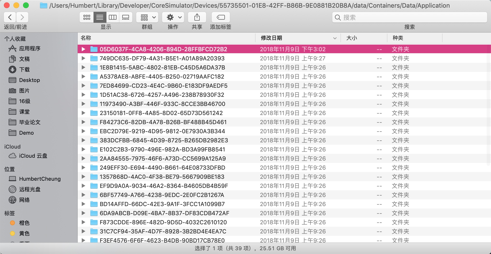

# 应用程序沙箱 & 属性列表

### 沙箱机制

在接下去的课程中，我们即将学习4种将数据持久存储在iOS文件系统的机制：

1. 属性列表；

2. 对象归档；

3. iOS的嵌入式关系数据库SQLite3；

4. 苹果公司提供的持久化工具Core Data。

这四种数据持久化机制都涉及同一个共同要素，即应用程序沙箱。

> 沙箱（或沙盒）机制（SandBox），这是一种安全机制，每个 iOS 应用程序都有一个单独的文件系统（存储空间），而且只能在自己所对应的文件系统中进行操作，此区域就被称为来沙箱。所有的非代码文件都要保存在此，例如属性文件 plist、文本文件、图像、图标、媒体资源等。

在iOS中，每个应用程序都有以下几个特点：

* 所有应用程序都共享一个重要的应用程序文档目录（applocation's/Documents）;

* 每一个应用程序只能获得自己的文档目录进行读写；

那么，在iOS中，应用是怎么组织及存储的？如何找到应用程序沙箱？

在Finder中依次打开：

/Users/用户目录/Library/Developer/CoreSimulator/Devices/被更改项/data/Containers/Data/Application/应用程序沙箱：



进入沙箱后，我们可以看到四个目录：


沙箱是iPhone用来保存程序的地方，通常每个程序常用的有其中这三个目录：Documents、Library和tmp：

* **Documents**：所有的应用程序数据文件都保存在这个目录下。这个目录用于存储用户数据或其它应该定期备份的信息，所以用户自己保存的文件基本都在documents文件里。

* **Library**：保存应用程序所需的库文件等，这个目录下有两个子目录：Caches 和 Preferences
    * Preferences 目录：包含应用程序的偏好设置文件。我们不应该直接创建和获取偏好设置文件，而是应该使用UserDefaults类来取得和设置应用程序的偏好。
    * Caches 目录：用于存放应用程序专用的支持文件，保存应用程序再次启动过程中需要的信息。
 
* **tmp**：存储应用程序自己的临时文件，iTunes不会同步这个目录下的文件。

> **注意：**
> 系统会为每个程序生成一个私有目录即沙箱，并随机生成一个数字字母串作为目录名，在每次程序启动时这个名称都是不同的，所以就算我们记住应用程序沙箱名字在下一次也访问不了，因为在下次启动时沙箱名字已经变了。

#### 沙箱相关目录路径

1、获取应用程序**沙箱路径**：


```swift
let homeDir = NSHomeDirectory()
print(homeDir)
```

如下：


2、获取**Documents**目录路径：


```swift
//通过此方法来获取沙箱Documents路径
let domainPath = NSSearchPathForDirectoriesInDomains(.documentDirectory, .userDomainMask, true)

let documentDir = domainPath[0]
print(documentDir)
```

结果如下：


2、获取**Caches**目录路径：


```swift
let domainPath = NSSearchPathForDirectoriesInDomains(.cachesDirectory, .userDomainMask, true)
let cachesDir = domainPath[0]
print(cachesDir)
```

结果如下图：


3、获取 **Preference** 目录路径

```swift
//不适用于swift4.2
let domainPath = NSSearchPathForDirectoriesInDomains(.preferenceDirectory, .userDomainMask, true)
let referencesDir = domainPath[0]
```

> 注意：

> * 此方法可以让我们来获取应用程序的偏好设置文件，不过我们一般通过UserDefaults.standard来操作，而不直接获取。
> * preferenceDirectory类型在swift4.2中已被移除，我们无法直接获取。


4、获取**tmp**目录路径

```swift
let tmpDir = NSTemporaryDirectory()
print(tmpDir)
```

结果如下图：


## 属性列表（Plist）

在之前的课程中，我们已经使用过了属性列表，这节课我们来系统地学习属性列表存储数据的方式。

> 属性列表，即Property List，简称为plist文件，是一种用来存储串行化（序列化）后的对象的文件。因为扩展名为plist ，因此通常被称为 plist文件。我们可以回忆一下之前的应用程序设置中，其实我们就通过使用属性列表来指定应用的设置。

属性列表非常方便，因为可以使用Xcode或Property List Editor应用手动编辑它们。而且只要字典或数组包含特定可序列化对象，就可以将Dictionary和Array实例写入属性列表或者从属性列表创建它们。

属性列表有以下几个特点：

* 对于Foundation中的几个常用类，可以直接进行存储：

    * Array
    * Dictionary
    * Data
    * String
    * Number
    * Date

* 对于少量数据，通过属性列表来存储比较好；
    * 如：用户偏好设置等
    
* UserDefaults类使用的就是属性列表。

### 属性列表的使用

#### 创建

1、创建Property List文件

File-> New ->File ->Resource ->Property List


2、输入文件名、保存路径即可：


#### 添加内容

我们创建一个用来记录城市信息的属性列表，City.plist，在其中添加两个键值对：第一个是用来记录文件名的，key是`FileName`，value是`城市列表`；第二个是用来存储相关的城市名称的，key是`Cities`，value是一个数组，数组中保存的就是城市名称，如下：


#### 读取属性列表

回顾一下上节课，我们获取Setting.Bundle路径时是通过Bundle对象的path方法来获取，path方法可以获取到应用程序包中的一些资源文件，所以今天我们仍然使用path来获取plist文件。在下面的例案例中，我们创建了一个包含几个城市的plist文件，然后在页面中，将属性列表信息获取出来，并把前两个城市信息输出在页面上：

```swift
import UIKit

class ViewController: UIViewController {
    
    @IBOutlet weak var city1Text: UITextField!
    
    @IBOutlet weak var city2Text: UITextField!
    
    override func viewDidLoad() {
        super.viewDidLoad()
        
        getCities()
    }
    
    func getCities(){
        //通过path方法获取到City.plist的路径
        let plistDir = Bundle.main.path(forResource: "City", ofType: "plist")
        //然后通过字典的构造方法，可以从路径中把plist文件加载出来并转化成字典
        var citiesDic = NSDictionary.init(contentsOfFile: plistDir!)
        print(citiesDic!)
        //通过Cities将城市数组取出，因为字典中的对象默认类型时Any，
        //所以需要将类型强转为Array<String>类型，然后取出第一个和第二个城市进行展示
        city1Text.text = (citiesDic!["Cities"]  as! Array<String>)[0]
        city2Text.text = (citiesDic!["Cities"]  as! Array<String>)[1]
    }
}
```

print输出如下：


页面效果如下：


#### 使用偏好设置存储

将以上示例改一下，让用户在界面中输入两个城市，输入后将城市保存进属性列表中，然后在下一个页面中去获取属性列表中保存的信息。添加一个保存按钮，当点击保存后，将信息保存进属性列表，然后跳转到下一个页面：

**ViewController.swift**

```swift
import UIKit

class ViewController: UIViewController {
    
    @IBOutlet weak var city1Text: UITextField!
    
    @IBOutlet weak var city2Text: UITextField!
    
    override func viewDidLoad() {
        super.viewDidLoad()
        
    }
    
    
    @IBAction func save(_ sender: UIButton) {
        let city1 = city1Text.text
        let city2 = city2Text.text
        
        let cities:[String] = [city1!, city2!]
        
        //我们需要将数据保存进Documents文件夹中，此处我们构造一个路径。
        let filePath = URL(fileURLWithPath: getDocumentsDirectory()).appendingPathComponent("city.plist")
        //通过write方法，将数组写进属性列表，因为write方法是OC中的，所以需要将数组转化成NSArray，否则会无法识别
        (cities as NSArray).write(to: filePath, atomically: true)
        
        let nextVC = storyboard?.instantiateViewController(withIdentifier: "NextVC")
        
        present(nextVC!, animated: true, completion: nil)
    }
    
    //获取Documents路径
    func getDocumentsDirectory() -> String{
        let documentDir = NSSearchPathForDirectoriesInDomains(.documentDirectory, .userDomainMask, true)[0]
        print(documentDir)
        return documentDir
    }
}
```


**NextViewController.swift**

```swift
import UIKit

class NextViewController: UIViewController {
    @IBOutlet weak var city1Text: UITextField!
    @IBOutlet weak var city2Text: UITextField!
    
    override func viewDidLoad() {
        super.viewDidLoad()

        getCities()
    }
    
    func getCities(){
        //获取之前保存plist的路径
        let filePath = URL(fileURLWithPath: getDocumentsDirectory()).appendingPathComponent("city.plist")
        //然后通过数组的构造方法，可以从路径中把plist文件加载出来并转化成数组
        let citiesDic = NSArray.init(contentsOf: filePath)
        print(citiesDic!)
        
        city1Text.text = (citiesDic as! Array<String>)[0]
        city2Text.text = (citiesDic as! Array<String>)[1]
    }
   
    func getDocumentsDirectory() -> String{
        let documentDir = NSSearchPathForDirectoriesInDomains(.documentDirectory, .userDomainMask, true)[0]
        print(documentDir)
        return documentDir
    }
}
```

效果如下：


以上的示例中，我们实现了将城市名（即String类类型）通过数组保存进了属性列表。


属性列表让我们通过序列化的方式，很容易就可以把数据存储起来，但是有一定的限，即仅限于我们上面所说的几个类型。

那么，如果我们想要将对象保存进属性列表，怎么保存呢？我们来试一下，再将以上案例修改一下。我们创建一个City类，然后用户输入两个城市名后我们会创建两个City对象，然后再将City对象保存进属性列表中：

**City.swift**

```swift
import UIKit
//City类
class City: NSObject {
    var name = "城市"
    var province = "省份"
    
    init(name: String, province: String) {
        super.init()
        self.name = name
        self.province = province
    }
    
    convenience init(name: String) {
        self.init(name: name, province: "无")
    }
}
```

**ViewController.swift**

```swift
import UIKit

class ViewController: UIViewController {
    
    @IBOutlet weak var city1Text: UITextField!
    
    @IBOutlet weak var city2Text: UITextField!
    
    override func viewDidLoad() {
        super.viewDidLoad()
        
    }
    
    
    @IBAction func save(_ sender: UIButton) {
        //当用户输入两个城市后，我们创建两个City，然后保存进数组中
        let city1 = City(name: city1Text.text!)
        let city2 = City(name: city2Text.text!)

        let cities = [city1, city2]
        
        //我们需要将数据保存进Documents文件夹中，此处我们构造一个路径。
        let filePath = URL(fileURLWithPath: getDocumentsDirectory()).appendingPathComponent("city.plist")
        
        //通过write方法，将数组写进属性列表，因为write方法是OC中的，所以需要将数组转化成NSArray，否则会无法识别
        (cities as NSArray).write(to: filePath, atomically: true)
        
        let nextVC = storyboard?.instantiateViewController(withIdentifier: "NextVC")
        
        present(nextVC!, animated: true, completion: nil)
    }
    
    //获取Documents路径
    func getDocumentsDirectory() -> String{
        let documentDir = NSSearchPathForDirectoriesInDomains(.documentDirectory, .userDomainMask, true)[0]
        print(documentDir)
        return documentDir
    }
}
```

**NextViewController.swift**

```swift
import UIKit

class NextViewController: UIViewController {
    @IBOutlet weak var city1Text: UITextField!
    @IBOutlet weak var city2Text: UITextField!
    
    override func viewDidLoad() {
        super.viewDidLoad()

        getCities()
    }
    
    func getCities(){
        //获取之前保存plist的路径
        let filePath = URL(fileURLWithPath: getDocumentsDirectory()).appendingPathComponent("city.plist")
        //然后通过数组的构造方法，可以从路径中把plist文件加载出来并转化成数组
        let citiesDic = NSArray.init(contentsOf: filePath)
        print(citiesDic!)
        
        city1Text.text = (citiesDic as! Array<City>)[0].name
        city2Text.text = (citiesDic as! Array<City>)[1].name
    }
   
    func getDocumentsDirectory() -> String{
        let documentDir = NSSearchPathForDirectoriesInDomains(.documentDirectory, .userDomainMask, true)[0]
        print(documentDir)
        return documentDir
    }
}
```


结果我们发现并未保存成功，原因是因为我们创建的是自定义的对象，并未遵循NSCoding协议，所以无法实现序列化，那么我们在使用该对象之前需要对该对象的类进行归档：

**City.swift**

```swift
import UIKit

class City: NSObject, NSCoding {
    
    var name = "城市"
    var province = "省份"
    
    init(name: String, province: String) {
        super.init()
        self.name = name
        self.province = province
    }
    
    convenience init(name: String) {
        self.init(name: name, province: "无")
    }
    
    //协议规定的方法一：在归档对象时调用，用来设置哪些属性进行归档，以及怎么归档，即用来对模型对象进行序列化操作
    func encode(with aCoder: NSCoder) {
        //对模型的name和province属性进行编码操作，并设置对应的键名
        aCoder.encode(name, forKey: "name")
        aCoder.encode(province, forKey: "province")
    }
    
    //协议规定的方法二：解档时调用，即用来对模型对象进行反序列化操作
    required init?(coder aDecoder: NSCoder) {
        super.init()
        //对模型的name和province，根据键名进行解码操作
        name = aDecoder.decodeObject(forKey: "name") as! String
        province = aDecoder.decodeObject(forKey: "province") as! String
    }
}
```

在遵循NSCoding协议后，我们必须要实现两个方法：`encode(with aCoder: NSCoder)`和`init?(coder aDecoder: NSCoder)`分别用来序列化和反序列化操作时自动调用的，在实现了对对应类归档工作后，我们来实现对象序列化保存和反序列化读取：


**ViewController.swift**

```swift
import UIKit

class ViewController: UIViewController {
    
    @IBOutlet weak var city1Text: UITextField!
    
    @IBOutlet weak var city2Text: UITextField!
    
    override func viewDidLoad() {
        super.viewDidLoad()
        
    }
    
    
    @IBAction func save(_ sender: UIButton) {
        /*---------对归档文件进行序列化 -----------*/
        //当用户输入两个城市后，我们创建两个City
        let city1 = City(name: city1Text.text!)
        let city2 = City(name: city2Text.text!)
        
        //我们需要将数据保存进Documents文件夹中，此处我们构造一个路径。
        let filePath = URL(fileURLWithPath: getDocumentsDirectory()).appendingPathComponent("city.plist")
        
        //创建一个可变二进制数据对象，用来储存归档后的模型对象
        let data = NSMutableData()
        
        //使用数据对象来初始化一个键值归档对象
        let archiver = NSKeyedArchiver(forWritingWith: data)
        
        //对模型对象进行归档操作，（归档操作是指将swift对象，存储为一个文件或者网络上的一个数据块）
        archiver.encode(city1, forKey: "city1")
        
        archiver.encode(city2, forKey: "city2")
        
        //完成编码，即序列化工作
        archiver.finishEncoding()
        
        //将归档文件存储在程序包的指定位置
        data.write(to: filePath, atomically: true)
        
        let nextVC = storyboard?.instantiateViewController(withIdentifier: "NextVC")
        
        present(nextVC!, animated: true, completion: nil)
    }
    
    //获取Documents路径
    func getDocumentsDirectory() -> String{
        let documentDir = NSSearchPathForDirectoriesInDomains(.documentDirectory, .userDomainMask, true)[0]
        print(documentDir)
        return documentDir
    }
}
```

**NextViewController.swift**

```swift
import UIKit

class NextViewController: UIViewController {
    @IBOutlet weak var city1Text: UITextField!
    @IBOutlet weak var city2Text: UITextField!
    
    override func viewDidLoad() {
        super.viewDidLoad()

        getCities()
    }
    
    func getCities(){
        /*---------对归档文件进行加载和恢复(反序列化) -----------*/
        
        //获取之前保存plist的路径
        let filePath = URL(fileURLWithPath: getDocumentsDirectory()).appendingPathComponent("city.plist")
        //然后通过数组的构造方法，可以从路径中把plist文件加载出来并转化成数组
        
        //读取刚刚保存的二进制文件
        let fileData = NSMutableData(contentsOf: filePath)
        
        //然后对文件恢复归档，将文件或者来自网络的数据块恢复成swift对象
        let unarchiver = NSKeyedUnarchiver(forReadingWith: fileData as! Data)
        
        //根据设置的键名对数据进行恢复归档操作，并获得其最终结果
        let city1 = unarchiver.decodeObject(forKey: "city1") as! City
        
        let city2 = unarchiver.decodeObject(forKey: "city2") as! City
        
        //完成对象的反序列化操作
        unarchiver.finishDecoding();
        
        city1Text.text = city1.name
        city2Text.text = city2.name
    }
   
    func getDocumentsDirectory() -> String{
        let documentDir = NSSearchPathForDirectoriesInDomains(.documentDirectory, .userDomainMask, true)[0]
        print(documentDir)
        return documentDir
    }
}

```

#### 总结

##### 对象序列化步骤

1. 让需要序列化的对象的类遵循NSCoding协议，并实现两个必须要实现的方法：
    2. `encode(with aCoder: NSCoder)`  （序列化时调用）
    3. `required init?(coder aDecoder: NSCoder)` （反序列化时调用）
    
2. 序列化数据对象，将对象归档后保存起来：
    3. 创建NSMutableData对象，用来保存编码数据
    4. 然后用data对象，创建NSKeyedArchiver对象来进行归档
    5. 通过`encode(_ object: Any?, forKey key: String)`方法将我们需要归档的对象用key保存起来
    6. 保存完对象后，完成归档
    
3. 反序列化数据对象，将之前序列化的对象读取出来：
    4. 用归档文件创建Data对象
    5. 然后通过Data用data对象，创建NSKeyedUnarchiver对象来对数据进行解码
    6. 通过`decodeObject(forKey key: String) -> Any?`方法，用我们之前归档对象时的key把对象读取出来
    7. 完成反序列化


#### 不适合使用属性列表的场景


* 超过上百个kb的数据量
 
* 构造复杂的对象
 
* 有多个用户进行读写


