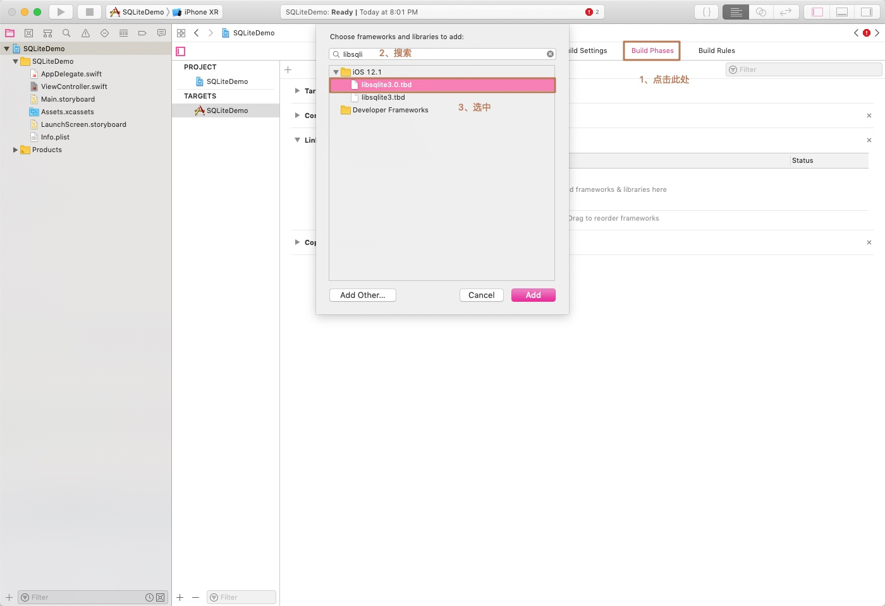
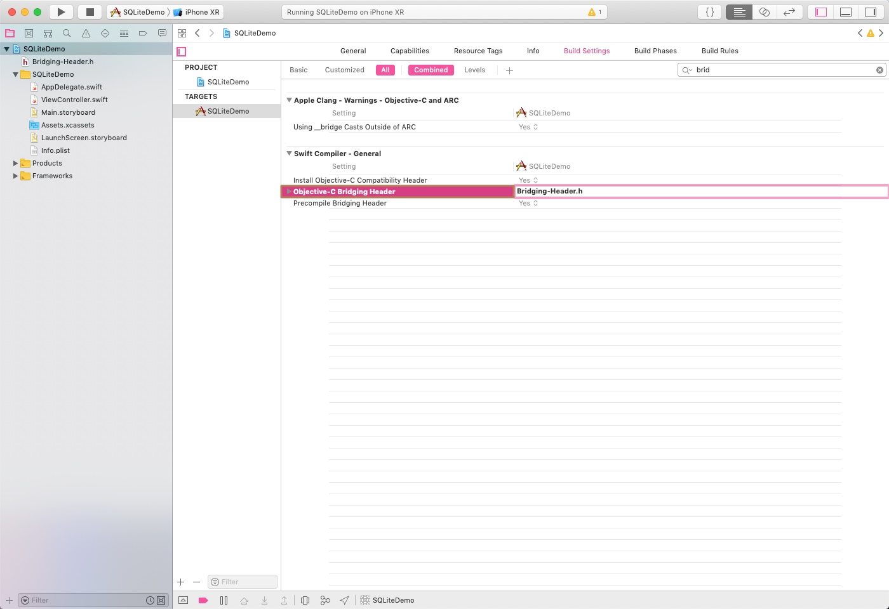

# SQLite3

## 介绍
SQLite3，是iOS的嵌入式SQL数据库，在存储和检索大量数据方面非常有效。它还能对数据进行复杂的聚合，与使用对象执行这些操作相比，获得结果的速度更快。SQLite是一个很小的c语言链接库，这个链接库本身就完全包含数据库引擎的功能，而且可以嵌入至其他程序中，完成不用往外的设定，主要特点如下：

* 数据库存在于一个单一的二进制文件中，它占用资源非常的低，在嵌入式设备中，可能只需要几百K的内存就够了

* 简单、速度快、稳定，处理数据的速度非常快,效率非常高

* 没有服务器

* 免费，开源软件
 
* 非常适合嵌入式设备，如iOS设备、安卓设备等


> 在那些场景中应用到？

> * 文件格式的应用程序
> * 嵌入式设备和应用
> * 中小型网站
> * Ad hoc磁盘文件的替代品
> * 内部临时数据库
> * 命令行数据集分析工具
* > 数据库教学使用


不适合用于以下场景

* 客户与服务模式的应用（请求响应模式）
* 大型网站
* 大数据集
* 高并发


## 使用SQLite3 

SQLite3使用SQL，所以我们会学习如何在iOS应用中进行设置并与SQLite数据库交互。

### 添加库文件

1、在Build Phases -> Link Binary With Libraries中点击加号，添加libsqlite3.0.tdb到项目中；



2、创建桥接头文件Bridging-Header.h ，然后在头文件通过以下语句中将两个头文件导入：

```swift
#import "sqlite3.h"
#import <time.h>
```

3、在项目中的Build Settings中，将我们创建的头文件给设置成：Objective-C Bridging Header




### 常用函数


1、打开数据库


```
int sqlite3_open(
    const char *filename,   // 数据库的文件路径
    sqlite3 **ppDb          // 数据库实例
);
```

2、执行任何SQL语句

```
int sqlite3_exec(
    sqlite3*,                                  // 一个打开的数据库实例
    const char *sql,                           // 需要执行的SQL语句
    int (*callback)(void*,int,char**,char**),  // SQL语句执行完毕后的回调
    void *,                                    // 回调函数的第1个参数
    char **errmsg                              // 错误信息
);

```

> **注意：**
> 此函数集成了sqlite3_prepare_v2(), sqlite3_step(), sqlite3_finalize()到一条语句，不过需要注意的是因为此函数不返回数据的，所以通常用来执行更新、插入和删除操作。


3、检查SQL语句的合法性（查询前的准备）

```
int sqlite3_prepare_v2(
    sqlite3 *db,            // 数据库实例
    const char *zSql,       // 需要检查的SQL语句
    int nByte,              // SQL语句的最大字节长度
    sqlite3_stmt **ppStmt,  // sqlite3_stmt实例，用来获得数据库数据
    const char **pzTail
);
```

4、查询一行数据


```
int sqlite3_step(sqlite3_stmt*); // 如果查询到一行数据，就会返回SQLITE_ROW
```

5、利用stmt获得某一字段的值（字段的下标从0开始）


```
sqlite3_column_<type>() //获取执行的结果中，某一列的数据，并指定获取的类型（int, text...）,如果内部类型和获取的类型不一致，方法内部将会对内容进行类型转换
```
如下：


```
double sqlite3_column_double(sqlite3_stmt*, int iCol);  // 浮点数据
```

```
int sqlite3_column_int(sqlite3_stmt*, int iCol); // 整型数据
```

```
sqlite3_int64 sqlite3_column_int64(sqlite3_stmt*, int iCol); // 长整型数据
```

```
const void *sqlite3_column_blob(sqlite3_stmt*, int iCol); // 二进制文本数据
```

```
const unsigned char *sqlite3_column_text(sqlite3_stmt*, int iCol);  // 字符串数据
```

6、其他函数

```
sqlite3_close() //关闭之前打开的数据库
sqlite3_finalize() //从内存中删除之前准备好的语句，每一条准备好的语句，都需要删除，否则会资源泄漏
```


### 具体操作

在使用SQLite3之前，必须要打开数据库。用于执行此操作的命令是`sqlite3_open()`，这样将会打开一个现有的数据库。如果指定位置上不存在数据库，则函数会创建一个新的数据库。语法如下：

#### 打开数据库，创建表

```swift
import UIKit

class ViewController: UIViewController {

    /*
     * 此处OpaquePointer为不透明指针，在C或C++中有一类指针在头文件中无法找到具体的定义，
     * 只能拿到类型的名字，而所有的实现细节都是隐藏的，即不透明指针，它的实现和表意对使用者来说是不透明的。
     * 对于数据库的类型为什么使用OpaquePointer？
     * 因为在SQLite3的API中，这个变量是一个sqlite3类型的C语言结构体，
     * Swift不能直接映射C结构体，所以必须将它当成一个不透明指针。
     * 其实我们也不需要通过SWift代码去访问这个结构体的内部，只需要将指针传递给其他SQLite3函数即可。
     */
    var database: OpaquePointer? = nil
    
    override func viewDidLoad() {
        super.viewDidLoad()

        //1、打开数据库
        connectDatabase()
        
        //2、创建表
        createTable()
        
    }

    //打开数据库
    func connectDatabase() {
        
        //构造数据库文件存储路径
        let dataFilePath = URL(fileURLWithPath: getDocumentsDirectory()).appendingPathComponent("database.sqlite")
        
        //在执行sqlite3_open函数时，如果返回值为0，则表示打开成功，否则失败
        if sqlite3_open(dataFilePath.absoluteString, &database) != SQLITE_OK {
            sqlite3_close(database)
            print("数据库无法打开")
        }
    }
    
    //创建一张表
    func createTable() {
        
        //创建一张表：Contacts(Id, Name, Phone)
        let createSQL = "CREATE TABLE IF NOT EXISTS Contacts(Id INTEGER PRIMARY KEY AUTOINCREMENT, Name TEXT, Phone TEXT)"
        
        //构建错误信息句柄，同样的在Swift中的SQLite3 C语言API中，errMsgs的类型是char*，代表了Swift中UnsafeMutablePointer<Int8>类型
        //它必须是一个可变指针，应为sqlite3_exec()l函数需要改变它
        var errMSG: UnsafeMutablePointer<Int8>? = nil
        
        //执行SQL语句
        let result = sqlite3_exec(database, createSQL, nil, nil, &errMSG)
    }

    
    //获取Documents文档路径
    func getDocumentsDirectory() -> String {
        
        let documentDir = NSSearchPathForDirectoriesInDomains(.documentDirectory, .userDomainMask, true)[0]
        
        print(documentDir)
        
        return documentDir
    }
}
```

执行以上代码后，我们打开Documents文件夹即可看到，已经创建了一个名为database.sqlite的数据库，然后在数据库中创建一张表Contacts(Id, Name, Phone)。接下去我们往数据库中插入一些数据

#### 插入数据

```swift
import UIKit

class ViewController: UIViewController {

    /*
     * 此处OpaquePointer为不透明指针，在C或C++中有一类指针在头文件中无法找到具体的定义，
     * 只能拿到类型的名字，而所有的实现细节都是隐藏的，即不透明指针，它的实现和表意对使用者来说是不透明的。
     * 对于数据库的类型为什么使用OpaquePointer？
     * 因为在SQLite3的API中，这个变量是一个sqlite3类型的C语言结构体，
     * Swift不能直接映射C结构体，所以必须将它当成一个不透明指针。
     * 其实我们也不需要通过SWift代码去访问这个结构体的内部，只需要将指针传递给其他SQLite3函数即可。
     */
    var database: OpaquePointer? = nil
    
    override func viewDidLoad() {
        super.viewDidLoad()

        //1、打开数据库
        connectDatabase()
        
        //2、创建表
        createTable()
        
        //3、插入数据
        insertData()
    }

    //打开数据库
    func connectDatabase() {
        
        //构造数据库文件存储路径
        let dataFilePath = URL(fileURLWithPath: getDocumentsDirectory()).appendingPathComponent("database.sqlite")
        
        //在执行sqlite3_open函数时，如果返回值为0，则表示打开成功，否则失败
        if sqlite3_open(dataFilePath.absoluteString, &database) != SQLITE_OK {
            sqlite3_close(database)
            print("数据库无法打开")
        }
    }
    
    //创建一张表
    func createTable() {
        
        //创建一张表：Contacts(Id, Name, Phone)
        let createSQL = "CREATE TABLE IF NOT EXISTS Contacts(Id INTEGER PRIMARY KEY AUTOINCREMENT, Name TEXT, Phone TEXT)"
        
        //构建错误信息句柄，同样的在Swift中的SQLite3 C语言API中，errMsgs的类型是char*，代表了Swift中UnsafeMutablePointer<Int8>类型
        //它必须是一个可变指针，应为sqlite3_exec()l函数需要改变它
        var errMSG: UnsafeMutablePointer<Int8>? = nil
        
        //执行SQL语句
        let result = sqlite3_exec(database, createSQL, nil, nil, &errMSG)
    }
    
    //插入数据
    func insertData() {
        let sql = "INSERT INTO Contacts(Name, Phone) VALUES('Tim','3756384'),('Ramon','7563894'),('Dome','5634584'),('Miss','5634454'),('Frage','9563843'),('Rose','1356387'),('Jack','6432814'),('Hume','75643384')"
        
        var errMSG: UnsafeMutablePointer<Int8>? = nil
        
        //执行SQL语句
        let result = sqlite3_exec(database, sql, nil, nil, &errMSG)
        
    }
    
    //获取Documents文档路径
    func getDocumentsDirectory() -> String {
        
        let documentDir = NSSearchPathForDirectoriesInDomains(.documentDirectory, .userDomainMask, true)[0]
        
        print(documentDir)
        
        return documentDir
    }
}
```

#### 查询数据


```swift
import UIKit

class ViewController: UIViewController {

    /*
     * 此处OpaquePointer为不透明指针，在C或C++中有一类指针在头文件中无法找到具体的定义，
     * 只能拿到类型的名字，而所有的实现细节都是隐藏的，即不透明指针，它的实现和表意对使用者来说是不透明的。
     * 对于数据库的类型为什么使用OpaquePointer？
     * 因为在SQLite3的API中，这个变量是一个sqlite3类型的C语言结构体，
     * Swift不能直接映射C结构体，所以必须将它当成一个不透明指针。
     * 其实我们也不需要通过SWift代码去访问这个结构体的内部，只需要将指针传递给其他SQLite3函数即可。
     */
    var database: OpaquePointer? = nil
    
    override func viewDidLoad() {
        super.viewDidLoad()

        //1、打开数据库
        connectDatabase()
        
        //2、创建表
        //createTable()

        //3、插入数据
        //insertData()
        
        //4、查询数据库中的所有行
        selectData()
    }

    //打开数据库
    func connectDatabase() {
        
        //构造数据库文件存储路径
        let dataFilePath = URL(fileURLWithPath: getDocumentsDirectory()).appendingPathComponent("database.sqlite")
        
        //在执行sqlite3_open函数时，如果返回值为0，则表示打开成功，否则失败
        if sqlite3_open(dataFilePath.absoluteString, &database) != SQLITE_OK {
            sqlite3_close(database)
            print("数据库无法打开")
        }
    }
    
    //创建一张表
    func createTable() {
        
        //创建一张表：Contacts(Id, Name, Phone)
        let createSQL = "CREATE TABLE IF NOT EXISTS Contacts(Id INTEGER PRIMARY KEY AUTOINCREMENT, Name TEXT, Phone TEXT)"
        
        //构建错误信息句柄，同样的在Swift中的SQLite3 C语言API中，errMsgs的类型是char*，代表了Swift中UnsafeMutablePointer<Int8>类型
        //它必须是一个可变指针，应为sqlite3_exec()l函数需要改变它
        var errMSG: UnsafeMutablePointer<Int8>? = nil
        
        //执行SQL语句
        let result = sqlite3_exec(database, createSQL, nil, nil, &errMSG)
    }
    
    //插入数据
    func insertData() {
        let sql = "INSERT INTO Contacts(Name, Phone) VALUES('Tim','3756384'),('Ramon','7563894'),('Dome','5634584'),('Miss','5634454'),('Frage','9563843'),('Rose','1356387'),('Jack','6432814'),('Hume','75643384')"
        
        var errMSG: UnsafeMutablePointer<Int8>? = nil
        
        //执行SQL语句
        let result = sqlite3_exec(database, sql, nil, nil, &errMSG)
        
    }
    
    //查询数据
    func selectData() {
        
        let sql = "SELECT Id, Name, Phone FROM Contacts ORDER BY Name DESC"
        
        //同样的，也将statement当作不透明指针，其类型是sqlite3_stmt类型
        var statement: OpaquePointer? = nil
        
        //当result等于SQLITE_OK，则表示语句准备成功，那么可以开始遍历结果集
        if sqlite3_prepare_v2(database, sql, -1, &statement, nil) == SQLITE_OK {
        
            //遍历结果集，当等于SQLITE_ROW时表示仍然有数据
            while sqlite3_step(statement) == SQLITE_ROW {
                
                //获取数据库中第一列即Id的值，Id为integer类型
                let Id = sqlite3_column_int(statement, 0)
                
                //获取数据库中第二列即Name的值，Name为text类型，但是获取出来的并不是swift的String类型
                //而是const iunsigned char *类型的值,所以需要通过String(cString: UnsafePointer())来转化成String类型
                let nameValue = sqlite3_column_text(statement, 1)
                let name = String(cString: UnsafePointer(nameValue!))
                
                //获取数据库中第三列即Phone的值，Name为text类型
                let phoneValue = sqlite3_column_text(statement, 2)
                let phone = String(cString: UnsafePointer(phoneValue!))
                print("Id:\(Id),name:\(name),phone:\(phone)")
            }
            sqlite3_finalize(statement)
        }
    }
    
    //获取Documents文档路径
    func getDocumentsDirectory() -> String {
        
        let documentDir = NSSearchPathForDirectoriesInDomains(.documentDirectory, .userDomainMask, true)[0]
        
        print(documentDir)
        
        return documentDir
    }
}
```

#### 参数的绑定

我们虽然可以通过创建SQL字符串来插入值，但常用的方法是使用绑定变量的方式来执行数据库的插入操作。要绑定变量插入值，只需要按照正常方式创建SQL语句即可，只不过在SQL字符串中添加一个问号。每个文稿都表示一个需要在语句执行之前进行绑定的变量。然后，准备好SQL语句，将值绑定到各个变量并执行命令。


```swift
import UIKit

class ViewController: UIViewController {

    /*
     * 此处OpaquePointer为不透明指针，在C或C++中有一类指针在头文件中无法找到具体的定义，
     * 只能获得类型的名字，而所有的实现细节都是隐藏的，即不透明指针，它的实现和表意对使用者来说是不透明的。
     * 对于数据库的类型为什么使用OpaquePointer？
     * 因为在SQLite3的API中，这个变量是一个sqlite3类型的C语言结构体，
     * Swift不能直接映射C结构体，所以必须将它当成一个不透明指针。
     * 其实我们也不需要通过SWift代码去访问这个结构体的内部，只需要将指针传递给其他SQLite3函数即可。
     */
    var database: OpaquePointer? = nil
    
    override func viewDidLoad() {
        super.viewDidLoad()

        //1、打开数据库
        connectDatabase()
        
        //2、创建表
        //createTable()

        //3、插入数据
        //insertData()
        
        //4、查询数据库中的所有行
        //selectData()
        
        insertWith(name: "Swift", phone: "1103343034")
        selectData()
    }

    //打开数据库
    func connectDatabase() {
        
        //构造数据库文件存储路径
        let dataFilePath = URL(fileURLWithPath: getDocumentsDirectory()).appendingPathComponent("database.sqlite")
        
        //在执行sqlite3_open函数时，如果返回值为0，则表示打开成功，否则失败
        if sqlite3_open(dataFilePath.absoluteString, &database) != SQLITE_OK {
            sqlite3_close(database)
            print("数据库无法打开")
        }
    }
    
    //创建一张表
    func createTable() {
        
        //创建一张表：Contacts(Id, Name, Phone)
        let createSQL = "CREATE TABLE IF NOT EXISTS Contacts(Id INTEGER PRIMARY KEY AUTOINCREMENT, Name TEXT, Phone TEXT)"
        
        //构建错误信息句柄，同样的在Swift中的SQLite3 C语言API中，errMsgs的类型是char*，代表了Swift中UnsafeMutablePointer<Int8>类型
        //它必须是一个可变指针，应为sqlite3_exec()l函数需要改变它
        var errMSG: UnsafeMutablePointer<Int8>? = nil
        
        //执行SQL语句
        let result = sqlite3_exec(database, createSQL, nil, nil, &errMSG)
    }
    
    //插入数据
    func insertData() {
        
        let sql = "INSERT INTO Contacts(Name, Phone) VALUES('Tim','3756384'),('Ramon','7563894'),('Dome','5634584'),('Miss','5634454'),('Frage','9563843'),('Rose','1356387'),('Jack','6432814'),('Hume','75643384')"
        
        var errMSG: UnsafeMutablePointer<Int8>? = nil
        
        //执行SQL语句
        let result = sqlite3_exec(database, sql, nil, nil, &errMSG)
        
    }
    
    //查询数据
    func selectData() {
        
        let sql = "SELECT Id, Name, Phone FROM Contacts"
        
        //同样的，也将statement当作不透明指针，其类型是sqlite3_stmt类型
        var statement: OpaquePointer? = nil
        
        //当result等于SQLITE_OK，则表示语句准备成功，那么可以开始遍历结果集
        if sqlite3_prepare_v2(database, sql, -1, &statement, nil) == SQLITE_OK {
        
            //遍历结果集，当等于SQLITE_ROW时表示仍然有数据
            while sqlite3_step(statement) == SQLITE_ROW {
                
                //获取数据库中第一列即Id的值，Id为integer类型
                let Id = sqlite3_column_int(statement, 0)
                
                //获取数据库中第二列即Name的值，Name为text类型，但是获取出来的并不是swift的String类型
                //而是const iunsigned char *类型的值,所以需要通过String(cString: UnsafePointer())来转化成String类型
                let nameValue = sqlite3_column_text(statement, 1)
                let name = String(cString: UnsafePointer(nameValue!))
                
                //获取数据库中第三列即Phone的值，Name为text类型
                let phoneValue = sqlite3_column_text(statement, 2)
                let phone = String(cString: UnsafePointer(phoneValue!))
                print("Id:\(Id),name:\(name),phone:\(phone)")
            }
            sqlite3_finalize(statement)
        }
    }
    
    //插入绑定的数据
    func insertWith(name: String, phone: String) {
        //构建sql语句，用name来绑定第一个问号，phone来绑定第二个问号
        let sql = "INSERT INTO Contacts(Name, Phone) VALUES(?,?)"
        
        var statement: OpaquePointer? = nil
        
        if sqlite3_prepare_v2(database, sql, -1, &statement, nil) == SQLITE_OK {
            
            //通过该函数来绑定变量
            
            //将name与phone转化成C语言字符串
            let cName = name.cString(using: String.Encoding.utf8)!
            
            let cPhone = phone.cString(using: String.Encoding.utf8)!
            
            
            sqlite3_bind_text(statement, 1, cName, -1, nil)
            
            sqlite3_bind_text(statement, 2, cPhone, -1, nil)
            
        }
        
        if sqlite3_step(statement) != SQLITE_DONE {
            print("Fail to Insert!")
        }
        sqlite3_finalize(statement)
    }
    
    //获取Documents文档路径
    func getDocumentsDirectory() -> String {
        
        let documentDir = NSSearchPathForDirectoriesInDomains(.documentDirectory, .userDomainMask, true)[0]
        
        print(documentDir)
        
        return documentDir
    }
}
```

根据我们希望使用的数据类型，我们可以选择不同的绑定语句，大部分绑定语句都只有3个参数

* 无论针对那种数据类型，任何绑定函数的第一个参数都指向之前在sqlite3_prepare_v2()调用中使用的sqlite3_stmt；
* 第二个参数是被绑定的变量的索引。它是一个有序的索引的值，表示SQL语句中的第一个问号的索引是1，其后的每个问号都依次按序增加1。
* 第三个参数始终表示应该替换问号的值。

有些绑定函数（比如用于绑定文本和二进制数据的绑定函数）拥有另外两个参数：

* 一个参数是上面第三个参数中传递的数据长度。对于C字符串，可以传递-1来代替字符串的长度，这样函数将使用整个字符串。对于所有其他情况，需指定所传递数据的长度。
* 另一个参数是可选的函数回调，用于在语句执行后完成内存的清理工作。


