# Core Data（一）

Core Data是苹果开发的一个数据持久化框架。Core Data是一款稳定、功能全面的持久化工具。它是从iOS5之后才出现的一个框架，加大了直接使用SQLite数据库的灵活性，它提供了“对象关系映射“(Object Relational Mapping)的功能，即ORM，即能够将Swift或Objective-C对象转化成数据，保存在SQLite数据库文件中，也能够将保存在数据库中的数据还原成Swift或Objecvtiv-C对象，通过Core Data管理应用程序的数据模型，可以极大程度减少需要编写的代码数量。

> Core Data为我们提供了可视化的数据表结构，让我们能够更清晰地看到表与表（实体与实体）之间的关系。Core Data底层仍然是基于SQLite数据库进行存储的，不过是使用Core Data来管理应用程序中的模型层对象。
> 
> CoreData可以使我们更加容易的使用数据库，因为**不需要我们编写任何的SQL语句**，CoreData底层为我们封装好了模型层的大部分工作，这将有效的提升我们的工作效率，也使得数据库操作更加地面向对象。

简单地用下图描述下它的作用：

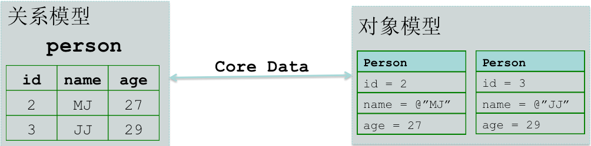


左边是关系模型，即数据库，数据库里面有张person表，person表里面有id、name、age三个字段，而且有2条记录。

右边是对象模型，可以看到，有2个swift对象。
所以利用Core Data框架，我们就可以轻松地将数据库里面的2条记录转换成2个swift对象，也可以轻松地将2个swift对象保存到数据库中，变成2条表记录，而且不用写一条SQL语句。

## 存储过程

我们通过以下内容来了解一下Core Data的存储过程：

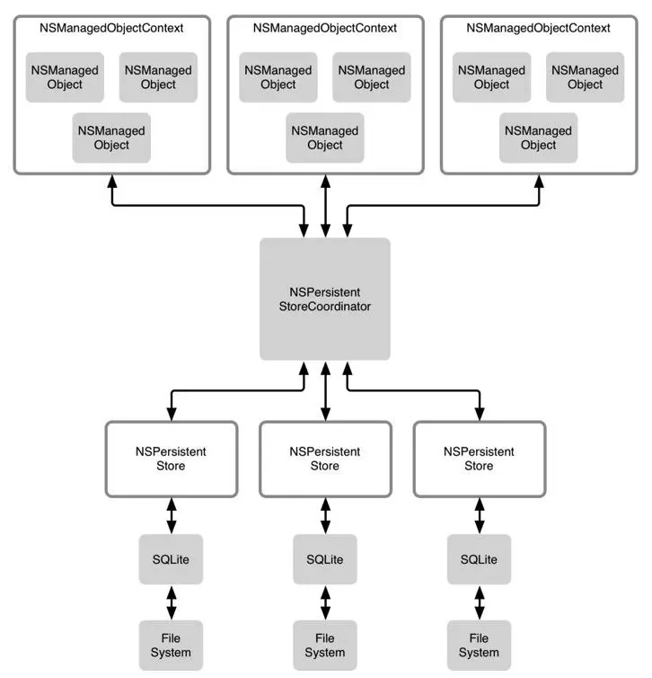


### 分层结构

Core Data把整个数据存储工作分成了两个部分：
1. **模型层** 
2. **持久化层**

**模型层**：即上层，主要通过`NSManagedObjectContext`上下文来管理我们的模型对象NSManagedObject；

**持久化层**：即底层，主要由SQLite实现的持久化部分，通过NSPersistentStore和底层SQL数据库进行交互，完成存储过程。

不过，这两层需要通过NSPersistentStoreCoordinator持久化协调器关联起来的，上层存储的数据交给持久化协调器，然后由协调器指定相关的NSPersistentStore进行数据存取操作。


## 如何使用Core Data

### 一、添加

1、我们使用Core Data需要先添加Core Data，创建项目时，在给项目命名的窗口中，我们需要将 Use Core Data复选框勾上，然后完成新项目的创建：

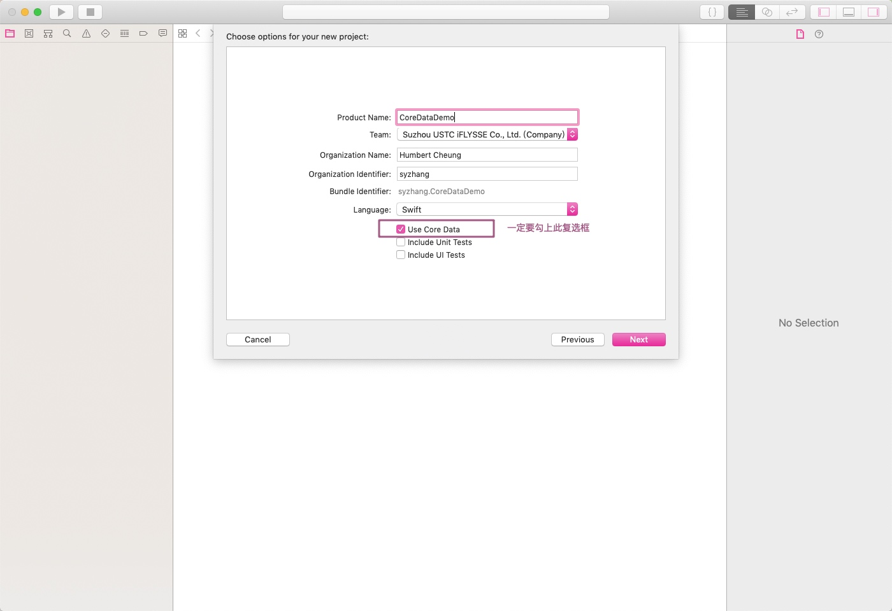

创建好项目后，我们在Xcode的工层目录中可以发现多了一个文件：

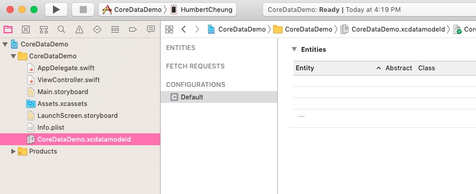

CoreDataDemo.xcdatamodeld，.xcdatamodeld文件是Core Data的数据模型文件，文件名即用的是我们项目名。在Xcode中，Core Data可用于直观地设计数据模型（无需编写代码）并将该数据模型存储在.xcdatamodeld文件中。


2、我们点击xcdatamodeld文件，右侧就打开了数据模型编辑器，我们可以在界面中添加实体，为实体添加属性。在最右侧的属性面板中，我们可以给每个实体设置名字、默认值、最大值、最小值等属性。数据模型编辑器为我们提供了两种视图，我们可以在窗口的右下角的选项处设置编辑器类型。Table模式（默认），数据模型中包含的数据项会显示为一系列可编辑的表；在Graph模式中，数据项是以图形方式来表示的。目前这两个视图都显示了同样的空数据模型。

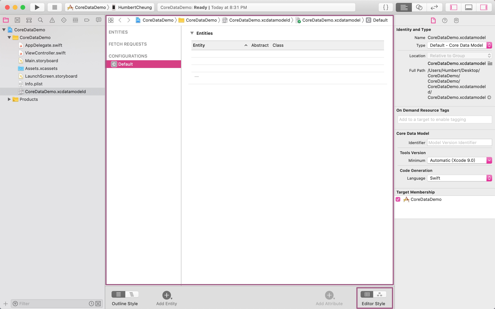


> **注意：**
> 实体的名称首字母必须大写，否则无法保存；
> 属性的名称必须要以小写字母开头。


同时，如果我们打开应用程序的AppDelegate.swift文件，翻到文件底部，我们还会发现程序为我们添加了Core Data部分的代码，主要用来实现Core Data栈的相关操作的，即用来对持久存储的创建和配置的：

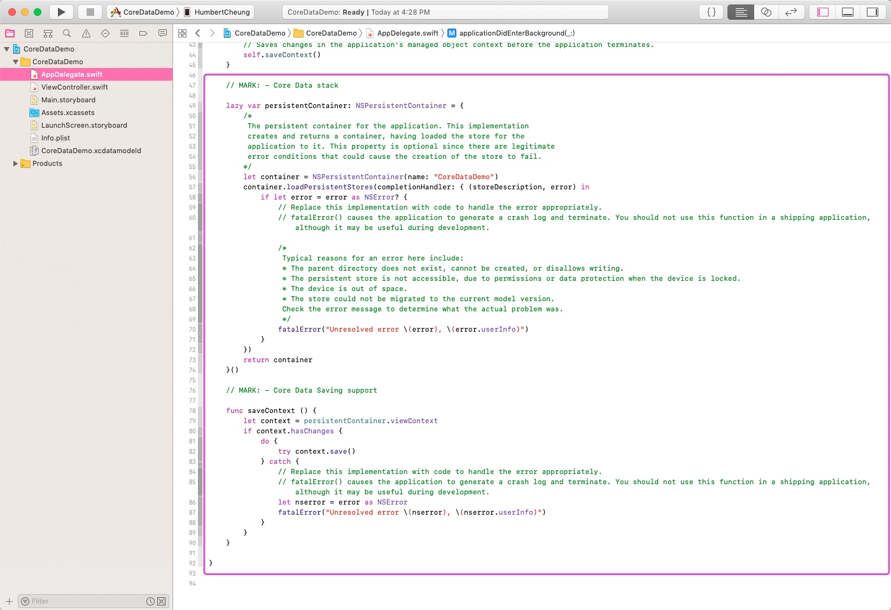


### 实体和托管对象

在使用Core Data之前，如果我们需要将我们的对象进行持久化，传统的方式是对对象进行序列化，即让对象的类遵循NSCoding、NSCopy协议，然后进行归档。Core Data使用了一种完全不同的方式，我们不需要创建类，而是先在数据模型编辑器中创建一些**实体**（Entity），然后在代码中为这些实体创建**托管对象**（Managed Object）。

那什么是实体？什么是托管对象？

1. 首先两者都是用来表示数据模型对象的。
2. 其次，**实体**：表示的是对对象的描述；而**托管对象**表示在运行时创建的该实体的具体实例。
3. 因此，在数据模型编辑器中，我们创建实体；然后在代码中，去创建并检索托管对象。实体和托管对象之间的差异类似于类和对象。

所以大家可以简单的记忆为：

```
  实体     ===>     类
  
托管对象   ===>     对象
```

> **另外**，
> 如果映射到数据库中，实体可以看作是我们在数据库中的表，而托管对象可以看成我们插入表中的一条条记录。


**实体**

实体由属性（property）组成的，属性分为以下三种类型。

**特征（attribute）**：特征在Core Data实体中的作用就相当于类中的成员属性，它们都可以用来保存数据。也相当于数据库中表的字段。

**关系（relationship）**：关系，即用来表示实体与实体间的关系。类似于数据库表与表之间的关系，所以也有“一对一”、“一对多”、“多对多”关系。

**提取属性**：提取属性是关系的备选方法，用提取属性可以创建一个能够在提取时被评估的查询，从而确定哪些对象属于这个关系。例如，一个Person对象拥有一个Neighbors（邻居）的提取属性，该属性查找数据中与Person的Address（家庭住址）拥有相同街道的所有对象。由于提取属性的结构和使用方式，它们通常都是一对一关系。所以，提取属性也是唯一一种能够让我们跨越多个存储的关系。

通常，实体的特性、关系和提取属性都是使用Xcode的数据模型编辑器定义的。


**添加实体**

点击编辑器左下方的Add Entity按钮可添加实体，在实体界面可设置和添加相应的属性，如下，我们创建了一个Student实体，同时添加了age、sex、name、stuNo属性，并将age属性的最小值设置为0，最大值设置为120：

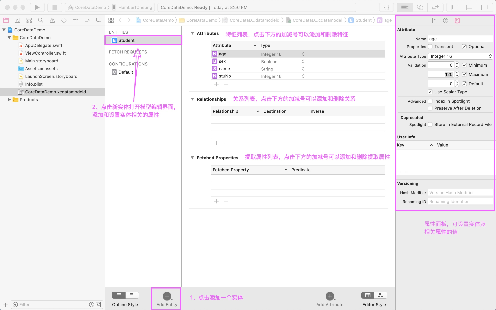


### 运行原理

**1、键-值编码**

我们的代码中不在使用存取方法和修改方法，而是使用键-值编码来存储和检索的。在操作托管对象时，用于设置和检索属性值的**键就是**要设置的**特征的名称**，因此，要从托管对象中检索存储子name中的值，与操作字典的用法类似的，需要调用以下方法：

```swift
let name = myManagedObject.valueForKey("name")
```
同样的，要为托管对象的属性设置新值，则可以执行以下操作：


```swift
myManagedObject.setValue("Humbert", forKey: "name")
```

**2、在上下文中结合它们**

那么，这些托管对象的活动区域在哪里呢？它们位于**持久存储**中，又是也称为“支持存储”。持久存储可以采用多种不同的形式，默认情况下，Core Data应用将支持存储实现为：**存储在应用沙箱Library->Application Support子目录中的SQLite数据库中**。虽然数据是通过SQLite存储的，但是Core Data框架中的类将完成与加载和保存数据相关的所有工作，不需要编写任何SQL语句。

在创建完持久存储后，我们通常不会直接操作持久存储，而是使用所谓的**托管对象上下文**（通常称为上下文）。上下文协调对持久存储的访问，同时保存自上次保存对象以来修改过的属性信息。上下文还能通过撤销管理器来注册所有更改，这意味着我们还可以撤销单个操作或者会滚到上次保存的数据。

**核心数据调用类：NSManagedObjectContext（托管对象上下文）**

许多核心的数据调用都需要NSManagedObjectContext做为参数，或者在上下文中执行。

**3、创建新的托管对象**

创建托管对象使用NSEntityDescription类中的insertNewObjectForEntityForName(_, inManagedObjectContext:)工厂方法。NSEntityDescription的工作是**跟踪**在应用的数据模型中定义的**所有实体**，并**让我们去创建这些实体的实例**。此方法创建并返回一个实例，即NSManagedObject实例，如果使用的是NSManagedObject的子类，那么会返回该类的实例。

创建新对象的方法如下：

```swift
let aStudent = NSEntityDescription.insertNewObjectForEntityForName("hStudent", inManagedObjectContext: context)
```

当下一次托管对象上下文的save方法被调用时，这个对象将被添加到持久存储中。

**4、获取托管对象**

当我们要从持久存储中获取托管的对象时，可以使用**获取请求（fetch request）**，这是Core Data处理预定义的查询的方式。首次创建获取请求之后，需要为它提供一个NSEntityDescription，指定希望检索的一个或多个实体对象：


```swift
let fetchRequest = NSFetchRequest<NSFetchRequestResult>()
let entityDesc = NSEntityDescription.entity(forEntityName: "hStudent", in: context)
fetchRequest.entity = entityDesc
```

创建了获取请求后，我们使用NSManagedObjectContext中的实例方法来执行获取请求：


```swift
do {
    //将查询j的结果保存起来
    objects = try context.fetch(request) as? [NSManagedObject]
    
    //查询成功，objects中有值
    for object in objects! {
        //遍历结果，处理结果
    }
} catch {
    //查询结果没有内容
    if objects == nil {
        //提示错误
    }
}
```

通过`fetch(_ request: NSFetchRequest<NSFetchRequestResult>) throws -> [Any]`方法来查询，因为fetch方法被关键字throws修饰，所以会抛出异常，那么我们在调用该方法时需要在调用方法的语句前加上try关键字，同时还需要对异常进行处理，通过do-catch语句来处理


### Core Data 的应用

**添加实体**

我们在数据模型编辑器中添加一个实体KContact，然后给他添加age、lineNumber、name特征，并将lineNumber、name的Optional去掉，即不可为空，如下：

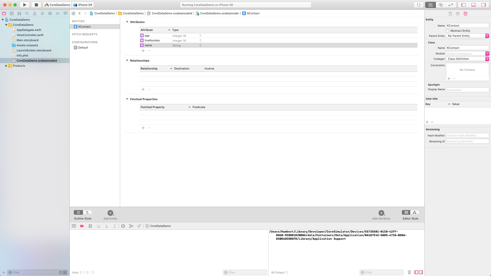

**示例**

**一、查询**

    1.接下去我们在ViewController中进行查询，首先需要先通过import命令，导入CoreData文件
    
    2.因为后续我们获取对象数据时需要通过键-值编码方式，所以将实体的几个属性和实体名声明为常量
    如下：
        //为实体中的key创建常量
        private let KContact = "KContact"
        
        private let KContactName = "name"
        
        private let KContactAge = "age"
        
        private let KContactLineNumber = "lineNumber"
        
    3.然后我们去请求数据：
    
        a. 获取托管对象上下文，我们可以通过AppDelegate中persistentContainer的viewContext属性来获取，如下：
        
            let appDelegate = UIApplication.shared.delegate as! AppDelegate
            let context = appDelegate.persistentContainer.viewContext
        
        b. 接着创建NSFetchRequest查询请求，如下：
        
            let request = NSFetchRequest<NSFetchRequestResult>()
            
        c. 创建需要查询的实体，如下：
        
            let entityDesc = NSEntityDescription.entity(forEntityName: KContact, in: context)
            
        d. 将查询请求与实体关联上，如下：
        
            request.entity = entityDesc

        e. 最后执行查询。
        

完整代码如下：

```swift
import UIKit
import CoreData

class ViewController: UIViewController {
    
    //为实体中的key创建常量
    private let KContact = "KContact"
    
    private let KContactName = "name"
    
    private let KContactAge = "age"
    
    private let KContactLineNumber = "lineNumber"
    

    override func viewDidLoad() {
        super.viewDidLoad()
        
        print(getAppSupportDirecory())
        
        //获取AppDelegate对象
        let appDelegate = UIApplication.shared.delegate as! AppDelegate
        
        //通过AppDelegate对象的persistentContainer获取托管对象上下文
        let context = appDelegate.persistentContainer.viewContext
        
        //创建查询请求
        let request = NSFetchRequest<NSFetchRequestResult>()
        
        //创建实体
        let entityDesc = NSEntityDescription.entity(forEntityName: KContact, in: context)
        
        //把查询请求与实体关联上
        request.entity = entityDesc
        
        //创建一个用来保存查询后的数据的数组
        var objects: [NSManagedObject]?
        
        /*
         * 通过fetch(_ request: NSFetchRequest<NSFetchRequestResult>) throws -> [Any]方法来查询
         * 因为fetch方法被关键字throws修饰，所以会抛出异常，
         * 那么我们在调用该方法时需要在调用方法的语句前加上try关键字
         * 同时还需要对异常进行处理，通过do-catch语句来处理
        */
        do {
            //将查询j的结果保存起来
            objects = try context.fetch(request) as? [NSManagedObject]
            
            //查询成功，objects中有值
            for contact in objects! {
                let lineNumber = contact.value(forKey: KContactLineNumber)
                let name = contact.value(forKey: KContactName)
                let age = contact.value(forKey: KContactAge)
                print("LineNumber->\(String(describing: lineNumber)),Name->\(String(describing: name)),Age->\(String(describing: age))")
            }
        } catch {
            //查询结果没有内容
            if objects == nil {
                print("无内容")
            }
        }
        
    }

    //获取Application Support目录
    func getAppSupportDirecory() -> String {
        
        let appSupportDir = NSSearchPathForDirectoriesInDomains(.applicationSupportDirectory, .userDomainMask, true)[0]
        
        return appSupportDir
    }
    
}
```

以上代码执行后，程序会为我们创建数据库文件，我们打开Application Support目录即可看到：

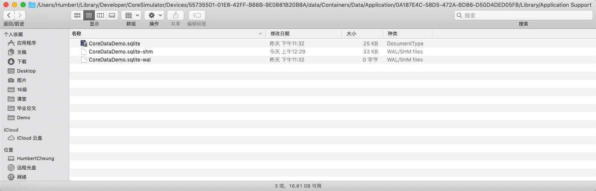

打开数据库文件，可以看到程序为我们创建的数据库：

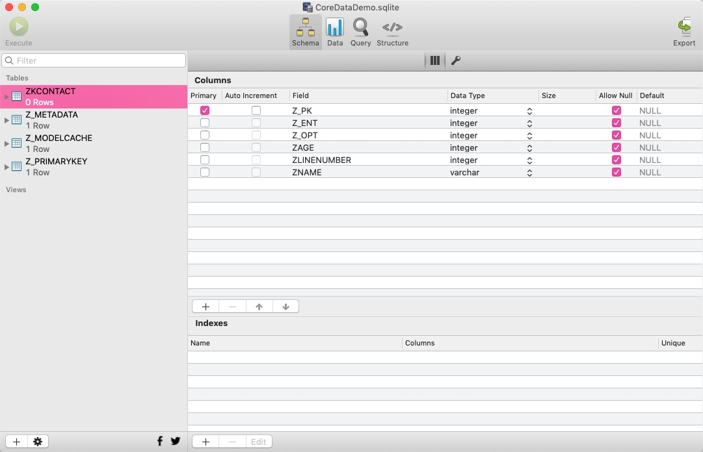


最后总结一下涉及到的几个对象：

1. NSManagedObject：数据模型（实体），加载模型文件，读取app中的所有实体信息；

2. NSPersistentCoordinator：模型层和持久化层的协调器，添加持久化库(这里采取SQLite数据库)

3. NSManagedObjectContext：获取数据模型的上下文，进行CRUD操作

**二、插入**


```swift
import UIKit
import CoreData

class ViewController: UIViewController {
    
    //为实体中的key创建常量
    private let KContact = "KContact"
    
    private let KContactName = "name"
    
    private let KContactAge = "age"
    
    private let KContactLineNumber = "lineNumber"
    

    override func viewDidLoad() {
        super.viewDidLoad()
        
        print(getAppSupportDirecory())
        
        //获取AppDelegate对象
        let appDelegate = UIApplication.shared.delegate as! AppDelegate
        
        //通过AppDelegate对象的persistentContainer获取托管对象上下文
        let context = appDelegate.persistentContainer.viewContext
        
        //创建查询请求
        let request = NSFetchRequest<NSFetchRequestResult>()
        
        //创建实体
        let entityDesc = NSEntityDescription.entity(forEntityName: KContact, in: context)
        
        //把查询请求与实体关联上
        request.entity = entityDesc
        
        //创建一个用来保存查询后的数据的数组
        var objects: [NSManagedObject]?
        
        /*
         * 通过fetch(_ request: NSFetchRequest<NSFetchRequestResult>) throws -> [Any]方法来查询
         * 因为fetch方法被关键字throws修饰，所以会抛出异常，
         * 那么我们在调用该方法时需要在调用方法的语句前加上try关键字
         * 同时还需要对异常进行处理，通过do-catch语句来处理
        */
        do {
            //将查询j的结果保存起来
            objects = try context.fetch(request) as? [NSManagedObject]
            
            //查询成功，objects中有值
            for contact in objects! {
                let lineNumber = contact.value(forKey: KContactLineNumber)
                let name = contact.value(forKey: KContactName)
                let age = contact.value(forKey: KContactAge)
                print("LineNumber->\(String(describing: lineNumber)),Name->\(String(describing: name)),Age->\(String(describing: age))")
            }
        } catch {
            //查询结果没有内容
            if objects == nil {
                print("无内容")
            }
        }
        
        //如果数组为空，则插入数据
        if objects?.count == 0 {
            
            //1、创建需要插入的托管对象
            let contact1 = NSEntityDescription.insertNewObject(forEntityName: KContact, into: context)
            
            //2、给托管对象设置相应的属性
            contact1.setValue(1, forKey: KContactLineNumber)
            contact1.setValue("Humbert", forKey: KContactName)
            contact1.setValue(18, forKey: KContactAge)
            
            let contact2 = NSEntityDescription.insertNewObject(forEntityName: KContact, into: context)
            contact2.setValue(2, forKey: KContactLineNumber)
            contact2.setValue("Nohra", forKey: KContactName)
            contact2.setValue(17, forKey: KContactAge)
            
            //3、执行保存操作
            appDelegate.saveContext()
        }
    }

    //获取Application Support目录
    func getAppSupportDirecory() -> String {
        
        let appSupportDir = NSSearchPathForDirectoriesInDomains(.applicationSupportDirectory, .userDomainMask, true)[0]
        
        return appSupportDir
    }
}
```

我们打开数据库：

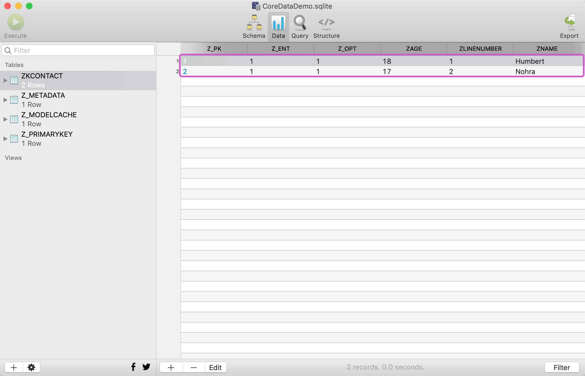


如上，已成功插入两条数据。

不过，以上的代码还存在一定的问题，我们在创建托管对象时，创建的是NSManagedObject类型，所以每次在给属性进行赋值都需要通过setValue和valueForKey的方式，比较麻烦。那么，我们可以打开数据模型编辑器，选中我们设计的模型，生成模型所对应的类：

1、选中模型，在右侧的属性面板中将Codegen修改成“Manual/None”

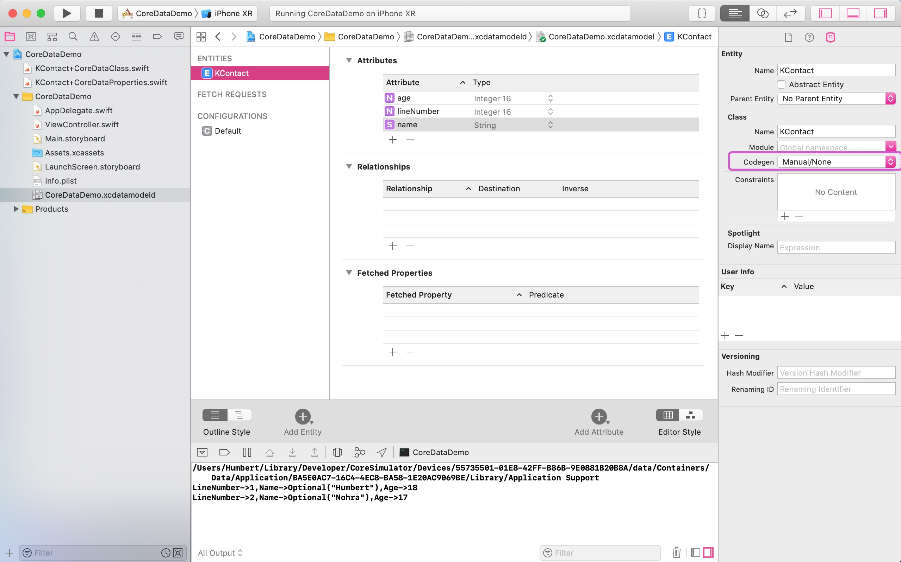


2、选中模型，点击 Editor，选择Create NSManagedObject Subclass：

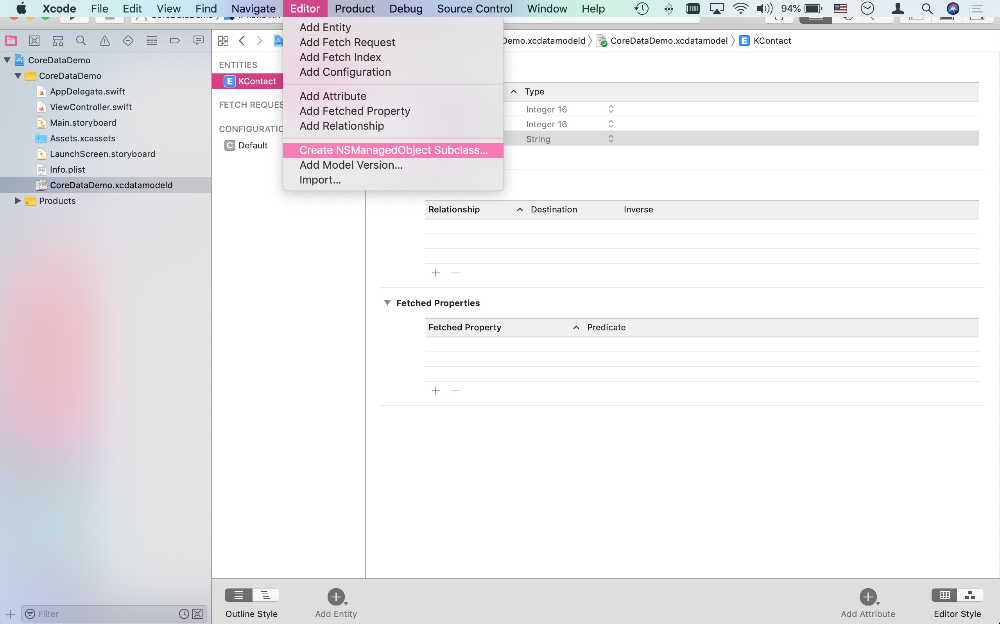

3、然后next、next、create就创建好了，在左侧导航区就生成了两个文件：CoreDataClass和CoreDataProperties文件。

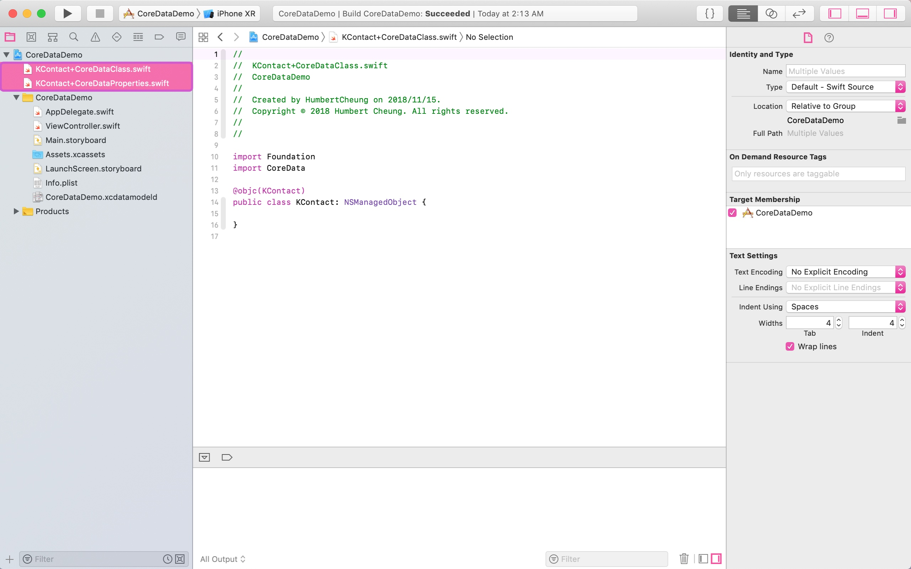


这两个类其实是KContact类的扩展，所以我们在使用时直接使用KContact即可，将代码中的托管对象NSManagedObject替换成KContact，然后通过.语法来给属性赋值和取值：

```swift
import UIKit
import CoreData

class ViewController: UIViewController {
    
    //为实体中的key创建常量
    private let KContact = "KContact"
    
    private let KContactName = "name"
    
    private let KContactAge = "age"
    
    private let KContactLineNumber = "lineNumber"
    

    override func viewDidLoad() {
        super.viewDidLoad()
        
        print(getAppSupportDirecory())
        
        //获取AppDelegate对象
        let appDelegate = UIApplication.shared.delegate as! AppDelegate
        
        //通过AppDelegate对象的persistentContainer获取托管对象上下文
        let context = appDelegate.persistentContainer.viewContext
        
        //创建查询请求
        let request = NSFetchRequest<NSFetchRequestResult>()
        
        //创建实体
        let entityDesc = NSEntityDescription.entity(forEntityName: KContact, in: context)
        
        //把查询请求与实体关联上
        request.entity = entityDesc
        
        //创建一个用来保存查询后的数据的数组
        var objects: [KContact]?
        
        /*
         * 通过fetch(_ request: NSFetchRequest<NSFetchRequestResult>) throws -> [Any]方法来查询
         * 因为fetch方法被关键字throws修饰，所以会抛出异常，
         * 那么我们在调用该方法时需要在调用方法的语句前加上try关键字
         * 同时还需要对异常进行处理，通过do-catch语句来处理
        */
        do {
            //将查询j的结果保存起来
            objects = try context.fetch(request) as? [KContact]
            
            //查询成功，objects中有值
            for contact in objects! {
                let lineNumber = contact.lineNumber
                let name = contact.name
                let age = contact.age
                print("LineNumber->\(String(describing: lineNumber)),Name->\(String(describing: name)),Age->\(String(describing: age))")
            }
        } catch {
            //查询结果没有内容
            if objects == nil {
                print("无内容")
            }
        }
        
        //如果数组为空，则插入数据
        if objects?.count == 0 {
            
            //1、创建需要插入的托管对象
            let contact1 = NSEntityDescription.insertNewObject(forEntityName: KContact, into: context) as! KContact
            
            //2、给托管对象设置相应的属性
            contact1.lineNumber = 1
            contact1.name = "Terry"
            contact1.age = 18
            
            let contact2 = NSEntityDescription.insertNewObject(forEntityName: KContact, into: context) as! KContact
            contact2.lineNumber = 1
            contact2.name = "Bob"
            contact2.age = 17
            
            //3、执行保存操作
            appDelegate.saveContext()
        }
    }

    //获取Application Support目录
    func getAppSupportDirecory() -> String {
        
        let appSupportDir = NSSearchPathForDirectoriesInDomains(.applicationSupportDirectory, .userDomainMask, true)[0]
        
        return appSupportDir
    }
}
```

**三、更新**

接下去我们来进行更新操作，因为我们在很多地方都需要用到appDelegate对象和context对象，所以我们把这两个对象声明为类的成员属性，然后进行更新操作：


```swift
import UIKit
import CoreData

class ViewController: UIViewController {
    
    //为实体中的key创建常量
    private let KContactKey = "KContact"
    
    private let KContactName = "name"
    
    private let KContactAge = "age"
    
    private let KContactLineNumber = "lineNumber"
    
    var appDelegate: AppDelegate?
    
    var context: NSManagedObjectContext?
    

    override func viewDidLoad() {
        super.viewDidLoad()
        
        print(getAppSupportDirecory())
        
        //获取AppDelegate对象
        appDelegate = UIApplication.shared.delegate as? AppDelegate
        
        //通过AppDelegate对象的persistentContainer获取托管对象上下文
        context = appDelegate!.persistentContainer.viewContext
        
        //创建查询请求
        let request = NSFetchRequest<NSFetchRequestResult>()
        
        //创建实体
        let entityDesc = NSEntityDescription.entity(forEntityName: KContactKey, in: context!)
        
        //把查询请求与实体关联上
        request.entity = entityDesc
        
        //创建一个用来保存查询后的数据的数组
        var objects: [KContact]?
        
        /*
         * 通过fetch(_ request: NSFetchRequest<NSFetchRequestResult>) throws -> [Any]方法来查询
         * 因为fetch方法被关键字throws修饰，所以会抛出异常，
         * 那么我们在调用该方法时需要在调用方法的语句前加上try关键字
         * 同时还需要对异常进行处理，通过do-catch语句来处理
        */
        do {
            //将查询j的结果保存起来
            objects = try context!.fetch(request) as? [KContact]
            
            //查询成功，objects中有值
            for contact in objects! {
                let lineNumber = contact.lineNumber
                let name = contact.name
                let age = contact.age
                print("LineNumber->\(String(describing: lineNumber)),Name->\(String(describing: name)),Age->\(String(describing: age))")
            }
        } catch {
            //查询结果没有内容
            if objects == nil {
                print("无内容")
            }
        }
        
        //如果数组为空，则插入数据
        if objects?.count == 0 {
            
            //1、创建需要插入的托管对象
            let contact1 = NSEntityDescription.insertNewObject(forEntityName: KContactKey, into: context!) as! KContact
            
            //2、给托管对象设置相应的属性
            contact1.lineNumber = 1
            contact1.name = "Terry"
            contact1.age = 18
            
            let contact2 = NSEntityDescription.insertNewObject(forEntityName: KContactKey, into: context!) as! KContact
            contact2.lineNumber = 1
            contact2.name = "Bob"
            contact2.age = 17
            
            //3、执行保存操作
            appDelegate!.saveContext()
        }
        
        //查询操作
        updateContact(keyWord: "Terry")
        
    }
    
    //更新数据的操作
    func updateContact(keyWord: String) {
        
        let aContact = NSEntityDescription.entity(forEntityName: KContactKey, in: context!)
        
        let fetchRequest = NSFetchRequest<NSFetchRequestResult>()
        
        fetchRequest.entity = aContact
        
        //创建查询谓词，即查询条件，查询name属性值等于keyword的记录
        let predicate = NSPredicate(format: "name==%@", keyWord)
        
        //给查询设置条件
        fetchRequest.predicate = predicate
        
        var objects: [KContact]?
        
        do {
            objects = try context!.fetch(fetchRequest) as? [KContact]
            
            //遍历查询结果
            for object in objects! {
                //更新记录
                object.age = 28
            }
            
            appDelegate?.saveContext()
            
        } catch  {
            
            //查询结果没有内容
            if objects == nil {
                print("无内容")
            }
        }
    }

    //获取Application Support目录
    func getAppSupportDirecory() -> String {
        
        let appSupportDir = NSSearchPathForDirectoriesInDomains(.applicationSupportDirectory, .userDomainMask, true)[0]
        
        return appSupportDir
    }
}
```


结果如下图：

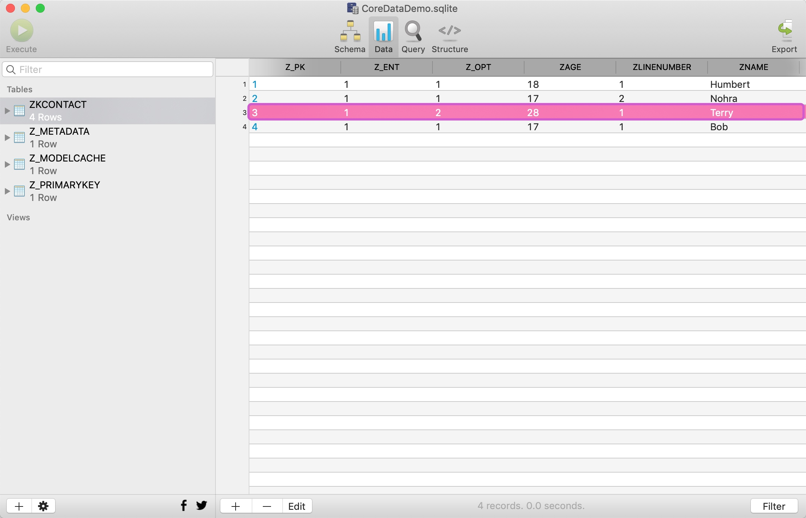


