# Core Data（二）

上次课程中，我们学习了通过Core Data向数据库中插入、更新数据和查询数据，今天我们来看看删除数据，删除数据与更新数据类似，在查询到数据遍历的过程中将数据删除即可：


```swift
import UIKit
import CoreData

class ViewController: UIViewController {
    
    //为实体中的key创建常量
    private let KContactKey = "KContact"
    
    private let KContactName = "name"
    
    private let KContactAge = "age"
    
    private let KContactLineNumber = "lineNumber"
    
    var appDelegate: AppDelegate?
    
    var context: NSManagedObjectContext?
    

    override func viewDidLoad() {
        super.viewDidLoad()
        
        print(getAppSupportDirecory())
        
        //获取AppDelegate对象
        appDelegate = UIApplication.shared.delegate as? AppDelegate
        
        //通过AppDelegate对象的persistentContainer获取托管对象上下文
        context = appDelegate!.persistentContainer.viewContext
        
        //创建查询请求
        let request = NSFetchRequest<NSFetchRequestResult>()
        
        //创建实体
        let entityDesc = NSEntityDescription.entity(forEntityName: KContactKey, in: context!)
        
        //把查询请求与实体关联上
        request.entity = entityDesc
        
        //创建一个用来保存查询后的数据的数组
        var objects: [KContact]?
        
        /*
         * 通过fetch(_ request: NSFetchRequest<NSFetchRequestResult>) throws -> [Any]方法来查询
         * 因为fetch方法被关键字throws修饰，所以会抛出异常，
         * 那么我们在调用该方法时需要在调用方法的语句前加上try关键字
         * 同时还需要对异常进行处理，通过do-catch语句来处理
        */
        do {
            //将查询j的结果保存起来
            objects = try context!.fetch(request) as? [KContact]
            
            //查询成功，objects中有值
            for contact in objects! {
                let lineNumber = contact.lineNumber
                let name = contact.name
                let age = contact.age
                print("LineNumber->\(String(describing: lineNumber)),Name->\(String(describing: name)),Age->\(String(describing: age))")
            }
        } catch {
            //查询结果没有内容
            if objects == nil {
                print("无内容")
            }
        }
        
        //如果数组为空，则插入数据
        if objects?.count == 0 {
            
            //1、创建需要插入的托管对象
            let contact1 = NSEntityDescription.insertNewObject(forEntityName: KContactKey, into: context!) as! KContact
            
            //2、给托管对象设置相应的属性
            contact1.lineNumber = 1
            contact1.name = "Terry"
            contact1.age = 18
            
            let contact2 = NSEntityDescription.insertNewObject(forEntityName: KContactKey, into: context!) as! KContact
            contact2.lineNumber = 1
            contact2.name = "Bob"
            contact2.age = 17
            
            //3、执行保存操作
            appDelegate!.saveContext()
        }
        
        //查询操作
        updateContact(keyWord: "Terry")
        
        //删除操作
        deleteContact(byName: "Bob")
        
    }
    
    //更新数据的操作
    func updateContact(keyWord: String) {
        
        let aContact = NSEntityDescription.entity(forEntityName: KContactKey, in: context!)
        
        let fetchRequest = NSFetchRequest<NSFetchRequestResult>()
        
        fetchRequest.entity = aContact
        
        //创建查询谓词，即查询条件，查询name属性值等于keyword的记录
        let predicate = NSPredicate(format: "name==%@", keyWord)
        
        //给查询设置条件
        fetchRequest.predicate = predicate
        
        var objects: [KContact]?
        
        do {
            objects = try context!.fetch(fetchRequest) as? [KContact]
            
            //遍历查询结果
            for object in objects! {
                //更新记录
                object.age = 28
            }
            
            appDelegate?.saveContext()
            
        } catch  {
            
            //查询结果没有内容
            if objects == nil {
                print("无内容")
            }
        }
    }
    
    //删除数据操作
    func deleteContact(byName name: String) {
        
        let aContact = NSEntityDescription.entity(forEntityName: KContactKey, in: context!)
        
        let fetchRequest = NSFetchRequest<NSFetchRequestResult>()
        
        fetchRequest.entity = aContact
        
        let predicate = NSPredicate(format: "name==%@", name)
        
        fetchRequest.predicate = predicate
        
        var objects: [KContact]?
        
        do {
            objects = try context?.fetch(fetchRequest) as? [KContact]
            
            for object in objects! {
                
                //通过上下文，删除查询到的记录
                context?.delete(object)
            }
            
            appDelegate?.saveContext()
            
        } catch {
            if objects == nil {
                print("请求出错！")
            }
        }
    }

    //获取Application Support目录
    func getAppSupportDirecory() -> String {
        
        let appSupportDir = NSSearchPathForDirectoriesInDomains(.applicationSupportDirectory, .userDomainMask, true)[0]
        
        return appSupportDir
    }
}
```

如下，已成功删除name为Bob的记录：

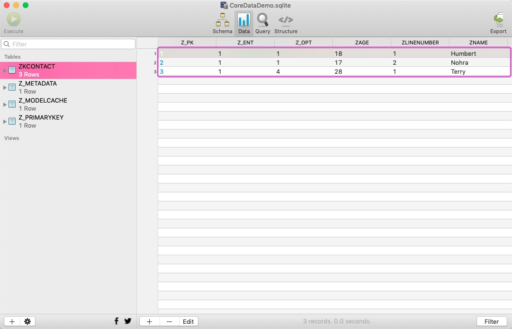


## 实体关系

前面我们学习的是一个实体的增删改查，但是大多时候我们操作的不仅只有一个实体，比如前面提到的Person与Address。那么当多个实体存在的时候，我们就需要考虑实体间的关系，一对多、多对多等。下面，我们就创建两个实体Employee（员工）与Department（部门），并为它们配置关系。

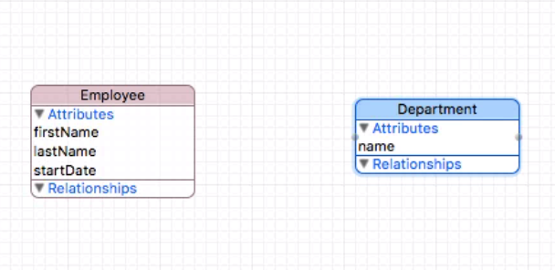

如下：

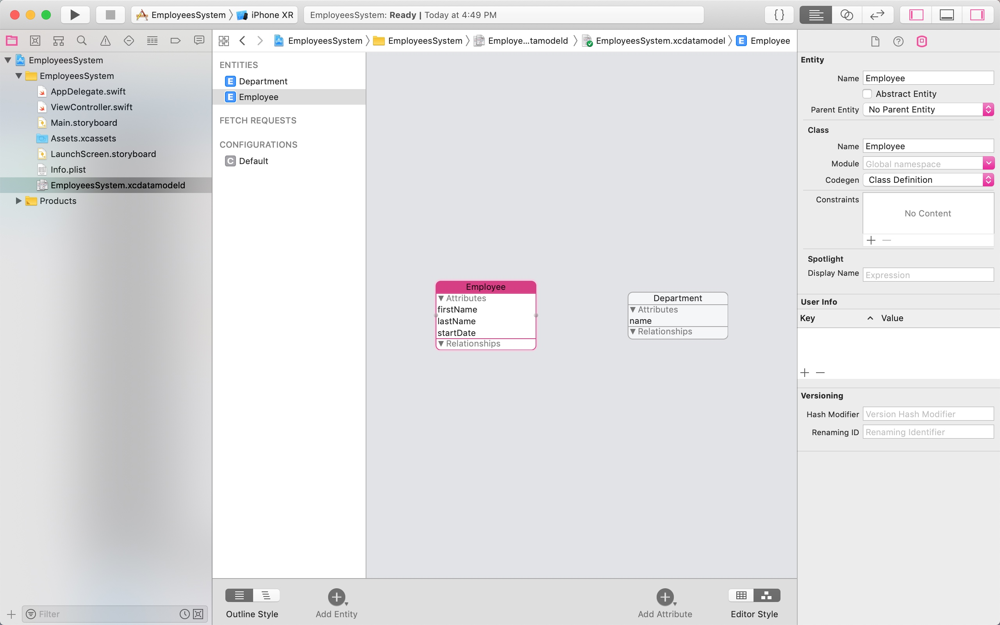


在业务逻辑上，员工（Employee）与部门（Department）之间，员工是属于某个部门的，所以员工表中需要有一个部门的外间，员工与部门间的关系是“一对多”关系。所以，接下去我们需要在编辑器中为员工和部门实体创建关联关系。

1、在Employee实体中，点击Relationships的➕，添加一个关系，命名为department，然后将Destination选择成：**Department**：

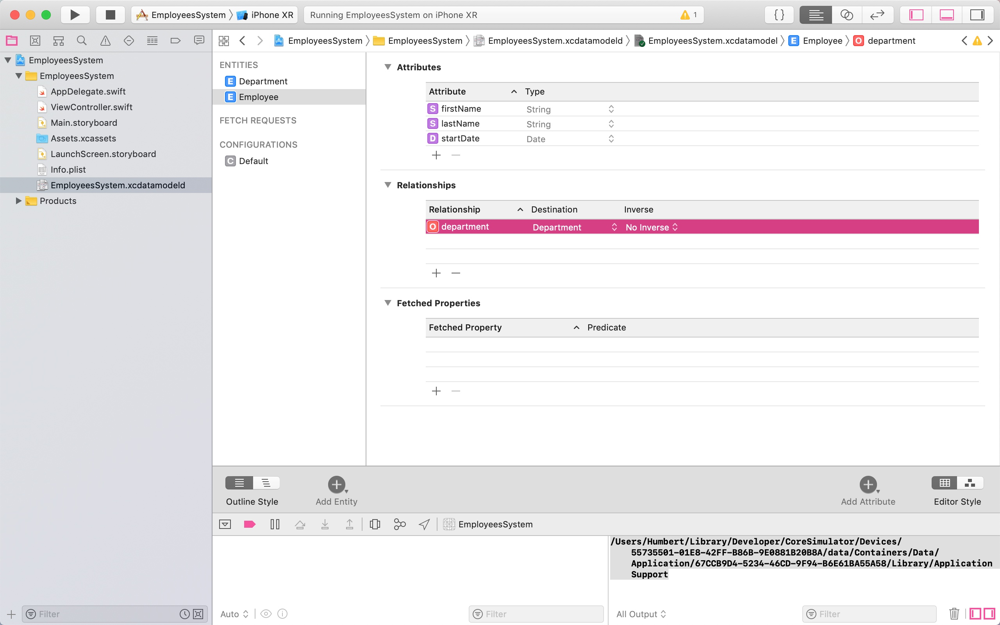


2、在Department实体中，同样也点击Relationships的➕，添加一个关系，命名为employees，然后将Destination选择成：Employee，最后还需要将Inverse设置成department，此操作主要是用来保证对象的完整性，相当于一个完整性约束：

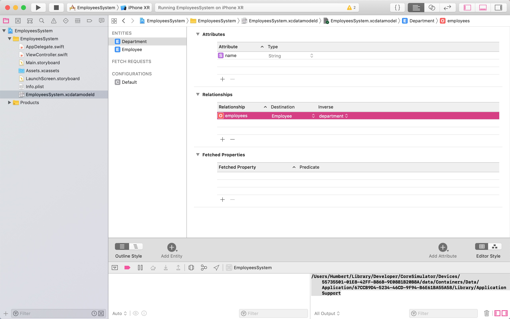

当我们给Department设置了Inverse后，Employee实体中的Inverse也被自动设置成了employees，如下：

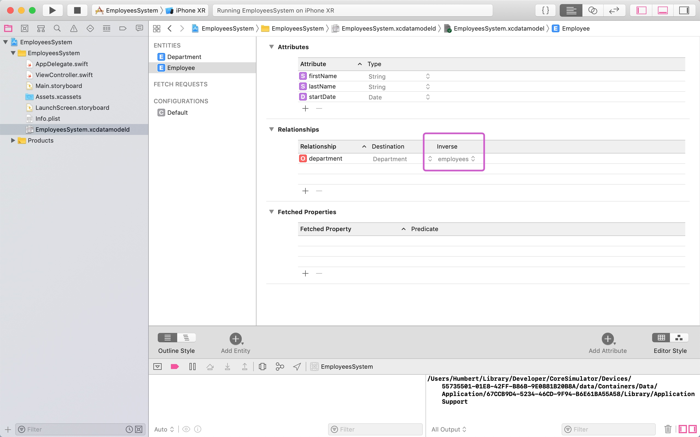


关系创建好后，我们打开图表样式，就可以很直观的看到两个实体间的关联了：

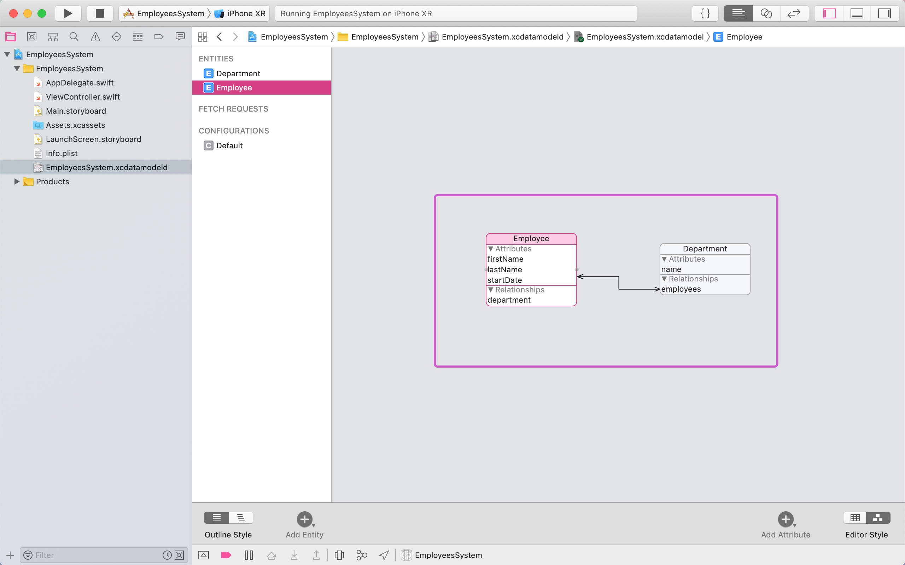

3、设置关系类型。员工与部门的关系是一对多，员工一，部门多，所以需要给两个实体中创建的关系设置一下type，选中关系，在右侧的属性面板中，将**员工**的type设置成**To One**，将员工的department关系的Optional去掉，将**部门**的type设置成**To Many**，如下：

员工：

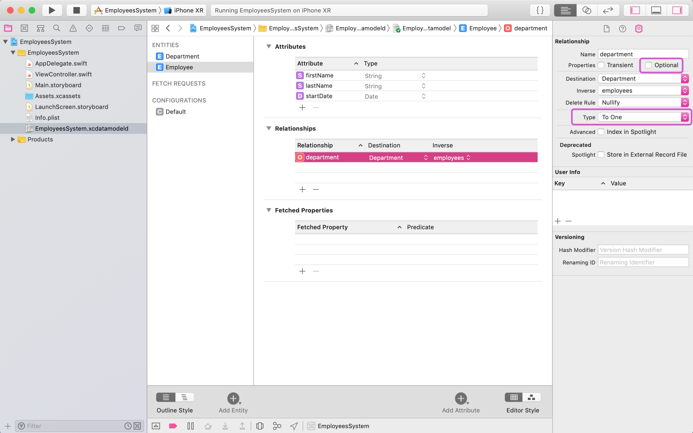


部门：

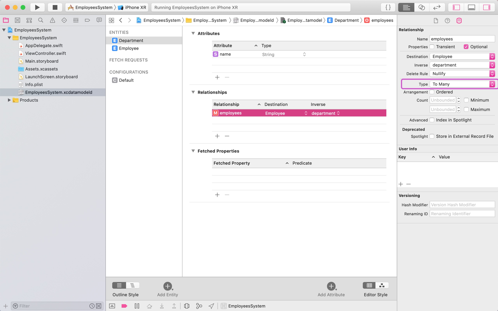


设置好后，我们再打开图表样式，可以看到很直观的一对多关系了：

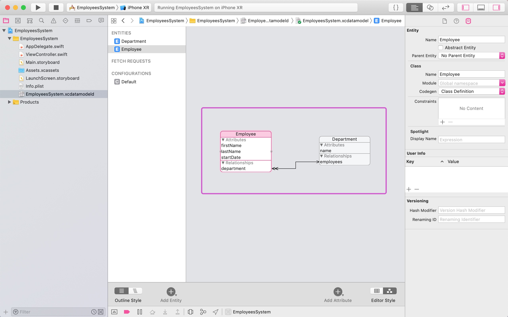

4、然后我们创建两个实体的类文件，将**两个实体的Codegen都设置成Manual/None**，然后同时选中创建，如下：

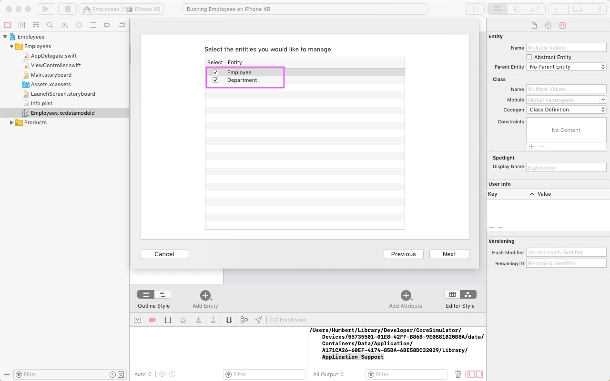


5、最后我们在ViewController中进行查询操作，创建数据库：


```swift
import UIKit
import CoreData

class ViewController: UIViewController {
    
    private let EmployeeKey = "Employee"
    
    private let DepartmentKey = "Department"

    var context: NSManagedObjectContext?
    
    var appDelegate: AppDelegate?
    
    
    override func viewDidLoad() {
        super.viewDidLoad()
        
        print(getAppSuportDirectory())
        
        appDelegate = UIApplication.shared.delegate as? AppDelegate
        
        context = appDelegate?.persistentContainer.viewContext
        
        loadData()
    }

    //加载数据
    func loadData() {
        
        let fetch = NSFetchRequest<NSFetchRequestResult>()
        
        let entity = NSEntityDescription.entity(forEntityName: EmployeeKey, in: context!)
        
        fetch.entity = entity
        
        do {
            try context?.fetch(fetch)
        } catch {
            print("出错了！")
        }
    }
    
    //获取Application Support目录
    func getAppSuportDirectory() -> String {
        let appSuportDir = NSSearchPathForDirectoriesInDomains(.applicationSupportDirectory, .userDomainMask, true)[0]
        
        return appSuportDir
    }
}
```

打开数据库，数据库表创建成功：

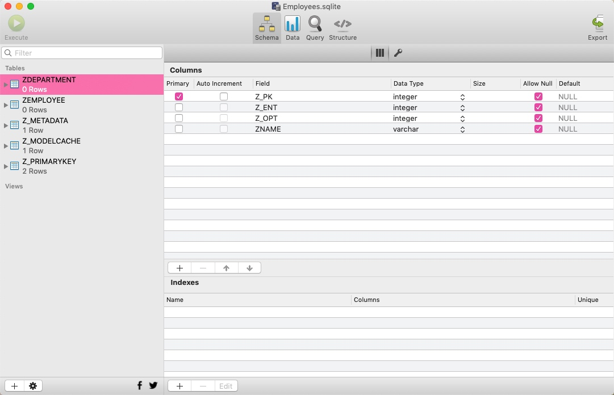

为了方便调试，我们可以重写一下Employee类和Department类的description计算属性：

Employee类

```swift
import Foundation
import CoreData

@objc(Employee)
public class Employee: NSManagedObject {

    public override var description: String {
        
        return "FirstName->\(String(describing: firstName)), LastName->\(String(describing: lastName))"
    }
}
```

Employee类

```swift
import Foundation
import CoreData

@objc(Employee)
public class Employee: NSManagedObject {

    public override var description: String {
        
        return "FirstName->\(String(describing: firstName)), LastName->\(String(describing: lastName))"
    }
}
```

## Core Data 应用


接着上文的案例，我们接下去需要初始化信息，创建一个初始化信息的方法，在该方法中初始化：


```swift
import UIKit
import CoreData

class ViewController: UIViewController {
    
    private let EmployeeKey = "Employee"
    
    private let DepartmentKey = "Department"

    var context: NSManagedObjectContext?
    
    var appDelegate: AppDelegate?
    
    
    override func viewDidLoad() {
        super.viewDidLoad()
        
        print(getAppSuportDirectory())
        
        appDelegate = UIApplication.shared.delegate as? AppDelegate
        
        context = appDelegate?.persistentContainer.viewContext
        
        //初始化数据
        initialData()
        
        //加载数据
        loadData()

    }

    //加载数据
    func loadData() {
        
        let fetch = NSFetchRequest<NSFetchRequestResult>()
        
        let entity = NSEntityDescription.entity(forEntityName: EmployeeKey, in: context!)
        
        fetch.entity = entity
        
        var employees: [Employee]?
        
        do {
            employees = try context?.fetch(fetch) as? [Employee]
            
            for emp in employees! {
                print(emp)
            }
        } catch {
            print("出错了！")
        }
        
        appDelegate?.saveContext()
    }
    
    //初始化数据
    func initialData() {
        
        //初始化部门
        let dept1 = NSEntityDescription.insertNewObject(forEntityName: DepartmentKey, into: context!) as? Department
        dept1?.name = "人事部"
        
        let dept2 = NSEntityDescription.insertNewObject(forEntityName: DepartmentKey, into: context!) as? Department
        dept2?.name = "技术部"
        
        let dept3 = NSEntityDescription.insertNewObject(forEntityName: DepartmentKey, into: context!) as? Department
        dept3?.name = "综合管理部"
        
        let dept4 = NSEntityDescription.insertNewObject(forEntityName: DepartmentKey, into: context!) as? Department
        dept4?.name = "教学研发部"
        
        let dept5 = NSEntityDescription.insertNewObject(forEntityName: DepartmentKey, into: context!) as? Department
        dept5?.name = "教学运营部"
        
        //初始化员工
        let emp1 = NSEntityDescription.insertNewObject(forEntityName: EmployeeKey, into: context!) as? Employee
        emp1?.firstName = "Joan"
        emp1?.lastName = "Niki"
        emp1?.startDate = NSDate()
        emp1?.department = dept2
        
        let emp2 = NSEntityDescription.insertNewObject(forEntityName: EmployeeKey, into: context!) as? Employee
        emp2?.firstName = "Fred"
        emp2?.lastName = "Gray"
        emp2?.startDate = NSDate()
        emp2?.department = dept3
        
        let emp3 = NSEntityDescription.insertNewObject(forEntityName: EmployeeKey, into: context!) as? Employee
        emp3?.firstName = "Lucy"
        emp3?.lastName = "Betty"
        emp3?.startDate = NSDate()
        emp3?.department = dept1
        
        let emp4 = NSEntityDescription.insertNewObject(forEntityName: EmployeeKey, into: context!) as? Employee
        emp4?.firstName = "Charls"
        emp4?.lastName = "Lily"
        emp4?.startDate = NSDate()
        emp4?.department = dept4
        
        let emp5 = NSEntityDescription.insertNewObject(forEntityName: EmployeeKey, into: context!) as? Employee
        emp5?.firstName = "Whitney"
        emp5?.lastName = "William"
        emp5?.startDate = NSDate()
        emp5?.department = dept5
        
        let emp6 = NSEntityDescription.insertNewObject(forEntityName: EmployeeKey, into: context!) as? Employee
        emp6?.firstName = "Natsu"
        emp6?.lastName = "Mako"
        emp6?.startDate = NSDate()
        emp6?.department = dept3
        
        appDelegate?.saveContext()
    }
    
    
    //获取Application Support目录
    func getAppSuportDirectory() -> String {
        let appSuportDir = NSSearchPathForDirectoriesInDomains(.applicationSupportDirectory, .userDomainMask, true)[0]
        
        return appSuportDir
    }
}
```

结果如下：

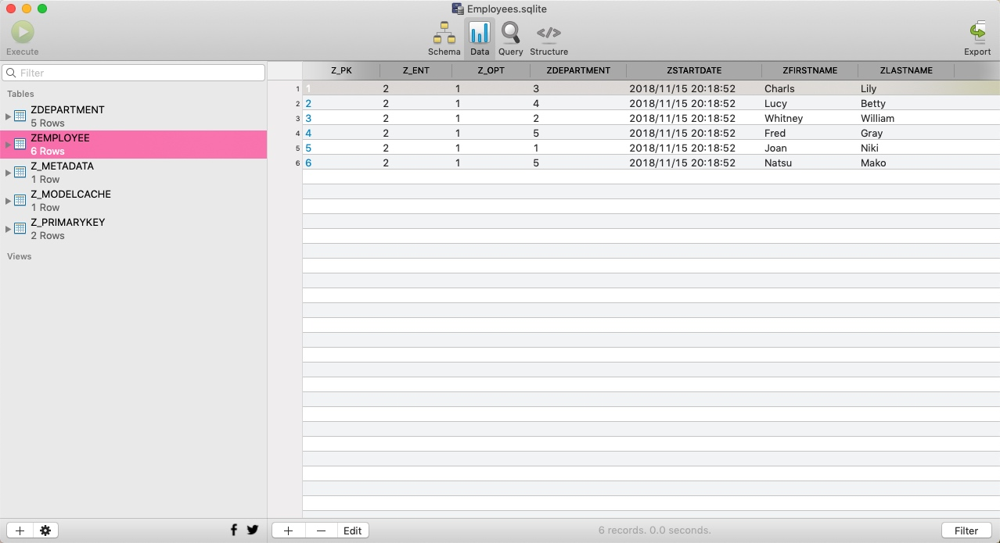


