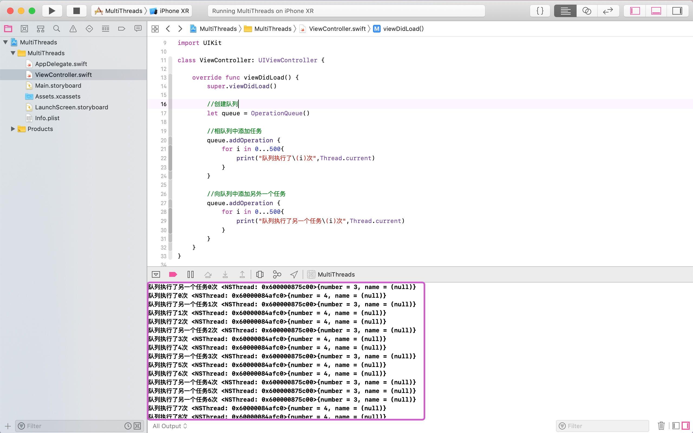
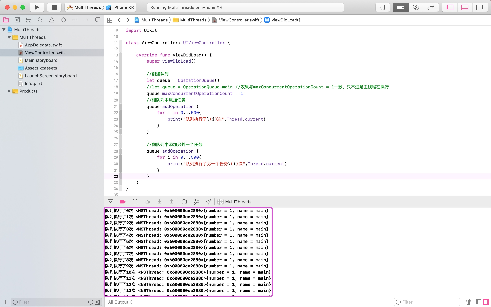
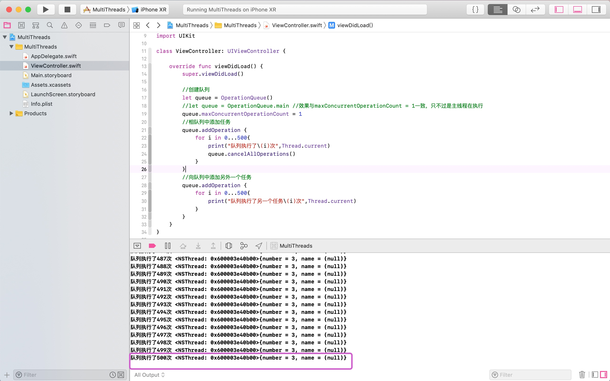
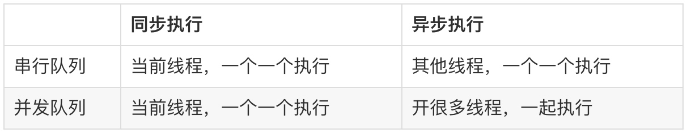

# 多线程


### 线程与进程

**程序**：由代码生成的可执行应用。（例如QQ.app） 

**进程**：一个正在运行的程序可以看做是一个进程。 （例如：正在运行的QQ就是一个进程），进程拥有独立运行所需要的全部资源，一个进程中的所有线程可共享可执行程序代码和全局数据。
 
**线程**：程序中独立运行的代码段。（例如： 接收QQ 消息的代码）一个进程是由一个或者多个线程组成。进程只负责资源的调度和分配，线程才是程序真正懂得执行单元，负责代码的执行。

**单线程**：每个正在运行的程序（即进程），都会有一个线程，这个线程叫做主线程。 主线程在程序启动的时候被创建，用于执行main 函数。 除了主线程就没有其他线程的程序，称作单线程程序。 主线程负责执行程序的所有代码（UI 展现以及刷新，网络请求，本地存储等）。这些代码只能顺序执行，无法并发执行。

**多线程**：拥有多个线程的程序，称作多线程程序。 

> iOS 允许用户自己开辟新的线程，相对主线程来讲，这些线程，称作子线程，子线程和主线程都是独立运行单元，各自的执行互不影响，因此能够并发执行。

**单、多线程程序区别**

单线程程序：只有一个线程，代码顺序执行，容易出现代码阻塞（页面假死）。 
多线程程序：有多个线程，线程间独立运行，能有效地避免代码阻塞，并且提高程序的运行性能。


> **Tips：**
> **多线程优缺点**

> * 优点：可以适当地提高程序的执行效率，也可以适当地提高资源利用率（CPU，内存）。

> * 缺点：线程越多，CPU在调度线程上的开销就越大，线程之间的通信、多线程的数据共享更复杂。

## 实现多线程

* Thread（轻量级，灵活度较高）

* Cocoa Operation （队列+操作对象）
 
* Grand Central Dispatch（即GCD，调度队列+操作对象）


### Thread


在iOS，可以通过Thread来实现多线程，与Operation和GCD相比较，Thread较轻量级，不过Thread需要自行管理线程的生命周期以及线程的同步。

1、隐式创建并执行线程，每个继承了UIViewController的类都拥有此功能，通过方法`performSelector(inBackground aSelector: Selector, with arg: Any?)`

```swift
import UIKit

class ViewController: UIViewController {

    override func viewDidLoad() {
        super.viewDidLoad()
        
        //1.隐式创建并运行线程
        performSelector(inBackground: #selector(firstThreadOperation), with: nil)
    }

    @objc func firstThreadOperation() {
        print("First")
    }
}
```

2、可以直接通过Thread类方法`detachNewThreadSelector(_ selector: Selector, toTarget target: Any, with argument: Any?)`来创建并运行线程，该方法比较便捷和快速，缺点是无法对线程进行相关的配置和设置：

```swift
import UIKit

class ViewController: UIViewController {

    override func viewDidLoad() {
        super.viewDidLoad()
        
        //1.通过Thread类方法来创建并运行线程
        Thread.detachNewThreadSelector(#selector(firstThreadOperation), toTarget: self, with: nil)
    }

    @objc func firstThreadOperation() {
        print("First")
    }
}
```

3、通过Thread的对象方法创建线程，创建Thread对象的过程中，可以通过构造器来绑定方法`init(target: Any, selector: Selector, object argument: Any?)`，该方式只是用来创建一个线程对象，线程并不会自动启动，需要通过start()方法启动。

```swift
import UIKit

class ViewController: UIViewController {

    override func viewDidLoad() {
        super.viewDidLoad()
        
        //创建线程对象，并设置线程的名字、优先级
        let firstThread = Thread(target: self, selector: #selector(firstThreadOperation), object: nil)
        
        //设置线程的名字
        firstThread.name = "first"
        
        //设置线程的优先级，优先级高则会优先执行
        firstThread.threadPriority = 1
        
        //启动线程
        firstThread.start()
        
        let secondThread = Thread(target: self, selector: #selector(secondThreadOperation), object: nil)
        secondThread.name = "first"
        secondThread.threadPriority = 0.5
        secondThread.start()
        
    }

    @objc func firstThreadOperation() {
        print("First")
    }
    
    @objc func secondThreadOperation() {
        print("Second")
    }
}
```

#### Thread常用的属性与方法

**属性**

* `class var current: Thread { get }`： 获取当前线程

> **注意**：
> 被class关键词修饰的属性或方法类似于静态成员，通过类名调用

* `class var main: Thread { get }`： 获取主线程

* `isMainThread`： 判断当前线程是否为主线程（类和对象都拥有）

* `var threadPriority: Double`： 线程优先级，值越大则优先级越高

* `var qualityOfService: QualityOfService`：也可以设置线程优先级，不过优先级需要在QualityOfService中选择（iOS 8及以上）。


```swift
public enum QualityOfService : Int {

    case userInteractive

    case userInitiated

    case utility

    case background

    case `default`
}
```

* `var name: String?`： 线程的名字

* `var isExecuting: Bool { get }`： 判断该线程是否正在运行

* `open var isFinished: Bool { get }`： 判断该线程是否已经运行结束

* `open var isCancelled: Bool { get }`： 判断该线程是否已经被标记为取消 

**方法**

* `class func sleep(until date: Date)`： 让线程休眠，直到我们设定的时间

* `class func sleep(forTimeInterval ti: TimeInterval)`： 让线程休眠一定长的时间

* `class func exit()`： 结束当前线程

> 注意：
> 此方法不可在主线程中使用，一旦使用则会结束主线程，退出程序

* `class func setThreadPriority(_ p: Double) -> Bool`： 设置线程优先级

* `class func threadPriority() -> Double`： 获取线程优先级

* `class func isMultiThreaded() -> Bool`： 判断程序是否是多线程程序

* `func start()`： 启动线程

* `func cancel()`：取消线程（只是标记该线程为取消状态来表示该线程应该退出，但该线程并不会立即退出）

### Operation

另外一种实现多线程的方式是通过Operation类，Operation 是一个抽象的线程类，本身并不具备封装操作的能力，也无法被示例化，需要通过它的子类BlockOperation或者NSInvocationOperation（Swift不支持）去执行多线程任务。 Operation 是线程安全的, 所以我们在使用 Operation 的时候只需要把注意力放到线程任务的实现上, 无需考虑线程安全。


#### BlockOperation

```swift
import UIKit

class ViewController: UIViewController {

    override func viewDidLoad() {
        super.viewDidLoad()
        
        //创建BlockOperation对象
        let blockOpe1 = BlockOperation()
        
        //设置优先级
        blockOpe1.queuePriority = .veryHigh
        
        //添加执行任务
        blockOpe1.addExecutionBlock {
            print("blockOpe1 执行了...", Thread.current)
        }
        
        //启动
        blockOpe1.start()
    }
}
```
我们在使用BlockOperation时，需要注意的是默认情况下我们创建的Operation线程不会启动，我们可以通过start()启动

#### OperationQueue

##### 队列

_串行队列_：特点是线程只能依次有序的执行。队列中任务的执行先后顺序由任务添加顺序决定。在执行某个任务之前，必须要等待它前面进入队列的所有任务都执行完成后才开始执行。对于每一个不同的串行队列，系统会为这个队列建立唯一的线程来执行代码。所以串行队列会造成进程阻塞的问题。

_并发队列_：特点是线程可以同时一起进行执行（实际上是CPU在多条线程之间快速的切换）。队列中的任务也是按照先后加入的顺序开始执行，不过一旦他们开始执行，结束时间是不确定的，结束时间主要取决于每个任务的耗时。

> 补充：
> 同步（sync）：一个接着一个，前一个没有执行完，后面不能执行。
> 异步（async）：开启多个新线程，任务同一时间可以一起执行，异步是多线程的代名词。

**1、创建队列**

创建需要执行的队列。需要注意的是，如果我们获取的是主队列，主队列是串行队列，所以我们无论是否设置了最大并行数量，始终都是在当前线程中执行的，并不会创建新的线程。

**2、向队列中添加任务**

创建好队列后可以向队列中添加任务，我们不需要去手动启动任务，队列可以帮我们启动。

```swift
import UIKit

class ViewController: UIViewController {

    override func viewDidLoad() {
        super.viewDidLoad()
        
        //1、创建队列
        let queue = OperationQueue()
        
        //2、相队列中添加任务
        queue.addOperation {
            for i in 0...500{
                print("队列执行了\(i)次",Thread.current)
            }
        }
        
        //向队列中添加另外一个任务
        queue.addOperation {
            for i in 0...500{
                print("队列执行了另一个任务\(i)次",Thread.current)
            }
        }
    }
}
```

打印结果如下：




从以上可以看出，有两条线程来执行以上的两个任务，并且是并发执行的。OperationQueue具备串行和并发的功能，默认情况下是并发，即会创建新线程来执行新任务。不过我们可以设置成串行，通过将队列的`maxConcurrentOperationCount`（最大操作数）属性设置为1即可。


```swift
import UIKit

class ViewController: UIViewController {

    override func viewDidLoad() {
        super.viewDidLoad()
        
        //创建队列
        let queue = OperationQueue()
        //let queue = OperationQueue.main //效果与maxConcurrentOperationCount = 1一致，只不过是主线程在执行
        queue.maxConcurrentOperationCount = 1
        //相队列中添加任务
        queue.addOperation {
            for i in 0...500{
                print("队列执行了\(i)次",Thread.current)
            }
        }
        
        //向队列中添加另外一个任务
        queue.addOperation {
            for i in 0...500{
                print("队列执行了另一个任务\(i)次",Thread.current)
            }
        }
    }
}
```

结果如下：



**注意**：
> 1、将最大操作数的值设置为1，可以实现任务的串行效果，但是并不意味着只开一条子线程(通常会开两条子线程，循环回收复用)，如上例子中，是等第一条线程任务执行完毕后，会重新开启另一条新的线程执行。
> 2、线程建议控制在一定数量内，6条左右，不要开辟太多。因为线程需要cpu来处理，过多子线程会占用cpu资源，则会间接影响到UI，让UI出现卡顿问题。

**3、取消队列**

我们可以取消队列中的任务，不过对于当前正在执行中的任务是不能取消的，只能取消等待的任务。可以通过`cancelAllOperations()`方法来取消。


```swift
import UIKit

class ViewController: UIViewController {

    override func viewDidLoad() {
        super.viewDidLoad()
        
        //创建队列
        let queue = OperationQueue()
        //let queue = OperationQueue.main //效果与maxConcurrentOperationCount = 1一致，只不过是主线程在执行
        queue.maxConcurrentOperationCount = 1
        //相队列中添加任务
        queue.addOperation {
            for i in 0...500{
                print("队列执行了\(i)次",Thread.current)
                queue.cancelAllOperations()
            }
        }
        //向队列中添加另外一个任务
        queue.addOperation {
            for i in 0...500{
                print("队列执行了另一个任务\(i)次",Thread.current)
            }
        }
    }
}
```
结果如下：




以上代码中，我们在任务一中添加了取消队列的操作，因为任务一已经在执行了，所以无法取消，只能取代正在等待中的任务二，所以任务二并未执行。

4、队列挂起和恢复

我们可以挂起队列和恢复队列，不过对于正在执行的任务是不能够暂停的，只能暂停等待的任务。通过
isSuspended布尔类型属性来实现，当为true时，表示挂起，当为false时表示恢复。

```swift
import UIKit

class ViewController: UIViewController {

    //创建队列
    let queue = OperationQueue()

    override func viewDidLoad() {
        super.viewDidLoad()

        queue.maxConcurrentOperationCount = 1
        //相队列中添加任务
        queue.addOperation {
            for i in 0...500{
                print("队列执行了\(i)次",Thread.current)
                
                //挂起队列
                self.queue.isSuspended = true
            }
        }
        //向队列中添加另外一个任务
        queue.addOperation {
            for i in 0...500{
                
                //恢复队列
                print("队列执行了另一个任务\(i)次",Thread.current)
            }
        }
    }
    
    @IBAction func `continue`(_ sender: UIButton) {
        self.queue.isSuspended = false
    }
}
```

以上代码中，我们在任务一中添加了挂起队列的操作，因为任务一已经在执行了，所以无法挂起，只能取代正在等待中的任务二，所以任务二并未执行，当我们点击按钮取消时，这时候会开始执行任务二了。


### GCD（Grand Central Dispatch）

GCD即Grand Central Dispatch，中央大调度。GCD是Apple开发的一个多核编程的解决方法，充分利用多核来实现多线程。

GCD一个重要的概念是队列，dispatch queue（调度队列）。系统提供了许多与定义的队列，包括是可以保证始终在主线程上执行其工作的队列，我们也可以创建自己的队列，按照自己的需求创建任意数量。GCD队列严格遵循FIFO（先进先出）的原则。添加到GCD队列中的工作单元将是中按照加入队列的顺序启动。

dispatch queue可以是并发的或串行的。GCD的底层依然是用线程实现，不过我们可以不用关注实现的细节。有如下优点：

易用：Swift中，GCD使用闭包来封装代码并添加到队列中，比Thread更简单易用。

性能：GCD用于多核运算，自动根据系统负载来增减线程数量，从而减少了上下文切换并增加了计算效率。

效率：GCD会自动利用更多的CPU内核（比如双核、四核），效率更高。

便利：GCD会自动管理线程的生命周期（创建线程、调度任务、销毁线程）

#### 使用GCD

使用GCD时涉及到的两个重要因素：

* **任务(Task)**： 我们需要执行的操作
* **队列(Queue)**： 存放任务的容器

所以，GCD的使用比较简单，也可以分为两步：

1、创建我们要执行的任务
2、将任务添加到队列中

**异步方式**

```swift
import UIKit

class ViewController: UIViewController {


    override func viewDidLoad() {
        super.viewDidLoad()

        //创建队列
        let queue = DispatchQueue(label: "Queue1")
        
        //创建任务并将任务添加到队列中，异步执行的方式执行
        queue.async {
            print("异步队列")
        }
    }
}
```

**同步方式**

```swift
import UIKit

class ViewController: UIViewController {


    override func viewDidLoad() {
        super.viewDidLoad()

        //创建队列
        let queue = DispatchQueue(label: "Queue1")
        
        //创建任务并将任务添加到队列中，异步执行的方式执行
        queue.sync {
            print("同步队列")
        }
    }
}
```

在使用GCD时可以选择两种方式来执行任务：

* 同步执行任务（sync）
* 异步执行任务（async）

## 队列

GCD中队列可以分为两大类型：

* 并行队列（Concurrent Dispatch Queue）：
    * 可以让多个任务并发（同时）执行（自动开启多个线程同时执行任务）
    * 并行功能只有在**异步**（async）执行任务时才有效

* 串行队列（Serial Dispatch Queue）：

    * 让任务依次有序地执行（一个任务执行完毕后，再执行下一个任务）



> **总结**

> 串行队列同步执行，不开启线程（主线程中执行任务），代码从上往下按顺序执行。
> 串行队列异步执行，每个队列可以开启一条线程，相同队列的不同任务串行执行。不同队列可以实现异步执行。
> 并发队列同步执行，不开启线程（主线程中执行任务），代码从上往下按顺序执行。
> 并发队列异步执行，同一个队列可以开启多条线程，线程可以同时执行多个任务。

**创建队列**

常用构造器

```swift
init(label: String, qos: DispatchQoS = default, attributes: DispatchQueue.Attributes = default, autoreleaseFrequency: DispatchQueue.AutoreleaseFrequency = default, target: DispatchQueue? = default)
```

* label： 队列的标识符，名字，方便调试

* qos： 队列的quality of service。用来指明队列的优先级和重要性的，是一个结构体，上到下优先级依次降低：
    * User Interactive： 和用户交互相关，比如动画等等优先级最高。比如用户连续拖拽的计算
    * User Initiated： 需要立刻的结果，比如push一个ViewController之前的数据计算
    * Utility： 可以执行很长时间，再通知用户结果。比如下载一个文件，给用户下载进度。
    * Background： 用户不可见，比如在后台存储大量数据


* attributes： 队列的属性。类型是DispatchQueue.Attributes，是一个结构体，遵循了协议OptionSet。意味着我们可以这样传入第一个参数[.option1,.option2]。
    * **默认：队列是串行的。**
    * .concurrent：队列为并行的。
    * .initiallyInactive：则队列任务不会自动执行，需要开发者手动触发。
* autoreleaseFrequency： 顾名思义，自动释放频率。有些队列是会在执行完任务后自动释放的，有些比如Timer等是不会自动释放的，是需要手动释放。

* target：目标

**DispatchGroup**

DispatchGroup用来管理一组任务的执行，然后监听任务是否完成的事件。比如，发送了多个网络请求，等网络请求都完成后再刷新UI。

**步骤：**

1. 创建DispatchGroup，将队列加入Group

2. Group中所有任务执行完成后，通过notify通知主线程

```swift
import UIKit

class ViewController: UIViewController {


    override func viewDidLoad() {
        super.viewDidLoad()

        //创建队列
        let queue = DispatchQueue(label: "Queue1")

        //创建group
        let newGroup = DispatchGroup()
        
        //异步执行任务1
        //DispatchWorkItem是帮助DispatchQueue来执行队列中的任务的
        queue.async(group: newGroup, execute: DispatchWorkItem(block: {
            print("newGroup 的任务1")
        }))
        
        //主队列中异步执行任务，等待newGroup中的所有任务执行完成后才会执行的
        newGroup.notify(queue: DispatchQueue.main) {
            print("主队列任务")
        }
        
        //异步执行任务2
        queue.async(group: newGroup, execute: DispatchWorkItem(block: {
            print("newGroup 的任务2")
        }))
        
        //异步执行任务3
        queue.async(group: newGroup, execute: DispatchWorkItem(block: {
            print("newGroup 的任务3")
        }))
    }
}
```


