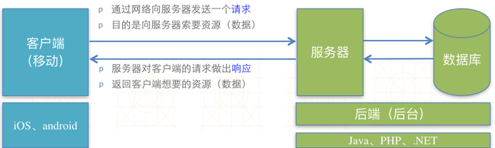
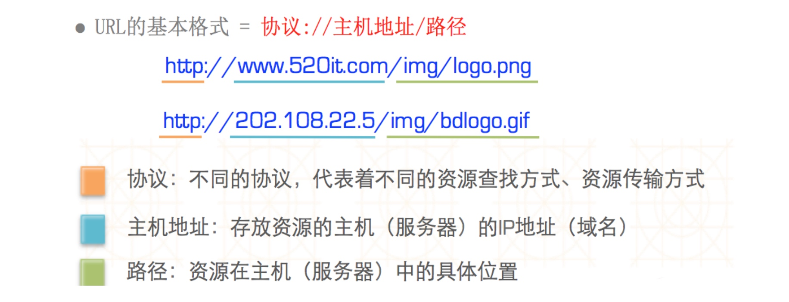
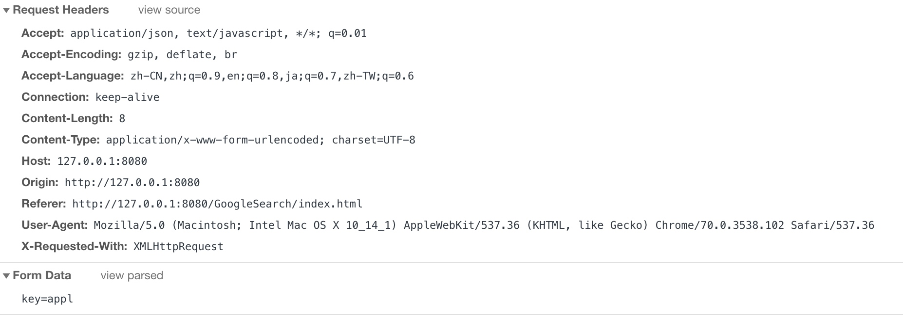
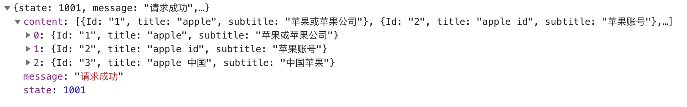
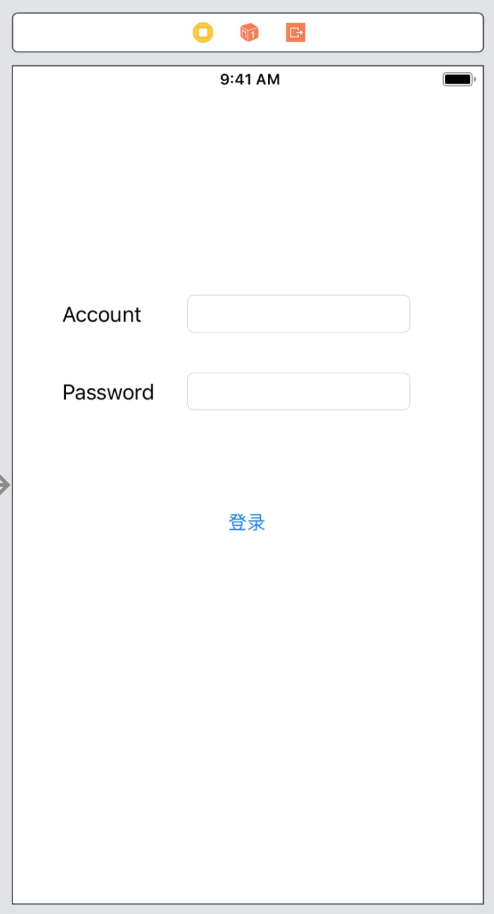

# HTTP请求响应（一）


在移动互联网时代，几乎所有应用都需要用到网络，只有通过网络跟外界进行数据交互、数据更新，应用才能保持新鲜、活力。一个好的移动网络应用不仅要有良好的UI和良好的用户体验，也要具备实时更新数据的能力。网络编程便是一种实时更新应用数据的常用手段，也是开发优秀网络应用的前提和基础。

在网络编程中，有几个必须掌握的基本概念：

1. 客户端（Client）：移动应用（iOS、android等应用）；

2. 服务器（Server）：为客户端提供服务、提供数据、提供资源的机器；

3. 请求（Request）：客户端向服务器索取数据的一种行为；

4. 响应（Response）：服务器对客户端的请求做出的反应，一般指返回数据给客户端。

我们通过下面图片来理解这四者之间的关系：




## HTTP回顾

在我们的日常生活中，每天都在从网络上获取大量的信息。

比如说我们查找信息通常都会使用百度。打开浏览器，输入网址： `http://www.baidu.com`，然后就可以进入百度主页搜索我们想要获取的信息。

那么这里的`http://www.baidu.com`究竟是什么呢？

通常我们称呼其为网址，也就是一个URL（Uniform Resource Locator），即统一资源定位符，通过1个URL，能找到互联网上唯一的1个资源。换句话说，URL就是资源的地址、位置，互联网上的每个资源都有一个唯一的URL。




如下

http://127.0.0.1:8080/GoogleSearch/index.html

```
协议：http
主机地址：127.0.0.1
端口：8080 （80端口为默认端口，可以省略不写）
路径：/GoogleSearch/index.html

主机地址即Apache的Document Root，我们在apache配置文件中设置的地址，
默认地址是： /Application/MAMP/htdocs 
所以我们在使用中需要将我们的服务器文件放入该目录中，
只有这样才能访问得到资源，否则会出现404错误。
```

### 协议

URL中常见的协议：


**1、 HTTP**

超文本传输协议，访问的是远程的网络资源，格式是`http://`

HTTP协议是在网络开发中最常用的协议

**2、 file**

访问的是本地计算机上的资源，格式是`file://`（不需要加主机地址）

**3、mailto**

访问的是电子邮件地址，格式是`mailto:`

**4、FTP**

访问的是共享主机的文件资源，格式是`ftp://`

#### HTTP协议


HTTP的全称是Hypertext Transfer Protocol，超文本传输协议，它的作用是：

* 规定客户端和服务器之间的数据传输格式；

* 让客户端和服务器能有效地进行数据沟通。


***为什么选择使用HTTP？***

HTTP协议有以下几个特征：

* 支持客户/服务器模式。

* 简单快速：客户向服务器请求服务时，只需传送请求方法和路径。请求方法常用的有GET、HEAD、POST等。每种方法规定了客户与服务器联系的类型不同。由于HTTP协议简单，使得HTTP服务器的程序规模小，因而通信速度很快。

* 灵活：HTTP允许传输任意类型的数据对象。

* 无连接：无连接的含义是限制每次连接只处理一个请求。服务器处理完客户的请求，并收到客户的应答后，即断开连接。采用这种方式可以节省传输时间。

* 无状态：HTTP协议是无状态协议。无状态是指协议对于事务处理没有记忆能力。缺少状态意味着如果后续处理需要前面的信息，则它必须重传，这样可能导致每次连接传送的数据量增大。另一方面，在服务器不需要先前信息时它的应答就较快。


### HTTP通信过程

一次HTTP操作称为一个事务，其工作过程可分为四步：

1. 首先客户机与服务器需要建立连接。只要单击某个请求链接，HTTP的工作就开始了。

2. 建立连接后，客户机发送一个请求给服务器，请求方式的格式为：统一资源标识符（URL）、协议版本号，后边是MIME信息，包括请求修饰符、客户机信息和可能的内容。

3. 服务器接到请求后，给予相应的响应信息，其格式为一个状态行，包括信息的协议版本号、一个成功或错误的代码，后边是MIME信息包括服务器信息、实体信息和可能的内容。

4. 客户端接收服务器所返回的信息通过浏览器显示在用户的显示屏上，然后客户机与服务器断开连接。

### 请求

HTTP协议规定1个完整的由客户端发给服务器的HTTP请求中包含以下内容：

**1、请求行**：包含了请求方法、请求资源路径、HTTP协议版本：

        GET www.baidu.com HTTP/1.1；

        请求头：包含了对客户端的环境描述、客户端请求的主机地址等信息；

        http://127.0.0.1：8080// 客户端想访问的服务器主机地址；

        User-Agent: Mozilla/5.0 (Macintosh; Intel Mac OS X 10.9) Firefox/40.0// 客户端的类型，客户端的软件环境；

        Accept: text/html, */*// 客户端所能接收的数据类型；

        Accept-Language: zh-cn // 客户端的语言环境；

        Accept-Encoding: gzip // 客户端支持的数据压缩格式；

 

**2、请求体**：客户端发给服务器的具体数据，比如文件数据。


如上例子，当我们进行请求时，



### 响应

客户端向服务器发送请求，服务器应当做出响应，即返回数据给客户端。

HTTP协议规定1个完整的HTTP响应中包含以下内容：

**1、状态行**：包含了HTTP协议版本、状态码、状态英文名称：

        HTTP/1.1 200 OK；

        响应头：包含了对服务器的描述、对返回数据的描述；

        Server     bfe/1.0.8.11// 服务器的类型；

        Content-Typetext/html; charset=utf-8// 返回数据的类型；

        Content-Length: 56811 // 返回数据的长度；

        DateThu, 03 Dec 2015 06:38:19 GMT// 响应的时间；

如下：


 

**2、实体内容**：服务器返回给客户端的具体数据，比如文件数据。

数据：



**常见的响应状态码**


```
200 ： （OK）  服务器已成功处理了请求。 通常，这表示服务器提供了请求的网页。 
201 ： （Created）  请求成功并且服务器创建了新的资源。
301 ： （Moved Permanently）  请求的网页已永久移动到新位置。 服务器返回此响应（对 GET 或 HEAD 请求的响应）时，会自动将请求者转到新位置。 
300 ： （多种选择）  针对请求，服务器可执行多种操作。 服务器可根据请求者 (user agent) 选择一项操作，或提供操作列表供请求者选择。
303 ： （查看其他位置） 请求者应当对不同的位置使用单独的 GET 请求来检索响应时，服务器返回此代码。 
304 ： （Not Modified） 自从上次请求后，请求的网页未修改过。 服务器返回此响应时，不会返回网页内容。 
400 ： （Bad Request） 服务器不理解请求的语法。
401 ： （Unauthorized） 请求要求身份验证。 对于需要登录的网页，服务器可能返回此响应。
403 ： （Forbidden） 服务器拒绝请求。 
404 ： （Not Found ） 服务器找不到请求的网页。
500 ： （Internal Server Error）  服务器遇到错误，无法完成请求。
```

### 请求方法

在HTTP/1.1协议中，定义了8种发送HTTP请求的方法：

GET、POST、OPTIONS、HEAD、PUT、DELETE、TRACE、CONNECT、PATCH。


每个方法的用法如下（所有方法全为大写）：

    GET: 请求获取Request-URI所标识的资源；
    
    POST: 在Request-URI所标识的资源后附加新的数据；
    
    HEAD: 请求获取由Request-URI所标识的资源的响应消息报头；
    
    PUT: 请求服务器存储一个资源，并用Request-URI作为其标识；
    
    DELETE: 请求服务器删除Request-URI所标识的资源；
    
    TRACE: 请求服务器回送收到的请求信息，主要用于测试或诊断；
    
    CONNECT: 保留将来使用；
    
    OPTIONS: 请求查询服务器的性能，或者查询与资源相关的选项和需求。


根据HTTP协议的设计初衷，不同的方法对资源有不同的操作方式：

* PUT ：增；

* DELETE ：删；

* POST：改；

* GET：查。


不过，我们在使用中，最常用的是GET和POST（实际上GET和POST都能办到增删改查）。

### GET 与 POST

GET和POST的主要区别表现在**数据传递上**。

**GET**：在请求URL后面以?的形式拼接发给服务器的参数，多个参数之间用&隔开。比如`http://www.test.com/login?username=123&pwd= 234&type=JSON`。由于浏览器和服务器对URL长度有限制，因此在URL后面附带的参数是有限制的，通常不能超过1KB。

**POST**：发给服务器的参数全部放在请求体中，理论上，POST传递的数据量没有限制（具体还得看服务器的处理能力）。

***两者共同点***：GET和POST都可以向服务器传送数据，也都可以从服务器获取数据。

 

###### 关于URL长度的限制

首先，HTTP协议及URL官方说明均对URL长度限制没有说明，也就是说GET，POST都对URL长度没有限制，但是HTTP客户端和服务器的实现对URL长度进行了限制，因此我们使用GET请求拼接参数，有时会导致URL过长而无法进行请求。

###### 关于安全问题

并不是POST比GET特别安全，只不过GET传递的参数显示在URL中，我们一眼就可以看到，POST方式看不到是因为浏览器做了限制，但是我们同样可以用第三方工具，也能看到POST方式传递的数据。

 

###### GET 和POST 的选择

选择GET和POST的建议：

* 如果仅仅是索取数据（数据查询），建议使用GET；

* 如果是增加、修改、删除数据或者传递大量数据，比如文件上传，建议用POST。

### 请求响应支撑方案

在iOS中，常见的发送HTTP请求的方案有：

**1、苹果原生方法**

* NSURLConnection：用法简单，最古老、最经典、最直接的一种方案；

* NSURLSession：功能比NSURLConnection更加强大，苹果目前比较推荐使用这种技术（2013年推出，iOS7开始使用的技术）；

* CFNetwork：NSURL*的底层，纯C语言。


**2、第三方框架**

* AFNetworking：简单易用，提供了基本够用的常用功能，维护和使用者多；

* ASIHttpRequest：外号“HTTP终结者”，功能极其强大，可惜早已停止更新；

* MKNetworkKit：简单易用，产自印度，维护和使用者少。


为了提高开发效率，我们开发用的基本是第三方框架，但是我们同样也需要掌握苹果原生的请求方案。

#### 原生方法

##### NSURLConnection

*同步请求*

1. 创建请求的URL

2. 根据URL创建URLRequest

3. 通过NSURLConnection的类方法进行请求，调用方法：`sendSynchronousRequest(_ request: URLRequest, returning response: AutoreleasingUnsafeMutablePointer<URLResponse?>?) throws -> Data`

4. 解析返回值中的数据,通过JSONSerialization的类方法`jsonObject(with data: Data, options opt: JSONSerialization.ReadingOptions = []) throws -> Any`来解析返回的JSON数据

如下案例，我们搭建一个简单的登录验证的界面，在界面中有账号框、密码框和登录按钮，当用户输完后点击登录，会将数据提交到后台进行验证，然后返回响应信息：

main.storyboard




**LoginAction.php**

```php
<?php
	$name = $_REQUEST['name'];
	$pwd = $_REQUEST['password'];
	
	if($name == "Humbert" && $pwd == "111111") {
		$user = array('name' => $name, 'password' => $pwd);
		$response = array('status' => "1001", 'message' => '请求成功', 'content' => $user);
		echo json_encode($response);
	}
?>
```

**ViewController.swift**


```swift
import UIKit

class ViewController: UIViewController {
    @IBOutlet weak var nameText: UITextField!
    @IBOutlet weak var passwordText: UITextField!
    
    override func viewDidLoad() {
        super.viewDidLoad()
        
    }

    @IBAction func loginBtn(_ sender: UIButton) {
        
        let name = nameText.text!
        
        let pwd = passwordText.text!
        
        //创建请求的URL
        let aURL = URL(string: "http://127.0.0.1:8080/ProjectsManager/LoginAction.php?name=\(name)&password=\(pwd)")
        
        //根据URL创建Rrequest
        let request = URLRequest(url: aURL!)
        
        var dataDic: Dictionary<String, String>?
        
        //执行同步请求，获取响应数据
        let data = try? NSURLConnection.sendSynchronousRequest(request, returning: nil)
        
        //将响应数据转换成字典
        dataDic = (try? JSONSerialization.jsonObject(with: data!, options: .allowFragments)) as? Dictionary<String, String>

        if dataDic != nil {
            
            let userName = dataDic!["name"]!
            
            let password = dataDic!["password"]!
            
            let msg = "登录成功\n\nAccount: \(userName)\n\nPassword: \(password)"
            
            alert(msg: msg)
            
        }else {
            alert(msg: "登录失败")
        }
    }
    
    //提示框
    func alert(msg: String) {
        
        let alertVC = UIAlertController(title: "提示", message: msg, preferredStyle: .alert)
        
        let sure = UIAlertAction(title: "确定", style: .default, handler: nil)
        
        alertVC.addAction(sure)
        
        present(alertVC, animated: true, completion: nil)
    }
}
```

*异步请求*

1. 创建请求的URL

2. 根据URL创建URLRequest

3. 通过NSURLConnection的类方法进行请求，调用方法：`sendAsynchronousRequest(_ request: URLRequest, queue: OperationQueue, completionHandler handler: @escaping (URLResponse?, Data?, Error?) -> Void)`来执行，需要注意的是此方法没有返回值，如果要处理返回的数据，则在completionHandler代码块中进行处理，代码块返回的参数URLResponse为返回的response信息；Data为返回的数据；Error为连接错误的信息）

4. 解析返回值中的数据,通过JSONSerialization的类方法`jsonObject(with data: Data, options opt: JSONSerialization.ReadingOptions = []) throws -> Any`来解析返回的JSON数据


如下：

```swift
import UIKit

class ViewController: UIViewController {
    @IBOutlet weak var nameText: UITextField!
    @IBOutlet weak var passwordText: UITextField!
    
    override func viewDidLoad() {
        super.viewDidLoad()
        
    }

    @IBAction func loginBtn(_ sender: UIButton) {
        
        let name = nameText.text!
        
        let pwd = passwordText.text!
        
        //创建请求的URL
        let aURL = URL(string: "http://127.0.0.1:8080/ProjectsManager/LoginAction.php?name=\(name)&password=\(pwd)")
        
        //根据URL创建Rrequest
        let request = URLRequest(url: aURL!)
        
        var dataDic: Dictionary<String, String>?
        
        let queue = OperationQueue()
        
        //执行异步请求，获取响应数据，并将数据的展示放在主队列中执行
        NSURLConnection.sendAsynchronousRequest(request, queue: .main, completionHandler: { (response, data, error) in
            
            //将响应数据转换成字典
            dataDic = (try? JSONSerialization.jsonObject(with: data!, options: .allowFragments)) as? Dictionary<String, String>
            
            if dataDic != nil {
                
                let userName = dataDic!["name"]!
                
                let password = dataDic!["password"]!
                
                let msg = "登录成功\n\nAccount: \(userName)\n\nPassword: \(password)"
                
                self.alert(msg: msg)
                
            }else {
                self.alert(msg: "登录失败\n\(String(describing: error))")
            }
        })
    }
    
    //提示框
    func alert(msg: String) {
        
        let alertVC = UIAlertController(title: "提示", message: msg, preferredStyle: .alert)
        
        let sure = UIAlertAction(title: "确定", style: .default, handler: nil)
        
        alertVC.addAction(sure)
        
        present(alertVC, animated: true, completion: nil)
    }
}
```

##### NSURLConnectionDataDelegate

通过NSURLConnectionDataDelegate中的代理方法处理请求。

1、创建请求的URL

2、根据URL创建request

3、创建NSURLConnection对象，并将当前控制器设置成代理，然后开启connection


```swift
//创建请求的URL
let aURL = URL(string: "http://127.0.0.1:8080/ProjectsManager/LoginAction.php?name=\(name)&password=\(pwd)")
    
//根据URL创建Rrequest
let request = URLRequest(url: aURL!)
    
let connection = NSURLConnection(request: request, delegate: self)
```

4、实现协议方法，并在方法中准备和处理接收到的数据


```
//此方法会在服务器开始响应后调用，所以在此方法中准备用来接收数据的mutableData容器
func connection(_ connection: NSURLConnection, didReceive response: URLResponse)
    
//此方法在客户端接每次收到服务器传回的数据后调用，因为所有数据并不是一次性就传回来的，所以需要通过appendData方法，将每次接收到的数据保存到我们准备好的容器中
func connection(_ connection: NSURLConnection, didReceive data: Data)
    
//此方法会在客户端接收到所有传回的数据，响应结束后调用。我们可以在此方法中处理传回的数据
func connectionDidFinishLoading(_ connection: NSURLConnection)
```

如下：


```swift
import UIKit

class ViewController: UIViewController, NSURLConnectionDataDelegate {
    @IBOutlet weak var nameText: UITextField!
    @IBOutlet weak var passwordText: UITextField!
    
    var responseData :Data?
    
    var dataDic: Dictionary<String, String>?
    
    override func viewDidLoad() {
        super.viewDidLoad()
        
    }

    @IBAction func loginBtn(_ sender: UIButton) {
        
        let name = nameText.text!
        
        let pwd = passwordText.text!
        
        //创建请求的URL
        let aURL = URL(string: "http://127.0.0.1:8080/ProjectsManager/LoginAction.php?name=\(name)&password=\(pwd)")
        
        //根据URL创建Rrequest
        let request = URLRequest(url: aURL!)
        
        let connection = NSURLConnection(request: request, delegate: self)
    }
    
    func connection(_ connection: NSURLConnection, didReceive response: URLResponse) {
        responseData = Data()
    }
    
    func connection(_ connection: NSURLConnection, didReceive data: Data) {
        responseData!.append(data)
    }
    
    func connectionDidFinishLoading(_ connection: NSURLConnection) {
        //将响应数据转换成字典
        dataDic = (try? JSONSerialization.jsonObject(with: responseData!, options: .allowFragments)) as? Dictionary<String, String>
        
        if dataDic != nil {
            
            let userName = dataDic!["name"]!
            
            let password = dataDic!["password"]!
            
            let msg = "登录成功\n\nAccount: \(userName)\n\nPassword: \(password)"
            
            self.alert(msg: msg)
            
        }else {
            self.alert(msg: "登录失败")
        }
    }
    
    //提示框
    func alert(msg: String) {
        
        let alertVC = UIAlertController(title: "提示", message: msg, preferredStyle: .alert)
        
        let sure = UIAlertAction(title: "确定", style: .default, handler: nil)
        
        alertVC.addAction(sure)
        
        present(alertVC, animated: true, completion: nil)
    }
}
```

#### NSURLSession

1、创建请求的URL

2、创建NSURLSession对象

3、创建URLSessionDataTask对象，在task的代码代码块中处理请求回来的数据

4、启动task


```swift
import UIKit

class ViewController: UIViewController, NSURLConnectionDataDelegate {
    @IBOutlet weak var nameText: UITextField!
    @IBOutlet weak var passwordText: UITextField!
    
    var responseData :Data?
    
    var dataDic: Dictionary<String, String>?
    
    override func viewDidLoad() {
        super.viewDidLoad()
        
    }

    @IBAction func loginBtn(_ sender: UIButton) {
        
        let name = nameText.text!
        
        let pwd = passwordText.text!
        
        //创建请求的URL
        let aURL = URL(string: "http://127.0.0.1:8080/ProjectsManager/LoginAction.php?name=\(name)&password=\(pwd)")
        
        //创建URLSession对象
        let session = URLSession.shared
        
        let task = session.dataTask(with: aURL!) { (data, response, error) in
            
            self.dataDic = (try? JSONSerialization.jsonObject(with: data!, options: .allowFragments)) as? Dictionary<String, String>
            
            if self.dataDic != nil {
                
                let queue = DispatchQueue.main
                
                queue.async {
                    
                    let userName = self.dataDic!["name"]!
                    
                    let password = self.dataDic!["password"]!
                    
                    let msg = "登录成功\n\nAccount: \(userName)\n\nPassword: \(password)"
                    
                    self.alert(msg: msg)
                }
                
            }else {
                let queue = DispatchQueue.main
                
                queue.async {
                    self.alert(msg: "登录失败")
                }
            }
        }
        
        task.resume()
    }
    
    //提示框
    func alert(msg: String) {
        
        let alertVC = UIAlertController(title: "提示", message: msg, preferredStyle: .alert)
        
        let sure = UIAlertAction(title: "确定", style: .default, handler: nil)
        
        alertVC.addAction(sure)
        
        present(alertVC, animated: true, completion: nil)
    }
}
```

