# HTTP请求响应（二）

## 请求响应支撑方案

### 原生方式

#### NSURLSession


1、创建请求的URL

2、创建NSURLSession对象

3、创建URLSessionDataTask对象，在task的代码代码块中处理请求回来的数据

4、启动task


```swift
import UIKit

class ViewController: UIViewController, NSURLConnectionDataDelegate {
    @IBOutlet weak var nameText: UITextField!
    @IBOutlet weak var passwordText: UITextField!
    
    var responseData :Data?
    
    var dataDic: Dictionary<String, String>?
    
    override func viewDidLoad() {
        super.viewDidLoad()
        
    }

    @IBAction func loginBtn(_ sender: UIButton) {
        
        let name = nameText.text!
        
        let pwd = passwordText.text!
        
        //创建请求的URL
        let aURL = URL(string: "http://127.0.0.1:8080/ProjectsManager/LoginAction.php?name=\(name)&password=\(pwd)")
        
        //创建URLSession对象
        let session = URLSession.shared
        
        //创建URLSessionDataTask任务对象，在闭包中对返回的数据进行处理
        let task = session.dataTask(with: aURL!) { (data, response, error) in
            
            self.dataDic = (try? JSONSerialization.jsonObject(with: data!, options: .allowFragments)) as? Dictionary<String, String>
            
            if self.dataDic != nil {
                
                //获取主队列
                let queue = DispatchQueue.main
                
                //在主队列中进行处理
                queue.async {
                    
                    let userName = self.dataDic!["name"]!
                    
                    let password = self.dataDic!["password"]!
                    
                    let msg = "登录成功\n\nAccount: \(userName)\n\nPassword: \(password)"
                    
                    self.alert(msg: msg)
                }
                
            }else {
                //获取主队列
                let queue = DispatchQueue.main
                
                在主队列中进行处理
                queue.async {
                    self.alert(msg: "登录失败")
                }
            }
        }
        
        //启动任务
        task.resume()
    }
    
    //提示框
    func alert(msg: String) {
        
        let alertVC = UIAlertController(title: "提示", message: msg, preferredStyle: .alert)
        
        let sure = UIAlertAction(title: "确定", style: .default, handler: nil)
        
        alertVC.addAction(sure)
        
        present(alertVC, animated: true, completion: nil)
    }
}
```

## 第三方框架管理工具（CocoaPods）

### 简介

当我们在开发iOS应用时，会使用到很多第三方开源类库，比如MBProgressHUD、AFNetWorking等等，可能某个类库又会用到其他依赖类库，所以如果要使用它，必须得另外下载其他依赖类库，而其他类库又用到其他类库，“子子孙孙无穷尽也”，这也许是比较特殊的情况。那么我们手动一个个去下载所需类库十分麻烦。IT行业技术也是时时刻刻都在更新变化着，所以项目当中用到的类库有更新时，那我们又必须得重新下载新版本，重新加入到项目中，非常麻烦。这个时候就需要有一个用来专门管理第三方框架的工具了，能够帮助我们去下载和安装框架，更新框架，那么CocoaPods孕育而生了。

CocoaPods是比较流行的iOS类库管理工具了，上述两个烦人的问题，通过CocoaPods，只需要一行命令就可以完全解决，能够很直观、集中和自动化地管理我们项目的第三方库。而且绝大部分有名的开源类库，都支持CocoaPods。所以，作为iOS程序员的我们，掌握CocoaPods的使用是必不可少的基本技能了。

CocoaPods将所有依赖的库都放在一个名为Pods的项目下，然后让我们的主项目去依赖Pods项目。此后，我们编码工作都从主项目转移到Pods项目。Pods项目最终会编译为一个libPod-项目名.a静态库，主项目依赖于这个静态库。

#### CocoaPods核心组件

* CocoaPods/CocoaPod
这是是一个面向用户的组件，每当执行一个 pod 命令时，这个组件都将被激活。该组件包括了所有使用 CocoaPods 涉及到的功能，并且还能通过调用所有其它的 gems 来执行任务。

* CocoaPods/Core
Core 组件提供支持与 CocoaPods 相关文件的处理，文件主要是 Podfile 和 podspecs。

* Podfile
Podfile 是一个文件，用于定义项目所需要使用的第三方库。该文件支持高度定制，你可以根据个人喜好对其做出定制。更多相关信息，请查阅 Podfile 指南。

* Podspec
.podspec 也是一个文件，该文件描述了一个库是怎样被添加到工程中的。它支持的功能有：列出源文件、framework、编译选项和某个库所需要的依赖等。

* CocoaPods/Xcodeproj
这个 gem 组件负责所有工程文件的整合。它能够对创建并修改 .xcodeproj 和 .xcworkspace 文件。它也可以作为单独的一个 gem 包使用。如果你想要写一个脚本来方便的修改工程文件，那么可以使用这个 gem。


### 使用CocoaPods

#### 验证

我们安装和使用CocoaPods需要通过“终端”来实现。

首先，先验证一下是否可以使用：

在终端中输入: `pod search AFNetworking`  ，验证是否已安装，安装了则会出现AFNetworking框架的相关信息。如果没有没有安装或者有问题，出现 “-bash: pod: command not found” 的提示，则重新安装，提示如下：

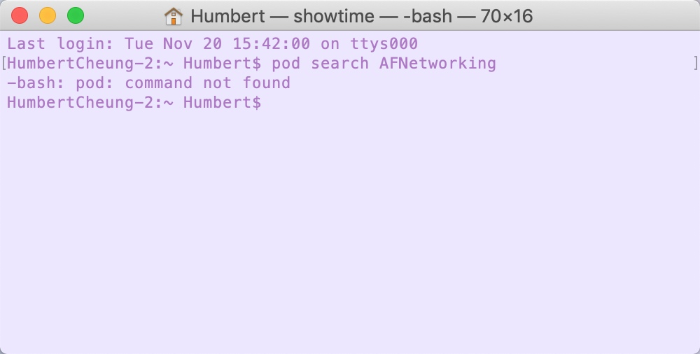

#### 安装步骤

1、安装时需要用到ruby镜像源，Mac自带ruby，但是通常ruby镜像源基本上都被墙了，在国内无法访问，所以需要先检查一下ruby镜像源，先通过命令`gem sources -l`查看当前ruby镜像源地址，如下：

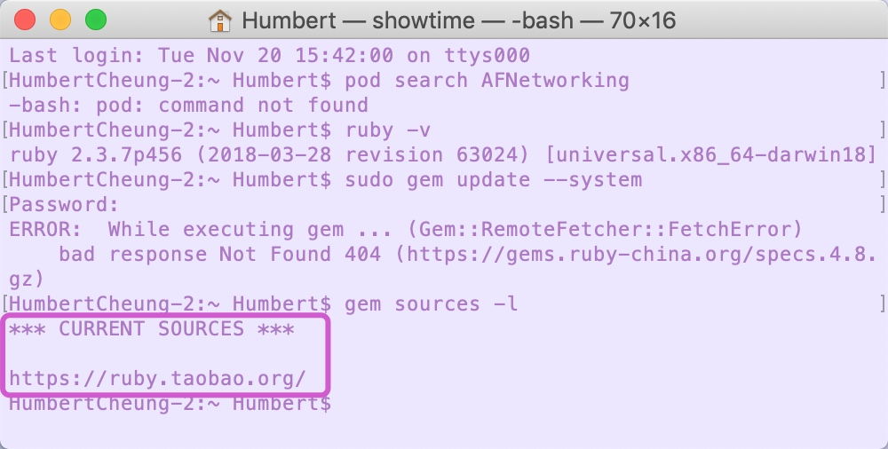

如果CURRENT SOURCES不是“ https://gems.ruby-china.com/ ”的则需要将原地址换成这个，比如以上的是“ https://ruby.taobao.org/ ”，所以需要更换。
 
* 通过命令：`gem sources --remove https://ruby.taobao.org/`来移除这个旧的镜像源；
* 通过命令：`gem sources -a https://gems.ruby-china.com/`来添加新的镜像源，如下：

移除：
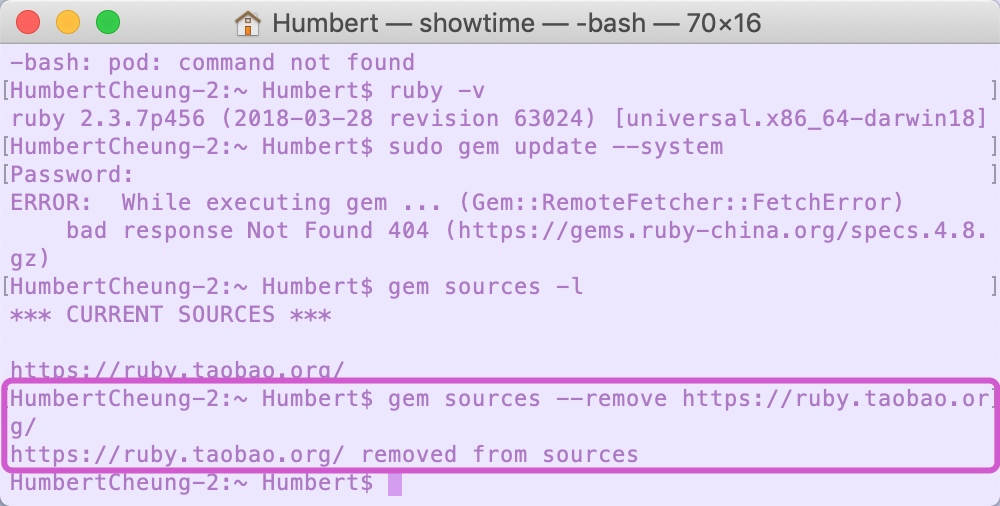

添加：
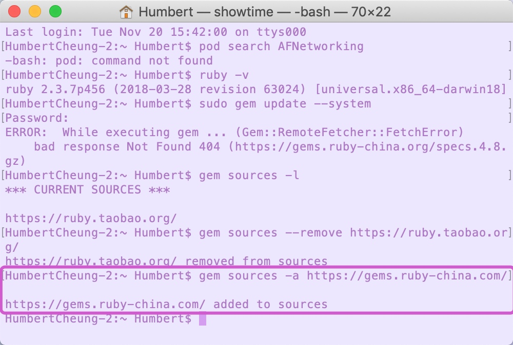

然后再通过`gem sources -l`命令查看一下ruby当前的镜像源：
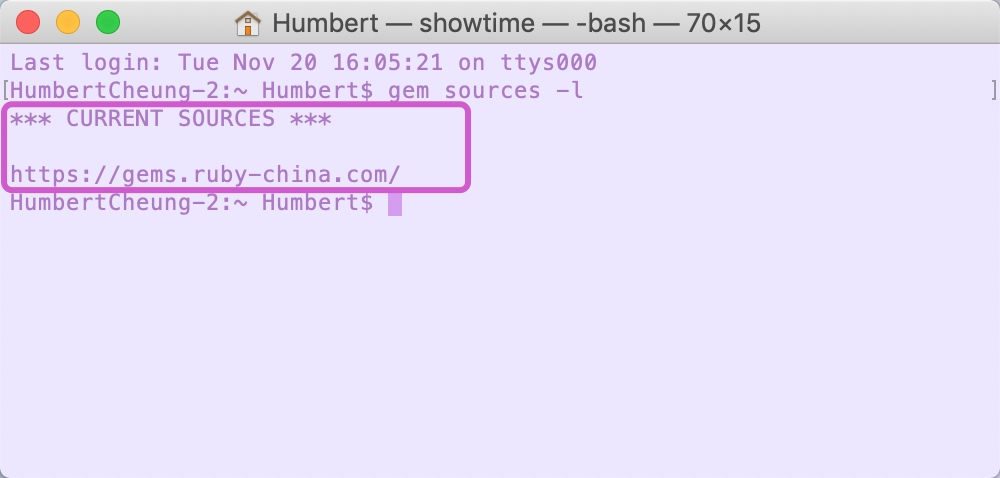


2、安装CocoaPods

在ruby新镜像源添加成功后就可以开始安装了，通过命令`sudo gem install -n /usr/local/bin cocoapods`来安装，安装需要下载相关文件，耗时较长，在安装成功后会出现如下信息：

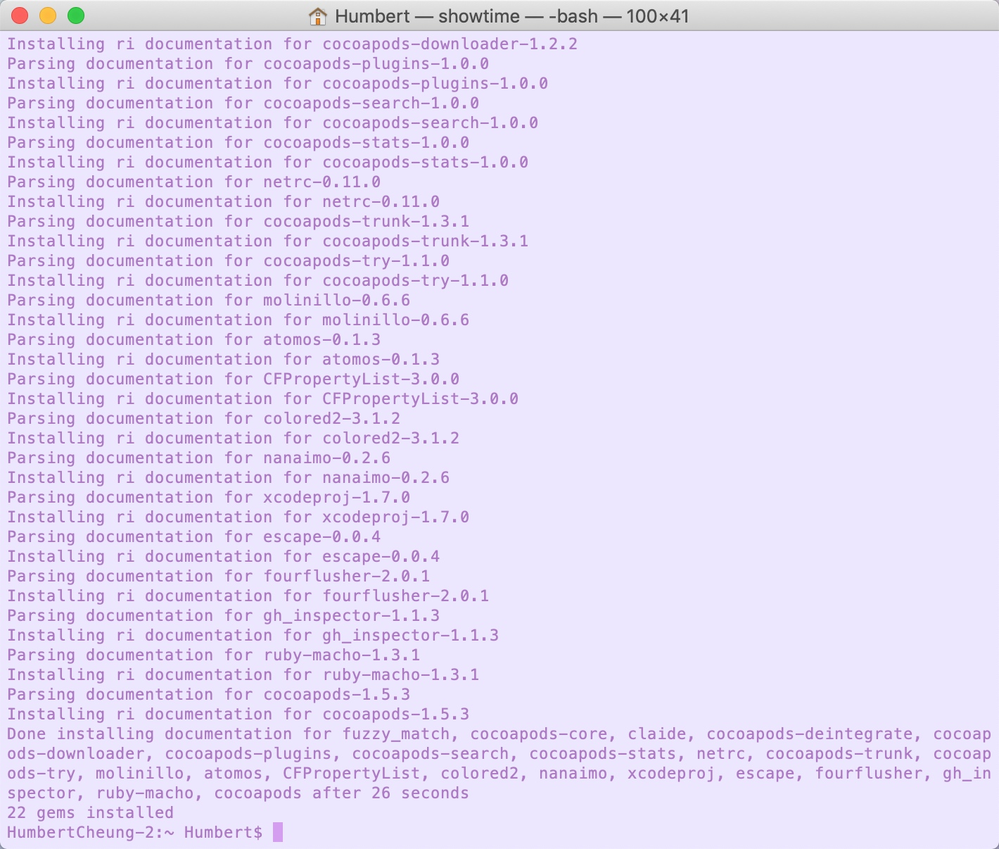

> **Tips：**
> sudo是 Linux命令，以系统管理者的身份执行命令，在执行包含该命令的指令时需要先输入管理员密码。

4、测试

出现以上提示CocoaPods安装成功的提示后，我们再通过命令`pod search AFNetworking`来测试一下是否可以正常使用，在经过一段时间后，如果出现以下关于AFNetworking的信息则表示可以正常使用CocoaPods了：

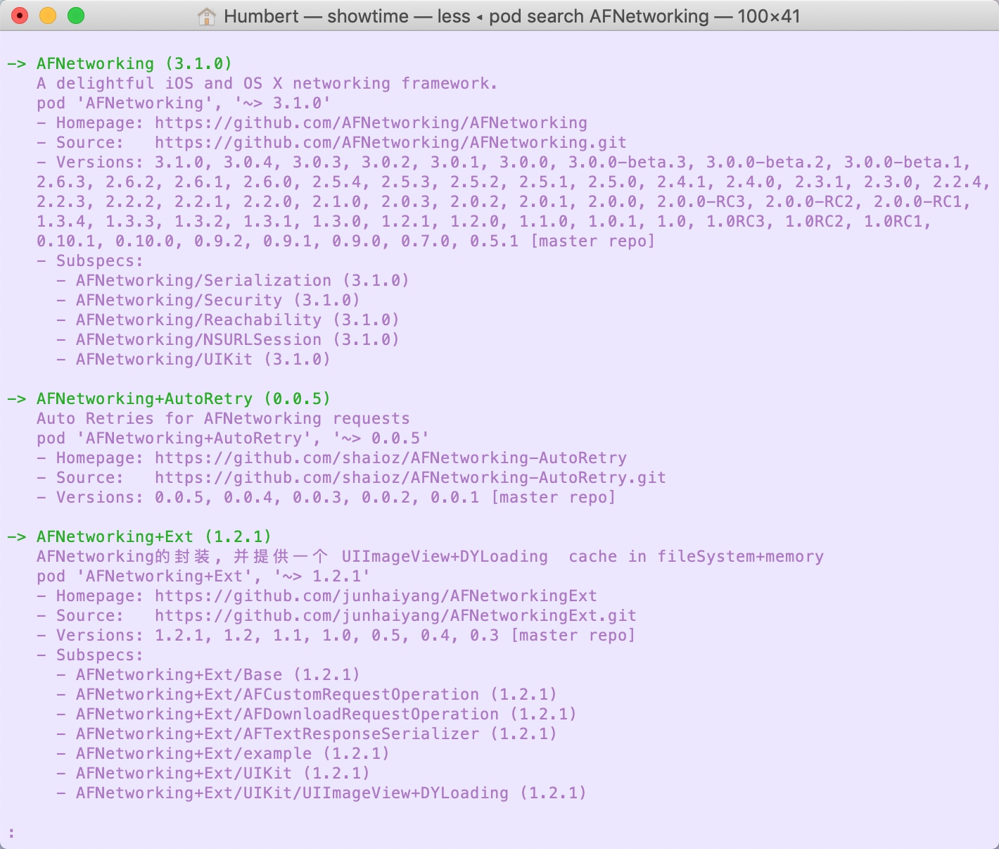


### 通过pod导入第三方框架

1、在终端中进入项目根目录。

在终端中先进入需要导入框架的项目的根目录，可以通过以下快捷方式：

* 在终端上中先输入 ：cd+空格 ，再将项目拖入终端中，终端就会自动获取该文件路径，然后按enter则可进入项目根目录 如下：


2、在项目根目录中创建Podfile文件。

在终端，进入项目根目录后，输入`vim Podfile`，按enter则可进入新文件编辑界面，然后输入`i` 进入编辑状态（文件的左下角会出现INSERT），如下：


3、输入需要导入的第三方框架的Pod信息

通常，支持使用CocoaPods管理的第三方框架，都有相应的Pod导入信息，并且基本上都会发布在Github上，所以我们需要先找到该信息，比如我们今天要使用的AFNetworking，我们可以百度：“框架名+pod” 或者“框架名+github”，在Github上的信息如下：

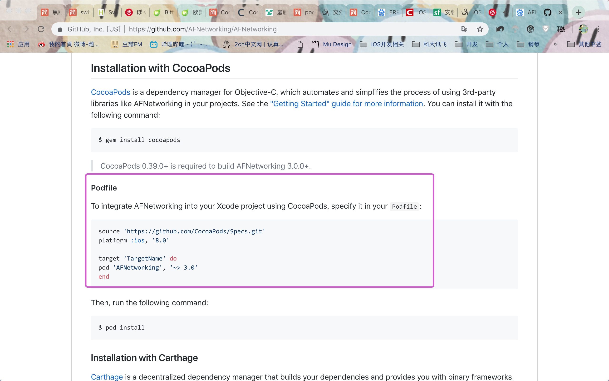


```
source 'https://github.com/CocoaPods/Specs.git'
platform :ios, '8.0'

target 'TargetName' do
pod 'AFNetworking', '~> 3.0'
end
```

* source：是资源的地址
* platform是平台
* ios, '8.0'是指定所支持系统和最低版本
* target，我们项目的target名称，要把单引号中的TargetName改成我们target的名称
* pod后面的就是我们需要的框架，'~> 3.0'，即版本号。

我们在终端上，将此信息拷贝进去，将TargetName改成我们项目的target名字后，点击esc退出编辑模式，然后再输入：`:wq` 保存并退出，此时便会在项目根目录中生成Podfile文件，如下：


4、接着我们在终端上输入：`pod install` 便可下载此框架了，在下载之前我们需要关闭所有Xcode进程，如下：


下载成功后便会在我们项目的根目录中生成几个文件，其中`.xcworkspace`文件是pod的项目文件，我们后续的所有操作都在此项目中操作：

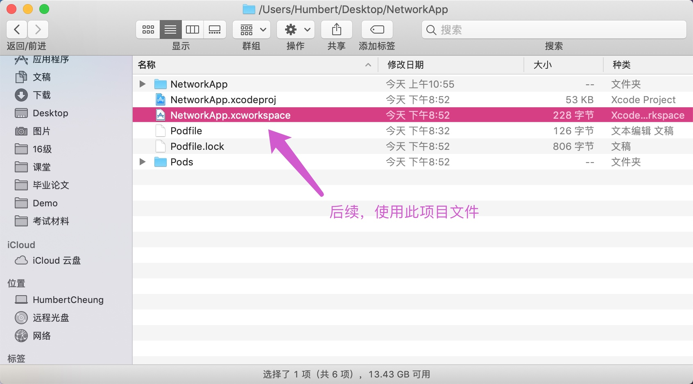

打开此项目文件：

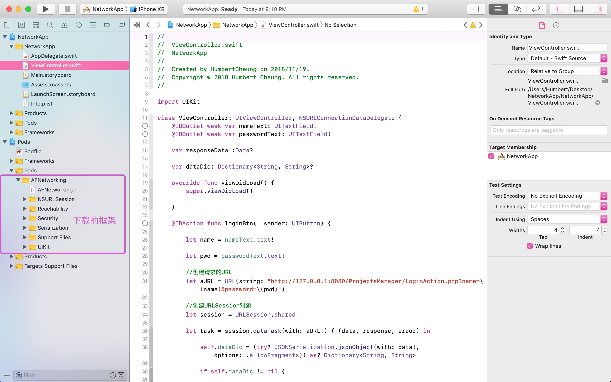

> **注意：**
> 如果在pod install时报错：Attempt to read non existent folder，通常是因为你的安装目录中包含中文导致无法找到路径，改成全英文的即可

## AFNetworking

### 简介

AFNetworking是一款轻量级网络请求开源框架，为 iOS 和 Mac OSX 制作的网络库，它建立在
URL 装载系统框架的顶层，内置在Cocoa里，扩展了强有力的高级网络抽象，它的模块架构被良好的设计，拥有丰富的功能，因此，使用起来，非常方便。

### 优点

1.原有基础URLSession上封装了一层，在传参方面更灵活
2.回调更友好
3.支持返回数据序列化
4.支持文件上传，断点下载
5.自带多线程，防死锁
6.处理了Https证书流程，节省移动端开发
7.支持网络状态判断

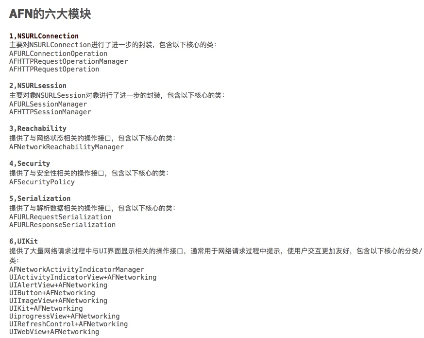

六个模块的关系如下：

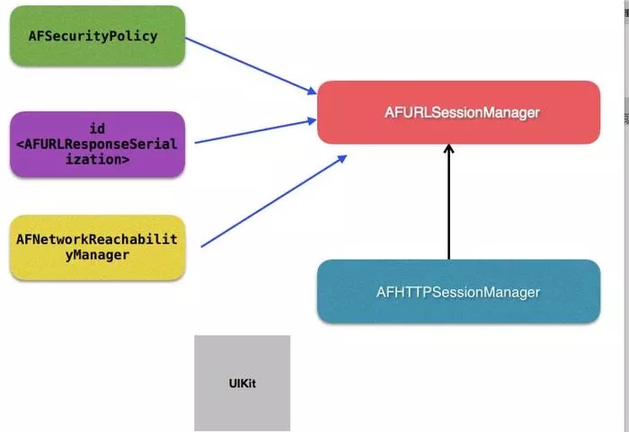


### 使用

1、通过CocoaPods导入AFNetworking

2、创建桥接文件，在桥接文件中`#import "AFNetworking.h"`

3、创建URL

4、创建AFHTTPSessionManager请求对象

5、设置请求时和编码时的编码格式

6、准备请求时的参数

7、发送POST请求，在请求的闭包中处理返回的响应信息


```swift
import UIKit

class ViewController: UIViewController{
    @IBOutlet weak var nameText: UITextField!
    @IBOutlet weak var passwordText: UITextField!
    
    var responseData :Data?
    
    var dataDic: Dictionary<String, String>?
    
    override func viewDidLoad() {
        super.viewDidLoad()
        
    }

    @IBAction func loginBtn(_ sender: UIButton) {
        
        let name = nameText.text!
        
        let pwd = passwordText.text!
        
        //创建请求的URL
        let aURL = "http://127.0.0.1:8080/ProjectsManager/LoginAction.php"
        
        //创建请求对象
        let manager = AFHTTPSessionManager()
        
        //设置请求时的编码格式
        manager.requestSerializer = AFHTTPRequestSerializer()
        
        //设置响应时的编码格式
        manager.responseSerializer = AFHTTPResponseSerializer()
        
        //准备需要请求的参数
        let params = ["name": name, "password": pwd];
        
        //发送POST请求
        manager.post(aURL, parameters: params, progress: { (progress) in
            
        }, success: { (sessionDataTask, data) in
            
            self.dataDic = (try? JSONSerialization.jsonObject(with: data as! Data, options: .allowFragments)) as? Dictionary<String, String>
            
            if self.dataDic != nil {
                
                let queue = DispatchQueue.main
                
                queue.async {
                    
                    let userName = self.dataDic!["name"]!
                    
                    let password = self.dataDic!["password"]!
                    
                    let msg = "登录成功\n\nAccount: \(userName)\n\nPassword: \(password)"
                    
                    self.alert(msg: msg)
                }
                
            }else {
                let queue = DispatchQueue.main
                
                queue.async {
                    self.alert(msg: "登录失败")
                }
            }
            
        }) { (sessionDataTask, error) in
            print("请求错误：\(error)")
        }
    }
    
    //提示框
    func alert(msg: String) {
        
        let alertVC = UIAlertController(title: "提示", message: msg, preferredStyle: .alert)
        
        let sure = UIAlertAction(title: "确定", style: .default, handler: nil)
        
        alertVC.addAction(sure)
        
        present(alertVC, animated: true, completion: nil)
    }
}
```

