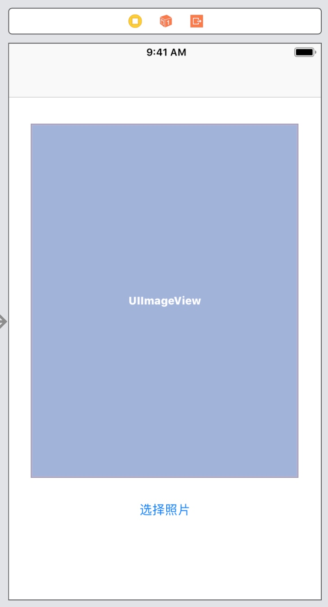
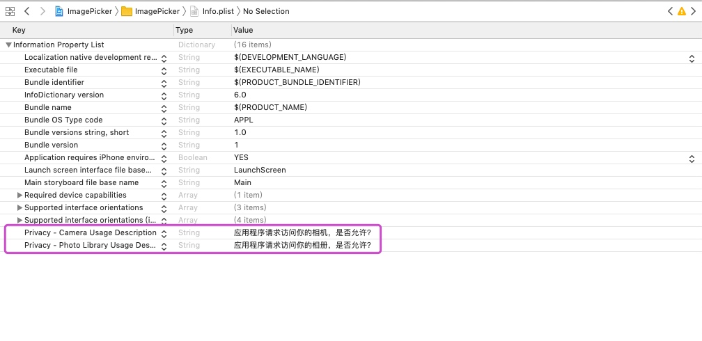
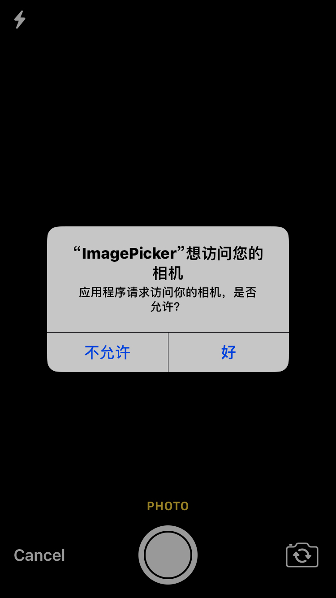
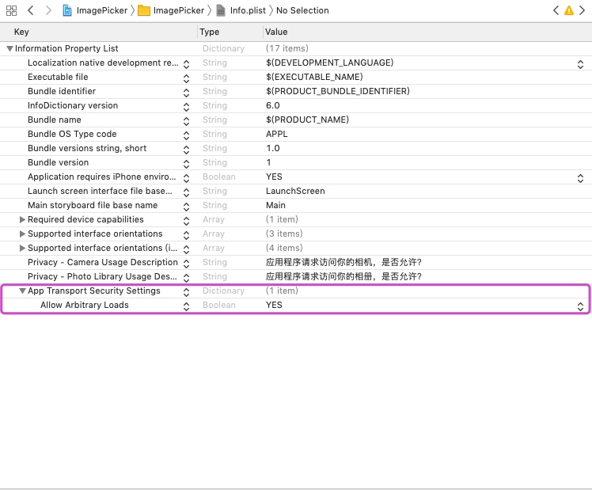

# iOS高级开发技术

## 照片选取

在iOS开发过程当中，我们经常会涉及到选择图片或者选取拍摄的照片，比如上传头像等功能，此时就需要选择拍照或者从系统相册上传两种方式来实现。iOS 中为这个功能提供了 UIImagePickerController 这个图像选取器类来实现对图片选取的功能。

图像选取器界面是通过UIImagePickerController的控制器类实现的。首先，我们创建此类的一个实例，指定委托，指定其图像源，然后将其展示出来。图像选取器会控制设备，让用户从已有的图片库中选择图片，用户也可以通过摄像头拍摄新照片。用户选择之后，就可以对所选图像进行一些基本的编辑，如缩放或裁减。

我们来看以下案例：

我们搭建一个简单的页面，在此页面上有一个UIImageView和一个“选择照片”的按钮，当用户点击“选择照片”按钮时，可以打开相册或打开摄像头拍摄来选取照片，选取好后显示在页面的UIImageView上，界面搭建效果如下：




1、在控制器ViewController中实现两个协议：UIImagePickerControllerDelegate和UINavigationControllerDelegate

2、创建UIImagePickerController对象，把该对象声明成控制器的属性，如下：


```swift
import UIKit

class ViewController: UIViewController, UIImagePickerControllerDelegate, UINavigationControllerDelegate {

    @IBOutlet weak var showImage: UIImageView!
    
    //实例化一个UIImagePickerControllers对象属性
    let imagePickerController = UIImagePickerController()
    
    
    override func viewDidLoad() {
        super.viewDidLoad()
    }

    @IBAction func chooseBtn(_ sender: UIButton) {
        
    }
}
```

3、指定当前控制器为imagePickerController的代理，然后设置imagePickerController允许编辑照片。


```swift
import UIKit

class ViewController: UIViewController, UIImagePickerControllerDelegate, UINavigationControllerDelegate {

    @IBOutlet weak var showImage: UIImageView!
    
    //实例化一个UIImagePickerControllers对象属性
    let imagePickerController = UIImagePickerController()
    
    
    override func viewDidLoad() {
        super.viewDidLoad()
        
        //指定当前控制器为picker的代理
        imagePickerController.delegate = self
        
        //允许编辑照片
        imagePickerController.allowsEditing = true
    }

    @IBAction func chooseBtn(_ sender: UIButton) {
        
    }
}
```

4、在创建并配置了UIImagePickerController对象之后，我们需要通过prensent方法将图像选取器呈现给用户，我们可以通过界面的按钮，用户点击按钮则就弹出图片选取器。不过在弹出照片选取器时需要先让用户选择选取照片的方式：从相册选择或者拍照。

但是，并不是每一台iOS设备都有摄像头，所以我们需要先检查运行当前应用的设备是否支持要使用的图像源，我们可以通过UIImagePickerController的`isSourceTypeAvailable(_ sourceType: UIImagePickerController.SourceType) -> Bool`方法来判断，如果存在该图像源，即可以实现此操作则会返回true，否则返回false。此方法中的参数`UIImagePickerController.SourceType`是个枚举类型，有三个，即有三种图像源，如下：


```swift
public enum SourceType : Int {

        //指定用户从现有的媒体库中选取照片，照片将被返回到委托
        case photoLibrary
        
        //指定用户通过相机拍摄来选取照片，照片将被返回到委托。
        case camera

        //指定用户从现有的照片库中选择照片，照片将被返回到委托。
        case savedPhotosAlbum
    }
```

我们可以通过弹出下拉框的形式来让用户选择方式，不过先判断设备是是否支持相机，如果不支持相机则将相机的选项去掉，然后，当用户点击选项时，则会调用出使用对应图片源的照片选取器，如下：


```swift
import UIKit

class ViewController: UIViewController, UIImagePickerControllerDelegate, UINavigationControllerDelegate {

    @IBOutlet weak var showImage: UIImageView!
    
    //实例化一个UIImagePickerControllers对象属性
    let imagePickerController = UIImagePickerController()
    
    
    override func viewDidLoad() {
        super.viewDidLoad()
        
        //指定当前控制器为picker的代理
        imagePickerController.delegate = self
        
        //允许编辑照片
        imagePickerController.allowsEditing = true
    }

    @IBAction func chooseBtn(_ sender: UIButton) {
        
        //1、创建下拉框对象
        let actionSheet = UIAlertController(title: "选择照片", message: "通过以下方式来选择", preferredStyle: .actionSheet)
        
        //2、判断是否支持相机
        if UIImagePickerController.isSourceTypeAvailable(.camera) {
            
            //支持相机则创建相机的选项
            let camera = UIAlertAction(title: "相机", style: .default) { (action) in
                
                //将图片选取器的类型设置为相机
                self.imagePickerController.sourceType = .camera
                
                //调用照片选取器
                self.present(self.imagePickerController, animated: true, completion: {
                    print("选择了相机")
                })
            }
            //将选项添加到actionSheet上
            actionSheet.addAction(camera)
        }
        
        //3、创建相册的选项
        let photo = UIAlertAction(title: "相册", style: .default) { (action) in
            
            //将图片选取器的类型设置为相册
            self.imagePickerController.sourceType = .photoLibrary
            
            //调用照片选取器
            self.present(self.imagePickerController, animated: true, completion: {
                print("选择了相册")
            })
        }
        //4、将选项添加到actionSheet上
        actionSheet.addAction(photo)
        
        //创建最近照片的选项
        let album = UIAlertAction(title: "最近照片", style: .default) { (action) in
            
            //将图片选取器的类型设置为最近照片
            self.imagePickerController.sourceType = .savedPhotosAlbum
            
            //调用照片选取器
            self.present(self.imagePickerController, animated: true, completion: {
                print("选择了最近照片")
            })
        }
        //将选项添加到actionSheet上
        actionSheet.addAction(album)
        
        //5、创建取消选项
        let cancel = UIAlertAction(title: "取消", style: .cancel) { (action) in
            print("用户取消了")
        }
        //将选项添加到actionSheet上
        actionSheet.addAction(cancel)
        
        present(actionSheet, animated: true, completion: nil)
    }
}
```
效果如下：


> 注意：
> 在目前版本的系统中，iOS在系统权限上进行了一些限制，如果需要访问摄像头、相册、麦克风等设备，需要在info.plist文件中添加一些说明信息，如果直接使用则会报错，比如我们直接调用相机，那么会出现以下错误信息：

> **This app has crashed because it attempted to access privacy-sensitive data without a usage description.  The app's Info.plist must contain an NSCameraUsageDescription key with a string value explaining to the user how the app uses this data.**

> 所以我们需要在plist中添加配置信息：

> 

然后运行时会出现如下弹出框提示：




5、在用户选择照片后，我们需要保存用户所选择的照片。当用户选择完照片后会调用代理方法`imagePickerController(_ picker: UIImagePickerController, didFinishPickingMediaWithInfo info: [UIImagePickerController.InfoKey : Any])`，所以我们可以在此代理方法中去保存照片。

在此方法中，

* 第一个参数：是用户使用的UIImagePickerController对象；
* 第二个参数`UIImagePickerController.InfoKey`是一个Dictionary对象，包含用户所选照片的信息，如果允许在图片选取器中编辑（并且用户确实对图片进行了编辑），那么第二个参数还包括可选的编辑信息，常用的选项：originalImage（原始未修改的图片）、editedImage（已修改的图片）

如下：


```swift
import UIKit

class ViewController: UIViewController, UIImagePickerControllerDelegate, UINavigationControllerDelegate {

    @IBOutlet weak var showImage: UIImageView!
    
    //实例化一个UIImagePickerControllers对象属性
    let imagePickerController = UIImagePickerController()
    
    
    override func viewDidLoad() {
        super.viewDidLoad()
        
        //指定当前控制器为picker的代理
        imagePickerController.delegate = self
        
        //允许编辑照片
        imagePickerController.allowsEditing = true
    }

    @IBAction func chooseBtn(_ sender: UIButton) {
        
        //1、创建下拉框对象
        let actionSheet = UIAlertController(title: "选择照片", message: "通过以下方式来选择", preferredStyle: .actionSheet)
        
        //2、判断是否支持相机
        if UIImagePickerController.isSourceTypeAvailable(.camera) {
            
            //支持相机则创建相机的选项
            let camera = UIAlertAction(title: "相机", style: .default) { (action) in
                
                //将图片选取器的类型设置为相机
                self.imagePickerController.sourceType = .camera
                
                //调用照片选取器
                self.present(self.imagePickerController, animated: true, completion: {
                    print("选择了相机")
                })
            }
            //将选项添加到actionSheet上
            actionSheet.addAction(camera)
        }
        
        //3、创建相册的选项
        let photo = UIAlertAction(title: "相册", style: .default) { (action) in
            
            //将图片选取器的类型设置为相册
            self.imagePickerController.sourceType = .photoLibrary
            
            //调用照片选取器
            self.present(self.imagePickerController, animated: true, completion: {
                print("选择了相册")
            })
        }
        //4、将选项添加到actionSheet上
        actionSheet.addAction(photo)
        
        //创建最近照片的选项
        let album = UIAlertAction(title: "最近照片", style: .default) { (action) in
            
            //将图片选取器的类型设置为最近照片
            self.imagePickerController.sourceType = .savedPhotosAlbum
            
            //调用照片选取器
            self.present(self.imagePickerController, animated: true, completion: {
                print("选择了最近照片")
            })
        }
        //将选项添加到actionSheet上
        actionSheet.addAction(album)
        
        //5、创建取消选项
        let cancel = UIAlertAction(title: "取消", style: .cancel) { (action) in
            print("用户取消了")
        }
        //将选项添加到actionSheet上
        actionSheet.addAction(cancel)
        
        present(actionSheet, animated: true, completion: nil)
    }
    
    //当用户选择完照片后会调用代理方法
    func imagePickerController(_ picker: UIImagePickerController, didFinishPickingMediaWithInfo info: [UIImagePickerController.InfoKey : Any]) {
        
        //通过dismiss关闭图片选取器
        self.dismiss(animated: true, completion: nil)
        
        //将用户修改过的照片获取出来
        let image = info[.editedImage] as! UIImage
        
        //将用户的照片保存沙箱并更新到界面上
        saveImage(image: image, toPath: getDocumentsDirectory(), byName: "scene.jpeg")
    }
    
    //将图片保存进沙箱
    func saveImage(image: UIImage, toPath path: String, byName name: String) {
        
        //构造图片保存的路径
        let imagePath = URL(fileURLWithPath: path).appendingPathComponent(name)
        
        //将图片转化成jpeg 格式的data对象。compressionQuality取值0～1之间，1为不缩放保存
        let imageData = image.jpegData(compressionQuality: 1.0)
        
        //将图片写入沙箱中
        try? imageData!.write(to: imagePath)
        
        //将图片更新到界面上
        self.showImage.image = image
    }
    
    //获取沙箱路径
    func getDocumentsDirectory() -> String {
        let documentDir = NSSearchPathForDirectoriesInDomains(.documentDirectory, .userDomainMask, true)[0]
        print(documentDir)
        return documentDir
    }
    
    //当用户选择取消，即不拍照或不选择媒体后会调用代理方法
    func imagePickerControllerDidCancel(_ picker: UIImagePickerController) {
        self.dismiss(animated: true) {
            print("用户选择取消")
        }
    }
}
```


当用户决定取消此过程，不拍照或选择媒体时，另一个委托方法`func imagePickerControllerDidCancel(_ picker: UIImagePickerController) `将被调用。当图像选取器调用此委托方法时，它就会通知委托：用户已经结束了对选取器的使用，没有选择任何图像。


此外，我们可以添加上传功能，即将图片上传至服务器。不过在上传之前我们先需要在info.plist中设置一下，主要是因为苹果推荐用https的请求，限制http请求，所以需要在plist中添加一个信息：




服务端文件： uploadImage.php


```php
<?php
	/*
	通过使用 PHP 的全局数组 $_FILES，可以获取从客户端上传的文件。
	第一个参数是表单的 input name，第二个下标可以是 "name", "type", "size", "tmp_name" 或 "error"。就像这样：
	$_FILES["file"]["name"] - 被上传文件的名称
	$_FILES["file"]["type"] - 被上传文件的类型
	$_FILES["file"]["size"] - 被上传文件的大小，以字节计
	$_FILES["file"]["tmp_name"] - 存储在服务器的文件的临时副本的名称
	$_FILES["file"]["error"] - 由文件上传导致的错误代码
	*/

	$imageName = $_REQUEST["imageName"];

	$file = $_FILES["imageFile"];

	if($file["error"] > 0){

		$msg = array("code"=>"-10001", "message"=>"请求失败！");

		echo json_encode($msg);

	} else {

		move_uploaded_file($file["tmp_name"], "img/" . $imageName);

		$msg = array("code"=>"10001", "message"=>"成功上传！");
		echo json_encode($msg);
	}
	
?>
```

ViewController.swift

```swift
import UIKit

class ViewController: UIViewController, UIImagePickerControllerDelegate, UINavigationControllerDelegate {

    @IBOutlet weak var showImage: UIImageView!
    
    //实例化一个UIImagePickerControllers对象属性
    let imagePickerController = UIImagePickerController()
    
    
    override func viewDidLoad() {
        super.viewDidLoad()
        
        //指定当前控制器为picker的代理
        imagePickerController.delegate = self
        
        //允许编辑照片
        imagePickerController.allowsEditing = true
    }

    @IBAction func chooseBtn(_ sender: UIButton) {
        
        //1、创建下拉框对象
        let actionSheet = UIAlertController(title: "选择照片", message: "通过以下方式来选择", preferredStyle: .actionSheet)
        
        //2、判断是否支持相机
        if UIImagePickerController.isSourceTypeAvailable(.camera) {
            
            //支持相机则创建相机的选项
            let camera = UIAlertAction(title: "相机", style: .default) { (action) in
                
                //将图片选取器的类型设置为相机
                self.imagePickerController.sourceType = .camera
                
                //调用照片选取器
                self.present(self.imagePickerController, animated: true, completion: {
                    print("选择了相机")
                })
            }
            //将选项添加到actionSheet上
            actionSheet.addAction(camera)
        }
        
        //3、创建相册的选项
        let photo = UIAlertAction(title: "相册", style: .default) { (action) in
            
            //将图片选取器的类型设置为相册
            self.imagePickerController.sourceType = .photoLibrary
            
            //调用照片选取器
            self.present(self.imagePickerController, animated: true, completion: {
                print("选择了相册")
            })
        }
        //4、将选项添加到actionSheet上
        actionSheet.addAction(photo)
        
        //创建最近照片的选项
        let album = UIAlertAction(title: "最近照片", style: .default) { (action) in
            
            //将图片选取器的类型设置为最近照片
            self.imagePickerController.sourceType = .savedPhotosAlbum
            
            //调用照片选取器
            self.present(self.imagePickerController, animated: true, completion: {
                print("选择了最近照片")
            })
        }
        //将选项添加到actionSheet上
        actionSheet.addAction(album)
        
        //5、创建取消选项
        let cancel = UIAlertAction(title: "取消", style: .cancel) { (action) in
            print("用户取消了")
        }
        //将选项添加到actionSheet上
        actionSheet.addAction(cancel)
        
        present(actionSheet, animated: true, completion: nil)
    }
    
    //当用户选择取消，即不拍照或不选择媒体后会调用代理方法
    func imagePickerControllerDidCancel(_ picker: UIImagePickerController) {
        self.dismiss(animated: true) {
            print("用户选择取消")
        }
    }
    
    //当用户选择完照片后会调用此代理方法
    func imagePickerController(_ picker: UIImagePickerController, didFinishPickingMediaWithInfo info: [UIImagePickerController.InfoKey : Any]) {
        
        //通过dismiss关闭图片选取器
        self.dismiss(animated: true, completion: nil)
        
        //将用户修改过的照片获取出来
        let image = info[.editedImage] as! UIImage
        
        //将用户的照片保存沙箱并更新到界面上
        saveImage(image: image, toPath: getDocumentsDirectory(), byName: "scene.jpeg")
    }
    
    //将图片保存进沙箱
    func saveImage(image: UIImage, toPath path: String, byName name: String) {
        
        //构造图片保存的路径
        let imagePath = URL(fileURLWithPath: path).appendingPathComponent(name)
        
        //将图片转化成jpeg 格式的data对象。compressionQuality取值0～1之间，1为不缩放保存
        let imageData = image.jpegData(compressionQuality: 1.0)
        
        //将图片写入沙箱中
        try? imageData!.write(to: imagePath)
        
        //将图片更新到界面上
        self.showImage.image = image
        
        uploadImage(byName: name)
    }
    
    //上传图片到服务器
    func uploadImage(byName name: String) {
        
        //获取图片地址
        let imageURL = URL(fileURLWithPath: self.getDocumentsDirectory()).appendingPathComponent(name)
        
        //准备请求的地址
        let urlStr = "http://172.16.86.175:8080/ProjectsManager/uploadImage.php"
        
        //准备参数:图片名，随机生成10位字符串来表示
        let params = ["imageName": String.randomString(len: 10) + ".jpeg"]
        
        let manager = AFHTTPSessionManager()
        
        manager.requestSerializer = AFHTTPRequestSerializer()
        manager.responseSerializer = AFHTTPResponseSerializer()
        
        manager.post(urlStr, parameters: params, constructingBodyWith: { (multipartFormData) in
            
            //通过URL从沙箱中将图片资源取出来，并multipartFormDatab拼接好传递到服务器端
            try? multipartFormData.appendPart(withFileURL: imageURL, name: "imageFile")
            
        }, progress: { (progress) in
            
        }, success: { (sessionDataTask, data) in
            
            let dic = try? JSONSerialization.jsonObject(with: data as! Data, options: .allowFragments) as! Dictionary<String, String>
            
            let code = dic!["code"]!
            let msg = dic!["message"]!
            
            self.alert(msg: "\(String(describing: code))\n\(String(describing: msg))")
            
        }) { (sessionDataTask, error) in
            self.alert(msg: error.localizedDescription)
        }
    }
    
    //获取沙箱路径
    func getDocumentsDirectory() -> String {
        let documentDir = NSSearchPathForDirectoriesInDomains(.documentDirectory, .userDomainMask, true)[0]
        print(documentDir)
        return documentDir
    }
    
    //提示框
    func alert(msg: String) {
        
        let alertVC = UIAlertController(title: "提示", message: msg, preferredStyle: .alert)
        
        let sure = UIAlertAction(title: "确定", style: .default, handler: nil)
        
        alertVC.addAction(sure)
        
        present(alertVC, animated: true, completion: nil)
    }
}


//生成指定位数的随机字符串
extension String{
    static let random_string_characters = "0123456789abcdefghijklmnopqrstuvwxyzABCDEFGHIJKLMNOPQRSTUVWXYZ"
    static func randomString(len : Int) -> String{
        var ranString = ""
        for _ in 0..<len {
            let index = Int(arc4random_uniform(UInt32(random_string_characters.count)))
            ranString.append(random_string_characters[random_string_characters.index(random_string_characters.startIndex, offsetBy: index)])
        }
        return ranString
    }
}
```

如果出现 **could not connect to the server**的提示，则表示无法连接服务器，那么通常是服务器地址有错，基本上是由于IP地址错误。


