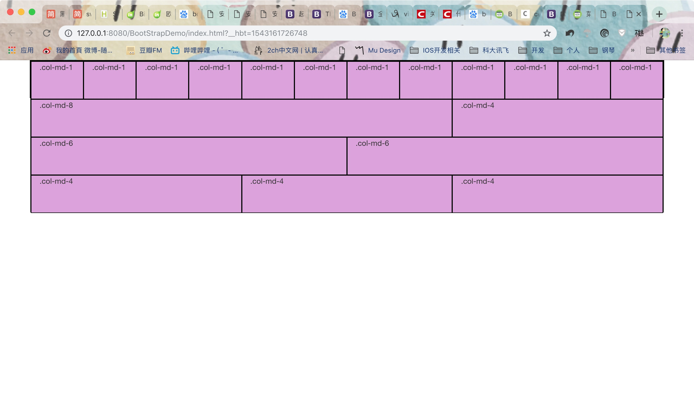

# Bootstrap基础
> Bootstrap，来自 Twitter，是目前最受欢迎的前端框架,它基于 HTML、CSS、JavaScript ，是一个用于快速开发 Web 应用程序和网站的前端框架。

***为什么要使用Bootstrap***

* 移动设备优先：自 Bootstrap 3 起，框架包含了贯穿于整个库的移动设备优先的样式。
* 浏览器支持：所有的主流浏览器都支持 Bootstrap。
Internet Explorer Firefox Opera Google Chrome Safari

* 容易上手：只要具备 HTML 和 CSS 的基础知识，就可以开始学习 Bootstrap。
* 响应式设计：Bootstrap 的响应式 CSS 能够自适应于台式机、平板电脑和手机。
* 它为开发人员创建接口提供了一个简洁统一的解决方案。
* 它包含了功能强大的内置组件，易于定制。
* 它还提供了基于 Web 的定制。
* 它是开源的。

***Bootstrap框架包内容***

1. 基本结构：Bootstrap 提供了一个带有栅格系统、链接样式、背景的基本结构。
1. **CSS**：Bootstrap 自带以下特性：全局的 CSS 设置、定义基本的 HTML 元素样式、可扩展的 class，以及一个先进的栅格系统。这将在 Bootstrap CSS 部分详细讲解。
1. **组件**：Bootstrap 包含了十几个可重用的组件，用于创建图像、下拉菜单、导航、警告框、弹出框等等。
1. **JavaScript 插件**：Bootstrap 包含了十几个自定义的 jQuery 插件。您可以直接包含所有的插件，也可以逐个包含这些插件。
1. 定制：您可以定制 Bootstrap 的组件、LESS 变量和 jQuery 插件来得到您自己的版本。


## （一）环境安装
### 1、下载
可以从 https://v3.bootcss.com/ 上下载 Bootstrap 的预编译版本，预编译文件可以直接使用到任何 web 项目中的。是编译并压缩后的 CSS、JavaScript 和字体文件，不包含文档和源码文件。


打开即可看到如下bootstrap文件，是 Bootstrap 的基本文件结构：提供了编译好的 CSS 和 JS (bootstrap.\*) 文件，还有经过压缩的 CSS 和 JS (bootstrap.min.*) 文件。同时还提供了 CSS 源码映射表 (bootstrap.*.map) ，可以在某些浏览器的开发工具中使用。同时还包含了来自 Glyphicons 的图标字体，在附带的 Bootstrap 主题中使用到了这些图标：


我们可以通过HBuilder将bootstrap包导入我们的项目中，可以使用以下给出的简单的 HTML 基础模版，或者修改这些实例。建议对这些实例按照自己的需求进行修改，而不要简单的复制、粘贴。

```html
<!DOCTYPE html>
<html lang="zh-CN">
  <head>
    <meta charset="utf-8">
    <meta http-equiv="X-UA-Compatible" content="IE=edge">
    <meta name="viewport" content="width=device-width, initial-scale=1">
    <!-- 上述3个meta标签*必须*放在最前面，任何其他内容都*必须*跟随其后！ -->
    <title>Bootstrap 101 Template</title>

    <!-- Bootstrap -->
    <link rel="stylesheet" type="text/css" href="css/bootstrap.min.css"/>

    <!-- HTML5 shim 和 Respond.js 是为了让 IE8 支持 HTML5 元素和媒体查询（media queries）功能 -->
    <!-- 警告：通过 file:// 协议（就是直接将 html 页面拖拽到浏览器中）访问页面时 Respond.js 不起作用 -->
    <!--[if lt IE 9]>
      <script src="https://cdn.jsdelivr.net/npm/html5shiv@3.7.3/dist/html5shiv.min.js"></script>
      <script src="https://cdn.jsdelivr.net/npm/respond.js@1.4.2/dest/respond.min.js"></script>
    <![endif]-->
  </head>
  <body>
    <h1>你好，世界！</h1>

    <!-- jQuery (Bootstrap 的所有 JavaScript 插件都依赖 jQuery，所以必须放在前边) -->
    <script type="text/javascript" src="js/jquery-3.3.1.min.js" ></script>
    <!-- 加载 Bootstrap 的所有 JavaScript 插件。你也可以根据需要只加载单个插件。 -->
    <script type="text/javascript" src="js/bootstrap.min.js" ></script>
  </body>
</html>
```

当然，我们也可以通过CDN（内容分发网络）引入bootstrap库，如下：

```html
<!DOCTYPE html>
<html lang="zh-CN">
  <head>
    <meta charset="utf-8">
    <meta http-equiv="X-UA-Compatible" content="IE=edge">
    <meta name="viewport" content="width=device-width, initial-scale=1">
    <!-- 上述3个meta标签*必须*放在最前面，任何其他内容都*必须*跟随其后！ -->
    <title>Bootstrap 101 Template</title>

    <!-- Bootstrap -->
    <link href="https://cdn.jsdelivr.net/npm/bootstrap@3.3.7/dist/css/bootstrap.min.css" rel="stylesheet">

    <!-- HTML5 shim 和 Respond.js 是为了让 IE8 支持 HTML5 元素和媒体查询（media queries）功能 -->
    <!-- 警告：通过 file:// 协议（就是直接将 html 页面拖拽到浏览器中）访问页面时 Respond.js 不起作用 -->
    <!--[if lt IE 9]>
      <script src="https://cdn.jsdelivr.net/npm/html5shiv@3.7.3/dist/html5shiv.min.js"></script>
      <script src="https://cdn.jsdelivr.net/npm/respond.js@1.4.2/dest/respond.min.js"></script>
    <![endif]-->
  </head>
  <body>
    <h1>你好，世界！</h1>

    <!-- jQuery (Bootstrap 的所有 JavaScript 插件都依赖 jQuery，所以必须放在前边) -->
    <script src="https://cdn.jsdelivr.net/npm/jquery@1.12.4/dist/jquery.min.js"></script>
    <!-- 加载 Bootstrap 的所有 JavaScript 插件。你也可以根据需要只加载单个插件。 -->
    <script src="https://cdn.jsdelivr.net/npm/bootstrap@3.3.7/dist/js/bootstrap.min.js"></script>
  </body>
</html>
```

## （二）基础内容

### 1、HTML5文档类型
> Bootstrap 使用了一些 HTML5 元素和 CSS3 属性，所以为了让这些正常工作，我们需要使用 HTML5 文档类型（Doctype），否则会出现一些浏览器显示不一致的问题。

```html
<!DOCTYPE html>
<html lang="zh-CN">
  ...
</html>
```

### 2、移动设备优先
> Bootstrap 3 的设计目标是移动设备优先，然后才是桌面设备，因为现在越来越多的用户使用移动设备，为了让 Bootstrap 开发的网站对移动设备友好，确保适当的绘制和触屏缩放，需要在网页的 head 的`meta` 标签之中添加 `viewport` ，viewprot，即“视口”，是用户网页的可视区域。如下：

```html
<meta name="viewport" content="width=device-width, initial-scale=1.0">
```
在看viewport的具体用法之前，我们先搞清楚几个概念。

1. **layout viewport**：是网页的所有**内容**，它可以全部或者部分展示给用户。

2. **visual viewport**：就是当前显示给用户内容的**窗口**，我们可以拖动或者放大缩小网页。

如下图：


* width 属性控制设备的宽度。假设我们的网站将被带有不同屏幕分辨率的设备浏览，那么将它设置为 device-width 可以确保它能正确呈现在不同设备上。

* initial-scale=1.0 确保网页加载时，以 1:1 的比例呈现，不会有任何的缩放。

* 在移动设备浏览器上，通过为 viewport meta 标签添加 user-scalable=no 可以禁用其缩放（zooming）功能。

* 通常情况下，maximum-scale=1.0 与 user-scalable=no 一起使用。这样禁用缩放功能后，用户只能滚动屏幕，就能让网站看上去更像原生应用的感觉。

* 最后一个属性为安卓特有，并且安卓已经决定要废弃target-densitydpi 这个属性了，所以这个属性我们要避免进行使用 。

### 3、响应式图像
> 通过添加 `img-responsive` class 可以让 Bootstrap 3 中的图像对响应式布局的支持更友好，如下：

```html

```
以下是此 class 所包含的 css 属性：

```
.img-responsive {
  display: block;
  height: auto;
  max-width: 100%;
}
```

从以上的代码中：

* 可以看出图像呈现为 block，以块级元素显示。

* 设置 height:auto，则图像的高度就取决于浏览器了。

* 设置 max-width 为 100% 会重写任何通过 width 属性指定的宽度。这让图片对响应式布局的支持更友好。

所以img-responsive class 为图像赋予了 max-width: 100%; 和 height: auto; 属性，可以让图像按比例缩放，不超过其父元素的尺寸。


### 4、全局显示

在Bootstrap 3 中，通过body {margin: 0;} 移除了 body 的边距，关于body包含的 css 属性如下：


```
body {
  font-family: "Helvetica Neue", Helvetica, Arial, sans-serif;
  font-size: 14px;
  line-height: 1.428571429;
  color: #333333;
  background-color: #ffffff;
}
```
* 设置了 body 的默认字体样式为 "Helvetica Neue", Helvetica, Arial, sans-serif。

* 设置了文本的默认字体大小为 14 像素。

* 设置了默认的行高度为 1.428571429。

* 设置了默认的文本颜色为 #333333。

* 设置了默认的背景颜色为白色。

### 5、排版与链接

Bootstrap 排版、链接样式设置了基本的全局样式。分别是：

* 为 body 元素设置 `background-color: #fff`;
* 使用 `@font-family-base`、`@font-size-base` 和 `@line-height-base` 变量作为排版的基本参数
* 为所有链接设置了基本颜色 `@link-color` ，并且当链接处于 `:hover` 状态时才添加下划线

### 6、布局容器

Bootstrap 需要为页面内容和栅格系统包裹一个 .container 容器。因此提供了两个作此用处的类（container与container-fluid）。注意，由于 padding 等属性的原因，这两种容器类不能互相嵌套:

.container 类用于固定宽度并支持响应式布局的容器:

```
<div class="container">
  ...
</div>
```

.container-fluid 类用于 100% 宽度，占据全部视口（viewport）的容器:  

```
<div class="container-fluid">
  ...
</div>
```

在container的样式中， 左右外边距（margin-right、margin-left）交由浏览器决定了，然后左右内边距都为15px，因为是固定值，所以默认情况下container容器是不可嵌套的。

### 7、Bootstrap 浏览器/设备支持

Bootstrap 可以在最新的桌面系统和移动端浏览器中很好的工作，旧的浏览器可能无法很好的支持，下表为 Bootstrap 支持最新版本的浏览器和平台：

**Mobile devices**


**Desktop browsers**


*注意：在Windows系统上，Bootstrap 支持 Internet Explorer 8 - 11 的版本。*

## （三）栅格系统（Grid System）

Bootstrap 提供了一套响应式、移动设备优先的流式栅格系统，随着屏幕或视口（viewport）尺寸的增加，系统会自动分为**最多12列**。它包含了用于简单的布局选项的预定义类，也包含了用于生成更多语义布局的功能强大的混合类。

Bootstrap 3 是移动设备优先的，所以Bootstrap 代码从小屏幕设备（比如移动设备、平板电脑）开始，然后扩展到大屏幕设备（比如笔记本电脑、台式电脑）上的组件和栅格。渐进增强的特点，随着屏幕大小的增加而添加元素，即随着屏幕或视口（viewport）尺寸的增加，系统会自动分为最多12列。


**移动设备优先策略**

* 内容
    * 决定什么是最重要的。
    
* 布局
    * 优先设计更小的宽度。
    * 基础的 CSS 是移动设备优先，媒体查询是针对于平板电脑、台式电脑。
    
* 渐进增强
    * 随着屏幕大小的增加而添加元素。

### 原理

栅格系统用于通过一系列的行（row）与列（column）的组合来创建页面布局，我们的内容就可以放入这些创建好的布局中。下面就介绍一下 Bootstrap 栅格系统的工作原理：

*Bootstrap 栅格系统（Grid System）的工作原理：*

栅格系统通过一系列包含内容的行和列来创建页面布局。下面列出了 Bootstrap 栅格系统是如何工作的：

* “行（row）”必须包含在 `.container` （固定宽度）或 .container-fluid （100% 宽度）中，以便为其赋予合适的排列（aligment）和内补（padding）。
* 通过“行（row）”在水平方向创建一组“列（column）”。
* 我们的内容应当放置于“列（column）”内，并且，只有“列（column）”可以作为行（row）”的直接子元素。
* 通过使用类似于 `.row` 和 `.col-xs-4` 这种预定义的类，可以用来快速创建栅格布局。Bootstrap 源码中定义的 mixin 也可以用来创建语义化的布局。
* 可以给“列（column）”设置 padding 属性，来创建列与列之间的间隔（gutter）。通过给 .row 元素设置负值 margin 从而抵消掉为 .container 元素设置的 padding，也就间接为“行（row）”所包含的“列（column）”抵消掉了padding。
* 栅格系统中的列是通过指定1到12的值来表示其跨越的范围。例如，三个等宽的列可以使用三个 .col-xs-4 来创建。
* 如果一“行（row）”中包含了的“列（column）”大于 12，多余的“列（column）”所在的元素将被作为一个整体另起一行排列。
* 栅格类适用于与屏幕宽度大于或等于分界点大小的设备， 并且针对小屏幕设备覆盖栅格类。 因此，在元素上应用任何 .col-md-* 栅格类适用于与屏幕宽度大于或等于分界点大小的设备 ， 并且针对小屏幕设备覆盖栅格类。 

### 媒体查询

在栅格系统中，我们在 Less 文件中使用以下媒体查询（media query）来创建关键的分界点阈值。

```
/* 超小屏幕（手机，小于 768px） */
/* 没有任何媒体查询相关的代码，因为这在 Bootstrap 中是默认的（还记得 Bootstrap 是移动设备优先的吗？） */

/* 小屏幕（平板，大于等于 768px） */
@media (min-width: @screen-sm-min) { ... }

/* 中等屏幕（桌面显示器，大于等于 992px） */
@media (min-width: @screen-md-min) { ... }

/* 大屏幕（大桌面显示器，大于等于 1200px） */
@media (min-width: @screen-lg-min) { ... }
```

我们偶尔也会在媒体查询代码中包含 max-width 从而将 CSS 的影响限制在更小范围的屏幕大小之内。

```
@media (max-width: @screen-xs-max) { ... }
@media (min-width: @screen-sm-min) and (max-width: @screen-sm-max) { ... }
@media (min-width: @screen-md-min) and (max-width: @screen-md-max) { ... }
@media (min-width: @screen-lg-min) { ... }
```
通常，媒体查询有两个部分，先是一个设备规范，然后是一个大小规则。如上代码中的：

`@media (min-width: @screen-sm-min) and (max-width: @screen-sm-max) { ... }`

则表示对于所有带有 min-width: @screen-sm-min 的设备，如果屏幕的宽度小于 @screen-sm-max，则会进行一些处理。

### 栅格参数

通过下表可以详细查看 Bootstrap 的栅格系统是如何在多种屏幕设备上工作的。


### 栅格基本结构

```html
<div class="container">
   <div class="row">
      <div class="col-*-*"></div>
      <div class="col-*-*"></div>      
   </div>
   <div class="row">...</div>
</div>
<div class="container">....
```

#### 布局容器
Bootstrap 需要为页面内容和栅格系统包裹一个 `.container` 容器。我们提供了两个作此用处的类。注意，由于 `padding` 等属性的原因，这两种容器类不能互相嵌套：

`.container` 类用于固定宽度并支持响应式布局的容器：

```html
<div class="container">
  ...
</div>
```
`.container-fluid` 类用于 100% 宽度，占据全部视口（viewport）的容器，即流式布局容器，可以将固定宽度的栅格布局转换为 100% 宽度的布局。

```html
<div class="container-fluid">
  ...
</div>
```
#### 实例：从堆叠到水平排列

如下例子，从堆叠到水平排列：


```html
<!DOCTYPE html>
<html lang="zh-CN">
  <head>
    <meta charset="utf-8">
    <meta http-equiv="X-UA-Compatible" content="IE=edge">
    <meta name="viewport" content="width=device-width, initial-scale=1">
    <!-- 上述3个meta标签*必须*放在最前面，任何其他内容都*必须*跟随其后！ -->
    <title>Bootstrap 101 Template</title>

    <!-- Bootstrap -->
    <link rel="stylesheet" type="text/css" href="css/bootstrap.min.css"/>

    <!-- HTML5 shim 和 Respond.js 是为了让 IE8 支持 HTML5 元素和媒体查询（media queries）功能 -->
    <!-- 警告：通过 file:// 协议（就是直接将 html 页面拖拽到浏览器中）访问页面时 Respond.js 不起作用 -->
    <!--[if lt IE 9]>
      <script src="https://cdn.jsdelivr.net/npm/html5shiv@3.7.3/dist/html5shiv.min.js"></script>
      <script src="https://cdn.jsdelivr.net/npm/respond.js@1.4.2/dest/respond.min.js"></script>
    <![endif]-->
    <style>
    		div {
    			border: black 1px solid;
    			background-color: plum;
    			height: 70px;
    		}
    </style>
  </head>
  <body>

	<div class="container">
		<div class="row">
			<div class="col-md-1">.col-md-1</div>
			<div class="col-md-1">.col-md-1</div>
			<div class="col-md-1">.col-md-1</div>
			<div class="col-md-1">.col-md-1</div>
			<div class="col-md-1">.col-md-1</div>
			<div class="col-md-1">.col-md-1</div>
			<div class="col-md-1">.col-md-1</div>
			<div class="col-md-1">.col-md-1</div>
			<div class="col-md-1">.col-md-1</div>
			<div class="col-md-1">.col-md-1</div>
			<div class="col-md-1">.col-md-1</div>
			<div class="col-md-1">.col-md-1</div>
		</div>
		
		<div class="row">
			<div class="col-md-8">.col-md-8</div>
			<div class="col-md-4">.col-md-4</div>
		</div>
		
		<div class="row">
			<div class="col-md-6">.col-md-6</div>
			<div class="col-md-6">.col-md-6</div>
		</div>
				
		<div class="row">
			<div class="col-md-4">.col-md-4</div>
			<div class="col-md-4">.col-md-4</div>
			<div class="col-md-4">.col-md-4</div>
		</div>
	</div>
    <!-- jQuery (Bootstrap 的所有 JavaScript 插件都依赖 jQuery，所以必须放在前边) -->
    <script type="text/javascript" src="js/jquery-3.3.1.min.js" ></script>
    <!-- 加载 Bootstrap 的所有 JavaScript 插件。你也可以根据需要只加载单个插件。 -->
    <script type="text/javascript" src="js/bootstrap.min.js" ></script>
  </body>
</html>
```
在以上代码中，`<div class="container">...</div>` 元素被添加，用来确保居中和最大宽度。
一旦添加了容器，接下来我们需要考虑以行为单位。添加 `<div class="row">...</div>`，并在行内添加列 `<div class="col-md-1"></div>`。
网格中的每一行是由 12 个单元组成的，我们可以使用这些单元定义列的尺寸。在我们的实例中，有两个列，每个列由 6 个单元组成，即 6+6=12。
效果如下：




我们使用单一的一组 `.col-md-*` 栅格类，就可以创建一个基本的栅格系统，在手机和平板设备上一开始是堆叠在一起的（超小屏幕到小屏幕这一范围），在桌面（中等）屏幕设备上变为水平排列。所有“列（column）必须放在 ” `.row` 内。

#### 实例：流式布局容器

将最外面的布局元素 `.container` 修改为 `.container-fluid`，就可以将固定宽度的栅格布局转换为 `100%` 宽度的布局。

将以上的代码中的`.container` 修改为 `.container-fluid`，则界面效果图如下：


> 注意：
> 因为我们使用的是中等屏幕布局，所以当元素在超小屏幕和小屏幕上时默认会堆叠在一起，如下：


#### 实例：移动设备和桌面屏幕
如果我们不想要在小屏幕设备上所有列都堆叠在一起，那就使用针对超小屏幕和中等屏幕设备所定义的类，即 `.col-xs-*` 和 `.col-md-*`：


```html
<!DOCTYPE html>
<html lang="zh-CN">
  <head>
    <meta charset="utf-8">
    <meta http-equiv="X-UA-Compatible" content="IE=edge">
    <meta name="viewport" content="width=device-width, initial-scale=1">
    <!-- 上述3个meta标签*必须*放在最前面，任何其他内容都*必须*跟随其后！ -->
    <title>Bootstrap 101 Template</title>

    <!-- Bootstrap -->
    <link rel="stylesheet" type="text/css" href="css/bootstrap.min.css"/>

    <!-- HTML5 shim 和 Respond.js 是为了让 IE8 支持 HTML5 元素和媒体查询（media queries）功能 -->
    <!-- 警告：通过 file:// 协议（就是直接将 html 页面拖拽到浏览器中）访问页面时 Respond.js 不起作用 -->
    <!--[if lt IE 9]>
      <script src="https://cdn.jsdelivr.net/npm/html5shiv@3.7.3/dist/html5shiv.min.js"></script>
      <script src="https://cdn.jsdelivr.net/npm/respond.js@1.4.2/dest/respond.min.js"></script>
    <![endif]-->
    <style>
    		div {
    			border: black 1px solid;
    			background-color: plum;
    			height: 70px;
    		}
    </style>
  </head>
  <body>

	<div class="container">
		
		<div class="row">
			<div class="col-md-8 col-xs-8">.col-md-8 .col-xs-8</div>
			<div class="col-md-4 col-xs-4">.col-md-4 .col-xs-4</div>
		</div>
		
		<div class="row">
			<div class="col-md-6 col-xs-6">.col-md-6 .col-xs-6</div>
			<div class="col-md-6 col-xs-6">.col-md-6 .col-xs-8</div>
		</div>
				
		<div class="row">
			<div class="col-md-4 col-xs-4">.col-md-4 .col-xs-4</div>
			<div class="col-md-4 col-xs-4">.col-md-4 .col-xs-4</div>
			<div class="col-md-4 col-xs-4">.col-md-4 .col-xs-4</div>
		</div>
	</div>
    <!-- jQuery (Bootstrap 的所有 JavaScript 插件都依赖 jQuery，所以必须放在前边) -->
    <script type="text/javascript" src="js/jquery-3.3.1.min.js" ></script>
    <!-- 加载 Bootstrap 的所有 JavaScript 插件。你也可以根据需要只加载单个插件。 -->
    <script type="text/javascript" src="js/bootstrap.min.js" ></script>
  </body>
</html>
```

效果如下图：


#### 实例：手机、平板、桌面
在上面案例的基础上，可以通过使用针对平板设备的 `.col-sm-*` 类


```html
<div class="row">
	<div class="col-xs-12 col-sm-6 col-md-8">.col-xs-12 .col-sm-6 .col-md-8</div>
	<div class="col-sm-6 col-md-4">.col-sm-6 .col-md-4</div>
</div>
<div class="row">
	<div class="col-xs-6 col-sm-4">.col-xs-6 .col-sm-4</div>
	<div class="col-xs-6 col-sm-4">.col-xs-6 .col-sm-4</div>
	<!-- Optional: clear the XS cols if their content doesn't match in height -->
	<div class="clearfix visible-xs-block"></div>
	<div class="col-xs-6 col-sm-4">.col-xs-6 .col-sm-4</div>
</div>
```

注意：


### 2、列偏移
偏移是一个用于更专业的布局的功能，可以用来给列腾出更多的空间。例如，`.col-xs-*` 类不支持偏移，但是它们可以简单地通过使用一个空的单元格来实现该效果。为了在大屏幕显示器上使用偏移，建议使用 `.col-md-offset-*` 类。这些类会把一个列的左外边距（margin）增加 `*` 列，其中 `*` 范围是从 `1 到 11`。

这些类实际是通过使用 `*` 选择器为当前元素增加了左侧的边距（margin）。例如，`.col-md-offset-4` 类将 `.col-md-4` 元素向右侧偏移了4个列（column）的宽度。

在下面的实例中，我们有 `<div class="col-md-6">..</div>`，我们将使用` .col-md-offset-3` class 来居中这个 div：

```html
<!DOCTYPE html>
<html lang="zh-CN">

	<head>
		<meta charset="utf-8">
		<meta http-equiv="X-UA-Compatible" content="IE=edge">
		<meta name="viewport" content="width=device-width, initial-scale=1">
		<!-- 上述3个meta标签*必须*放在最前面，任何其他内容都*必须*跟随其后！ -->
		<title>Bootstrap 101 Template</title>

		<!-- Bootstrap -->
		<link rel="stylesheet" type="text/css" href="css/bootstrap.min.css" />

		<!-- HTML5 shim 和 Respond.js 是为了让 IE8 支持 HTML5 元素和媒体查询（media queries）功能 -->
		<!-- 警告：通过 file:// 协议（就是直接将 html 页面拖拽到浏览器中）访问页面时 Respond.js 不起作用 -->
		<!--[if lt IE 9]>
      <script src="https://cdn.jsdelivr.net/npm/html5shiv@3.7.3/dist/html5shiv.min.js"></script>
      <script src="https://cdn.jsdelivr.net/npm/respond.js@1.4.2/dest/respond.min.js"></script>
    <![endif]-->
		<style>
			div {
				border: black 1px solid;
				background-color: plum;
				height: 70px;
			}
		</style>
	</head>

	<body>

		<div class="container">
			<h1>Hello, world!</h1>
			<div class="row">
				<div class="col-xs-6 col-md-offset-3" style="background-color: #dedef8;box-shadow: 
				inset 1px -1px 1px #444">
					<p>向右偏移3列.</p>
				</div>
			</div>
		</div>
		<!-- jQuery (Bootstrap 的所有 JavaScript 插件都依赖 jQuery，所以必须放在前边) -->
		<script type="text/javascript" src="js/jquery-3.3.1.min.js"></script>
		<!-- 加载 Bootstrap 的所有 JavaScript 插件。你也可以根据需要只加载单个插件。 -->
		<script type="text/javascript" src="js/bootstrap.min.js"></script>
	</body>

</html>
```

效果如下图：


### 3、列排序

Bootstrap 网格系统另一个完美的特性，就是可以很容易地以一种顺序编写列，然后以另一种顺序显示列。我们可以通过改变带有 .col-md-push-* 和 .col-md-pull-* 类的内置网格列的顺序，其中 * 范围是从 1 到 11。

在下面的实例中，我们有两列布局，左列很窄，作为侧边栏。我们将使用 .col-md-push-* 和 .col-md-pull-* 类来互换这两列的顺序

```html
<!DOCTYPE html>
<html lang="zh-CN">

	<head>
		<meta charset="utf-8">
		<meta http-equiv="X-UA-Compatible" content="IE=edge">
		<meta name="viewport" content="width=device-width, initial-scale=1">
		<!-- 上述3个meta标签*必须*放在最前面，任何其他内容都*必须*跟随其后！ -->
		<title>Bootstrap 101 Template</title>

		<!-- Bootstrap -->
		<link rel="stylesheet" type="text/css" href="css/bootstrap.min.css" />

		<!-- HTML5 shim 和 Respond.js 是为了让 IE8 支持 HTML5 元素和媒体查询（media queries）功能 -->
		<!-- 警告：通过 file:// 协议（就是直接将 html 页面拖拽到浏览器中）访问页面时 Respond.js 不起作用 -->
		<!--[if lt IE 9]>
      <script src="https://cdn.jsdelivr.net/npm/html5shiv@3.7.3/dist/html5shiv.min.js"></script>
      <script src="https://cdn.jsdelivr.net/npm/respond.js@1.4.2/dest/respond.min.js"></script>
    <![endif]-->
		<style>
			div {
				border: black 1px solid;
				background-color: plum;
				height: 70px;
			}
		</style>
	</head>

	<body>

		<div class="container">

            <h1>Hello, world!</h1>

            <div class="row">
                <p>排序前</p>
                <div class="col-md-4" style="background-color: #dedef8;
         box-shadow: inset 1px -1px 1px #444, inset -1px 1px 1px #444;">
                    我在左边
                </div>
                <div class="col-md-8" style="background-color: #dedef8;
         box-shadow: inset 1px -1px 1px #444, inset -1px 1px 1px #444;">
                    我在右边
                </div>
            </div><br>
            <div class="row">
                <p>排序后</p>
                <div class="col-md-4 col-md-push-8" style="background-color: #dedef8;
         box-shadow: inset 1px -1px 1px #444, 
         inset -1px 1px 1px #444;">
                    我在左边
                </div>
                <div class="col-md-8 col-md-pull-4" style="background-color: #dedef8;
         box-shadow: inset 1px -1px 1px #444, 
         inset -1px 1px 1px #444;">
                    我在右边
                </div>
            </div>

        </div>
		<!-- jQuery (Bootstrap 的所有 JavaScript 插件都依赖 jQuery，所以必须放在前边) -->
		<script type="text/javascript" src="js/jquery-3.3.1.min.js"></script>
		<!-- 加载 Bootstrap 的所有 JavaScript 插件。你也可以根据需要只加载单个插件。 -->
		<script type="text/javascript" src="js/bootstrap.min.js"></script>
	</body>

</html>
```

效果图如下：


### 4、列嵌套
为了在内容中嵌套默认的网格，我们可以添加一个新的 .row，并在一个已有的 .col-md-* 列内添加一组 .col-md-* 列。被嵌套的行应包含一组列，这组列个数不能超过12，不过也没有要求必须占满12列。

在下面的实例中，布局有两个列，第二列被分为两行四个盒子。

```html
<!DOCTYPE html>
<html lang="zh-CN">

	<head>
		<meta charset="utf-8">
		<meta http-equiv="X-UA-Compatible" content="IE=edge">
		<meta name="viewport" content="width=device-width, initial-scale=1">
		<!-- 上述3个meta标签*必须*放在最前面，任何其他内容都*必须*跟随其后！ -->
		<title>Bootstrap 101 Template</title>

		<!-- Bootstrap -->
		<link rel="stylesheet" type="text/css" href="css/bootstrap.min.css" />

		<!-- HTML5 shim 和 Respond.js 是为了让 IE8 支持 HTML5 元素和媒体查询（media queries）功能 -->
		<!-- 警告：通过 file:// 协议（就是直接将 html 页面拖拽到浏览器中）访问页面时 Respond.js 不起作用 -->
		<!--[if lt IE 9]>
      <script src="https://cdn.jsdelivr.net/npm/html5shiv@3.7.3/dist/html5shiv.min.js"></script>
      <script src="https://cdn.jsdelivr.net/npm/respond.js@1.4.2/dest/respond.min.js"></script>
    <![endif]-->
		<style>
			div {
				border: black 1px solid;
				background-color: plum;
				height: 70px;
			}
		</style>
	</head>

	<body>

		<div class="container">

            <h1>Hello, world!</h1>

            <div class="row">
                <div class="col-md-3" style="background-color: #dedef8;box-shadow: 
         inset 1px -1px 1px #444, inset -1px 1px 1px #444;">
                    <h4>第一列</h4>
                    <p>这个是第一列中的内容，这个内容是很长的</p>
                </div>

                <div class="col-md-9" style="background-color: #dedef8;box-shadow: 
         inset 1px -1px 1px #444, inset -1px 1px 1px #444;">
                    <h4>第二列 - 两行，分为四个盒子</h4>
                    <div class="row">
                        <div class="col-md-6" style="background-color: #B18904;
               box-shadow: inset 1px -1px 1px #444, inset -1px 1px 1px #444;">
                            <p>这个是第二列，第一行中的第一个内容，这个内容是很长的</p>
                        </div>
                        <div class="col-md-6" style="background-color: #B18904;
               box-shadow: inset 1px -1px 1px #444, inset -1px 1px 1px #444;">
                            <p>这个是第二列，第一行中的第二个内容，这个内容也是很长的</p>
                        </div>
                    </div>

                    <div class="row">
                        <div class="col-md-6" style="background-color: #B18904;
               box-shadow: inset 1px -1px 1px #444, inset -1px 1px 1px #444;">
                            <p>这个是第二列，第二行中的第一个内容，这个内容是很长的</p>
                        </div>
                        <div class="col-md-6" style="background-color: #B18904;
               box-shadow: inset 1px -1px 1px #444, inset -1px 1px 1px #444;">
                            <p>这个是第二列，第二行中的第二个内容，这个内容也是很长的</p>
                        </div>
                    </div>
                </div>
            </div>
            
        </div>
		<!-- jQuery (Bootstrap 的所有 JavaScript 插件都依赖 jQuery，所以必须放在前边) -->
		<script type="text/javascript" src="js/jquery-3.3.1.min.js"></script>
		<!-- 加载 Bootstrap 的所有 JavaScript 插件。你也可以根据需要只加载单个插件。 -->
		<script type="text/javascript" src="js/bootstrap.min.js"></script>
	</body>

</html>
```


效果图如下：


