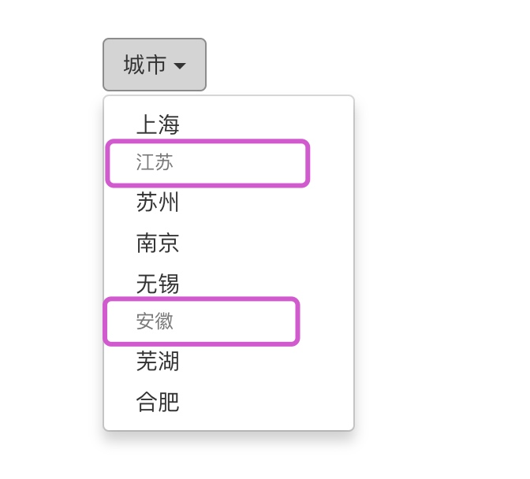
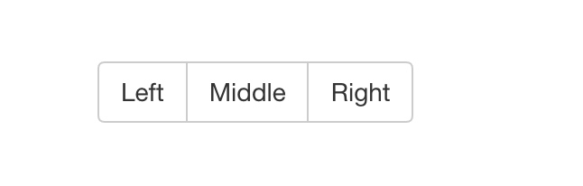

# Bootstrap常用组件（一）

## 一、下拉菜单
> 用于显示链接列表的可切换、有上下文的菜单，下拉菜单的JavaScript 插件让它具有了交互性。使用下拉菜单（Dropdown）插件，我们可以向其他组件中添加下拉菜单，比如：导航栏、标签页、胶囊式导航菜单、按钮等。

### （一）实例
将下拉菜单触发器和下拉菜单都包裹在 .dropdown 里，然后加入组成菜单的 HTML 代码：

```html
<!DOCTYPE html>
<html lang="zh-CN">

    <head>
        <meta charset="utf-8">
        <meta http-equiv="X-UA-Compatible" content="IE=edge">
        <meta name="viewport" content="width=device-width, initial-scale=1">
        <!-- 上述3个meta标签*必须*放在最前面，任何其他内容都*必须*跟随其后！ -->
        <title>Bootstrap 101 Template</title>

        <!-- Bootstrap -->
        <link rel="stylesheet" type="text/css" href="css/bootstrap.min.css" />

        <!-- HTML5 shim 和 Respond.js 是为了让 IE8 支持 HTML5 元素和媒体查询（media queries）功能 -->
        <!-- 警告：通过 file:// 协议（就是直接将 html 页面拖拽到浏览器中）访问页面时 Respond.js 不起作用 -->
        <!--[if lt IE 9]>
      <script src="https://cdn.jsdelivr.net/npm/html5shiv@3.7.3/dist/html5shiv.min.js"></script>
      <script src="https://cdn.jsdelivr.net/npm/respond.js@1.4.2/dest/respond.min.js"></script>
    <![endif]-->
    </head>

    <body>
		<div class="container" style="margin-top: 300px;">
			<div class="dropdown">
				<!--data-toggle属性用来设置样式的，设置为dropdown样式-->
				<button class="btn btn-default dropdown-toggle " data-toggle="dropdown"  id="dropdownBtn">
					城市
				<!--caret，可以为下拉按钮添加三角形样式-->
				<span class="caret"></span>
				</button>
				<!--通过.dropdown-menu来绑定下列表中的内容-->
				<ul class="dropdown-menu">
					<li><a href="#">苏州</a></li>
					<li><a href="#">上海</a></li>
					<li><a href="#">南京</a></li>
					<li><a href="#">无锡</a></li>
					<li><a href="#">芜湖</a></li>
				</ul>
				
			</div>
		</div>
        
        <!-- jQuery (Bootstrap 的所有 JavaScript 插件都依赖 jQuery，所以必须放在前边) -->
        <script type="text/javascript" src="js/jquery-3.3.1.min.js"></script>
        <!-- 加载 Bootstrap 的所有 JavaScript 插件。你也可以根据需要只加载单个插件。 -->
        <script type="text/javascript" src="js/bootstrap.min.js"></script>
    </body>

</html>
```

效果如下图：


以上代码中，data-toggle属性用来设置样式的，设置为dropdown样式，然后通过.dropdown-menu把内容绑定到按钮上。

> Tips：
> 在以上案例中通过为下拉菜单的父元素container设置了`.dropdown`所以下拉列表在下方显示，我们也可以设置成 `.dropup` 类，可以让菜单向上弹出（默认是向下弹出的），如下：
> 


### （二）对齐
> 默认情况下，下拉菜单自动沿着父元素的下沿和左侧被定位为 100% 宽度。我们可以通过 为 `.dropdown-menu` 添加 `.dropdown-menu-right` 类可以让菜单右对齐：

```html
<ul class="dropdown-menu dropdown-menu-right">
  ...
</ul>
```


### （三）标题
我们可以在任何下拉菜单通过添加标题来进行分组，通过`.dropdown-header`来设置标题的内容：

```html
<div class="container" style="margin-top: 300px;">
	<div class="dropdown">
		<!--data-toggle属性用来设置样式的，设置为dropdown样式-->
		<button class="btn btn-default dropdown-toggle " data-toggle="dropdown" id="dropdownBtn">
			城市
		<!--caret，可以为下拉按钮添加三角形样式-->
		<span class="caret"></span>
		</button>
		<!--通过.dropdown-menu来绑定下列表中的内容-->
		<ul class="dropdown-menu">
			<li><a href="#">上海</a></li>
			<li class="dropdown-header">江苏</li>
			<li><a href="#">苏州</a></li>
			<li><a href="#">南京</a></li>
			<li><a href="#">无锡</a></li>
			<li class="dropdown-header">安徽</li>
			<li><a href="#">芜湖</a></li>
			<li><a href="#">合肥</a></li>
		</ul>
		
	</div>
</div>
```

效果图如下：



### （四）分割线
我们可以通过`.divider`来为下拉菜单添加一条分割线，用于将多个链接分组：

```html
<div class="container" style="margin-top: 300px;">
	<div class="dropdown">
		<!--data-toggle属性用来设置样式的，设置为dropdown样式-->
		<button class="btn btn-default dropdown-toggle " data-toggle="dropdown" id="dropdownBtn">
			城市
		<!--caret，可以为下拉按钮添加三角形样式-->
		<span class="caret"></span>
		</button>
		<!--通过.dropdown-menu来绑定下列表中的内容-->
		<ul class="dropdown-menu">
			<li><a href="#">上海</a></li>
			<li class="divider" role="separator"></li>
			<li class="dropdown-header">江苏</li>
			<li><a href="#">苏州</a></li>
			<li><a href="#">南京</a></li>
			<li><a href="#">无锡</a></li>
			<li class="divider" role="separator"></li>
			<li class="dropdown-header">安徽</li>
			<li><a href="#">芜湖</a></li>
			<li><a href="#">合肥</a></li>
		</ul>
		
	</div>
</div>
```

效果如下图：


> Tips：
> **role**，HTML5的标签属性，可以用于标识一个普通的标签，使之语义化，方便浏览器对其具体功能进行识别。简单的说，role是为了给一些特定的浏览工具，比如盲文浏览工具识别。
> 
> **aria**，即Accessible Rich Internet Application。 Accessible，是H5为不方便的人士提供的功能，比如windows的放大镜，语音朗读，高对比度主题等。


### （五）禁用菜单项
为下拉菜单中的` <li> `元素添加 `.disabled `类，从而禁用相应的菜单项:

```html
<li class="disabled"><a href="#">上海</a></li>
```


## 二、按钮组

> 通过按钮组容器把一组按钮放在同一行里。通过与按钮插件联合使用，可以设置为单选框或多选框的样式和行为。

### （一）实例
将`.btn`置入`.btn-group`中

```html
<div class="btn-group" role="group">
	<div type="button" class="btn btn-default">Left</div>
	<div type="button" class="btn btn-default">Middle</div>
	<div type="button" class="btn btn-default">Right</div>
</div>
```


### （二）按钮工具栏
把一组 `<div class="btn-group">` 组合进一个 `<div class="btn-toolbar">` 中就可以做成更复杂的组件：

```html
<div class="btn-toolbar">
	<div class="btn-group" role="group">
		<div type="button" class="btn btn-default">Left</div>
		<div type="button" class="btn btn-default">Middle</div>
		<div type="button" class="btn btn-default">Right</div>
	</div>
	
	<div class="btn-group" role="group">
		<div type="button" class="btn btn-default">左</div>
		<div type="button" class="btn btn-default">中</div>
		<div type="button" class="btn btn-default">右</div>
	</div>
	
	<div class="btn-group" role="group">
		<div type="button" class="btn btn-default">-1</div>
		<div type="button" class="btn btn-default">0</div>
		<div type="button" class="btn btn-default">1</div>
	</div>
</div>
```


### （三）尺寸
只要给 `.btn-group` 加上 `.btn-group-*` 类，就省去为按钮组中的每个按钮都赋予尺寸类了，如果包含了多个按钮组时也适用：

```html
<div class="btn-toolbar">
	<div class="btn-group btn-group-xs" role="group">
		<div type="button" class="btn btn-default">Left</div>
		<div type="button" class="btn btn-default">Middle</div>
		<div type="button" class="btn btn-default">Right</div>
	</div>
	
	<div class="btn-group btn-group-md" role="group">
		<div type="button" class="btn btn-default">左</div>
		<div type="button" class="btn btn-default">中</div>
		<div type="button" class="btn btn-default">右</div>
	</div>
	
	<div class="btn-group btn-group-lg" role="group">
		<div type="button" class="btn btn-default">-1</div>
		<div type="button" class="btn btn-default">0</div>
		<div type="button" class="btn btn-default">1</div>
	</div>
</div>
```


### （四）嵌套
想要把下拉菜单混合到一系列按钮中，只须把 .btn-group 放入另一个 .btn-group 中：

```html
<div class="btn-toolbar">
	<div class="btn-group" role="group">
		<div type="button" class="btn btn-default">Left</div>
		<div type="button" class="btn btn-default">Middle</div>
		<div type="button" class="btn btn-default">Right</div>
	</div>
	
	<div class="btn-group" role="group">
		<div type="button" class="btn btn-default">左</div>
		<div type="button" class="btn btn-default">中</div>
		<div type="button" class="btn btn-default">右</div>
	</div>
	
	<div class="btn-group" role="group">
		<div type="button" class="btn btn-default">-1</div>
		<div type="button" class="btn btn-default">0</div>
		<!--在group中添加下拉菜单-->
		<div class="btn-group" role="group">
			<button type="button" class="btn btn-default dropdown-toggle" data-toggle="dropdown">
				1
				<span class="caret"></span>
			</button>
			<ul class="dropdown-menu">
				<li><a href="#">1-1</a></li>
				<li><a href="#">1-2</a></li>
			</ul>
		</div>
	</div>
</div>
```

效果如下图：


### （五）垂直排列
通过添加`.btn-group-vertical`类可以让一组按钮垂直堆叠排列显示而不是水平排列：

```html
<div class="btn-toolbar">
	<div class="btn-group btn-group-vertical" role="group">
		<div type="button" class="btn btn-default">Left</div>
		<div type="button" class="btn btn-default">Middle</div>
		<div type="button" class="btn btn-default">Right</div>
	</div>
	
	<div class="btn-group btn-group-vertical" role="group">
		<div type="button" class="btn btn-default">左</div>
		<div type="button" class="btn btn-default">中</div>
		<div type="button" class="btn btn-default">右</div>
	</div>
	
	<div class="btn-group btn-group-vertical" role="group">
		<div type="button" class="btn btn-default">-1</div>
		<div type="button" class="btn btn-default">0</div>
		<!--在group中添加下拉菜单-->
		<div class="btn-group" role="group">
			<button type="button" class="btn btn-default dropdown-toggle" data-toggle="dropdown">
				1
				<span class="caret"></span>
			</button>
			<ul class="dropdown-menu">
				<li><a href="#">1-1</a></li>
				<li><a href="#">1-2</a></li>
			</ul>
		</div>
	</div>
</div>
```


### （六）两端对齐排列的按钮组
让一组按钮拉长为相同的尺寸，填满父元素的宽度。对于按钮组中的按钮式下拉菜单也同样适用：
#### 1、关于 `<a>` 元素
通过`.btn-group-justified` 即可实现：

```html
<div class="btn-group btn-group-justified" role="group">
	<div type="button" class="btn btn-default" style="background-color: #0081C2;">
		<a href="#" style="color: #FFFFFF;">Left</a>
	</div>
	<div type="button" class="btn btn-default" style="background-color: #0081C2;">
		<a href="#" style="color: #FFFFFF;">Middle</a>
	</div>
	<div type="button" class="btn btn-default" style="background-color: #0081C2;">
		<a href="#" style="color: #FFFFFF;">Right</a>
	</div>
</div>
```


#### 2、关于`<button>`元素

如果我们直接添加button元素，即将a元素改成button元素那么，按钮元素样式仅仅只是应用在自身上，并不会两边撑开：

```html
<div class="btn-group btn-group-justified" role="group">
	<div type="button" class="btn btn-default">
		<button  style="background-color: #0081C2;">Left</button>
	</div>
	<div type="button" class="btn btn-default">
		<button  style="background-color: #0081C2;">Middle</button>
	</div>
	<div type="button" class="btn btn-default">
		<button  style="background-color: #0081C2;">Right</button>
	</div>
</div>
```


所以为了将 `<button>` 元素用于两端对齐的按钮组中，**必须将每个按钮包裹进一个按钮组中**

```html
<div class="btn-group btn-group-justified" role="group">
	<div class="btn-group">
		<button class="btn btn-default" style="background-color: #0081C2;">Left</button>
	</div>
	<div class="btn-group">
		<button class="btn btn-default" style="background-color: #0081C2;">Middle</button>
	</div>
	<div class="btn-group">
		<button class="btn btn-default" style="background-color: #0081C2;">Right</button>
	</div>
</div>
```


## 三、按钮式下拉菜单
> 在之前的内容中，我们实现了按钮式下拉菜单，把任意一个按钮放入 .btn-group 中，然后加入适当的菜单标签：
> 


```html

	<div class="dropdown">
		<!--data-toggle属性用来设置样式的，设置为dropdown样式-->
		<button class="btn btn-default dropdown-toggle " data-toggle="dropdown" id="dropdownBtn">
			城市
		<!--caret，可以为下拉按钮添加三角形样式-->
		<span class="caret"></span>
		</button>
		<!--通过.dropdown-menu来绑定下列表中的内容-->
		<ul class="dropdown-menu">
			<li><a href="#">上海</a></li>
			<li class="divider" role="separator"></li>
			<li class="dropdown-header">江苏</li>
			<li><a href="#">苏州</a></li>
			<li><a href="#">南京</a></li>
			<li><a href="#">无锡</a></li>
			<li class="divider" role="separator"></li>
			<li class="dropdown-header">安徽</li>
			<li><a href="#">芜湖</a></li>
			<li><a href="#">合肥</a></li>
		</ul>
		
	</div>

```

### （一）单按钮下拉菜单
只要改变一些基本的标记，就能把按钮变成下拉菜单的开关，下例中添加了`caret`样式

```html
<div class="btn-group">
	<!--data-toggle属性用来设置样式的，设置为dropdown样式-->
	<button class="btn btn-default dropdown-toggle " data-toggle="dropdown" id="dropdownBtn">
		城市
	<!--caret，可以为下拉按钮添加三角形样式-->
		<span class="caret"></span>
	</button>
	<!--通过.dropdown-menu来绑定下列表中的内容-->
	<ul class="dropdown-menu">
		<li><a href="#">上海</a></li>
		<li class="divider" role="separator"></li>
		<li class="dropdown-header">江苏</li>
		<li><a href="#">苏州</a></li>
		<li><a href="#">南京</a></li>
		<li><a href="#">无锡</a></li>
		<li class="divider" role="separator"></li>
		<li class="dropdown-header">安徽</li>
		<li><a href="#">芜湖</a></li>
		<li><a href="#">合肥</a></li>
	</ul>
	
</div>
```


### （二）分列式按钮下拉菜单
相似地，分列式按钮下拉菜单也需要同样的改变一些标记，但只是多一个分开的按钮：

```html
<div class="btn-group">
	<!--btn-success是按钮的一种样式，颜色为绿色-->
	<button class="btn btn-default btn-success">城市</button>
	<button class="btn btn-default btn-success dropdown-toggle " data-toggle="dropdown" id="dropdownBtn">
		<!--caret，可以为下拉按钮添加三角形样式-->
		<span class="caret"></span>
	</button>
	<!--通过.dropdown-menu来绑定下列表中的内容-->
	<ul class="dropdown-menu">
		<li><a href="#">上海</a></li>
		<li class="divider" role="separator"></li>
		<li class="dropdown-header">江苏</li>
		<li><a href="#">苏州</a></li>
		<li><a href="#">南京</a></li>
		<li><a href="#">无锡</a></li>
		<li class="divider" role="separator"></li>
		<li class="dropdown-header">安徽</li>
		<li><a href="#">芜湖</a></li>
		<li><a href="#">合肥</a></li>
	</ul>
	
</div>
```


### （三）尺寸
按钮式下拉菜单适用所有尺寸的按钮：btn-xs、btn-sm、btn-md、btn-lg。

```html
<button class="btn btn-default btn-lg btn-success">城市</button>
```


### （四）向上弹出式菜单
给父元素添加 `.dropup` 类就能使触发的下拉菜单朝上方打开：

```html
<div class="btn-group dropup">
```


