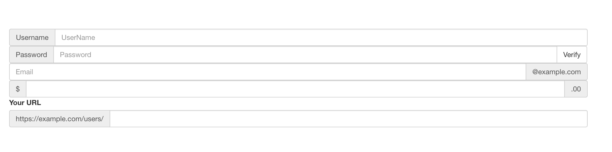
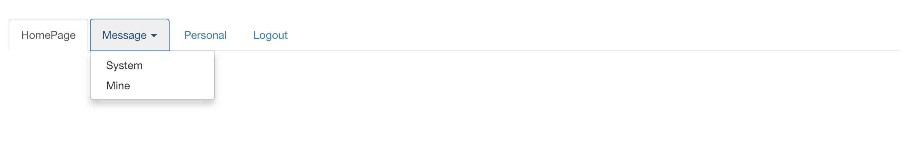

# Bootstrap常用组件（二）

## 一、输入框组

> 通过在文本输入框 `<input>` 前面、后面或是两边加上文字或按钮，可以实现对表单控件的扩展。为 `.input-group `赋予 `.input-group-addon` 或 `.input-group-btn` 类，可以给 `.form-control` 的前面或后面添加额外的元素。
> 
> 注意：**目前只支持文本输入框 `<input>`，且不能将表单组或栅格列（column）类直接和输入框组混合使用，而是需要将输入框组嵌套到表单组或栅格相关元素的内部。**


### （一）实例
> 在输入框的两侧添加额外元素或按钮，但是目前不支持在输入框的单独一侧添加多个额外元素（.input-group-addon 或 .input-group-btn），也不支持在单个输入框组（input-group）中添加多个表单控件。

> 通过向输入域添加前缀和后缀的内容，我们可以向用户输入添加公共的元素。例如，可以添加美元符号，或者在 Twitter 用户名前添加 @，或者应用程序接口所需要的其他公共的元素。

*给输入框添加类form-control。然后向 `.form-control` 添加前缀或后缀元素，具体步骤如下：*

* 把输入框和前缀或后缀元素需要放在带有.`input-group` 的 `<div>` 中。
* 接着，在相同的 `<div>` 内，在 class 为 `input-group-addon` 的 `<span>` 内放置额外的内容。
* 把该 `<span> `放置在 `<input> `元素的前面或者后面。

其中，input-group-addon可以放置label，icon，checkbox，radio等，input-group-btn用来放置按钮

```html
<div class="input-group">
	<span class="input-group-addon">Username</span>
	<input type="text" class="form-control" placeholder="UserName" />
</div>
	
<div class="input-group">
	<span class="input-group-addon">Password</span>
	<input type="text" class="form-control" placeholder="Password" />
	<span class="input-group-btn"><button class="btn btn-default">Verify</button></span>
</div>
	
<div class="input-group">
	<input type="text" class="form-control" placeholder="Email"/>
	<span class="input-group-addon">@example.com</span>
</div>

<div class="input-group">
	<span class="input-group-addon">$</span>
	<input type="text" class="form-control" />
	<span class="input-group-addon">.00</span>
</div>
	
<label class="basic-url">Your URL</label>
<div class="input-group">
	<span class="input-group-addon">https://example.com/users/</span>
	<input type="text" class="form-control"/>
</div>
```



### （二）尺寸
我们为 .input-group 添加相应的尺寸类，其内部包含的元素将自动调整自身的尺寸，不需要为输入框组中的每个元素重复地添加控制尺寸的类：

```html
<div class="input-group  input-group-lg">
	<span class="input-group-addon">https://example.com/users/</span>
	<input type="text" class="form-control"/>
</div>
```


### （三）作为额外元素的单选框和多选框
可以将多选框或单选框作为额外元素添加到输入框组中：

```html
<div class="row">
	<div class="col-md-6">
		<div class="input-group">
			<span class="input-group-addon">
				<input type="checkbox" />
			</span>
			<input type="text" class="form-control" />
		</div>
	</div>
	
	<div class="col-md-6">
		<div class="input-group">
			<span class="input-group-addon">
				<input type="radio" />
			</span>
			<input type="text" class="form-control" />
		</div>
	</div>
</div>
```


###  （四）作为额外元素的按钮
为输入框组添加按钮需要额外添加一层嵌套，不是 .input-group-addon，而是添加 .input-group-btn 来包裹按钮元素。由于不同浏览器的默认样式无法被统一的重新赋值，所以才需要这样做：

```html
<div class="row">
	<div class="col-md-6">
		<div class="input-group">
			<input type="text" class="form-control" />
			<span class="input-group-btn">
				<button class="btn btn-default btn-warning">Search!</button>
			</span>
		</div>
	</div>
	
	<div class="col-md-6">
		<div class="input-group">
			<input type="text" class="form-control" />
			<span class="input-group-btn">
				<button class="btn btn-default btn-success">Done!</button>
			</span>
		</div>
	</div>
</div>
```


### （五）作为额外元素的按钮式下拉菜单

```html
<div class="row">
	<div class="col-md-6">
		<div class="input-group">
			<input type="text" class="form-control" />
			<span class="input-group-btn">
				<div class="dropdown">
					<button class="btn btn-default dropdown-toggle btn-warning" data-toggle="dropdown">
						Search!
						<span class="caret"></span>
					</button>
					<ul class="dropdown-menu">
						<li><a href="#">Baidu</a></li>
						<li><a href="#">Google</a></li>
						<li><a href="#">Bing</a></li>
					</ul>
				</div>
			</span>
		</div>
	</div>

	<div class="col-md-6">
		<div class="input-group">
			<input type="text" class="form-control" />
			<span class="input-group-btn">
				<div class="dropdown">
					<button class="btn btn-default dropdown-toggle btn-success" data-toggle="dropdown">
						Done!
						<span class="caret"></span>
					</button>
					<ul class="dropdown-menu">
						<li><a href="#">Save</a></li>
						<li><a href="#">Save and Jump</a></li>
					</ul>
				</div>
			</span>
		</div>
	</div>
</div>
```


### （六）作为额外元素的分裂式按钮下拉菜单

```html
<div class="row">
	<div class="col-md-6">
		<div class="input-group">
			<input type="text" class="form-control" />
			<span class="input-group-btn">
				<div class="dropdown">
					<button class="btn btn-default btn-warning">Search!</button>
					<button class="btn btn-default dropdown-toggle btn-warning" data-toggle="dropdown">
						<span class="caret"></span>
					</button>
					<ul class="dropdown-menu">
						<li><a href="#">Baidu</a></li>
						<li><a href="#">Google</a></li>
						<li><a href="#">Bing</a></li>
					</ul>
				</div>
			</span>
		</div>
	</div>

	<div class="col-md-6">
		<div class="input-group">
			<input type="text" class="form-control" />
			<span class="input-group-btn">
				<div class="dropdown">
					<button class="btn btn-default btn-success">Done!</button>
					<button class="btn btn-default dropdown-toggle btn-success" data-toggle="dropdown">
						<span class="caret"></span>
					</button>
					<ul class="dropdown-menu">
						<li><a href="#">Save</a></li>
						<li><a href="#">Save and Jump</a></li>
					</ul>
				</div>
			</span>
		</div>
	</div>
</div>
```


### （七）Multiple buttons

我们知道，不支持在输入框的单独一侧添加多个额外元素，但是我们如果想要在某一侧放置多个按钮呢？我们直接将多个按钮放入`.input-group-btn`即可：

```html
<div class="row">
	<div class="col-md-6">
		<div class="input-group">
			<input type="text" class="form-control" />
			<span class="input-group-btn">
				<button class="btn btn-default btn-danger">警告！</button>
				<button class="btn btn-default btn-danger">错误！</button>
				<button class="btn btn-default btn-danger">崩溃！</button>
			</span>
		</div>
	</div>

	<div class="col-md-6">
		<div class="input-group">
			<input type="text" class="form-control" />
			<span class="input-group-btn">
				<button class="btn btn-default btn-primary">完成</button>
				<button class="btn btn-default btn-primary">保存</button>
			</span>
		</div>
	</div>
</div>
```


## 二、导航
> 在Bootstrap我们可以定义导航， 导航组件都依赖同一个 .nav 类，状态类也是共用的。改变修饰类则可以改变样式。

### （一）标签页导航

注意：`.nav-tabs` 类依赖 `.nav ` 基类。

```html
<div class="container" style="margin-top: 30px;">
	<ul class="nav nav-tabs">
		<!--active类可以设置默认被选中的样式-->
		<li class="active"><a href="#">HomePage</a></li>
		<li><a href="#">Message</a></li>
		<li><a href="#">Personal</a></li>
		<li><a href="#">Logout</a></li>
	</ul>
</div>
```


### （二）胶囊式标签页
使用 `.nav-pills` 类

```html
<div class="container" style="margin-top: 30px;">
	<ul class="nav nav-pills">
		<!--active类可以设置默认被选中的样式-->
		<li class="active"><a href="#">HomePage</a></li>
		<li><a href="#">Message</a></li>
		<li><a href="#">Personal</a></li>
		<li><a href="#">Logout</a></li>
	</ul>
</div>
```


胶囊是标签页也是可以垂直方向堆叠排列的。只需添加 `.nav-stacked`类即可：

```html
<ul class="nav nav-pills nav-stacked">
  ...
</ul>
```


改进一下，让它居左跨两列显示：


```html
<div class="container" style="margin-top: 30px;">
	<div class="row">
		<div class="col-xs-2">
			<ul class="nav nav-pills nav-stacked">
				<!--active类可以设置默认被选中的样式-->
				<li class="active"><a href="#">HomePage</a></li>
				<li><a href="#">Message</a></li>
				<li><a href="#">Personal</a></li>
				<li><a href="#">Logout</a></li>
			</ul>
		</div>
		<div class="col-xs-10"></div>
	</div>
</div>
```


### （三）两端对齐的标签页
在大于 768px 的屏幕上，通过 `.nav-justified` 类可以很容易的让标签页或胶囊式标签呈现出同等宽度。在小屏幕上，导航链接呈现堆叠样式:

```html
<ul class="nav nav-pills nav-justified">
  <li role="presentation" class="active"><a href="#">Home</a></li>
  <li role="presentation"><a href="#">Profile</a></li>
  <li role="presentation"><a href="#">Messages</a></li>
</ul>
```

标签页：

```html
<div class="container" style="margin-top: 30px;">
	<ul class="nav nav-tabs nav-justified">
		<!--active类可以设置默认被选中的样式-->
		<li class="active"><a href="#">HomePage</a></li>
		<li><a href="#">Message</a></li>
		<li><a href="#">Personal</a></li>
		<li><a href="#">Logout</a></li>
	</ul>
</div>
```


胶囊式标签页：

```html
<div class="container" style="margin-top: 30px;">
	<ul class="nav nav-pills nav-justified">
		<!--active类可以设置默认被选中的样式-->
		<li class="active"><a href="#">HomePage</a></li>
		<li><a href="#">Message</a></li>
		<li><a href="#">Personal</a></li>
		<li><a href="#">Logout</a></li>
	</ul>
</div>
```


### （四）添加下拉菜单
#### 1、带下拉菜单的标签页

直接给需要设置下拉菜单的`li`标签添加dropdown类，然后将下拉菜单的触发元素设置成`a`标签即可：

```html
<div class="container" style="margin-top: 30px;">
	<ul class="nav nav-tabs">
		<li class="active"><a href="#">HomePage</a></li>
		<li class="dropdown">
			<a class="dropdown-toggle" data-toggle="dropdown"  role="button" aria-haspopup="true" aria-expanded="false">
				Message
				<span class=" caret"></span>
			</a>
			<ul class="dropdown-menu">
				<li><a href="#">System</a></li>
				<li><a href="#">Mine</a></li>
			</ul>
		</li>
		<li><a href="#">Personal</a></li>
		<li><a href="#">Logout</a></li>
	</ul>
</div>
```



#### 2、带下拉菜单的胶囊式标签页


```html
<div class="container" style="margin-top: 30px;">
	<ul class="nav nav-pills">
		<li class="active"><a href="#">HomePage</a></li>
		<li class="dropdown">
			<a class="dropdown-toggle" data-toggle="dropdown"  role="button" aria-haspopup="true" aria-expanded="false">
				Message
				<span class=" caret"></span>
			</a>
			<ul class="dropdown-menu">
				<li><a href="#">System</a></li>
				<li><a href="#">Mine</a></li>
			</ul>
		</li>
		<li><a href="#">Personal</a></li>
		<li><a href="#">Logout</a></li>
	</ul>
</div>
```


## 三、导航条

> 导航条是在我们的应用或网站中作为导航页头的响应式基础组件。它们在移动设备上可以折叠（并且可开可关），且在视口（viewport）宽度增加时逐渐变为水平展开模式。

### （一）带默认样式的导航条

```html
<nav class="navbar navbar-default">
  <div class="container-fluid">
    <!-- Brand and toggle get grouped for better mobile display -->
    <!--创建折叠菜单栏的触发按钮，通过data-target来选择要触发的导航栏目标，navbar-toggle为菜单按钮样式-->
    <div class="navbar-header">
      <button type="button" class="navbar-toggle collapsed" data-toggle="collapse" data-target="#bs-example-navbar-collapse-1" aria-expanded="false">
        <!--sr即screen-reader，代表元素在屏幕阅读器中显示-->
        <span class="sr-only">Toggle navigation</span>
        <!--icon-bar类可以设置按钮中的横线-->
        <span class="icon-bar"></span>
        <span class="icon-bar"></span>
        <span class="icon-bar"></span>
      </button>
      <a class="navbar-brand" href="#">Brand</a>
    </div>

    <!-- collapse类可以实现导航按钮的折叠 -->
    <div class="collapse navbar-collapse" id="bs-example-navbar-collapse-1">
      <ul class="nav navbar-nav">
        <li class="active"><a href="#">Home <span class="sr-only">(current)</span></a></li>
        <li><a href="#">Sample</a></li>
        <li class="dropdown">
          <a href="#" class="dropdown-toggle" data-toggle="dropdown" role="button" aria-haspopup="true" aria-expanded="false">Dropdown <span class="caret"></span></a>
          <ul class="dropdown-menu">
            <li><a href="#">Action</a></li>
            <li><a href="#">Another action</a></li>
            <li><a href="#">Something else here</a></li>
            <li role="separator" class="divider"></li>
            <li><a href="#">Separated link</a></li>
            <li role="separator" class="divider"></li>
            <li><a href="#">One more separated link</a></li>
          </ul>
        </li>
      </ul>
      <form class="navbar-form navbar-left">
        <div class="form-group">
          <input type="text" class="form-control" placeholder="Search">
        </div>
        <button type="submit" class="btn btn-default">Submit</button>
      </form>
      <ul class="nav navbar-nav navbar-right">
        <li><a href="#">Personal</a></li>
        <li class="dropdown">
          <a href="#" class="dropdown-toggle" data-toggle="dropdown" role="button" aria-haspopup="true" aria-expanded="false">Dropdown <span class="caret"></span></a>
          <ul class="dropdown-menu">
            <li><a href="#">Action</a></li>
            <li><a href="#">Another action</a></li>
            <li><a href="#">Something else here</a></li>
            <li role="separator" class="divider"></li>
            <li><a href="#">Separated link</a></li>
          </ul>
        </li>
      </ul>
    </div><!-- /.navbar-collapse -->
  </div><!-- /.container-fluid -->
</nav>
```
### （二）品牌图标
将导航条内放置品牌标志的地方替换为 `` 元素即可展示自己的品牌图标。由于` .navbar-brand `已经被设置了内补（padding）和高度（height），你需要根据自己的情况添加一些 CSS 代码从而覆盖默认设置。

```html
<nav class="navbar navbar-default">
  <div class="container-fluid">
    <div class="navbar-header">
      <a class="navbar-brand" href="#">
        
      </a>
    </div>
  </div>
</nav>
```
### （三）表单
将表单放置于 `.navbar-form` 之内可以呈现很好的垂直对齐，并在较窄的视口（viewport）中呈现折叠状态。 使用对齐选项可以规定其在导航条上出现的位置。

```html
Submit
<form class="navbar-form navbar-left" role="search">
  <div class="form-group">
    <input type="text" class="form-control" placeholder="Search">
  </div>
  <button type="submit" class="btn btn-default">Submit</button>
</form>
```
### （四）非导航链接
如果想要在标准的导航组件之外添加标准链接，那么，使用 `.navbar-link` 类可以让链接有正确的默认颜色和反色设置。

```html
<p class="navbar-text navbar-right">Signed in as <a href="#" class="navbar-link">Mark Otto</a></p>
```
### （五）组件排列
通过添加 `.navbar-left` 和 `.navbar-right` 工具类让导航链接、表单、按钮或文本对齐。两个类都会通过 CSS 设置特定方向的浮动样式。例如，要对齐导航链接，就要把它们放在个分开的、应用了工具类的 <ul> 标签里。这些类是 `.pull-left` 和 `.pull-right` 的 mixin 版本，但是他们被限定在了媒体查询（media query）中，这样可以更容易的在各种尺寸的屏幕上处理导航条组件。
### （六）固定在顶部
添加 `.navbar-fixed-top` 类可以让导航条固定在顶部，还可包含一个 `.container` 或 `.container-fluid` 容器，从而让导航条居中，并在两侧添加内补（padding）。


```html
<nav class="navbar navbar-default navbar-fixed-top">
  <div class="container">
    ...
  </div>
</nav>
```
### （七）固定在底部
添加 `.navbar-fixed-bottom` 类可以让导航条固定在底部，并且还可以包含一个 `.container` 或 `.container-fluid` 容器，从而让导航条居中，并在两侧添加内补（padding）。


```html
<nav class="navbar navbar-default navbar-fixed-bottom">
  <div class="container">
    ...
  </div>
</nav>
```
### （八）静止在顶部
通过添加 `.navbar-static-top` 类即可创建一个与页面等宽度的导航条，它会随着页面向下滚动而消失。还可以包含一个 `.container` 或 `.container-fluid` 容器，用于将导航条居中对齐并在两侧添加内补（padding）

```html
<nav class="navbar navbar-default navbar-static-top">
  <div class="container">
    ...
  </div>
</nav>
```

### （九）反色导航条
通过添加 .navbar-inverse 类可以改变导航条的外观。

```html
<nav class="navbar navbar-inverse">
  ...
</nav>
```


##七、路径导航（面包屑导航）
> 在一个带有层次的导航结构中标明当前页面的位置。


```html
<ol class="breadcrumb">
  <li><a href="#">Home</a></li>
  <li><a href="#">Library</a></li>
  <li class="active">Data</li>
</ol>
```


## 八、分页
可以为我们的网站或应用提供带有展示页码的分页组件，或者可以使用简单的翻页组件。
### 1、默认分页

```html
<nav aria-label="Page navigation">
  <ul class="pagination">
    <li>
      <a href="#" aria-label="Previous">
        <!--上一页图标（拉丁字符）-->
        <span aria-hidden="true">&laquo;</span>
      </a>
    </li>
    <li><a href="#">1</a></li>
    <li><a href="#">2</a></li>
    <li><a href="#">3</a></li>
    <li><a href="#">4</a></li>
    <li><a href="#">5</a></li>
    <li>
      <a href="#" aria-label="Next">
        <!--下一页图标（拉丁字符）-->
        <span aria-hidden="true">&raquo;</span>
      </a>
    </li>
  </ul>
</nav>
```
### 2、禁用和激活状态

链接在不同情况下可以定制。你可以给不能点击的链接添加 `.disabled `类、给当前页添加 `.active` 类。


```html
<nav aria-label="Page navigation">
	<ul class="pagination">
		<li>
			<a href="#" aria-label="previous">
				<span aria-hidden="true">&laquo;</span>
			</a>
		</li>
		<li><a href="#">1</a></li>
	    <li><a href="#">2</a></li>
	    <li class="active"><a href="#">3</a></li>
	    <li><a href="#">4</a></li>
	    <li><a href="#">5</a></li>
		<li  class="disabled">
			<a href="#" aria-label="previous">
				<span aria-hidden="true">&raquo;</span>
			</a>
		</li>
	</ul>
</nav>
```
不过，建议将 `active` 或 `disabled` 状态的链接（即 `<a>` 标签）替换为 `<span>` 标签，或者在向前/向后的箭头处省略`<a>` 标签，这样就可以让其保持需要的样式而不能被点击。

### 3、尺寸
如果想要更小或更大的分页，则`.pagination-lg` 或 `.pagination-sm` 类提供了额外可供选择的尺寸
### 4、翻页
#### （1）实例

```html
<nav aria-label="...">
  <ul class="pager">
    <li><a href="#">Previous</a></li>
    <li><a href="#">Next</a></li>
  </ul>
</nav>
```


#### （2）对齐链接
我们还可以把链接向两端对齐，通过`.previous`来表示上一页，左边对齐，`.next`来表示下一页，右边对齐。

```html
<nav>
  <ul class="pager">
    <li class="previous"><a href="#"><span aria-hidden="true">&larr;</span> Older</a></li>
    <li class="next"><a href="#">Newer <span aria-hidden="true">&rarr;</span></a></li>
  </ul>
</nav>
```

