# AngularJS

1. 表达式
2. 指令
3. 作用域
4. 视图控制器
5. 事件
6. 依赖注入
7. 路由

AngularJS是一个开发动态Web应用的框架，由 Google 的员工 Miško Hevery 从 2009 年开始着手开发。它的特点在于通过数据绑定和依赖注入减少了大量代码，并且这些都在浏览器端通过JavaScript实现的，能够和任何服务器端技术完美结合。

> AngularJS 通过新的属性和表达式扩展了 HTML，AngularJS 可以构建一个单一页面应用程序（SPAs：Single Page Applications）。AngularJS 是一个 JavaScript 框架，它可通过 `<script>` 标签添加到 HTML 页面。AngularJS通过指令的形式来扩展HTML，且通过表达式绑定数据到HTML页面。

AngularJS 使得开发现代的单一页面应用程序（SPAs：Single Page Applications）变得更加容易。

* AngularJS 把应用程序数据绑定到 HTML 元素。
* AngularJS 可以克隆和重复 HTML 元素。
* AngularJS 可以隐藏和显示 HTML 元素。
* AngularJS 可以在 HTML 元素"背后"添加代码。
* AngularJS 支持输入验证。

Angular通过指令`directive`扩展HTML的语法。常用的指定如下：

* 通过`{{}}`进行数据绑定（与ng-bind功能类似）。
* 使用DOM控制结构来进行迭代或隐藏DOM片段。
* 支持表单和表单验证。
* 将逻辑代码关联到DOM元素上。
* 将一组HTML做成可重用的组件。

## 一、简介
* AngularJS 通过 ng-directives 扩展了 HTML。
* ng-app 指令定义一个 AngularJS 应用程序。
* ng-model 指令把元素值（比如输入域的值）绑定到应用程序上。
* ng-bind 指令把应用程序数据绑定到 HTML 视图。
* ng-controller 指令用于为我们的应用添加控制器。

```html
<!DOCTYPE html>
<html lang="zh-CN">

	<head>
		<meta charset="utf-8">
	</head>

	<body>
		
		<div ng-app="">
			<p>请输入你的名字：<input type="text" ng-model="name" /></p>
			<h1>你好！ {{name}}</h1>
		</div>
		<!--引入AngularJS库-->
		<script type="text/javascript" src="https://cdnjs.cloudflare.com/ajax/libs/angular.js/1.7.5/angular.min.js"></script>
	</body>

</html>
```
以上代码会把输入框中的名字显示在h1标签中，当网页加载完毕，AngularJS 就会自动开启。
`ng-app` 指令告诉 AngularJS，`<div>` 元素是 AngularJS 应用程序 的"所有者"。
`ng-model` 指令把输入域的值绑定到应用程序变量 name。
`ng-bind` 指令把应用程序变量 name 绑定到某个段落的 innerHTML，通常可以简写成：`{{}}`。


> Tips：
> 把`<script>`脚本放在 <body> 元素的底部，因为 HTML 加载不受制于脚本加载，所以会提高网页加载速度。


### （二）特点
#### 1、数据绑定
在Angular网页应用中，数据绑定是数据模型(model)与视图(view)组件的自动同步。Angular的实现方式允许我们把应用中的模型看成单一数据源，而视图始终是数据模型的一种展现形式。当模型改变时，视图就能时时反映这种改变，反之亦然。

***普通视图模型***
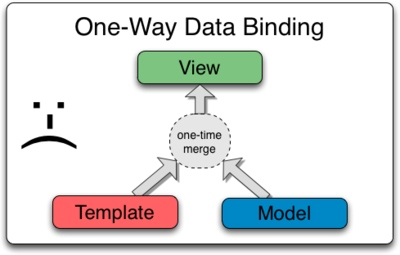
在普通的MVC中，它们将模板和数据合并起来加入到视图中去，如图表中所示。合并完成之后，任何对数据模型或者相关内容的改变都不会自动反映到视图中去。同时，用户对视图的任何改变也不会自动同步到数据模型中来。这意味着，开发者需要编写代码来保持视图与模板、模板与视图的同步。

Angular模板的工作方式则不同，如下图所示。差别体现在：其一，模板（指未经编译的附加了标记和指令的HTML）是在浏览器中编译的。其二，编译阶段生成了动态(live)视图。保持视图动态的原因是，任何视图中的改变都会立刻反映到数据模型中去，任何数据模型的改变都会传播到视图中去。这使得数据模型始终是应用的单一数据源。大幅度简化了开发者的编程核心，你可以将视图简单的理解为数据模型的实时映射。

***AngularJS视图模型***
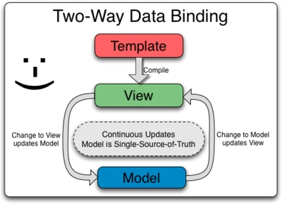

因此，将视图作为数据模型的一种映射，使得控制器完全与视图分离，而不必关心视图的展现。

##二、AngularJS表达式
AngularJS 使用 **表达式** 把数据绑定到 HTML。

* AngularJS 表达式写在双大括号内：{{ expression }}。
* AngularJS 表达式把数据绑定到 HTML，这与 ng-bind 指令有异曲同工之妙。
* AngularJS 将在表达式书写的位置"输出"数据。
* AngularJS 表达式 很像 JavaScript 表达式：它们可以包含文字、运算符和变量。

```html
<!DOCTYPE html>
<html lang="zh-CN">

	<head>
		<meta charset="utf-8">
	</head>

	<body>
		
		<div ng-app="">
			<p>7+7 = {{7+7}} </p>
		</div>
		<!--引入AngularJS库-->
		<script type="text/javascript" src="https://cdnjs.cloudflare.com/ajax/libs/angular.js/1.7.5/angular.min.js"></script>
	</body>

</html>
```
### （一）字符串
AngularJS中的字符串用法与JavaScript中的一致：

```html
<!DOCTYPE html>
<html lang="zh-CN">

	<head>
		<meta charset="utf-8">
	</head>

	<body>
		
		<div ng-app="" ng-init="firstname='Ben'; lastname='Tom'">
			<p>你好！{{firstname + " " + lastname}} </p>
		</div>
		<!--引入AngularJS库-->
		<script type="text/javascript" src="https://cdnjs.cloudflare.com/ajax/libs/angular.js/1.7.5/angular.min.js"></script>
	</body>

</html>
```

在以上代码中，通过ng-init指令始化了两个字符串变量，然后再将字符串变量绑定到p标签中。

### （二）AngularJS对象
AngularJS中的对象用法与JavaScript中的一致

```html
<!DOCTYPE html>
<html lang="zh-CN">

	<head>
		<meta charset="utf-8">
	</head>

	<body>
		
		<div ng-app="" ng-init="person={firstname: 'Ben', lastname: 'Tom'}">
			<p>你好！{{person.firstname + " " + person.lastname}} </p>
		</div>
		<!--引入AngularJS库-->
		<script type="text/javascript" src="https://cdnjs.cloudflare.com/ajax/libs/angular.js/1.7.5/angular.min.js"></script>
	</body>

</html>
```
### （三）AngularJS数组
AngularJS中的数组用法与JavaScript中的一致：

```html
<!DOCTYPE html>
<html lang="zh-CN">

	<head>
		<meta charset="utf-8">
	</head>

	<body>
		
		<div ng-app="" ng-init="numbers=[1,3,5,7,9]">
			<p>你选择的是：{{numbers[2]}} </p>
		</div>
		<!--引入AngularJS库-->
		<script type="text/javascript" src="https://cdnjs.cloudflare.com/ajax/libs/angular.js/1.7.5/angular.min.js"></script>
	</body>

</html>
```

### 总结
AngularJS 表达式 与 JavaScript 表达式的区别与联系

* 类似于 JavaScript 表达式，AngularJS 表达式可以包含字母，操作符，变量。
* 与 JavaScript 表达式不同，AngularJS 表达式可以写在 HTML 中。
* 与 JavaScript 表达式不同，AngularJS 表达式**不支持条件判断，循环**。
* 与 JavaScript 表达式不同，AngularJS 表达式支持过滤器。

## 三、AngularJS指令
> AngularJS通过指令来扩展 HTML，指令会带有前缀 ng-。我们可以通过内置的指令来为应用添加功能，也可以自定义指令。

### （一）常用指令
#### 1、ng-app指令
ng-app 指令定义了 AngularJS 应用程序的**根元素**，指定Angular程序的所有者，在网页加载完毕时会自动引导（自动初始化）应用程序，主要用来初始化一个 AngularJS 应用程序。

#### 2、ng-init 指令
ng-init 指令为 AngularJS 应用程序**定义初始值**。通常情况下，我们可以不使用 ng-init，使用一个控制器或模块来代替它。

```html
<div ng-app="" ng-init="firstName='Leon'">
 
     <p>在输入框中尝试输入：</p>
     <p>姓名：<input type="text" ng-model="firstName"></p>
     <p>你输入的为： {{ firstName }}</p>
 
</div>
```
在上例中，通过ng-app指令定义了div为AngularJS程序的所有者；同时，又通过ng-init指令定义了一个变量firstName，且初始值为：Leon。
#### 3、ng-model指令
ng-model指令**绑定HTML元素**到应用程序数据中，ng-model 能主要功能有：

* 为应用程序数据提供类型验证（number、email、required）。
* 为应用程序数据提供状态（invalid、dirty、touched、error）。
* 为 HTML 元素提供 CSS 类。
* 绑定 HTML 元素到 HTML 表单。

```html
<div ng-app="" ng-init="quantity=1;price=5">
	<h2>价格计算器</h2> 
	数量： <input type="number" ng-model="quantity"> <br />
	价格： <input type="number" ng-model="price">
	<p><b>总价：</b> {{ quantity * price }}</p>
</div>
```
在上例中，通过ng-model指令，把两个input文本框（数量、价格）的值绑定到了应用程序上。
#### 4、ng-repeat 指令
ng-repeat 指令会参照集合中（数组中）的元素，**根据每项元素来克隆一次 HTML 元素**。

```html
<div ng-app="" ng-init="names=['Tim','Ben','Jerry']">
	<p>使用 ng-repeat 来循环数组</p>
	<ul>
		<li ng-repeat="x in names">
			Name:{{ x }}
		</li>
	</ul>
</div>
```
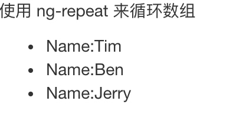


在上例中，通过ng-init指令初始化了数组names，然后通过ng-repeat指令，会根据数组元素的长度，重复的输出`<li>`标签。

又如：

```html
<div ng-app="" ng-init="names=[
	{name:'Henry',country:'Norway'},
	{name:'Brad',country:'Sweden'},
	{name:'Larry',country:'Denmark'}]">
	 
	<p>循环对象：</p>
	<ul>
	  <li ng-repeat="n in names">
	    {{ n.name + ', ' + n.country }}
	  </li>
	</ul>
</div>
```

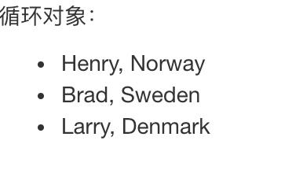

在上例中，我们初始化了一个对象数组，数组中有3个对象，我们在通过ng-repeat重复输出标签时，对于绑定的对象中的属性，可以通过`.`语法来获取。

#### 5、ng-controller指令
ng-controller 指令定义了应用程序控制器，控制器是 JavaScript 对象，由标准的 JavaScript 对象的构造函数 创建

```javascript
<!DOCTYPE html>
<html lang="zh-CN">

	<head>
		<meta charset="utf-8">
		<meta http-equiv="X-UA-Compatible" content="IE=edge">
		<meta name="viewport" content="width=device-width, initial-scale=1">
		<!-- 上述3个meta标签*必须*放在最前面，任何其他内容都*必须*跟随其后！ -->
		<title>Bootstrap 101 Template</title>

		<!-- Bootstrap -->
		<link rel="stylesheet" type="text/css" href="css/bootstrap.min.css" />

		<!-- HTML5 shim 和 Respond.js 是为了让 IE8 支持 HTML5 元素和媒体查询（media queries）功能 -->
		<!-- 警告：通过 file:// 协议（就是直接将 html 页面拖拽到浏览器中）访问页面时 Respond.js 不起作用 -->
		<!--[if lt IE 9]>
      <script src="https://cdn.jsdelivr.net/npm/html5shiv@3.7.3/dist/html5shiv.min.js"></script>
      <script src="https://cdn.jsdelivr.net/npm/respond.js@1.4.2/dest/respond.min.js"></script>
    <![endif]-->

	</head>

	<body>

		<div ng-app="myApp" ng-controller="personCtrl">
			<pre>
				名: <input type="text" ng-model="firstName"><br>
				姓: <input type="text" ng-model="lastName"><br>
				<br>
				姓名: {{fullName()}}
			</pre>
		</div>
	
	
		<!-- jQuery (Bootstrap 的所有 JavaScript 插件都依赖 jQuery，所以必须放在前边) -->
		<script type="text/javascript" src="js/jquery-3.3.1.min.js"></script>
		<!-- 加载 Bootstrap 的所有 JavaScript 插件。你也可以根据需要只加载单个插件。 -->
		<script type="text/javascript" src="js/bootstrap.min.js"></script>
		
		<script type="text/javascript" src="https://cdnjs.cloudflare.com/ajax/libs/angular.js/1.7.5/angular.min.js"></script>
		
		<script>
			//使用angular的module函数，和key"myApp"来创建一个angular对象
			var app = angular.module('myApp', []);
			//使用angular初始化一个名为personCtrl的控制器，然后通过$scope初始化一些数据
			app.controller('personCtrl', function($scope) {
			    $scope.firstName = "Chuck";
			    $scope.lastName = "Berry";
			    $scope.fullName = function() {
			        return $scope.firstName + " " + $scope.lastName;
			    }
			});
		</script>
	</body>

</html>
```

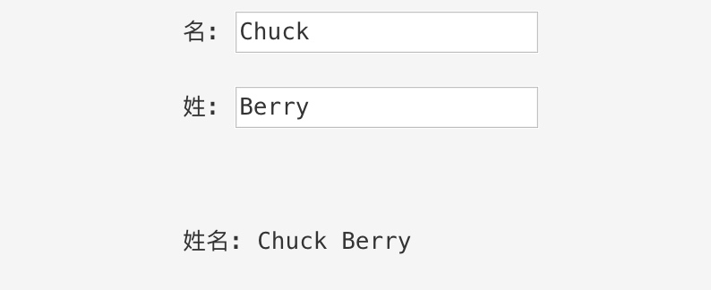


在上例中，我们创建了一个controller对象，并且在此controller中初始化了变量firstName、lastName、fullName()方法，并且通过ng-controller指令制定为`<div>`的控制器对象。

#### 6、自定义指令
除了 AngularJS 内置的指令外，我们还可以创建自定义指令，通过`.directive` 函数来添加自定义的指令。如果要调用自定义指令，HTML 元素上需要添加自定义指令名。使用**驼峰法来命名**一个指令:`iflyDirective`, 但在**使用它时需要以`-`分割**,即通过 `ifly-directive`来调用

```html
<!DOCTYPE html>
<html lang="zh-CN">

	<head>
		<meta charset="utf-8">
		<meta http-equiv="X-UA-Compatible" content="IE=edge">
		<meta name="viewport" content="width=device-width, initial-scale=1">
		<!-- 上述3个meta标签*必须*放在最前面，任何其他内容都*必须*跟随其后！ -->
		<title>Bootstrap 101 Template</title>

		<!-- Bootstrap -->
		<link rel="stylesheet" type="text/css" href="css/bootstrap.min.css" />

		<!-- HTML5 shim 和 Respond.js 是为了让 IE8 支持 HTML5 元素和媒体查询（media queries）功能 -->
		<!-- 警告：通过 file:// 协议（就是直接将 html 页面拖拽到浏览器中）访问页面时 Respond.js 不起作用 -->
		<!--[if lt IE 9]>
      <script src="https://cdn.jsdelivr.net/npm/html5shiv@3.7.3/dist/html5shiv.min.js"></script>
      <script src="https://cdn.jsdelivr.net/npm/respond.js@1.4.2/dest/respond.min.js"></script>
    <![endif]-->

	</head>

	<body>

		<div ng-app="myApp" ng-controller="personCtrl">
			<person-info></person-info>
		</div>
	
	
		<!-- jQuery (Bootstrap 的所有 JavaScript 插件都依赖 jQuery，所以必须放在前边) -->
		<script type="text/javascript" src="js/jquery-3.3.1.min.js"></script>
		<!-- 加载 Bootstrap 的所有 JavaScript 插件。你也可以根据需要只加载单个插件。 -->
		<script type="text/javascript" src="js/bootstrap.min.js"></script>
		
		<script type="text/javascript" src="https://cdnjs.cloudflare.com/ajax/libs/angular.js/1.7.5/angular.min.js"></script>
		
		<script>
			//使用angular的module函数，和key"myApp"来创建一个angular对象
			var app = angular.module('myApp', []);
			//使用angular初始化一个名为personCtrl的控制器，然后通过$scope初始化一些数据
			app.controller('personCtrl', function($scope) {
			    $scope.firstName = "Chuck";
			    $scope.lastName = "Berry";
			    $scope.fullName = function() {
			        return $scope.firstName + " " + $scope.lastName;
			    }
			});
			
			//自定义一个personInfo指令，使用时通过person-info来使用
			app.directive("personInfo", function(){
				return {
					 // E 作为元素名使用
					 // A 作为属性使用
					 // C 作为类名使用
					 // M 作为注释使用
					 // ACE 表示同时创建 A、C、E 三种
					restrict: "E",
					template: "<h1>这是自定义的personinfo指令，person的名字是：{{firstName + ' ' + lastName}}</h1>"
				}
			});
		</script>
	</body>

</html>
```

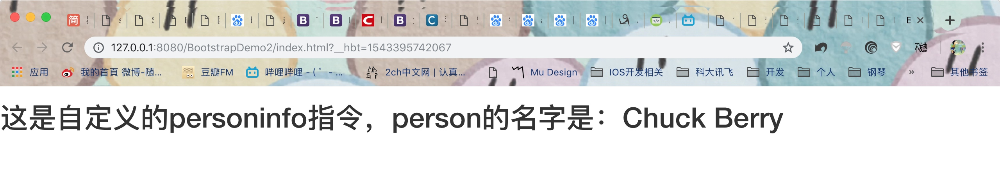

##### 指令配置说明


* **restrict**： string // restrict 属性限制指令只能通过特定的方式来调用，有以下几种：
    * E 作为元素名使用
    * A 作为属性使用
    * C 作为类名使用
    * M 作为注释使用
    * restrict 默认值为 EA, 即可以通过元素名和属性名来调用指令。

* **priority**： number //指令执行的优先级

* **template**： string //指令使用的模板，用HTML字符串的形式表示

* **templateUrl**： string //从指定的url地址加载模板或<script type="text/ng-template" id="string"></script>

* **replace**： bool //是否用模板替换当前元素，若为false，则append在当前元素上

* **transclude**： bool //是否将当前元素的内容转移到模板中

* **scope**： bool or object //指定指令的作用域

* **controller**： function controllerConstructor(\$scope, \$element, \$attrs, \$transclude){...} //定义与其他指令进行交互的接口函数

* **require**： string //指定需要依赖的其他指令


* **link**： function postLink(scope, iElement, iAttrs) {...} //以编程的方式操作DOM，包括添加监听器等

* **compile**：
* 
```
function compile(tElement, tAttrs, transclude){

    return: {
  
    pre: function preLink(scope, iElement, iAttrs, controller){...},
  
    post: function postLink(scope, iElement, iAttrs, controller){...}
  
    }
} 
```
  //编程的方式修改DOM模板的副本，可以返回链接函数


我们在创建指令时，出了可以通过`template`指令来指定指令的模版，我们还可以使用`templateUrl`指令通过url来加载指令的模版：


```
//自定义一个personInfo指令，使用时通过person-info来使用
app.directive("personInfo", function(){
	return {
		 // E 作为元素名使用
		 // A 作为属性使用
		 // C 作为类名使用
		 // M 作为注释使用
		 // ACE 表示同时创建 A、C、E 三种
		restrict: "E",
		//通过templateUrl来加载外部模版
		templateUrl: "template.html"
	}
});
```

template.html

```html
<!DOCTYPE html>
<html lang="zh-CN">

	<head>
		<meta charset="utf-8">
	</head>

	<body>

		<p>这个是指令的外部模版，通过URL来读取</p>
		<p>person的名字是：{{firstName + ' ' + lastName}}</p>
		
	</body>

</html>
```

效果如下图：

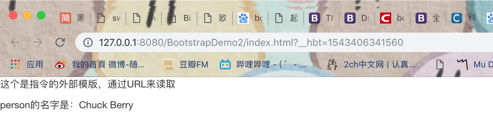


# AngularJS作用域、视图控制器、事件

## 一、作用域（Scope）
Scope(作用域) 是应用在 HTML (视图) 和 JavaScript (控制器)之间的纽带，Scope 是一个对象，有可用的方法和属性，Scope 可应用在视图和控制器上，如下：

* 是一个存储应用数据模型的**对象**；
* 为**表达式**提供了一个执行上下文；
* 作用域的层级结构**对应于 DOM 树结构**；
* 作用域可以**监听表达式的变化**并传播事件；

### （一）作用域有什么
* 作用域提供了 ($watch) 方法**监听数据模型的变化**；
 
* 作用域提供了 ($apply) 方法把不是由Angular触发的数据模型的改变**引入Angular的控制范围内**（如控制器，服务，及Angular事件处理器等）；
 
* 作用域提供了基于原型链**继承其父作用域属性**的机制，就算是嵌套于独立的应用组件中的作用域也可以访问共享的数据模型（这个涉及到指令间嵌套时作用域的几种模式）

* 作用域**提供了表达式的执行环境**，比如像 {{username}} 这个表达式，必须得是在一个拥有属于这个属性的作用域中执行才会有意义。

### （二）作用域作为数据模型使用

> 作用域是控制器和视图之间的桥梁。在Angular中，当自定义指令处在模版的 链接(linking) 阶段时， 指令(directive)会设置一个 `$watch`函数监听着作用域中各表达式（注：这个过程是隐式的）。 `$watch`函数能够在作用域中的属性变化时让指令收到通知，然后指令能够根据这个改变来对DOM进行重新渲染，以便更新已改变的属性值（注：属性值就是scope对象中的属性，也就是数据模型），所以可以实现模型或数据的变化，视图也能随之而变化。
 
其实，不止上面所说的指令拥有指向作用域的引用，控制器中也有（注：可以理解为控制器与指令均能引用到与它们相对应的DOM结构所处的作用域）。但是控制器与指令是相互分离的，而且它们与视图之间也是分离的，这样的分离，或者说耦合度低，可以大大提高对应用进行测试的工作效率。

注：其实可以很简单地理解为有以下两个链条关系：

**控制器 --> 作用域 --> 视图（DOM）**

**指令 --> 作用域 --> 视图（DOM）**

让我们来看下面一个例子，可以说明作用域作为视图与控制器的黏合剂:

```html
<!DOCTYPE html>
<html lang="zh-CN">

	<head>
		<meta charset="utf-8">
	</head>

	<body>

		<div ng-app="myApp" ng-controller="MyController">
			Your Name：
			<input type="text" ng-model="username" />
			<button ng-click="sayHello()">Greet</button>
			<hr />
			{{greeting}}
		</div>

		
		<script type="text/javascript" src="https://cdnjs.cloudflare.com/ajax/libs/angular.js/1.7.5/angular.min.js"></script>
		<script>
			
			var app = angular.module('myApp', []);
			app.controller('MyController', function($scope) {
			    $scope.username = "Chuck";
			    $scope.sayHello = function() {
			        $scope.greeting = "Hello " + $scope.username + "!"; 
			    };
			});
			
		</script>
	</body>

</html>
```

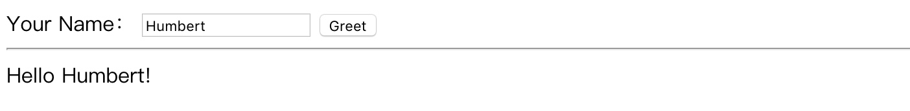


在上面这个例子中，有：

* 控制器：`MyController`，它引用了 `$scope` 并在其上注册了两个属性和一个方法。
* $scope 对象：持有上面例子所需的数据模型，包括 username 属性、greeting属性（注：这是在sayHello()方法被调用时注册的）和 sayHello() 方法
* 视图：拥有一个输入框、一个按钮以及一个利用双向绑定来显示数据的内容块

1、那么具体整个示例有这样两个流程，从**控制器发起**的角度来看就是：

* 控制器往作用域中写属性：
    * 给作用域中的 `username` 赋值，然后作用域通知视图中的 `input` 数据变化了，`input` 因为通过 `ng-model` 实现了双向绑定可以知道 `username` 的变化，进而在视图中渲染出改变的值，此处即是： Humbert
    
* 控制器往作用域中写方法：
    * 给作用域中的 `sayHello()` 方法赋值，该方法被视图中的 `button` 调用，因为 `button` 通过 `ng-click` 绑定了该方法，当用户点击按钮时，`sayHello()` 被调用，这个方法读取作用域中的 `username` 属性，加上前缀字符串 `Hello`，然后赋值给在作用域中新创建的 `greeting` 属性

2、整个示例的过程如果从**视图的角度**看，那主要是以下三个部分：

* `input` 中的渲染逻辑：展示了通过 `ng-model` 进行的作用域和 视图中表单元素的双向绑定

    * 根据 `ng-model` 中的 `username` 去作用域中取，如果已经有值，那么用这个默认值填充当前的输入框
    * 接收用户输入，并且将用户输入的字符串传给 `username`，这时候作用域中的该属性值实时更新为用户输入的值

* `button` 中的逻辑

    * 接收用户单击，调用作用域中的 `sayHello()` 方法

* `{{greeting}}` 的渲染逻辑

    * 在用户未单击按钮时，不显示内容
    * 取值阶段：在用户单击后，这个表达式会去`scope`中取 `greeting` 属性，而这个作用域和控制器是同一个的（这个例子中），此时该作用域下 greeting 属性已经有了，这时候这个属性就被取回来了
    * 计算阶段：在当前作用域下去计算 `greeting` 表达式 ，然后渲染视图，显示 Hello World

所以经过以上的两种角度分析示例过程，我们可以知道：**作用域(scope)对象以及其属性是视图渲染的唯一数据来源**。

### （三）作用域分层结构
> 作用域的结构对应于DOM结构，那么最顶层，和DOM树有根节点一样，每个Angular应用有且仅有一个 root scope，当然了，子级作用域就和DOM树的子节点一样，可以有多个的。

> 应用可以拥有多个作用域，比如指令会创建子级作用域，一般情况下，当新的作用域被创建时，它是以嵌入在父级作用域的子级的形式被创建的，这样就形成了与其所关联的DOM树相对应的一个作用域的树结构。

作用域的分层的一个简单例子是，假设现在HTML视图中有一个表达式 {{name}} ，正如上面解释过，Angular需要经历取值和计算两个阶段才能最终在视图渲染结果。那么这个取值的阶段，其实就是根据作用域的这个层级结构（或树状结构）来进行的：

* 首先，Angular在该表达式当前所在的DOM节点所对应的作用域中去找有没有 name 这个属性
* 如果有，Angular返回取值，计算渲染；如果在当前作用域中没有找到，那么Angular继续往上一层的父级作用域中去找 name 属性，直到找到为止，最后实在没有，那就到达 `$rootScope` 了。

#### 1、根作用域（`$rootScope`）
所有的应用都有一个 `$rootScope`，它可以作用在 `ng-app` 指令包含的所有 HTML 元素中。`$rootScope` 可作用于整个应用中。是各个 controller 中 scope 的桥梁。用 `$rootscope` 定义的值，可以在各个 controller 中使用。

```html
<!DOCTYPE html>
<html lang="zh-CN">

	<head>
		<meta charset="utf-8">
	</head>

	<body>

		<div ng-app="myApp">
			<div ng-controller="MyController">
				Your Name：
				<input type="text" ng-model="username" />
				<button ng-click="sayHello()">Greet</button>
				<hr />
				{{greeting}}
			</div>
			Name：{{username}}
		</div>

		
		<script type="text/javascript" src="https://cdnjs.cloudflare.com/ajax/libs/angular.js/1.7.5/angular.min.js"></script>
		<script>
			
			var app = angular.module('myApp', []);
			app.controller('MyController', function($scope, $rootScope) {
			    $rootScope.username = "Chuck";
			    $scope.sayHello = function() {
			        $scope.greeting = "Hello " + $scope.username + "!"; 
			    };
			});
			
		</script>
	</body>

</html>
```


### （四）如何使用$scope

AngularJS 应用组成如下：

* View(视图), 即 HTML。
* Model(模型), 当前视图中可用的数据。
* Controller(控制器), 即 JavaScript 函数，可以添加或修改属性。

scope 是一个模型，是一个JavaScript 对象，带有属性和方法，这些属性和方法可以在视图和控制器中使用。
当我们在 AngularJS 创建控制器时，可以将 $scope 对象当作一个参数传递：

```html
<div ng-app="myApp" ng-controller="myCtrl">

<h1>{{stuName}}</h1>

</div>

<script>
var app = angular.module('myApp', []);
app.controller('myCtrl', function($scope) {
    $scope.stuName = "Bob";
});
</script>
```
如上所示，我们有了一个控制器myCtrl，它初始化了一个 $scope对象，并且有一个stuName属性。当我们把该控制器关联到DOM节点上，模板就可以通过数据绑定来读取它，即：
`<h1>{{stuName}}</h1>`

## 二、视图控制器
在Angular中，控制器就像 JavaScript 中的构造函数一般，是用来增强 Angular作用域(scope) 的。当一个控制器通过  `ng-controller` 指令被添加到DOM中时，ng 会调用该控制器的构造函数来生成一个控制器对象，这样，就创建了一个新的子级 `作用域(scope)`。在这个构造函数中，作用域(scope)会作为$scope参数注入其中，并允许用户通过代码访问它。

一般情况下，我们使用控制器做两件事：

* 初始化 `$scope` 对象
* 为 `$scope` 对象添加属性和行为（方法）

我们在上文中也已经使用过$scope了。

### （一）正确使用控制器
通常情况下，控制器不应被赋予太多的责任和义务，它只需要**负责一个单一视图所需的业务逻辑**。最常见的保持控制器“纯度”的方法是将那些不属于控制器的逻辑都封装到服务（services）中，然后在控制器中通过依赖注入调用相关服务。

**注意，不要使用控制器进行以下操作：**

* **不要进行DOM操作**，控制器只应该包含业务逻辑。把任何表现层的逻辑放到控制器中将会大大增加业务逻辑的测试难度。如果需要手动进行DOM操作，那么最好将表现层的逻辑封装在 **指令** 中
* **不要进行格式化输出**，建议使用 **angular表单控件** 代替
* **不要进行过滤输出**，使用 **angular过滤器** 代替
* **不要管理其它部件的生命周期**（如手动创建 service 实例）

### （二）外部文件的控制器
在大型的应用程序中，通常是把控制器存储在外部文件中，所以只需要把 `<script>` 标签中的代码复制到外部的JS文件中即可。

## 三、AngularJS事件
> AngularJS 有自己的 HTML 事件指令

### （一）`ng-click` 指令
`ng-click` 指令定义了 AngularJS 点击事件

```html
<!DOCTYPE html>
<html>
<head>
<meta charset="utf-8">
<script src="http://cdn.static.runoob.com/libs/angular.js/1.4.6/angular.min.js"></script>
</head>
<body>

<div ng-app="myApp" ng-controller="myCtrl">

<button ng-click="count = count + 1">点我！</button>

<p>{{ count }}</p>

</div>
<script>
var app = angular.module('myApp', []);
app.controller('myCtrl', function($scope) {
    $scope.count = 0;
});
</script>

</body>
</html>
```
可以直接在`ng-click`的属性值中编写逻辑代码，也可以在controller中编写响应的方法：


```html
<!DOCTYPE html>
<html>
<head>
<meta charset="utf-8">
<script src="http://cdn.static.runoob.com/libs/angular.js/1.4.6/angular.min.js"></script>
</head>
<body>

<div ng-app="myApp" ng-controller="myCtrl">

<button ng-click="counting()">点我！</button>

<p>{{ count }}</p>

</div>
<script>
var app = angular.module('myApp', []);
app.controller('myCtrl', function($scope) {
    $scope.count = 0;
    $scope.counting = function(){
    		$scope.count += 1;
    };
});
</script>

</body>
</html>
```
### （二）隐藏 HTML 元素

* ng-hide 指令用于设置应用部分是否可见。
* ng-hide="true" 设置 HTML 元素不可见。
* ng-hide="false" 设置 HTML 元素可见。


```html
<!DOCTYPE html>
<html>
<head>
<meta charset="utf-8">
<script src="http://cdn.static.runoob.com/libs/angular.js/1.4.6/angular.min.js"></script>
</head>
<body>

<div ng-app="myApp" ng-controller="personCtrl">

<button ng-click="toggle()">隐藏/显示</button>

<p ng-hide="myVar">
名: <input type=text ng-model="firstName"><br>
姓: <input type=text ng-model="lastName"><br><br>
姓名: {{firstName + " " + lastName}}
</p>

</div>

<script>
var app = angular.module('myApp', []);
app.controller('personCtrl', function($scope) {
    $scope.firstName = "John";
    $scope.lastName = "Doe";
    $scope.myVar = false;
    $scope.toggle = function() {
        $scope.myVar = !$scope.myVar;
    }
});
</script>

</body>
</html>
```
在以上代码中：

* 应用有一个默认属性: $scope.myVar = false;
* ng-hide 指令设置 <p>元素及两个输入域是否可见， 根据 myVar 的值 (true 或 false) 来设置是否可见。
* toggle() 函数用于切换 myVar 变量的值（true 和 false）。
* ng-hide="true" 让元素不可见。

### （三）显示 HTML 元素

* ng-show 指令可用于设置应用中的一部分是否可见 。
* ng-show="false" 可以设置 HTML 元素 不可见。
* ng-show="true" 可以以设置 HTML 元素可见。


```html
<!DOCTYPE html>
<html>
<head>
<meta charset="utf-8">
<script src="http://cdn.static.runoob.com/libs/angular.js/1.4.6/angular.min.js"></script>
</head>
<body>

<div ng-app="myApp" ng-controller="personCtrl">

<button ng-click="toggle()">隐藏/显示</button>

<p ng-show="myVar">
名: <input type=text ng-model="person.firstName"><br>
姓: <input type=text ng-model="person.lastName"><br><br>
姓名: {{person.firstName + " " + person.lastName}}
</p>

</div>

<script>
var app = angular.module('myApp', []);
app.controller('personCtrl', function($scope) {
    $scope.person = {
        firstName: "John",
        lastName: "Doe"
    };
    $scope.myVar = true;
    $scope.toggle = function() {
        $scope.myVar = !$scope.myVar;
    };
});
</script>

</body>
</html>
```


# AngularJS依赖注入、路由
## 一、依赖注入
依赖注入(Dependency Injection)即DI，是一种让代码管理其依赖关系的设计模式。在这种模式下，一个或更多的依赖（或服务）被注入（或者通过引用传递）到一个独立的对象（或客户端）中，然后成为了该客户端状态的一部分。

### （一）简介
对象或函数可以通过三种方式获得所依赖的对象（简称依赖）：

* 创建依赖，通常是通过 new 操作符；
* 查找依赖，在一个全局的注册表中查阅它；
* 传入依赖，需要此依赖的地方等待被依赖对象注入进来；

通常，我们使用第三种方式，即传入依赖的方式：

```JavaScript
  function SomeClass(dependence) {
    this.dependence = dependence;
  }
  SomeClass.prototype.doSomething = function(name) {
    this.dependence.greet(name);
  }
```
上述例子中，SomeClass 不必在意它所依赖的dependence对象是从哪里来的，只要知道一点：在运行的时候，dependence 依赖已经被传进来了，直接用就是了。不过这个例子中的代码虽然理想，但是它却把获得所依赖对象的大部分责任都放在了我们创建 SomeClass 的客户代码中。为了分离“创建依赖”的职责，每个 Angular 应用都有一个 injector注入器对象。这个 injector 是一个服务定位器，负责创建和查找依赖。（当我们的app的某处声明需要用到某个依赖时，Angular 会调用这个依赖注入器去查找或是创建所需要的依赖，然后返回来给我们）

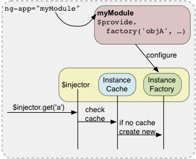

#### factory 与 injector

如以下例子：

```JavaScript
var app = angular.module('myApp', []);
	
// 通过 injector 构建一个 'dependence' 依赖， dependence 需要使用到 '$window'
app.factory("dependence", function($window){
	return {
		show: function(text){
			$window.alert(text);
		}
	}
});
// 从 module 创建的 injector ，这个常常是 Angular 启动时自动完成的
var inject = angular.injector(["myApp", "ng"]);
	
// 通过 injector 请求名为dependence的依赖
var dep = inject.get("dependence");
```
函数或对象通过请求依赖解决了硬编码的问题，但同时也就意味着 injector 需要通过应用传递，而传递 injector 破坏了 Law of Demeter（即，迪米特原则，最少知道原则，就是说一个对象应当对其他对象有尽可能少的了解,不和陌生人说话）。为了弥补这个，我们通过像下面例子那样声明依赖，将依赖查找的任务丢给了 injector 去做：

```JavaScript
//把需要使用依赖的依赖名字传入函数中
app.controller('MyController', function($scope, dependence) {
   $scope.showMsg = function(){
        dep.show("Test");
   }
});
```
视图代码如下：

```html
<div ng-app="myApp">
	<div ng-controller="MyController">
		<button ng-click="showMsg()">Show</button>
	</div>
</div>
```
由此，我们通过让 ng-controller 在背后调用 injector 初始化控制器类满足了 MyController 需要依赖的需求，而且可以让控制器根本不知道 injector 的存在，这是最好的结果了。应用中的代码简单地提交它需要某依赖的请求，不需要去管injector，而且这样也不违反迪米特法则了。

完整代码：

```html
<!DOCTYPE html>
<html lang="zh-CN">

	<head>
		<meta charset="utf-8">
	</head>

	<body>

		<div ng-app="myApp">
			<div ng-controller="MyController">
				<button ng-click="showMsg()">Show</button>
			</div>
		</div>

		
		<script type="text/javascript" src="https://cdnjs.cloudflare.com/ajax/libs/angular.js/1.7.5/angular.min.js"></script>
		<script>
			
			var app = angular.module('myApp', []);
			
			// 通过 factory 构建一个 'dependence' 依赖， dependence 需要使用到 '$window'
			app.factory("dependence", function($window){
			   //此函数需要返回一个对象
				return {
					show: function(text){
						$window.alert(text);
					}
				}
			});
			 // 从 module 创建的 injector ，这个常常是 Angular 启动时自动完成的
			var inject = angular.injector(["myApp", "ng"]);
			
			// 通过 injector 请求名为dependence的依赖
			var dep = inject.get("dependence");
			
			//把需要使用的依赖名字传入函数中
			app.controller('MyController', function($scope, dependence) {
			   $scope.showMsg = function(){			   	
			   	dep.show("Test");
			   }
			});
			
		</script>
	</body>

</html>
```
案例：

```html
<!DOCTYPE html>
<html lang="zh-CN">

    <head>
        <meta charset="utf-8">
    </head>

    <body>

        <div ng-app="myApp">
        		<div ng-controller="MyController">
	            Your Name：
	            <input type="text" ng-model="username" />
	            <button ng-click="getDependence()">点击</button>
	            <hr />
	            {{personMsg}}
           </div>
        </div>
          
        <script type="text/javascript" src="https://cdnjs.cloudflare.com/ajax/libs/angular.js/1.7.5/angular.min.js"></script>
        <script>  
            var app = angular.module('myApp', []);
            // 通过 injector 构建一个 'PersonInfo' 依赖
            app.factory("PersonInfo", function(){
            		return {
            			name: "Person",
            			show: function(text){
            				name = text;
            				return name;
            			}
            		}
            });
            // 从 module 创建的 injector
            var inject = angular.injector(["myApp", "ng"]);
            
            // 通过 injector 请求名为PersonInfo的依赖
            var person = inject.get("PersonInfo");
        
            //把需要使用的依赖名字传入函数中
            app.controller("MyController", function($scope, PersonInfo){
            		$scope.username = "Null";
            		$scope.getDependence = function() {
            			$scope.personMsg = person.show($scope.username);
            		}
            });
            
        </script>
    </body>

</html>
```

#### factory 与service

如下：

```html
<!DOCTYPE html>
<html lang="zh-CN">

    <head>
        <meta charset="utf-8">
    </head>

    <body>

        <div ng-app="myApp">
        		<div ng-controller="MyController">
	            Your Name：
	            <input type="text" ng-model="username" />
	            <button ng-click="getDependence()">点击</button>
	            <hr />
	            {{personMsg}}
           </div>
        </div>

        <script type="text/javascript" src="https://cdnjs.cloudflare.com/ajax/libs/angular.js/1.7.5/angular.min.js"></script>
        <script>
            
            var app = angular.module('myApp', []);
            
             // 通过 factory 构建一个 'PersonInfo' 依赖
            app.factory("PersonInfo", function(){
            		return {
            			name: "Person",
            			show: function(text){
            				name = text;
            				return name;
            			}
            		}
            });

            //在 service 中注入 factory 中的PersonInfo依赖
            app.service("PersonService", function(PersonInfo){
            		this.getPersonName = function(text) {
            			return PersonInfo.show(text);
            		}
            });
            
            //将需要使用的service注入控制器中
            app.controller("MyController", function($scope, PersonService){
            		$scope.username = "Null";
            		$scope.getDependence = function() {
            			$scope.personMsg = PersonService.getPersonName($scope.username);
            		}
            });
            
        </script>
    </body>

</html>
```

#### provider 与 service

```html
<!DOCTYPE html>
<html lang="zh-CN">

    <head>
        <meta charset="utf-8">
    </head>

    <body>

        <div ng-app="myApp">
        		<div ng-controller="MyController">
	            Your Name：
	            <input type="text" ng-model="username" />
	            <button ng-click="getDependence()">点击</button>
	            <hr />
	            {{personMsg}}
           </div>
        </div>

        <script type="text/javascript" src="https://cdnjs.cloudflare.com/ajax/libs/angular.js/1.7.5/angular.min.js"></script>
        <script>
            
            var app = angular.module('myApp', []);
            
             // 在 config 函数中，通过$provide去配置一个名为'PersonInfo'的provider
			app.config(function($provide){
				$provide.provider("PersonInfo", function(){
					//Provider 中提供了一个 factory 方法 get()，它用于返回 value/service/factory
					this.$get = function() {
						return {
							name: "Person",
		            			show: function(text){
		            				name = text;
		            				return name;
		            			}
						}
					};
				});
			});

            //在 service 中注入 factory中的PersonInfo依赖
            app.service("PersonService", function(PersonInfo){
            		this.getPersonName = function(text) {
            			return PersonInfo.show(text);
            		}
            });
            
            //将service注入控制器中
            app.controller("MyController", function($scope, PersonService){
            		$scope.username = "Null";
            		$scope.getDependence = function() {
            			$scope.personMsg = PersonService.getPersonName($scope.username);
            		}
            });
            
        </script>
    </body>

</html>
```

## 二、AngularJS路由
> AngularJS 路由机制是由ngRoute模块提供，它允许我们将视图分解成布局和模板视图，根据URL变化动态的将模板视图加载到布局中，从而实现单页面应用的页面跳转功能，它让我们通过不同的 URL 访问不同的内容。

### （一）AngularJS中的url

通常我们的URL形式是：协议/域名/路径，如:


    http://127.0.0.1:8080/BootstrapDemo2/index.html

不过在单页Web应用中， AngularJS 的路径由3部分组成：

    URL + #! + 标记

> 注意：
> 如果angular-route的版本是1.3.0x以下，则用“#”：

>     URL + # + 标记
> 在本课程中使用的angular-route是1.7.0版本的。

\#!号代表着网页的一个位置 ，其后边的所有内容，就是用来标示该位置的标识符。
标记是我们指定某个模版的标记，通常以`/`开头的，如：`/home`
\#!号及后面的内容称为url中的hash片段，它们都不会发送到服务端。比如下面三个url，向服务端请求的地址都是一样的，如果只改变#号后面的内容，刷新不会导致网页的重载：

    https://www.iflysse.com#!/
    https://www.iflysse.com#!/home
    https://www.iflysse.com#!/personal


所以我们需要**在客户端实现 # 号后面内容的功能实现**。AngularJS 路由就通过 `# + 标记` 帮助我们区分不同的逻辑页面并将不同的页面绑定到对应的控制器上。

### （二）路由的使用
#### 1、引入文件并注入依赖
由于AngularJS已经将ngRoutes从核心代码中剥离出来成为独立的模块，所以在需要通过script导入依赖文件：

```html
<script src="https://cdn.bootcss.com/angular.js/1.6.9/angular-route.js"></script>
```
然后我们需要安装模块声明中注入对ngRoute的依赖，才能在AngularJS应用中正常地使用路由功能：

```JavaScript
var app = angular.module("myApp",["ngRoute"]);
```
#### 2、创建视图
创建HTML页面视图，即创建布局模板，是为了告诉AngularJS应该将布局渲染到何处。通过ng-view指令，我们可以精确的指定模板视图在DOM中的渲染位置。

```html
<div ng-app="myApp">
    <a ng-href="#!/music">音乐</a>
    <a ng-href="#!/movie">电影</a>
    <a ng-href="#!/novel">小说</a>
    <a ng-href="#!/other">其他</a>
    <div ng-view></div>
</div>
```
#### 3、创建一些模板视图

音乐界面：myMusic.html

```html
<p>这里是音乐界面</p>
```
电影界面：myMovie.html

```html
<p>这里是电影界面</p>
```
小说界面：myNovel.html

```html
<p>这里是小说界面</p>
```

首页：home.html

```html
<p>我是首页界面</p>
```

其他：other.html

```html
<p>我是其他界面</p>
```

4、定义路由列表

```JavaScript
app.config(['$routeProvider',function($routeProvide) {
    $routeProvide
        .when('/',{templateUrl:"home.html"})
        .when('/music',{templateUrl:"myMusic.html"})
        .when('/movie',{templateUrl:"myMovie.html"})
        .when('/novel',{templateUrl:"myNovel.html"})
        .otherwise({redirectTo:'/'});//表示没有匹配到正确路由时跳转到这里
}]);
```
完整代码如下：

```html
<!DOCTYPE html>
<html lang="zh-CN">

    <head>
        <meta charset="utf-8">
    </head>

    <body>
    	
		<div ng-app="myApp">
		    <a ng-href="#!/music">音乐</a>
		    <a ng-href="#!/movie">电影</a>
		    <a ng-href="#!/novel">小说</a>
		    <a ng-href="#!/other">其他</a>
		    <div ng-view></div>
		</div>

        <script type="text/javascript" src="https://cdnjs.cloudflare.com/ajax/libs/angular.js/1.7.5/angular.min.js"></script>
        <script src="https://cdn.bootcss.com/angular.js/1.7.0/angular-route.min.js"></script>
        <script>
			var app = angular.module("myApp", ["ngRoute"]);
			app.config(["$routeProvider", function($routeProvide){
				$routeProvide
				.when("/", {templateUrl: "home.html"})
				.when("/music", {templateUrl: "myMusic.html"})
				.when("/movie", {templateUrl: "myMovie.html"})
				.when("/novel", {templateUrl: "myNovel.html"})
				.when("/other", {templateUrl: "other.html"})
				.otherwise({redirectTo:'/'});
			}]);
            
        </script>
    </body>

</html>
```

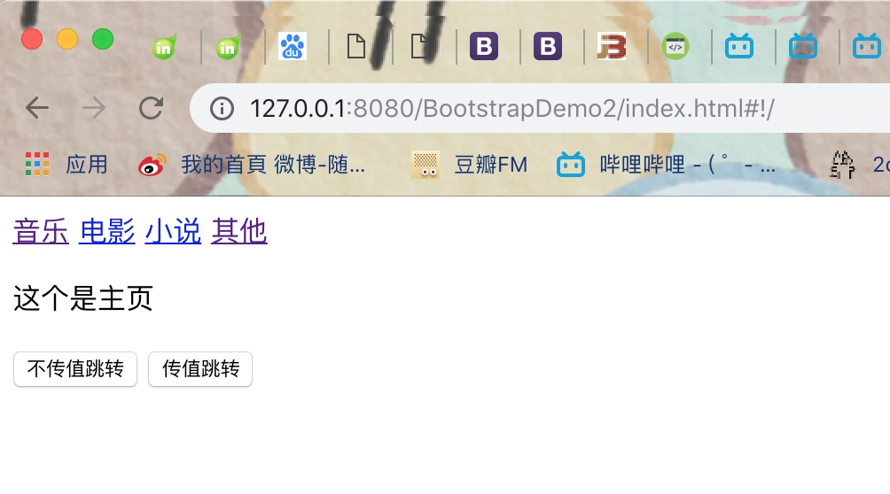


### （三）路由相关指令与服务
#### 1、涉及到的服务与指令
* `$routeProvider` 用来定义路由表，我们会用到里面的when和otherwise两个方法。
* `$routeParams`用来保存地址栏中的参数，也提供了通配某类地址的能力。
* `$location` 用来分析处理url。
* `$ng-view` 用来指定加载模板视图的区域。

#### 2、$location.path()详解
如果没有传入参数，返回当前路径，即**#!号后的内容**；也可以传入字符串，那么会将当前路径**修改为字符串的内容，并触发路由变化**。

##### （1）不传参数
那么如果我们直接调用`$location.path()`，不传入参数，则会返回`/` 

##### （2）传入参数
如果我们传入参数，则路径会发生改变，并且触发路由变化：
`$location.path('/music')`，那再次通过`$location.path()`则可以返回：`/music`

详细代码如下：

```html
<!DOCTYPE html>
<html lang="zh-CN">

    <head>
        <meta charset="utf-8">
    </head>

    <body>
    	
		<div ng-app="myApp">
			<div ng-controller="myCtrl">
				<a ng-href="#!/music">音乐</a>
			    <a ng-href="#!/movie">电影</a>
			    <a ng-href="#!/novel">小说</a>
			    <a ng-href="#!/other">其他</a>
			    <div ng-view></div>
			    
			    	<button ng-click="jumpNothing()">不传值跳转</button>
			    	<button ng-click="jump()">传值跳转</button>
			    	<h3>{{myURL}}</h3>
			    
			</div>
		</div>

        <script type="text/javascript" src="https://cdnjs.cloudflare.com/ajax/libs/angular.js/1.7.5/angular.min.js"></script>
        <script src="https://cdn.bootcss.com/angular.js/1.7.0/angular-route.min.js"></script>
        <script>
			var app = angular.module("myApp", ["ngRoute"]);
			app.config(["$routeProvider", function($routeProvide){
				$routeProvide
				.when("/", {templateUrl: "home.html"})
				.when("/music", {templateUrl: "myMusic.html"})
				.when("/movie", {templateUrl: "myMovie.html"})
				.when("/novel", {templateUrl: "myNovel.html"})
				.when("/other", {templateUrl: "other.html"})
				.otherwise({redirectTo:'/'});
			}]);
			app.controller("myCtrl", function($scope, $location){
				$scope.jumpNothing = function(){
					$scope.myURL = $location.path();
				}
				$scope.jump = function(){
					$location.path("/music");
					$scope.myURL = $location.path();
				}
			})
            
        </script>
    </body>
</html>
```
#### 3、when及otherwise详解
when方法能够接收两个参数：

* 第一个参数是路由路径，这个路径会与`$location.path()`的值进行匹配，如果没有任何一个when方法匹配到，那么将会执行otherwise方法。
* 第二个参数是配置对象，它有以下几个属性，分别是：


```
$routeProvider.when(url,{
    template:string, //在ng-view中插入简单的html内容
    templateUrl:string, //在ng-view中插入html模版文件
    controller:string,function / array, //在当前模版上执行的controller函数
    controllerAs:string, //为controller指定别名
    redirectTo:string,function, //重定向的地址
    resolve:object<key,function> //指定当前controller所依赖的其他模块
});
```

##### （1）controller
该属性值可以是一个字符串，也可以是一个函数。如果是字符型，则会搜索相应的控制器；如果是函数，那么该函数代表控制器(可以用controllerAs为控制器命名或起别名的）。控制器会与路由所创建的作用域关联在一起，并且转到该路径时都会执行一次控制器中的内容。

```html
//每次路径变为/music触发路由变化时都会执行一次控制器中的内容
app.config(['$routeProvider',function($routeProvide) {
    $routeProvide.when('/music', {templateUrl:"myMusic.html",controller:"musicCtrl"})           
}]);
app.controller('musicCtrl',function($scope) {
    console.log("musicCtrl");
});
```
##### （2）controllerAs
给controller属性值代表的控制器起个别名，以便之后引用。

##### （3）template 
值是一个字符串，代表一个HTML模板，AngularJS会使用该模板来渲染。如果我们只需要在 ng-view 中插入简单的 HTML 内容，则使用该参数：

```JavaScript
.when('/music',{template:"这是音乐页面"})
```
##### （4）templateUrl 
值是一个字符串，代表一个存着HTML模板的路径，AngularJS会通过该路径下的HTML模板来渲染。如果我们只需要在 ng-view 中插入 HTML 模板文件，则使用该参数：

```JavaScript
.when('/music',{templateUrl:"myMusic.html"})
```
##### （5）resolve 
指定当前controller所依赖的其他模块，值是一个对象，该对象属性名是可以注入到控制器的依赖，属性值可包含下列内容：

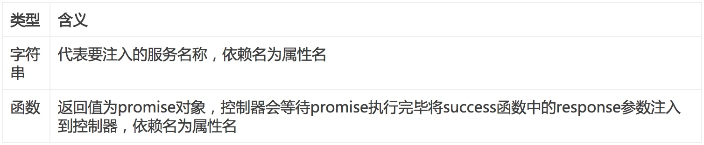

##### （6）redirectTo 
值是一个字符串或一个函数，该属性写在otherwise中，代表着在when中找不到相应路径时的重定向。如果是字符串，路径会被替换成该值；如果是函数，它有三个参数，第一个是当前路径的路由参数，第二个是当前路径，第三个当前Url的查询串，路径会被替换成该函数的返回值，替换后都会触发路由变化。

##### （7）reloadOnSearch 
值是一个布尔值，为true的时候，`$location.search()`发生变化时就会重新加载路由，location.search是从当前URL的?号开始（包括?号）的字符串。

#### 4、$routeParams
我们可以在路由路径参数的后面加上`/:变量`，AngularJS会把它解析出来并传递给`$routeParams`，然后变量即可接收到传递的值。 下面的例子中我们将123456传给变量value，AngularJS把其解析出来，在`$routeParams`中添加一个名为value的键，值为123456，我们可以将该服务注入到控制器中使用。

other.html代码如下：

```html
		<p>这是其他页面</p>
		<h3>{{userID}}</h3>
```
index.html代码如下：

```html
<!DOCTYPE html>
<html lang="zh-CN">

    <head>
        <meta charset="utf-8">
    </head>

    <body>
    	
		<div ng-app="myApp">
			<div ng-controller="myCtrl">
				<a ng-href="#!/music">音乐</a>
			    <a ng-href="#!/movie">电影</a>
			    <a ng-href="#!/novel">小说</a>
			    <a ng-href="#!/other/10001">其他</a>
			    <div ng-view></div>
			    
			    	<button ng-click="jumpNothing()">不传值跳转</button>
			    	<button ng-click="jump()">传值跳转</button>
			    
			</div>
		</div>

        <script type="text/javascript" src="https://cdnjs.cloudflare.com/ajax/libs/angular.js/1.7.5/angular.min.js"></script>
        <script src="https://cdn.bootcss.com/angular.js/1.7.0/angular-route.min.js"></script>
        <script>
			var app = angular.module("myApp", ["ngRoute"]);
			app.config(["$routeProvider", function($routeProvide){
				$routeProvide
				.when("/", {templateUrl: "home.html"})
				.when("/music", {templateUrl: "myMusic.html"})
				.when("/movie", {templateUrl: "myMovie.html"})
				.when("/novel", {templateUrl: "myNovel.html"})
				.when("/other/:value", {templateUrl: "other.html",
				controller: function($scope, $routeParams){
					$scope.userID = $routeParams.value;
				}})
				.otherwise({redirectTo:'/'});
			}]);
			app.controller("myCtrl", function($scope, $location){
				$scope.jumpNothing = function(){
					$scope.myURL = $location.path();
				}
				$scope.jump = function(){
					$location.path("/music");
					$scope.myURL = $location.path();
				}
			});

        </script>
    </body>
</html>
```
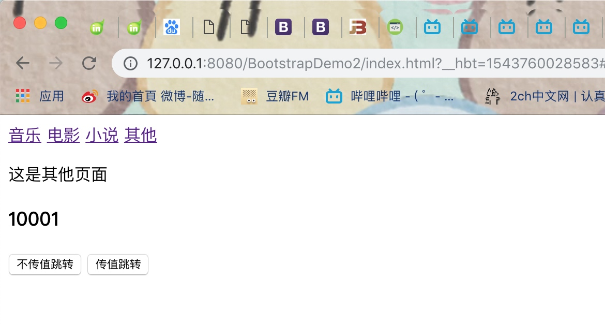


#### 5、路由事件
　`$route`服务在路由过程中的每个阶段都会触发不同的事件，可以为这些事件设置监听器并做出响应。路由事件都是系统自动从`$rootScope`广播下去的，我们最好的做法是在`$rootScope`中监听，而最佳设置的地方就是run方法，可以保证不会漏掉任何路由变化。 
　
　　下面是四种不同的路由事件：

* `$routeChangeStart` 

AngularJS在**路由改变之前**就会广播此事件，在广播后，路由会开始加载路由变化所需要的所有依赖，并且模板和resolve键中的promise都会被resolve。

* `$routeChangeSuccess `

在路由的依赖加载，且resolve键中所有promise都resolve了就会广播此事件。

* `$routeChangeError `

在resolve键中任何一个promise被拒绝或者失败后会广播此事件，也就是说，此事件与$routeChangeSuccess互斥。

* `$routeUpdate `

在reloadOnSearch属性设置为false的情况下，重新使用某个控制器的实例会广播该事件。

