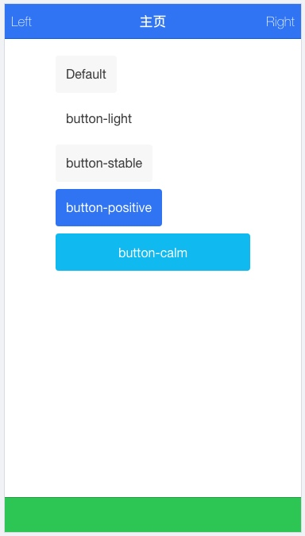

# Hybrid APP 开发（项目创建、header、footer、list、card）

**1. header
2. footer
3. list
4. card**


## 一、ionic
> ionic 是一个强大的 HTML5 应用程序开发框架(HTML5 Hybrid Mobile App Framework )， 可以帮助我们使用 Web 技术，比如 HTML、CSS 和 Javascript 构建接近原生体验的移动应用程序。ionic是一个轻量的手机UI库，具有速度快，界面现代化、美观等特点。

> ionic 主要关注外观和体验，以及与我们应用程序 UI 的交互，特别适合用于基于 Hybird 模式的 HTML5 移动应用程序开发，所以是也一个强大的Hybrid开发工具。

### （一）特点

1.ionic 基于Angular语法，简单易学。
2.ionic 是一个轻量级框架。
3.ionic 完美的融合下一代移动框架，支持 Angularjs 的特性， MVC ，代码易维护。
4.ionic 提供了漂亮的设计，通过 SASS 构建应用程序，它提供了很多 UI 组件来帮助开发者开发强大的应用。
5.ionic 专注原生，让你看不出混合应用和原生的区别
6.ionic 提供了强大的命令行工具。
7.ionic 性能优越，运行速度快。

### （二）安装
在我们的课程中，也是使用ionic来进行开发。Mac系统下终端安装过程如下：
1、首先依赖于node和npm工具，所以先通过命令`node -v`和`npm -v`确认一下这两个是否安装了，如果安装了则会出现具体的版本信息。如果没有，则先安装 `Node.js`，可以直接下载安装包安装，[下载地址](https://nodejs.org/en/)，安装好后再验证一下版本
2、安装了node后会有npm工具，不需要手动安装，如果出现npm无法使用，手动安装npm或者重新安装node；
3、然后安装 `cordova ionic`，通过命名`cordova -v`确认版本，

* 如果未安装则：

```vim
sudo npm install -g cordova ionic
```
* 如果已经安装安装，可以执行以下命令来更新版本:

```vim
npm update -g cordova ionic
```

### （三）创建项目
#### 1、安装完毕后，我们可以通过终端来创建应用：
首先需要提高系统权限，然后执行创建命令：

```vim
sudo -s
ionic start MyIonicApp blank
```

> 注意：
> 如果出现以下提示：
> 
```
Error: Client network socket disconnected before secure TLS connection was established
```
> 则表示当前镜像源不可用，可以换成淘宝镜像源，通过以下命令：

> ```
> npm install -g cnpm --registry=https://registry.npm.taobao.org
> ```
> 切换成功后再执行其他命令

#### 2、然后进入应用根目录，创建iOS应用或Android应用：

```vim
//进入项目目录
cd MyIonicApp

//添加移动端平台
ionic cordova platform add ios
//或
ionic cordova platform add android
```
出现`[OK] Integration cordova added!`的提示则表示添加成功


> Tips：
> 当我们在添加android平台时，出现如下提示：

> ```
> Requirements check failed for JDK 1.8 or greater
> ```
> 那么，则是由于当前系统上的java版本比较低了，需要安装高版本的jdk，需要先删除旧版本的jdk：
> 1.进入java虚拟机文件夹
> `cd /Library/Java/JavaVirtualMachines`
> 2.查看本版本，然后通过以下命令来删除改版本的jdk：
> `sudo rm -rf jdk1.7.0_79.jdk`
> 3.重新下载最新版本的jdk（当前）并安装，[下载地址](http://www.oracle.com/technetwork/java/javase/downloads/jdk8-downloads-2133151.html)
> 4.下载安装好后再运行：`ionic cordova platform add android`


#### 3、然后构建iOS或Android项目：

```vim
ionic build ios
//或
ionic build android
//注意：新版本的需要在 ionic后加上cordova，如下：
ionic cordova build ios
//或
ionic cordova build android
```
若提示：`** BUILD SUCCEEDED **`则表示构建成功，可以打开项目进行调试了。

### （四）使用
在接下去的课程中，我们使用Visual Studio Code（以下简称：VS Code）来进行编写代码，Ionic Lab 来进行移动端的测试，使用Brackets进行网页端的调试。
通过终端创建好项目后，我们打开项目目录，默认已经生成了一些文件，我们通过WWW文件夹中的index.html文件进行开发。

在项目中我们也可以直接使用CDN库地址来使用ionic和cordova：

```html
<link href="https://cdn.bootcss.com/ionic/1.3.2/css/ionic.css" rel="stylesheet">
<script src="https://cdn.bootcss.com/ionic/1.3.2/js/ionic.bundle.min.js"></script>

```

如下：

```html
<!DOCTYPE html>
<html lang="en" dir="ltr" ng-app="myApp">
<head>
  <script data-ionic="inject">
    (function(w){var i=w.Ionic=w.Ionic||{};i.version='3.9.2';i.angular='5.2.11';i.staticDir='build/';})(window);
  </script>
  <meta charset="UTF-8">
  <title>Ionic App</title>
  <meta name="viewport" content="viewport-fit=cover, width=device-width, initial-scale=1.0, minimum-scale=1.0, maximum-scale=1.0, user-scalable=no">
  <meta name="format-detection" content="telephone=no">
  <meta name="msapplication-tap-highlight" content="no">

  <link rel="icon" type="image/x-icon" href="assets/icon/favicon.ico">
  <link rel="manifest" href="manifest.json">
  <meta name="theme-color" content="#4e8ef7">

  <!-- add to homescreen for ios -->
  <meta name="apple-mobile-web-app-capable" content="yes">
  <meta name="apple-mobile-web-app-status-bar-style" content="black">

  <link href="https://cdn.bootcss.com/ionic/1.3.2/css/ionic.css" rel="stylesheet">
  <script src="https://cdn.bootcss.com/ionic/1.3.2/js/ionic.bundle.min.js"></script>

  <!-- cordova.js required for cordova apps (remove if not needed) -->
  <script src="cordova.js"></script>

  <!-- un-comment this code to enable service worker
  <script>
    if ('serviceWorker' in navigator) {
      navigator.serviceWorker.register('service-worker.js')
        .then(() => console.log('service worker installed'))
        .catch(err => console.error('Error', err));
    }
  </script>-->

  <script>
    var app = angular.module("myApp", ["ionic"]);
    app.controller("MyCtrl", function($scope){
      
    });
  </script>

  <link href="build/main.css" rel="stylesheet">

</head>
<body ng-controller="MyCtrl">
  
  <ion-header-bar class="bar-positive">
    <div class="title">主页</div>
  </ion-header-bar>

  <!-- Ionic's root component and where the app will load -->
  <ion-app></ion-app>

  <!-- The polyfills js is generated during the build process -->
  <script src="build/polyfills.js"></script>

  <!-- The vendor js is generated during the build process
       It contains all of the dependencies in node_modules -->
  <script src="build/vendor.js"></script>

  <!-- The main bundle js is generated during the build process -->
  <script src="build/main.js"></script>

</body>
</html>

```

在以上代码中：以上代码中，我们引入了 Ionic CSS 文件及 Ionic AngularJS 的扩展ionic.bundle.js文件。

ionic.bundle.js 文件已经包含了 Ionic核心JS、AngularJS、Ionic的AngularJS扩展，如果我们还需要引入其他 Angular 模块，可以从工程目录WWW文件夹中的 lib/js/angular 目录中调用。

cordova.js 是在使用 Cordova/PhoneGap 创建应用时生成的，不需要手动引入，你可以在 Cordova/PhoneGap 项目中找到该文件，所以在开发过程中显示 404 是正常的。

#### 1、ionic头部和底部
##### （1）Header（头部）
Header是固定在屏幕顶部的组件,可以包含如标题和左右的功能按钮。ionic 默认提供了许多种颜色样式，我们可以调用不同的样式名，当然也可以自定义一个：

```html
    <div class="bar bar-header bar-positive">
      <h1 class="title">主页</h1>
    </div>
```

可以通过给div添加bar 以及 bar-header 类即可实现Header样式，我们可以给bar添加颜色，如以上bar-positive（蓝色），或者bar-assertive（红色）等，如下：
**bar-light：**

**bar-stable**

**bar-calm**：

**bar-balanced：**

**bar-energized：**


我们也可以通过`<ion-header-bar>`标签来实现，又如：

```html
  <ion-header-bar class="bar-positive">
    <button class="button button-clear" style="color:white">Left</button>
    <div class="title">主页</div>
    <button class="button button-clear" style="color:white">Right</button>
  </ion-header-bar>
```


##### （2）Sub Header（副标题）

Sub Header同样是固定在顶部，只是是在Header的下面，就算没有Header，Sub Header这个样式也会距离顶部有一个Header的距离。颜色样式与 Header相同 ：

```html
<div class="bar bar-header">
  <h1 class="title">Header</h1>
</div>
<div class="bar bar-subheader">
  <h2 class="title">Sub Header</h2>
</div>
```


##### （3）Footer(底部)

Footer 是在屏幕的最下方，可以包含多种内容类型，且样式用法与header相同：

```html
  <div class="bar bar-header bar-positive">
    <button class="button button-clear" style="color:white">Left</button>
    <div class="title">主页</div>
    <button class="button button-clear" style="color:white">Right</button>
  </div>
  
  <div class="bar bar-footer bar-balanced"></div>
```


在Header或Footer中，如果没有标题，但需要将某个按钮设置成左或右对齐，则可以添加push-left、pull-right类：

```html
  <div class="bar bar-header bar-positive">
    <button class="button button-clear pull-right" style="color:white">按钮</button>
  </div>
```


#### 2、ionic按钮
按钮是移动app不可或缺的一部分，不同风格的app，需要的不同按钮的样式，样式与Header/Footer类似，可以通过添加后缀来改变不同颜色。默认情况下，按钮显示样式为：display: inline-block：


```html
  <ion-content style="margin: 64px;">
    <p>
      <button class="button">
        Default
      </button>
    </p>
    
    <p>
      <button class="button button-light">
        button-light
      </button>
    </p>
    
    <p>
      <button class="button button-stable">
        button-stable
      </button>
    </p>
    
    <p>
      <button class="button button-positive">
        button-positive
      </button>
    </p>
    
    <p>
      <button class="button button-calm">
        button-calm
      </button>
    </p>
  </ion-content>
```


a、如果我们需要按钮完全填充父元素的宽度，则可以添加`button-block`类：

```html
		<button class="button button-calm button-block">
		  button-calm
		</button>
```



b、按钮大小，可以通过button-large和button-small来进行设置：

```html
<p>
  <button class="button button-large">
    Default
  </button>
</p>
    
<p>
  <button class="button button-light button-small">
    button-light
  </button>
</p>
```


c、无背景按钮，通过添加button-outline类可设置背景为透明

```html
  	<ion-content style="margin: 64px;">
      <p>
        <button class="button button-outline button-light">button-light</button>
      </p>
      <p>
        <button class="button button-outline button-stable">button-stable</button>
      </p>
      <p>
        <button class="button button-outline button-positive">button-positive</button>
      </p>
      <p>
        <button class="button button-outline button-calm">button-calm</button>
      </p>
      <p>
        <button class="button button-outline button-balanced">button-balanced</button>
      </p>
      <p>
        <button class="button button-outline button-energized">button-energized</button>
      </p>
      <p>
        <button class="button button-outline button-assertive">button-assertive</button>
      </p>
      <p>
        <button class="button button-outline button-royal">button-royal</button>
      </p>
      <p>
        <button class="button button-outline button-dark">button-dark</button>
      </p>
    </ion-content>
```


d、无背景无边框按钮，通过添加button-clear类来设置按钮背景为透明，且无边框

```html
<div class="bar bar-header bar-positive">
<button class="button button-clear" style="color:white">Left</button>
<div class="title">主页</div>
<button class="button button-clear" style="color:white">Right</button>
</div>
```

e、图标按钮，如下：

```html
    <ion-content style="margin: 64px;">
        <p>
            <button class="button icon-right ion-ios-home button-light">button-light</button>
        </p>
        <p>
            <button class="button icon-left ion-ios-star button-stable">button-stable</button>
        </p>
        <p>
            <button class="button  ion-ios-arrow-back button-positive"></button>
            <button class="button  ion-ios-arrow-forward button-calm"></button>
        </p>
        <p>
            <button class="button icon ios-gear-a button-balanced">button-balanced</button>
        </p>
        <p>
            <button class="button icon ion-ios-settings button-energized"></button>
        </p>
        <p>
            <button class="button icon ion-ios-cart button-assertive"></button>
        </p>
        <p>
            <button class="button icon ion-ios-chatboxes button-royal"></button>
        </p>
        <p>
            <button class="button icon ion-ios-trash button-dark"></button>
        </p>
        <p>
            <button class="button icon ion-ios-trash-outline button-dark"></button>
        </p>
    </ion-content>
```


f、头部和底部按钮：

```html
      <div class="bar bar-header">
    <button class="button icon ion-ios-keypad-outline"></button>
    <div class="title">主页</div>
    <button class="button">Edit</button>
  </div>
```


e、按钮栏：

```html
<div class="button-bar" style="margin-top: 64px;">
  <a class="button">First</a>
  <a class="button">Second</a>
  <a class="button">Third</a>
</div>
```


#### 3、列表
> 列表是一个应用广泛的界面元素，在所有移动app中几乎都会使用到，列表可以是基本文字、按钮，开关，图标和缩略图等，样式类似于UITableView。列表项可以是任何的HTML元素，容器元素需要list类，每个列表项需要使用item类：

```html
  <div class="bar bar-header bar-positive">
    <button class="button button-clear">Left</button>
    <div class="title">主页</div>
    <button class="button button-clear">Right</button>
  </div>
    
  <div class="content has-header">

    <ul class="list">
      <li class="item">
        Mega Man
      </li>
      <li class="item">
        Metroid
      </li>
      <li class="item">
        Mike Tyson's Punch-Out
      </li>
      <li class="item">
        R.C. Pro-Am
      </li>
      <li class="item">
        Spy Hunter
      </li>
      <li class="item">
        Super Mario Bros.
      </li>
      <li class="item">
        The Legend of Zelda
      </li>
    </ul>
    
  </div>

  <div class="bar bar-footer bar-calm"></div>
```


a、列表分隔符
我们可以使用 item-divider 类来为列表创建分隔符，样式类似于Section的Header，默认情况下，列表项以不同的背景颜色和字体加粗来区分：

```html
<div class="bar bar-header bar-positive">
        <button class="button button-clear">Left</button>
        <div class="title">主页</div>
        <button class="button button-clear">Right</button>
    </div>

    <div class="content has-header">

        <ul class="list">
            <li class="item item-divider">
                M
            </li>
            <li class="item">
                Mega Man
            </li>
            <li class="item">
                Metroid
            </li>
            <li class="item">
                Mike Tyson's Punch-Out
            </li>
            <li class="item item-divider">
                R
            </li>
            <li class="item">
                R.C. Pro-Am
            </li>
            <li class="item item-divider">
                S
            </li>
            <li class="item">
                Spy Hunter
            </li>
            <li class="item">
                Super Mario Bros.
            </li>
            <li class="item item-divider">
                T
            </li>
            <li class="item">
                The Legend of Zelda
            </li>
        </ul>

    </div>

    <div class="bar bar-footer bar-calm"></div>
```


b、图标列表：
可以通过给元素添加icon、icon-xx-xx来添加图标，并且可以使用 item-icon-left 让图标在左侧， item-icon-right 设置图标在右侧：

```html
<a class="item item-icon-left" href="#">
	<i class="icon ion-ios-bookmarks"></i>
	Bookmarks
	<span class="item-note">
		JT
	</span>
</a>
```


c、内嵌列表（inset list）

我们可以在容器当中内嵌列表，列表不会显示完整的宽度，内嵌列表的样式为：list list-inset，与常规列表区别是，它设置了外边距（marign）,类似于选项卡，内嵌列表是没有阴影效果的，滚动时效果会更好：

```html
<!DOCTYPE html>
<html lang="en" dir="ltr" ng-app="myApp">
<head>
	<script data-ionic="inject">
		(function(w){var i=w.Ionic=w.Ionic||{};i.version='3.9.2';i.angular='5.2.11';i.staticDir='build/';})(window);
  </script>
	<meta charset="UTF-8">
	<title>Ionic App</title>
	<meta name="viewport" content="viewport-fit=cover, width=device-width, initial-scale=1.0, minimum-scale=1.0, maximum-scale=1.0, user-scalable=no">
	<meta name="format-detection" content="telephone=no">
	<meta name="msapplication-tap-highlight" content="no">

	<link rel="icon" type="image/x-icon" href="assets/icon/favicon.ico">
	<link rel="manifest" href="manifest.json">
	<meta name="theme-color" content="#4e8ef7">

	<!-- add to homescreen for ios -->
	<meta name="apple-mobile-web-app-capable" content="yes">
	<meta name="apple-mobile-web-app-status-bar-style" content="black">

	<link href="https://cdn.bootcss.com/ionic/1.3.2/css/ionic.css" rel="stylesheet">
	<script src="https://cdn.bootcss.com/ionic/1.3.2/js/ionic.bundle.min.js"></script>

	<!-- cordova.js required for cordova apps (remove if not needed) -->
	<script src="cordova.js"></script>

	<!-- un-comment this code to enable service worker
  <script>
    if ('serviceWorker' in navigator) {
      navigator.serviceWorker.register('service-worker.js')
        .then(() => console.log('service worker installed'))
        .catch(err => console.error('Error', err));
    }
  </script>-->

	<link href="build/main.css" rel="stylesheet">

</head>

<body ng-controller="MyCtrl">


	<div class="bar bar-header bar-positive">
		<button class="button button-clear">Left</button>
		<div class="title">主页</div>
		<button class="button button-clear">Right</button>
	</div>

	<div class="content has-header">

		<ul class="list list-inset">
			<li class="item item-divider">
				M
			</li>
			<li class="item">
				Mega Man
			</li>
			<li class="item">
				Metroid
			</li>
			<li class="item">
				Mike Tyson's Punch-Out
			</li>
			<li class="item item-divider">
				R
			</li>
			<li class="item">
				R.C. Pro-Am
			</li>
			<li class="item item-divider">
				S
			</li>
			<li class="item">
				Spy Hunter
			</li>
			<li class="item">
				Super Mario Bros.
			</li>
			<a class="item item-icon-left" href="#">
				<i class="icon ion-ios-bookmarks"></i>
				Bookmarks
				<span class="item-note">
					JT
				</span>
			</a>
		</ul>

	</div>

	<div class="bar bar-footer bar-calm"></div>


	<!-- The polyfills js is generated during the build process -->
	<script src="build/polyfills.js"></script>

	<!-- The vendor js is generated during the build process
       It contains all of the dependencies in node_modules -->
	<script src="build/vendor.js"></script>

	<!-- The main bundle js is generated during the build process -->
	<script src="build/main.js"></script>

	<script>
		var app = angular.module("myApp", ["ionic"]);
		app.controller("MyCtrl", function($scope) {

		});
	</script>

</body>
</html>

```


#### 4、ionic卡片

近年来卡片(card)的应用越来越流行，卡片提供了一个更好组织信息展示的工具，针对移动端的应用，卡片会根据屏幕大小自适应大小。
我们可以很灵活的控制卡片的显示效果，甚至实现动画效果。ionic 卡片(card)默认样式带有box-shadow(阴影)，由于性能的原因，和他类似的元素像 list list-inset 并没有阴影。

a、如果有很多的卡片，每个卡片都有很多子元素，建议使用内嵌列表（inset list）我们可以通过添加 item-divider 类为卡片添加头部与底部：

```html
<div class="content has-header">

	<div class="card">
		<div class="item item-divider">
			卡片头部。
		</div>
		<div class="item item-text-wrap">
			基本卡片，包含了文本信息。
		</div>
		<div class="item item-divider">
			卡片底部。
		</div>
	</div>

</div>
```


b、我们还可以通过 list card 类来设置卡片列表：

```html
<div class="content has-header">

		<div class="list card">
			<a href="#" class="item item-icon-left">
				<i class="icon ion-ios-home"></i>
				Enter home address
			</a>

			<a href="#" class="item item-icon-left">
				<i class="icon ion-ios-telephone"></i>
				Enter phone number
			</a>

			<a href="#" class="item item-icon-left">
				<i class="icon  ion-ios-analytics"></i>
				Upload your icon
			</a>

			<a href="#" class="item item-icon-left">
				<i class="icon ion-ios-at"></i>
				Enter your E-mail
			</a>

		</div>

	</div>
```


c、我们还可以在卡片中使用图片：

```html
<!DOCTYPE html>
<html lang="en" dir="ltr" ng-app="myApp">

<head>
	<script data-ionic="inject">
		(function(w){var i=w.Ionic=w.Ionic||{};i.version='3.9.2';i.angular='5.2.11';i.staticDir='build/';})(window);
  </script>
	<meta charset="UTF-8">
	<title>Ionic App</title>
	<meta name="viewport" content="viewport-fit=cover, width=device-width, initial-scale=1.0, minimum-scale=1.0, maximum-scale=1.0, user-scalable=no">
	<meta name="format-detection" content="telephone=no">
	<meta name="msapplication-tap-highlight" content="no">

	<link rel="icon" type="image/x-icon" href="assets/icon/favicon.ico">
	<link rel="manifest" href="manifest.json">
	<meta name="theme-color" content="#4e8ef7">

	<!-- add to homescreen for ios -->
	<meta name="apple-mobile-web-app-capable" content="yes">
	<meta name="apple-mobile-web-app-status-bar-style" content="black">

	<link href="https://cdn.bootcss.com/ionic/1.3.2/css/ionic.css" rel="stylesheet">
	<script src="https://cdn.bootcss.com/ionic/1.3.2/js/ionic.bundle.min.js"></script>

	<!-- cordova.js required for cordova apps (remove if not needed) -->
	<script src="cordova.js"></script>

	<!-- un-comment this code to enable service worker
  <script>
    if ('serviceWorker' in navigator) {
      navigator.serviceWorker.register('service-worker.js')
        .then(() => console.log('service worker installed'))
        .catch(err => console.error('Error', err));
    }
  </script>-->

	<link href="build/main.css" rel="stylesheet">

</head>

<body ng-controller="MyCtrl">


	<div class="bar bar-header bar-positive">
		<button class="button button-clear">Left</button>
		<div class="title">主页</div>
		<button class="button button-clear">Right</button>
	</div>

	<div class="content has-header">

		<div class="list card">
			<div class="item item-avatar">
				
				<h2>Pretty Hate Machine</h2>
				<p>Nine Inch Nails</p>
			</div>

			<div class="item item-image">
				
			</div>

			<a href="#" class="item item-icon-left assertive">
				<i class="icon ion-ios-bookmarks"></i>
				Insert a bookmark
			</a>

		</div>

	</div>

	<div class="bar bar-footer bar-calm"></div>


	<!-- The polyfills js is generated during the build process -->
	<script src="build/polyfills.js"></script>

	<!-- The vendor js is generated during the build process
       It contains all of the dependencies in node_modules -->
	<script src="build/vendor.js"></script>

	<!-- The main bundle js is generated during the build process -->
	<script src="build/main.js"></script>

	<script>
		var app = angular.module("myApp", ["ionic"]);
		app.controller("MyCtrl", function($scope) {

		});
	</script>

</body>

</html>


```


d、卡片展示，以下实例中使用几种不同的选项的卡片展现方式。 开始使用了 list card 元素，并使用了 item-avatar , item-body 元素用于展示图片和文本信息，底部使用 item-divider 类：

```html
<!DOCTYPE html>
<html lang="en" dir="ltr" ng-app="myApp">

<head>
	<script data-ionic="inject">
		(function(w){var i=w.Ionic=w.Ionic||{};i.version='3.9.2';i.angular='5.2.11';i.staticDir='build/';})(window);
  </script>
	<meta charset="UTF-8">
	<title>Ionic App</title>
	<meta name="viewport" content="viewport-fit=cover, width=device-width, initial-scale=1.0, minimum-scale=1.0, maximum-scale=1.0, user-scalable=no">
	<meta name="format-detection" content="telephone=no">
	<meta name="msapplication-tap-highlight" content="no">

	<link rel="icon" type="image/x-icon" href="assets/icon/favicon.ico">
	<link rel="manifest" href="manifest.json">
	<meta name="theme-color" content="#4e8ef7">

	<!-- add to homescreen for ios -->
	<meta name="apple-mobile-web-app-capable" content="yes">
	<meta name="apple-mobile-web-app-status-bar-style" content="black">

	<link href="https://cdn.bootcss.com/ionic/1.3.2/css/ionic.css" rel="stylesheet">
	<script src="https://cdn.bootcss.com/ionic/1.3.2/js/ionic.bundle.min.js"></script>

	<!-- cordova.js required for cordova apps (remove if not needed) -->
	<script src="cordova.js"></script>

	<!-- un-comment this code to enable service worker
  <script>
    if ('serviceWorker' in navigator) {
      navigator.serviceWorker.register('service-worker.js')
        .then(() => console.log('service worker installed'))
        .catch(err => console.error('Error', err));
    }
  </script>-->

	<link href="build/main.css" rel="stylesheet">

</head>

<body ng-controller="MyCtrl">


	<div class="bar bar-header bar-positive">
		<button class="button button-clear">Left</button>
		<div class="title">主页</div>
		<button class="button button-clear">Right</button>
	</div>

	<div class="content has-header">

		<div class="list card">
			<div class="item item-avatar">
				
				<h2>Pretty Hate Machine</h2>
				<p>Nine Inch Nails</p>
			</div>

			<div class="item item-image">
				
			</div>

			<div class="item item-body">

				<p>
					那寂寞， 有些许不同<br>
					我挑着留下没说<br>
					那生活还过分激动<br>
					没什么我已经以为能够把握
				</p>
				<p>
					<a class="subdued" href="#">1 喜欢</a>
					<a class="subdued" href="#">7 评论</a>
				</p>
			</div>

			<div class="item tabs tabs-secondary tabs-icon-left">
				<a class="tab-item" href="#">
					
					喜欢
				</a>
				
				<a class="tab-item" href="#">
					
					评论
				</a>
				
				<a class="tab-item" href="#">
					
					分享
				</a>
			</div>

		</div>

	</div>

	<!-- The polyfills js is generated during the build process -->
	<script src="build/polyfills.js"></script>

	<!-- The vendor js is generated during the build process
       It contains all of the dependencies in node_modules -->
	<script src="build/vendor.js"></script>

	<!-- The main bundle js is generated during the build process -->
	<script src="build/main.js"></script>

	<script>
		var app = angular.module("myApp", ["ionic"]);
		app.controller("MyCtrl", function($scope) {

		});
	</script>

</body>

</html>

```


