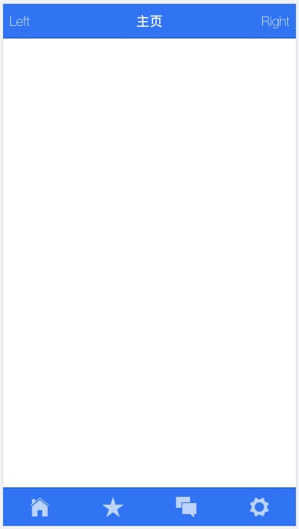
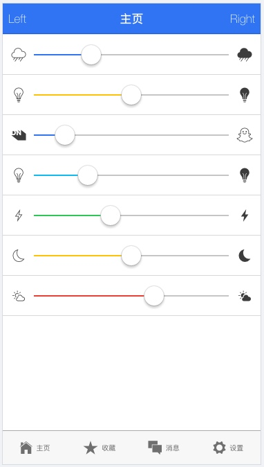

# Hybrid APP 开发（表单、输入框、选项卡、单选列表、复选列表、开关、滑块）

1. 表单
2. 输入框
3. 选项卡
4. 单选列表
5. 复选列表
6. 开关
7. 滑块

## 一、ionic 表单和输入框
list 类同样可以用于 input 元素，可以在item中通过item-input类来指定文本框。

```html
	<div class="content has-header">

		<div class="list">
			<div class="item item-input">
				名：<input type="text" placeholder="FirstName">
			</div>
			<div class="item item-input">
				姓：<input type="text" placeholder="LastName">
			</div>
			<div class="item item-input">
				介绍：<textarea placeholder="自我介绍"></textarea>
			</div>
		</div>

	</div>
```


### （1）堆叠标签
堆叠标签通常位于输入框的头部。每个选项使用 item-stacked-label 类指定。 每个输入框需要指定 input-label。

```html
	<div class="content has-header">

		<div class="list">
			<div class="item item-input item-stacked-label">
				<span class="input-label">FirstName:</span>
				<input type="text" placeholder="Bob">
			</div>
			<div class="item item-input item-stacked-label">
				<span class="input-label">LastName:</span>
				<input type="text" placeholder="Adam">
			</div>
			<div class="item item-input item-stacked-label">
				<span class="input-label">PhoneNumber:</span>
				<input type="tel" placeholder="手机号码">
			</div>
			<div class="padding">
				<button class="button button-block button-calm">注册</button>
			</div>
		</div>

	</div>
```


### （2）内嵌表单
默认情况下每个输入域宽度都是100%，但我们可以使用 list list-inset 或 card 类设置表单的内边距(padding)， card 类带有阴影。

```html
<div class="content has-header">

		<div class="list list-inset">
			<div class="item item-input item-stacked-label">
				<span class="input-label">FirstName:</span>
				<input type="text" placeholder="Bob">
			</div>
			<div class="item item-input item-stacked-label">
				<span class="input-label">LastName:</span>
				<input type="text" placeholder="Adam">
			</div>
			<div class="item item-input item-stacked-label">
				<span class="input-label">PhoneNumber:</span>
				<input type="tel" placeholder="手机号码">
			</div>
			<div class="padding">
				<button class="button button-block button-calm">注册</button>
			</div>
		</div>

	</div>
```


（3）内嵌输入域
使用 list-inset 设置内嵌列表，使用 item-input-inset 样式可以内嵌一个输入域。

```html
<!DOCTYPE html>
<html lang="en" dir="ltr" ng-app="myApp">

<head>
	<script data-ionic="inject">
		(function(w){var i=w.Ionic=w.Ionic||{};i.version='3.9.2';i.angular='5.2.11';i.staticDir='build/';})(window);
  </script>
	<meta charset="UTF-8">
	<title>Ionic App</title>
	<meta name="viewport" content="viewport-fit=cover, width=device-width, initial-scale=1.0, minimum-scale=1.0, maximum-scale=1.0, user-scalable=no">
	<meta name="format-detection" content="telephone=no">
	<meta name="msapplication-tap-highlight" content="no">

	<link rel="icon" type="image/x-icon" href="assets/icon/favicon.ico">
	<link rel="manifest" href="manifest.json">
	<meta name="theme-color" content="#4e8ef7">

	<!-- add to homescreen for ios -->
	<meta name="apple-mobile-web-app-capable" content="yes">
	<meta name="apple-mobile-web-app-status-bar-style" content="black">

	<link href="https://cdn.bootcss.com/ionic/1.3.2/css/ionic.css" rel="stylesheet">
	<script src="https://cdn.bootcss.com/ionic/1.3.2/js/ionic.bundle.min.js"></script>

	<!-- cordova.js required for cordova apps (remove if not needed) -->
	<script src="cordova.js"></script>

	<!-- un-comment this code to enable service worker
  <script>
    if ('serviceWorker' in navigator) {
      navigator.serviceWorker.register('service-worker.js')
        .then(() => console.log('service worker installed'))
        .catch(err => console.error('Error', err));
    }
  </script>-->

	<link href="build/main.css" rel="stylesheet">

</head>

<body ng-controller="MyCtrl">


	<div class="bar bar-header bar-positive">
		<button class="button button-clear">Left</button>
		<div class="title">主页</div>
		<button class="button button-clear">Right</button>
	</div>

	<div class="content has-header">

		<div class="list">
			<div class="item item-input-inset">
				<div class="item-input-wrapper">
					<input type="text" placeholder="Email">
				</div>
				<button class="button button-small">Submit</button>
			</div>
		</div>

	</div>


	<!-- The polyfills js is generated during the build process -->
	<script src="build/polyfills.js"></script>

	<!-- The vendor js is generated during the build process
       It contains all of the dependencies in node_modules -->
	<script src="build/vendor.js"></script>

	<!-- The main bundle js is generated during the build process -->
	<script src="build/main.js"></script>

	<script>
		var app = angular.module("myApp", ["ionic"]);
		app.controller("MyCtrl", function($scope) {

		});
	</script>

</body>
</html>
```


当然我们也可以在其中嵌入图标，可以在输入域前添加即可，如我们在上面的email的input前加上一个email图表，如下：

```html
<div class="content has-header">

		<div class="list">
			<div class="item item-input-inset">
				<div class="item-input-wrapper">
					<i class="icon ion-ios-email"></i>
					<input type="text" placeholder="Email">
				</div>
				<button class="button button-small">Submit</button>
			</div>
		</div>

	</div>
```


我们还可以在header中嵌入输入域，在bar-header中添加item-input-inset，如下：


```html
	<div class="bar bar-header item-input-inset">
		
		<div class="item-input-wrapper">
			<i class="icon ion-ios-search"></i>
			<input type="search" placeholder="请输入关键词">
		</div>
		<button class="button button-clear" style="color: dimgray">取消</button>

	</div>
```


## 二、tab(选项卡)
> ionic tab(选项卡) 是水平排列的按钮或者链接，用以页面间导航的切换。它可以包含文字和图标的组合，是一种移动设备上流行的导航方法，类似于iOS当中的UITabBar。我们可以使用tabs类来创建装选项卡的容器，对于其中的每个选项卡则可以使用 tab-item 类。默认情况下，选项卡是文本的，并没有图标：

```html
	<div class="bar bar-header bar-positive">
		<button class="button button-clear">Left</button>
		<h1 class="title">主页</h1>
		<button class="button button-clear">Right</button>
	</div>

	<div class="content"></div>


	<div class="tabs">
		<a class="tab-item" href="#">主页</a>
		<a class="tab-item" href="#">收藏</a>
		<a class="tab-item" href="#">消息</a>
		<a class="tab-item" href="#">设置</a>
	</div>
```


### （一）样式
以上例子中的选项卡样式为默认的，我们可以可以设置不同的选项卡样式，有：tabs-default ，tabs-light ，tabs-stable ，tabs-positive ，tabs-calm ，tabs-balanced ，tabs-energized ，tabs-assertive ，tabs-royal ，tabs-dark
如以下的tabs-calm

```html
<div class="bar bar-header bar-positive">
	<button class="button button-clear">Left</button>
	<h1 class="title">主页</h1>
	<button class="button button-clear">Right</button>
</div>

<div class="content"></div>


<div class="tabs tabs-positive">
	<a class="tab-item" href="#">主页</a>
	<a class="tab-item" href="#">收藏</a>
	<a class="tab-item" href="#">消息</a>
	<a class="tab-item" href="#">设置</a>
</div>
```


### （2）图标选项卡

我们还可以在标签页中添加图标，在tab-item中添加即可：

```html
	<div class="bar bar-header bar-positive">
		<button class="button button-clear">Left</button>
		<h1 class="title">主页</h1>
		<button class="button button-clear">Right</button>
	</div>

	<div class="content"></div>

	<div class="tabs tabs-positive">
		<a class="tab-item" href="#">
			<i class="icon ion-ios-home"></i>
		</a>
		<a class="tab-item" href="#">
			<i class="icon ion-ios-star"></i>
		</a>
		<a class="tab-item" href="#">
			<i class="icon ion-ios-chatboxes"></i>
		</a>
		<a class="tab-item" href="#">
			<i class="icon ion-ios-settings"></i>
		</a>
	</div>
```



### （3）图标文字选项卡
a、通过给选项卡容器添加tabs-icon-top类我们可以设置选项卡中内容为上下结构，图标在文字上方，如下：

```html
	<div class="bar bar-header bar-positive">
		<button class="button button-clear">Left</button>
		<h1 class="title">主页</h1>
		<button class="button button-clear">Right</button>
	</div>

	<div class="content"></div>

	<div class="tabs tabs-icon-top tabs-positive">
		<a class="tab-item" href="#">
			<i class="icon ion-ios-home"></i>
			主页
		</a>
		<a class="tab-item" href="#">
			<i class="icon ion-ios-star"></i>
			收藏
		</a>
		<a class="tab-item" href="#">
			<i class="icon ion-ios-chatboxes"></i>
			消息
		</a>
		<a class="tab-item" href="#">
			<i class="icon ion-ios-settings"></i>
			设置
		</a>
	</div>
```


b、也可以给选项卡容器添加tabs-icon-left类我们可以设置选项卡内容为左右结构，图标显示在左边，如下：


（4）选项卡位置
默认情况我们创建的选项卡在底部，如果我们需要显示在顶部，则给选项卡容器添加tabs-top类即可：

```html
	<div class="bar bar-header bar-positive">
		<button class="button button-clear">Left</button>
		<h1 class="title">主页</h1>
		<button class="button button-clear">Right</button>
	</div>

	<div class="content"></div>

	<div class="tabs tabs-icon-left tabs-positive tabs-top">
		<a class="tab-item" href="#">
			<i class="icon ion-ios-home"></i>
			主页
		</a>
		<a class="tab-item" href="#">
			<i class="icon ion-ios-star"></i>
			收藏
		</a>
		<a class="tab-item" href="#">
			<i class="icon ion-ios-chatboxes"></i>
			消息
		</a>
		<a class="tab-item" href="#">
			<i class="icon ion-ios-settings"></i>
			设置
		</a>
	</div>
```


（5）条纹样式选项卡
我们可以给选项卡容器添加 tabs-striped 来实现像 Android 风格的 tabs。

条纹选项卡颜色可通过 tabs-background-{color} 和 tabs-color-{color} 来控制， {color} 值可以是：default, light, stable, positive, calm, balanced, energized, assertive, royal, 或 dark。

如果要再选项卡上设置头部标题，则在heder中添加上has-tabs-top 类即可。

```html
	<div class="bar bar-header bar-positive">
		<button class="button button-clear">Left</button>
		<h1 class="title">主页</h1>
		<button class="button button-clear">Right</button>
	</div>

	<div class="content"></div>

	<div class="tabs tabs-icon-left tabs-striped">
		<a class="tab-item" href="#">
			<i class="icon ion-ios-home"></i>
			主页
		</a>
		<a class="tab-item" href="#">
			<i class="icon ion-ios-star"></i>
			收藏
		</a>
		<a class="tab-item" href="#">
			<i class="icon ion-ios-chatboxes"></i>
			消息
		</a>
		<a class="tab-item" href="#">
			<i class="icon ion-ios-settings"></i>
			设置
		</a>
	</div>
```


## 三、单选列表
ionic 单选按钮与标准 type="radio" 的 input元素类似。以下展示了现代app类型的单选按钮，每个 item-radio 中的 type="radio" ，input 元素的 name 属性都是：group。

```html
    <div class="bar bar-header bar-positive">
		<button class="button button-clear">Left</button>
		<h1 class="title">主页</h1>
		<button class="button button-clear">Right</button>
	</div>

	<div class="content has-header">

		<!--单选列表-->
		<ul class="list">

			<label class="item item-radio">
				<!--创建输入域-->
				<input type="radio" name="group" value="Swift" checked>
				<!--添加输入域中的内容（文本和checkmark）-->
				<div class="radio-content">
					<!--单选按钮文本内容-->
					<div class="item-content">Swift</div>
					<!--单选按钮-->
					<i class="radio-icon ion-ios-checkmark"></i>
				</div>
			</label>

			<label class="item item-radio">
				<input type="radio" name="group" value="Python" >
				<div class="radio-content">
					<div class="item-content">Python</div>
					<i class="radio-icon ion-ios-checkmark"></i>
				</div>
			</label>

			<label class="item item-radio">
				<input type="radio" name="group" value="Ruby" >
				<div class="radio-content">
					<div class="item-content">Ruby</div>
					<i class="radio-icon ion-ios-checkmark"></i>
				</div>
			</label>

			<label class="item item-radio">
				<input type="radio" name="group" value="Javascript">
				<div class="radio-content">
					<div class="item-content">Javascript</div>
					<i class="radio-icon ion-ios-checkmark"></i> 
				</div>
			</label>
		</ul>

	</div>

	<div class="tabs tabs-icon-left tabs-striped">
		<a class="tab-item" href="#">
			<i class="icon ion-ios-home"></i>
			主页
		</a>
		<a class="tab-item" href="#">
			<i class="icon ion-ios-star"></i>
			收藏
		</a>
		<a class="tab-item" href="#">
			<i class="icon ion-ios-chatboxes"></i>
			消息
		</a>
		<a class="tab-item" href="#">
			<i class="icon ion-ios-settings"></i>
			设置
		</a>
	</div>
```


## 四、复选框
我们在list中，给每个item添加 item-checkbox 类，然后在item中给`<input>`添加checkbox类即可实现复选框，如下：


```html
<div class="bar bar-header bar-positive">
	<button class="button button-clear">Left</button>
	<h1 class="title">主页</h1>
	<button class="button button-clear">Right</button>
</div>

<div class="content has-header">

	<!--复选列表-->
	<ul class="list">

		<li class="item item-checkbox">
			<!--添加复选输入域中的内容-->
			<label class="checkbox">
				<input type="checkbox">
			</label>
			Swift
		</li>

		<li class="item item-checkbox">
			<label class="checkbox">
				<input type="checkbox">
			</label>
			Python
		</li>

		<li class="item item-checkbox">
			<label class="checkbox">
				<input type="checkbox">
			</label>
			Ruby
		</li>

		<li class="item item-checkbox">
			<label class="checkbox">
				<input type="checkbox">
			</label>
			Javascript
		</li>
	</ul>

</div>

<div class="tabs tabs-icon-left tabs-striped">
	<a class="tab-item" href="#">
		<i class="icon ion-ios-home"></i>
		主页
	</a>
	<a class="tab-item" href="#">
		<i class="icon ion-ios-star"></i>
		收藏
	</a>
	<a class="tab-item" href="#">
		<i class="icon ion-ios-chatboxes"></i>
		消息
	</a>
	<a class="tab-item" href="#">
		<i class="icon ion-ios-settings"></i>
		设置
	</a>
</div>
```


如果我们将其中的label的类（checkbox）改成item-checkbox后，样式发生变化

```html
	<div class="bar bar-header bar-positive">
		<button class="button button-clear">Left</button>
		<h1 class="title">主页</h1>
		<button class="button button-clear">Right</button>
	</div>

	<div class="content has-header">

		<!--复选列表-->
		<ul class="list">

			<li class="item item-checkbox">
				<!--添加复选输入域中的内容-->
				<!--将label的类（checkbox）改成item-checkbox后，样式发生变化-->
				<label class="item-checkbox">
					<input type="checkbox">
				</label>
				Swift
			</li>

			<li class="item item-checkbox">
				<label class="item-checkbox">
					<input type="checkbox">
				</label>
				Python
			</li>

			<li class="item item-checkbox">
				<label class="item-checkbox">
					<input type="checkbox">
				</label>
				Ruby
			</li>

			<li class="item item-checkbox">
				<label class="item-checkbox">
					<input type="checkbox">
				</label>
				Javascript
			</li>
		</ul>

	</div>

	<div class="tabs tabs-icon-left tabs-striped">
		<a class="tab-item" href="#">
			<i class="icon ion-ios-home"></i>
			主页
		</a>
		<a class="tab-item" href="#">
			<i class="icon ion-ios-star"></i>
			收藏
		</a>
		<a class="tab-item" href="#">
			<i class="icon ion-ios-chatboxes"></i>
			消息
		</a>
		<a class="tab-item" href="#">
			<i class="icon ion-ios-settings"></i>
			设置
		</a>
	</div>
```


## 五、toggle（开关）

```html
	<div class="bar bar-header bar-positive">
		<button class="button button-clear">Left</button>
		<h1 class="title">主页</h1>
		<button class="button button-clear">Right</button>
	</div>

	<div class="content has-header">

		<!--按钮列表-->
		<ul class="list">
			
			<li class="item item-toggle">
				Swift
				<!--创建按钮-->
				<label class="toggle toggle-positive">
					<input type="checkbox" checked>
					<div class="track">
						<div class="handle"></div>
					</div>
				</label>
			</li>

			<li class="item item-toggle">
				Python
				<label class="toggle toggle-energized">
					<input type="checkbox" checked>
					<div class="track">
						<div class="handle"></div>
					</div>
				</label>
			</li>

			<li class="item item-toggle">
				Ruby
				<label class="toggle toggle-calm">
					<input type="checkbox" checked>
					<div class="track">
						<div class="handle"></div>
					</div>
				</label>
			</li>

			<li class="item item-toggle">
				Javascript
				<label class="toggle toggle-assertive">
					<input type="checkbox" checked>
					<div class="track">
						<div class="handle"></div>
					</div>
				</label>
				
			</li>
		</ul>

	</div>

	<div class="tabs tabs-icon-left tabs-striped">
		<a class="tab-item" href="#">
			<i class="icon ion-ios-home"></i>
			主页
		</a>
		<a class="tab-item" href="#">
			<i class="icon ion-ios-star"></i>
			收藏
		</a>
		<a class="tab-item" href="#">
			<i class="icon ion-ios-chatboxes"></i>
			消息
		</a>
		<a class="tab-item" href="#">
			<i class="icon ion-ios-settings"></i>
			设置
		</a>
	</div>
```


## 六、range（滑块）
ionic Range 是一个滑块控件，ionic 为 Range 提供了很多种默认的样式。我们可以在许多种元素里使用它比如列表或者 Card 。


```html
<!DOCTYPE html>
<html lang="en" dir="ltr" ng-app="myApp">

<head>
	<script data-ionic="inject">
		(function(w){var i=w.Ionic=w.Ionic||{};i.version='3.9.2';i.angular='5.2.11';i.staticDir='build/';})(window);
  </script>
	<meta charset="UTF-8">
	<title>Ionic App</title>
	<meta name="viewport" content="viewport-fit=cover, width=device-width, initial-scale=1.0, minimum-scale=1.0, maximum-scale=1.0, user-scalable=no">
	<meta name="format-detection" content="telephone=no">
	<meta name="msapplication-tap-highlight" content="no">

	<link rel="icon" type="image/x-icon" href="assets/icon/favicon.ico">
	<link rel="manifest" href="manifest.json">
	<meta name="theme-color" content="#4e8ef7">

	<!-- add to homescreen for ios -->
	<meta name="apple-mobile-web-app-capable" content="yes">
	<meta name="apple-mobile-web-app-status-bar-style" content="black">

	<link href="https://cdn.bootcss.com/ionic/1.3.2/css/ionic.css" rel="stylesheet">
	<script src="https://cdn.bootcss.com/ionic/1.3.2/js/ionic.bundle.min.js"></script>

	<!-- cordova.js required for cordova apps (remove if not needed) -->
	<script src="cordova.js"></script>

	<!-- un-comment this code to enable service worker
  <script>
    if ('serviceWorker' in navigator) {
      navigator.serviceWorker.register('service-worker.js')
        .then(() => console.log('service worker installed'))
        .catch(err => console.error('Error', err));
    }
  </script>-->

	<link href="build/main.css" rel="stylesheet">

</head>

<body ng-controller="MyCtrl">

	<div class="bar bar-header bar-positive">
		<button class="button button-clear">Left</button>
		<h1 class="title">主页</h1>
		<button class="button button-clear">Right</button>
	</div>

	<div class="content has-header">

		<div class="list">
			<!--创建滑块-->
			<div class="item range range-positive">
				<!--创建左边图标-->
				<i class="icon ion-ios-rainy-outline"></i>
				<!--设置中间的滑条-->
				<input type="range" name="light" min="0" max="100" value="27">
				<!--创建右边的图标-->
				<i class="icon ion-ios-rainy"></i>
			</div>

			<div class="item range range-energized">
				<i class="icon ion-ios-lightbulb-outline"></i>
				<input type="range" name="image" min="-10" max="10" value="0">
				<i class="icon ion-ios-lightbulb"></i>
			</div>
			
			<div class="item range range-positive">
				<i class="icon ion-social-github-outline"></i>
				<input type="range" name="volume" min="0" max="100" value="12">
				<i class="icon ion-social-snapchat-outline"></i>
			</div>
			
			<div class="item range range-calm">
				<i class="icon ion-ios-lightbulb-outline"></i>
				<input type="range" name="volume" min="0" max="100" value="25">
				<i class="icon ion-ios-lightbulb"></i>
			</div>
			
			<div class="item range range-balanced">
				<i class="icon ion-ios-bolt-outline"></i>
				<input type="range" name="volume" min="0" max="100" value="38">
				<i class="icon ion-ios-bolt"></i>
			</div>
			
			<div class="item range range-energized">
				<i class="icon ion-ios-moon-outline"></i>
				<input type="range" name="volume" min="0" max="100" value="50">
				<i class="icon ion-ios-moon"></i>
			</div>
			
			<div class="item range range-assertive">
				<i class="icon ion-ios-partlysunny-outline"></i>
				<input type="range" name="volume" min="0" max="100" value="63">
				<i class="icon ion-ios-partlysunny"></i>
			</div>
		</div>

	</div>

	<div class="tabs tabs-icon-left tabs-striped">
		<a class="tab-item" href="#">
			<i class="icon ion-ios-home"></i>
			主页
		</a>
		<a class="tab-item" href="#">
			<i class="icon ion-ios-star"></i>
			收藏
		</a>
		<a class="tab-item" href="#">
			<i class="icon ion-ios-chatboxes"></i>
			消息
		</a>
		<a class="tab-item" href="#">
			<i class="icon ion-ios-settings"></i>
			设置
		</a>
	</div>


	<!-- The polyfills js is generated during the build process -->
	<script src="build/polyfills.js"></script>

	<!-- The vendor js is generated during the build process
       It contains all of the dependencies in node_modules -->
	<script src="build/vendor.js"></script>

	<!-- The main bundle js is generated during the build process -->
	<script src="build/main.js"></script>

	<script>
		var app = angular.module("myApp", ["ionic"]);
		app.controller("MyCtrl", function($scope) {

		});
	</script>

</body>

</html>

```




七、select（下拉框）


```html
<div class="list">
			<div class="item item-input item-select">
				<div class="input-label">省份</div>
				<select>
					<option>江苏</option>
					<option>安徽</option>
					<option>广东</option>
				</select>
			</div>

			<div class="item item-input item-select">
				<div class="input-label">国家</div>
				<select>
					<option>中国</option>
					<option>美国</option>
					<option>英国</option>
				</select>
			</div>

		</div>
```


