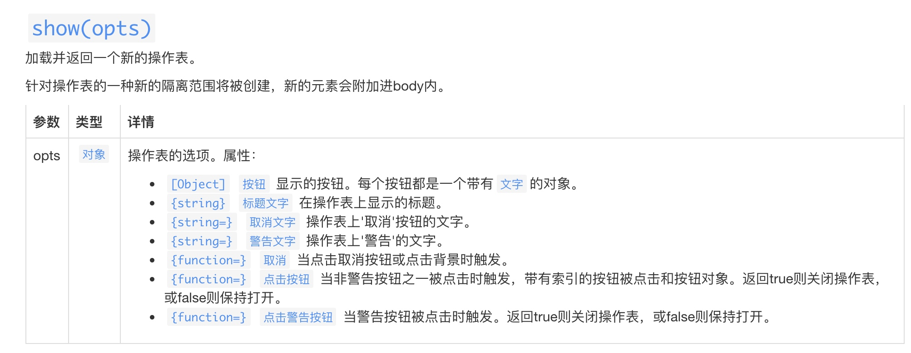
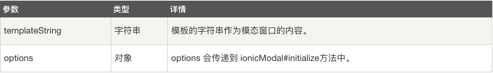
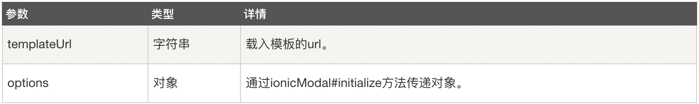

# Hybrid APP 开发（上拉菜单、遮罩层、下拉刷新、手势、模态窗）

## 一、Action Sheet（上拉菜单）
ActionSheet，上拉菜单或者称操作表，通过往上弹出的框，来让用户选择选项，我们可以通过点击取消按钮或者点击空白的地方来让它消失。在ionic中可以通过插件`$ionicActionSheet`调用show来实现。

ionic的上拉菜单由三种按钮组成，点击任何按钮都自动关闭上拉菜单：

1.    自定义按钮：用户定义的任意数量的按钮。   

2.    取消按钮：取消按钮在菜单的底部，用于关闭上拉菜单。一个上拉菜单最多有一个取消按钮。

3.    危险选项按钮：危险选项按钮文字被标红以明显提示。一个上拉菜单最多有一个 危险选项按钮。




说明：

*    titleText - 上拉菜单的标题文本
*    buttons - 自定义按钮数组。每个按钮需要一个描述对象，其text字段用于按钮显示
*    cancelText - 取消按钮的文本。如果不设置此字段，则上拉菜单中不出现取消按钮
*    destructiveText - 危险选项按钮的文本，用于删除等场景。如果不设置此字段，则上拉菜单中不出现危险选项按钮
*    buttonClicked - 自定义按钮的回调函数，当用户点击时触发
*    cancel - 取消按钮回调函数，当用户点击时触发
*    destructiveButtonClicked - 危险选项按钮的回调函数，当用户点击时触发
*    cancelOnStateChange - 当切换到新的视图时是否关闭此上拉菜单。默认为true
*    cssClass - 附加的CSS样式类名称


```html
<!DOCTYPE html>
<html>

<head>
	<meta charset="utf-8">
	<meta name="viewport" content="initial-scale=1, maximum-scale=1, user-scalable=no, width=device-width">
	<title></title>

	<link rel="manifest" href="manifest.json">

	<!-- un-comment this code to enable service worker
    <script>
      if ('serviceWorker' in navigator) {
        navigator.serviceWorker.register('service-worker.js')
          .then(() => console.log('service worker installed'))
          .catch(err => console.log('Error', err));
      }
    </script>-->

	<link href="lib/ionic/css/ionic.css" rel="stylesheet">
	<link href="css/style.css" rel="stylesheet">

	<!-- IF using Sass (run gulp sass first), then uncomment below and remove the CSS includes above
    <link href="css/ionic.app.css" rel="stylesheet">
    -->

	<!-- ionic/angularjs js -->
	<script src="lib/ionic/js/ionic.bundle.js"></script>

	<link href="https://cdn.bootcss.com/ionic/1.3.2/css/ionic.css" rel="stylesheet">
	<script src="https://cdn.bootcss.com/ionic/1.3.2/js/ionic.bundle.min.js"></script>
	<!-- cordova script (this will be a 404 during development) -->
	<script src="cordova.js"></script>

	<!-- your app's js -->
	<script src="js/app.js"></script>
	<script src="js/controllers.js"></script>
</head>

<body ng-app="starter" ng-controller="MyCtrl">
	<ion-pane>

		<ion-content>
			<button class="button button-block button-calm" ng-click="showAction()">Action Sheet</button>
			<h1>您选择的操作：</h1>
			<h3>{{msg}}</h3>
		</ion-content>

	</ion-pane>

	<ion-app></ion-app>
</body>
<script>
	var app = angular.module("starter", ["ionic"]);
	app.controller("MyCtrl", function($scope, $ionicActionSheet, $timeout) {
		$scope.msg = "无";
		$scope.showAction = function() {
			//创建sheet：通过show加载并返回一个操作表，show接收一个对象参数
			var hideSheet = $ionicActionSheet.show({
				//标题
				titleText: "注意",
				//创建两个按钮，每个按钮都是一个带有文字的对象
				buttons: [{
						text: "<b>相机</b>"
					},
					{
						text: "<b>相册</b>"
					},
					{
						text: "<b>最近照片</b>"
					}
				],
				//危险选项
				destructiveText: "Delete",
				//取消选项
				cancelText: "取消",
				//按钮事件
				buttonClicked: function(index) {
					switch (index) {
						case 0:
							$scope.msg = "相机";
							break;
						case 1:
							$scope.msg = "相册";
							break;
						case 2:
							$scope.msg = "最近照片";
							break;
						default:
							break;
					}
					//需要返回true，否则无法关闭
					return true;
				},
				//危险选项事件
				destructiveButtonClicked: function() {
					$scope.msg = "警告！！！将要删除...";
					//需要返回true，否则无法关闭
					return true
				},
				//取消事件
				cancel: function() {
					$scope.msg = "已经取消";
				}
			});
		};
	});
</script>

</html>

```

效果如下：


## 二、遮罩层

我们经常需要在 UI 上，例如在弹出框、加载框、其他弹出层中显示或隐藏遮罩层。我们可以通过ionic中的`$ionicBackdrop.retain()`来显示遮罩层，使用`$ionicBackdrop.release()`隐藏遮罩层，每次调用retain后，背景会一直显示，直到调用release消除背景层。


```html
<!DOCTYPE html>
<html>

<head>
	<meta charset="utf-8">
	<meta name="viewport" content="initial-scale=1, maximum-scale=1, user-scalable=no, width=device-width">
	<title></title>

	<link rel="manifest" href="manifest.json">

	<!-- un-comment this code to enable service worker
    <script>
      if ('serviceWorker' in navigator) {
        navigator.serviceWorker.register('service-worker.js')
          .then(() => console.log('service worker installed'))
          .catch(err => console.log('Error', err));
      }
    </script>-->

	<link href="lib/ionic/css/ionic.css" rel="stylesheet">
	<link href="css/style.css" rel="stylesheet">

	<!-- IF using Sass (run gulp sass first), then uncomment below and remove the CSS includes above
    <link href="css/ionic.app.css" rel="stylesheet">
    -->

	<!-- ionic/angularjs js -->
	<script src="lib/ionic/js/ionic.bundle.js"></script>

	<link href="https://cdn.bootcss.com/ionic/1.3.2/css/ionic.css" rel="stylesheet">
	<script src="https://cdn.bootcss.com/ionic/1.3.2/js/ionic.bundle.min.js"></script>
	<!-- cordova script (this will be a 404 during development) -->
	<script src="cordova.js"></script>

	<!-- your app's js -->
	<script src="js/app.js"></script>
</head>

<body ng-app="starter" ng-controller="MyCtrl">
	<ion-pane>

		<ion-content>
			<h3>点击开启遮罩层，2秒后自动关闭</h3>
			<button class="button button-block button-calm" ng-click="showBackdrop()">Action Sheet</button>
		</ion-content>

	</ion-pane>

	<ion-app></ion-app>
</body>

<script>
	var app = angular.module("starter", ["ionic"]);
	app.controller("MyCtrl", function($scope, $ionicBackdrop, $timeout) {
		$scope.showBackdrop = function() {
			$ionicBackdrop.retain();
			$timeout(function(){
				$ionicBackdrop.release();
			}, 2000);
		}
	});

</script>

</html>
```

效果如下图：


## 三、下拉刷新
通过添加ion-refresher元素来实现下拉刷新功能，当用户下拉刷新时，会想服务器请求数据，然后展示在界面上，如下：

```html
<!DOCTYPE html>
<html>

<head>
	<meta charset="utf-8">
	<meta name="viewport" content="initial-scale=1, maximum-scale=1, user-scalable=no, width=device-width">
	<title></title>

	<link rel="manifest" href="manifest.json">

	<!-- un-comment this code to enable service worker
    <script>
      if ('serviceWorker' in navigator) {
        navigator.serviceWorker.register('service-worker.js')
          .then(() => console.log('service worker installed'))
          .catch(err => console.log('Error', err));
      }
    </script>-->

	<link href="lib/ionic/css/ionic.css" rel="stylesheet">
	<link href="css/style.css" rel="stylesheet">

	<!-- IF using Sass (run gulp sass first), then uncomment below and remove the CSS includes above
    <link href="css/ionic.app.css" rel="stylesheet">
    -->

	<!-- ionic/angularjs js -->
	<script src="lib/ionic/js/ionic.bundle.js"></script>

	<link href="https://cdn.bootcss.com/ionic/1.3.2/css/ionic.css" rel="stylesheet">
	<script src="https://cdn.bootcss.com/ionic/1.3.2/js/ionic.bundle.min.js"></script>
	<!-- cordova script (this will be a 404 during development) -->
	<script src="cordova.js"></script>

	<!-- your app's js -->
	<script src="js/app.js"></script>
</head>

<body ng-app="starter" ng-controller="MyCtrl">

	<ion-header-bar>
		<h3 class="title">请下拉刷新</h3>
	</ion-header-bar>
	<ion-content>
		<ion-refresher pulling-text="下拉刷新" on-refresh="refresh()"></ion-refresher>
		<ion-list ng-hide="isHidden" ng-repeat="p in persons">
			<ion-item>Name：{{p.name}}，Age：{{p.age}}</ion-item>
		</ion-list>
	</ion-content>


	<ion-app></ion-app>
</body>

<script>
	var app = angular.module("starter", ["ionic"]);
	app.controller("MyCtrl", function($scope, $http) {
		//未加载时将列表隐藏
		$scope.isHidden = true;
		$scope.refresh = function() {
			//开始加载时显示列表
			$scope.isHidden = false;
			//通过$http服务进行get请求
			$http.get("http://127.0.0.1:8080/PracticeIonicApp/getPersons.php")
				//请求成功后的回调方法
				.success(function(results) {
					$scope.persons = results;
				})
				//数据请求成功后回调方法
				.finally(function() {
					//通过广播服务，通过刷新控件已经刷新完成，关闭控件
					$scope.$broadcast("scroll.refreshComplete");
				});
		};
	});
</script>

</html>
```

服务器文件getPersons.php，如下：


```php
<?php
	$persons = [array("name"=>"Tim", "age"=>10), 
				array("name"=>"Ben", "age"=>21), 
				array("name"=>"Jhon", "age"=>30), 
				array("name"=>"Terry", "age"=>32)];
	
	#解决Access-Control-Allow-Origin 站点跨域请求的问题
	header('content-type:application:json;charset=utf8');  
	header('Access-Control-Allow-Origin:*');  
	header('Access-Control-Allow-Methods:POST');  
	header('Access-Control-Allow-Headers:x-requested-with,content-type'); 

	echo json_encode($persons);
?>
```
效果如下：


## 四、手势
### （一）on-hold(长按)
长按的时间是500毫秒。

### （二）on-tap（轻击）
这个是手势轻击事件，时间不可超过250毫秒，如果长按时间超过250毫秒，那就不是轻击了。

### （三）on-double-tap（双击）
双击屏幕事件

### （四）on-touch（触摸）
 用户点击立马执行，不用等待 touchend/mouseup，与on-tap 有区别的，这个是立即执行。
 
### （五）on-release（结束触摸）
当用户结束触摸事件时触发。
### （六）on-drag（拖拽）
点击并且手开始移动时触发。类似的还有on-drag-up、on-drag-down、on-drag-left、on-drag-right事件，当手开始向上、下、左、右方向拖动时触发。
### （七）on-swipe（手指滑动）
手指在滑动时触发。类似的还有on-swipe-up、on-swipe-down、on-swipe-left、on-swipe-right事件，当手开始向上、下、左、右方向滑动时触发。


```html
<!DOCTYPE html>
<html>

<head>
	<meta charset="utf-8">
	<meta name="viewport" content="initial-scale=1, maximum-scale=1, user-scalable=no, width=device-width">
	<title></title>

	<link rel="manifest" href="manifest.json">

	<!-- un-comment this code to enable service worker
    <script>
      if ('serviceWorker' in navigator) {
        navigator.serviceWorker.register('service-worker.js')
          .then(() => console.log('service worker installed'))
          .catch(err => console.log('Error', err));
      }
    </script>-->

	<link href="lib/ionic/css/ionic.css" rel="stylesheet">
	<link href="css/style.css" rel="stylesheet">

	<!-- IF using Sass (run gulp sass first), then uncomment below and remove the CSS includes above
    <link href="css/ionic.app.css" rel="stylesheet">
    -->

	<!-- ionic/angularjs js -->
	<script src="lib/ionic/js/ionic.bundle.js"></script>

	<link href="https://cdn.bootcss.com/ionic/1.3.2/css/ionic.css" rel="stylesheet">
	<script src="https://cdn.bootcss.com/ionic/1.3.2/js/ionic.bundle.min.js"></script>
	<!-- cordova script (this will be a 404 during development) -->
	<script src="cordova.js"></script>

	<!-- your app's js -->
	<script src="js/app.js"></script>
</head>

<body ng-app="starter" ng-controller="MyCtrl">
	<ion-pane>

		<ion-content>
			<button class="button button-block button-positive" on-hold="onholdFun()">长按</button>
			<button class="button button-block button-energized" on-tap="ontapFun()">轻击</button>
			<button class="button button-block button-calm" on-double-tap="ondbtapFun()">双击</button>
			<button class="button button-block button-assertive" on-touch="ontouchFun()" on-release="onreleaseFun()">触摸</button>
			<button class="button button-block button-balanced" on-drag="ondragFun()">拖拽</button>
			<button class="button button-block button-stable" on-swipe="onswipeFun()">手指滑动</button>
			<h3>这是您选择的手势：</h3>
			<h4>{{gesture}}</h4>
		</ion-content>

	</ion-pane>

	<ion-app></ion-app>
</body>

<script>
	var app = angular.module("starter", ["ionic"]);
	app.controller("MyCtrl", function($scope, $window) {
		$scope.gesture = "无";
		$scope.onholdFun = function(){
			$window.alert("这是长按手势");
			$scope.gesture = "on-hold";
		};
		$scope.ontapFun = function(){
			$window.alert("这是轻击手势");
			$scope.gesture = "on-tap";
		};
		$scope.ondbtapFun = function(){
			$window.alert("这是双击手势");
			$scope.gesture = "on-double-tap";
		};
		$scope.onreleaseFun = function(){
			$window.alert("这是触摸手势");
			$scope.gesture = "on-touch";
		};
		$scope.ontouchFun = function(){
			$window.alert("结束触摸了");
			$scope.gesture = "on-release";
		};
		$scope.ondragFun = function(){
			$window.alert("这是拖拽事件");
			$scope.gesture = "on-drag";
		};
		$scope.onswipeFun = function(){
			$window.alert("这是手指滑动事件");
			$scope.gesture = "on-swipe";
		};
	});

</script>

</html>

```


## 五、模态窗口
模态窗可以通过$ionicModal服务来实例化，会遮住用户主界面，用户想要对对话框以外的应用程序进行操作时，必须首先对该对话框进行响应。

```html
<!DOCTYPE html>
<html>

<head>
	<meta charset="utf-8">
	<meta name="viewport" content="initial-scale=1, maximum-scale=1, user-scalable=no, width=device-width">
	<title></title>

	<link rel="manifest" href="manifest.json">

	<!-- un-comment this code to enable service worker
    <script>
      if ('serviceWorker' in navigator) {
        navigator.serviceWorker.register('service-worker.js')
          .then(() => console.log('service worker installed'))
          .catch(err => console.log('Error', err));
      }
    </script>-->

	<link href="lib/ionic/css/ionic.css" rel="stylesheet">
	<link href="css/style.css" rel="stylesheet">

	<!-- IF using Sass (run gulp sass first), then uncomment below and remove the CSS includes above
    <link href="css/ionic.app.css" rel="stylesheet">
    -->

	<!-- ionic/angularjs js -->
	<script src="lib/ionic/js/ionic.bundle.js"></script>

	<link href="https://cdn.bootcss.com/ionic/1.3.2/css/ionic.css" rel="stylesheet">
	<script src="https://cdn.bootcss.com/ionic/1.3.2/js/ionic.bundle.min.js"></script>
	<!-- cordova script (this will be a 404 during development) -->
	<script src="cordova.js"></script>

	<!-- your app's js -->
	<script src="js/app.js"></script>
</head>

<body ng-app="starter" ng-controller="MyCtrl">

	<ion-header-bar>
		<h3 class="title">这是A页面</h3>
	</ion-header-bar>

	<ion-content>
		<button class="button button-block button-calm" ng-click="openModal()">弹出模态窗</button>
	</ion-content>

	<ion-app></ion-app>
</body>

<!--创建模态窗-->
<script id="myModal.html" type="text/ng-template">
	<!--创建模态窗容器-->
	<ion-modal-view>
		<!--添加内容-->
		<ion-header-bar>
			<h3 class="title">模态窗口</h3>
		</ion-header-bar>
		
		<ion-tontent>
			<div class="list card">
				<div class="item item-image">
					
				</div>
			</div>
			<button class="button button-block  button-energized" ng-click="closeModal()">点击关闭</button>
		</ion-tontent>
	</ion-modal-view>
</script>

<script>
	var app = angular.module("starter", ["ionic"]);
	app.controller("MyCtrl", function($scope, $ionicModal) {

		$ionicModal.fromTemplateUrl("myModal.html", {
				scope: $scope,
				ainmation: "slide-in-up"
			})
			.then(function(newModal) {
				$scope.modal = newModal;
			});

		//弹出模态窗
		$scope.openModal = function() {
			$scope.modal.show();
			console.log("模态窗是否显示：" + $scope.modal.isShown());
		}

		//关闭模态窗
		$scope.closeModal = function() {
			$scope.modal.hide();
			console.log("模态窗是否显示：" + $scope.modal.isShown());
		}


		//在我们使用完模态窗后，需要对它们进行清除
		$scope.$on("$destory", function() {
			$scope.modal.remove();
		})

		//在模态窗被隐藏时执行的操作
		$scope.$on("modal.hidden", function() {
			console.log("模态窗被隐藏了...");
		})

		//在模态窗被移除时执行的操作
		$scope.$on("modal.removed", function() {
			console.log("模态窗被移除了...");
		})

	});
</script>

</html>

```

如下效果：


其中涉及到的几个方法：

1、**fromTemplate(templateString, options)**，返回值为一个ionicModal控制器的实例。


2、**fromTemplateUrl(templateUrl, options)**，返回值为promise对象，Promises对象是CommonJS工作组提出的一种规范，目的是为异步编程提供统一接口


3、**show()**显示模态窗口实例

返回值: promise对象，在模态窗口完成动画后得到解析。

4、**hide()**隐藏模态窗口

返回值:promise对象，在模态窗口完成动画后得到解析。

5、**remove()**从 DOM 中移除模态窗口实例并清理

返回值: promise对象在模态窗口完成动画后得到解析。需要注意的是如果通过remove()方法移除模态窗口后，就无法在再次通过show()显示模态窗口，因为已经不存在了，需要重新初始化才可以使用。

6、**isShown()**用于判断模态窗口是否显示

返回：布尔值。

练习案例：

```html
<!DOCTYPE html>
<html>

<head>
	<meta charset="utf-8">
	<meta name="viewport" content="initial-scale=1, maximum-scale=1, user-scalable=no, width=device-width">
	<title></title>

	<link rel="manifest" href="manifest.json">

	<!-- un-comment this code to enable service worker
    <script>
      if ('serviceWorker' in navigator) {
        navigator.serviceWorker.register('service-worker.js')
          .then(() => console.log('service worker installed'))
          .catch(err => console.log('Error', err));
      }
    </script>-->

	<link href="lib/ionic/css/ionic.css" rel="stylesheet">
	<link href="css/style.css" rel="stylesheet">

	<!-- IF using Sass (run gulp sass first), then uncomment below and remove the CSS includes above
    <link href="css/ionic.app.css" rel="stylesheet">
    -->

	<!-- ionic/angularjs js -->
	<script src="lib/ionic/js/ionic.bundle.js"></script>

	<link href="https://cdn.bootcss.com/ionic/1.3.2/css/ionic.css" rel="stylesheet">
	<script src="https://cdn.bootcss.com/ionic/1.3.2/js/ionic.bundle.min.js"></script>
	<!-- cordova script (this will be a 404 during development) -->
	<script src="cordova.js"></script>

	<!-- your app's js -->
	<script src="js/app.js"></script>
</head>

<body ng-app="starter" ng-controller="MyCtrl">
	<ion-header-bar class="bar-positive">
		<h3 class="title">Contacts</h3>
		<button class="button button-clear button-primary" ng-click="contactModal.show()">
			<i class="icon ion-ios-compose-outline"></i>
		</button>
	</ion-header-bar>

	<ion-content class="has-header">
		<ion-list>
			<ion-item ng-repeat="contact in contacts">
				{{contact.name}}
			</ion-item>
		</ion-list>
	</ion-content>

</body>


<script id="templates/modal.html" type="text/ng-template">
	<ion-modal-view>
		<ion-header-bar class="bar-positive">
			<h3 class="title">New Contact</h3>
			<button class="button button-clear button-primary" ng-click="contactModal.hide()">Cancel</button>
		</ion-header-bar>
		
		<ion-content class="padding">
			<div class="list">
				<label class="item item-input item-stacked-label">
					<span class="input-label">First Name</span>
					<input type="text" ng-model="newContact.firstName" placeholder="Adam">
				</label>
				<label class="item item-input item-stacked-label">
					<span class="input-label">Last Name</span>
					<input type="text" ng-model="newContact.lastName" placeholder="Brand">
				</label>
				<label class="item item-input item-stacked-label">
					<span class="input-label">Email</span>
					<input type="text" ng-model="newContact.email" placeholder="example@live.cn">
				</label>
				<button class="button button-block button-positive" ng-click="createContact(newContact)">Create</button>
			</div>
		</ion-content>
	</ion-modal-view>
</script>


<script>
	var app = angular.module("starter", ["ionic"]);

	app.controller("MyCtrl", function($scope, $ionicModal) {

		$scope.contacts = [{
			name: "Noah Adman",
			email: "12345@live.cn"
		}, {
			name: "Richard Mille",
			email: "23456@live.cn"
		}, {
			name: "Barney Calhoun",
			email: "34567@live.cn"
		}, {
			name: "Lamar Headcrab",
			email: "45678@live.cn"
		}];

		$ionicModal.fromTemplateUrl("templates/modal.html", {
				scope: $scope,
				animation: "slide-in-up"
			})
			.then(function(AddContactModal) {
				$scope.contactModal = AddContactModal;
			});
	
		$scope.createContact = function(contact) {

			$scope.contacts.push({
				name: (contact.firstName + " " + contact.lastName),
				email: contact.email
			})
			
			$scope.contactModal.hide();
		}
	});
</script>

</html>

```


