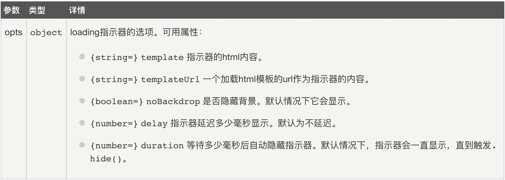

# 四、复选框


```html
<!DOCTYPE html>
<html>

<head>
	<meta charset="utf-8">
	<meta name="viewport" content="initial-scale=1, maximum-scale=1, user-scalable=no, width=device-width">
	<title></title>
	<link href="https://cdn.bootcss.com/ionic/1.3.2/css/ionic.css" rel="stylesheet">
	<script src="https://cdn.bootcss.com/ionic/1.3.2/js/ionic.bundle.min.js"></script>
</head>

<body ng-app="ionicApp" ng-controller="ionicCtrl">
	<ion-header-bar class="bar-calm">
		<h3 class="title">会员列表</h3>
	</ion-header-bar>
	
	<ion-content>
		<div class="list">
			<ion-checkbox ng-repeat="user in users" ng-model="user.isMember" ng-checked="user.isMember">
				{{user.name}}
			</ion-checkbox>
			<div class="item">
				<!--将result以json的格式输出到页面-->
				<pre ng-bind="result | json"></pre>
			</div>
		</div>
	</ion-content>
	
	<script>
		var app = angular.module('ionicApp', ['ionic']);
		app.controller('ionicCtrl', function($scope) {
			$scope.result = [];
			$scope.users = [{
				name: "Annie",
				isMember: true
			}, {
				name: "Marlly",
				isMember: false
			}, {
				name: "Molly",
				isMember: false
			}, {
				name: "Seth",
				isMember: true
			}, {
				name: "Vincent",
				isMember: false
			}, {
				name: "Franke",
				isMember: false
			}]

			//监听users，一旦users发生变化，则会调用第二个函数参数，该函数会遍历数组
			$scope.$watch("users",function(newValue, oldValue){
				
				$scope.result = []
				for(index in $scope.users){
					//判断isMember是否为true
					if(newValue[index].isMember){
						$scope.result.push(newValue[index])
					}
				}
				console.log($scope.result)
			}, true)
		});

	</script>
</body>

</html>
```

## 五、单选框


```html
<html>
    <head>
        <meta charset="utf-8">
        <meta name="viewport" content="initial-scale=1, maximum-scale=1, user-scalable=no, width=device-width">
        <title>单选框</title>
        <link href="https://cdn.bootcss.com/ionic/1.3.2/css/ionic.css" rel="stylesheet">
        <script src="https://cdn.bootcss.com/ionic/1.3.2/js/ionic.bundle.min.js"></script>
    </head>
    <body  ng-app="ionicApp" ng-controller="ionicCtrl">
    
    <ion-content>
    	
    		<div class="list">
    			<div class="item item-divider">
    				被选中的值为：{{msg.content}}
    			</div>
    			<ion-radio ng-repeat="item in subjects" ng-value="item.value" ng-model="msg.content">
    				{{item.text}}
    			</ion-radio>
    		</div>	
    		
    </ion-content>
 	<script>
 		var app = angular.module('ionicApp', ['ionic']);
 		app.controller('ionicCtrl', function($scope){
 			$scope.subjects = [
	 			{"text": "移动互联", "value": "iOS"},
	 			{"text": "前端", "value": "Web"},
	 			{"text": "Java", "value": "Java"}
 			];
 			$scope.msg = {
 				content: '空'
 			};
 		});
 	</script>
  </body>
</html>
```

## 六、toggle开关


```html
<html ng-app="ionicApp">
  <head>
    <meta charset="utf-8">
    <meta name="viewport" content="initial-scale=1, maximum-scale=1, user-scalable=no, width=device-width">
    
    <title>Toggle</title>
    <link href="https://cdn.bootcss.com/ionic/1.3.2/css/ionic.css" rel="stylesheet">
    <script src="https://cdn.bootcss.com/ionic/1.3.2/js/ionic.bundle.min.js"></script>
    <script type="text/javascript">
    angular.module('ionicApp', ['ionic'])

    .controller('MainCtrl', function($scope) {

      $scope.settingsList = [
        { text: "Wireless", checked: true },
        { text: "GPS", checked: false },
        { text: "Bluetooth", checked: false }
      ];
    });
    </script>
   
	</head>

	<body ng-controller="MainCtrl">
    
   		<ion-header-bar class="bar-positive">
      		<h1 class="title">切换开关</h1>
   		</ion-header-bar>
             
    		<ion-content>
      
      		<div class="list">
        
        			<div class="item item-divider"> 
        				Settings
		        </div>
        
        			<ion-toggle ng-repeat="item in settingsList"
                    			ng-model="item.checked" 
                    			ng-checked="item.checked">
          		{{ item.text }}
        			</ion-toggle>
        
        	<div class="item">
			<pre ng-bind="settingsList | json"></pre> 
		</div>    
        
      </div>
      
    </ion-content>
    
  </body>
</html>
```
## 一、ionic 头部和底部
### （1）ion-header-bar
这个是固定在屏幕顶部的一个头部标题栏，如果给它加上'bar-subheader' 这个样式，则它就是副标题。

```html
<!DOCTYPE html>
<html>
  <head>
    <meta charset="utf-8">
    <meta name="viewport" content="initial-scale=1, maximum-scale=1, user-scalable=no, width=device-width">
    <title>手势</title>
    <link href="https://cdn.bootcss.com/ionic/1.3.2/css/ionic.css" rel="stylesheet">
    <script src="https://cdn.bootcss.com/ionic/1.3.2/js/ionic.bundle.min.js"></script>
    <script type="text/javascript">
    angular.module('myApp', ['ionic'])
    .controller( 'myCtrl',['$scope',function($scope){

        $scope.doSomething = function(){
            alert('Left Button');
        }
    }])
    </script>
  </head>
    <body ng-app="myApp" ng-controller="myCtrl" >
       <ion-header-bar align-title="left" class="bar-positive">
		  <div class="buttons">
		    <button class="button" ng-click="doSomething()">Left Button</button>
		  </div>
		  <h1 class="title">Title!</h1>
		  <div class="buttons">
		    <button class="button">Right Button</button>
		  </div>
		</ion-header-bar>
		<ion-content>
		  Some content!
		</ion-content>
    </body>
</html>
```

其中，
**align-title**：用来对齐 title 的，如果没有设置，它将会按照手机的默认排版(Ios的默认是居中，Android默认是居左)。它的值可以是 'left','center','right'。

**no-tap-scroll**：默认情况下，头部标题栏在点击屏幕时内容会滚动到头部，可以将 no-tap-scroll 设置为 true 来禁止该动作，它的值是布尔值（true/false）。

### （2）ion-footer-bar
 ion-footer-bar与ion-header-bar类似，只是在屏幕的底部。
 
```html
<ion-footer-bar align-title="left" class="bar-assertive">
    <div class="buttons">
        <button class="button">Left Button</button>
    </div>
    <h1 class="title">Title!</h1>
    <div class="buttons" ng-click="doSomething()">
        <button class="button">Right Button</button>
    </div>
</ion-footer-bar>
```

同样的也可以通过align-title来设置标题的对齐方式。

## 二、ionic列表操作
列表是一个应用广泛在几乎所有移动app中的界面元素，在ionic中也有对应的列表元素`ion-List`。通过`ion-List` 和 `ion-item` 这两个指令还支持多种多样的交互模式，比如移除其中的某一项，拖动重新排序，滑动编辑等等。

```html
<!DOCTYPE html>
<html>
  <head>
    <meta charset="utf-8">
    <meta name="viewport" content="initial-scale=1, maximum-scale=1, user-scalable=no, width=device-width">
    <title>ionic列表</title>
    <link href="https://cdn.bootcss.com/ionic/1.3.2/css/ionic.css" rel="stylesheet">
    <script src="https://cdn.bootcss.com/ionic/1.3.2/js/ionic.bundle.min.js"></script>
    <script type="text/javascript">
    angular.module('myApp', ['ionic'])
    .controller( 'myCtrl',['$scope',function($scope){
		$scope.items = ["Ben","Sean","Tim","Franco"];
    }])
    </script>
  </head>
    <body ng-app="myApp" ng-controller="myCtrl" >
		<ion-list>
		  <ion-item ng-repeat="item in items">
		    Hello, {{item}}!
		  </ion-item>
		</ion-list>
    </body>
</html>
```

删除列表项，调整项目位置

```html
<html ng-app="ionicApp">
  <head>
    <meta charset="utf-8">
    <meta name="viewport" content="width=device-width, initial-scale=1, maximum-scale=1, user-scalable=no">
    <title>Ionic List Directive</title>
   
    <link href="https://cdn.bootcss.com/ionic/1.3.2/css/ionic.css" rel="stylesheet">
    <script src="https://cdn.bootcss.com/ionic/1.3.2/js/ionic.bundle.min.js"></script>
    <script>
    angular.module('ionicApp', ['ionic'])

	.controller('MyCtrl', function($scope) {
	  
	  $scope.data = {
	    showDelete: false
	  };
	  //调整元素位置
	  $scope.moveItem = function(item, fromIndex, toIndex) {
	    $scope.items.splice(fromIndex, 1);
	    $scope.items.splice(toIndex, 0, item);
	  };
  	  //删除元素
	  $scope.onItemDelete = function(item) {
	    $scope.items.splice($scope.items.indexOf(item), 1);
	  };
	  
	  $scope.items = [
	    { id: 0 },
	    { id: 1 },
	    { id: 2 },
	    { id: 3 },
	    { id: 4 },
	    { id: 5 },
	    { id: 6 },
	    { id: 7 },
	    { id: 8 },
	    { id: 9 },
	    { id: 10 },
	    { id: 11 },
	    { id: 12 },
	    { id: 13 },
	    { id: 14 },
	    { id: 15 },
	    { id: 16 },
	    { id: 17 },
	    { id: 18 },
	    { id: 19 },
	    { id: 20 },
	    { id: 21 },
	    { id: 22 },
	    { id: 23 },
	    { id: 24 },
	    { id: 25 },
	    { id: 26 },
	    { id: 27 },
	    { id: 28 },
	    { id: 29 },
	    { id: 30 },
	    { id: 31 },
	    { id: 32 },
	    { id: 33 },
	    { id: 34 },
	    { id: 35 },
	    { id: 36 },
	    { id: 37 },
	    { id: 38 },
	    { id: 39 },
	    { id: 40 },
	    { id: 41 },
	    { id: 42 },
	    { id: 43 },
	    { id: 44 },
	    { id: 45 },
	    { id: 46 },
	    { id: 47 },
	    { id: 48 },
	    { id: 49 },
	    { id: 50 }
	  ];
	  
	});
    </script>

  </head>

  <body ng-controller="MyCtrl">
    
    <ion-header-bar class="bar-positive">
      <div class="buttons">
        <button class="button button-icon icon ion-ios-minus-outline"
          ng-click="data.showDelete = !data.showDelete; data.showReorder = false"></button>
      </div>
      <h1 class="title">Delete/Option Buttons</h1>
      <div class="buttons">
        <button class="button" ng-click="data.showDelete = false; data.showReorder = !data.showReorder">
            Reorder
        </button>
      </div>
    </ion-header-bar>

    <ion-content>

      <ion-list show-delete="data.showDelete" show-reorder="data.showReorder">

        <ion-item ng-repeat="item in items" 
                  item="item"
                  href="#/item/{{item.id}}" class="item-remove-animate">
          Item {{ item.id }}
          <ion-delete-button class="ion-minus-circled" ng-click="onItemDelete(item)">
          </ion-delete-button>
          <ion-reorder-button class="ion-navicon" on-reorder="moveItem(item, $fromIndex, $toIndex)">
          	
          </ion-reorder-button>
        </ion-item>

      </ion-list>

    </ion-content>
      
  </body>
</html>

```
以上代码中，
**show-delete**：为bool类型，可设置列表项的删除按钮当前是显示还是隐藏。；
**show-reorder**：为bool类型，可设置列表项的排序按钮当前是显示还是隐藏。

## 三、ionic 加载动作
$ionicLoading 是 ionic 默认的一个加载交互效果。可以通过show方法来显示加载动作；通过hide方法来隐藏动作：

```html
<!DOCTYPE html>
<html>
  <head>
    <meta charset="utf-8">
    <meta name="viewport" content="initial-scale=1, maximum-scale=1, user-scalable=no, width=device-width"> 
    
    <title>加载动作</title>

	<link href="https://cdn.bootcss.com/ionic/1.3.2/css/ionic.css" rel="stylesheet">
	<script src="https://cdn.bootcss.com/ionic/1.3.2/js/ionic.bundle.min.js"></script>
	<script>
	angular.module('ionicApp', ['ionic'])
	.controller('AppCtrl', function($scope, $timeout, $ionicLoading) {

	  $ionicLoading.show({
	    content: 'Loading',
	    animation: 'fade-in',
	    showBackdrop: true,
	    maxWidth: 200,
	    showDelay: 0
	  });

	  $timeout(function () {
	    $ionicLoading.hide();
	  }, 2000);
	  
	});
	</script>
  </head>
  <body ng-app="ionicApp" ng-controller="AppCtrl">
      
  </body>
</html>
```

其中，show(opts)方法有以下参数：



