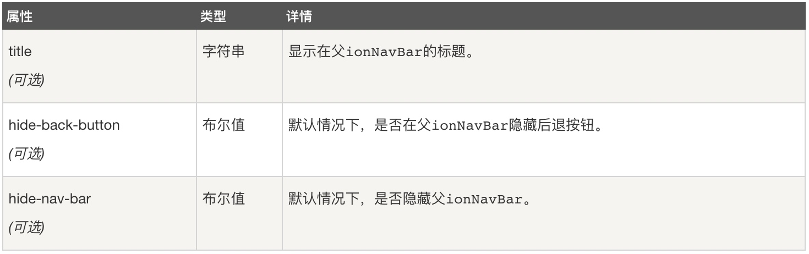
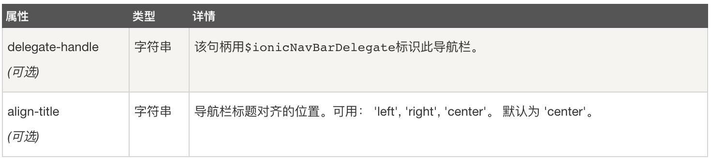
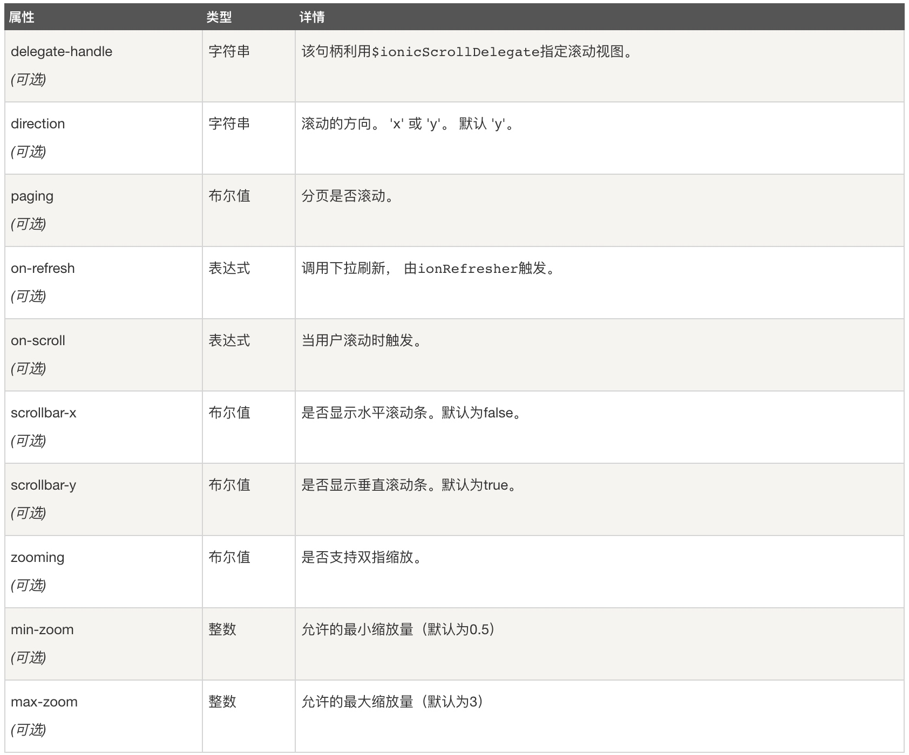
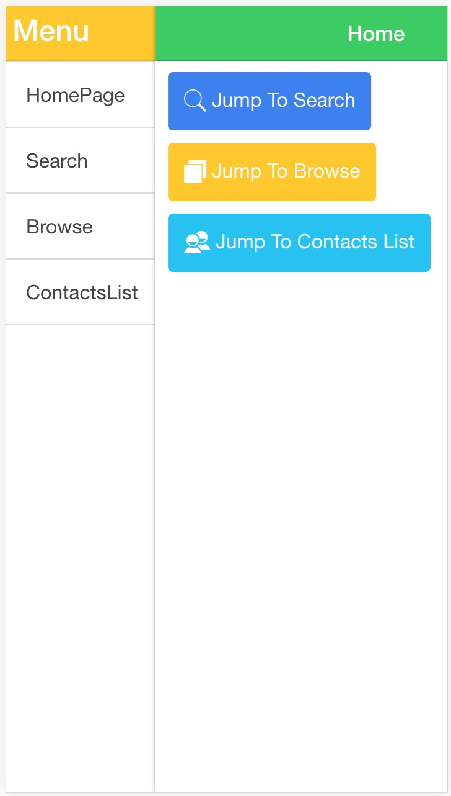

# Hybrid APP 开发（导航、对话框、滚动视图、侧栏菜单）
## 一、ionic 导航
### （一）ion-nav-view

当用户在app中浏览时，ionic能够检测到浏览历史。通过检测浏览历史，实现向左或向右滑动时可以正确转换视图，采用AngularUI路由器模块等应用程序接口可以分为不同的$state(状态)。Angular的核心为路由服务，url可以用来控制视图。AngularUI路由提供了一个更强大的状态管理，即状态可以被命名，嵌套， 以及合并视图，允许一个以上模板呈现在同一个页面。此外，每个状态无需绑定到一个URL，并且数据可以更灵活地推送到每个状态。

**用法**

在我们的标签中，使用ionNavView顶层指令来实现，当我们通过导航堆栈导航时，就会用ionNavBar指令更新。我们可以选择ion-nav-view作为顶层指令，会显示一个页眉栏，然后在状态发生改变时我们用 ion-nav-bar 指令通过导航更新。

我们在使用过程中，可以在navView的动画属性上应用任何动画类来给它添加页面动画：


```html
<ion-nav-bar></ion-nav-bar>
<ion-nav-view animation="slide-left-right">
  <!-- 中间内容 -->
</ion-nav-view>
```
> Tips：
> 有以下几种动画效果：
> 'slide-left-right', 'slide-left-right-ios7', 'slide-in-up'

**案例**

```html
<!DOCTYPE html>
<html ng-app="ionicApp">
  <head>
	<meta charset="utf-8">
	<meta name="viewport" content="initial-scale=1, maximum-scale=1, user-scalable=no, width=device-width">

	<title>ionic 导航</title>
	<link href="https://cdn.bootcss.com/ionic/1.3.2/css/ionic.css" rel="stylesheet">
	<script src="https://cdn.bootcss.com/ionic/1.3.2/js/ionic.bundle.min.js"></script>
	<script type="text/javascript">
		angular.module('ionicApp', ['ionic'])

			.config(function($stateProvider, $urlRouterProvider) {
            //app启动时，$stateProvider就会检查url，检查它的索引匹配状态，然后尝试将templates/tabs.html加载到<ion-nav-view>内
				$stateProvider
					.state('tabs', {
						url: "/tab",
						//abstract：true,将这个界面设置为母版界面，即这是一个页面框架，所有的子界面都有这个统一的界面。
						abstract: true,
						templateUrl: "templates/tabs.html"
					})
					//tabs.home这里的点语法和js中的点语法类似，可以理解为对象的属性，这里表示一种从属关系，home从属于tabs
					.state('tabs.home', {
						url: "/home",
						//views，可以简单理解为用来定义视图详情。格式是views:{name:{parms}}
						views: {
							//home-tab，这个是视图名字，与视图中的name属性相对应，这个视图是在name=“home-tab”的这个tab的视图里面绘制的
							'home-tab': {
								templateUrl: "templates/home.html",
								controller: 'HomeTabCtrl'
							}
						}
					})
					.state('tabs.facts', {
						url: "/facts",
						views: {
							'home-tab': {
								templateUrl: "templates/facts.html"
							}
						}
					})
					.state('tabs.facts2', {
						url: "/facts2",
						views: {
							'home-tab': {
								templateUrl: "templates/facts2.html"
							}
						}
					})
					.state('tabs.about', {
						url: "/about",
						views: {
							'about-tab': {
								templateUrl: "templates/about.html"
							}
						}
					})
					.state('tabs.navstack', {
						url: "/navstack",
						views: {
							'about-tab': {
								templateUrl: "templates/nav-stack.html"
							}
						}
					})
					.state('tabs.contact', {
						url: "/contact",
						views: {
							'contact-tab': {
								templateUrl: "templates/contact.html"
							}
						}
					});


				$urlRouterProvider.otherwise("/tab/home");

			})

			.controller('HomeTabCtrl', function($scope) {
				console.log('HomeTabCtrl');
			});
	</script>
</head>

<body>

	<!--导航栏，位于页面顶部-->
	<ion-nav-bar class="bar-calm">
		<ion-nav-back-button>
		</ion-nav-back-button>
	</ion-nav-bar>

	<!--导航的顶层指令-->
	<ion-nav-view></ion-nav-view>


	<!--首页，包含底部的tabbar-->
	<!--为什么使用script？因为可以缓存模板，加载速度非常快，不必从网络上再获取。-->
	<script id="templates/tabs.html" type="text/ng-template">
		<ion-tabs class="tabs-icon-top tabs-positive">

		<!--这是Home标签，所对应的是home.html页面-->
        <ion-tab title="Home" icon="ion-home" href="#/tab/home">
          <ion-nav-view name="home-tab"></ion-nav-view>
        </ion-tab>

		<!--这是About标签，所对应的是about.html页面-->
        <ion-tab title="About" icon="ion-ios-information" href="#/tab/about">
          <ion-nav-view name="about-tab"></ion-nav-view>
        </ion-tab>

		<!--这是Contact标签，所对应的是contact.html页面-->
        <ion-tab title="Contact" icon="ion-ios-world" ui-sref="tabs.contact">
          <ion-nav-view name="contact-tab"></ion-nav-view>
        </ion-tab>

      </ion-tabs>
    </script>

	<script id="templates/home.html" type="text/ng-template">
		<ion-view view-title="Home">
        <ion-content class="padding">
          <p>
            <a class="button icon icon-right ion-chevron-right" href="#/tab/facts">Scientific Facts</a>
          </p>
        </ion-content>
      </ion-view>
    </script>

	<script id="templates/facts.html" type="text/ng-template">
		<ion-view view-title="Facts">
        <ion-content class="padding">
          <p>Banging your head against a wall uses 150 calories an hour.</p>
          <p>Dogs have four toes on their hind feet, and five on their front feet.</p>
          <p>The ant can lift 50 times its own weight, can pull 30 times its own weight and always falls over on its right side when intoxicated.</p>
          <p>A cockroach will live nine days without it's head, before it starves to death.</p>
          <p>Polar bears are left handed.</p>
          <p>
            <a class="button icon ion-home" href="#/tab/home"> Home</a>
            <a class="button icon icon-right ion-chevron-right" href="#/tab/facts2">More Facts</a>
          </p>
        </ion-content>
      </ion-view>
    </script>

	<script id="templates/facts2.html" type="text/ng-template">
		<ion-view view-title="Also Factual">
        <ion-content class="padding">
          <p>111,111,111 x 111,111,111 = 12,345,678,987,654,321</p>
          <p>1 in every 4 Americans has appeared on T.V.</p>
          <p>11% of the world is left-handed.</p>
          <p>1 in 8 Americans has worked at a McDonalds restaurant.</p>
          <p>$283,200 is the absolute highest amount of money you can win on Jeopardy.</p>
          <p>101 Dalmatians, Peter Pan, Lady and the Tramp, and Mulan are the only Disney cartoons where both parents are present and don't die throughout the movie.</p>
          <p>
            <a class="button icon ion-home" href="#/tab/home"> Home</a>
            <a class="button icon ion-chevron-left" href="#/tab/facts"> Scientific Facts</a>
          </p>
        </ion-content>
      </ion-view>
    </script>

	<script id="templates/about.html" type="text/ng-template">
		<ion-view view-title="About">
        <ion-content class="padding">
          <h3>Create hybrid mobile apps with the web technologies you love.</h3>
          <p>Free and open source, Ionic offers a library of mobile-optimized HTML, CSS and JS components for building highly interactive apps.</p>
          <p>Built with Sass and optimized for AngularJS.</p>
          <p>
            <a class="button icon icon-right ion-chevron-right" href="#/tab/navstack">Tabs Nav Stack</a>
          </p>
        </ion-content>
      </ion-view>
    </script>

	<script id="templates/nav-stack.html" type="text/ng-template">
		<ion-view view-title="Tab Nav Stack">
        <ion-content class="padding">
          <p></p>
        </ion-content>
      </ion-view>
    </script>

	<script id="templates/contact.html" type="text/ng-template">
		<ion-view title="Contact">
        <ion-content>
          <div class="list">
            <div class="item">
              @IonicFramework
            </div>
            <div class="item">
              @DriftyTeam
            </div>
          </div>
        </ion-content>
      </ion-view>
    </script>

</body>
</html>
```
1、缓存

常规情况下，视图都被缓存了能提升性能。当跳出视图时，他的元素被保留在Dom中，并且它的作用域也从`$watch`中移除。当我们跳到一个已经被缓存了的视图，视图会被激活，它的作用域被重新连接上，Dom中也保存了他的元素，这也允许保持以前的视图滚动位置。
缓存也可以通过很多方式来开启和关闭的。默认Ionic将最大缓存页面数为10个，并且这并不是唯一可以定制的，应用程序可以显式状态来设置视图应不应该被缓存。

a、全局禁用缓存
`$ionicConfigProvider` 可以用于设置最大允许缓存的视图数量，通过设置为0来禁用所有缓存。

```JavaScript
$ionicConfigProvider.views.maxCache(0);
```
我们也可以通过stateProvider来禁用缓存，只需要在参数中，将cache的值设置成false即可：

```JavaScript
$stateProvider.state('myState', {
   cache: false,
   url : '/myUrl',
   templateUrl : 'my-template.html'
})
```

### （2）ion-view
它是一个内容的容器，用于展示视图或导航栏信息：

```html
<ion-nav-bar></ion-nav-bar>
<ion-nav-view class="slide-left-right">
  <ion-view title="我的页面">
    <ion-content>
      你好!
    </ion-content>
  </ion-view>
</ion-nav-view>
```
相关属性：


### （3）ion-nav-bar
创建一个顶部导航栏，当程序状态改变时更新：

```html
<body ng-app="starter">
  <!-- 当我们浏览时，导航栏会随之更新。 -->
  <ion-nav-bar class="bar-positive nav-title-slide-ios7">
  </ion-nav-bar>

  <!-- 初始化时渲染视图模板 -->
  <ion-nav-view></ion-nav-view>
</body>
```

相关属性：


### （4）ion-nav-back-button
在一个ionNavBar中创建一个后退按钮，当用户在当前导航能够后退时，将显示后退按钮。

```html
<ion-nav-bar>
  <ion-nav-back-button class="button-clear">
    <i class="ion-arrow-left-c"></i> 后退
  </ion-nav-back-button>
</ion-nav-bar>
```
### （5）ion-nav-title
ion-nav-title 用于设置 ion-view 模板中的标题：

```html
<ion-nav-bar>
</ion-nav-bar>
<ion-nav-view>
  <ion-view>
		<ion-nav-title>
		  <i class="icon ion-ios-home"></i>
		</ion-nav-title>
    <ion-content>
      Some super content here!
    </ion-content>
  </ion-view>
</ion-nav-view>
```
### （6）$ionicHistory
$ionicHistory 用于跟踪用户在 app 内的浏览记录。

**方法：**

`viewHistory()`：用于查看历史记录。

`currentView()`：app 的当前视图。

`currentHistoryId()` ：历史堆栈的 ID，是当前视图的父类容器。
`currentTitle([val])`：获取或设置当前视图的标题。

`backView()`：返回上次浏览的视图。

`backTitle()`：获取上次浏览的视图的标题。

`forwardView()`：返回历史堆栈中当前视图的上一个视图。

`currentStateName()`：返回当前状态名。

`goBack([backCount])`：app 回退视图，如果回退的视图存在。

## 二、ionic 对话框
ionic 对话框服务允许程序创建、显示弹出窗口。我们可以通过$ionicPopup来实现，提供了3个方法：`alert()`, `show()`,以及 `confirm()` 。

**如下案例**

```html
<!DOCTYPE html>
<html>
  <head>
	<meta charset="utf-8">
	<meta name="viewport" content="initial-scale=1, maximum-scale=1, user-scalable=no, width=device-width">

	<title>ionic 导航</title>
	<link href="https://cdn.bootcss.com/ionic/1.3.2/css/ionic.css" rel="stylesheet">
	<script src="https://cdn.bootcss.com/ionic/1.3.2/js/ionic.bundle.min.js"></script>
	<script type="text/javascript">
		angular.module("ionicApp", ["ionic"])
			.controller("PopupCtrl", function($scope, $ionicPopup) {

				// 自定义弹窗 (show()函数)
				$scope.showPopup = function() {
					$scope.account = {};
					var popup = $ionicPopup.show({
						template: "<input type='password' ng-model='account.pwd'>",
						title: "请输入密码",
						subTitle: "6-12位数字字母密码",
						scope: $scope,
						buttons: [{
							text: "取消"
						}, {
							text: "<b>确认</b>",
							type: "button-calm",
							onTap: function(e) {
								if (!$scope.account.pwd) {
									// 必须要输入密码，否则不允许用户关闭对话框
									e.preventDefault();
								} else {
									return $scope.account.pwd;
								}
							}
						}]
					});

					//res为onTap绑定的方法中return的值
					popup.then(function(res) {
						console.log("Tapped", res);
					})
				};

				//confirm对话框（confirm()函数）
				$scope.showConfirm = function() {
					var confirm = $ionicPopup.confirm({
						title: "是否打开相机？",
						template: "此APP试图打开您的相机，是否允许次APP使用相机？"
					});
					confirm.then(function(res) {
						if (res) {
							console.log(res + "：允许");
						} else {
							console.log(res + "：不允许");
						}
					});
				};
			
				//警告框（alert()函数）
				$scope.showAlert = function() {
					var alert = $ionicPopup.alert({
						title: "电池电量警告",
						template: "电池电量过低，请立即冲电！🔋"
					});
					alert.then(function(res){
						console.log(res);
					})
				}

			});
	</script>
</head>

<body ng-app="ionicApp">

	<ion-content ng-Controller="PopupCtrl">
		<p><button class="button button-balanced" ng-click="showPopup()">弹窗</button></p>
		<p><button class="button button-energized" ng-click="showConfirm()">确认对话框</button></p>
		<p><button class="button button-assertive" ng-click="showAlert()">警告框</button></p>
		<h4>{{account.pwd}}</h4>
	</ion-content>
	<script id="template.html" type="text/ng-template">
		<input ng-model="account.pwd" type="text" placeholder="Password">
    </script>
</body>
</html>
```
## 三、滚动视图

在ionic中，通过ion-scroll 可以创建一个滚动视图容器。

**使用步骤**

1. 创建通过ion-scroll创建滚动视窗；
2. 创建内容区域，添加显示的内容

**属性**



```html
<!DOCTYPE html>
<html>

<head>
	<meta charset="utf-8">
	<meta name="viewport" content="initial-scale=1, maximum-scale=1, user-scalable=no, width=device-width">

	<title>ionic 导航</title>
	<link href="https://cdn.bootcss.com/ionic/1.3.2/css/ionic.css" rel="stylesheet">
	<script src="https://cdn.bootcss.com/ionic/1.3.2/js/ionic.bundle.min.js"></script>
	<style type="text/css">
		body {
          cursor: pointer;
        }
	</style>
</head>

<body ng-app="ionicApp">

	<ion-header-bar class="bar-calm">
		<h1 class="title">滚动视图</h1>
	</ion-header-bar>
	
	<ion-content class="has-header" ng-controller="scrollCtrl">
		<ion-scroll zooming="true" direction="xy" style="width: 640px; height: 400px">
			<div style="width: 1280px; height: 800px; background: url(assets/imgs/fullout3.jpg);"></div>
		</ion-scroll>
	</ion-content>
	
	<script type="text/javascript">
		var app = angular.module("ionicApp", ["ionic"]);
		app.controller("scrollCtrl", function($scope){
			
		})
	</script>
</body>

</html>

```


## 四、ionic 侧栏菜单
ionic侧栏菜单是一个容器元素，包含侧了边菜单区域和主要内容区域。通过把主要内容区域从一边拖动到另一边，来让左侧或右侧的侧栏菜单进行切换。
我们可以通过添加一个父元素`<ion-side-menus>`，添加一个中间内容 `<ion-side-menu-content>`，添加一个或更多 `<ion-side-menu>`元素开实现。


```html
<!DOCTYPE html>
<html>

<head>
	<meta charset="utf-8">
	<meta name="viewport" content="initial-scale=1, maximum-scale=1, user-scalable=no, width=device-width">

	<title>ionic 导航</title>
	<link href="https://cdn.bootcss.com/ionic/1.3.2/css/ionic.css" rel="stylesheet">
	<script src="https://cdn.bootcss.com/ionic/1.3.2/js/ionic.bundle.min.js"></script>

</head>

<body ng-app="ionicApp">

	<!--前提：添加导航顶层命令，用来在app中渲染模版的。当我们通过导航堆栈导航时，也要通过ionNavBar指令来更新-->
	<ion-nav-view></ion-nav-view>
	<!--框架页面-->
	<script id="templates/menu.html" type="text/ng-template">

		<ion-side-menus>

			<!--添加左边的内容区域-->
			<ion-side-menu side="left">
				<!--导航条-->
				<div class="bar bar-calm">
					<h3><span style="color: white">Menu</span></h3>
				</div>
				<!--左侧菜单项-->
				<ion-content class="has-header">
					<ion-list>
						<!--
						nav-clear：将会导致给定的元素禁止下一个视图的转换。主要用在侧栏菜单内的链接，点击该链接将禁用视图间正常进行的任何动画。
						nav-clear：关闭当前打开的侧栏菜单，点击这个链接会自动关闭当前打开的菜单
						-->
						<ion-item nav-clear menu-close href="#/menu">HomePage</ion-item>
						<ion-item nav-clear menu-close href="#/menu/search">Search</ion-item>
						<ion-item nav-clear menu-close href="#/menu/browse">Browse</ion-item>
						<ion-item nav-clear menu-close href="#/menu/contactslists">ContactsList</ion-item>
					</ion-list>
				</ion-content>

			</ion-side-menu>

			<!--添加中间的内容区域-->
			<ion-side-menu-content>
				<!--导航条-->
				<ion-nav-bar class="bar-balanced">
					<!--定制返回按钮-->
					<ion-nav-back-button class="button-icon"><i class="icon ion-ios-arrow-back"></i>Back</ion-nav-back-button>
				</ion-nav-bar>
				<!--此区域用来显示其他模版中的内容-->
				<ion-nav-view name="menuContent" animation="slide-left-right"></ion-nav-view>

			</ion-side-menu-content>

		</ion-side-menus>

	</script>

	<!--以下是模版页面-->

	<!--home页面-->
	<script id="templates/home.html" type="text/ng-template">
		<ion-view title="Home">
			<ion-content class="padding">
				<p><a class="button button-positive icon ion-ios-search" href="#/menu/search"> Jump To Search</a></p>
				<p><a class="button button-energized icon ion-ios-browsers" href="#/menu/browse"> Jump To Browse</a></p>
				<p><a class="button button-calm icon ion-android-contacts" href="#/menu/contactslists"> Jump To Contacts List</a></p>
			</ion-content>
      	</ion-view>
    </script>

	<!--search页面-->
	<script id="templates/search.html" type="text/ng-template">
		<ion-view title="Search">
			<ion-content>
			  <div class="list">
				<div class="item item-input-inset">
					<div class="item-input-wrapper">
						<input type="search" placeholder="例如：iFlysse">
					</div>
					<button class="button button-clear"><span style="color: darkgray">取消</span></button>
				</div>
			  </div>
			</ion-content>
		</ion-view>
    </script>

	<!--browse页面-->
	<script id="templates/browse.html" type="text/ng-template">
		<ion-view title="Browse">
			<ion-content>
			  <div class="list card">
				<div class="item">
					<div>
						这是一个Browse页面
					</div>
				</div>
			  </div>
			</ion-content>
		</ion-view>
    </script>

	<!--contactslists列表页面-->
	<script id="templates/contactslists.html" type="text/ng-template">
		<ion-view title="Contacts List">
			<ion-content class="padding">
			  <ion-list>
				<ion-item ng-repeat="p in persons">
					{{p.name}}
				</ion-item>
			  </ion-list>
			</ion-content>
    	</ion-view>
    </script>


	<script type="text/javascript">
		var app = angular.module("ionicApp", ["ionic"]);
		app.config(function($stateProvider, $urlRouterProvider) {
			$stateProvider
				.state("menu", {
					url: "/menu",
					abstract: true,
					templateUrl: "templates/menu.html",
					controller: "MenuCtrl"
				})
				.state("menu.home", {
					url: "/home",
					views: {
						"menuContent": {
							templateUrl: "templates/home.html",
							controller: "HomeCtrl"
						}
					}
				})
				.state("menu.search", {
					url: "/search",
					views: {
						"menuContent": {
							templateUrl: "templates/search.html",
							controller: "SrarchCtrl"
						}
					}
				})
				.state("menu.browse", {
					url: "/browse",
					views: {
						"menuContent": {
							templateUrl: "templates/browse.html",
							controller: "BrowseCtrl"
						}
					}
				})
				.state("menu.contactslists", {
					url: "/contactslists",
					views: {
						"menuContent": {
							templateUrl: "templates/contactslists.html",
							controller: "CListsCtrl"
						}
					}
				})

			$urlRouterProvider.otherwise("/menu/home");
		})

		app.controller("MenuCtrl", function($scope) {

		})

		app.controller("HomeCtrl", function($scope) {

		})

		app.controller("SrarchCtrl", function($scope) {

		})

		app.controller("BrowseCtrl", function($scope) {

		})

		app.controller("CListsCtrl", function($scope) {

			$scope.persons = [{
				name: "Ben Franke"
			}, {
				name: "Jimi Hen"
			}, {
				name: "Chris Maitin"
			}, {
				name: "Pink Martini"
			}]
		})
	</script>
</body>
</html>
```




