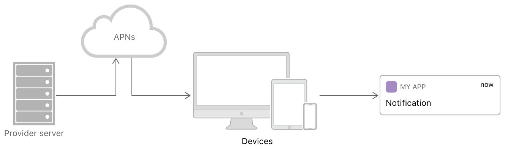
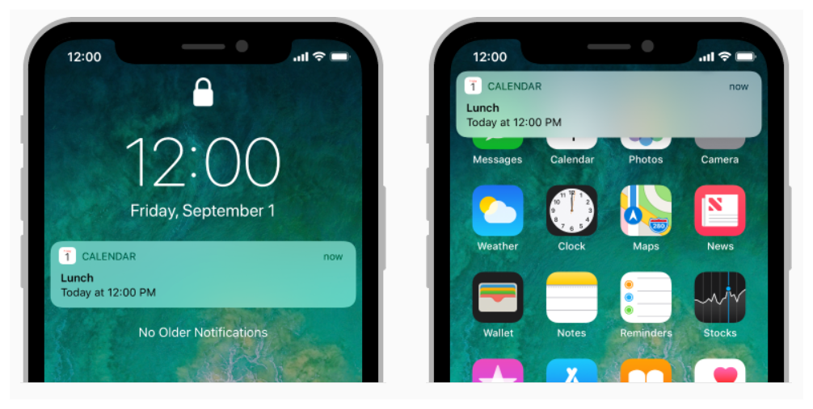
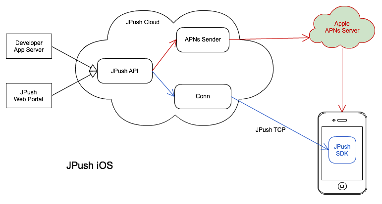
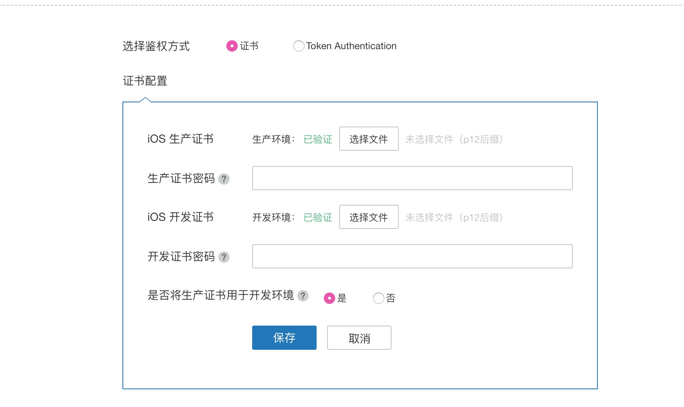
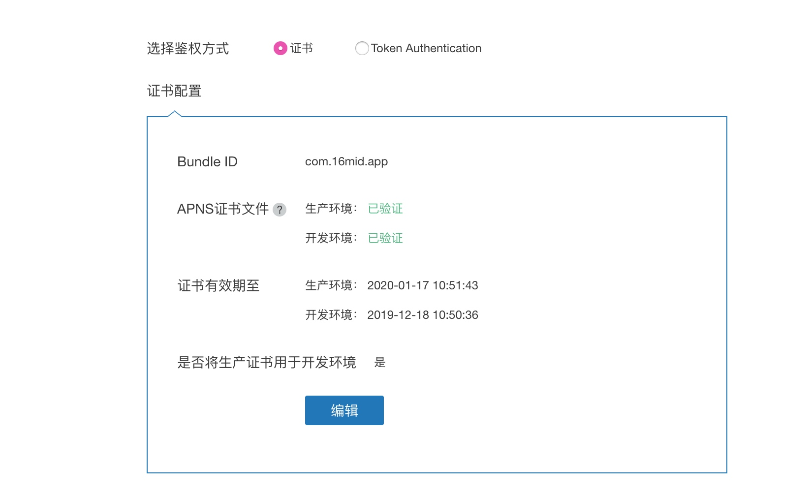
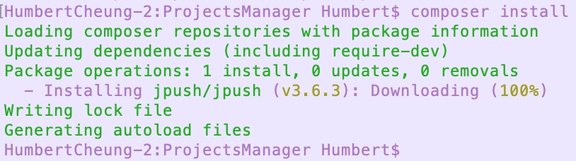

# 拓展知识（JSON解析、消息推送）

## JSON解析

在很多情况下，我们在接受到服务器返回的数据格式为JSON格式的，无法直接使用，需要将数据转化成我们iOS中的数据类型后才可以使用，对于简单的数据类型比如我们可以直接用指定类型的字典或数组来进行解析，如下：

```
{"code":"10001","message":"success","content":"id134334"}
```
以上的格式可以使用`<String: String>`类型的字典来解析，但是如果是稍微复杂的类型，则无法直接用明确的类型来解析了，如下：

```
{   
    "code":"10001",
    "message":"success",
    "content":[
        {"sno":"1003",
        "sname":"Lucy",
        "ssex":"0",
        "scourses":[
            {"cno":"1","cname":"\u8f6f\u4ef6\u5de5\u7a0b"},
            {"cno":"2","cname":"\u8ba1\u7b97\u673a\u7ec4\u6210\u539f\u7406"},
            {"cno":"3","cname":"\u9762\u5411\u5bf9\u8c61\u7a0b\u5e8f\u8bbe\u8ba1"},
            {"cno":"4","cname":"C\u8bed\u8a00"}
        ]}
]}
```
则就无法直接用明确的类型来解析了，虽然可以使用`<String: AnyObject>`来解析，但是每次都需要针对特定的数据来写解析的代码，比较麻烦。因此我们需要有一个简单的解析工具，能够帮助我们比较便捷的将数据解析出来。目前比较流行的swift解析工具，推荐使用**SwiftyJSON**

### SwiftJSON

SwiftyJSON是个使用Swift语言编写的开源库，可以让我们很方便地处理JSON数据（解析数据、生成数据）。
[Github地址](https://github.com/SwiftyJSON/SwiftyJSON)

Cocoapods安装指令：

```
platform :ios, '8.0'
use_frameworks!

target 'MyApp' do
    pod 'SwiftyJSON', '~> 4.0'
end
```

#### 使用流程

**1. 通过JSON（SwiftyJSON特有的类型）的构造函数，将我们的数据转化成JSON类型；**

**2. 通过对应的索引（数组）或者key（字典）从转化好的JSON数据中将想要的信息取出来。**

> **Tips：**
> 不过，对于第二个流程，我们通常会利用反射机制来解析，即设计一个模型类，然后通过模型来获取

仍然以下面的JOSN字符串为例，假设我们取回的信息保存在jsonData中，内容如下：

```
{   
    "code":"10001",
    "message":"success",
    "content":[
        {"sno":"1003",
        "sname":"Lucy",
        "ssex":"0",
        "scourses":[
            {"cno":"1","cname":"\u8f6f\u4ef6\u5de5\u7a0b"},
            {"cno":"2","cname":"\u8ba1\u7b97\u673a\u7ec4\u6210\u539f\u7406"},
            {"cno":"3","cname":"\u9762\u5411\u5bf9\u8c61\u7a0b\u5e8f\u8bbe\u8ba1"},
            {"cno":"4","cname":"C\u8bed\u8a00"}
        ]}
]}
```

假设我我们要取回code中的信息，那么我们如何解析？


```swift
//1、通过构造方法将数据转化成JSON格式
let dicJson = try? JSON(data: (jsonData as! Data), options: .allowFragments)

//2、然后从dicJson中用key将数据取出来，获取的过程中需要对类型进行转化，
//此处的code是不可选的String类型，所以用stringValue转化，其他类型则使用 xxxValue 这样的属性获取值
let code = dicJson["code"].stringValue
```

又如下案例：


```
[
    {
        "name": "hangge", 
        "age": 100, 
        "phones": [
            {
                "name": "公司", 
                "number": "123456"
            }, 
            {
                "name": "家庭", 
                "number": "001"
            }
        ]
    },
    {
        "name": "big boss", 
        "age": 1, 
        "phones": [
            {
                "name": "公司", 
                "number": "111111"
            }
        ]
    }
]
```
如果我们要获取第一个联系人的第一个电话号码，使用SwiftyJSON获取：

```swift
let json = JSON(data: jsonData)
if let number = json[0]["phones"][0]["number"].string {
    // 找到电话号码
    print("第一个联系人的第一个电话号码：",number)
}
```

详细的使用方式参照案例：**ImagePicker（SwiftyJSON）**版本。


## 极光推送

### 了解APNs

在 iOS 平台上，大部分应用是不允许在后台运行并连接网络的。在应用没有被运行的时候，只能通过 Apple Push Notification Service (APNs) 把数据发送到终端用户。对于互联网应用，正确高效的使用 APNs 显然非常重要。
APNs 通知：是指通过向 Apple APNs 服务器发送通知，到达 iOS 设备，由 iOS 系统提供展现的推送。用户可以通过 IOS 系统的 “设置” >> “通知” 进行设置，开启或者关闭某一个 App 的推送能力。

iOS消息推送的工作机制如下图：



Provider是指某个iPhone软件的Push服务器，APNS是Apple Push Notification Service的缩写，是苹果的服务器。

在iOS中，推送主要分为三个阶段：

**第一阶段：应用程序把要发送的消息、目的iPhone的标识打包，发给APNS。** 

**第二阶段：APNS在自身的已注册Push服务的iPhone列表中，查找有相应标识的iPhone，并把消息发送到iPhone。**

**第三阶段：iPhone把发来的消息传递给相应的应用程序，并且按照设定弹出Push通知。**


简单的说APNs的整个过程如下：

> 1、应用程序注册消息推送。

> 2、iOS从APNS Server获取device token，应用程序接收device token。

> 3、应用程序将device token发送给PUSH服务端程序。

> 4、服务端程序向APNS服务发送消息。

> 5、APNS服务将消息发送给含有特定device token的iPhone应用程序。



所以我们如果要实现APNs推送，首先需要拥有Provider server，我们可以自己部署应用服务器向 APNs Server 推送，或者使用第三方的推送服务器。目前，我们使用JPush iOS推送，主要有以下几个好处：

* 减少开发及维护成本：
应用开发者不需要去开发维护自己的推送服务器与 APNs 对接。
集成了 JPush iOS SDK 后不必自己维护更新 device token。
通过 JPush 的 Web Portal 直接推送，也可以调用 JPush 的 HTTP 协议 API 来完成，开发工作量大大减少。
* 减少运营成本：
极光推送支持一次推送，同时向 Android, iOS, WinPhone 三个平台。支持统一的 API 与推送界面。
极光推送提供标签、别名绑定机制，以及提供了非常细分的用户分群方式，运营起来非常简单、直观。
* 提供应用内推送：
除了使得 APNs 推送更简单，也另外提供应用内消息推送。这在类似于聊天的场景里很有必要。

### 极光推送
通过极光可以将消息发送至各个移动平台的系统通知，还可以在控制台编辑多种富文本展示模板； 极光还提供自定义消息的透传，客户端接到消息内容后根据自己的逻辑自由处理。

#### 极光推送机制



可以看出JPush iOS SDK 不负责 APNs 通知的展现，只是向 JPush 服务器端上传 Device Token 信息，JPush 服务器端代理开发者向 Apple APNs 推送通知。

**认识两种通知：**

1、 APNs 通知

即 Push Notification，是指通过向 Apple APNs 服务器发送通知，到达 iOS 设备，由 iOS 系统提供展现的推送。在手机的通知栏（状态栏）上会显示的一条通知信息。 通知主要用来达到提示用户的目的，应用于新闻内容、促销活动、产品信息、版本更新提醒、订单状态提醒等多种场景。

2、 应用内消息。

应用内消息：JPush iOS SDK 提供的应用内消息功能，在 App 在前台时能够收到推送下来的消息。App 可使用此功能来做消息下发动作。
此消息不经过 APNs 服务器，完全由 JPush 提供功能支持。


所以，我们使用极光推送的推送服务。Swift配置[参考Demo](https://github.com/jpush/jpush-swift-demo)

配置证书


配置完成



可以参考：http://www.hangge.com/blog/cache/detail_1268.html

在成功导入JPushSKD后，需要在移动端的AppDelegate.h文件中进行相应的配置：

**AppDelegate.h**

```swift

import UIKit

@UIApplicationMain
class AppDelegate: UIResponder, UIApplicationDelegate, JPUSHRegisterDelegate{

    var window: UIWindow?

    func application(_ application: UIApplication, didFinishLaunchingWithOptions launchOptions: [UIApplication.LaunchOptionsKey: Any]?) -> Bool {
        //步骤一：注册JPUSHService服务
        if #available(iOS 10, *) {
            let entity = JPUSHRegisterEntity()
            //通知类型（这里将声音、消息、提醒角标都给加上）
            entity.types = NSInteger(UNAuthorizationOptions.alert.rawValue) |
                NSInteger(UNAuthorizationOptions.sound.rawValue) |
                NSInteger(UNAuthorizationOptions.badge.rawValue)
            JPUSHService.register(forRemoteNotificationConfig: entity, delegate: self)

        } else {
            // ios 8 以前 categories 必须为nil
            JPUSHService.register(
                forRemoteNotificationTypes: UIRemoteNotificationType.badge.rawValue |
                    UIRemoteNotificationType.sound.rawValue |
                    UIRemoteNotificationType.alert.rawValue,
                categories: nil)
        }
        
        //步骤二：启动JPUSHService
        JPUSHService.setup(withOption: launchOptions, appKey: "becba16b656ebb4ab23d1206",
                           channel: "Publish Channel", apsForProduction: false)
        
        return true
    }
    
    func application(_ application: UIApplication, didRegisterForRemoteNotificationsWithDeviceToken deviceToken: Data) {
        //步骤三：注册 DeviceToken
        JPUSHService.registerDeviceToken(deviceToken)
    }
    
    func application(_ application: UIApplication, didFailToRegisterForRemoteNotificationsWithError error: Error) {
        //可选
        NSLog("Did Fail To Register For Remote Notifications With Error: \(error)")
    }
    
    //步骤四：程序在后台运行接收到通知后，点击通知时执行的方法
    func jpushNotificationCenter(_ center: UNUserNotificationCenter!, didReceive response: UNNotificationResponse!, withCompletionHandler completionHandler: (() -> Void)!) {

        let userInfo = response.notification.request.content.userInfo
        print("UserInfo: \(userInfo)")
        let request = response.notification.request // 收到推送的请求
        let content = request.content // 收到推送的消息内容
    
        let badge = content.badge // 推送消息的角标
        let body = content.body   // 推送消息体
        let sound = content.sound // 推送消息的声音
        let subtitle = content.subtitle // 推送消息的副标题
        let title = content.title // 推送消息的标题
        print("content: \(content)")
        print("---------Body: \(String(describing: body))" )
        
        UIApplication.shared.applicationIconBadgeNumber = (badge as? Int) ?? 0

    }
    
    //步骤五：程序在前台运行时，即程序处于活跃状态时接收到通知后执行的方法
    func jpushNotificationCenter(_ center: UNUserNotificationCenter!, willPresent notification: UNNotification!, withCompletionHandler completionHandler: ((Int) -> Void)!) {
        
        let userInfo = notification.request.content.userInfo
        print("UserInfo: \(userInfo)")
        let request = notification.request // 收到推送的请求
        let content = request.content // 收到推送的消息内容
        
        let badge = content.badge // 推送消息的角标
        let body = content.body   // 推送消息内容
        let sound = content.sound // 推送消息的声音
        let subtitle = content.subtitle // 推送消息的副标题
        let title = content.title // 推送消息的标题
        print("content: \(content)")
        
        UIApplication.shared.applicationIconBadgeNumber = (badge as? Int) ?? 0
        
        showAlert(msg: body) {
            print("---------Title: \(String(describing: body))" )
        }
    }

    func applicationDidEnterBackground(_ application: UIApplication) {
        //App进入后台后将badge设置成0
        JPUSHService.setBadge(0)
        application.applicationIconBadgeNumber = 0
    }

    func applicationDidBecomeActive(_ application: UIApplication) {
    }

    func applicationWillTerminate(_ application: UIApplication) {
    }
    
    //弹出框提示
    func showAlert(msg: String, handler action: @escaping () -> Void) {
        let alert = UIAlertController(title: "新消息", message: msg, preferredStyle: .alert)
        let sureAction = UIAlertAction(title: "OK", style: .default) { (alertAction) in
            action()
        }
        alert.addAction(sureAction)
        window?.rootViewController?.present(alert, animated: true, completion: nil)
    }
}
```

#### php服务端配置

在使用服务端时需要下载极光的PHP端开发包，可以通过Composer来下载安装。不过需要先安装Composer，通过Homebrew安装。

##### 导入开发包

1、更新Homebrew 。安装之前需要确保Homebrew是最新版本，如果不是版本，则先卸载旧版本终端命令如下：

```
/usr/bin/ruby -e "$(curl -fsSL https://raw.githubusercontent.com/Homebrew/install/master/uninstall)"
```
卸载后安装最新版本，通过如下命令：

```
/usr/bin/ruby -e "$(curl -fsSL https://raw.githubusercontent.com/Homebrew/install/master/install)"
```

2、安装Composer。通过一下命令即可安装：

```
brew install composer
```

3、成功安装后，我们在我们的**项目目录中**创建composer.json文件，然后在文件中输入下载安装包的语句（注意，语句格式必须是json格式），语句如下：

```json
{
	"require": {
   	 "jpush/jpush": "^3.5"
	}	
}
```

4、然后在终端中**进入此目录**，执行命名：

```
composer install
```




5、安装成功后会在项目中生成一些文件，其中我们需要使用的开发包在vendor文件夹中。


##### 使用

1、配置并初始化推送对象：


```php
//引入依赖文件autoload.php
require_once("vendor/autoload.php");
//配置key和secret
$app_key = "becba16b656ebb4ab23d1206";
$master_secret = "b140c1a7153446170da8cb48";
	
//初始化推送客户端
$client = new \JPush\Client($app_key, $master_secret);
```

2、推送消息

```php
//推送
$pusher = $client->push();
$pusher->setPlatform($platform);
$pusher->addAllAudience();
$pusher->iosNotification($msg, [
	'sound' => 'sound',
	'badge' => '+1',
	'extras' => [
		'key' => 'value'
	]
]);
//异常处理
try {
	//发送通知
	$response = $pusher ->send();
} catch (\JPush\Exceptions\JPushException $e) {
	// try something else here
	print $e;
}
echo json_encode($response);
```

完整案例请参考案例demo：**JPushApp(极光推送：补充服务器版).zip**


