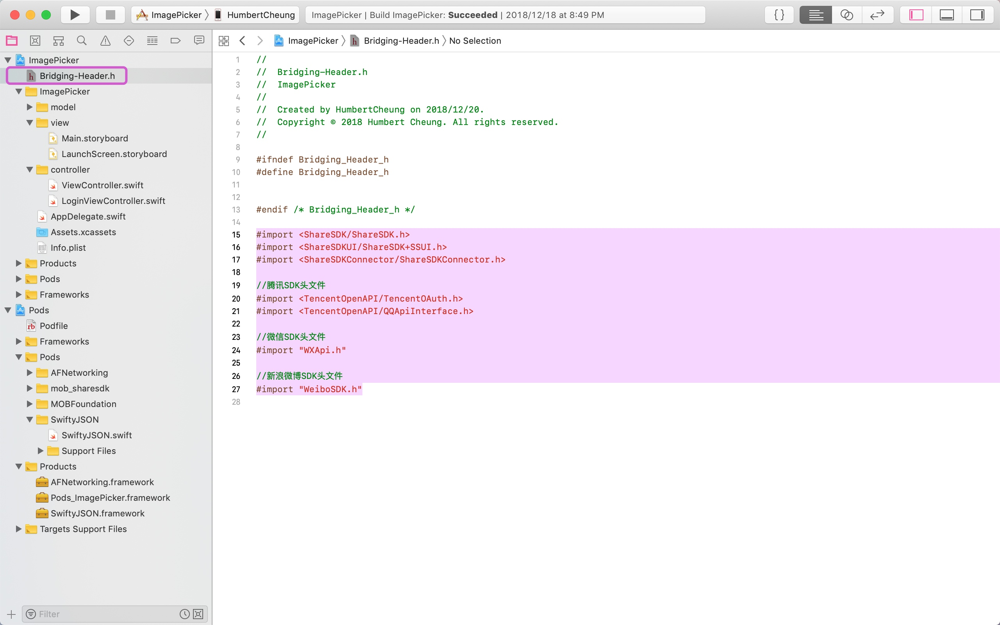

# 拓展知识（第三方登录、分享）


## 第三方登录

第三方登录，就是利用用户在第三方平台上已有的账号来快速完成自己应用的登录或者注册的功能。而这里的第三方平台，一般是已经有大量用户的平台，如国内的新浪微博、QQ，微信，外国的Facebook、twitter等等。第三方登录不是一个具体的接口，而是一种思想或者一套步骤。
要实现第三方登录，首先你需要选择一个第三方平台。新浪微博和QQ都是好的选择，这些平台拥有大量的用户，而且还开放了API，供我们调用接入。

1、开放了API
2、具备获取用户资料或至少可以进行授权验证

ShareSDK可以支持超过20种平台，我们选择使用ShqreSDK来实现第三方登录。

### 案例

在我们之前的项目`ImagePicker（SwiftyJSON版本）`，在登录模块中增加第三方登录（以QQ为例）。
具体步骤参考[官方文档](http://wiki.mob.com/%E7%AC%AC%E4%B8%89%E6%96%B9%E7%99%BB%E5%BD%95-2/)

#### 步骤

1、 通过Cocoapods安装sdk（[参考](http://wiki.mob.com/cocoapods%E9%9B%86%E6%88%90/)），所有指令如下：

```
# 主模块(必须)
pod 'mob_sharesdk'
 
# UI模块(非必须，需要用到ShareSDK提供的分享菜单栏和分享编辑页面需要以下1行)
pod 'mob_sharesdk/ShareSDKUI'
 
# 平台SDK模块(对照一下平台，需要的加上。如果只需要QQ、微信、新浪微博，只需要以下3行)
pod 'mob_sharesdk/ShareSDKPlatforms/QQ'
pod 'mob_sharesdk/ShareSDKPlatforms/SinaWeibo'
pod 'mob_sharesdk/ShareSDKPlatforms/WeChat'   //（微信sdk不带支付的命令）
# pod 'mob_sharesdk/ShareSDKPlatforms/WeChatFull' //（微信sdk带支付的命令，和上面不带支付的不能共存，只能选择一个）

# ShareSDKPlatforms模块其他平台，按需添加
pod 'mob_sharesdk/ShareSDKPlatforms/RenRen'
pod 'mob_sharesdk/ShareSDKPlatforms/AliPaySocial'
pod 'mob_sharesdk/ShareSDKPlatforms/Kakao'
pod 'mob_sharesdk/ShareSDKPlatforms/Yixin'
pod 'mob_sharesdk/ShareSDKPlatforms/Facebook'
pod 'mob_sharesdk/ShareSDKPlatforms/Messenger'
pod 'mob_sharesdk/ShareSDKPlatforms/Copy'
pod 'mob_sharesdk/ShareSDKPlatforms/Evernote'
pod 'mob_sharesdk/ShareSDKPlatforms/GooglePlus'
pod 'mob_sharesdk/ShareSDKPlatforms/Instagram'
pod 'mob_sharesdk/ShareSDKPlatforms/Instapaper'
pod 'mob_sharesdk/ShareSDKPlatforms/Line'
pod 'mob_sharesdk/ShareSDKPlatforms/Mail'
pod 'mob_sharesdk/ShareSDKPlatforms/SMS'
pod 'mob_sharesdk/ShareSDKPlatforms/WhatsApp'
pod 'mob_sharesdk/ShareSDKPlatforms/MeiPai'
pod 'mob_sharesdk/ShareSDKPlatforms/DingTalk'
pod 'mob_sharesdk/ShareSDKPlatforms/YouTube'
pod 'mob_sharesdk/ShareSDKPlatforms/Twitter'
pod 'mob_sharesdk/ShareSDKPlatforms/Dropbox'
pod 'mob_sharesdk/ShareSDKPlatforms/DingTalk'
pod 'mob_sharesdk/ShareSDKPlatforms/CMCC'
pod 'mob_sharesdk/ShareSDKPlatforms/Telegram'
pod 'mob_sharesdk/ShareSDKPlatforms/Reddit'
pod 'mob_sharesdk/ShareSDKPlatforms/DouBan'
pod 'mob_sharesdk/ShareSDKPlatforms/Flickr'
pod 'mob_sharesdk/ShareSDKPlatforms/KaiXin'
pod 'mob_sharesdk/ShareSDKPlatforms/LinkedIn'
pod 'mob_sharesdk/ShareSDKPlatforms/MingDao'
pod 'mob_sharesdk/ShareSDKPlatforms/Pinterest'
pod 'mob_sharesdk/ShareSDKPlatforms/Pocket'
pod 'mob_sharesdk/ShareSDKPlatforms/Print'
pod 'mob_sharesdk/ShareSDKPlatforms/TencentWeibo'
pod 'mob_sharesdk/ShareSDKPlatforms/Tumblr'
pod 'mob_sharesdk/ShareSDKPlatforms/VKontakte'
pod 'mob_sharesdk/ShareSDKPlatforms/YouDaoNote'
pod 'mob_sharesdk/ShareSDKPlatforms/ESurfing'
pod 'mob_sharesdk/ShareSDKPlatforms/FacebookAccount'
 
# 使用配置文件分享模块（非必需）
pod 'mob_sharesdk/ShareSDKConfigFile'
 
# 扩展模块（在调用可以弹出我们UI分享方法的时候是必需的）
pod 'mob_sharesdk/ShareSDKExtension'
```

以上指令根据需求添加，比如，如果我们需要添加第三方登录（QQ、新浪微博、微信）及其分享功能，则添加以下指令：


```
source 'https://github.com/CocoaPods/Specs.git'
platform :ios, '8.0'

target 'ImagePicker' do
use_frameworks!
pod 'AFNetworking', '~> 3.0'
pod 'SwiftyJSON', '~> 4.0'
pod 'mob_sharesdk'
pod 'mob_sharesdk/ShareSDKUI'
pod 'mob_sharesdk/ShareSDKPlatforms/QQ'
pod 'mob_sharesdk/ShareSDKPlatforms/SinaWeibo'
pod 'mob_sharesdk/ShareSDKPlatforms/WeChat'
pod 'mob_sharesdk/ShareSDKConfigFile' 
pod 'mob_sharesdk/ShareSDKExtension'
end
```

2、根据需求添加依赖框架：

```
* 必须添加的依赖库：
    libicucore.tbd
    libz.tbd
    libc++.tbd
    JavaScriptCore.framework
    
* 不同平台所需要的依赖文件如下：

    新浪微博SDK依赖库
        ImageIO.framework
        libsqlite3.tbd
        
    QQ好友和QQ空间SDK依赖库
        libsqlite3.tbd
        
    微信SDK依赖库
        libsqlite3.tbd
        
    Instagram需要依赖库
        AssetsLibrary.framework
        Photos.framework
        
    美拍需要依赖库
        AssetsLibrary.framework
```

我们需要实现QQ、新浪微博、微信的登录和分享，所以添加以下框架：


3、 在Mob官网创建一个应用，创建成功后会生成应用的Appkey和App Secret，如下：


然后将Appkey和App Secret添加到项目的info.plist文件中，如下：


4、创建桥接文件，导入以下语句


```swift
#import <ShareSDK/ShareSDK.h>
#import <ShareSDKUI/ShareSDK+SSUI.h>
#import <ShareSDKConnector/ShareSDKConnector.h>

//腾讯SDK头文件
#import <TencentOpenAPI/TencentOAuth.h>
#import <TencentOpenAPI/QQApiInterface.h>

//微信SDK头文件
#import "WXApi.h"

//新浪微博SDK头文件
#import "WeiboSDK.h"
```
如下：



5、在AppDelegate.swift中的didFinishLaunchingWithOptions方法中调用registerActivePlatforms方法来初始化SDK并且初始化第三方平台：

```swift
   func application(_ application: UIApplication, didFinishLaunchingWithOptions launchOptions: [UIApplication.LaunchOptionsKey: Any]?) -> Bool {
        
        
        /**
         *  初始化ShareSDK应用
         *
         *  @param activePlatforms          使用的分享平台集合，如:@[@(SSDKPlatformTypeSinaWeibo), @(SSDKPlatformTypeTencentWeibo)];
         *  @param importHandler           导入回调处理，当某个平台的功能需要依赖原平台提供的SDK支持时，需要在此方法中对原平台SDK进行导入操作。具体的导入方式可以参考ShareSDKConnector.framework中所提供的方法。
         *  @param configurationHandler     配置回调处理，在此方法中根据设置的platformType来填充应用配置信息
         */
        
        ShareSDK.registerActivePlatforms(
            [
                SSDKPlatformType.typeSinaWeibo.rawValue,
                SSDKPlatformType.typeWechat.rawValue,
                SSDKPlatformType.typeQQ.rawValue
            ],
            onImport: {(platform : SSDKPlatformType) -> Void in
                switch platform
                {
                case SSDKPlatformType.typeSinaWeibo:
                    ShareSDKConnector.connectWeibo(WeiboSDK.classForCoder())
                case SSDKPlatformType.typeWechat:
                    ShareSDKConnector.connectWeChat(WXApi.classForCoder())
                case SSDKPlatformType.typeQQ:
                    ShareSDKConnector.connectQQ(QQApiInterface.classForCoder(), tencentOAuthClass: TencentOAuth.classForCoder())
                default:
                    break
                }
            },
            onConfiguration: {(platform : SSDKPlatformType , appInfo : NSMutableDictionary?) -> Void in
                switch platform
                {
                case SSDKPlatformType.typeSinaWeibo:
                    //设置新浪微博应用信息,其中authType设置为使用SSO＋Web形式授权
                    appInfo?.ssdkSetupSinaWeibo(byAppKey: "568898243",
                                                appSecret: "38a4f8204cc784f81f9f0daaf31e02e3",
                                                redirectUri: "http://www.sharesdk.cn",
                                                authType: SSDKAuthTypeBoth)
                    
                case SSDKPlatformType.typeWechat:
                    //设置微信应用信息
                    appInfo?.ssdkSetupWeChat(byAppId: "wx4868b35061f87885",
                                             appSecret: "64020361b8ec4c99936c0e3999a9f249")
                case SSDKPlatformType.typeQQ:
                    //设置QQ应用信息，其中appid和appkey为QQ互联中的应用的信息，需要提前在QQ互联管理中心创建应用
                    appInfo?.ssdkSetupQQ(byAppId: "101537510",
                                         appKey: "b75212059f4e8a8fb84c41ad6de4883b",
                                         authType: SSDKAuthTypeWeb)
                default:
                    break
                }
            })
        
        return true
    }
```

QQ互联管理中心（[地址](https://connect.qq.com/manage.html#/)）应用界面如下：


6、添加支持QQ客户端登录的相关配置，如果需要支持跳转QQ登录则需要添加URL Scheme：


在新增的Type中填写URL Schemes，QQ的schemes是：“tencent+appID”（appID是我们在QQ互联中申请的AppId）如下：


7、在需要第三方登录的页面添加调用代码。我们在登录页面添加QQ登录按钮，然后在按钮的触发事件中添加登录代码：


```swift
    ShareSDK.getUserInfo(SSDKPlatformType.typeQQ) { (responseState, user, error) in
        if responseState == SSDKResponseState.success {
            print("uid=\(String(describing: user!.uid))");
            print("credential=\(String(describing: user!.credential))");
            print("token=\(String(describing: user!.credential.token))");
            print("nickname=\(String(describing: user!.nickname))");
            print("rawData=\(String(describing: user!.rawData))");
        }else if responseState == SSDKResponseState.cancel {
            print("取消")
        }else if responseState == SSDKResponseState.fail {
            print(error!)
        }
    }
```

如下：


至此，已经完成了QQ的登录配置，我们调试一下：

效果如下：


实现了，不过是网页登录的形式，用户还需要输入QQ账户和密码，是否可以直接调用QQ客户端通过QQ客户端直接授权登录？ 可以的！

在iOS 9下涉及到平台客户端跳转，系统会自动到项目info.plist下检测是否设置平台Scheme。对于需要配置的平台，如果没有配置，就无法正常跳转平台客户端。因此要支持客户端的分享和授权等，需要在Info.plist中配置Scheme名单，方法如下：

1. 在项目的info.plist中添加一项：LSApplicationQueriesSchemes，类型为Array。
2. 然后给它添加一个需要支持的项目，类型为字符串类型；

> Tips：
> QQ相关：mqq、tim、mqqopensdkapiV2等等
> 微信：wechat、weixin
> 新浪微博：sinaweibo、sinaweibohd等等
> 支付宝：alipay、alipayshare

如下：


最后我们再运行：


OK，完成，其他第三方登录配置过程类似。
参考代码：**ImagePicker_v3（第三方登录：QQ）**
最后
> 注意！
> QQ互联平台、新浪微博开放平台等都需要审核的，所以大家配置时一定要提前创建好相应平台的应用，提前审核。


## 分享

分享与第三方登录类似，也需要如上的配置，然后在需要分享的地方添加分享逻辑代码。

1、在以上项目（ImagePicker_v3（第三方登录：QQ））照片上传下方添加一个分享按钮，然后点击可以分享页面上的图片。（我们此处是分享图片，所以需要获取图片。我们选择好图片后将图片上传到服务器后，服务器会将图片的名字返回，然后我们通过名字构造好图片的URL，在分享时将图片的URL传递给分享代码即可），分享代码如下：


2、新增一个URL Types，在URL Schemes中添加QQ的AppID，其格式为：“QQ ＋ AppId的16进制”
所以需要先将AppID转换成16进制数，可以在线转换，[点击获取转换地址](http://tool.oschina.net/hexconvert/)，如下：


转换成功后填入URL Schemes中，如下：


那么至此也完成了QQ分享功能，效果如下：


## DAO

#### 几个概念

**先来了解开发过程中的几个概念**

**前台：视图层和控制层**
**后台业务层：业务层和数据层**

项目的核心通常在于后台业务层，那么什么是业务层，什么是数据层？

**数据层**：又被称为数据访问层 （Data Access Object）DAO，负责专门进行数据库的原子性操作（指不会被线程调度机制打断的操作，这种操作一旦开始，就一直运行到结束）。

业务层：又被称为业务中心，业务对象(Business Object,BO),或者叫服务层(Service)，核心的操作是调用DAO层的操作以完成整体项目的业务设计。

业务层是整个程序提供的功能，当我们需要完成一个业务层的操作时可能会包含多个数据层的操作，数据层完成的只是一个个简单的原子性的数据库操作。而我们在实际开发中，每一个操作的业务往往都会涉及到多个原子性的操作。


DAO，即Data Access Object ，是一种数据接口模式，可以作为数据持久化的设计来实现CRUD：增加(Create)、重新取得数据(Retrieve)、更新(Update)和删除(Delete)。

具体的来说，DAO 数据访问对象是一个面向对象的接口，通过它去直接操作数据库, 针对数据的增添、删除、修改、查找，主要为业务逻辑层或视图层提供数据服务，可以将数据访问操作和上层的业务逻辑分离，降低了耦合性。

在对DAO进行封装时，可以参照以下两个原则：

* 数据库中的一张表（或者一个实体），相应的封装一个DAO

* DAO接口，需要由具体的类型定义，这样就可以避免被错误地调用

