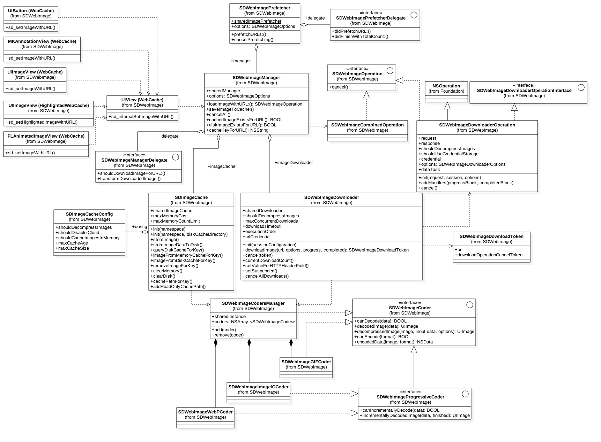
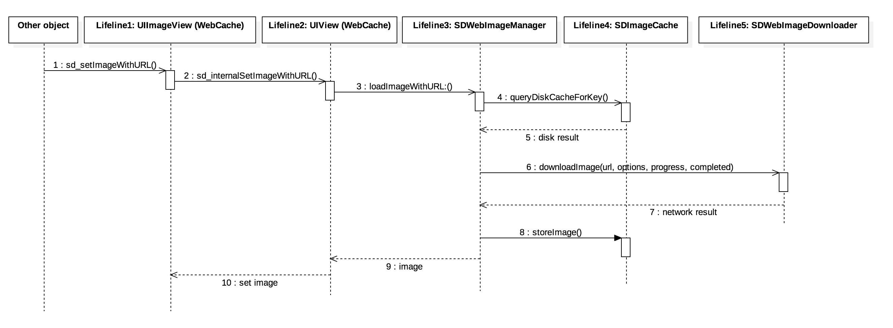
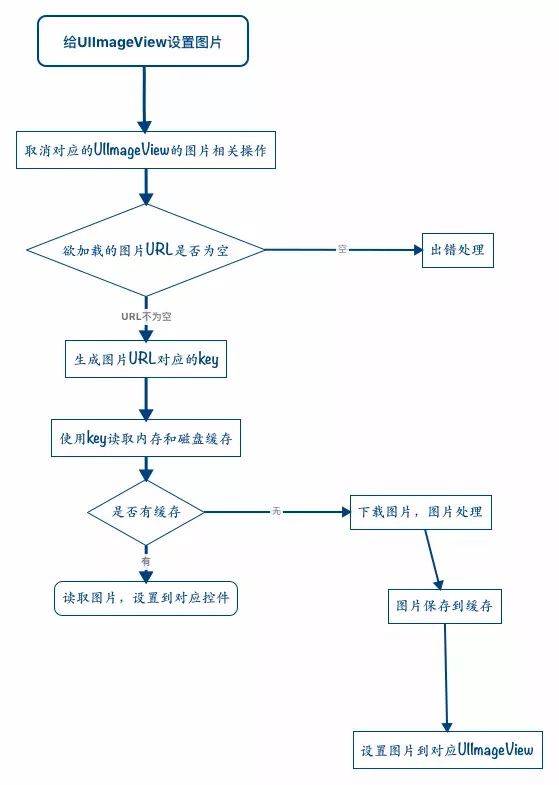
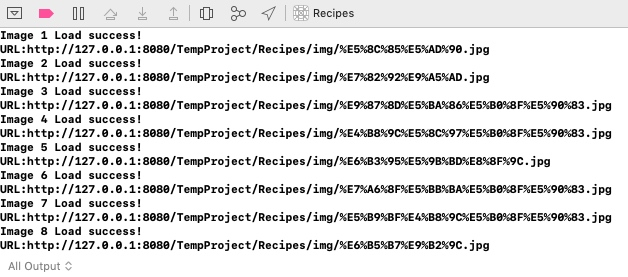
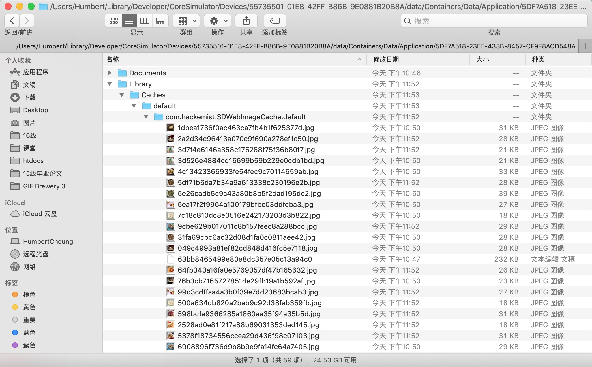
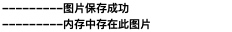

# SDWebImage


在iOS的图片加载框架中，SDWebImage可谓是占据大半壁江山。它支持从网络中下载且缓存图片，并设置图片到对应的UIImageView控件或者UIButton控件。在项目中使用SDWebImage来管理图片加载相关操作可以极大地提高开发效率，让我们更加专注于业务逻辑实现。

1. 针对UIImageView、UIButton控件以category的方式来加载网络图片并且对网络图片的缓存进行管理
2. 采用异步方式来下载网络图片
3. 采用异步方式，使用memory＋disk来缓存网络图片，自动管理缓存。
4. 背景图片压缩
5. 支持WebP格式
6. 同一个URL的网络图片不会被重复下载
7. 失效的URL不会被无限重试
8. 耗时操作都在子线程，确保不会阻塞主线程
9. 使用GCD和ARC
10. 支持Arm64

整体架构如下：







### SDWebImage 流程




### 使用要点


1. 图片下载完成之后，会自动保存在沙箱中，文件路径是经过md5加密后的URL；
2. 如果沙箱中已经缓存了之前下载好的图片，那么后续我们在使用SD 通过URL加载图像，都会先加载本地沙箱中的图片；
3. 当我们在加载缓存的图片时是不会发起网络请求，不过仍然会调用回调方法

### 图片下载

#### 方法一

```swift
sd_setImage(with: URL?) { (UIImage?, Error?, SDImageCacheType, URL?) in
        
}
```
此方法为UIImageView扩展中的方法，可以通过此方法来请求图片并进行展示。在此方法中，我们可以通过URL来请求图片，在尾随闭包中我们可以获得去获取请求成功后的图片、图片的url等信息。

如下：

```swift
let urlString = "\(ImageBaseURL)\(items[indexPath.row].icon).jpg".addingPercentEncoding(withAllowedCharacters: .urlQueryAllowed)
cell.iconView.sd_setImage(with: URL(string: urlString!)!) { (image, error, cacheType, imageUrl) in
    if image != nil {
        print("Image \(indexPath.row + 1) Load success!")
        print("URL:\(String(describing: imageUrl!))")
    }
}
```

输出：



#### 方法二

```swift
sd_setImage(with: URL?, placeholderImage: UIImage?, options: SDWebImageOptions) { (UIImage?, Error?, SDImageCacheType, URL?) in
           
}
```
在通过URL请求图片时，我们还可以给imageView设置占位图，也可以设置请求的图片时相关的配置信息。

如下：


```swift
let urlString = "\(ImageBaseURL)\(items[indexPath.row].icon).jpg".addingPercentEncoding(withAllowedCharacters: .urlQueryAllowed)
cell.iconView.sd_setImage(with: URL(string: urlString!)!, placeholderImage: UIImage(named: "placeholder"), options: .allowInvalidSSLCertificates) { (image, error, cacheType, imageUrl) in
    if image != nil {
        print("Image \(indexPath.row + 1) Load success!")
        print("URL:\(String(describing: imageUrl!))")
    }
}
```

输出：


> **注意：**
> 如果请求被取消了，那么不管是请求成功还是请求失败，closure都不会被调用。

###### 常用的SDWebImageOptions

```swift
//失败后重试
SDWebImageRetryFailed = 1 << 0,
  
//UI交互期间开始下载，导致延迟下载比如UIScrollView减速。
SDWebImageLowPriority = 1 << 1,
  
//只进行内存缓存
SDWebImageCacheMemoryOnly = 1 << 2,
  
//这个标志可以渐进式下载,显示的图像是逐步在下载
SDWebImageProgressiveDownload = 1 << 3,
  
//刷新缓存
SDWebImageRefreshCached = 1 << 4,
  
//后台下载
SDWebImageContinueInBackground = 1 << 5,
  
//NSMutableURLRequest.HTTPShouldHandleCookies = YES;
  
SDWebImageHandleCookies = 1 << 6,
  
//允许使用无效的SSL证书
SDWebImageAllowInvalidSSLCertificates = 1 << 7,
  
//优先下载
SDWebImageHighPriority = 1 << 8,
  
//延迟占位符
SDWebImageDelayPlaceholder = 1 << 9,
  
//改变动画形象
SDWebImageTransformAnimatedImage = 1 << 10,
```

我们也可以使用SD所提供的SDWebImageManager和SDWebImageDownloader的单例对象来请求图片。

#### 方法三

使用SDWebImageDownloader来异步请求图片，会预先将需要的图片下载好，不过需要注意的是，此方式是没有缓存机制的。

```swift
SDWebImageDownloader.shared().downloadImage(with: URL?, options: SDWebImageDownloaderOptions, progress: { (Int, Int, URL?) in
    
}) { (UIImage?, Data?, Error?, Bool) in
    
}
```

在此方法中，我们可以去获取图片在下载过程中的进度，通过pregress的闭包来获取，此闭包中的三个参数，依次是：已接收到的图片资源的大小，图片资源的总大小，图片的url。

如下：


```swift
let urlString = "\(ImageBaseURL)\(items[indexPath.row].icon).jpg".addingPercentEncoding(withAllowedCharacters: .urlQueryAllowed)
SDWebImageDownloader.shared().downloadImage(with: URL(string: urlString!)!, options: .allowInvalidSSLCertificates, progress: { (receivedSize, expectedSize, url) in
    print("图片加载中,已接收大小：\(receivedSize)， 总大小：\(expectedSize))")
    print("URL:\(String(describing: url!))")
}) { (image, error, cacheType, imageUrl) in
    if image != nil {
        print("图片请求成功")
        cell.iconView.image = image
        print("Image \(indexPath.row + 1) Load success!")
    }
}
```


#### 方法四

我们还可以使用SDWebImageManager来请求图片，此方式是会使用==缓存机制==来缓存图片的，会预先将需要的图片下载好。


```swift
let urlString = "\(ImageBaseURL)\(items[indexPath.row].icon).jpg".addingPercentEncoding(withAllowedCharacters: .urlQueryAllowed)
SDWebImageManager.shared().loadImage(with: URL(string: urlString!)!, options: .allowInvalidSSLCertificates, progress: { (receivedSize, expectedSize, url) in
    print("图片加载中,已接收大小：\(receivedSize)， 总大小：\(expectedSize))")
    print("URL:\(String(describing: url!))")
}) { (image, data, error, cacheType, finish, imageUrl) in
    if image != nil {
        print("图片请求成功，并完成缓存")
        cell.iconView.image = image
        print("Image \(indexPath.row + 1) Load success!")
    }
}
```

### 取消下载

我们也可以取消下载，通过以下的几个方法来实现


```swift
cell.iconView.sd_cancelCurrentImageLoad()

cell.iconView.cancelImageDownloadTask()

cell.iconView.sd_cancelImageLoadOperation(withKey: String?)
```

#### 操作缓存


 **Memory Cache：内存
 Disk Cache：磁盘**
> 
> 两者的最大的区别在于，当退出进程时，内存中的数据会被清空，而磁盘的数据不会。所以，在下次再进入该进程时，该进程仍可以从Disk Cache中获得数据，而Memory cache则不行。 

##### 缓存位置

*Disk Cache目录位于哪里？*

* 缓存在沙箱目录下 `Library/Caches`中

* 默认情况下，完整目录为 `~/Library/Caches/default/com.hackemist.SDWebImageCache.default`




###### 缓存中查找图片

在SD中，SDImageCache类的单例对象可以用来操作我们的缓存。如果我们需要查询缓存中是否存在某图片则可以通过以下两个方法进行查找：

```swift
queryCacheOperation(forKey: String?) { (UIImage?, Data?, SDImageCacheType) in
            
}
queryCacheOperation(forKey: String?, options: SDImageCacheOptions) { (UIImage?, Data?, SDImageCacheType) in
            
}
```

在查询过程中，是通过缓存键（cache key）来查找的，缓存键是一个程序中图像缓存的唯一标识符，通常是图像的url。


```swift
let urlString = "\(ImageBaseURL)\(items[indexPath.row].icon).jpg".addingPercentEncoding(withAllowedCharacters: .urlQueryAllowed)
// 用缓存单例对象，通过图片的画url来查询缓存中是否z存在该图片
SDImageCache.shared().queryCacheOperation(forKey: urlString) { (image, data, cacheType) in
    // 缓存中存在此图像
    if image != nil {
        print("缓存中存在此图片")
        cell.iconView.image = image
        
        // 缓存中不存在
    }else{
        // 请求图片，并使用缓存机制将图片存储起来
        SDWebImageManager.shared().loadImage(with: URL(string: urlString!)!, options: .allowInvalidSSLCertificates, progress: { (receivedSize, expectedSize, url) in
            print("图片加载中,已接收大小：\(receivedSize)， 总大小：\(expectedSize))")
            print("URL:\(String(describing: url!))")
        }) { (image, data, error, cacheType, finish, imageUrl) in
            if image != nil {
                print("图片请求成功，并完成缓存")
                cell.iconView.image = image
                print("Image \(indexPath.row + 1) Load success!")
            }
        }
    }
}
```

默认情况下，图像将被存储在内存上的缓存以及磁盘上的缓存中（异步）。我们可以去判断图片是否在内存中或在缓存中，通过以下方法：

```swift
if let image = SDImageCache.shared().imageFromMemoryCache(forKey: urlString) {
    print("内存中存在此图片")
}
    
if let image = SDImageCache.shared().imageFromDiskCache(forKey: urlString) {
    print("磁盘中存在此图片")
}
```

###### 图片保存进缓存

如果我们需要将图片保存进缓存中，我们也可以调用以下的方法进行手动存储：


```swift
store(UIImage?, forKey: String?) {
        
}
```

如下代码：


```swift
SDImageCache.shared().store(UIImage(named: "placeholder"), forKey: "PImg") {
    print("---------图片保存成功")
}
    
if let image = SDImageCache.shared().imageFromMemoryCache(forKey: "PImg") {
    print("---------内存中存在此图片")
}
    
if let image = SDImageCache.shared().imageFromDiskCache(forKey: "PImg") {
    print("----------磁盘中存在此图片")
}
```

运行结果如下，会讲图片同时保存进内存和磁盘的缓存中：


如果只是仅仅想把图片保存进内存中，那么我们可以调用另一个包含toDisk参数的方法，将参数值设置成false即可

```swift
// 如果只是仅仅想把图片保存进内存中，那么我们可以将toDisk设置成false即可
store(UIImage?, forKey: String?, toDisk: Bool) {
            
}
```

如下代码：


```swift
SDImageCache.shared().store(UIImage(named: "placeholder"), forKey: "PImg", toDisk: false) {
    print("---------图片保存成功")
}
    
if let image = SDImageCache.shared().imageFromMemoryCache(forKey: "PImg") {
    print("---------内存中存在此图片")
}
    
if let image = SDImageCache.shared().imageFromDiskCache(forKey: "PImg") {
    print("----------磁盘中存在此图片")
}
```
运行结果为：



##### 清除缓存

1、清除内存中的缓存


```swift
SDImageCache.shared().clearMemory()
```

2、清除磁盘中的缓存


```swift
SDImageCache.shared().clearDisk {
           
}
```

##### 其他操作

1、获取磁盘缓存中图片的数量

```swift
SDImageCache.shared().getDiskCount()

print("磁盘缓存中图片的数量：\(SDImageCache.shared().getDiskCount())")
```

2、获取磁盘缓存中图片的大小


```swift
SDImageCache.shared().getSize()

print("磁盘缓存中图片的大小：\(SDImageCache.shared().getSize())")
```

3、判断磁盘缓存中是否存在网络中的图片

```swift
SDImageCache.shared().diskImageDataExists(withKey: String?)

let str = "http://172.16.86.73:8080/TempProject/Recipes/img/%E5%8C%85%E5%AD%90.jpg"
print("是否存在:\(SDImageCache.shared().diskImageDataExists(withKey: str))")
```

4、直接从缓存中提取图片

```swift
SDImageCache.shared().imageFromDiskCache(forKey: String?)

SDImageCache.shared().imageFromMemoryCache(forKey: String?)
```

5、直接删除缓存中的图片


```swift
SDImageCache.shared().removeImage(forKey: String?) {
            
}
```


