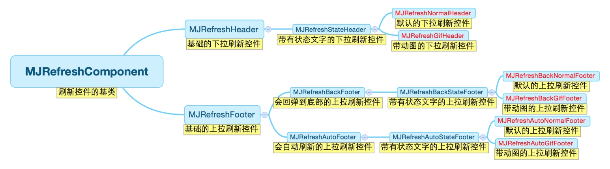
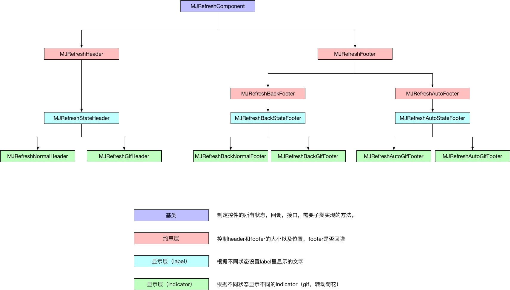

# MJRefresh

MJRefresh用于为应用添加常用的上拉加载更多与下拉刷新效果,适用 UIScrollView 、 UITableView 、 UICollectionView 、 UIWebView.



每个类间的关系以及各类的功能如下图：




### MJRefreshComponent

刷新控件的基类，常用的属性和方法如下：


```swift
属性：

    /** 根据拖拽比例自动切换透明度 */
    open var isAutomaticallyChangeAlpha: Bool
    
    /** 正在刷新的回调 */
    open var refreshingBlock: MJRefreshComponentRefreshingBlock!
    
    /** 回调对象 */
    weak open var refreshingTarget: AnyObject!
    
    /** 回调方法 */
    weak open var refreshingAction: SEL;
    
    /** 开始刷新后的回调(进入刷新状态后的回调) */
    open var beginRefreshingCompletionBlock: MJRefreshComponentbeginRefreshingCompletionBlock!
    
    /** 结束刷新的回调 */
    open var endRefreshingCompletionBlock: MJRefreshComponentEndRefreshingCompletionBlock!
    
    /** 是否正在刷新 */
    open var isRefreshing: Bool { get }
    
    /** 刷新状态 一般交给子类内部实现 */
    open var state: MJRefreshState

方法：

    /** 设置回调对象和回调方法 */
    open func setRefreshingTarget(Any!, refreshingAction: Selector!)

    /** 进入刷新状态 */
    open func beginRefreshing()
    
    open func beginRefreshing(completionBlock: (() -> Void)!)
    
    /** 结束刷新状态 */
    open func endRefreshing()
    
    open func endRefreshing(completionBlock: (() -> Void)!)
```


### MJRefreshHeader

MJRefreshComponent的子类，头部刷新控件。常用的属性和方法如下：

```swift
属性：

    /** 这个key用来存储上一次下拉刷新成功的时间 */
    @property (copy, nonatomic) NSString *lastUpdatedTimeKey;
    /** 上一次下拉刷新成功的时间 */
    @property (strong, nonatomic, readonly) NSDate *lastUpdatedTime;

    /** 忽略多少scrollView的contentInset的top */
    @property (assign, nonatomic) CGFloat ignoredScrollViewContentInsetTop;

方法：

    /** 创建header */
    + (instancetype)headerWithRefreshingBlock:(MJRefreshComponentRefreshingBlock)refreshingBlock;
    /** 创建header */
    + (instancetype)headerWithRefreshingTarget:(id)target refreshingAction:(SEL)action;
    
    使用方式：
    
    let header = MJRefreshHeader {
        // 刷新操作      
    }
    let header = MJRefreshHeader(refreshingTarget: self, refreshingAction: #selector(headerRefreshAction(sender:)))
```

##### 几种常用的Header子类：

###### MJRefreshNormalHeader

默认头部刷新控件。

```swift
属性：
    /** 箭头视图 */
    @property (weak, nonatomic, readonly) UIImageView *arrowView;
    /** 菊花的样式 */
    @property (assign, nonatomic) UIActivityIndicatorViewStyle activityIndicatorViewStyle;
```

###### MJRefreshGifHeader

此类可以设置动画

```swift
属性：

    @property (weak, nonatomic, readonly) UIImageView *gifView;
    
方法：

    /** 设置state状态下的动画图片images 动画持续时间duration*/
    - (void)setImages:(NSArray *)images duration:(NSTimeInterval)duration forState:(MJRefreshState)state;
    - (void)setImages:(NSArray *)images forState:(MJRefreshState)state;

    使用方式：
    
    header.setImages([UIImage(named: "dropdown_anim__00045")!], for: .idle)
    header.setImages([UIImage(named: "dropdown_anim__00045")!], duration: 1, for: .idle)
```

> Tips：
> 刷新控件的状态即MJRefreshState如下：

> ```swift
> typedef NS_ENUM(NSInteger, MJRefreshState) {
>     /** 普通闲置状态 */
>     MJRefreshStateIdle = 1,
>     /** 松开就可以进行刷新的状态 */
>     MJRefreshStatePulling,
>     /** 正在刷新中的状态 */
>     MJRefreshStateRefreshing,
>     /** 即将刷新的状态 */
>     MJRefreshStateWillRefresh,
>     /** 所有数据加载完毕，没有更多的数据了 */
>     MJRefreshStateNoMoreData
> };
> ```

### MJRefreshFooter

MJRefreshComponent的子类，尾部刷新控件。常用的属性和方法如下：

```swift
方法：

    /** 创建footer */
    + (instancetype)footerWithRefreshingBlock:(MJRefreshComponentRefreshingBlock)refreshingBlock;
    /** 创建footer */
    + (instancetype)footerWithRefreshingTarget:(id)target refreshingAction:(SEL)action;
    
    /** 提示没有更多的数据 */
    - (void)endRefreshingWithNoMoreData;
    
    /** 重置没有更多的数据（消除没有更多数据的状态） */
    - (void)resetNoMoreData;
```

##### 几种常用的Footer子类：

###### MJRefreshAutoFooter


```swift
方法：

    /** 是否自动刷新(默认为YES) */
    @property (assign, nonatomic, getter=isAutomaticallyRefresh) BOOL automaticallyRefresh;
    
    /** 当底部控件出现多少时就自动刷新(默认为1.0，也就是底部控件完全出现时，才会自动刷新) */
    @property (assign, nonatomic) CGFloat triggerAutomaticallyRefreshPercent;
    
    /** 是否每一次拖拽只发一次请求 */
    @property (assign, nonatomic, getter=isOnlyRefreshPerDrag) BOOL onlyRefreshPerDrag;
```

###### MJRefreshAutoNormalFooter

与MJRefreshNormalHeader类似

###### MJRefreshAutoGifFooter

与MJRefreshGifHeader类似

#### UIScrollView扩展


```swift
属性：

    /** 下拉刷新控件 */
    open var mj_header: MJRefreshHeader!
    
    /** 上拉刷新控件 */
    open var mj_footer: MJRefreshFooter!

 方法：
    
    open func mj_totalDataCount() -> Int

    open var mj_reloadDataBlock: ((Int) -> Void)!
```

#### 其他操作


```swift
// 隐藏时间
header.lastUpdatedTimeLabel.isHidden = true

// 隐藏状态
header.stateLabel.isHidden = true

```


